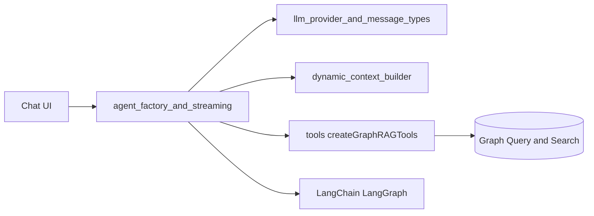
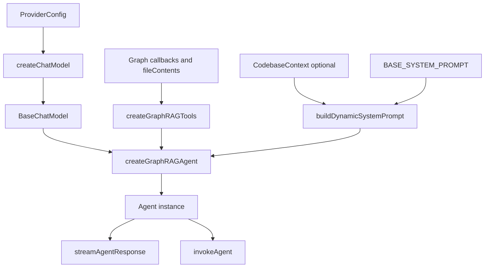
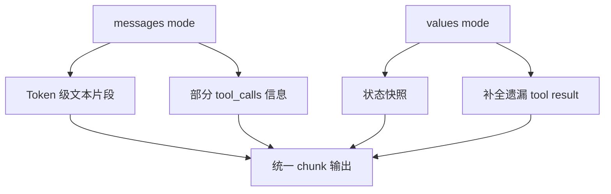
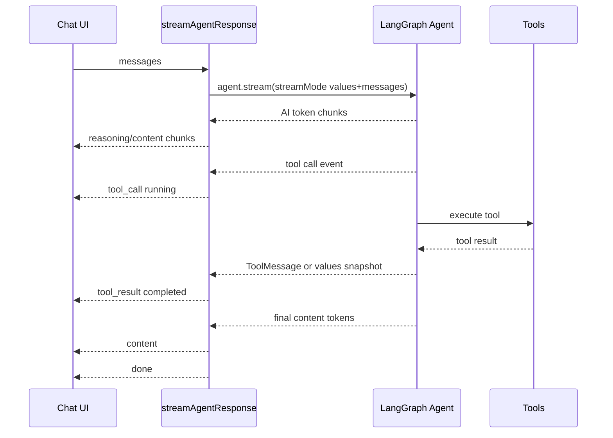
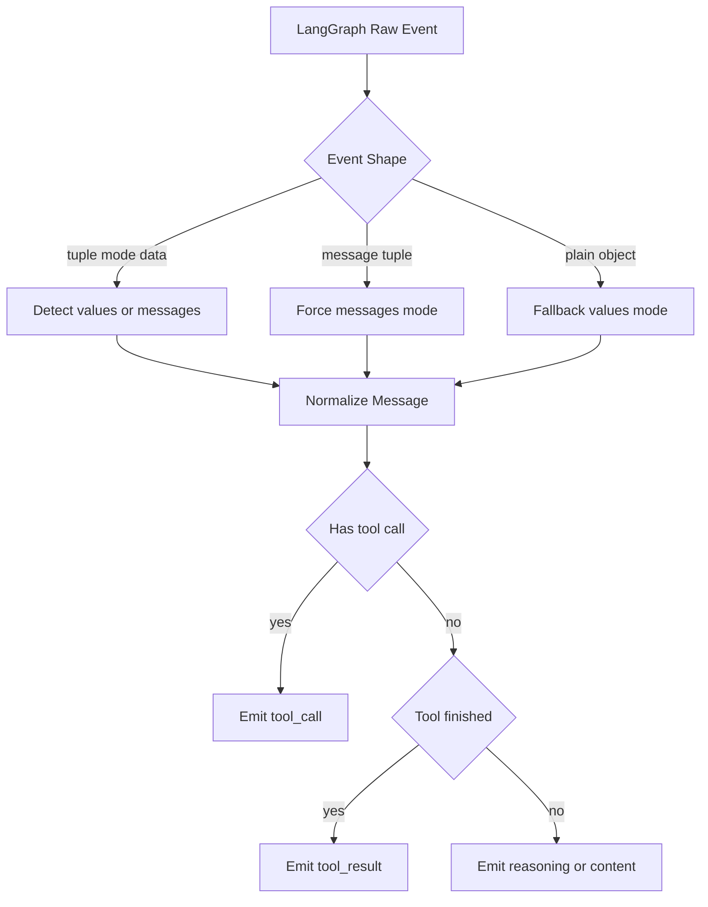

# agent_factory_and_streaming

## 模块简介

`agent_factory_and_streaming` 模块位于 `gitnexus-web/src/core/llm/agent.ts`，是 Web 端 LLM Agent 子系统中最核心的执行入口之一。它解决的是一个非常具体但复杂的问题：如何把“多模型供应商配置 + 图谱检索工具 + 对话消息 + 流式 UI 展示”组合成一个可稳定运行的 Graph RAG Agent。

从职责上看，这个模块并不负责定义所有类型契约（这些在 [llm_provider_and_message_types.md](llm_provider_and_message_types.md) 中），也不负责生成动态代码库上下文（见 [dynamic_context_builder.md](dynamic_context_builder.md)）。它专注于三件事：第一，基于 `ProviderConfig` 构建可用的聊天模型实例；第二，创建一个携带系统提示词与工具集合的 ReAct agent；第三，把 LangGraph 的多种流事件整理成 UI 可消费的统一 `AgentStreamChunk` 序列。

该模块存在的价值在于“编排层收敛”。如果没有它，调用方需要自己处理 provider 差异、工具注入、流模式差异、重复事件去重、工具调用状态跟踪等细节。这个模块把这些低层复杂度封装为 `createGraphRAGAgent`、`streamAgentResponse`、`invokeAgent` 三个主入口，使上层 UI 和状态管理只需要关注消息输入输出。

---

## 在系统中的位置与依赖关系



上图展示了它作为“桥接层”的角色。左侧是 UI，右侧是具体执行能力。该模块向上暴露稳定接口，向下适配 LangChain/LangGraph 和各类 provider SDK。尤其要注意，`tools` 的真实查询能力（`cypher`、`search`、`read`、`impact` 等）在 `./tools` 中定义，本模块只负责注入和流式编排，不重复实现工具语义。

---

## 核心流程总览



这个流程体现了模块设计的“先构建、后执行”思路：先固定模型、工具和系统提示词，再通过流式或非流式两种方式驱动一次会话。流式路径面向交互体验，非流式路径面向简单调用和测试。

---

## 核心组件详解

## `BASE_SYSTEM_PROMPT`

`BASE_SYSTEM_PROMPT` 是一个很长的系统级指令模板，目的是把 Agent 强制约束到“基于证据的代码分析”轨道上。提示词内含多个强制原则：必须引用、必须验证、优先使用图查询验证、工具失败需重试、输出偏向表格与 Mermaid、并给出 TLDR。

从工程设计角度，这个提示词不是“装饰文本”，而是行为契约。它和工具能力是配套的：提示词要求引用和验证，工具集合提供 `read`、`cypher`、`search`、`impact` 等实现路径，二者共同降低模型幻觉和拍脑袋回答的概率。

该提示词还明确了图语义约定（如 `CALLS` 同时覆盖调用与构造注入、`Process` 名称是启发式标签），这能避免模型对图谱边含义产生错误假设。

**副作用与注意事项：**
- 提示词很长，会占用上下文窗口，尤其在小模型上可能影响工具调用稳定性。
- 提示词内部包含“必须使用 Mermaid”等风格要求，若前端不支持 Mermaid 渲染，体验会受影响。
- 文本里存在 `Cyfer` 拼写（应为 `cypher`）等小瑕疵，虽不一定阻断执行，但可能影响模型一致性。

---

## `createChatModel(config: ProviderConfig): BaseChatModel`

该函数负责将统一的 `ProviderConfig` 分派到具体 SDK 客户端，返回 LangChain 可消费的 `BaseChatModel`。它是 provider 抽象层的关键实现。

### 内部行为

函数通过 `switch(config.provider)` 分支处理：

- `openai`：创建 `ChatOpenAI`，校验 `apiKey` 非空，支持 `baseUrl`，开启 `streaming: true`。
- `azure-openai`：创建 `AzureChatOpenAI`，通过 `extractInstanceName(endpoint)` 推导实例名，默认 `apiVersion` 为 `2024-12-01-preview`。
- `gemini`：创建 `ChatGoogleGenerativeAI`，映射 `maxTokens -> maxOutputTokens`。
- `anthropic`：创建 `ChatAnthropic`，默认 `maxTokens` 为 `8192`。
- `ollama`：创建 `ChatOllama`，默认本地地址，显式放宽 `numPredict: 30000` 与 `numCtx: 32768`，提高 agent 工具循环成功率。
- `openrouter`：复用 `ChatOpenAI`，同时设置 `openAIApiKey` 与 `apiKey` 作为兼容兜底，默认 `baseURL` 为 OpenRouter 地址。

当 `provider` 不在支持列表内时抛出 `Unsupported provider` 异常。

### 参数与返回

- 参数 `config`：联合类型 `ProviderConfig`，具体字段定义请参考 [llm_provider_and_message_types.md](llm_provider_and_message_types.md)。
- 返回值：`BaseChatModel`，作为 `createReactAgent` 的 `llm` 输入。

### 错误条件与边界

- OpenAI/OpenRouter 的空 `apiKey` 会立刻抛错，属于 fail-fast。
- Azure 分支当前未显式校验 `apiKey/endpoint/deploymentName` 是否为空，错误更可能延后到 SDK 请求期。
- 不同 provider 对 `temperature`、`maxTokens` 的语义不完全一致，函数做的是“尽量映射”而非“统一行为保证”。

---

## `extractInstanceName(endpoint: string): string`

这是 Azure 适配用的小工具函数，用于从完整 endpoint 中提取实例名。它先尝试 `new URL(endpoint)`，再匹配 `*.openai.azure.com` 主机格式；若失败则降级为主机第一段；再失败就直接返回原始字符串。

这个设计体现了鲁棒性优先：宁可给 SDK 一个“可能可用”的值，也不在预处理阶段中断。但也意味着当 endpoint 异常时，错误不会在这里暴露，而会在后续请求时体现。

---

## `createGraphRAGAgent(...)`

这是模块最关键的工厂函数，用于组装完整 Agent。

### 签名与参数语义

```ts
createGraphRAGAgent(
  config: ProviderConfig,
  executeQuery: (cypher: string) => Promise<any[]>,
  semanticSearch: (query: string, k?: number, maxDistance?: number) => Promise<any[]>,
  semanticSearchWithContext: (query: string, k?: number, hops?: number) => Promise<any[]>,
  hybridSearch: (query: string, k?: number) => Promise<any[]>,
  isEmbeddingReady: () => boolean,
  isBM25Ready: () => boolean,
  fileContents: Map<string, string>,
  codebaseContext?: CodebaseContext
)
```

这些参数本质上是对工具层依赖的注入。函数内部调用 `createGraphRAGTools(...)` 生成工具集合，再与模型和系统提示词一起传给 `createReactAgent`。

### 关键行为

1. 调用 `createChatModel(config)` 获取具体模型。
2. 调用 `createGraphRAGTools(...)` 构建工具。
3. 如果传入 `codebaseContext`，使用 `buildDynamicSystemPrompt(BASE_SYSTEM_PROMPT, codebaseContext)` 在提示词末尾追加当前代码库上下文；否则使用基础提示词。
4. 在开发环境输出完整系统提示词日志。
5. 创建并返回 agent。

### 设计意义

这种依赖注入方式让模块具备高可测试性：测试时可传入 mock `executeQuery`/`hybridSearch` 等函数，不依赖真实后端即可验证 agent 编排逻辑。

---

## `AgentMessage`

```ts
interface AgentMessage {
  role: 'user' | 'assistant';
  content: string;
}
```

这是会话输入的最小消息结构。它故意保持简洁，不直接暴露 tool/system 类型，便于 UI 层构建稳定消息列表。更丰富的流事件结构由 `AgentStreamChunk` 承担。

---

## `streamAgentResponse(agent, messages): AsyncGenerator<AgentStreamChunk>`

该函数是本模块最复杂的实现，目标是把 LangGraph 的混合流（`values` + `messages`）转化为统一、可增量渲染的 `AgentStreamChunk`。

### 为什么同时使用两种 streamMode



`messages` 模式擅长逐 token 输出，但可能漏掉某些结构化状态；`values` 模式有完整状态快照，但不适合细粒度文本流。该实现将二者结合，并做去重和状态跟踪，兼顾“可读进度感”和“结构准确性”。

### 主要内部状态机

函数维护以下关键状态：

- `yieldedToolCalls` / `yieldedToolResults`：避免重复发出同一工具事件。
- `lastProcessedMsgCount`：只处理 `values` 模式中新增加的消息。
- `allToolsDone`：区分当前文本应归类为 `reasoning` 还是最终 `content`。
- `hasSeenToolCallThisTurn`：确保首次工具调用前的文本都视为推理/叙述。

### 输出 chunk 类型

与 `AgentStreamChunk` 对齐，可能输出：

- `reasoning`：推理/叙述过程文本。
- `tool_call`：工具调用开始，状态通常为 `running`。
- `tool_result`：工具执行结果，状态通常为 `completed`。
- `content`：最终答案文本流。
- `done`：正常结束。
- `error`：异常结束。

### 关键实现细节

函数能够处理 `msg.content` 既可能是字符串，也可能是 content block 数组（如 `{type: 'text', text: '...'}`）。另外，在 `tool_calls` 参数解析中，对 OpenAI function-call 风格会尝试 `JSON.parse(tc.function.arguments)`。

### 已知风险与限制

- `JSON.parse(tc.function.arguments)` 未加本地 try/catch，若供应商返回非 JSON 参数字符串，可能直接进入外层异常并输出 `error`。
- `allToolsDone` 的布尔状态是启发式近似；多工具并发或交错分块时，`reasoning/content` 分类可能与模型真实阶段略有偏差。
- 使用 `as any` 适配 LangGraph 事件结构，编译期类型保护较弱，SDK 升级时有潜在破坏风险。

---

## `invokeAgent(agent, messages): Promise<string>`

这是非流式简化入口。它调用 `agent.invoke({ messages })` 后直接读取结果中的最后一条消息内容。

适用于无需实时反馈的场景，例如后台任务、单轮问答测试、或需要最小实现复杂度的调用路径。若未生成内容，函数返回 `'No response generated.'` 兜底字符串。

---

## 交互时序（流式）



该时序强调了本模块的核心职责：不是产生分析结果本身，而是把 agent 执行过程翻译为 UI 可追踪的事件流。

---

## 使用示例

## 1) 创建 Agent 并流式消费

```ts
import { createGraphRAGAgent, streamAgentResponse } from '@/core/llm/agent';

const agent = createGraphRAGAgent(
  providerConfig,
  executeQuery,
  semanticSearch,
  semanticSearchWithContext,
  hybridSearch,
  () => embeddingReady,
  () => bm25Ready,
  fileContentsMap,
  codebaseContext // optional
);

const messages = [{ role: 'user', content: '分析登录流程中的权限检查链路' }];

for await (const chunk of streamAgentResponse(agent, messages)) {
  if (chunk.type === 'reasoning') appendReasoning(chunk.reasoning ?? '');
  if (chunk.type === 'tool_call') showToolRunning(chunk.toolCall);
  if (chunk.type === 'tool_result') showToolResult(chunk.toolCall);
  if (chunk.type === 'content') appendAnswer(chunk.content ?? '');
  if (chunk.type === 'error') showError(chunk.error ?? 'Unknown error');
  if (chunk.type === 'done') finalize();
}
```

## 2) 非流式调用

```ts
import { invokeAgent } from '@/core/llm/agent';

const answer = await invokeAgent(agent, [
  { role: 'user', content: '列出支付模块核心依赖并给出证据' },
]);
```

---

## 可扩展性指南

如果你要新增 provider（例如 `xai`），建议按以下路径扩展：

1. 在类型层新增 provider 与配置接口（参考 [llm_provider_and_message_types.md](llm_provider_and_message_types.md)）。
2. 在 `createChatModel` 新增 `case`，实现配置映射与必要校验。
3. 在设置页与持久化层添加对应配置编辑能力。
4. 补充最小集成测试，验证 streaming 与工具调用回路可用。

如果你要增强流式事件语义（比如加入 `token_usage`），应先扩展 `AgentStreamChunk`，再在 `streamAgentResponse` 中做无破坏兼容，避免影响现有 UI reducer。

---

## 运行与排障建议

在 `import.meta.env.DEV` 下，该模块会打印 provider 配置摘要、系统提示词和流事件调试信息。排查问题时，优先检查：

- provider 密钥和 endpoint 是否正确。
- 工具函数注入是否可用（尤其 `executeQuery` 与检索 readiness）。
- 是否出现 tool 参数 JSON 解析错误。
- SDK 版本变更是否导致消息结构字段变化（`_getType`, `tool_calls`, `tool_call_id`）。

当出现“只有 reasoning 没有 final content”时，通常意味着工具循环未收敛或模型仍在中间步骤；当直接 `error` 结束时，常见原因是 provider 认证失败或 tool-call 参数格式异常。

---

## 与其他文档的关系

- Provider 配置、消息与流事件类型定义：见 [llm_provider_and_message_types.md](llm_provider_and_message_types.md)。
- 动态上下文构建机制与 `CodebaseContext` 结构：见 [dynamic_context_builder.md](dynamic_context_builder.md)。
- 图检索与工具语义（`search/cypher/read/impact`）建议在工具模块文档中展开，本文不重复。


---

## 补充：Provider 配置与行为对照

下面这张表帮助你在接入不同模型时快速判断“是否可直接替换”。虽然 `createChatModel` 对外统一返回 `BaseChatModel`，但内部参数语义并非完全等价。

| Provider | 必填字段 | 默认值策略 | 代码中的特殊处理 | 常见失败点 |
|---|---|---|---|---|
| openai | `apiKey`, `model` | `temperature=0.1` | 支持 `baseUrl`，显式 fail-fast 校验 API Key | Key 为空、代理地址不兼容 |
| azure-openai | `apiKey`, `endpoint`, `deploymentName` | `apiVersion='2024-12-01-preview'` | 通过 `extractInstanceName` 从 endpoint 推导 instanceName | endpoint 格式异常、deploymentName 不存在 |
| gemini | `apiKey`, `model` | `temperature=0.1` | `maxTokens` 映射到 `maxOutputTokens` | 模型名写错、配额限制 |
| anthropic | `apiKey`, `model` | `temperature=0.1`, `maxTokens=8192` | 无额外 endpoint 推导 | 模型权限不足 |
| ollama | `model`（通常本地无需 key） | `baseUrl=http://localhost:11434` | 强制较大 `numPredict` 与 `numCtx` 以适配工具循环 | 本地服务未启动、模型未拉取 |
| openrouter | `apiKey`, `model` | `temperature=0.1`, 默认 OpenRouter URL | 同时传 `openAIApiKey` 与 `apiKey` 提高兼容性 | key 前缀错误、上游模型路由失败 |

需要特别说明的是：类型定义注释中 Azure 默认 API 版本可能与当前工厂函数实现存在历史差异，排障时请以 `agent.ts` 真实代码为准，并和服务端可用版本核对。

---

## 补充：流式事件归一化的实现意图

`streamAgentResponse` 的核心价值，不只是“把 token 往外吐”，而是把不同来源的事件规范成 UI 语义稳定的 `AgentStreamChunk`。它做了三层归一化：第一层是事件形态归一化（`[mode, data]`、`[message, metadata]`、单对象）；第二层是消息内容归一化（string 与 content blocks）；第三层是交互阶段归一化（reasoning、tool_call、tool_result、content）。



这种实现让前端 reducer 不需要绑定某个 LangChain 版本的内部字段细节。换句话说，这里是“协议适配器”，不是“简单转发器”。

---

## 补充：扩展与二次开发建议

如果你准备在这个模块做功能增强，建议把改动分成“协议层改动”和“能力层改动”两类。协议层改动指 `AgentStreamChunk`、消息分类策略、去重逻辑；能力层改动指新增工具、更新提示词、接入新 provider。两类改动最好分 PR 进行，以避免回归定位困难。

在实际项目中，最常见的增强需求是“让 UI 能看到更可解释的执行轨迹”。你可以考虑在不破坏现有字段的前提下新增可选字段，例如 `stepId`、`latencyMs`、`providerMetadata`。这样不会影响老逻辑，但可以支撑更高级的可观测性面板。

另一个高频需求是把 `invokeAgent` 与 `streamAgentResponse` 的终态结构统一，例如都返回 `content + citations + toolTrace`。当前非流式接口只返回字符串，接入成本低，但对结构化后处理并不友好。如果要改造，建议先在调用侧引入新函数名（如 `invokeAgentDetailed`），再逐步迁移，避免直接破坏现有依赖。

---

## TL;DR

`agent_factory_and_streaming` 是 `web_llm_agent` 的执行中枢：它把多 provider 模型构建、Graph RAG 工具注入、动态系统提示词、以及 LangGraph 双通道流式事件，收敛成稳定的 Agent 调用接口。`createGraphRAGAgent` 负责“装配”，`streamAgentResponse` 负责“实时协议适配”，`invokeAgent` 负责“简化调用”。开发者在扩展时应优先保持 `AgentStreamChunk` 兼容性，并重点关注 provider 参数校验、tool-call 参数解析、以及 SDK 事件结构变更带来的潜在回归。
