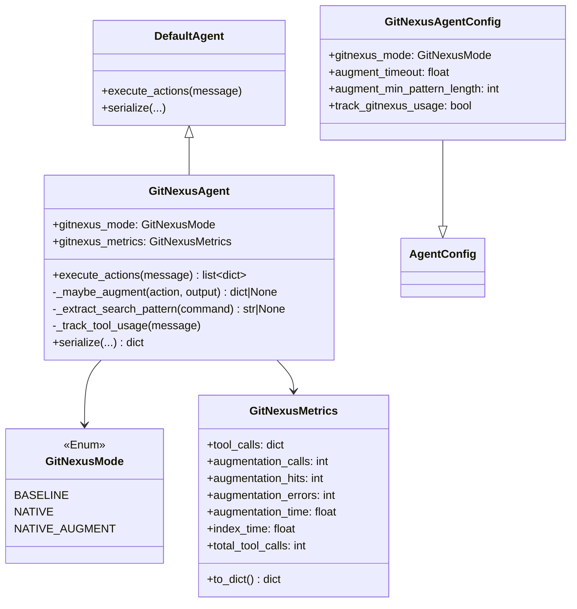
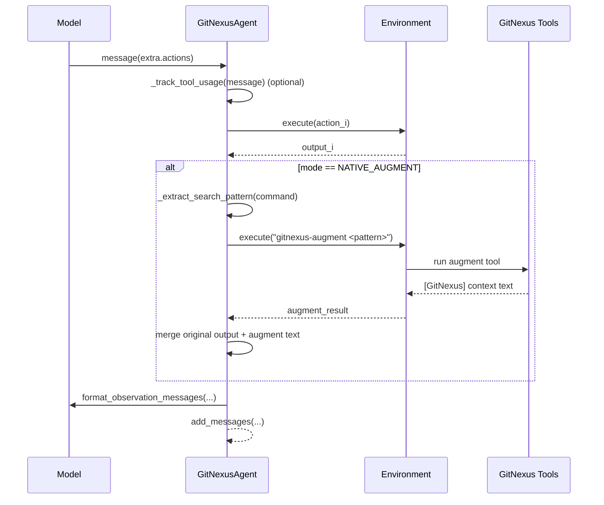
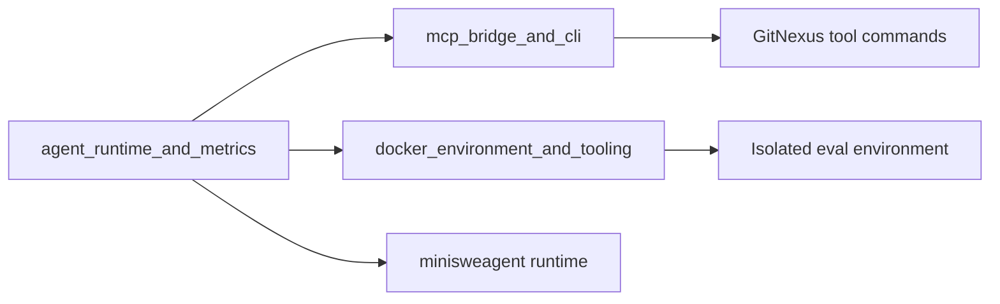
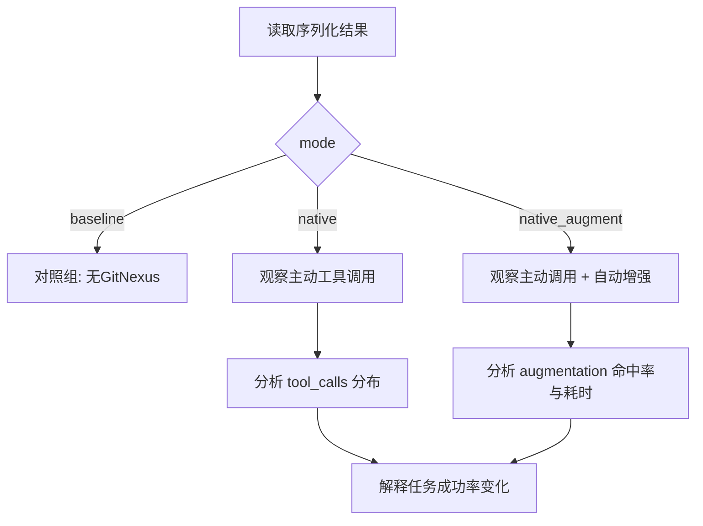

# agent_runtime_and_metrics 模块文档

## 1. 模块定位与存在意义

`agent_runtime_and_metrics` 是 `eval_framework` 中专门面向评测场景的 Agent 运行时增强层，对应代码实现位于 `eval.agents.gitnexus_agent`。这个模块的目标不是重新实现一个完整 Agent，而是在 `mini-swe-agent` 的 `DefaultAgent` 之上增加一层“可切换的 GitNexus 能力接入、观测结果增强、以及评测指标采集”。

如果把评测系统看成一个对照实验平台，那么这个模块扮演的是“实验变量控制器”：它允许同一套任务、同一模型、同一环境，在三种模式下运行（`baseline`、`native`、`native_augment`），从而比较“是否使用 GitNexus 工具”以及“是否启用自动增强”对最终解题表现和行为路径的影响。也正因此，模块在设计上非常克制：核心逻辑集中在模板选择、动作执行后处理和指标记录三个点，避免改变底层 Agent 的主循环语义。

从整体系统关系上，它上接 `mini-swe-agent` 的模型与环境抽象，下接评测环境中的工具命令（如 `gitnexus-query`、`gitnexus-augment`），并把运行统计通过 `serialize()` 注入评测结果。这些指标随后可被 `eval_framework` 的结果汇总流程消费，用于横向对比不同 mode 的行为差异。

---

## 2. 架构总览

### 2.1 组件结构图



这张图反映了模块的核心设计思想：通过继承 `DefaultAgent`，只在动作执行通道（`execute_actions`）和结果序列化通道（`serialize`）做增量扩展。配置与指标都封装为独立类型，便于评测流程注入和消费。

### 2.2 运行时数据流



数据流中最关键的一点是：增强逻辑发生在**动作执行后、观测回传前**。这意味着它不会改变模型生成动作的机制，只改变模型下一轮看到的观测内容，因此具有较强可控性，也更适合做 A/B 评测。

---

## 3. 核心组件详解

## 3.1 `GitNexusMode`

`GitNexusMode` 是三态枚举，决定 Agent 在评测中的能力边界。`BASELINE` 完全不依赖 GitNexus（用于控制组）；`NATIVE` 允许使用 GitNexus CLI 工具但不做自动增强；`NATIVE_AUGMENT` 在 `NATIVE` 基础上，对搜索类命令结果追加 `gitnexus-augment` 的上下文补充。

这个枚举同时驱动 prompt 模板选择。构造函数会按 `system_<mode>.jinja` 与 `instance_<mode>.jinja` 查找模板文件，因此模式不仅改变运行行为，也改变模型的任务引导语境。

## 3.2 `GitNexusAgentConfig`

`GitNexusAgentConfig` 继承自 `AgentConfig`，增加了 GitNexus 相关参数：

- `gitnexus_mode`：当前模式，默认 `BASELINE`。
- `augment_timeout`：执行 `gitnexus-augment` 的超时秒数，默认 `5.0`。
- `augment_min_pattern_length`：触发增强前的最短 pattern 长度，默认 `3`。
- `track_gitnexus_usage`：是否统计工具调用，默认 `True`。

这些参数体现了“评测优先”的取舍。比如 `augment_timeout` 默认较短，避免增强工具拖慢主流程；`augment_min_pattern_length` 用于抑制过短关键词带来的噪声查询。

## 3.3 `GitNexusMetrics`

`GitNexusMetrics` 是轻量状态容器，记录两类指标：一类是工具调用分布（`query/context/impact/cypher/overview`），另一类是增强行为指标（调用次数、命中次数、错误次数、累计耗时）。

`total_tool_calls` 通过属性实时求和，`to_dict()` 负责输出可序列化结构，并将时间字段四舍五入到两位小数。模块还预留了 `index_time` 字段，当前文件内没有填充逻辑，通常意味着该值由外部流程（例如索引阶段包装器）在未来或其他代码路径写入。

## 3.4 `GitNexusAgent`

`GitNexusAgent` 是模块的执行核心。它在初始化阶段完成模式解析、模板加载、父类初始化与指标对象挂载；在执行阶段完成工具调用统计、动作执行与可选增强；在序列化阶段把 GitNexus 元信息附加到输出。

### 3.4.1 `__init__(...)`

构造函数首先从 `kwargs` 读取 `gitnexus_mode`，允许传入字符串并转换为 `GitNexusMode`。随后它会在 `PROMPTS_DIR` 下尝试读取 `system_<mode>.jinja` 与 `instance_<mode>.jinja`，仅当调用者未显式提供 `system_template`/`instance_template` 时才自动注入。这一策略保证了“默认自动匹配模板”与“调用方可覆盖模板”同时成立。

最后通过 `super().__init__()` 完成 `DefaultAgent` 初始化，并创建 `self.gitnexus_metrics`。这意味着从第一轮动作开始就可记录工具行为。

### 3.4.2 `execute_actions(message) -> list[dict]`

该方法覆写父类同名逻辑，执行流程分三步：

1. 若开启统计，先调用 `_track_tool_usage(message)`，扫描动作命令并累计对应工具计数。
2. 调用 `self.env.execute(action)` 执行每个动作，收集 `outputs`。
3. 若 mode 为 `NATIVE_AUGMENT`，对每组 `(action, output)` 调用 `_maybe_augment`。一旦返回增强后的输出，就替换原输出。

完成后方法会调用 `model.format_observation_messages(...)` 并 `add_messages(...)`，返回标准 observation message 列表。其副作用包括：执行外部命令、写入指标计数、可能改变输出文本内容（追加 GitNexus 段落）。

### 3.4.3 `_maybe_augment(action, output) -> dict | None`

这是增强逻辑的关键函数。它只在命令可提取有效搜索 pattern 时触发，且 pattern 长度必须不小于 `augment_min_pattern_length`。通过后会执行：

```bash
gitnexus-augment "<pattern>" 2>&1 || true
```

并使用 `augment_timeout` 限制执行时长。函数会累积增强耗时和调用次数。若返回文本包含 `[GitNexus]` 标记，就把增强文本拼接到原始输出末尾，记录一次 `augmentation_hits` 并返回新输出；否则返回 `None`，表示保持原输出。

异常会被捕获并写 debug 日志，不向上抛出。设计意图是“增强失败不应破坏主任务执行”。

### 3.4.4 `_extract_search_pattern(command) -> str | None`

该静态方法从 `grep/rg/ag` 命令中抽取搜索词。它依次尝试两条正则：优先提取被引号包裹的 pattern，再回退到非空白 token。方法会过滤以下情况：

- 以 `/` 或 `.` 开头（通常是路径而非查询词）；
- 以 `-` 开头（通常是选项）；
- 无匹配。

这是一种启发式提取，而非 shell 级完整语法解析，因此对复杂管道、变量替换、子命令嵌套等场景支持有限。

### 3.4.5 `_track_tool_usage(message)`

该方法遍历动作命令文本，通过子串匹配统计工具调用类型。匹配顺序采用 `if/elif`，单条命令最多计入一个工具类型。它统计的是“命令文本出现”而不是“命令成功执行”，因此在执行失败场景下计数仍会增加，这对于行为分析通常是可接受的（表示模型尝试使用了工具）。

### 3.4.6 `serialize(*extra_dicts) -> dict`

`serialize` 在父类序列化结果上附加：

```json
{
  "info": {
    "gitnexus": {
      "mode": "native_augment",
      "metrics": { ... }
    }
  }
}
```

这样评测结果中会保留可回溯的运行模式与指标快照。该方法不覆盖父类逻辑，而是通过额外字典合并实现扩展，兼容现有下游消费者。

---

## 4. 与 eval_framework 其他模块的关系



在评测系统中，`agent_runtime_and_metrics` 主要负责“Agent 行为层”；工具接入细节通常由 `mcp_bridge_and_cli.md` 描述的桥接层承担；仓库隔离、容器执行与环境生命周期则由 `docker_environment_and_tooling.md` 负责。阅读时建议先理解本模块的 mode 与指标语义，再结合桥接/环境模块理解命令为何可用、在何处执行。

---

## 5. 典型使用方式

下面示例展示如何在评测脚本中启用 `native_augment`：

```python
from eval.agents.gitnexus_agent import GitNexusAgent, GitNexusMode

agent = GitNexusAgent(
    model=model,
    env=env,
    gitnexus_mode=GitNexusMode.NATIVE_AUGMENT,
    augment_timeout=4.0,
    augment_min_pattern_length=4,
    track_gitnexus_usage=True,
)
```

如果你只想做控制组实验，可显式设置：

```python
agent = GitNexusAgent(model=model, env=env, gitnexus_mode="baseline")
```

注意字符串模式会在构造阶段转换为枚举；非法字符串会触发 `GitNexusMode(mode)` 的枚举转换异常。

在一次 run 结束后，可通过序列化结果读取指标：

```python
result = agent.serialize()
print(result["info"]["gitnexus"]["metrics"])
```

---

## 6. 行为约束、边界条件与常见陷阱

本模块最需要关注的不是“功能缺失”，而是“启发式增强的误差边界”。`_extract_search_pattern` 只覆盖了常见 `grep/rg/ag` 写法，对于复杂 shell 命令可能提取失败，导致不触发增强。此外，增强命中依赖返回内容中包含 `[GitNexus]` 标记；如果工具输出格式改变（例如去掉该前缀），即使命令成功也不会被识别为命中。

工具统计采用简单子串判断。若命令文本中同时包含多个工具名，由于 `if/elif` 结构只会计入第一个匹配项。并且统计发生在动作执行前，不区分执行成功或失败。因此这些指标更适合衡量“Agent 决策倾向”，不应直接解释为“有效调用次数”。

增强命令通过 `2>&1 || true` 包装，意味着 shell 层错误通常不会让 `env.execute` 抛异常，很多失败会表现为普通输出文本。只有执行接口本身异常才会增加 `augmentation_errors`。这会导致“工具内部失败但错误计数不变”的情况，需要结合输出内容做诊断。

`index_time` 当前未在此模块内部维护，如果你希望该字段有意义，需要在外层编排中显式写入或扩展此类，否则序列化结果会长期为 `0.0`。

---

## 7. 扩展建议

若要扩展新的 GitNexus 工具（例如 `gitnexus-trace`），建议同步修改三处：第一，在 prompt 模板中加入工具说明；第二，在 `_track_tool_usage` 增加计数分支；第三，在 `GitNexusMetrics.tool_calls` 初始化字典与 `to_dict()` 输出中保留字段一致性。这样可以保证“模型知道工具”“运行时能记录使用”“评测结果可分析”三者闭环。

若要增强更多命令类型（例如 `find`、`fd`、`ack`），建议把 `_extract_search_pattern` 从正则启发式升级为更稳健的 shell token 解析，至少先做词法级拆分再提取查询参数，减少误判路径或选项为 pattern 的概率。

若要用于线上系统而非离线评测，建议把增强调用改为可观测的熔断策略（例如连续失败后暂时禁用），并把日志级别从 `debug` 增加到可配置告警，以便及时发现工具链异常。

---

## 8. 参考阅读

- `mcp_bridge_and_cli.md`：了解 GitNexus 命令如何桥接到评测 Agent 可调用的 CLI。
- `docker_environment_and_tooling.md`：了解评测环境中的命令执行边界、隔离策略与依赖准备。
- `web_llm_agent.md`：如果你在比较 Web 端 Agent 类型体系与评测 Agent 的差异，可参考该文档中的消息与步骤模型。


## 9. 附录：模式与指标解读速查

为了在实验复盘时快速对比不同模式的效果，建议把 `mode` 与关键指标联动分析，而不是只看任务通过率。实践中可以先看 `total_tool_calls` 判断模型是否实际使用了 GitNexus，再看 `augmentation_hits / augmentation_calls` 判断增强链路是否有效，最后结合任务结果解释性能变化来源。



如果你在撰写实验报告，建议把该模块结果与 [mcp_bridge_and_cli](mcp_bridge_and_cli.md) 和 [docker_environment_and_tooling](docker_environment_and_tooling.md) 的环境信息一起记录，避免将环境差异误判为 Agent 能力差异。
