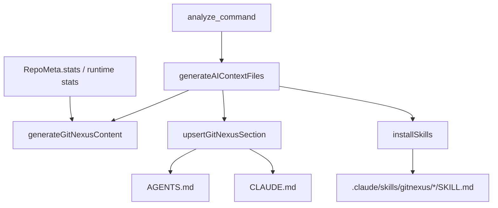
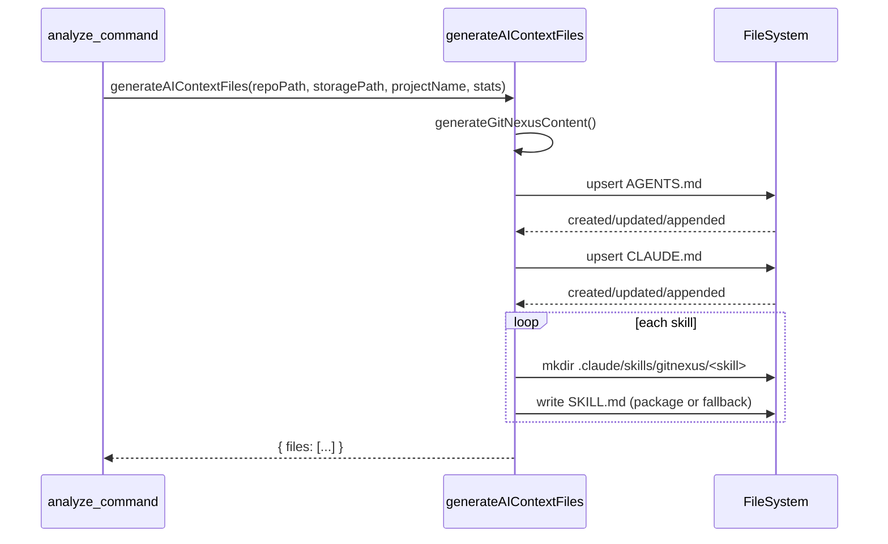
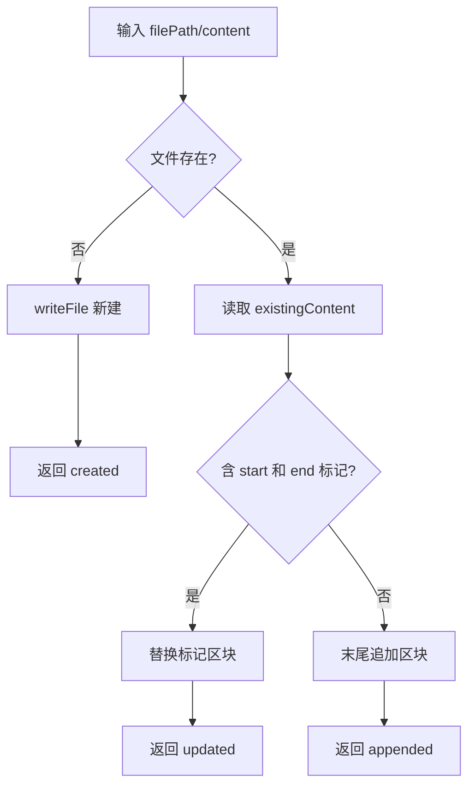

# ai_context_generation 模块文档

## 模块概述

`ai_context_generation` 模块（实现文件：`gitnexus/src/cli/ai-context.ts`）负责在仓库分析完成后，为 AI 编码助手生成“可直接消费”的上下文入口文件。它的核心产物是仓库根目录下的 `AGENTS.md` 与 `CLAUDE.md`，以及 `.claude/skills/gitnexus/` 目录中的技能文件（`SKILL.md`）。

这个模块存在的根本原因，是现实中的不同 AI 工具对“项目上下文入口”的读取协议并不一致。部分工具会优先读取 `AGENTS.md`，Claude Code 则读取 `CLAUDE.md`。如果没有统一注入机制，用户需要手工维护多套文档，且内容很容易漂移。`ai_context_generation` 通过一次生成流程把这些入口对齐，并且通过标记区块（`<!-- gitnexus:start --> ... <!-- gitnexus:end -->`）支持幂等更新，避免重复插入和手工冲突。

从系统位置看，该模块是 CLI 分析链路最后阶段的“交付层”：上游是 `analyze` 命令产出的仓库统计信息与索引状态，下游是 AI agent 的任务路由行为。换句话说，它不参与代码解析或图构建，但直接影响 AI 是否能“先读对东西，再做对动作”。

---

## 在系统中的位置与职责边界

`ai_context_generation` 通常由 `analyze` 命令在索引落盘之后调用。它消费项目名与统计数据，写入提示性上下文，并安装技能目录结构。该模块不读取 Kuzu 数据，不做图查询，也不执行 AST/符号解析。



这张图体现了它的“轻编排器”性质：`generateAIContextFiles` 是单一入口，内部组合内容生成、文档 upsert、技能安装三类子流程。真正的统计值来源于上游分析流程，建议配合阅读 [analyze_command.md](analyze_command.md) 与 [cli.md](cli.md)。

---

## 核心数据结构

## `RepoStats`

```ts
interface RepoStats {
  files?: number;
  nodes?: number;
  edges?: number;
  communities?: number;
  clusters?: number;
  processes?: number;
}
```

`RepoStats` 是上下文文案中的摘要输入。字段全部可选，模块在渲染时对未提供值采用 `0` 回退，因此它在“弱依赖统计信息”的场景下非常稳健：即使上游没有给全量指标，也不会阻断文件生成。当前实际展示重点是 `nodes`、`edges`、`processes`，其余字段保留用于未来文案扩展。

需要注意，`RepoStats` 与仓库元数据中的 `RepoMeta.stats`（见 [storage_repo_manager.md](storage_repo_manager.md)）语义接近但并非同一类型定义，二者通过调用方组装衔接，而不是模块内部强绑定。

---

## 核心函数与内部机制

## `generateGitNexusContent(projectName, stats): string`

这个函数构造 GitNexus 注入块的完整 Markdown 文本。它会输出：

1. 起止标记：`<!-- gitnexus:start -->` 与 `<!-- gitnexus:end -->`
2. 项目摘要行：包含项目名、symbol/relationship/process 统计
3. “Always Start Here” 三步流程
4. “Skills” 任务到技能文件的映射表

它的设计重点是“路由优先”而非“知识堆砌”。也就是说，`AGENTS.md/CLAUDE.md` 只告诉 agent 先读哪个 skill，不在入口文件里复制具体工作流。这样可以降低内容分叉和维护成本。

## `fileExists(filePath): Promise<boolean>`

这是一个最小包装函数，使用 `fs.access` 判断路径可访问性。其行为是“异常即不存在”，不会区分权限问题、路径非法、I/O 抖动等细粒度原因。优点是调用简单，缺点是可观测性较弱。

## `upsertGitNexusSection(filePath, content)`

该函数是模块幂等性的关键，返回 `'created' | 'updated' | 'appended'` 三态结果：

- `created`：目标文件不存在，直接创建并写入 GitNexus 内容。
- `updated`：文件已存在且检测到完整标记区块，替换区块内容。
- `appended`：文件存在但没有 GitNexus 标记区块，在末尾追加。

其替换逻辑采用简单字符串索引（`indexOf`），不是 Markdown AST 级别解析。这种实现成本低、速度快，适合 CLI 场景；但也意味着若用户手动破坏了标记对（比如只保留 start、不保留 end），函数会退化成 append 路径，可能产生重复区块。

## `installSkills(repoPath): Promise<string[]>`

该函数负责将内置 skill 安装到 `.claude/skills/gitnexus/`。内部有两层内容来源策略：

1. 优先读取包内 `skills/*.md`（路径基于 ESM `__dirname` 推导）。
2. 若读取失败，生成最小 fallback `SKILL.md`（含 frontmatter + description）。

函数会逐个技能目录执行 `mkdir(..., { recursive: true })` 并写入 `SKILL.md`。单个技能失败不会中断全流程，只会打印 warning 并继续处理后续技能。这是典型的“best-effort 安装”策略，目标是最大化可用性。

## `generateAIContextFiles(repoPath, _storagePath, projectName, stats)`

这是外部唯一导出函数，也是模块对上游的集成点。执行顺序固定：

1. 生成注入内容 `content`
2. upsert `AGENTS.md`
3. upsert `CLAUDE.md`
4. 安装 skills
5. 返回 `{ files: string[] }` 作为摘要

其中 `_storagePath` 参数当前未被使用（以下划线命名避免 lint 报警）。这通常意味着接口为未来扩展预留，或为了与调用方统一签名保持兼容。

---

## 交互流程与状态转换

## 端到端流程



该流程没有事务语义。也就是说，如果中间某一步失败，前面成功写入的文件不会自动回滚。这对 CLI 一次性任务通常可接受，但调用方应理解“部分成功”是设计允许的状态。

## upsert 判定流程



这个流程体现了模块最重要的可维护性承诺：重复执行不会无条件覆盖整文件，只影响标记区块或尾部追加。

---

## 配置与可扩展点

当前模块几乎没有“外部配置项”，它的行为主要由输入参数和内置常量决定：

- 标记常量：`GITNEXUS_START_MARKER` / `GITNEXUS_END_MARKER`
- 目标文件：`AGENTS.md` 与 `CLAUDE.md`
- 技能清单：`gitnexus-exploring`、`gitnexus-debugging`、`gitnexus-impact-analysis`、`gitnexus-refactoring`、`gitnexus-guide`、`gitnexus-cli`

如果你要扩展此模块，常见方式是修改 `skills` 数组与 `generateGitNexusContent` 的技能表映射，保证“任务描述”和“实际安装目录”一致。建议把新增技能的 markdown 文件放在包内 `skills/<name>.md`，这样可以避免触发 fallback 文案。

---

## 使用方式与示例

在 CLI 中通常无需单独调用该模块，它由 `gitnexus analyze` 自动触发。若在代码中手动调用，可按如下方式：

```ts
import { generateAIContextFiles } from 'gitnexus/src/cli/ai-context';

const result = await generateAIContextFiles(
  '/path/to/repo',
  '/path/to/repo/.gitnexus', // 当前未使用
  'my-project',
  { nodes: 1200, edges: 3400, processes: 18 }
);

console.log(result.files);
// 例如: [
//   'AGENTS.md (updated)',
//   'CLAUDE.md (created)',
//   '.claude/skills/gitnexus/ (6 skills)'
// ]
```

生成后的 `AGENTS.md`/`CLAUDE.md` 会包含 GitNexus 注入区块，提示 agent 先读取 `gitnexus://repo/{name}/context`，再根据任务类型跳转到对应 skill。

---

## 边界条件、错误处理与限制

本模块整体采用“尽量完成”策略，适合自动化流水线，但也有一些需要注意的行为边界。

首先，`installSkills` 的单项失败会被吞掉（仅 `console.warn`）。这意味着最终可能只安装了部分技能，调用方若需要严格保障，应在返回结果之外增加目录完整性校验。

其次，`upsertGitNexusSection` 仅使用字符串匹配标记，不验证 Markdown 结构。如果用户手工编辑导致标记损坏、嵌套或顺序异常，更新行为可能不符合预期。实践上建议不要改动标记行本身，只编辑标记之外内容。

再次，模块没有并发写保护。若多个进程同时对同一仓库执行该函数，可能出现最后写入者覆盖前者内容的竞态。常规 CLI 使用一般串行，不是问题；CI 并发场景需要调用方自行互斥。

最后，函数返回值只反映“高层结果摘要”，不包含详细失败原因与每个 skill 的错误信息。如果需要可观测性更强的诊断能力，需要在上层命令中扩展日志采集或结构化返回。

---

## 与其他模块的关系

`ai_context_generation` 依赖关系非常清晰：

- 上游调用：`analyze_command` 在索引成功后触发该模块，详见 [analyze_command.md](analyze_command.md)。
- 同层命令入口：CLI 总体结构见 [cli.md](cli.md)。
- 统计来源：`RepoStats` 通常来自分析结果与元数据汇总，可参考 [core_pipeline_types.md](core_pipeline_types.md) 与 [storage_repo_manager.md](storage_repo_manager.md)。

如果你正在排查“为什么 AGENTS/CLAUDE 没更新”，优先检查调用链是否走到 `generateAIContextFiles`，其次检查仓库写权限与标记区块完整性。
