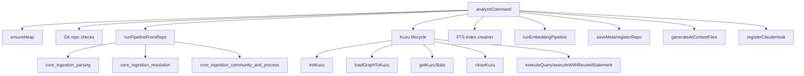
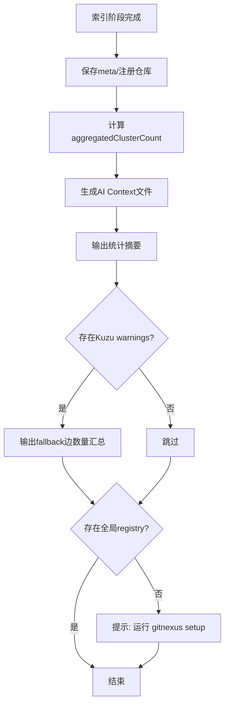
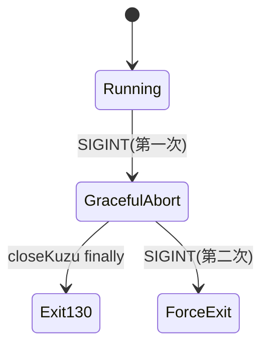

# analyze_command 模块文档

## 模块概述

`analyze_command`（实现文件：`gitnexus/src/cli/analyze.ts`）是 GitNexus CLI 中最核心、最“重”的入口之一。它负责把一个 Git 仓库从“文件集合”转换成“可查询的知识图谱资产”：先运行代码摄取与解析管线，构建 `KnowledgeGraph`，再把图加载到 KuzuDB，建立全文索引（FTS），可选生成向量嵌入，最后写入仓库元信息并生成 AI 上下文文件。

从系统设计角度看，这个模块存在的意义不是简单“跑一次分析”，而是提供一个**可重复、可中断恢复、对大仓库尽量友好、并对 AI 工具链可直接消费**的统一编排层。它将多个核心子系统串联起来：摄取管线（`core_ingestion_*`）、图存储（`core_kuzu_storage`）、嵌入与检索（`core_embeddings_and_search`）、仓库注册与元数据（`storage_repo_manager`）、以及 CLI 侧 AI 集成逻辑。

---

## 核心组件

## `AnalyzeOptions`

```ts
export interface AnalyzeOptions {
  force?: boolean;
  embeddings?: boolean;
}
```

`AnalyzeOptions` 是 `analyzeCommand` 的控制开关，语义非常明确：

- `force`：是否强制重建索引。默认情况下，命令会比较当前 commit 与上次 `meta.json` 记录的 `lastCommit`，若相同则直接返回 “Already up to date”。开启后会绕过这层增量短路，重新执行全流程。
- `embeddings`：是否启用嵌入阶段。不开启时，嵌入默认跳过；开启后仍受节点数量阈值保护（`EMBEDDING_NODE_LIMIT = 50_000`）。

该接口本身是纯配置类型，无副作用；但它决定了整个命令在时间、内存、CPU 与模型下载开销上的行为路径。

## `analyzeCommand(inputPath?, options?)`

虽然模块树核心组件只列出了 `AnalyzeOptions`，但真正承担业务编排的是 `analyzeCommand`。其签名如下：

```ts
export const analyzeCommand = async (
  inputPath?: string,
  options?: AnalyzeOptions
) => { ... }
```

它返回 `Promise<void>`，不产出结构化返回值，而是通过以下方式体现执行结果：

1. 控制台进度条与摘要输出。
2. 写入 `.gitnexus/` 存储（Kuzu 数据文件、`meta.json` 等）。
3. 更新全局 registry（已索引仓库列表）。
4. 在仓库根目录生成/更新 `AGENTS.md`、`CLAUDE.md` 等上下文资产。
5. 可选修改用户 `~/.claude/hooks.json` 以注册 Claude Hook。

因此它是一个“重副作用命令”。调用方应把它当作顶层 CLI 行为，而不是可复用的纯函数。

---

## 模块架构与依赖关系



这张图体现了 `analyze_command` 的“编排器”定位：它自己不做 AST 解析、也不实现图算法或向量模型，而是控制各子系统的时序、资源生命周期与故障容忍策略。

若你需要理解各子系统内部算法细节，请分别参考：

- 解析与抽取：[core_ingestion_parsing.md](core_ingestion_parsing.md)
- 符号/导入/调用解析：[core_ingestion_resolution.md](core_ingestion_resolution.md)
- 社区与流程检测：[core_ingestion_community_and_process.md](core_ingestion_community_and_process.md)
- Kuzu CSV 与装载：[core_kuzu_storage.md](core_kuzu_storage.md)
- 嵌入与检索：[core_embeddings_and_search.md](core_embeddings_and_search.md)
- 存储与注册：[storage_repo_manager.md](storage_repo_manager.md)

---

## 执行流程（阶段化）

`analyzeCommand` 把用户可感知进度压缩成一个统一进度条，并对内部阶段做百分比映射。


### 1) 启动前内存保障：`ensureHeap()`

模块会先检查当前 Node 进程堆上限；若未显式设置 `--max-old-space-size` 且当前限制明显低于 8GB，会通过 `execFileSync` 以新参数**重启当前命令**。父进程返回后直接结束当前执行路径。

这种“自重启提堆”设计，主要用于降低大仓库分析时的 OOM 概率。它的副作用是：命令可能在早期看起来“执行了两次”，实际是一次引导重启。

### 2) 仓库定位与合法性验证

- 若传入 `inputPath`，使用其绝对路径。
- 否则尝试从当前目录向上定位 git root。
- 失败则设置 `process.exitCode = 1` 并返回。

同时会校验目标路径是否真是 Git 仓库（`isGitRepo`），防止误对任意目录运行昂贵分析。

### 3) 增量短路（commit 相同时跳过）

通过 `loadMeta(storagePath)` 读取上次分析元数据。若：

- 存在 meta
- 未设置 `force`
- `existingMeta.lastCommit === currentCommit`

则直接输出 “Already up to date” 并结束。这是最关键的性能优化路径之一。

### 4) 进度条与日志劫持

模块用 `cli-progress` 维护单一进度条。为防止其他模块 `console.log` 破坏进度条渲染，它会临时替换 `console.log/warn/error`，统一改为“先清行再打印”。收尾时恢复原始函数。

此外还用 `setInterval` 每秒刷新“当前阶段已耗时”，避免某些长步骤无回调时看起来卡死。

### 5) 可选预缓存 embeddings（重建前）

当 `options.embeddings=true`、存在旧 meta 且不是强制重建时，命令会先打开旧 Kuzu，读取已有 embeddings 到内存：

- `cachedEmbeddingNodeIds`：用于后续跳过重复生成
- `cachedEmbeddings`：用于在图重建后回灌

这是“近似增量 embeddings”的关键机制，可显著降低重复分析成本。

### 6) Phase 1：摄取管线（0–60%）

`runPipelineFromRepo(repoPath, onProgress)` 执行完整代码理解流程，返回 `pipelineResult`（含图、文件计数、社区/流程检测结果）。

根据依赖代码，该流程内部包含：路径扫描、结构分析、分块解析、导入/调用/继承处理、社区检测、流程检测，并且针对大仓库做了分块与缓存清理策略。

### 7) Phase 2：Kuzu 重建与图装载（60–85%）

该阶段会先强制关闭已有连接，并删除旧的 `kuzu` 文件、WAL、lock。然后：

1. `initKuzu(kuzuPath)` 初始化数据库。
2. `loadGraphToKuzu(...)` 将图流式写 CSV 并 COPY 到 Kuzu。

值得注意的是，`loadGraphToKuzu` 对关系写入有容错：

- 按 from/to label 对关系分组 COPY。
- COPY 失败时尝试 `IGNORE_ERRORS=true`。
- 仍失败则记录 warning，并退化为逐条插入 fallback。

这保证了“尽量完成索引”，而不是因少数 schema 不匹配边全盘失败。

### 8) Phase 3：全文索引 FTS（85–90%）

会尝试为 `File/Function/Class/Method/Interface` 创建 FTS 索引。该阶段是 best-effort：异常被吞掉，不中断主流程。

### 9) Phase 3.5：回灌缓存 embeddings

如果早先缓存了 embeddings，会批量（每批 200）执行：

```cypher
CREATE (e:CodeEmbedding {nodeId: $nodeId, embedding: $embedding})
```

若某些节点已不存在（例如代码删除），插入失败会被忽略。这是预期行为。

### 10) Phase 4：可选 embeddings（90–98%）

触发条件：

- 用户显式开启 `--embeddings`
- 且 `stats.nodes <= 50_000`

否则会记录跳过原因（未启用或超过阈值）。

真正执行时调用 `runEmbeddingPipeline(...)`，并把进度映射到总条的 90–98%。同时把 `cachedEmbeddingNodeIds` 传入，实现“只处理新增节点”。

### 11) Phase 5：落盘与生态集成（98–100%）

收尾会：

1. 组装并 `saveMeta(storagePath, meta)`。
2. `registerRepo(repoPath, meta)` 更新全局 registry。
3. `addToGitignore(repoPath)` 确保 `.gitnexus/` 被忽略。
4. `registerClaudeHook()`（若环境满足）。
5. `generateAIContextFiles(...)` 写入/更新 AGENTS 与 CLAUDE 文档。

最后关闭 Kuzu，恢复 console，输出摘要信息与提示。

---

## 结果汇总与输出语义（实现细节）

在所有阶段结束后，命令会输出一段“面向人类”的汇总信息。这里有几个容易被忽略但很重要的实现细节。

第一，`clusters` 的展示数字并不等于社区检测中的 `totalCommunities`。命令会把 `communityResult.communities` 按 `heuristicLabel`（或 `label`）聚合，并统计“成员数 >= 5”的标签组数量，得到 `aggregatedClusterCount`。这个数字更接近“有规模的功能簇”，用于 AI 上下文文件，而不是严格算法社区总数。

第二，Kuzu 装载阶段如果触发了 fallback 插入，命令不会逐条刷屏，而是在最后做一次安静摘要：从 warning 文本中提取 `(N edges)` 累加后输出总量。这使得默认输出保持简洁，同时保留“有多少边走了降级路径”这一运维关键信息。

第三，命令会探测全局 registry 文件是否存在；如果不存在，会提示用户运行 `gitnexus setup`。这不是报错，而是“功能发现型提示”，目的是引导用户把本地索引能力接入 MCP / 编辑器生态。



该后处理流程说明：`analyze_command` 不只是“做完分析就退出”，而是同时承担了结果解释、生态接入提示、以及用户下一步动作引导的职责。

---


## 关键内部机制说明

## SIGINT 中断与清理

模块注册了 `SIGINT` 处理器：第一次 `Ctrl-C` 会进入“优雅终止”（停止进度条、尝试 `closeKuzu()`、以 130 退出）；第二次 `Ctrl-C` 则强制立即退出。这个双击策略在重 I/O 场景下很实用，兼顾可中断性和资源清理。



## ONNX 清理崩溃规避

代码中明确注明：**不调用 `disposeEmbedder()`**，因为 ONNX Runtime 在某些平台清理阶段会 segfault。更进一步，当 embeddings 实际运行过时，命令最后 `process.exit(0)` 强制结束进程，绕过 native `atexit` 崩溃路径。

这是一种工程性 workaround：牺牲“优雅退出语义”换取跨平台稳定性。

## 进度估算不是严格线性

Kuzu 装载进度通过消息次数估算：

`60 + round((msgCount / (msgCount + 10)) * 24)`

这意味着早期增长快、后期趋缓，属于“用户体验优先”的近似进度，而非精确工作量比例。

---

## 使用方式

最常见用法（示意）：

```bash
# 在仓库内直接分析
gitnexus analyze

# 指定路径分析
gitnexus analyze /path/to/repo

# 强制重建
gitnexus analyze --force

# 启用 embeddings
gitnexus analyze --embeddings

# 强制重建 + embeddings
gitnexus analyze /path/to/repo --force --embeddings
```

运行完成后，你通常会看到：

- `.gitnexus/` 下的数据库与元数据
- 仓库根目录中的 `AGENTS.md` / `CLAUDE.md`（被 upsert）
- 全局 registry 更新
- 可选的 Claude Hook 注册提示

---

## 错误处理、边界条件与限制

### 1. 非 Git 仓库直接失败

如果当前目录和输入路径都无法确认 Git 仓库，命令会设置非零退出码并终止。这是硬约束。

### 2. FTS 创建失败不致命

FTS 属于增强能力，不阻断主索引流程。后果是全文检索能力可能缺失，但图本体可用。

### 3. embeddings 默认关闭，且有规模阈值

即使传入 `--embeddings`，节点数超过 `50,000` 仍会自动跳过，防止模型推理成本与内存压力失控。

### 4. 缓存 embeddings 回灌可能部分失败

如果旧节点在新图中不存在，回灌失败会被静默忽略。这不是数据一致性错误，而是增量策略设计结果。

### 5. Kuzu 关系 schema 兼容问题

某些关系类型可能因 schema pair 不匹配而无法批量 COPY。系统会 fallback 到逐条插入，并在最终摘要里提示 fallback 边数量。虽然最终可用，但性能会下降。

### 6. 进程可能被主动 `process.exit(0)`

当 embeddings 执行过时，这是有意行为，不应在同一 Node 进程内继续依赖后续逻辑。

---

## 扩展与二次开发建议

若要扩展该模块，建议按“编排层不侵入算法层”的原则：

1. **新增阶段**：在进度条百分比区间上预留固定窗口，避免与现有阶段冲突。
2. **新增选项**：优先扩展 `AnalyzeOptions`，保持 CLI 参数到编排逻辑一一映射。
3. **增强容错**：优先在边缘阶段（FTS、Hook、Context 生成）采用 best-effort，不影响主路径。
4. **避免破坏中断清理**：新增持久连接或文件句柄时，要纳入 SIGINT 清理路径。

一个常见扩展是“自定义 embeddings 阈值”或“自定义节点类型索引策略”。这类能力应在配置层暴露，但执行时仍应保留默认保护阈值与回退路径。

---

## 与其他文档的关系

- CLI 总览与命令导航：见 [cli.md](cli.md)
- Pipeline 返回结构（进度/结果类型）：见 [core_pipeline_types.md](core_pipeline_types.md)
- 图模型基础类型：见 [core_graph_types.md](core_graph_types.md)

本文重点是 `analyze_command` 的编排行为，不重复展开各底层模块的算法实现。若你正在排查“解析精度”或“Kuzu 导入性能”，请优先阅读对应子模块文档。
