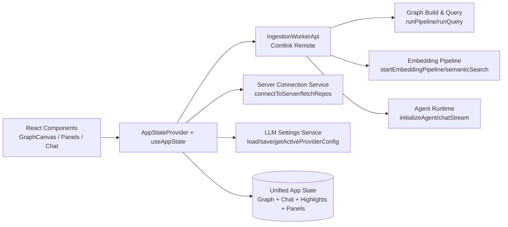
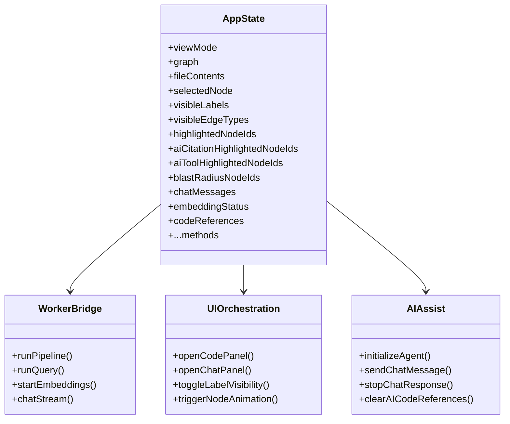
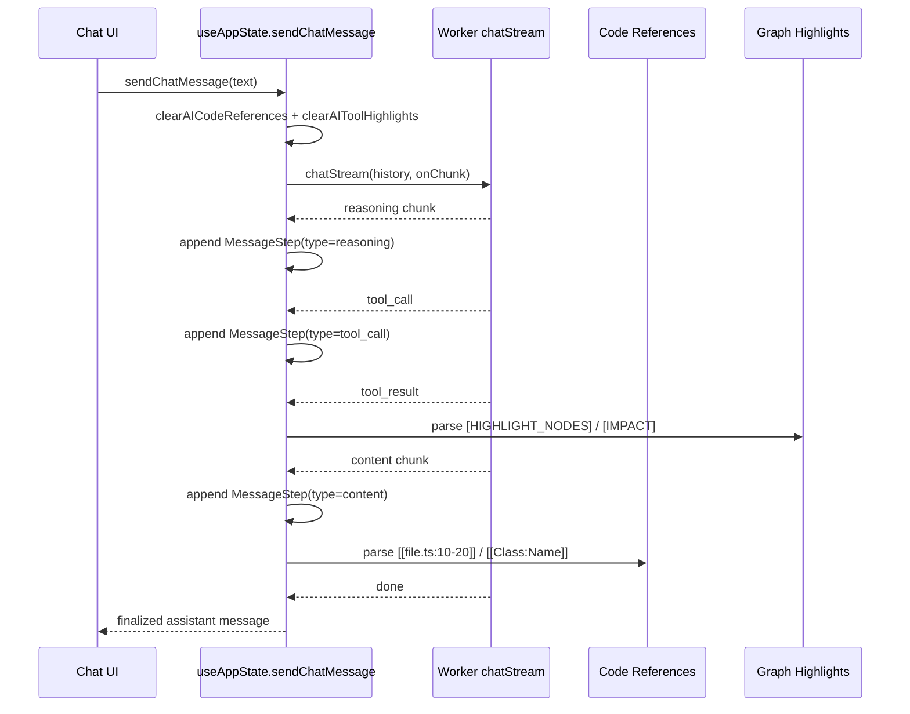
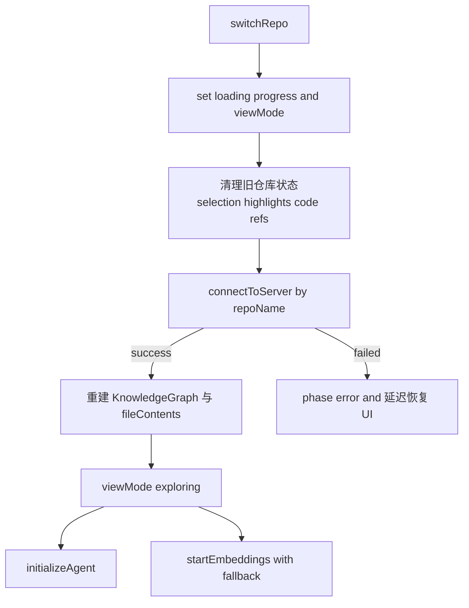

# app_state_orchestration 模块文档

## 1. 模块定位与设计动机

`app_state_orchestration`（实现文件：`gitnexus-web/src/hooks/useAppState.tsx`）是 Web 端应用的“状态编排中枢”。它不是单纯的 UI 状态容器，而是把以下原本分散在多个层面的能力统一到一个可被 React 全局消费的上下文中：图数据管理、查询高亮、AI/Agent 会话、代码引用面板、向 Web Worker 发起 ingestion/query/embedding 调用、多仓库切换，以及与右侧面板交互相关的视图状态。

这个模块存在的核心原因是：GitNexus Web 的交互链路高度跨域。一次用户操作可能同时触发图层更新、聊天流式输出、代码定位、高亮动画以及 Worker 计算任务。若这些状态分散在多个互不感知的 hooks 中，容易出现状态竞态、面板不同步、旧仓库数据污染新仓库等问题。`useAppState` 的设计通过“单一协调入口 + 明确状态分区 + 可组合方法暴露”来降低这类系统复杂度。

从整体系统分层看，它位于 UI 层与计算层之间，向上服务页面组件，向下代理 worker 与服务调用。图类型和语义来自 [graph_domain_types.md](graph_domain_types.md)，流水线返回结构来自 [pipeline_result_transport.md](pipeline_result_transport.md)，向量与语义检索进度模型来自 [embeddings_types.md](embeddings_types.md)，LLM 消息与工具调用类型来自 [llm_provider_and_message_types.md](llm_provider_and_message_types.md)。

---

## 2. 模块在系统中的位置



这张图体现了两个关键点。第一，`AppStateProvider` 同时管理“状态”和“动作”：不仅存储当前 UI/数据状态，也封装了访问 worker 和服务的具体过程。第二，UI 组件不直接触达底层服务，统一通过 context 调用，减少组件对后端协议、序列化细节和错误处理分支的耦合。

---

## 3. 核心类型（Core Components）详解

以下类型是本模块对外语义契约的核心。

### 3.1 `QueryResult`

`QueryResult` 表示一次图查询（通常是 Cypher）对应的结果摘要，包含三部分：

- `rows: Record<string, any>[]`：原始结果行。
- `nodeIds: string[]`：可映射到图高亮的节点 ID 集合。
- `executionTime: number`：执行耗时，便于 UI 展示和性能反馈。

它的价值不在“承载所有查询信息”，而在于把“可视化需要的数据”与原始查询行一起绑定，便于统一清理（`clearQueryHighlights`）和跨组件消费。

### 3.2 `NodeAnimation`

`NodeAnimation` 描述单个图节点当前正在执行的视觉动画：

- `type: 'pulse' | 'ripple' | 'glow'`
- `startTime: number`
- `duration: number`

模块内部通过 `Map<string, NodeAnimation>` 以节点 ID 为键存储动画状态，并在触发时设置自动清理。该模型适合“短生命周期反馈”（例如 MCP 工具执行后高亮提示），避免在图层渲染器中做复杂的定时器控制。

### 3.3 `CodeReference`

`CodeReference` 是“代码引用面板”的标准条目模型，既支持 AI 生成引用，也支持用户手工引用。关键字段：

- `filePath` + `startLine/endLine`：定位片段。
- `nodeId`：可回溯到图节点，实现代码引用与图高亮联动。
- `label` / `name`：显示语义。
- `source: 'ai' | 'user'`：用于清理策略分流（例如只清除 AI 引用）。

模块对重复引用采用“同文件 + 同行区间”去重策略，避免流式消息重复命中同一标记导致列表膨胀。

### 3.4 `CodeReferenceFocus`

`CodeReferenceFocus` 是一次“焦点跳转信号”，用于通知代码查看器执行滚动/闪烁等 UX 行为。它不是持久状态，而是事件式状态：

- `filePath/startLine/endLine` 指向目标。
- `ts` 作为时间戳，确保即使目标相同也可触发新一轮聚焦。

### 3.5 `AppState`

`AppState` 是整个模块的公共接口，包含状态字段与方法字段。其设计重点是让消费者无需知道状态存放细节，只需关心“我可以读什么、触发什么动作”。

按职责可分为：视图状态、图与筛选状态、查询与 AI 高亮状态、Worker 数据管道、Embedding、LLM/Chat、代码引用面板、多仓库切换。

---

## 4. 内部架构与状态分区

### 4.1 状态域分层



从代码实现看，`AppStateProvider` 把这些分区写在同一个 provider 中，但通过 `useCallback` 与语义化方法划分边界。这样既保留了统一入口，又不会变成完全不可维护的“巨型对象”。

### 4.2 Worker 生命周期管理

模块在 `useEffect` 中创建单例 Worker（`ingestion.worker.ts`），并用 `Comlink.wrap<IngestionWorkerApi>` 暴露远程 API。销毁时执行 `worker.terminate()`，避免热更新或页面切换时泄漏。

这意味着所有 pipeline/query/embedding/chat 调用都依赖 `apiRef.current`。因此几乎所有方法都会先判空并在未初始化时报 `Worker not initialized`。

---

## 5. 关键流程详解

### 5.1 Pipeline 与查询流程

`runPipeline` 与 `runPipelineFromFiles` 都会把进度回调 `onProgress` 通过 `Comlink.proxy` 传入 worker，然后将序列化结果经 `deserializePipelineResult(..., createKnowledgeGraph)` 还原为可操作图对象。这个“反序列化 + 工厂注入”步骤很关键，因为 `KnowledgeGraph` 是带行为的方法对象，而不是纯 JSON。

`runQuery` 直接代理到 worker，返回 `any[]` 原始结果。UI 可进一步组装成 `QueryResult` 并调用 `setQueryResult` 与 `setHighlightedNodeIds`。

### 5.2 Embedding 生命周期

`startEmbeddings(forceDevice?)` 在进入时先置状态为 `loading`，再订阅 worker 进度。

- `loading-model` → `embedding` → `indexing` → `ready`
- 任何阶段可转 `error`

特殊分支：若错误是 `WebGPUNotAvailableError`，状态回到 `idle` 而不是 `error`，以支持用户改用 `wasm` 重试。该逻辑在 `switchRepo` 自动启动 embedding 时也被利用：WebGPU 失败会自动 fallback 到 wasm。

### 5.3 Chat 流式响应与代码引用抽取



`sendChatMessage` 是模块最复杂的方法。其核心策略是把流式输出拆成 `MessageStep[]`（reasoning/tool/content）按顺序累计，保证 UI 能展示真实执行轨迹，而不仅是最后答案。

同时它会在内容流中解析两类内联标记：

1. 文件标记：`[[path/to/file.ts:10-20]]`
2. 节点标记：`[[Class:Foo]]` 或 `[[graph:Function:bar]]`

解析后调用 `addCodeReference`，并尝试映射 `nodeId` 实现引用和图高亮联动。

### 5.4 多仓库切换流程



这里最重要的不是“下载新仓库”，而是“先清理旧状态”。代码中专门注释了如果不清理，sigma reducer 会因为 ID 不匹配导致整图被错误 dim。该实现体现了状态编排模块的核心价值：保证跨仓库切换时的 UI 一致性。

---

## 6. 关键方法行为说明（参数、返回值、副作用）

### 6.1 图与查询相关

`toggleLabelVisibility(label: NodeLabel)` 与 `toggleEdgeVisibility(edgeType: EdgeType)` 采用集合式增删语义，保持用户筛选状态。

`clearQueryHighlights()` 会同时清空 `highlightedNodeIds` 与 `queryResult`，副作用是所有查询关联视觉高亮被重置。

`triggerNodeAnimation(nodeIds, type)` 会批量设置动画并在 `duration + 100ms` 后自动清理；若同一节点在期间被新动画覆盖，旧定时清理通过 `startTime` 比较避免误删新动画。

### 6.2 Worker/数据管道

`runPipeline(file, onProgress, clusteringConfig?) => Promise<PipelineResult>` 和 `runPipelineFromFiles(files, onProgress, clusteringConfig?)` 均会在 worker 不可用时抛错。

`isDatabaseReady() => Promise<boolean>` 是“软失败”接口：捕获异常并返回 `false`，适合 UI 轮询 readiness。

### 6.3 Embedding

`startEmbeddings(forceDevice?: 'webgpu' | 'wasm')` 会更新 `embeddingStatus` 与 `embeddingProgress`。如果调用方希望强制设备策略，应显式传参；否则由 worker 端决定。

`semanticSearch(query, k=10)` 与 `semanticSearchWithContext(query, k=5, hops=2)` 仅做代理，不在本层做结果过滤。

### 6.4 LLM / Agent

`updateLLMSettings(updates)` 采用“更新即持久化”策略，内部调用 `saveSettings`，所以该方法有本地存储副作用。

`initializeAgent(overrideProjectName?)` 会读取活动 provider 配置。缺少配置时不会抛异常，而是设置 `agentError` 并返回。这种设计避免 UI 顶层崩溃，更适合交互式设置场景。

`sendChatMessage(message)` 在发送前会：

- 清除旧 AI 引用（保留用户引用）
- 清除旧 tool 高亮
- 若 agent 未就绪尝试初始化
- 若 embedding 正处于 `indexing`，直接返回提示消息，避免“误报不可用”

### 6.5 代码引用面板

`addCodeReference(ref)` 会自动去重、自动打开面板、发送 focus 信号。即使是重复引用，focus 仍会更新，确保用户能再次跳转到目标片段。

`clearAICodeReferences()` 仅删除 `source === 'ai'` 的引用，并同步移除对应 AI citation 高亮。若删除后为空且未选中节点，会自动关闭代码面板。

`removeCodeReference(id)` 在删除 AI 引用时，会检查该 node 是否仍被其它 AI 引用保留，避免误清高亮。

---

## 7. 与相邻模块的协作边界

本模块不负责定义图结构、pipeline 类型、embedding 语义或 LLM 协议，而是消费这些契约并把它们编排成前端交互行为。建议按以下文档分层阅读：

- 图节点/边与图容器定义： [graph_domain_types.md](graph_domain_types.md)
- 流水线结果与进度模型： [pipeline_result_transport.md](pipeline_result_transport.md)
- Embedding 与语义检索类型： [embeddings_types.md](embeddings_types.md)
- LLM/Agent 消息与 provider 配置： [llm_provider_and_message_types.md](llm_provider_and_message_types.md)

---

## 8. 使用示例

```tsx
import { AppStateProvider, useAppState } from './hooks/useAppState';

function ChatBox() {
  const { sendChatMessage, isChatLoading, chatMessages } = useAppState();

  const onAsk = async () => {
    await sendChatMessage('请解释 [[src/core/graph/types.ts:1-80]] 的核心类型');
  };

  return (
    <div>
      <button disabled={isChatLoading} onClick={onAsk}>Ask</button>
      <pre>{JSON.stringify(chatMessages, null, 2)}</pre>
    </div>
  );
}

export function App() {
  return (
    <AppStateProvider>
      <ChatBox />
    </AppStateProvider>
  );
}
```

手工添加用户代码引用：

```ts
const { addCodeReference } = useAppState();

addCodeReference({
  filePath: 'src/hooks/useAppState.tsx',
  startLine: 100,
  endLine: 140,
  source: 'user',
  label: 'Function',
  name: 'sendChatMessage',
});
```

切换仓库：

```ts
const { setServerBaseUrl, switchRepo } = useAppState();

setServerBaseUrl('http://localhost:3001');
await switchRepo('my-repo');
```

---

## 9. 扩展建议

如果你要扩展 `AppState`，建议遵循“新增状态域 + 最小公共方法集 + 显式清理策略”的模式。例如新增一种 AI 高亮来源，不应复用现有 `aiToolHighlightedNodeIds`，而应单独建集合并定义清理时机（发送消息前、仓库切换前、用户手动关闭时）。

如果要扩展 chat chunk 类型，优先在 `MessageStep` 序列里新增 step type，而不是直接拼接 `content` 字符串。这样可持续保持执行轨迹可视化能力。

对于可能跨仓库残留的状态（任何与 nodeId 强绑定的集合），请务必接入 `switchRepo` 的预清理阶段。

---

## 10. 边界条件、错误处理与已知限制

`useAppState()` 必须在 `AppStateProvider` 内调用，否则会抛错。这是 React Context 的硬约束。

聊天引用解析基于正则，存在格式限制。例如非常规文件名、嵌套括号或不受支持的节点标签不会被识别。节点引用目前按 `label + properties.name` 精确匹配，重名符号场景可能命中错误实体。

`addCodeReference` 的去重规则只看 `filePath/startLine/endLine`，不区分 `source`。这意味着用户添加与 AI 完全相同范围的引用会被判定重复。

`sendChatMessage` 在 embedding `indexing` 阶段会短路并返回提示文本，这有助于 UX，但也意味着该阶段无法强制发起“非向量依赖”的提问。

`switchRepo` 成功后会尝试自动初始化 agent 和 embedding；如果环境不满足（例如 provider 未配置、WebGPU 不可用），会进入对应失败分支。该行为是“尽力而为”，调用方不应假设仓库切换后 AI 一定可用。

---

## 11. 总结

`app_state_orchestration` 的本质是“前端控制平面”：它把图探索、AI 对话、代码定位、worker 计算和仓库切换这些跨域流程统一编排，使 GitNexus Web 在复杂交互下仍能保持状态一致性。对维护者而言，理解这个模块的关键不是逐行记忆每个 `useState`，而是把握三条主线：**状态分区、异步流程、跨域副作用清理**。只要新增功能遵守这三条主线，模块可以继续扩展而不失控。
