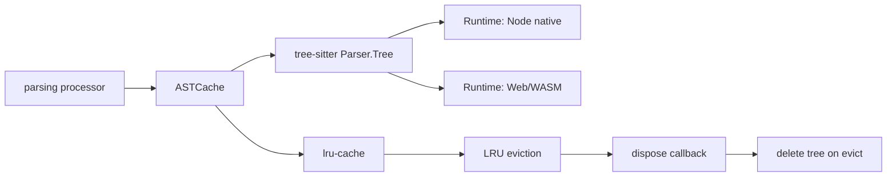
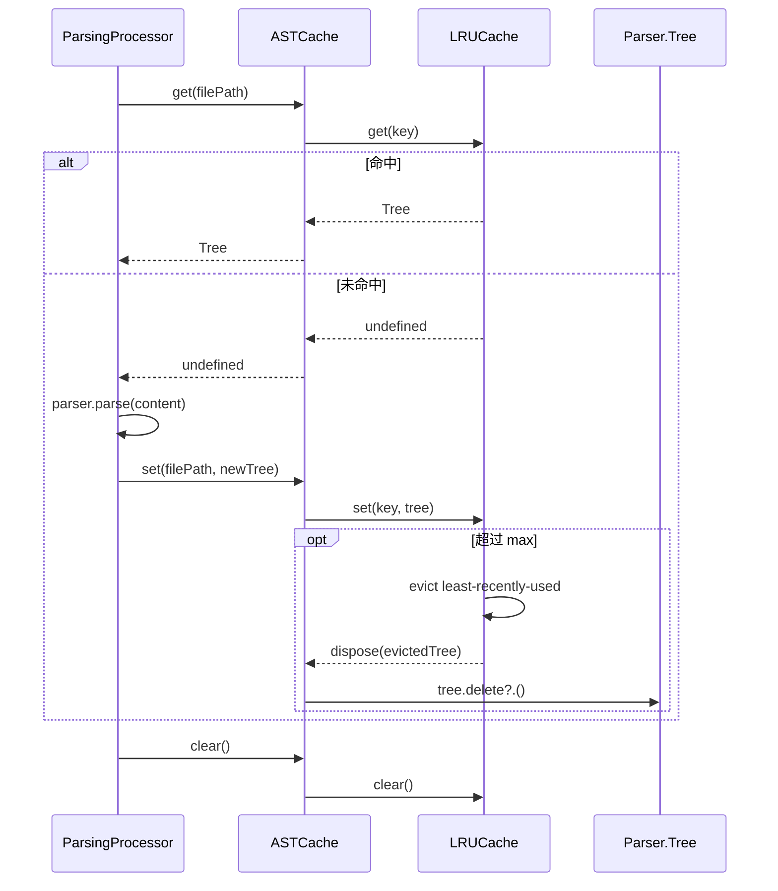
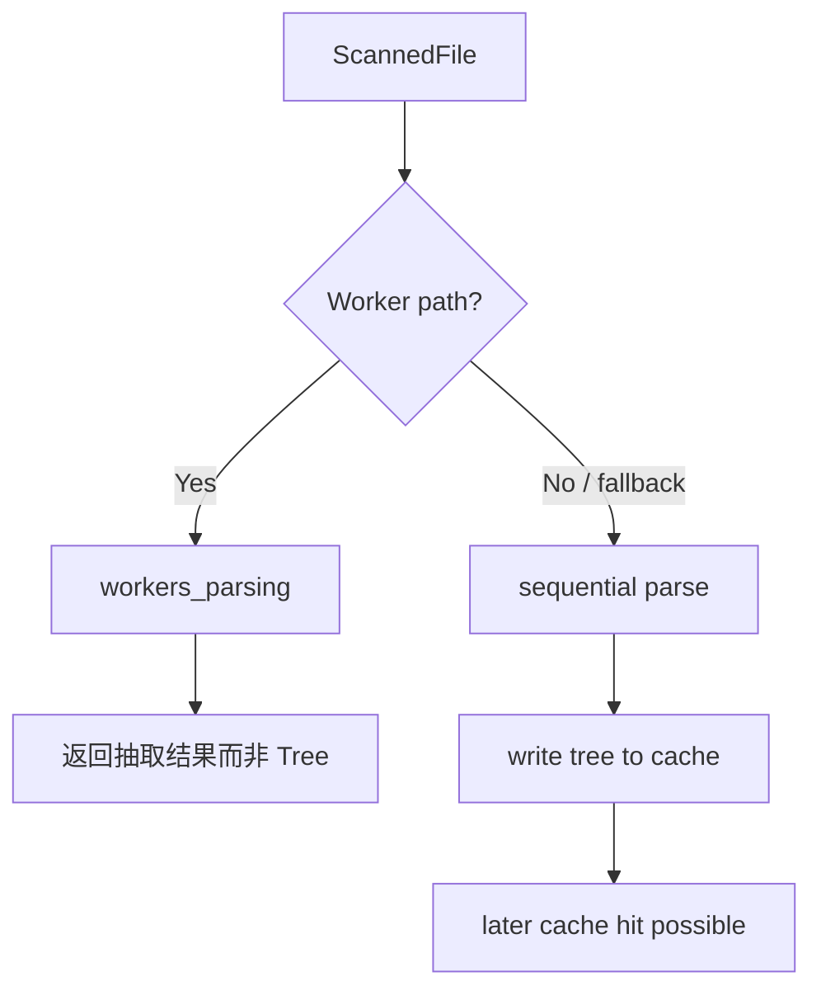
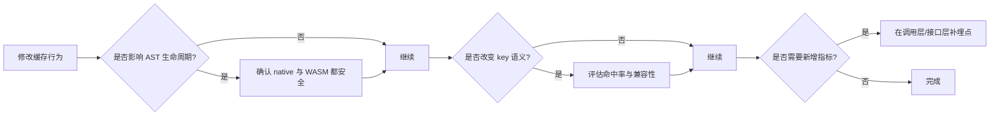
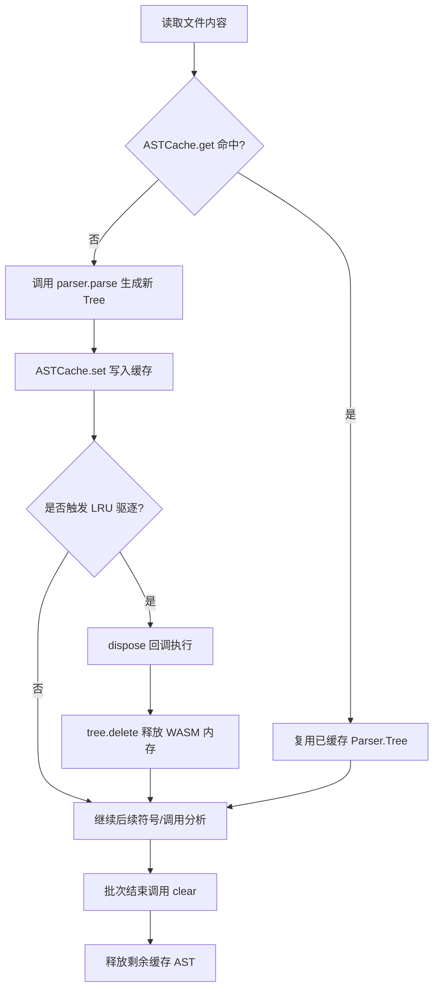

# ast_cache_management 模块文档

## 模块介绍

`ast_cache_management` 模块的职责非常聚焦：为 Tree-sitter 解析得到的 `Parser.Tree` 提供一个可控容量的内存缓存，以降低重复解析同一文件时的 CPU 开销，并在缓存淘汰时尽可能释放底层资源。它并不负责“如何解析文件”，也不负责“如何把 AST 转成图谱节点”，而是负责解析阶段中最容易被忽视但实际非常关键的一层——**AST 对象生命周期管理**。

在 GitNexus 的摄取流水线里，AST 是高成本对象。对于大型仓库，反复解析文件会迅速放大耗时；而对于浏览器/WASM 运行时，AST 若不显式释放，还会造成额外内存压力。这个模块通过 `lru-cache` 的 LRU 策略和 `dispose` 钩子，把“性能”和“内存可回收性”统一在同一个抽象后面：调用方只需要 `get/set/clear/stats`，无需直接处理淘汰策略或跨运行时清理细节。

从系统位置看，它属于 `web_ingestion_pipeline` 子域中的 `ast_cache_management`，主要服务于前端/浏览器侧的解析流程（`web-tree-sitter` + WASM）。建议结合阅读以下文档理解上下游（若已生成）：

- 解析执行与抽取结构：[`workers_parsing.md`](workers_parsing.md)
- 解析编排与结果组织：[`parsing_processor_orchestration.md`](parsing_processor_orchestration.md)
- 上游图谱结构（最终消费方向）：[`graph_domain_types.md`](graph_domain_types.md)

---

## 核心组件

本模块核心类型为 `ASTCache`（接口），并由工厂函数 `createASTCache(maxSize?)` 生成实现实例。

### `ASTCache` 接口

```ts
export interface ASTCache {
  get: (filePath: string) => Parser.Tree | undefined;
  set: (filePath: string, tree: Parser.Tree) => void;
  clear: () => void;
  stats: () => { size: number; maxSize: number };
}
```

该接口刻意保持最小化，暴露四个能力：

- `get(filePath)`：按文件路径取缓存树，未命中返回 `undefined`。
- `set(filePath, tree)`：写入或覆盖某文件对应 AST。
- `clear()`：清空缓存。
- `stats()`：返回当前缓存条目数和配置上限。

这种 API 设计的意义是把调用方与 `lru-cache` 库解耦。未来如果要切换缓存实现（比如加入 TTL、分层缓存、弱引用策略），上层解析流程可基本不变。

### `createASTCache(maxSize = 50)`

```ts
export const createASTCache = (maxSize: number = 50): ASTCache => {
  const cache = new LRUCache<string, Parser.Tree>({
    max: maxSize,
    dispose: (tree) => {
      try {
        // 与当前实现一致：直接调用 delete，由 try/catch 兜底
        tree.delete();
      } catch (e) {
        console.warn('Failed to delete tree from WASM memory', e);
      }
    }
  });

  return {
    get: (filePath: string) => cache.get(filePath),
    set: (filePath: string, tree: Parser.Tree) => { cache.set(filePath, tree); },
    clear: () => { cache.clear(); },
    stats: () => ({ size: cache.size, maxSize: maxSize })
  };
};
```

工厂函数的关键行为包括两点。第一，它通过 `max` 参数将缓存变成有界集合，避免 AST 无限堆积。第二，它在 `dispose` 中直接调用 `tree.delete()`，并用 `try/catch` 兜底。这种写法与 `web-tree-sitter` 的资源释放模型一致：当条目被淘汰时，尽量立即释放对应 WASM 侧资源；若释放阶段抛错，则只记录告警，不中断主流程。

---

## 架构与依赖关系



该模块本身非常薄，但它连接了三个重要关注点：解析编排层（调用方）、缓存策略库（`lru-cache`）与 AST 对象的运行时语义（native vs WASM）。这也是它存在的价值：把这些跨层细节封装到一个稳定接口中。

---

## 数据流与生命周期



从调用方视角，它是标准 cache-aside 模式：先 `get`，miss 则解析并 `set`。不同在于 AST 是重量对象，淘汰时不仅是“删除引用”，还尝试触发底层内存释放。这种行为在 Web/WASM 场景尤为关键。

---

## 与摄取流水线的协作方式

在 `parsing_processor_orchestration` 的顺序回退路径中，文件解析得到 `Parser.Tree` 后会写入 `ASTCache`，后续如果同文件再次参与解析流程可直接复用缓存树，从而减少重复构建 AST 的成本。并行 worker 路径则通常不共享主线程 AST（worker 内树对象不直接跨线程传输），因此 `ASTCache` 的收益主要集中在单线程/回退路径或同线程重复解析场景。



如果你正在调优 ingestion 的端到端性能，需要意识到：`ASTCache` 并不是全局万能提速器，它在“同线程重复访问同一文件 AST”的模式下最有效。

---

## API 使用示例

### 基础用法

```ts
import Parser from 'tree-sitter';
import { createASTCache } from './ast-cache';

const parser = new Parser();
const astCache = createASTCache(100);

function parseWithCache(filePath: string, content: string): Parser.Tree {
  const cached = astCache.get(filePath);
  if (cached) return cached;

  const tree = parser.parse(content);
  astCache.set(filePath, tree);
  return tree;
}
```

### 在任务结束时主动清理

```ts
async function runBatch(files: Array<{ path: string; content: string }>) {
  const astCache = createASTCache(200);
  try {
    for (const f of files) {
      // ... parseWithCache(f.path, f.content)
    }
  } finally {
    astCache.clear();
  }
}
```

对于长生命周期进程（CLI daemon、server、IDE-like 会话），建议在批处理边界或仓库切换时调用 `clear()`，避免“历史仓库 AST 持续占内存”。

---

## 配置与调优建议

`maxSize` 是唯一暴露配置项，但它影响非常直接。

- 小值（如 20~50）：内存更可控，命中率较低，适合超大仓库或内存受限环境。
- 中值（如 100~300）：适合常见后端仓库，通常在命中率与内存占用之间较平衡。
- 大值（500+）：只建议在你确认重复访问模式明显且机器内存充足时使用。

经验上应结合 `stats().size`、进程内存曲线和解析耗时来定标，而不是盲目增大 `maxSize`。

---

## 边界行为、错误条件与限制

### 1) Key 语义：`filePath` 必须稳定

缓存键是传入的原始 `filePath` 字符串。模块不做路径规范化（如绝对/相对路径统一、大小写归一、符号链接归一）。这意味着同一文件如果以不同字符串表示，会被当作不同缓存项，导致命中率下降和内存重复占用。

### 2) `stats()` 不是性能指标面板

当前 `stats()` 仅返回 `{ size, maxSize }`，不包含 hit/miss、eviction 次数、平均驻留时间等指标。如果你在做性能诊断，需要在调用层自行埋点。

### 3) `dispose` 清理是“尽力而为”

`tree.delete?.()` 放在 `try/catch` 中，失败只会 `console.warn`。这是一种可用性优先策略：避免因为清理异常让解析主流程失败。但代价是某些极端情况下可能留下暂时不可回收资源，需要结合进程级生命周期管理（如批次后 `clear`）控制风险。

### 4) 并发与线程边界

该缓存实例本身没有跨线程共享机制。在 worker 模式下，通常每个线程拥有各自内存空间和对象图，不能把主线程缓存当成 worker 的共享 AST 池。若要跨线程复用，需要额外设计可序列化中间表示（通常不再是 `Parser.Tree`）。

### 5) 仅缓存 AST，不缓存解析错误

模块不会记录“某文件解析失败”的负缓存状态。若同一异常文件重复进入流程，调用方仍可能反复尝试解析。若你遇到这类问题，可在上层增加失败重试上限或失败路径短路缓存。

---

## 可扩展方向

如果后续要增强本模块，通常有三条路线。

第一条是“可观测性增强”：在接口层扩展 hit/miss/eviction 指标，支持更精确的性能调优。第二条是“策略增强”：在 LRU 之外加入 TTL、按语言分区上限、或按文件大小加权的淘汰策略。第三条是“键规范化能力”：在 `set/get` 前统一路径规范，减少重复缓存。

一个兼容现有调用方的演进方式是保留 `ASTCache` 基本接口，同时新增可选工厂配置对象，例如：

```ts
createASTCache({
  maxSize: 200,
  normalizeKey: (p) => path.resolve(p),
  onEvict: (key) => metrics.count('ast_cache_evict', 1),
});
```

这类改造不应破坏当前简洁 API，但可以显著提升大规模运行场景下的可控性。

---

## 维护者速查（面向改动）



该检查流程的核心原则是：任何缓存优化都必须同时考虑性能、内存与跨运行时行为一致性，不能只看单点 benchmark。

---

## 总结

`ast_cache_management` 是一个小而关键的基础模块。它以最少 API 提供 AST 复用能力，通过 LRU 控制容量，并在淘汰时兼容性地尝试释放底层树对象。对于使用者来说，重点在于正确设置 `maxSize`、保持 `filePath` 键稳定、在生命周期边界主动 `clear()`；对于维护者来说，重点在于理解它处在解析性能与内存安全的交叉点，任何改动都应进行跨运行时验证。


## 组件逐项内部机制补充

### `get(filePath)` 的行为细节

`get` 底层直接委托给 `LRUCache.get`，时间复杂度通常为 O(1)。需要注意的是，在 LRU 语义下，命中会更新该条目的“最近访问时间”，这会影响后续淘汰顺序。因此，某些高频读取文件即使很早写入，也会长期驻留在缓存中。对于解析器来说，这是合理且期望的行为，因为热点文件通常是跨模块引用集中位置。

### `set(filePath, tree)` 的覆盖和驱逐语义

当 `set` 一个已存在 key 时，旧 `Parser.Tree` 将离开缓存并触发 `dispose` 回调；当缓存容量已满时，最久未使用条目会被驱逐，也会触发 `dispose`。这两个场景都依赖同一清理路径，因此维护者在修改时要确保“覆盖”和“淘汰”都不会绕过 `tree.delete()`。

### `clear()` 的资源清理边界

`clear()` 的职责是释放缓存当前持有的 AST 资源。它不负责解析器实例、语言对象、文件内容缓存等其他资源的回收。因此在完整 ingestion 生命周期收尾时，通常需要与其他模块的清理逻辑配合执行，避免把 `clear` 误解为“全链路资源回收”。

### `stats()` 的运维意义

`stats()` 返回的是容量状态快照，而不是性能统计面板。也就是说它无法直接告诉你命中率，但它能帮助判断“缓存是否持续顶满”。如果长期接近 `maxSize`，常意味着当前容量偏小或访问局部性不强，可结合外层埋点进一步分析。

## 过程流转图：从文件解析到缓存回收



这个流程体现了模块的核心价值：在“不改变上层分析算法”的前提下，把 AST 的生成、复用、淘汰和回收连接成一个闭环。调用方只关心命中与否，不需要在业务代码里散落 `delete()` 细节。

## 已知限制与扩展建议

当前实现以简洁为优先，因此没有提供 TTL、按文件大小加权淘汰、按语言分区容量等高级策略。对于超大仓库或多语言混合仓库，这些能力可能成为后续优化方向。建议优先在不破坏现有接口的情况下扩展 `createASTCache` 的可选配置对象，并保持默认行为与当前版本兼容。

另一个限制是键规范化缺失。若同一文件在调用链路中可能出现相对路径、绝对路径、大小写差异路径，缓存会出现“逻辑重复项”。建议在调用层统一路径规范，或在工厂层增加可选 `normalizeKey` 钩子。

## 参考与关联模块

- [symbol_indexing_and_call_resolution.md](symbol_indexing_and_call_resolution.md)：消费 AST 进行符号索引与调用解析。
- [web_pipeline_and_storage.md](web_pipeline_and_storage.md)：负责 Web 端 ingestion 执行编排与生命周期管理。
- [core_ingestion_parsing.md](core_ingestion_parsing.md)：服务端 ingestion 的解析与缓存相关实现，可用于对照设计。
- [web_ingestion_pipeline.md](web_ingestion_pipeline.md)：Web 摄入子系统总览（如已生成）。
