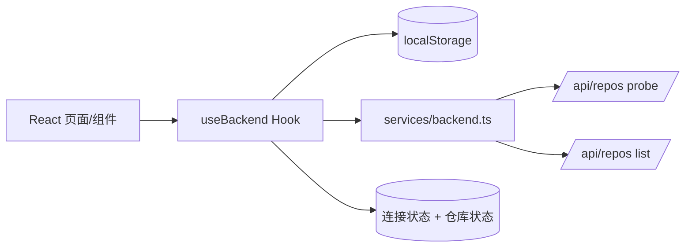
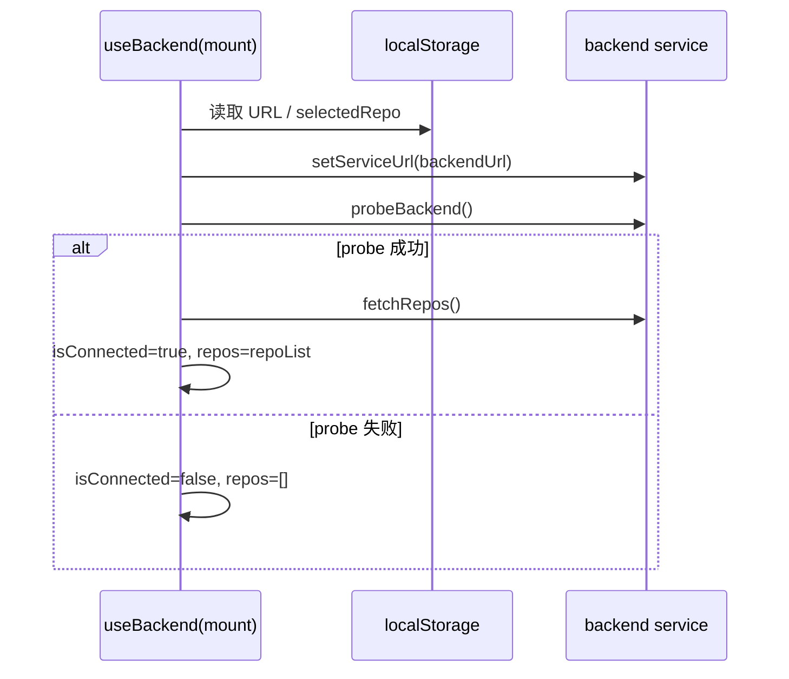
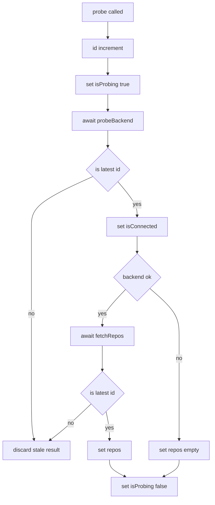
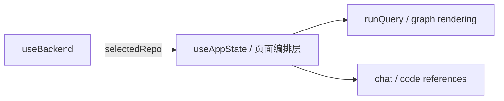

# backend_connectivity_hook 模块文档

## 1. 模块定位与设计动机

`backend_connectivity_hook`（实现文件：`gitnexus-web/src/hooks/useBackend.ts`）是 Web UI 与后端服务之间的“连接状态协调层”。它的职责并不是直接执行图查询或仓库分析，而是把“是否连上后端、当前后端地址、可用仓库列表、当前选择仓库、连接探测生命周期”这些横切关注点集中到一个 React Hook 中，供上层页面和状态编排模块统一使用。

该模块存在的必要性在于：后端连接属于典型的异步且易抖动状态。如果每个组件都直接调用 `probeBackend()`、`fetchRepos()`，会导致重复请求、竞态更新、UI 闪烁，以及本地持久化策略不一致。`useBackend` 通过“单一状态源 + 防抖 + 请求结果竞态保护 + localStorage 持久化”提供了稳定的连接体验，使 UI 在网络波动和用户频繁修改 URL 时仍能保持可预测行为。

从系统分层看，它位于 `web_app_state_and_ui` 子域，但与后端 API 细节强相关，底层依赖 [web_backend_services.md](web_backend_services.md) 中的 HTTP client（`probeBackend`、`fetchRepos`、`setBackendUrl`）。在更高层通常由 [app_state_orchestration.md](app_state_orchestration.md) 或页面级容器消费，以决定是否展示服务器模式、仓库选择器或离线模式提示。

---

## 2. 对外契约：`UseBackendResult`

`UseBackendResult` 是模块唯一核心公共类型，它定义了 Hook 返回值的完整行为接口。该接口把“状态字段”和“动作函数”放在同一契约里，目的是让消费端在一处即可获取读写能力，而不必了解内部状态机。

```typescript
export interface UseBackendResult {
  isConnected: boolean;
  isProbing: boolean;
  backendUrl: string;

  repos: BackendRepo[];
  selectedRepo: string | null;

  setBackendUrl: (url: string) => void;
  selectRepo: (name: string) => void;
  probe: () => Promise<boolean>;
  disconnect: () => void;
}
```

其中，`BackendRepo` 类型来自 `../services/backend`，它描述仓库名称、路径、索引时间、提交信息和可选统计信息。类型细节请参考 [web_backend_services.md](web_backend_services.md)。

---

## 3. 模块架构与依赖关系



该结构体现了一个关键设计：`useBackend` 不直接管理业务图数据，而专注“连接控制平面（control plane）”。实际数据访问由服务层负责，Hook 只负责把服务调用结果映射为 UI 可消费的稳定状态。这样可以把 HTTP 错误处理、超时配置留在服务层，而把防抖、竞态取消、持久化留在 Hook 层，实现关注点分离。

---

## 4. 内部状态模型与生命周期

### 4.1 持久化键与默认值

模块使用两个 localStorage 键：`gitnexus-backend-url` 与 `gitnexus-backend-repo`。初始化时分别读取后端 URL 与已选仓库；读取失败（例如浏览器禁用存储、隐私模式限制）会回退到默认值。

- 默认后端 URL：`http://localhost:4747`
- 默认选中仓库：`null`

这种“惰性初始化 + try/catch”策略保证 SSR 之外的浏览器场景下尽量恢复用户历史会话，同时避免存储异常导致页面崩溃。

### 4.2 状态字段

`useBackend` 内部维护以下 React state：

- `backendUrl`：当前目标服务地址。
- `isConnected`：最近一次探测是否成功。
- `isProbing`：当前是否存在进行中的探测流程。
- `repos`：最近一次成功拉取到的仓库列表。
- `selectedRepo`：当前用户选择的仓库名。

此外还有两个 `ref`：

- `probeIdRef`：单调递增请求代号，用于丢弃过期异步结果。
- `debounceRef`：保存 URL 更新后的防抖定时器句柄。

---

## 5. 核心流程详解

### 5.1 挂载初始化流程



Hook 在 `useEffect`（仅 mount）中先同步服务层 URL，再自动执行一次 `probe()`。这避免了“UI 中显示持久化 URL，但 service 仍在使用默认 URL”造成的首轮请求错地址问题。卸载时会清理防抖计时器，防止组件销毁后仍触发异步探测。

### 5.2 `probe()` 的竞态保护流程



`probe()` 是本模块最关键的方法。它不只是“测活”，还负责在成功后刷新仓库列表。为避免并发探测造成旧结果覆盖新结果，方法在开始时拿到当前 `id`，后续每个异步阶段都校验 `id === probeIdRef.current`。只要期间有新的 probe 触发，旧请求即被逻辑废弃，不再写入状态。

### 5.3 `setBackendUrl()` 的防抖探测

`setBackendUrl(url)` 依次执行四件事：更新本地 state、同步 service 层 URL、尝试持久化到 localStorage、重置并启动一个 500ms 防抖定时器，最终触发 `probe()`。

这意味着输入框连续修改 URL 时不会每次都立刻发请求，而是等待用户停止输入 500ms 后再探测。该策略能显著降低 `/api/repos` 探针压力，并减少 UI 在快速输入下的连接状态抖动。

### 5.4 `disconnect()` 的语义

`disconnect()` 并不清空后端 URL，而是把当前会话回退到“未连接”状态：

- 自增 `probeIdRef`，使进行中的 probe 结果全部失效。
- 立即设置 `isConnected=false`、`isProbing=false`、`repos=[]`。
- 清空 `selectedRepo` 并移除 `LS_REPO_KEY`。

该设计保留了“用户偏好的服务地址”，便于稍后重连；但会清除“当前仓库上下文”，避免断开后仍显示过期仓库选择。

---

## 6. 关键 API 行为说明（参数、返回值、副作用）

### 6.1 `setBackendUrl(url: string): void`

此方法接收任意字符串 URL，不在 Hook 层做格式校验。真正请求时服务层会通过 `fetch` 反馈网络错误或超时。副作用包括：

1. 更新 `backendUrl` state。
2. 调用 `setServiceUrl(url)` 改写服务模块内部基址。
3. 尝试 `localStorage.setItem(LS_URL_KEY, url)`。
4. 重置防抖计时并在 500ms 后触发 `probe()`。

如果调用非常频繁，仅最后一次调用会触发探测。

### 6.2 `selectRepo(name: string): void`

设置当前仓库名并持久化到 `LS_REPO_KEY`。它不验证 `name` 是否存在于 `repos`，因此消费侧通常应在仓库列表来源可信时调用（例如下拉框选项来自 `repos`）。这是一种“轻约束、低耦合”策略：Hook 不强绑定 UI 交互形态。

### 6.3 `probe(): Promise<boolean>`

返回值语义是“本次调用（且未被更新 probe 取代）时的连通性结果”。异常被内部吞并并转为 `false`，因此调用方通常不需要 try/catch，只需根据布尔值分支。副作用是更新 `isConnected`、`isProbing`、`repos`。

### 6.4 `disconnect(): void`

这是一个纯本地状态操作，不调用服务端 API。常用于切换到 browser-only 模式，或用户主动退出当前服务器会话时执行。

---

## 7. 与其他模块的协作方式

在完整应用中，`useBackend` 通常与上层状态编排结合：先通过本 Hook 建立连接并选择仓库，再由 [app_state_orchestration.md](app_state_orchestration.md) 的能力加载图谱、执行查询、驱动聊天/引用面板。



建议将 `useBackend` 视为“连接前置条件管理器”，而不是业务数据总线。这样能保持模块职责稳定，也便于未来替换后端协议实现。

---

## 8. 典型使用示例

```tsx
import { useBackend } from '../hooks/useBackend';

export function BackendSwitcher() {
  const {
    backendUrl,
    isConnected,
    isProbing,
    repos,
    selectedRepo,
    setBackendUrl,
    selectRepo,
    probe,
    disconnect,
  } = useBackend();

  return (
    <section>
      <input
        value={backendUrl}
        onChange={(e) => setBackendUrl(e.target.value)}
        placeholder="http://localhost:4747"
      />

      <button onClick={() => void probe()} disabled={isProbing}>
        {isProbing ? 'Checking...' : 'Probe'}
      </button>

      <button onClick={disconnect}>Disconnect</button>

      <p>Status: {isConnected ? 'Connected' : 'Disconnected'}</p>

      <select
        value={selectedRepo ?? ''}
        onChange={(e) => selectRepo(e.target.value)}
        disabled={!isConnected || repos.length === 0}
      >
        <option value="" disabled>
          Select repo
        </option>
        {repos.map((r) => (
          <option key={r.name} value={r.name}>
            {r.name}
          </option>
        ))}
      </select>
    </section>
  );
}
```

在这个模式下，URL 输入会自动防抖重探；用户也可手动点击 `Probe` 强制检查。若需要避免重复渲染，可在容器层配合 `useMemo`/`useCallback` 对派生 props 做稳定化。

---

## 9. 边界条件、错误处理与已知限制

### 9.1 localStorage 不可用

模块所有存储读写都包裹在 `try/catch` 中，因此即使 storage 被禁用也能运行。但副作用是 URL/仓库选择不会跨刷新保留。该行为是“优雅降级”而非错误。

### 9.2 竞态下 `probe()` 可能返回 `false`

当一次 probe 被更晚的 probe 抢占时，旧调用会因 `id` 校验失败而提前返回 `false`。这并不一定表示后端不可达，而是表示该结果已过期。调用方若并发触发 probe，应优先以最新状态字段 `isConnected` 为准。

### 9.3 URL 未做语法规范化

Hook 直接接受输入 URL 并传给服务层。服务层会去除结尾 `/`（`setBackendUrl` in service）并在请求失败时抛网络错误；但 Hook 本身不会提前校验协议、端口是否合法。因此 UI 若希望更友好提示，应增加输入校验。

### 9.4 `selectedRepo` 与 `repos` 可能短暂不一致

场景包括：

- 用户从 localStorage 恢复了旧仓库名，但新后端中已不存在该仓库；
- `disconnect()` 后立即重连，列表尚未刷新。

当前实现不会自动纠正该不一致。建议消费端在 `repos` 更新后验证 `selectedRepo` 是否仍存在，不存在则提示用户重选。

### 9.5 轻微代码洁净度问题：`getBackendUrl` 未使用

`useBackend.ts` 当前导入了 `getBackendUrl` 但未使用。这不影响运行，但会在严格 lint 配置下触发 unused import 警告，可在后续清理。

---

## 10. 可扩展性建议

如果要扩展该模块，建议保持其“连接层”职责边界，不要把业务查询逻辑直接塞入本 Hook。可行演进方向包括：

1. 增加 `lastError` 状态，用于展示最近一次探测失败原因（当前仅布尔化）。
2. 为 `setBackendUrl` 引入可选参数（如 `immediate?: boolean`），支持绕过防抖的即时探测。
3. 提供 `validateSelectedRepo()` 辅助方法，在仓库列表刷新后自动纠偏。
4. 增加重试策略（指数退避）以改善临时网络抖动场景。

这些扩展都应复用现有 `probeIdRef` 竞态保护机制，避免倒退到异步覆盖问题。

---

## 11. 结论

`backend_connectivity_hook` 体量不大，但在系统中承担了关键的稳定性职责：它把后端连通性这一高波动状态封装为可预测的 React 接口，并通过防抖、竞态丢弃和持久化降级处理，保证 Web UI 在“用户频繁操作 + 网络不稳定 + 会话跨刷新”的现实环境中依然行为一致。对于新开发者而言，理解这个 Hook 的价值不在于 API 数量，而在于它对连接生命周期的治理方式；后续任何服务器模式功能，都应优先复用这层能力而非绕过它直接调用服务。
