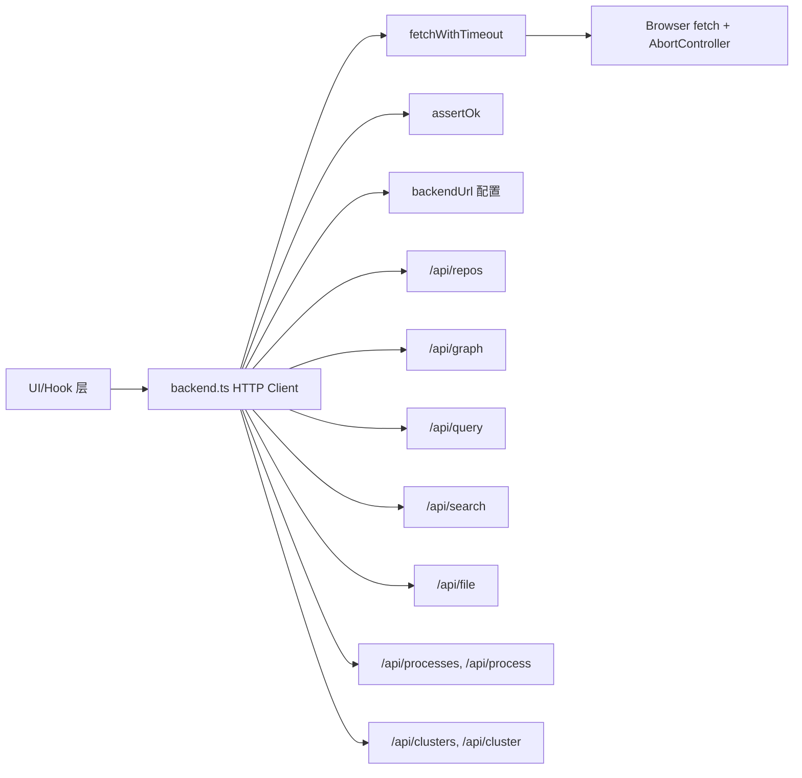
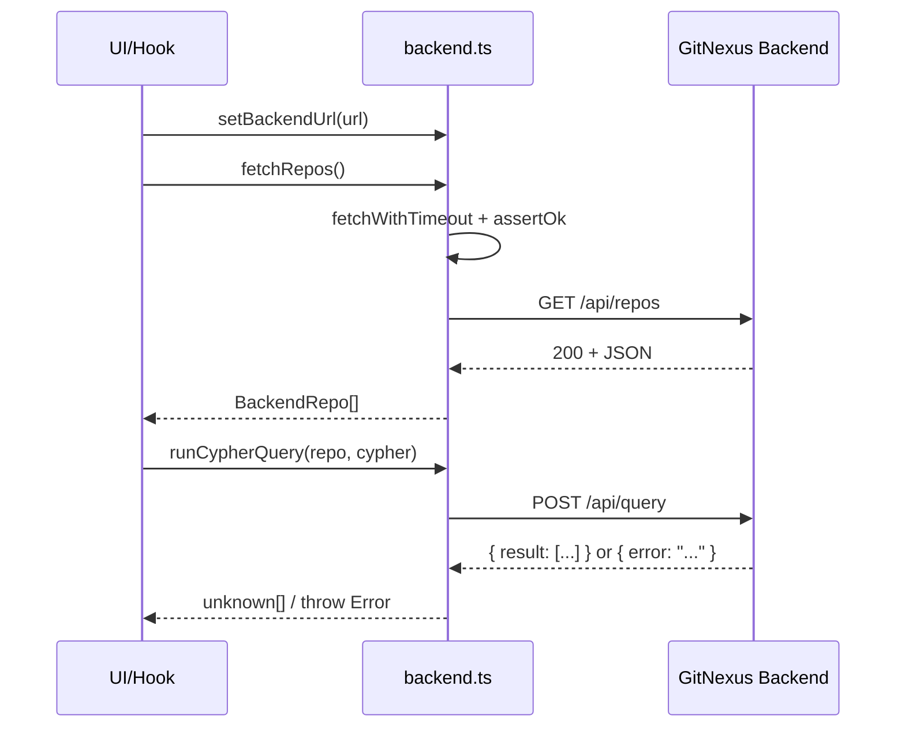

# backend_http_client 模块文档

## 1. 模块定位与设计动机

`backend_http_client` 对应实现文件 `gitnexus-web/src/services/backend.ts`。它是 GitNexus Web 端访问本地后端服务（默认 `http://localhost:4747`）的**无状态 HTTP 客户端层**，主要职责是把前端常见的数据请求（仓库列表、图谱、Cypher 查询、搜索、文件内容、流程与集群信息）封装成一组统一的异步函数。

这个模块存在的核心价值，不是“提供更多业务逻辑”，而是把网络调用中反复出现的问题集中治理：请求超时、URL 拼接、错误消息规范化、`encodeURIComponent` 参数安全处理，以及对不同 API 返回形态的最小规范化（如 `runCypherQuery` 解包 `{ result }`）。这样做让上层 Hook 与状态管理层可以面向“领域动作”编程，而不是在每个调用点重复写 `fetch + timeout + error parsing`。

从系统分层看，它位于 `web_backend_services` 域，向上被连接管理 Hook（见 [backend_connectivity_hook.md](backend_connectivity_hook.md)）和页面编排层消费，向下直接依赖浏览器原生 `fetch`/`AbortController` 以及 GitNexus 后端 HTTP API。它本身不持有 React 状态、不关心 UI 渲染，也不参与图算法计算，因此是一个可复用的基础设施模块。

---

## 2. 核心类型：`BackendRepo`

`BackendRepo` 是该模块唯一导出的领域类型，用于描述后端返回的“已索引仓库摘要”。

```ts
export interface BackendRepo {
  name: string;
  path: string;
  indexedAt: string;
  lastCommit: string;
  stats?: {
    files?: number;
    nodes?: number;
    edges?: number;
    communities?: number;
    processes?: number;
  };
}
```

它与上层连接流程中的仓库展示类型高度相关（例如 `RepoSummary` / `ServerRepoInfo`），但这里特意使用了可选 `stats` 与可选数字字段，体现服务端返回“部分统计缺省”时的兼容策略。也就是说，本模块倾向于**弱约束接收**，把严格校验留给更靠近业务语义的上层。

---

## 3. 架构与依赖关系



这张图体现了一个关键设计决策：所有导出 API 函数都不直接写底层错误处理，而统一经由 `fetchWithTimeout` 与 `assertOk`。因此调用路径被压缩成“参数组织 → 通用请求执行 → 通用状态码断言 → 返回 JSON/内容”，降低了维护分散度。

---

## 4. 配置机制与运行时行为

### 4.1 `backendUrl` 全局可变配置

模块内部通过文件级变量维护后端地址：

```ts
let backendUrl = 'http://localhost:4747';
```

并通过以下接口控制：

```ts
export const setBackendUrl = (url: string): void => {
  backendUrl = url.replace(/\/$/, '');
};

export const getBackendUrl = (): string => backendUrl;
```

`setBackendUrl` 会去除末尾 `/`，避免后续拼接时出现 `//api/...`。这是一个小但实用的归一化动作。需要注意该变量是**模块级共享状态**：同一前端运行时里所有调用共享同一个地址，因此它适合“单后端目标”的应用模型。

### 4.2 超时常量

- `DEFAULT_TIMEOUT_MS = 10_000`
- `PROBE_TIMEOUT_MS = 2_000`
- `fetchGraph` 特殊使用 `60_000`

短探针超时保证连接检测响应快，常规 API 使用 10 秒，图谱全量加载单独放宽到 60 秒。这个分层配置体现了“连接可用性检测”和“大载荷业务请求”在 SLA 上的差异。

---

## 5. 通用辅助函数详解

## 5.1 `fetchWithTimeout(url, init?, timeoutMs?)`

```ts
const fetchWithTimeout = async (
  url: string,
  init: RequestInit = {},
  timeoutMs: number = DEFAULT_TIMEOUT_MS,
): Promise<Response>
```

该函数创建 `AbortController`，用 `setTimeout` 在超时后执行 `controller.abort()`。其异常映射逻辑是本模块可维护性的关键：

- 若为 `AbortError`，抛出 `Request to <url> timed out after <ms>ms`；
- 若为 `TypeError`（常见网络不可达），抛出 `Network error reaching GitNexus backend at <backendUrl>: ...`；
- 其它异常原样抛出；
- `finally` 中无条件 `clearTimeout(timer)`，避免计时器泄漏。

这让上层日志和用户提示更可读，而不是直接暴露浏览器原始异常文本。

## 5.2 `assertOk(response)`

```ts
const assertOk = async (response: Response): Promise<void>
```

如果 `response.ok` 为真，直接返回；否则尝试解析 JSON 并提取 `body.error` 作为错误信息，解析失败则回退到 `Backend returned <status> <statusText>`。其效果是把 HTTP 非 2xx 与业务错误消息聚合到统一 `Error` 抛出路径。

这个函数不会返回错误对象，而是直接 `throw`，因此所有导出 API 函数呈现统一语义：**成功返回数据，失败抛异常**。

---

## 6. API 函数逐项说明

## 6.1 `probeBackend(): Promise<boolean>`

该函数向 `/api/repos` 发起短超时请求（2 秒），仅当 HTTP 状态码为 `200` 时返回 `true`；任何异常与非 200 均返回 `false`。

它故意不抛错，语义是“健康探测”而非“业务读取”。这非常适合在连接管理 Hook 中驱动 UI 状态灯与自动重试，不强迫上层走异常分支。

## 6.2 `fetchRepos(): Promise<BackendRepo[]>`

获取已索引仓库列表，请求路径 `/api/repos`。流程是：请求 → `assertOk` → `response.json()`。返回类型是 `BackendRepo[]`。

副作用仅网络 I/O，无本地缓存。

## 6.3 `fetchGraph(repo): Promise<{ nodes: unknown[]; relationships: unknown[] }>`

请求 `/api/graph?repo=<encoded>`，超时 60 秒。它用于加载仓库完整图谱（节点 + 关系），因此返回值使用 `unknown[]` 体现弱耦合。

调用方通常会在更高层转换为 `GraphNode`/`GraphRelationship`（参见 [graph_domain_types.md](graph_domain_types.md)）后再进入渲染或查询流程。

## 6.4 `runCypherQuery(repo, cypher): Promise<unknown[]>`

向 `/api/query` 发送 JSON POST：

```json
{ "cypher": "...", "repo": "..." }
```

成功后读取 `body`，若含 `body.error` 再次抛错；否则返回 `(body.result ?? body)`。这说明服务端可能返回两种形态：

1. `{ result: [...] }`（标准包装）
2. 直接数组/对象（兼容形态）

客户端在此进行一次薄兼容，避免上层关心后端细枝末节。

## 6.5 `runSearch(repo, query, limit?): Promise<unknown>`

向 `/api/search` POST `{ query, limit, repo }`，通过 `assertOk` 后直接返回 JSON。其结果结构在此模块内不做收窄，通常由搜索功能模块映射为语义/混合检索结果（可参考 [web_embeddings_and_search.md](web_embeddings_and_search.md)）。

## 6.6 `fetchFileContent(repo, filePath): Promise<string>`

GET `/api/file?repo=<encoded>&path=<encoded>`，返回体预期为 `{ content: string }` 并提取 `content`。这里体现了统一编码策略：仓库名与路径都使用 `encodeURIComponent`，可安全处理空格、斜杠、Unicode。

## 6.7 流程与集群接口

- `fetchProcesses(repo): Promise<unknown>` → `/api/processes`
- `fetchProcessDetail(repo, name): Promise<unknown>` → `/api/process`
- `fetchClusters(repo): Promise<unknown>` → `/api/clusters`
- `fetchClusterDetail(repo, name): Promise<unknown>` → `/api/cluster`

这组函数结构完全一致：拼接参数、请求、`assertOk`、返回 JSON。它们对应后端的流程发现与社区聚类分析结果，可与 [process_detection_and_entry_scoring.md](process_detection_and_entry_scoring.md) 和 [community_detection.md](community_detection.md) 形成前后端语义对齐。

---

## 7. 组件交互与数据流



在这个数据流中，`backend.ts` 负责“传输级一致性”，而不负责“领域级解释”。例如返回 `unknown` 并非缺陷，而是刻意将 schema 约束推迟到最合适的业务层，避免基础客户端频繁跟随后端字段演化而破坏兼容。

---

## 8. 使用示例与推荐模式

### 8.1 基础调用示例

```ts
import {
  setBackendUrl,
  probeBackend,
  fetchRepos,
  fetchGraph,
  runCypherQuery,
} from '@/services/backend';

async function bootstrap() {
  setBackendUrl('http://127.0.0.1:4747/');

  const ok = await probeBackend();
  if (!ok) {
    console.warn('Backend unreachable');
    return;
  }

  const repos = await fetchRepos();
  const repo = repos[0]?.name;
  if (!repo) return;

  const graph = await fetchGraph(repo);
  const rows = await runCypherQuery(repo, 'MATCH (n) RETURN n LIMIT 10');

  console.log(graph.nodes.length, rows.length);
}
```

### 8.2 与 React Hook 协作示例

在 React 项目中，不建议每个组件自行管理连接探测和 URL 持久化；应由连接 Hook 统一治理，再通过此模块执行具体请求。可参考 [backend_connectivity_hook.md](backend_connectivity_hook.md) 的模式。

---

## 9. 扩展与演进建议

当你需要新增一个后端接口时，建议沿用现有模板：

1. 在导出函数里只做参数组织与返回值最小整形；
2. 所有请求都走 `fetchWithTimeout`；
3. 所有 HTTP 状态错误都走 `assertOk`；
4. 对 URL query 参数统一 `encodeURIComponent`；
5. 若接口返回结构不稳定，可先返回 `unknown`，在上层逐步收敛类型。

典型新增函数模板如下：

```ts
export const fetchSomething = async (repo: string, id: string): Promise<unknown> => {
  const response = await fetchWithTimeout(
    `${getBackendUrl()}/api/something?repo=${encodeURIComponent(repo)}&id=${encodeURIComponent(id)}`,
  );
  await assertOk(response);
  return response.json();
};
```

---

## 10. 边界条件、错误场景与限制

### 10.1 重要边界条件

- `setBackendUrl` 不校验协议与格式，非法 URL 会在请求阶段报错。
- 模块是“单例配置”模型，不支持同一页面并行访问多个 backend base URL。
- 大图加载（`fetchGraph`）超时 60 秒，极大仓库仍可能超时。

### 10.2 错误语义注意点

- `probeBackend` 吞掉异常并返回 `false`，不抛错。
- 其他业务 API 在网络错误、超时、非 2xx 时均抛 `Error`。
- `runCypherQuery` 即使 HTTP 2xx，也会检查 JSON `error` 字段并抛错。

### 10.3 类型限制

大量函数返回 `unknown`，带来两个现实后果：

1. 灵活：后端字段增减对基础客户端影响小；
2. 风险：调用方若不做类型守卫，运行时错误概率上升。

因此在业务层推荐使用 Zod / 自定义 type guard 做解码。

### 10.4 环境限制

该模块依赖浏览器运行时的 `fetch` 与 `DOMException`。如果在非浏览器环境（某些 SSR/Node 版本）复用，需要确认这些 API 的兼容实现。

---

## 11. 测试与运维建议

建议至少覆盖以下测试场景：

- 超时中断是否抛出预期消息；
- 非 2xx 且 JSON `{ error }` 是否被正确提取；
- 非 JSON 错误体是否回退状态码消息；
- URL 末尾 `/` 归一化是否生效；
- query 参数编码（含中文、空格、`#`、`?`）是否正确。

在运维层面，若用户频繁报告“连接失败但后端正常”，应优先检查：后端地址、跨域策略、代理层超时、以及浏览器是否阻断了本地端口请求。

---

## 12. 相关文档

- [backend_connectivity_hook.md](backend_connectivity_hook.md)：连接状态管理与 URL 持久化策略。
- [app_state_orchestration.md](app_state_orchestration.md)：应用级状态如何消费后端能力。
- [graph_domain_types.md](graph_domain_types.md)：图节点/关系的前端类型约束。
- [web_embeddings_and_search.md](web_embeddings_and_search.md)：搜索结果在更高层的类型语义与处理。

如果你正在实现“连接后自动加载仓库图 + 查询 + 引用面板联动”，建议先阅读 `backend_connectivity_hook`，再回到本模块把每个 API 调用映射到具体页面动作。
