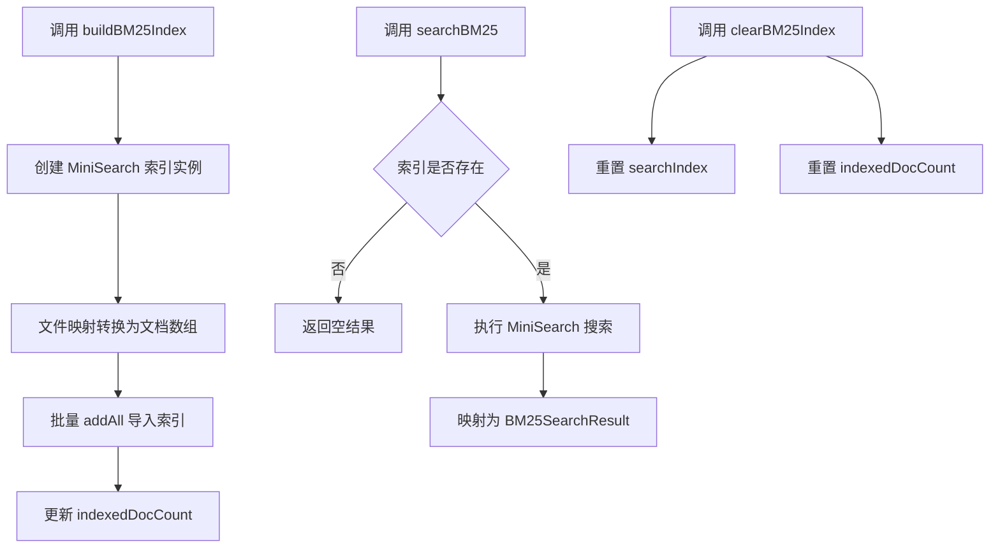
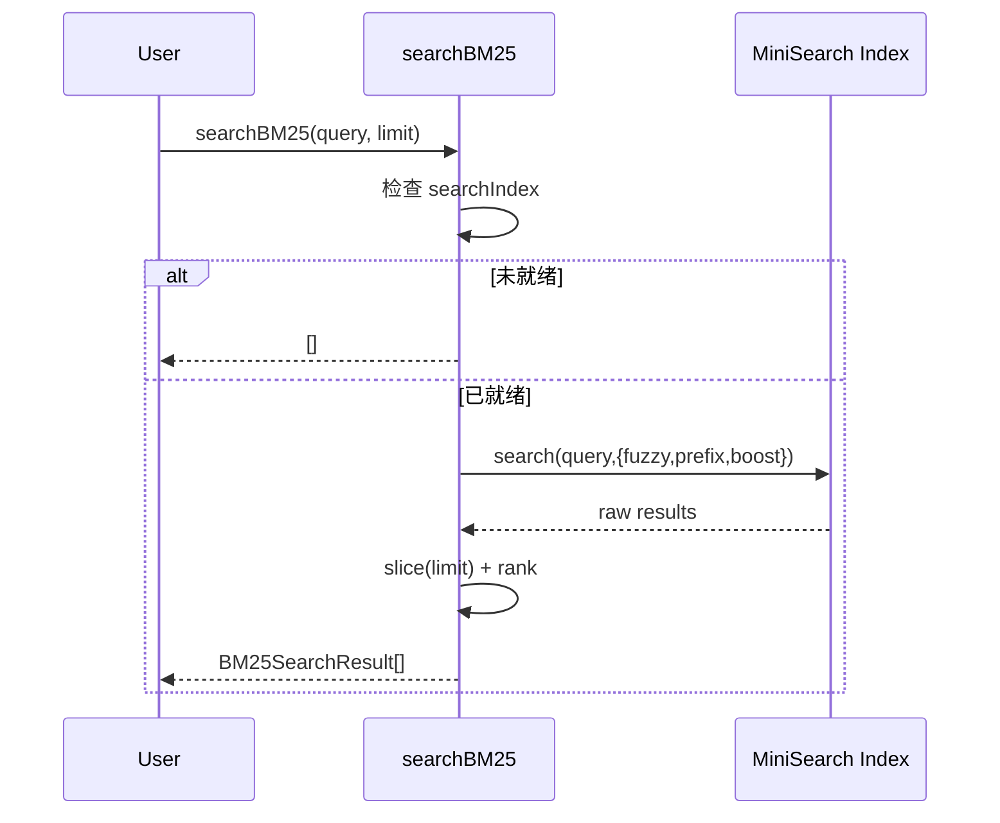
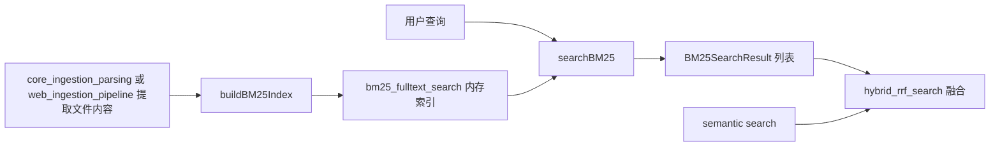

# bm25_fulltext_search 模块文档

## 模块定位与设计目标

`bm25_fulltext_search` 是 GitNexus Web 端检索子系统中的关键词检索模块，位于 `gitnexus-web/src/core/search/bm25-index.ts`。它基于 `MiniSearch` 在内存中构建一个 BM25 风格的全文索引，用于把“文件内容 + 文件名”转成可快速查询的倒排结构，再按相关性返回文件级结果。

这个模块存在的核心价值是补齐语义检索的短板。语义检索更擅长“概念近似”，而 BM25 更擅长“精确词项”，例如函数名、配置键、框架关键字、路径片段等。在 GitNexus 的检索架构里，这个模块提供 lexical retrieval 能力，后续可与语义结果在 [hybrid_rrf_search.md](hybrid_rrf_search.md) 中融合。

从实现风格看，它是一个**轻量状态型模块**：内部使用模块级单例变量缓存索引，不依赖数据库，不做持久化。这让 Web 端离线/本地分析场景更直接，但也带来了生命周期管理与多仓库隔离方面的维护约束（后文会详细说明）。

---

## 核心数据结构

### `BM25Document`

```ts
export interface BM25Document {
  id: string;       // File path
  content: string;  // File content
  name: string;     // File name (boosted in search)
}
```

`BM25Document` 是索引输入结构。`id` 使用文件路径作为主键；`content` 是文件全文；`name` 是文件名（从路径提取），在搜索阶段会被 boost。这个设计反映了模块的产品偏好：查询命中文件名时应显著提高排序。

### `BM25SearchResult`

```ts
export interface BM25SearchResult {
  filePath: string;
  score: number;
  rank: number;
}
```

`BM25SearchResult` 是模块对外稳定契约，保持“文件级”输出。它只暴露三件事：命中文件、相关性分值、最终排名。这个结构也与 `hybrid_rrf_search` 的输入契约直接兼容，避免了跨模块类型转换负担。

---

## 内部状态与组件关系

模块内部有两个关键状态：

- `searchIndex: MiniSearch<BM25Document> | null`：当前索引实例（单例）。
- `indexedDocCount: number`：最近一次建索引的文档计数。

这两者共同决定了 `isBM25Ready()` 与 `getBM25Stats()` 的行为。



上图体现了该模块的完整生命周期：先 build、再 search、必要时 clear。它没有“增量更新”路径，意味着每次数据变更通常需要重建索引才能得到一致结果。

---

## 关键函数详解

## `buildBM25Index(fileContents: Map<string, string>): number`

这是建索引入口。调用方应在 ingestion 完成、文件内容可用后执行它。

函数主要分三步：先创建 `MiniSearch` 实例并配置字段与 tokenizer；再把 `fileContents` 映射为 `BM25Document[]`；最后批量 `addAll` 并记录文档数。

### 参数

- `fileContents`: `Map<string, string>`，键是文件路径，值是文件内容。

### 返回值

- `number`：实际索引文档数量（即 map 条目数）。

### 重要实现点

1. `fields: ['content', 'name']` 指定索引字段，既搜正文也搜文件名。  
2. `storeFields: ['id']` 指定返回时保留 `id`，后续映射到 `filePath`。  
3. 使用 `addAll` 批量导入，降低逐条添加开销。  
4. 在 `import.meta.env.DEV` 下输出调试日志。

### tokenizer 规则（模块语义核心）

自定义 tokenizer 先按空白和常见符号拆分，再做 token 清洗：


这里有一个维护者必须注意的行为细节：代码在最开始已经 `toLowerCase()`，随后又尝试通过 `/([a-z])([A-Z])/g` 拆 camelCase。由于大写字母已被降成小写，这个 camelCase 正则在多数情况下不会生效。换句话说，注释写了“支持 camelCase 拆分”，但当前实现实际上主要依赖第一阶段分隔符切词。若你希望真正支持 `getUserById -> get user by id`，需要调整处理顺序或正则策略。

---

## `searchBM25(query: string, limit = 20): BM25SearchResult[]`

这是查询入口。若索引未构建，函数直接返回空数组，不抛异常。

### 参数

- `query`: 用户关键词。
- `limit`: 最大返回条数，默认 20。

### 返回值

- `BM25SearchResult[]`：按相关性排序后截断，并附带 `rank`（从 1 开始）。

### 查询配置

调用 `MiniSearch.search(query, { ... })` 时使用了三项关键参数：

- `fuzzy: 0.2`：允许轻度模糊匹配，容忍小幅拼写误差。
- `prefix: true`：启用前缀匹配，适合代码补全式查询。
- `boost: { name: 2 }`：文件名命中加权，提升路径/文件名可检索性。



---

## `isBM25Ready(): boolean`

这是一个轻量就绪探针。它要求同时满足：`searchIndex !== null` 且 `indexedDocCount > 0`。这意味着即使索引对象存在，只要文档数为 0，也会判定为未就绪。

在上层编排中，这个函数适合用于“是否启用混合检索中的 BM25 分支”的前置判断。相关融合流程可参考 [hybrid_rrf_search.md](hybrid_rrf_search.md)。

## `getBM25Stats(): { documentCount: number; termCount: number }`

该函数提供可观测性指标：

- `documentCount`: 最近一次建索引的文档数。
- `termCount`: `MiniSearch` 当前词项数。

如果索引不存在，返回 `{ documentCount: 0, termCount: 0 }`。这让 UI 或调试面板可以安全显示状态，而不需要额外判空。

## `clearBM25Index(): void`

用于清理状态或触发重建前置。它会重置索引实例和文档计数。典型使用时机包括：仓库切换、数据重建、会话结束。

---

## STOP_WORDS 机制与检索影响

模块内置了 `STOP_WORDS`，覆盖两类词：

- JavaScript/TypeScript 常见语法词（如 `const`, `function`, `return`, `import`）。
- 英文高频虚词（如 `the`, `is`, `and`, `to`）。

其目标是提升词项区分度，减少噪声召回。副作用是：当用户确实想查这些词时，检索能力会下降。此外，这个停用词表对多语言代码库并不完全适配，尤其在非英文注释或其他编程语言关键字场景中可能不够理想。

---

## 与系统其他模块的关系

`bm25_fulltext_search` 在系统中的位置可以概括为“关键词召回器”。它不负责编码向量、不做融合排序，也不做图数据库查询。



当你需要理解完整检索链路时，建议联合阅读：

- [embeddings_types.md](embeddings_types.md)：语义检索结果契约。
- [hybrid_rrf_search.md](hybrid_rrf_search.md)：BM25 + 语义的 RRF 融合逻辑。
- [core_embeddings_and_search.md](core_embeddings_and_search.md)：检索子系统总览。

---

## 使用方式与实践示例

### 基础建索引与查询

```ts
import {
  buildBM25Index,
  searchBM25,
  isBM25Ready,
  getBM25Stats,
  clearBM25Index,
} from '@/core/search/bm25-index'

const files = new Map<string, string>([
  ['/src/auth/AuthService.ts', 'export class AuthService { login() {} }'],
  ['/src/user/user-repo.ts', 'export const findUserById = () => {}'],
])

buildBM25Index(files)

if (isBM25Ready()) {
  const results = searchBM25('AuthService login', 10)
  console.log(results)
  console.log(getBM25Stats())
}

// 仓库切换或重建时
clearBM25Index()
```

### 与混合检索组合（概念示例）

```ts
const bm25 = searchBM25(query, 50)
const semantic = await semanticSearch(query, 50)
const hybrid = mergeWithRRF(bm25, semantic, 20)
```

---

## 扩展点与可定制方向

当前实现简洁且可用，但如果你的代码库规模更大、语言更多，通常会需要扩展。最常见方向有三类。

第一类是 tokenizer 与停用词策略。你可以按语言家族（TS/Go/Python）引入不同切词规则，或者增加路径 token、驼峰/下划线拆分强化逻辑。第二类是索引更新策略。当前没有增量更新接口，可以考虑封装 “add/update/remove 文档” 流程以降低重建成本。第三类是结果解释能力。现有 `BM25SearchResult` 不含命中片段，如需高可解释 UI，可在不破坏基础接口的前提下新增 debug API。

---

## 边界条件、错误条件与维护陷阱

这个模块没有复杂异常流，但有若干非常实际的“坑位”：

- 如果未先调用 `buildBM25Index`，`searchBM25` 永远返回空数组。这个行为是静默降级，不会告警。
- 模块使用单例状态，在多仓库同会话场景下若未及时 `clearBM25Index` 并重建，可能出现跨仓库污染。
- `fuzzy + prefix` 会提升召回，但在超大索引下可能增加查询成本，需要结合 `limit` 和上层节流控制。
- camelCase 拆分注释与实际实现存在偏差（前文已解释），这会影响某些符号查询的可命中性。
- 该实现是内存索引，不适合作为超大仓库、长生命周期服务端的唯一检索后端。

如果你在生产级 UI/Agent 中使用它，建议至少补充三项运维能力：建索引耗时埋点、查询耗时埋点、索引就绪状态日志。

---

## 维护者速览

`bm25_fulltext_search` 的本质是“轻量、内存态、文件级”的 BM25 检索器。它接口简单、接入成本低，与 `hybrid_rrf_search` 协作自然，特别适合 Web 端代码浏览与问答前置召回。维护时最需要关注的是状态生命周期（build/clear）和 tokenizer 语义一致性（尤其 camelCase 行为）。只要这两点控制好，该模块通常会表现得稳定且高性价比。
