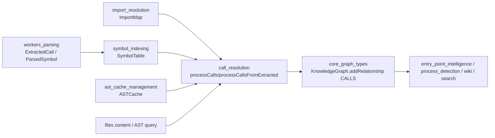
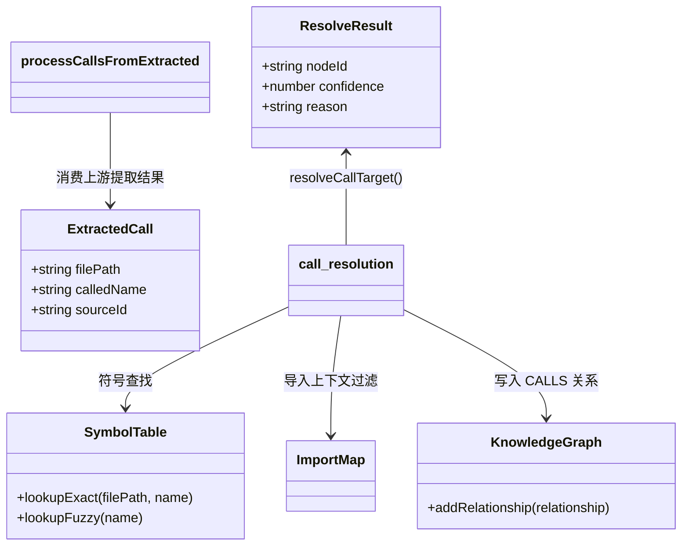
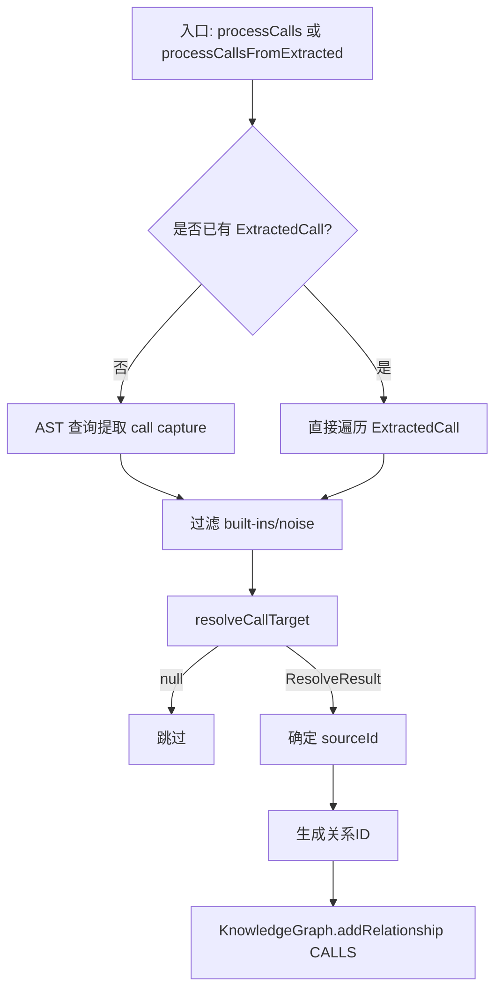
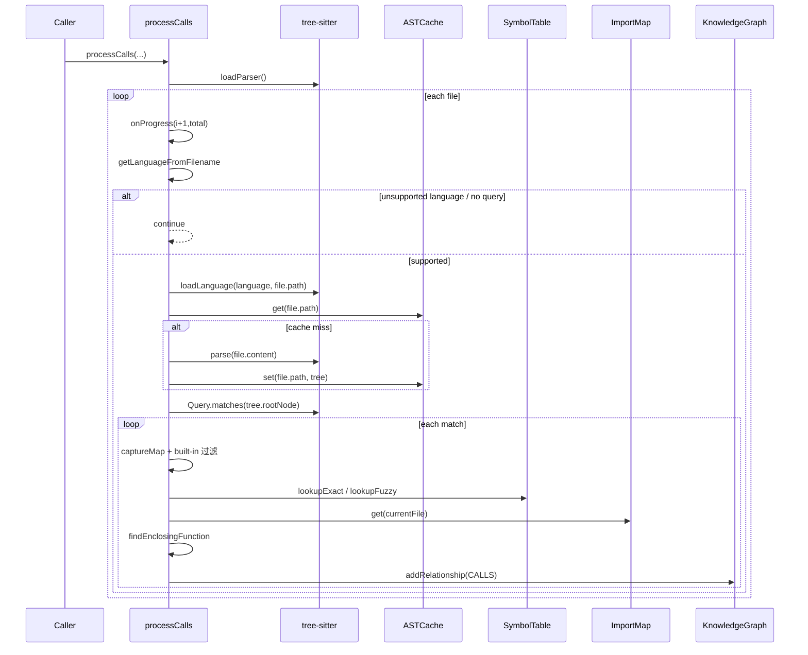
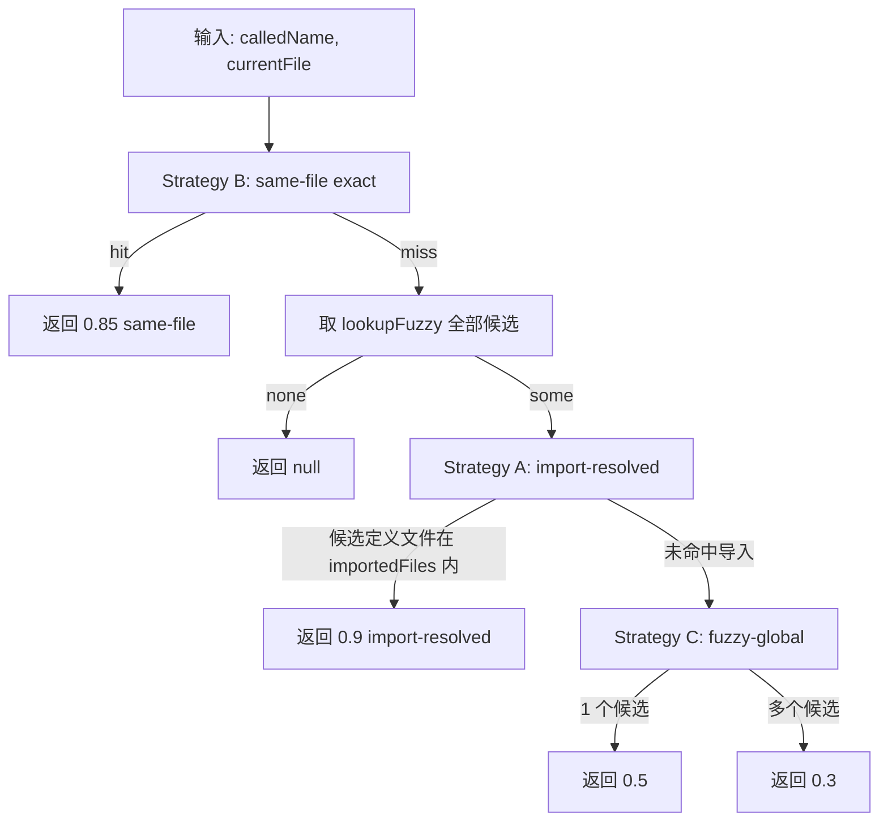
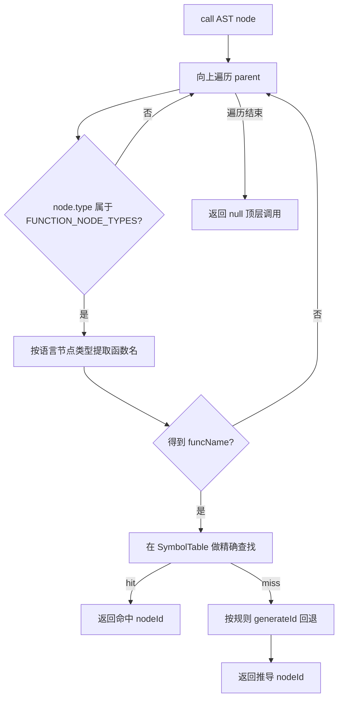

# call_resolution 模块文档

## 模块简介与设计动机

`call_resolution` 模块位于 `core_ingestion_resolution` 子域，核心职责是把“语法层面提取到的调用点（例如 `foo()`）”解析成“知识图谱中的具体目标节点”，并写入 `CALLS` 关系边。换句话说，它不是在做“是否有调用”这一事实提取，而是在做“调用指向谁”这一解析决策。

该模块存在的根本原因是：仅靠 AST 抓到的调用名通常是字符串级信息，天然存在歧义。不同文件可能定义同名函数，局部函数可能遮蔽全局函数，跨文件调用还受到 import 关系影响。如果不做解析，图谱中只能得到大量不可靠或无法连接的调用信息，下游如流程识别、入口评分、社区检测、语义检索都会受到显著影响。

从设计上看，`call_resolution` 选择了“启发式多级解析 + 置信度显式编码”的工程路线，而不是编译器级别的完整静态语义分析。它以 `SymbolTable` 和 `ImportMap` 为事实来源，通过分级策略（同文件、导入命中、全局模糊）快速得出目标节点，同时把不确定性写入 `confidence` 与 `reason` 字段，便于下游系统按可信度消费结果。这种设计在大仓库、多语言、批处理场景下具有很高的性价比。

---

## 在整体系统中的位置



`call_resolution` 的输入有两种模式：一种是“源码 + AST 查询”的标准路径（`processCalls`），另一种是“上游已抽取调用点”的快速路径（`processCallsFromExtracted`）。两条路径最终都会调用同一套目标解析策略，并写入统一结构的 `CALLS` 边。

若你希望先理解上下游模块边界，建议优先阅读：[`workers_parsing.md`](workers_parsing.md)、[`symbol_indexing.md`](symbol_indexing.md)、[`import_resolution.md`](import_resolution.md)、[`core_graph_types.md`](core_graph_types.md)、[`ast_cache_management.md`](ast_cache_management.md)。

---

## 核心数据模型与组件关系

当前文件中唯一显式声明的核心类型是 `ResolveResult`，但模块行为还强依赖 `KnowledgeGraph`、`SymbolTable`、`ExtractedCall`、`ImportMap` 这些外部契约。



### `ResolveResult`

```ts
interface ResolveResult {
  nodeId: string;
  confidence: number;  // 0-1
  reason: string;      // 'import-resolved' | 'same-file' | 'fuzzy-global'
}
```

`ResolveResult` 是调用目标解析的统一输出语义。`nodeId` 是最终目标实体；`confidence` 用于表达该解析路径的可靠程度；`reason` 则记录命中的策略来源。注意它是文件内接口（未导出），但其字段会被直接写入 `GraphRelationship`，因此等价于跨模块契约的一部分。

---

## 总体执行架构



两条入口路径在“如何获得调用点”上不同，但在“如何解析目标与写边”上完全复用逻辑。这种设计降低了维护成本，也保证了无论调用点来自 AST 还是 worker 预提取，最终 `CALLS` 边语义一致。

---

## 关键函数详解

## `processCalls(...)`：标准 AST 路径

```ts
processCalls(
  graph: KnowledgeGraph,
  files: { path: string; content: string }[],
  astCache: ASTCache,
  symbolTable: SymbolTable,
  importMap: ImportMap,
  onProgress?: (current: number, total: number) => void
)
```

`processCalls` 面向“当前阶段仍持有文件内容”的场景。它会逐文件做语言判断、加载 parser language、读取或补建 AST、执行 `LANGUAGE_QUERIES`，在匹配结果中抽取调用点后执行目标解析并落图。



这个函数有几个重要副作用。第一，它可能在缓存 miss 时把新 AST 写回 `ASTCache`，供后续阶段复用。第二，它会把解析不确定性（`confidence`、`reason`）直接固化进图关系。第三，它采用“尽量处理”语义：单文件 parse/query 出错会跳过，不中断整批。

### 参数行为说明

- `graph`：关系写入目标，调用 `addRelationship` 追加 `CALLS` 边。
- `files`：待处理文件与源码内容；路径会参与语言判定、ID 生成与符号查找。
- `astCache`：AST 读取/回写缓存；该模块不负责缓存淘汰策略，仅调用 `get/set`。
- `symbolTable`：调用目标解析的主索引来源。
- `importMap`：用于提高跨文件解析可信度（导入文件优先）。
- `onProgress`：按文件粒度上报进度；即使文件被跳过也会推进计数。

---

## `processCallsFromExtracted(...)`：快速路径

```ts
processCallsFromExtracted(
  graph: KnowledgeGraph,
  extractedCalls: ExtractedCall[],
  symbolTable: SymbolTable,
  importMap: ImportMap,
  onProgress?: (current: number, total: number) => void
)
```

该函数假设调用点已经由解析 worker 提取完成，因此完全绕过 AST 与 query 阶段，仅进行解析与写边。这是大规模批处理时吞吐更高的路径。

它会先按 `filePath` 分组，仅用于进度统计与周期性 `yieldToEventLoop`。随后对每个 `ExtractedCall` 直接执行 `resolveCallTarget`，成功后以 `call.sourceId` 作为 source，写入 `CALLS` 边。

与 `processCalls` 的关键差异是：`sourceId` 不再在本函数内通过 AST 回溯计算，而是信任上游提取的结果（通常为“包围函数 ID”或文件级 ID）。这使模块边界更清晰，但也意味着 `ExtractedCall` 质量直接影响边正确性。

---

## `resolveCallTarget(...)`：三段式解析策略



虽然注释写的是 A->B->C 优先，但实际实现先做了本地文件精确查找（B），因为这是最便宜的 O(1) 操作。若本地未命中，才进入全局候选与导入过滤。

### 解析路径与返回值

1. **same-file**：`symbolTable.lookupExact(currentFile, calledName)` 命中，返回 `confidence=0.85`。这通常代表局部定义或同文件函数调用。
2. **import-resolved**：先 `lookupFuzzy(calledName)` 获取候选，再用 `importMap.get(currentFile)` 过滤定义来源文件；命中即 `confidence=0.9`，属于最高置信路径。
3. **fuzzy-global**：存在候选但不在导入集合中，退化为全局猜测。单候选给 `0.5`，多候选给 `0.3`。
4. **null**：无候选，调用点被忽略，不写边。

该策略非常强调“可解释性”：每条边都能追溯命中原因，而不是只有一个黑盒分数。

---

## `findEnclosingFunction(...)`：调用源定位

`findEnclosingFunction` 的目标是从调用 AST 节点向上回溯，找到包裹它的函数/方法定义，并映射为图节点 ID，作为 `CALLS` 边的 `sourceId`。



该函数支持多语言函数节点类型，如 JS/TS `function_declaration`、Python `function_definition`、Java `method_declaration`、Rust `function_item`/`impl_item` 等。对箭头函数与函数表达式会尝试通过 `variable_declarator` 反查变量名。

当 `lookupExact` 失败时，它会构造一个“理论上应存在”的 ID（`generateId(label, filePath:funcName)`）作为回退，而不是直接退回文件级 source。这样做的意图是：在函数名可识别但符号表未命中时，仍尽量保留函数粒度来源。

---

## 噪声过滤：`BUILT_IN_NAMES` 与 `isBuiltInOrNoise`

模块维护了一个预构建 `Set`，覆盖大量常见内建函数、标准库 API、框架常用调用名（如 React hooks）、集合方法、以及 C/C++/Linux 内核常见宏与 helper。命中即跳过，不生成调用边。

这一机制的目标是减少图噪声和误连边。例如 `console.log`、`map`、`print`、`printf` 往往不是仓库内可解析实体，把它们写成 `CALLS` 关系会显著污染图结构。

需要注意该过滤是“按名称硬匹配”，不看命名空间与上下文，因此会有误伤风险（例如项目中确实定义了 `map` 这样的自定义函数）。这是当前实现在精度与效率之间做的折中。

---

## 与图谱契约的对齐

`call_resolution` 最终调用 `KnowledgeGraph.addRelationship`，构造 `GraphRelationship`：

```ts
graph.addRelationship({
  id: relId,
  sourceId,
  targetId: resolved.nodeId,
  type: 'CALLS',
  confidence: resolved.confidence,
  reason: resolved.reason,
});
```

这意味着模块输出不仅是“边是否存在”，还把“可信度与原因”一并持久化到图层。下游若做流程推断、入口评分或 Agent 路径推荐，应该优先利用这两个字段，而不是把所有 `CALLS` 边等价处理。

---

## 使用方式与实践示例

## 示例 1：标准 AST 路径

```ts
import { processCalls } from 'gitnexus/src/core/ingestion/call-processor';

await processCalls(
  graph,
  filesWithContent,    // [{ path, content }]
  astCache,
  symbolTable,
  importMap,
  (cur, total) => console.log(`calls: ${cur}/${total}`)
);
```

该模式适合你已经在当前阶段持有文件内容，且希望模块自行完成调用点捕获与解析。

## 示例 2：基于 worker 抽取结果的快速路径

```ts
import { processCallsFromExtracted } from 'gitnexus/src/core/ingestion/call-processor';

await processCallsFromExtracted(
  graph,
  extractedCalls,      // ExtractedCall[]
  symbolTable,
  importMap,
  (cur, total) => console.log(`call files: ${cur}/${total}`)
);
```

该模式适合上游 `workers_parsing` 已经产出 `ExtractedCall[]` 的场景，可显著减少 AST 重算成本。

---

## 运行特性、边界条件与已知限制

首先，这个模块是启发式解析，不保证编译器级准确率。`fuzzy-global` 本质是“有定义就猜一个”，在同名大量存在时误连概率较高。虽然 `confidence` 已体现风险，但调用方需要显式处理低置信边。

其次，`findEnclosingFunction` 对语法形态有依赖。若函数名无法从节点结构中提取（例如某些匿名函数模式、复杂装饰器包装），source 可能退化到文件级或构造 ID，影响调用源精度。

第三，噪声过滤是静态名单机制，不会动态感知项目上下文。对于与内建同名的用户自定义符号，可能被错误过滤，导致漏边。

第四，`resolveCallTarget` 在 `fuzzy-global` 分支直接取候选数组第一个元素，结果可能依赖 `SymbolTable` 写入顺序。这在增量分析或并行汇总时要特别注意一致性。

第五，`processCalls` 的错误策略是“吞错继续”：parse 失败、query 失败都会跳过当前文件。好处是鲁棒，代价是静默丢失覆盖率。生产环境建议结合日志或指标统计跳过率。

第六，`processCallsFromExtracted` 仅每 100 个文件上报一次进度并 `yield`，如果调用非常集中在少量文件中，进度曲线可能看起来不够线性。

---

## 扩展与二次开发建议

如果你计划提高精度，最优先的方向不是在本模块增加复杂语义分析，而是增强上游数据质量：例如在 `workers_parsing` 阶段提取更精准的 `sourceId`、限定调用名类别、补充作用域信息。这样可以在不显著增加本模块复杂度的情况下提升整体效果。

如果你需要支持更多语言函数节点，应优先扩充 `FUNCTION_NODE_TYPES` 与名称提取规则，并确保与 `parsing-processor` 的节点 ID 生成约定一致。否则即使识别到了函数名，也可能因 ID 规范不一致而产生“源节点漂移”。

若你需要更稳定的跨文件解析，可考虑把 `resolveCallTarget` 从“单目标返回”升级为“候选集 + 评分”，再由上层策略按上下文二次裁决。这是向高精度演进的常见路径。

---

## 维护者速查

`call_resolution` 的核心价值并不在于“找到所有调用”，而在于“在可接受成本下，把调用尽量可靠地映射到图节点，并显式标注不确定性”。理解这一点有助于你在维护时做正确取舍：当性能、覆盖率、精度冲突时，优先保证结果可解释且可降级，而不是盲目追求单点极致准确。
