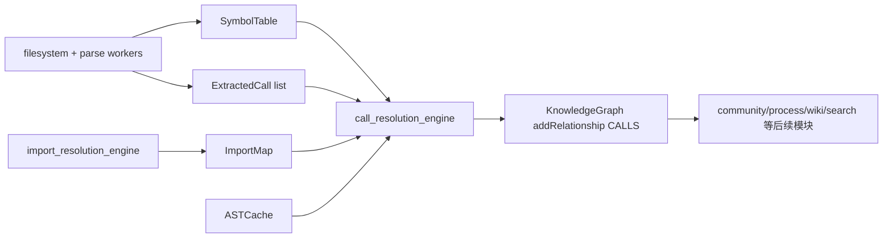
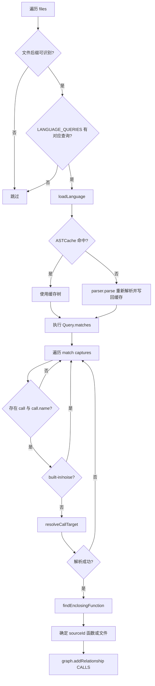
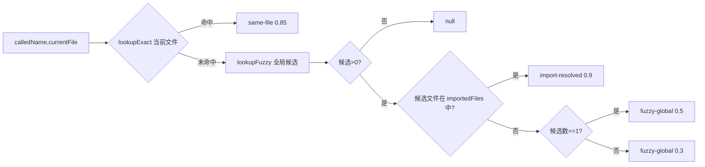
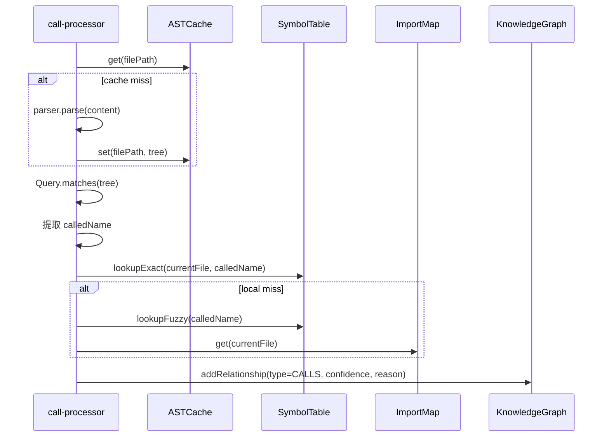

# call_resolution_engine 模块文档

## 模块概览

`call_resolution_engine`（对应实现文件 `gitnexus/src/core/ingestion/call-processor.ts`）负责在代码摄取（ingestion）阶段把“调用行为”转成知识图谱中的 `CALLS` 关系。它解决的问题不是“把 AST 解析出来”，而是更靠后的一步：在已经拥有符号表（`SymbolTable`）、导入解析结果（`ImportMap`）和可选 AST 缓存（`ASTCache`）的前提下，尽可能把 `foo()` 这种调用点，映射到图谱中某个可定位的目标节点（函数/方法节点）。

这个模块存在的核心价值是将“静态文本里的调用名字”提升为“图结构中的可计算边”。后续很多能力（过程检测、入口点推断、Wiki 生成、图查询、语义检索增强）都依赖调用边完成跨文件推理，因此它在 ingestion 链路中是连接“语法解析结果”和“可推理知识图”的关键桥梁。

---

## 在系统中的位置与协作关系

`call_resolution_engine` 位于 `core_ingestion_resolution` 域内，直接依赖符号解析与导入解析产物，并把输出写入 `KnowledgeGraph`。它不负责构建这些依赖，而是消费它们。



上图体现了两种输入路径：

1. **AST 路径**：`processCalls(...)` 自行从 AST query 抓取调用点。
2. **Worker 快路径**：`processCallsFromExtracted(...)` 直接消费 `ExtractedCall[]`，跳过 AST query。

如果你需要先了解符号与导入数据如何生成，建议先阅读 [symbol_table_management.md](symbol_table_management.md) 与 [import_resolution_engine.md](import_resolution_engine.md)。如果你想看图模型写入细节，参考 [core_graph_types.md](core_graph_types.md)。

---

## 核心组件：`ResolveResult`

在当前实现里，`ResolveResult` 是 `call-processor.ts` 内部接口（**未导出**），用于封装一次调用目标解析的结果质量：

```ts
interface ResolveResult {
  nodeId: string;
  confidence: number;  // 0-1
  reason: string;      // 'import-resolved' | 'same-file' | 'fuzzy-global'
}
```

`ResolveResult` 的设计重点不只是给出 `nodeId`，而是显式暴露“置信度 + 解释原因”。这让后续消费者可以按可信度做分层处理（例如流程检测阶段更偏好高置信边，或 UI 上对低置信边做弱化展示）。

---

## 核心流程一：`processCalls(...)`（AST 驱动）

`processCalls` 面向“已有文件内容与 AST 缓存”的传统路径。它的职责是按文件遍历、语言判定、查询匹配、调用解析、关系写图。

### 函数签名

```ts
export const processCalls = async (
  graph: KnowledgeGraph,
  files: { path: string; content: string }[],
  astCache: ASTCache,
  symbolTable: SymbolTable,
  importMap: ImportMap,
  onProgress?: (current: number, total: number) => void
) => { ... }
```

### 参数语义

- `graph`：目标图对象，通过 `addRelationship` 写入 `CALLS` 边。
- `files`：待处理文件列表，包含路径和文本。
- `astCache`：AST LRU/缓存接口，缓存命中则跳过重新 parse。
- `symbolTable`：调用名到节点 ID 的核心索引来源。
- `importMap`：当前文件与其导入文件集合的映射（供高置信跨文件解析）。
- `onProgress`：可选进度回调。

### 内部执行步骤



这个流程里有两个关键“防抖点”：第一是语言/查询可用性检查，第二是 built-in 过滤。它们避免把不可解析文件与噪声调用写进图里，降低误报。

### 返回值与副作用

函数无显式返回值；主要副作用是：

1. 向 `graph` 持续追加 `CALLS` 关系。
2. 在缓存 miss 时把 AST 写入 `astCache`。
3. 通过 `onProgress` 报告进度。
4. 在 query 构建失败时输出 `console.warn`。

---

## 核心流程二：`processCallsFromExtracted(...)`（Worker 快路径）

该函数适用于 parse worker 已经提取好调用点（`calledName + sourceId`）的场景。它显著减少主线程 AST 操作，通常吞吐更高。

### 函数签名

```ts
export const processCallsFromExtracted = async (
  graph: KnowledgeGraph,
  extractedCalls: ExtractedCall[],
  symbolTable: SymbolTable,
  importMap: ImportMap,
  onProgress?: (current: number, total: number) => void
) => { ... }
```

### 机制说明

函数先按 `filePath` 分组，仅用于进度统计；真正解析时逐条调用 `resolveCallTarget`，成功后创建 `CALLS` 边并写图。每处理 100 个文件让出事件循环一次（`yieldToEventLoop`），避免长任务阻塞。

### 适用场景

如果上游已有稳定 `ExtractedCall` 产物，应优先使用该路径；它避免重复 AST query，且 `sourceId` 已在 worker 端确定，减少主线程复杂度。相关抽取结构可参考 [core_ingestion_parsing.md](core_ingestion_parsing.md)。

---

## 调用目标解析策略：`resolveCallTarget(...)`

这是模块中最关键的“决策函数”。它按优先级从高到低尝试三层策略，并产生置信度。



注意实现中先做 `same-file`，这是有意的性能优化（单次 map lookup），然后再做全局 fuzzy。虽然注释把导入策略称为 A，但代码实际执行顺序是“本地优先，再导入匹配，再全局兜底”。这在大仓库下能显著降低解析成本。

### 置信度语义

- `0.9 / import-resolved`：在导入文件范围内命中同名定义，最可信。
- `0.85 / same-file`：当前文件内精确命中，通常也很可靠。
- `0.5 / fuzzy-global`：全局仅一个候选，无导入证据。
- `0.3 / fuzzy-global`：全局多个候选，取第一个，歧义较高。

这套分值不是概率学严格校准，而是“工程排序信号”。下游应把它视作相对置信度而非绝对概率。

---

## 调用者定位：`findEnclosingFunction(...)`

当 `processCalls` 从 AST 捕获到调用点后，需要决定 `CALLS` 边的 `sourceId`。该函数通过向上遍历父节点，查找最近的函数/方法定义节点类型（支持 JS/TS、Python、Java、C#、Rust 等常见节点名），并提取函数名再映射为 nodeId。

如果函数名可识别，优先 `symbolTable.lookupExact(filePath, funcName)`；查不到时会按 `generateId(label, `${filePath}:${funcName}`)` 构造一个预测 ID 返回。若一直找不到包裹函数，则返回 `null`，上层回退到 `File` 级 source。

这种“函数优先、文件兜底”的策略保证了即使代码结构复杂或符号表不完整，也不会丢失调用边，只是粒度可能退化为文件级。

---

## 噪声过滤：`BUILT_IN_NAMES` 与 `isBuiltInOrNoise`

模块内置一个较大的 built-in 名称集合，覆盖 JS/TS、Python、C/C++、Linux kernel 常见宏/辅助函数以及 React hooks 等。匹配到这些名称会直接跳过，不生成 `CALLS` 关系。

该集合是模块级单例，避免在热路径反复创建。它对降低图谱噪声非常有效，但也带来一个显著权衡：如果业务代码中存在与 built-in 同名的自定义函数，可能被误过滤。

---

## 组件交互（时序）



这个时序强调了一点：`call_resolution_engine` 不拥有符号或导入事实，它只负责“消耗事实并做决策写边”。因此当结果不理想时，排查起点通常在符号表或导入解析阶段，而非本模块本身。

---

## 使用方式

在 ingestion pipeline 中，通常先完成 symbols/imports，再调用 call 解析：

```ts
import { processCallsFromExtracted, processCalls } from './core/ingestion/call-processor';

// 优先：worker 快路径
await processCallsFromExtracted(
  graph,
  extractedCalls,
  symbolTable,
  importMap,
  (current, total) => report('calls', current, total)
);

// 备选：AST 路径
await processCalls(
  graph,
  files,
  astCache,
  symbolTable,
  importMap,
  (current, total) => report('calls-ast', current, total)
);
```

实践上，不建议在同一批数据上同时跑两条路径，否则可能写入重复关系（取决于 `KnowledgeGraph.addRelationship` 的去重策略）。

---

## 配置与扩展建议

### 扩展语言支持

如果新增语言：

1. 在 `getLanguageFromFilename` 增加后缀映射。
2. 在 `LANGUAGE_QUERIES` 增加 `@call` / `@call.name` 捕获规则。
3. 在 `FUNCTION_NODE_TYPES` 和 `findEnclosingFunction` 增补该语言函数节点命名规则。

否则会出现“可 parse 但无法提取调用/调用者”的半失效状态。

### 调整解析策略

若你希望更保守：可提高 fuzzy-global 的过滤阈值（例如多候选直接不连边）。若你希望更激进：可为 `import-resolved` 增加别名/命名空间推断。但建议保持 `reason + confidence` 语义稳定，避免影响下游模块。

### 管理 built-in 列表

对于特定代码库（例如 heavily macro-driven C 项目），可考虑把 built-in 集合外置配置化；当前实现是硬编码常量，不支持运行时注入。

---

## 边界条件、错误处理与已知限制

- 当文件语言未知或无 query 模板时，文件会被静默跳过。
- `parser.parse` 抛错时直接 `continue`，不会中断全局流程。
- query 构建/执行错误会 `console.warn` 并跳过该文件。
- `resolveCallTarget` 的多候选 fuzzy 只取第一个定义，结果依赖符号表内部顺序。
- `findEnclosingFunction` 对匿名函数、复杂表达式函数、某些语言特有语法可能拿不到函数名，从而回退到文件级 source。
- built-in 过滤基于字符串精确匹配，不理解上下文，存在误杀同名业务函数的可能。
- `ResolveResult` 在文件内定义而未导出；如果外部模块想复用其类型，需要重复定义或重构导出。

---

## 性能特征与运维关注点

该模块的性能瓶颈通常在 AST query 与 fuzzy lookup。当前实现已经包含若干优化：AST 缓存复用、周期性 `yieldToEventLoop`、先走 `lookupExact` 的廉价路径、以及快路径避免 AST。

在超大仓库中，建议优先启用 worker 抽取路径并监控以下指标：调用总数、fuzzy 命中比例、平均关系写入速率、跳过文件比例。若 fuzzy 占比过高，通常说明导入解析或符号抽取质量不足。

---

## 与其他文档的关系

- 符号表结构与维护： [symbol_table_management.md](symbol_table_management.md)
- 导入解析与 `ImportMap` 来源： [import_resolution_engine.md](import_resolution_engine.md)
- AST 缓存机制： [ast_cache_management.md](ast_cache_management.md)
- 解析 worker 与 `ExtractedCall`： [core_ingestion_parsing.md](core_ingestion_parsing.md)
- 图模型与关系写入： [core_graph_types.md](core_graph_types.md)
- Web 侧同构实现可参考： [web_ingestion_pipeline.md](web_ingestion_pipeline.md)

通过这些文档配合阅读，可以完整理解从“源文件”到“调用图关系”再到“上层分析能力”的全链路。
