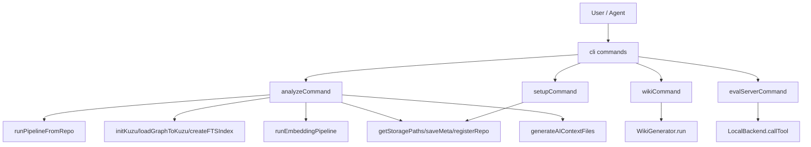

# cli 模块深度解析

`cli` 模块是 GitNexus 的“前台调度台”：它不负责底层解析算法本身，但负责把多个核心引擎按正确顺序编排起来，让用户通过 `gitnexus analyze / setup / wiki / eval-server` 这几个命令，完成从“代码仓库”到“可被人和 AI 使用的知识系统”的全过程。没有这个模块，核心能力都在，但开发者需要自己拼装流程；有了它，整个系统才真正可操作。

---

## 1. 这个模块解决了什么问题（先讲问题空间）

新加入团队时，最容易低估的问题不是“怎么解析代码”，而是“怎么把解析、存储、索引、AI集成、编辑器配置这些步骤稳定地串起来”。`cli` 模块存在的核心原因是：

1. **把一次性复杂操作产品化为可重复命令**  
   例如 `analyze` 需要处理 Git 仓库定位、增量判定、管道执行、Kuzu 重建、全文索引、可选 embedding、元数据写入、AI 上下文生成、Hook 注册、异常中断清理等一整套动作。

2. **把“图能力”转化成“工作流能力”**  
   底层模块（如 [core_ingestion_parsing](core_ingestion_parsing.md)、[core_kuzu_storage](core_kuzu_storage.md)）提供能力原件；CLI 把它们组合成真实开发流程（索引、文档、评估、编辑器接入）。

3. **统一人类用户与自动化代理的入口协议**  
   - 人类：命令行 + 进度条 + 摘要输出
   - 代理：`eval-server` 返回 LLM 友好的文本（不是冗长 JSON）
   - 编辑器：`setup` + `AGENTS.md/CLAUDE.md` + skills/hooks

**没有选择的替代方案**（从代码可推断）：
- 没走“纯库 API，用户自行写脚本”路线：可定制性高，但团队协作成本和踩坑概率太高。
- 没把所有逻辑塞进单一命令：而是按生命周期拆成 `analyze/setup/wiki/eval-server`，降低心智负担。

---

## 2. 心智模型：把 CLI 当作“机场塔台”

可以把 `cli` 想成机场塔台：

- 跑道和飞机（解析、存储、检索、wiki）都不在塔台内部制造。
- 塔台负责**何时起飞、何时降落、冲突如何避免、异常如何中止**。
- 同一套机场能力，会被不同航班复用：客运航班（开发者手动命令）和货运航班（SWE-bench 自动化工具调用）。

### 核心抽象

- `AnalyzeOptions`：控制索引行为（`force`、`embeddings`）。
- `WikiCommandOptions`：控制 wiki LLM 生成与并发、gist 发布。
- `EvalServerOptions`：控制评估服务端口与空闲超时。
- `SetupResult`：记录跨编辑器配置结果（configured/skipped/errors）。
- `RepoStats`：把索引统计映射成 AI 上下文文本内容。

这些 interface 都很薄，说明设计意图是：**复杂性放在流程编排，不放在命令参数对象层**。

---

## 3. 架构总览（含数据/控制流）

### 叙述式 walkthrough

#### A) `analyzeCommand`（主编排器）

主链路（按代码真实调用顺序）：
1. `ensureHeap()`：必要时用 `execFileSync(process.execPath, [--max-old-space-size=8192, ...])` 重新拉起当前命令。  
2. 仓库判定：`getGitRoot` / `isGitRepo`。  
3. 路径与增量判断：`getStoragePaths`、`getCurrentCommit`、`loadMeta`，若 `lastCommit` 未变且无 `--force`，直接退出。  
4. 执行解析管道：`runPipelineFromRepo(repoPath, onProgress)`。  
5. 重建 Kuzu：`closeKuzu` → 删除旧 DB 文件 → `initKuzu` → `loadGraphToKuzu`。  
6. 创建全文索引：`createFTSIndex(...)`（失败非致命）。  
7. 可选 embedding：`getKuzuStats` 后判断阈值（`EMBEDDING_NODE_LIMIT = 50_000`），再 `runEmbeddingPipeline(...)`。  
8. 落盘与注册：`saveMeta`、`registerRepo`、`addToGitignore`。  
9. AI 资产：`registerClaudeHook`、`generateAIContextFiles`。  
10. 收尾：`closeKuzu`，输出摘要；若加载过 embeddings，最后 `process.exit(0)` 规避 ONNX 清理 segfault。

#### B) `wikiCommand`（文档生成编排）

1. 校验仓库与索引存在（`loadMeta`）。
2. 解析 LLM 配置：`loadCLIConfig` / `saveCLIConfig` / `resolveLLMConfig`。
3. 若无已保存配置且是 TTY，进入交互式 provider 选择与密钥输入。
4. 构建 `WikiGenerator` 并执行 `generator.run()`。
5. 可选 `gh gist create` 发布 viewer 页面。

#### C) `evalServerCommand`（评估网关）

1. 创建 `LocalBackend` 并 `init()`，确保已有索引仓库。
2. 启动 HTTP server（`POST /tool/:name`, `GET /health`, `POST /shutdown`）。
3. `/tool/:name` 路径：`backend.callTool(toolName,args)` → `formatToolResult` → `getNextStepHint` → text/plain 响应。

关键点：这里刻意把结构化结果压缩成模型可直接消费的文本，提高 token 利用率与链式调用效率。

#### D) `setupCommand`（环境引导器）

1. 识别本地编辑器目录（Cursor / Claude Code / OpenCode）。
2. 写入或合并 MCP 配置（`mergeMcpConfig`, `writeJsonFile`）。
3. 安装 skills（`installSkillsTo`）。
4. 对 Claude Code 合并 hooks 到 `~/.claude/settings.json`（仅追加，不覆盖已有 hooks）。

---

## 4. 关键设计决策与权衡

### 决策 1：`analyze` 采用“全流程重建 + 局部复用 embedding”
- 选择：Kuzu 文件先删除再全量导入图；embedding 可从旧索引缓存后回灌。
- 好处：图结构一致性高，避免部分增量更新带来的脏状态。
- 代价：大仓库重建成本高。
- 为什么合理：把“正确性与可预测性”放在第一优先级，而 embedding 是最贵步骤，因此单独做缓存复用。

### 决策 2：FTS 创建失败不阻塞主流程
- 选择：`createFTSIndex` 包在 `try/catch` 中，注释为 best-effort。
- 好处：索引主流程鲁棒，避免因搜索增强失败导致全盘失败。
- 代价：检索体验可能降级。

### 决策 3：`eval-server` 返回文本而不是原始 JSON
- 选择：`formatQueryResult / formatContextResult / ...` 统一做文本化。
- 好处：对 LLM 更省 token、更高可读性，并能附带 next-step hint。
- 代价：丢失部分机器可解析结构；若后续要做严格程序消费，需要再加 JSON 模式。

### 决策 4：Wiki 配置优先“显式用户选择”
- 选择：即使环境变量可用，在首次无保存配置时仍引导交互选择 provider。
- 好处：减少“默认命中错误供应商”导致的隐性失败。
- 代价：首次使用多一步交互。

### 决策 5：ONNX 清理问题下的务实策略
- 选择：embedding 跑过后直接 `process.exit(0)`，绕开已知 segfault。
- 好处：避免随机崩溃影响用户完成流程。
- 代价：这是工程性 workaround，不是根治。

---

## 5. 新贡献者最该注意的隐式契约与坑

1. **Git 仓库是硬前提**  
   `analyze` / `wiki` 都依赖 `getGitRoot`、`isGitRepo`。不要假设普通目录可直接运行。

2. **提交哈希驱动“是否需要重跑”**  
   `loadMeta(...).lastCommit === getCurrentCommit(...)` 时会短路退出（除非 `--force`）。如果你改了管道逻辑但 commit 未变，测试时记得加 `--force`。

3. **控制台输出被重写**（`analyze`）  
   为避免进度条污染，命令会临时接管 `console.log/warn/error`。新增日志逻辑要考虑恢复时机和 SIGINT 清理路径。

4. **SIGINT 双击语义**  
   第一次 Ctrl+C：清理并优雅退出；第二次：强制退出。不要在中断流程中引入阻塞操作。

5. **embedding 自动跳过条件**  
   必须 `--embeddings` 且 `stats.nodes <= 50_000` 才真正执行 `runEmbeddingPipeline`。

6. **`eval-server` 的输出 contract 是“面向模型文本”**  
   修改 formatter 时要保证信息密度和下一步引导，不要退化为冗长 dump。

7. **setup 的配置写入是“合并，不清空”**  
   `mergeMcpConfig` 与 hooks 注入都尽量保留用户已有配置。新增字段时要遵守这一原则，避免破坏用户环境。

---

## 6. 子模块导航

- [analyze_command.md](analyze_command.md)：`analyzeCommand` 的完整阶段化流程、进度控制、资源清理和异常策略
- [ai_context_generation.md](ai_context_generation.md)：`generateAIContextFiles`、skills 安装、标记区块 upsert 机制
- [eval_server.md](eval_server.md)：HTTP 路由、工具调用格式化、next-step hint 设计
- [setup_command.md](setup_command.md)：多编辑器 MCP 配置、skills/hooks 全局安装策略
- [wiki_generation.md](wiki_generation.md)：LLM 配置解析、交互式初始化、`WikiGenerator` 编排与 gist 发布

---

## 7. 跨模块依赖（按调用关系）

- 索引主链路强依赖：
  - [core_ingestion_parsing](core_ingestion_parsing.md)（通过 `runPipelineFromRepo` 进入解析管道）
  - [core_ingestion_resolution](core_ingestion_resolution.md)
  - [core_ingestion_community_and_process](core_ingestion_community_and_process.md)
- 存储与查询：
  - [core_kuzu_storage](core_kuzu_storage.md)（`initKuzu`、`loadGraphToKuzu`、`executeQuery`、`createFTSIndex`）
- 向量与检索增强：
  - [core_embeddings_and_search](core_embeddings_and_search.md)（`runEmbeddingPipeline`）
- 文档生成：
  - [core_wiki_generator](core_wiki_generator.md)（`WikiGenerator`）
- MCP/工具后端：
  - [mcp_server](mcp_server.md)（`LocalBackend` 被 `eval-server` 使用）
- 元数据与全局注册：
  - [storage_repo_manager](storage_repo_manager.md)（`getStoragePaths`、`loadMeta`、`saveCLIConfig` 等）

一句话总结：**cli 模块是 GitNexus 的编排边界层（orchestration boundary）——它将分散的核心能力组织成稳定、可复用、对人和 AI 都友好的交互入口。**
