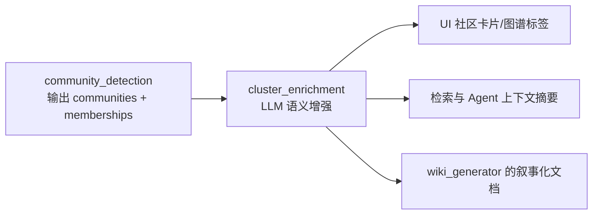
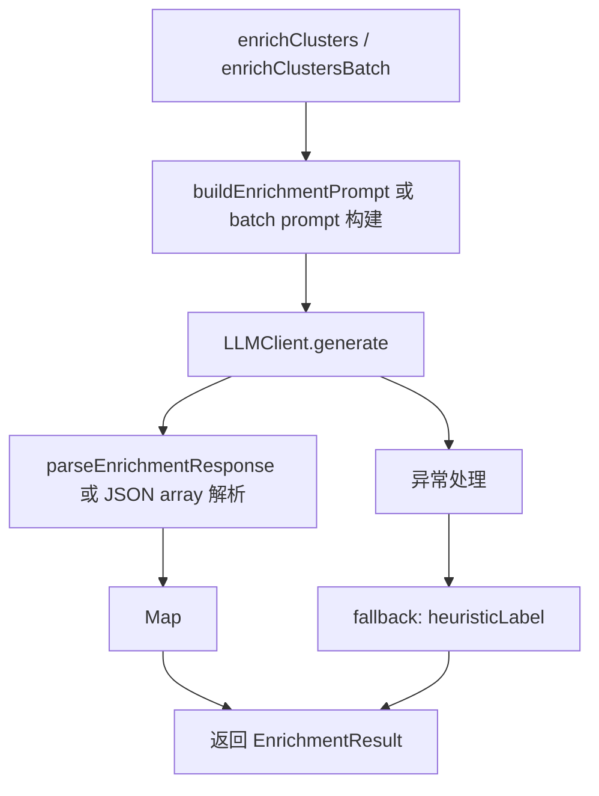
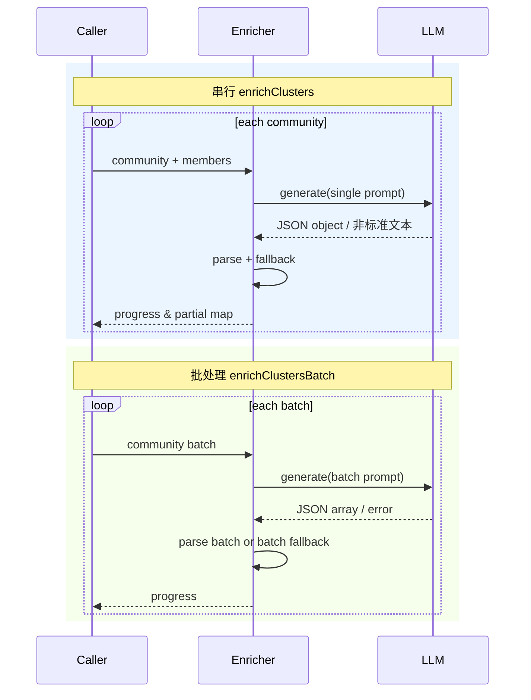
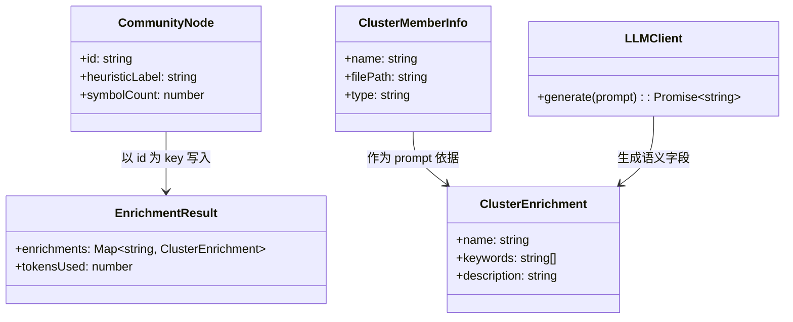
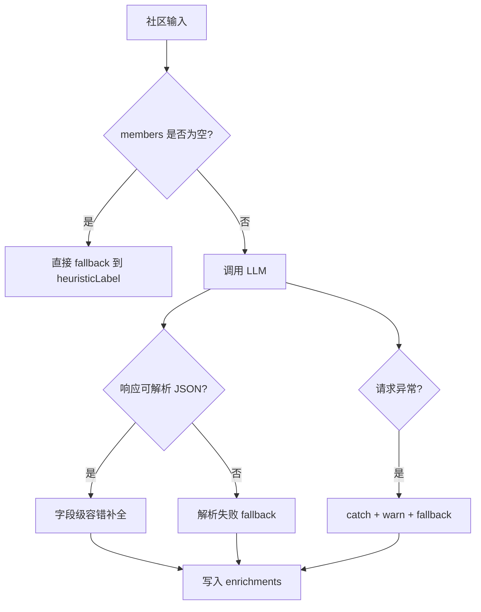

# cluster_enrichment 模块文档

## 模块简介与设计动机

`cluster_enrichment` 模块位于社区发现（`community_detection`）之后，负责把“结构上聚在一起”的代码簇转换成“人类可读的语义描述”。上游模块可以告诉我们哪些函数、类、方法、接口属于同一个 cluster，但它给出的标签通常是启发式目录名或前缀名，仍然偏技术中间态。这个模块的目标，是借助 LLM 对 cluster 成员进行语义归纳，生成更适合展示、检索、导航和 AI 上下文构建的名称、关键词与一句话描述。

从系统设计角度看，它是一个典型的“语义后处理层”：不改变图结构，不重新解析源码，也不修正调用关系；它只消费上游的 cluster 成员信息并补充语义元数据。这样设计有两个好处。第一，模块边界清晰，可单独迭代提示词和模型策略，不会影响 ingestion 主链路稳定性。第二，当 LLM 不可用或返回异常时，模块可以安全回退到 `heuristicLabel`，保证流水线输出始终完整。

在实际产品里，这类 enrichment 直接影响用户体验。没有 enrichment 时，用户看到的是“Cluster_12”“Services”之类弱语义标签；加入 enrichment 后，常见结果会变成“订单支付编排”“Repository Query Layer”等更可解释的名称，同时支持关键词过滤与摘要卡片展示。

---

## 在整体系统中的位置



`cluster_enrichment` 依赖 `CommunityNode` 作为输入锚点，因此建议先阅读 [community_detection.md](community_detection.md) 理解社区 ID、`heuristicLabel` 与社区成员语义。它不直接依赖 `KnowledgeGraph`、`SymbolTable` 或 AST 数据结构，说明其职责是“解释已有分组”，而非“决定分组本身”。

---

## 核心数据模型

### `ClusterEnrichment`

`ClusterEnrichment` 是单个社区的语义增强结果，包含 `name`、`keywords`、`description` 三个字段。`name` 期望是 2~4 词的短语，用于 UI 主标题；`keywords` 是可选标签数组，便于后续筛选、聚合或向量化；`description` 是一句话摘要，通常用于 tooltip、详情面板或文档生成。

### `EnrichmentResult`

`EnrichmentResult` 聚合整个批次结果。`enrichments` 是 `Map<string, ClusterEnrichment>`，键为 `community.id`；`tokensUsed` 是粗粒度 token 消耗估算值，用 `prompt.length / 4 + response.length / 4` 累加得到。该值适合趋势监控，不适合精确计费。

### `LLMClient`

`LLMClient` 是最小抽象接口，仅要求实现 `generate(prompt: string): Promise<string>`。这意味着模块并不绑定特定模型供应商；只要适配该接口，就能接入 OpenAI、Anthropic、本地模型或网关服务。

### `ClusterMemberInfo`

`ClusterMemberInfo` 描述一个社区成员的最小信息：`name`、`filePath`、`type`。当前 prompt 只显式使用 `name` 与 `type`（`filePath` 作为可扩展信息保留），这使得提示词在控制长度时更稳定，同时仍有余地在未来引入路径上下文。

---

## 内部架构与函数协作



模块核心思想是“尽量获取 LLM 语义，失败时保底可用”。无论是单社区模式还是批处理模式，都会在每个社区维度确保最终有可用条目；如果解析失败、请求失败或输出缺失，结果会回退到 `heuristicLabel` + 空关键词 + 空描述。

---

## 关键实现详解

### `buildEnrichmentPrompt(members, heuristicLabel)`

这个内部函数负责构造单社区提示词。它会先将成员截断到前 20 个，以控制上下文长度并降低 token 波动。成员列表格式为 `name (type)`，例如 `createOrder (Function), OrderService (Class)`。如果实际成员超过 20，会追加 `(+N more)` 提示，让模型知道输入是抽样而非全集。

提示词明确要求“Reply with JSON only”，并约束输出结构包含 `name` 与 `description`。需要注意的是，模板文本中提到会提供语义 name 与 short description，但 `keywords` 并没有在示例 JSON 中强制要求；因此后续解析逻辑对 `keywords` 采用可选策略，这是一个有意容错设计。

### `parseEnrichmentResponse(response, fallbackLabel)`

该函数实现“宽松解析 + 安全回退”。它先用正则 `/\{[\s\S]*\}/` 抽取首个 JSON 对象，兼容模型把 JSON 包在 markdown code block 内的常见行为。然后执行 `JSON.parse`，并按字段回填：

- `name` 缺失时回退 `fallbackLabel`
- `keywords` 非数组时回退 `[]`
- `description` 缺失时回退空字符串

若任意环节抛错，函数整体回退到保底对象。这确保上层流程无需因为格式波动而中断。

### `enrichClusters(communities, memberMap, llmClient, onProgress?)`

这是串行模式入口，也是最稳妥的执行路径。函数按社区逐个处理，流程如下：先读取该社区成员并上报进度；若成员为空，直接写入 fallback 结果；否则构建 prompt、调用 LLM、累加 token 估算、解析响应并写入 `Map`。

串行模式的优点是隔离性好。某个社区调用失败，不会影响其他社区；错误会被 `try/catch` 捕获并记录 `console.warn`，随后仅对当前社区回退。它适合模型延迟不稳定、响应格式易漂移、或你希望更精细观察单社区失败原因的场景。

### `enrichClustersBatch(communities, memberMap, llmClient, batchSize=5, onProgress?)`

这是批处理模式，目标是减少请求次数与 prompt 开销。实现上按 `batchSize` 分片，每批构造一个大 prompt，并要求模型返回 JSON 数组。与串行不同，批模式对每个社区只保留前 15 个成员（不是 20），进一步压缩上下文。

批模式的主要权衡是“效率 vs 稳定性”。如果单次返回数组解析失败，当前批次会整体回退到启发式标签；虽然吞吐更高，但失败域更大。函数末尾还会执行一次“缺失补全”，确保即便模型只返回部分社区 ID，剩余社区也会自动填充 fallback。

---

## 处理流程（串行与批处理对比）



从调用方角度，两个函数返回值形状一致，便于无缝切换策略。一般可以先用串行建立质量基线，再在可接受质量下切换批模式做性能优化。

---

## 与相邻模块的数据关系



该模块的输入来自社区检测阶段，因此若社区本身质量不高，enrichment 也会受限。换句话说，LLM 可以“命名”一个 cluster，但无法修正 cluster 是否划分合理。社区划分质量问题应回到 [community_detection.md](community_detection.md) 处理。

---

## 使用与集成示例

### 1) 基础串行调用

```ts
import { enrichClusters } from '@/core/ingestion/cluster-enricher';

const result = await enrichClusters(
  communities,
  memberMap,
  {
    generate: async (prompt) => myLLM.generateText(prompt),
  },
  (current, total) => {
    console.log(`enrichment progress: ${current}/${total}`);
  }
);

const c1 = result.enrichments.get('comm_1');
console.log(c1?.name, c1?.keywords, c1?.description);
console.log('estimated tokens:', result.tokensUsed);
```

### 2) 批处理调用（低成本优先）

```ts
import { enrichClustersBatch } from '@/core/ingestion/cluster-enricher';

const result = await enrichClustersBatch(
  communities,
  memberMap,
  llmClient,
  8 // batchSize
);
```

如果你面向在线 UI，通常建议把 `batchSize` 从 3~8 做压测，观察模型上下文窗口与响应稳定性，再确定默认值。

### 3) 一个可复用的 LLMClient 适配器

```ts
import type { LLMClient } from '@/core/ingestion/cluster-enricher';

export function createOpenAIAdapter(client: any): LLMClient {
  return {
    async generate(prompt: string) {
      const res = await client.responses.create({
        model: 'gpt-4.1-mini',
        input: prompt,
      });
      return res.output_text ?? '';
    },
  };
}
```

---

## 配置建议与扩展方向

当前代码把大部分策略硬编码在函数内部，这有利于简洁，但在生产环境下通常需要可配置化。实践中可优先扩展以下方向：

- 把成员截断阈值（单社区 20、批处理 15）外置为配置，便于按模型上下文窗口调优。
- 为 prompt 增加语言/领域模板选项，例如“中文名优先”“包含架构层级关键词”。
- 增加严格 JSON 模式（如 function calling / schema constrained decoding）以降低解析失败率。
- 引入并发控制：串行模式可做限流并发（2~4）以平衡吞吐和失败隔离。
- 将 `tokensUsed` 切换为供应商返回的真实 usage 字段，保留当前估算作为 fallback。

如果你准备做这些改造，建议保持 `LLMClient` 接口最小化不变，避免对上层调用方造成破坏性升级。

---

## 边界情况、错误条件与已知限制



这个模块的健壮性主要来自“多层 fallback”，但也带来一些理解上的限制。首先，fallback 结果在外观上可能与真实 enrichment 很接近（都有 `name`），调用方若要区分“LLM 成功产物”和“启发式兜底”，当前接口没有显式标志位，需要自行扩展。其次，`tokensUsed` 是字符长度估算，面对中英文混合、代码片段、emoji 或不同 tokenizer 时偏差会明显。再次，批处理模式若只返回部分 ID，未返回的社区会被静默补全为 fallback；这保证完整性，但可能掩盖模型质量问题，建议在日志层记录“missing ids”统计。

另一个常见误区是把 `keywords` 当作可靠标签体系。当前 prompt 并未强制 keywords 一定返回，解析也允许为空，因此它更适合做“弱标签辅助”而非严格分类依据。

---

## 运行与维护建议

在运维层面，建议记录每次 enrichment 的三个指标：成功解析率、fallback 比例、平均 token 估算。若 fallback 比例突然升高，通常意味着模型响应格式漂移、提示词被污染或供应商返回异常。对于前端场景（`gitnexus-web`），还应关注请求时延与用户交互阻塞；必要时可先渲染 `heuristicLabel`，再异步刷新 enrichment 结果。

从演进路线看，`cluster_enrichment` 最值得优先投入的是“结构化输出可靠性”，其次才是“文案质量”。因为只要结构稳定，产品层就能安全消费；文案即使不完美，也能通过后续 prompt 迭代逐步优化。

---

## 与其他文档的关系

本文聚焦“社区语义增强”。若你需要完整理解其上游与下游，请参考：

- 社区划分来源与统计解释： [community_detection.md](community_detection.md)
- 符号与调用关系质量（影响社区与 enrichment 输入）： [symbol_indexing_and_call_resolution.md](symbol_indexing_and_call_resolution.md)
- 图域对象基础类型： [graph_domain_types.md](graph_domain_types.md)

这些文档与本文共同构成从“结构关系 → 社区聚类 → 语义命名”的完整链路。


---

## API 合同与行为细节补充

为了让维护者在重构时快速判断兼容性，下面把该模块的“可观察行为”再明确一次。`ClusterEnrichment` 接口中的 `name` 是唯一必然有值且最关键的字段；无论 LLM 成功与否，它都会在最终结果中存在，因为失败时会回退到 `CommunityNode.heuristicLabel`。`description` 与 `keywords` 都允许为空，这不是异常，而是设计允许的降级状态。调用方如果把这两个字段当作必填，需要在消费侧做默认文案处理。

`EnrichmentResult.enrichments` 使用 `Map<string, ClusterEnrichment>`，而不是普通对象，这意味着它保留插入顺序，并且在 TypeScript 侧能更清晰地区分“键不存在”和“键对应空值”的语义。另一方面，若要把结果序列化为 JSON（例如写入 `SerializablePipelineResult`），需要先转换为对象或数组。若你在流水线中需要跨进程传输 enrichment 结果，建议在边界层显式做 `Map` ↔ JSON 转换，避免运行时丢失结构。

`LLMClient` 的最小接口只有一个 `generate(prompt)`。这个抽象很薄，优点是接入成本低，缺点是模型温度、max tokens、JSON mode、重试策略等都不在接口中表达。实际落地时建议把这些策略放进 `LLMClient` 的实现体，而不是修改本模块函数签名。这样可以保持 `enrichClusters` / `enrichClustersBatch` 的稳定 API，不会把模型供应商细节泄漏到 ingestion 主流程。

---

## 解析策略的隐性约束（维护重点）

当前解析逻辑依赖正则提取 JSON，再 `JSON.parse`。这套策略在“模型大体听话”的情况下非常实用，但有几个隐性约束需要维护者特别注意。第一，`parseEnrichmentResponse` 使用的对象正则是贪婪匹配（`/\{[\s\S]*\}/`），如果响应里出现多个对象片段，可能提取到超出预期的内容。第二，批处理函数的数组正则（`/\[[\s\S]*\]/`）同样是贪婪匹配，若模型在正文中先给了一个示例数组、后给了正式数组，解析结果可能失败。第三，这两个解析分支都没有校验字段类型的一致性，`name`、`description` 若是非字符串会直接进入结果，可能污染下游展示。

如果你计划增强稳定性，一个兼容当前设计的改法是：继续保留正则兜底，但优先尝试严格 JSON 模式（例如 provider 的 schema constrained output），并在解析后加一层轻量 schema 校验。这样即使模型漂移，模块仍可回退，不会破坏现有“永不抛出到上层”的容错承诺。

---

## Web 与 Core 版本的一致性说明

模块树显示 `gitnexus/src/core/ingestion/cluster-enricher.ts` 与 `gitnexus-web/src/core/ingestion/cluster-enricher` 都暴露了同名核心组件（`LLMClient`、`ClusterMemberInfo`、`ClusterEnrichment`、`EnrichmentResult`）。这通常意味着前后端（或 Node 与 Browser）两侧保持了相同的语义合同：输入仍是 community + 成员信息，输出仍是 enrichment map + token 估算。

在协同维护时，建议把这两个实现看作“同构模块”：算法策略应尽量一致，平台差异仅体现在 `LLMClient` 适配层、网络权限与运行时约束上。比如 Web 侧可能需要处理浏览器超时、CORS 与用户交互中断；Core 侧更关注服务端吞吐、重试与集中日志。若发生行为分叉，优先保证字段回退语义一致（特别是 `name` 回退到 `heuristicLabel` 这一点），否则 UI 与离线产物会出现命名不一致问题。