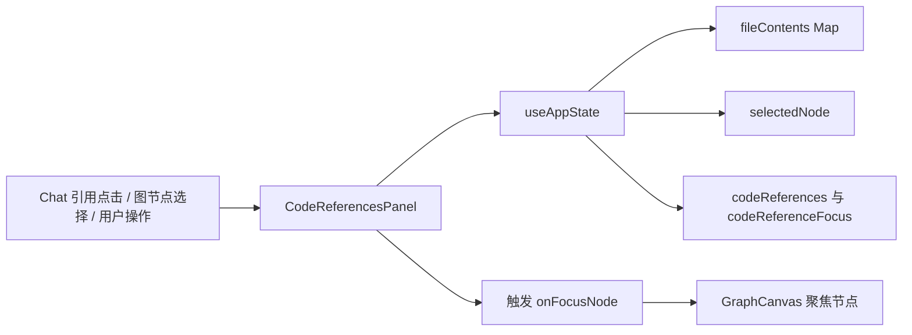
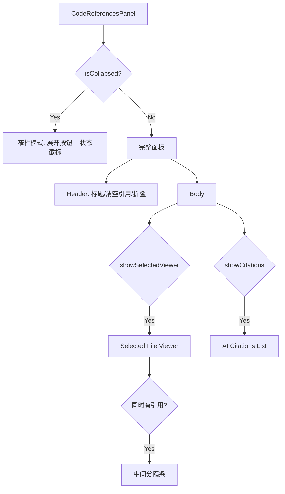
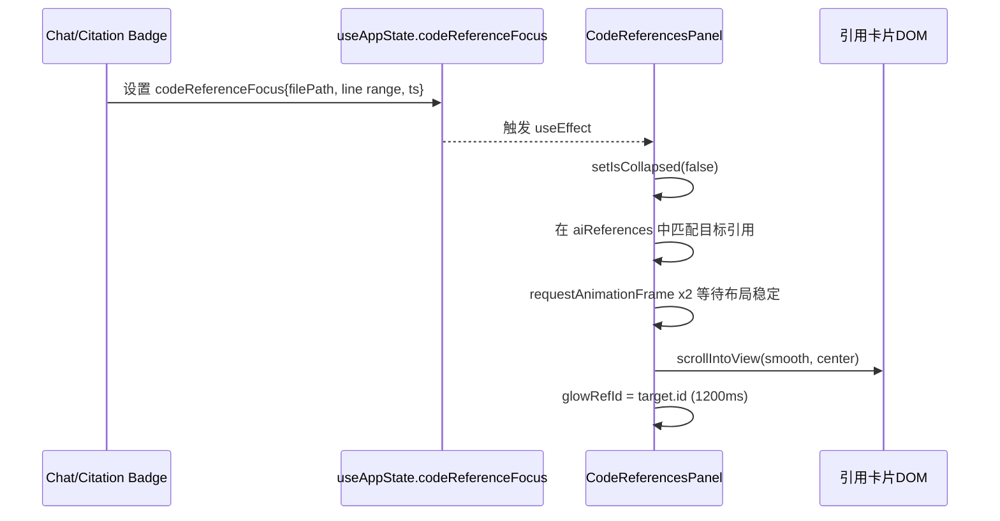
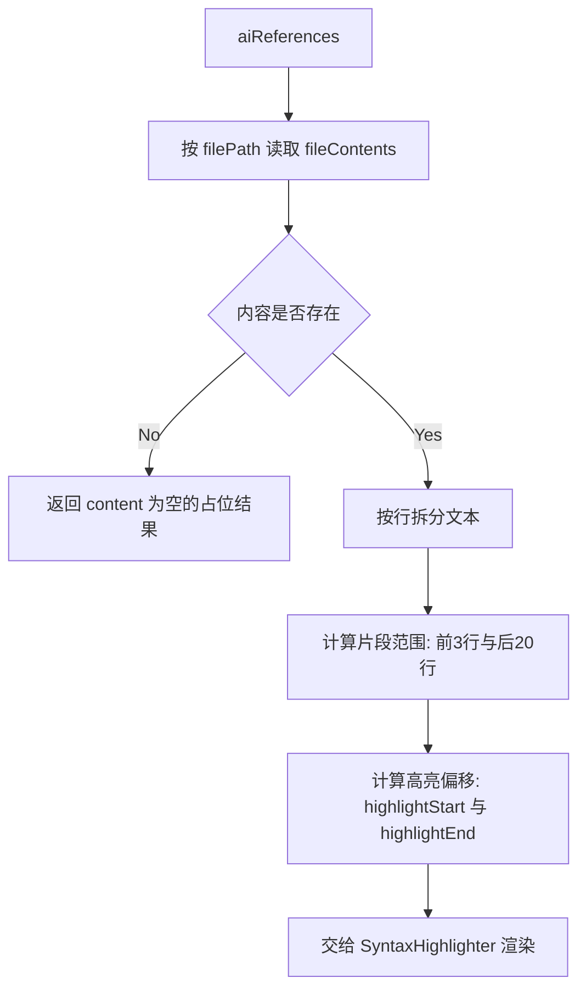

# code_references_ui_panel 模块文档

## 1. 模块定位与设计动机

`code_references_ui_panel`（实现文件：`gitnexus-web/src/components/CodeReferencesPanel.tsx`）是 GitNexus Web 右侧“代码检查器（Code Inspector）”的核心展示层，负责把两类来源不同但互补的信息合并成一个可操作的阅读界面：一类是当前图节点选中后的文件预览，另一类是 AI 对话过程中抽取出的代码引用（AI citations）。

这个模块存在的根本原因，不是“显示代码片段”这么简单，而是为了把“图视图、聊天引用、文件内容缓存、节点聚焦”这几条用户认知链路闭环起来。用户在图上点到一个节点，能立即看到对应文件段落；用户在聊天里点击引用标记，面板会自动展开、滚动、高亮对应卡片；用户又可以从引用卡片反向聚焦到图节点。它承担的是一个跨视图“上下文对齐器”的角色。

从系统结构上看，它是 `web_app_state_and_ui` 中的 UI 组件模块，直接依赖全局状态编排（见 [app_state_orchestration.md](app_state_orchestration.md)），并通过 `onFocusNode` 与图画布交互层建立连接（接口语义可参考 [graph_canvas_interaction_layer.md](graph_canvas_interaction_layer.md) 中 `GraphCanvasHandle.focusNode`）。

---

## 2. 对外契约：`CodeReferencesPanelProps`

该模块对外暴露的核心类型非常小：

```ts
export interface CodeReferencesPanelProps {
  onFocusNode: (nodeId: string) => void;
}
```

虽然只有一个回调参数，但这个接口设计很关键。`CodeReferencesPanel` 不直接持有图渲染器实例，也不直接操作 Sigma/GraphCanvas，而是通过父层注入的 `onFocusNode` 完成“聚焦图节点”动作。这样做有两个好处：第一，面板组件保持 UI 纯度，避免与图引擎耦合；第二，父容器可以在回调里附加更多行为（例如相机动画、统计埋点、侧边状态同步），扩展成本低。

---

## 3. 模块在系统中的位置



这张图说明了该组件的核心工作模式：它不创造业务数据，而是消费 `useAppState` 中已编排好的状态，将其转化为“可读、可跳转、可操作”的代码视图。真正的数据来源（文件内容、AI 引用、选中节点）都来自上游状态中心。

---

## 4. 内部结构与渲染分区

`CodeReferencesPanel` 内部可以理解为三个区块：外层面板壳、上半区“Selected viewer”、下半区“AI citations list”。是否显示这些区块由状态联合决定，而不是固定布局。



这种条件渲染结构让组件在多种场景下都成立：只有节点没有引用时可当文件预览器；只有引用没有选中节点时可当 AI 证据列表；两者同时存在时按 42%/58% 近似比例分屏。

---

## 5. 关键状态与行为机制

### 5.1 本地 UI 状态

组件内部维护了几个局部状态，分别服务于交互体验而非业务持久化。

`isCollapsed` 控制面板是否折叠。折叠时仅渲染宽度 `w-12` 的窄栏，保留最关键的恢复入口与状态提示，避免完全失去上下文。

`panelWidth` 是可拖拽宽度，初始化时从 `localStorage['gitnexus.codePanelWidth']` 读取并夹紧到 `[420, 900]`。更新时写回本地存储，实现“跨刷新保持用户偏好”。代码对浏览器存储失败（隐私模式、配额限制）使用 `try/catch` 静默降级。

`glowRefId` 用于短时高亮某条引用卡片，配合 `setTimeout(1200ms)` 自动清除。该状态主要服务“聊天引用跳转后的可发现性”。

### 5.2 DOM 引用与清理

组件使用多个 `ref` 管理临时交互资源。`resizeRef` 保存拖拽起始坐标与宽度；`refCardEls` 保存引用卡片 DOM 映射（`ref.id -> element`），用于程序化滚动；`glowTimerRef` 保存高亮计时器 ID。

组件卸载时会清理 glow 定时器，防止内存泄漏或卸载后状态更新警告。拖拽流程中也会在 `mouseup` 阶段移除全局监听器并恢复 `document.body` 的 `cursor` 与 `userSelect`，这是该模块在交互细节上比较稳健的实现点。

---

## 6. 与 `useAppState` 的数据契约

组件主要消费以下状态/方法（定义详见 [app_state_orchestration.md](app_state_orchestration.md)）：

- `graph`：用于 `nodeId -> node` 映射，支持“从引用卡片同步选中节点”。
- `fileContents: Map<string, string>`：代码文本来源。
- `selectedNode` / `setSelectedNode`：上半区选中文件预览。
- `codeReferences` / `removeCodeReference` / `clearCodeReferences`：下半区引用管理。
- `codeReferenceFocus`：聊天引用点击后的“跳转信号”。

其中有一个重要过滤逻辑：面板仅展示 `source === 'ai'` 的引用（`aiReferences`），即便状态层存在用户引用条目，此组件当前也不会渲染。这是一个明确的产品取舍：该面板被定位为 AI 证据检查器。

---

## 7. 关键流程详解

### 7.1 聊天引用触发聚焦流程



这里使用“双 `requestAnimationFrame`”是非常实用的工程技巧。因为该动作可能发生在“刚从折叠态展开”的瞬间，若过早读取 DOM，卡片元素尚未挂载或位置尚未稳定，滚动会失效。双帧等待确保了折叠状态更新和列表渲染都完成。

### 7.2 引用片段构建流程



该流程体现了“阅读性优先”策略：不是只截取命中行，而是保留前后文。默认前文 3 行、后文 20 行，便于理解函数体或调用点上下文。

### 7.3 从引用卡片反向聚焦图节点

当引用包含 `nodeId` 时，点击 `Target` 按钮会先尝试在 `graph.nodes` 里找到该节点并执行 `setSelectedNode(node)`，然后调用外部 `onFocusNode(nodeId)`。这形成“双通道同步”：状态层选中与画布相机聚焦同时发生，用户感知是“列表点击 -> 图上定位”。

---

## 8. 渲染行为细节与实现要点

该组件使用 `react-syntax-highlighter` 的 `Prism` 渲染器，并基于 `vscDarkPlus` 做局部主题覆盖。覆盖重点包括背景色、字体族、行高、行号样式，目的是与应用其他代码视图保持一致。

语言识别采用简单后缀映射：`.py -> python`、`.js/.jsx -> javascript`、`.ts/.tsx -> typescript`，其余回退 `text`。这使得组件在未知语言下仍可稳定显示，不会因为高亮器语言缺失导致崩溃。

行高亮逻辑统一使用“业务行号是 0-based，展示行号是 1-based”的转换。无论是 selected viewer 还是 citation snippet，都通过 `lineProps` 判断当前行是否在高亮区间，并添加左侧 cyan 边框与浅色背景。这种样式一致性降低了用户在两个区域之间的认知切换成本。

---

## 9. 可配置项与默认策略

虽然该组件没有显式 `props` 配置面板行为，但实现中包含若干隐式策略参数，扩展时通常会先调整这些常量：

- 宽度范围：最小 `420`，最大 `900`，默认 `560`。
- 片段上下文：`contextBefore = 3`，`contextAfter = 20`。
- 聚焦光晕时长：`1200ms`。
- 选中文件区分屏高度：当存在引用时约 `42%`。

如果你要做产品化配置（例如用户设置页可调上下文行数），建议把这些参数抽到常量文件或 `useAppState` 配置域，而不是直接在组件内散落魔法数字。

---

## 10. 使用方式与集成示例

典型集成方式如下，父组件把图画布的聚焦能力桥接给面板：

```tsx
import { useRef } from 'react';
import { CodeReferencesPanel } from './components/CodeReferencesPanel';
import type { GraphCanvasHandle } from './components/GraphCanvas';

function Workspace() {
  const graphRef = useRef<GraphCanvasHandle | null>(null);

  return (
    <CodeReferencesPanel
      onFocusNode={(nodeId) => {
        graphRef.current?.focusNode(nodeId);
      }}
    />
  );
}
```

如果你在父层已经维护“选中节点即自动聚焦”的逻辑，也可以在 `onFocusNode` 中只做相机动画，避免重复设置状态。

---

## 11. 边界条件、错误条件与限制

该模块对异常场景总体采用“可显示优先”的降级策略，而不是抛错中断。

当 `fileContents` 中找不到目标文件时，面板会显示 `Code not available in memory...` 占位文案。这通常意味着文件未被加载、仓库切换后缓存未命中，或引用来自当前图之外的路径。

当 `codeReferenceFocus` 指向的精确行段不存在时，组件会退化为按 `filePath` 匹配第一条 AI 引用。此策略提高了命中率，但也可能把用户滚动到同文件错误位置，这是当前实现的已知折中。

拖拽宽度依赖桌面鼠标事件（`mousedown/mousemove/mouseup`），在触屏设备上不会自动获得同等体验。如果后续要支持移动端，需要补充 pointer/touch 事件处理。

该组件把语言识别硬编码在后缀判断中，暂不支持 `.go`、`.java`、`.rs` 等语言高亮映射；即便内容显示正常，语法颜色会退回纯文本风格。

---

## 12. 扩展建议

如果你希望扩展该模块，优先考虑以下方向。第一，抽象语言推断函数，例如 `getLanguageFromPath(path)`，并集中维护扩展名映射。第二，把 snippet 上下文行数做成可配置项，便于不同团队根据代码规模调整阅读密度。第三，在“引用卡片 -> 图聚焦”流程中引入失败提示（当 `nodeId` 已失效时），提升可诊断性。第四，若要支持 user 引用与 AI 引用混排，建议在状态层增加分组策略，而不是直接删除 `source==='ai'` 过滤。

从职责边界角度看，该组件应继续保持“渲染 + 轻交互”定位。复杂的引用解析、去重、跨仓库清理逻辑应留在 `useAppState`，避免 UI 组件再次变成业务编排中心。

---

## 13. 与其他模块的参考关系

- 全局状态字段与方法来源：[`app_state_orchestration.md`](app_state_orchestration.md)
- 图聚焦接口语义：[`graph_canvas_interaction_layer.md`](graph_canvas_interaction_layer.md)
- 图节点基础类型（`selectedNode` 的结构背景）：[`graph_domain_types.md`](graph_domain_types.md)

这些文档已覆盖本模块依赖的数据结构与上游流程，本文不重复展开其底层实现。
