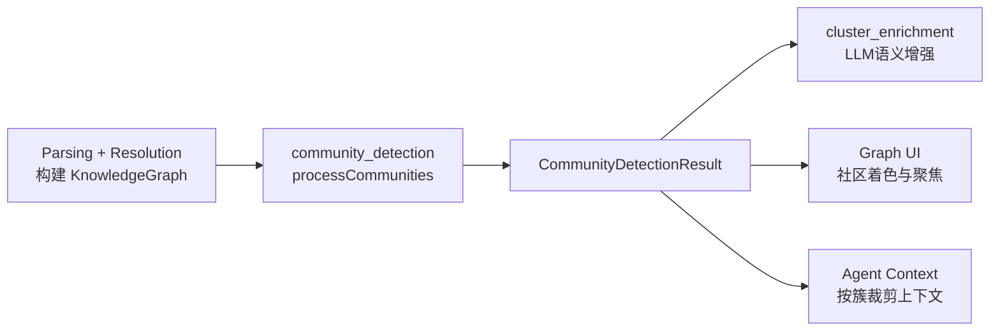
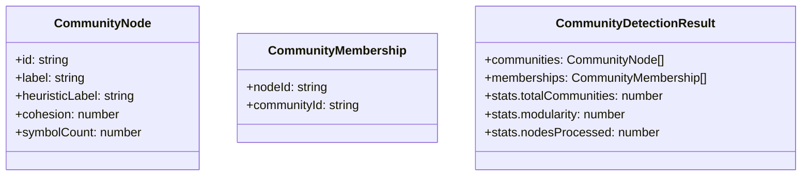
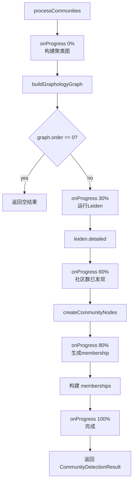
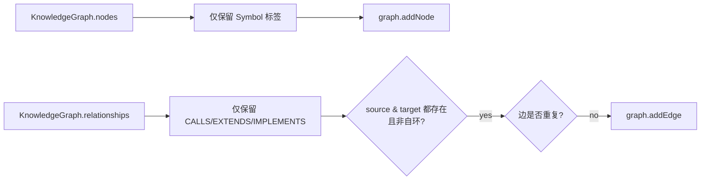
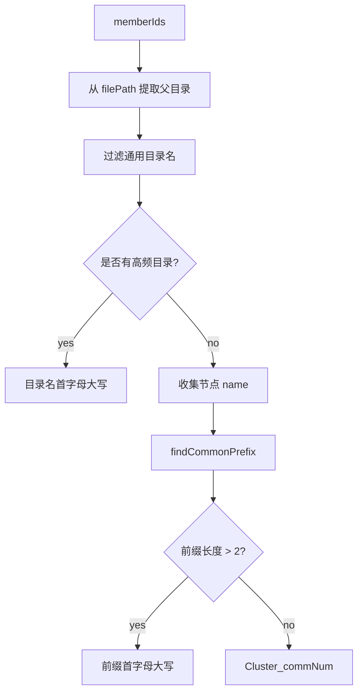
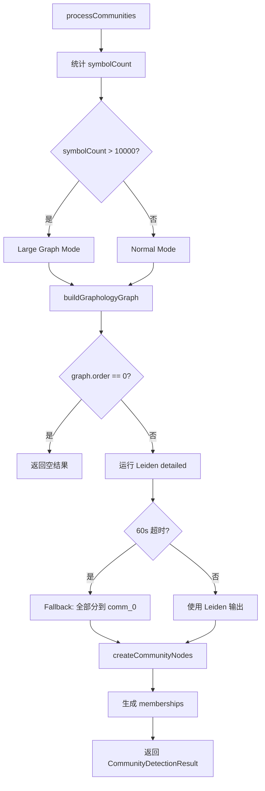
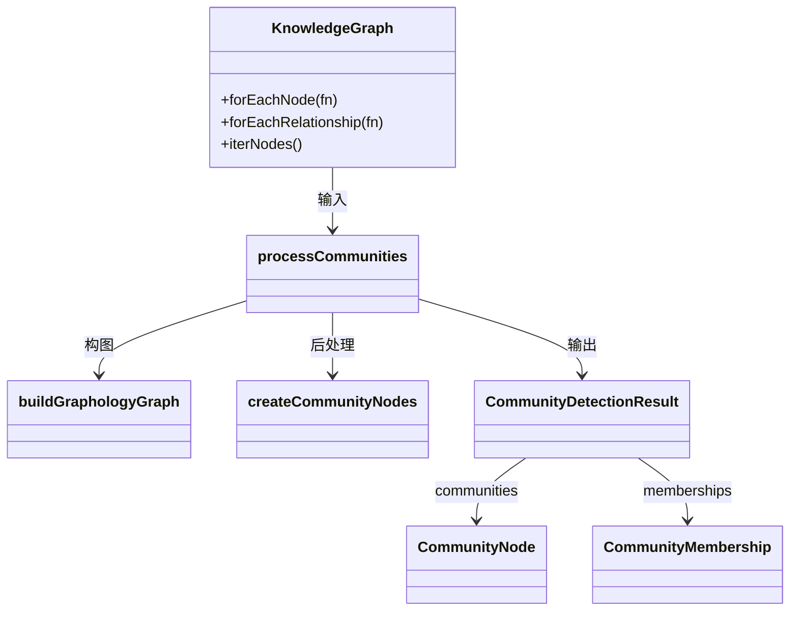
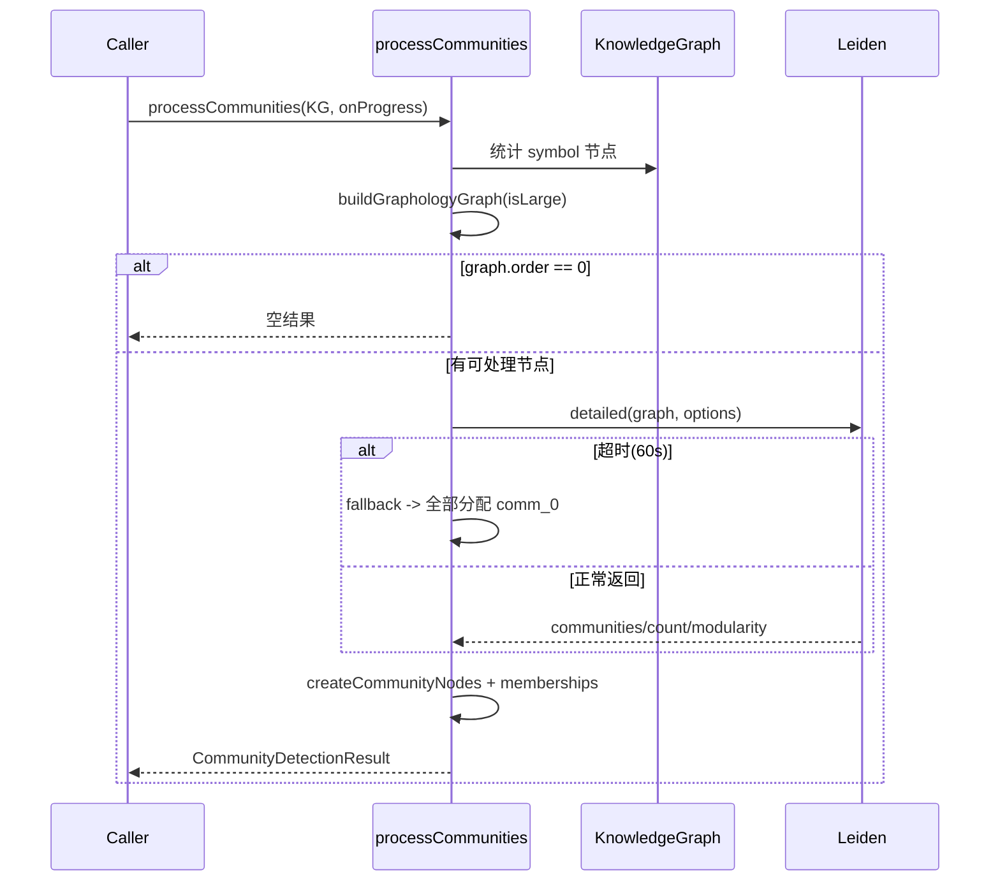

# community_detection 模块文档

## 一、模块定位与设计目标

`community_detection` 模块负责在 `KnowledgeGraph` 已经完成节点与关系构建后，做一次**结构层面的社区发现（community detection）**。它不关心源码目录是否相邻，也不尝试做“执行流程推理”；它只回答一个问题：**哪些符号（Function/Class/Method/Interface）在调用与继承实现关系上形成了高密度协作团簇**。

这个能力存在的价值是把“大量分散的符号节点”压缩成“可解释的功能簇”，便于后续模块与 UI 直接消费。典型用途包括：图谱可视化按簇上色、按社区导航代码、为后续 `cluster_enrichment` 进行语义命名提供结构基础。该模块属于 `web_ingestion_pipeline` 的后处理环节，依赖上游解析与关系解析结果，但不重复做 AST 或符号消歧工作。上游可参考 [symbol_indexing_and_call_resolution.md](symbol_indexing_and_call_resolution.md)，图模型契约可参考 [graph_domain_types.md](graph_domain_types.md)，整条流水线可参考 [web_ingestion_pipeline.md](web_ingestion_pipeline.md)。

## 二、系统架构位置



从职责边界看，`community_detection` 只输出“社区实体 + 成员归属 + 统计”，不会写库、不会生成自然语言说明、不会替代流程检测。流程推断由 [process_detection_and_entry_scoring.md](process_detection_and_entry_scoring.md) 负责，语义增强由 [cluster_enrichment.md](cluster_enrichment.md) 负责。

## 三、核心数据模型



`CommunityNode` 是社区级节点表示，`cohesion` 反映内部连接密度，`symbolCount` 反映规模。`CommunityMembership` 是节点到社区的映射表。`CommunityDetectionResult` 是模块唯一输出对象，既包含可展示的社区，也包含算法统计值。

需要特别注意一个行为差异：实现中会过滤 `memberIds.length < 2` 的社区（singleton 不进入 `communities`），但 `memberships` 仍来自 Leiden 的全量分配，`stats.totalCommunities` 也是算法原始计数。因此调用方不应假设三者严格一一对应。

## 四、主流程：`processCommunities`

`processCommunities(knowledgeGraph, onProgress?)` 是模块入口，返回 `Promise<CommunityDetectionResult>`。虽然签名是 async，但主体逻辑是同步计算 + 第三方算法调用；异步主要用于统一流水线接口。



流程细节如下。

首先函数调用 `buildGraphologyGraph`，把 `KnowledgeGraph` 投影成 Leiden 可处理的 `graphology` 无向图。若投影后 `graph.order === 0`，直接返回空结果，避免无意义算法执行。

当图非空时，函数调用 vendored Leiden：

```ts
const details = leiden.detailed(graph, {
  resolution: 1.0,
  randomWalk: true,
});
```

然后用 `createCommunityNodes` 将算法分区结果转换为社区实体，再把 `details.communities` 逐项转换为 `CommunityMembership[]`。最终填充 `stats`：

- `totalCommunities`: `details.count`
- `modularity`: `details.modularity`
- `nodesProcessed`: `graph.order`

### 参数与回调

- `knowledgeGraph: KnowledgeGraph`：输入知识图谱。
- `onProgress?: (message: string, progress: number) => void`：可选进度回调，在 0/30/60/80/100 五个阶段触发。

### 返回值

返回结构总是合法对象；即使没有节点，也会返回结构化空数组和零值统计。

### 副作用

该函数不修改输入 `knowledgeGraph`。副作用仅体现在：

- 触发外部 `onProgress` 回调。
- 在内存中创建 `graphology` 图对象与中间映射结构。

## 五、构图细节：`buildGraphologyGraph`

该函数决定“哪些信号会进入社区检测”，是结果质量的核心之一。



实现策略是使用 `new Graph({ type: 'undirected', allowSelfLoops: false })`，并只纳入四类节点标签：`Function`、`Class`、`Method`、`Interface`。关系层面只使用 `CALLS`、`EXTENDS`、`IMPLEMENTS`，以表达“协作”和“类型结构”两类连接。

几个关键约束：

- 方向被抹平：`CALLS A->B` 在聚类中按无向连接处理。
- 自环被跳过：递归调用不会形成边。
- 重复边去重：同一节点对只保留一条边，防止密度被重复关系放大。

## 六、社区实体构建：`createCommunityNodes`

`createCommunityNodes(communities, communityCount, graph, knowledgeGraph)` 将 Leiden 的 `Record<nodeId, communityNumber>` 转换成社区对象。

其内部先按社区号分组成员，再构建 `nodeId -> filePath` 映射用于命名，最后生成 `CommunityNode[]`。其中 `memberIds.length < 2` 的社区会被过滤，这一步会显著减少“孤立点噪声”。

`cohesion` 由 `calculateCohesion` 计算，`label` 与 `heuristicLabel` 当前相同，均来自 `generateHeuristicLabel`。生成完后按 `symbolCount` 降序排序，便于 UI 优先展示高价值大簇。

值得维护者注意的是：`communityCount` 参数目前未参与函数逻辑，属于保留参数。

## 七、标签生成策略：`generateHeuristicLabel` 与 `findCommonPrefix`

社区标签不是模型推理结果，而是纯启发式策略，目标是低成本可读。



第一优先级是目录统计。实现会过滤 `src/lib/core/utils/common/shared/helpers` 等通用目录，避免生成无辨识度标签。若目录信息不足，则回退到名称公共前缀；`findCommonPrefix` 使用“排序后比较首尾字符串”的经典实现，复杂度低且稳定。若仍失败，使用 `Cluster_${commNum}` 保证总有名称。

## 八、凝聚度计算：`calculateCohesion`

`calculateCohesion(memberIds, graph)` 计算社区内部边密度，返回范围理论上在 0~1。

其做法是遍历每个成员的邻居，统计邻居也在社区内的边数。因为无向图遍历时每条内部边会被从两端各计一次，最终会除以 2。再除以最大可能边数 `n*(n-1)/2` 得到密度值。

这一定义比较直观：

- 接近 1：社区接近完全图，内部连接非常紧密。
- 接近 0：虽然被算法分到同一社区，但内部连接稀疏。

特殊处理是 `memberIds.length <= 1` 时直接返回 `1.0`，用于避免除零并保持字段稳定。

## 九、颜色与可视化支持

模块提供固定调色板 `COMMUNITY_COLORS` 与工具函数 `getCommunityColor(index)`。策略是对颜色数组取模，因此当社区数量大于预设色数时会循环复用。

```ts
import { getCommunityColor } from '@/core/ingestion/community-processor';

const c0 = getCommunityColor(0);   // '#ef4444'
const c12 = getCommunityColor(12); // 再次回到第一种颜色（循环）
```

这套策略轻量且稳定，适合图谱基础着色。若需要更高区分度，建议在 UI 层基于 `communityId` 追加动态色相扰动。

## 十、调用示例与消费模式

最常见的调用方式如下：

```ts
import { processCommunities } from '@/core/ingestion/community-processor';

const result = await processCommunities(knowledgeGraph, (msg, pct) => {
  console.log(`[community] ${pct}% ${msg}`);
});

console.log(result.stats.modularity);
console.log(result.communities.slice(0, 5));
```

若你的界面只展示“非 singleton 社区”，建议按 `communities` 做白名单过滤，而不是直接渲染全部 `memberships`：

```ts
const visible = new Set(result.communities.map(c => c.id));
const visibleMemberships = result.memberships.filter(m => visible.has(m.communityId));
```

## 十一、配置、调优与可扩展性

当前实现没有暴露 `options` 参数，Leiden 关键参数（`resolution: 1.0`, `randomWalk: true`）写死在函数内。若需要仓库级调优，建议以非破坏方式新增可选参数对象，例如 `ProcessCommunitiesOptions`，并保持当前默认值兼容旧调用方。

建议优先参数化的点包括 Leiden 参数、参与聚类的关系类型、singleton 过滤阈值、标签停用词列表等。对于大型图谱，还可以考虑引入边权重（例如结合 `confidence`）或先做弱连接裁剪，以降低噪声和计算开销。

## 十二、边界情况、错误条件与已知限制

该模块的稳健性较高，但有一些容易踩坑的行为。

第一，若输入图没有任何可聚类节点，返回的是结构化空结果而不是异常，这对流水线友好，但调用方要正确处理空数组分支。第二，`processCommunities` 未包裹 `try/catch`；如果 Leiden 或图操作抛错，异常会向上传播，调用方应在管线层统一兜底。第三，模块将图无向化处理，因此无法用于推断调用方向或执行先后。第四，社区标签是启发式的，不保证业务语义准确，应视为“机器可读默认名”，并可交给 `cluster_enrichment` 二次增强。第五，`stats.totalCommunities` 与 `communities.length` 可能不一致，且 `memberships` 可能包含被过滤 singleton 的 `communityId`。

## 十三、与相邻模块的协作建议

在工程实践中，社区检测质量高度依赖上游关系质量。`CALLS` 解析噪声、`EXTENDS/IMPLEMENTS` 覆盖率、节点命名质量都会直接影响聚类结果。建议先保证 [symbol_indexing_and_call_resolution.md](symbol_indexing_and_call_resolution.md) 的准确性，再调社区参数。

如果你的目标是生成“人类可读的架构块说明”，推荐链路是：先用本模块得到结构簇，再接 [cluster_enrichment.md](cluster_enrichment.md) 生成解释文本。若目标是识别业务流程入口与步骤，应结合 [process_detection_and_entry_scoring.md](process_detection_and_entry_scoring.md)，而不是将社区边界误当流程边界。

---

> 维护者提示：本模块代码短小但处于后处理关键路径。任何改动都建议在“空图、稀疏图、超大图、跨目录高耦合图”四类样本上做回归，重点观察 `modularity`、社区数分布、singleton 占比与标签可读性。


## 处理流程总览



该流程体现了三个现实工程目标：

1. **可扩展性**：大图进入降噪模式，降低计算量。
2. **鲁棒性**：Leiden 超时有 fallback，不会让整条流水线失败。
3. **可解释性**：输出含社区标签、cohesion 和统计信息，便于 UI 与分析端消费。

---

## 关键实现细节（按函数）

### `processCommunities(knowledgeGraph, onProgress?)`

这是模块入口函数，签名为：

```ts
processCommunities(
  knowledgeGraph: KnowledgeGraph,
  onProgress?: (message: string, progress: number) => void
): Promise<CommunityDetectionResult>
```

它首先遍历 `knowledgeGraph`，统计 `Function | Class | Method | Interface` 的数量，用于判断是否进入大图模式（阈值 `> 10_000`）。随后调用 `buildGraphologyGraph` 构建用于聚类的无向图。

如果图没有节点（`graph.order === 0`），直接返回空结果，避免无意义计算。否则调用 vendored Leiden 的 `detailed` 接口：

- 常规模式：`resolution = 1.0`, `maxIterations = 0`
- 大图模式：`resolution = 2.0`, `maxIterations = 3`

并通过 `Promise.race` 增加 60 秒超时保护。若超时，则 fallback 到“所有节点归属社区 0，modularity = 0”。

随后会创建社区节点、成员映射，并返回统计信息。`onProgress` 在关键阶段触发（0/30/60/80/100），适用于 UI 阶段提示，但不应作为精确耗时度量。

### `buildGraphologyGraph(knowledgeGraph, isLarge)`

该辅助函数负责把 `KnowledgeGraph` 投影成 Leiden 需要的 `graphology` 图。设计要点：

- 图类型是 `undirected`，禁用自环（`allowSelfLoops: false`）。
- 仅纳入符号节点标签：`Function`、`Class`、`Method`、`Interface`。
- 仅纳入聚类关系类型：`CALLS`、`EXTENDS`、`IMPLEMENTS`。

在大图模式下，它会做两层降噪：

1. 过滤低置信度关系：`rel.confidence < 0.5` 的边被忽略。
2. 过滤低度节点：度数 `< 2` 的节点不加入图（通常是噪声或弱连接节点）。

此外函数会去重边，避免重复边放大连通强度。

### `createCommunityNodes(communities, communityCount, graph, knowledgeGraph)`

这个函数把 Leiden 的“节点 -> 社区编号”映射转为 `CommunityNode[]`。流程是先按社区编号分组成员，再建立 `nodeId -> filePath` 的查找映射用于命名。

关键业务规则是：**跳过 singleton 社区**（成员数 `< 2`）。这会减少“纯噪声社区”对 UI 和下游摘要的干扰。最终输出按 `symbolCount` 降序排序，方便优先展示高价值大社区。

`communityCount` 参数目前未参与逻辑计算，属于接口层保留位。

### `generateHeuristicLabel(memberIds, nodePathMap, graph, commNum)`

这是社区自动命名器，采用三级回退策略：

1. **目录统计优先**：从成员 `filePath` 提取父目录名，排除通用目录（如 `src/lib/core/utils/common/shared/helpers`），取最高频目录作为标签。
2. **名称前缀回退**：若目录统计失败，读取节点 `name` 属性，寻找公共前缀。
3. **最终兜底**：使用 `Cluster_${commNum}` 保证始终有稳定可读名。

这个策略强调“低成本可读性”而非语义完美性，适合作为默认标签，再由 `cluster_enrichment` 进行 LLM 级增强。

### `findCommonPrefix(strings)`

该函数通过排序后比较首尾字符串获取最长公共前缀。实现简洁稳定，时间成本可接受，适合在社区成员命名回退中使用。

### `calculateCohesion(memberIds, graph)`

`cohesion` 的实现并不是“完全图密度公式”，而是基于邻接遍历的**内部边占比估计**：

- 对每个采样节点遍历邻居，统计 `totalEdges`。
- 若邻居也在社区成员集合内，则计入 `internalEdges`。
- 返回 `internalEdges / totalEdges`（裁剪到 `<= 1.0`）。

为了避免大社区 O(N²) 成本，函数对成员数大于 50 的社区只取前 50 个成员作为样本。若没有可统计边，返回 1.0 作为平滑默认值。

---

## 依赖与组件关系



外部依赖方面，模块使用 `graphology` 构图，并通过 `createRequire` 在 ESM 环境加载 vendored CommonJS Leiden 实现（`vendor/leiden/index.cjs`）。这是一种兼容性设计：因为上游 Leiden 源未直接发布 npm 包。

---

## 数据流与异常路径



从调用者视角，最重要的是理解该模块是“尽量返回可用结果”的：只有 Leiden 抛出非超时异常才会继续向上抛错；超时场景会被内部降级处理。

---

## 可视化支持：颜色常量

模块提供 `COMMUNITY_COLORS` 和 `getCommunityColor(communityIndex)`。颜色策略是固定调色板 + 取模循环，稳定、轻量、可预测。

```ts
import { getCommunityColor } from '@/core/ingestion/community-processor';

const color0 = getCommunityColor(0);  // '#ef4444'
const color13 = getCommunityColor(13); // 与索引 1 同色（循环）
```

如果你的前端需要更高区分度，可在 UI 层二次映射（例如基于 HSL 动态生成）。

---

## 使用示例

### 基础调用

```ts
import { processCommunities } from '@/core/ingestion/community-processor';

const result = await processCommunities(knowledgeGraph, (message, progress) => {
  console.log(`[community] ${progress}% ${message}`);
});

console.log(result.stats);
console.log(result.communities.slice(0, 10));
```

### 结果消费建议（避免统计误读）

```ts
const { communities, memberships, stats } = await processCommunities(knowledgeGraph);

console.log('算法原始社区数:', stats.totalCommunities);
console.log('过滤后可展示社区数:', communities.length);

// 只渲染非 singleton 社区
const visible = new Set(communities.map(c => c.id));
const visibleMemberships = memberships.filter(m => visible.has(m.communityId));
```

---

## 配置与扩展建议

当前实现参数多为内置常量。如果你要扩展该模块，建议优先参数化以下维度：

- 大图阈值（默认 `10_000`）
- 大图置信度过滤阈值（默认 `0.5`）
- Leiden `resolution` / `maxIterations`
- 超时时间（默认 `60_000ms`）
- singleton 过滤阈值（默认 `< 2`）
- 启发式目录停用词列表

扩展方式上，推荐新增可选 `ProcessCommunitiesOptions` 并保持默认值不变，以避免破坏现有调用方。

---

## 边界情况、错误条件与限制

1. 当图中没有可聚类符号节点时，直接返回空结果。
2. 大图模式会主动丢弃低置信度边与度数过低节点，结果更快但可能损失长尾关系。
3. Leiden 超时会触发 fallback（单社区），这能保证可用性，但语义质量显著下降。
4. `stats.totalCommunities` 与 `communities.length` 可能不一致（因 singleton 过滤）。
5. 社区标签是启发式，不保证业务语义准确。
6. 由于转为无向图，调用方向信息不会进入聚类过程。

在运维和调试中，建议同时记录：输入节点数、边数、是否 large mode、Leiden 用时、是否触发 timeout fallback、modularity 值。这样可以快速判断是“输入质量问题”还是“聚类参数问题”。

---

## 与相邻模块的协作关系

- 与 [core_ingestion_resolution.md](core_ingestion_resolution.md)：`CALLS` / `EXTENDS` / `IMPLEMENTS` 的质量直接决定聚类质量，尤其是 `confidence` 的分布。
- 与 [cluster_enrichment.md](cluster_enrichment.md)：本模块提供结构聚类，后者负责语义增强（更可读名称、说明文本）。
- 与 [process_detection_and_entry_scoring.md](process_detection_and_entry_scoring.md)：社区结果可用于缩小流程检测范围，但不能替代流程建模。
- 与 [web_ingestion_pipeline.md](web_ingestion_pipeline.md)：Web 侧存在同构类型与流程，可共享结果消费策略。

---

## 维护者备注

当前实现在“性能、鲁棒性、可读性”之间做了务实平衡：大图降噪 + 超时兜底保证可运行，启发式标签保证可展示。如果后续要提升准确性，通常优先级是：

1. 让参数可配置（便于不同仓库调优）。
2. 改善标签生成（结合语义信息而不仅目录与前缀）。
3. 明确暴露 `filteredOutSingletons` 等统计，减少调用方误读。

这三项改动都可以在不破坏当前返回结构的前提下渐进落地。