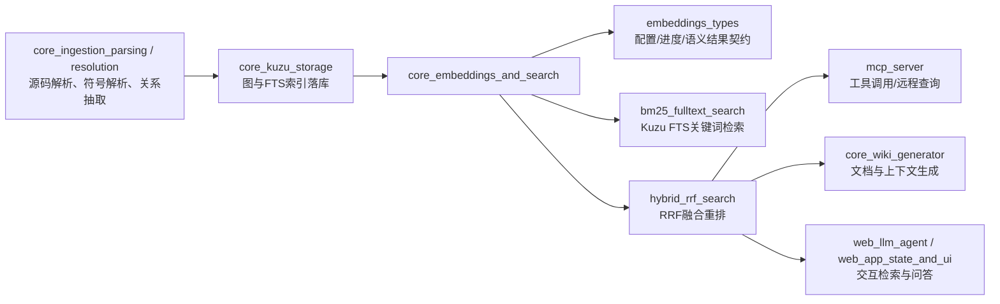
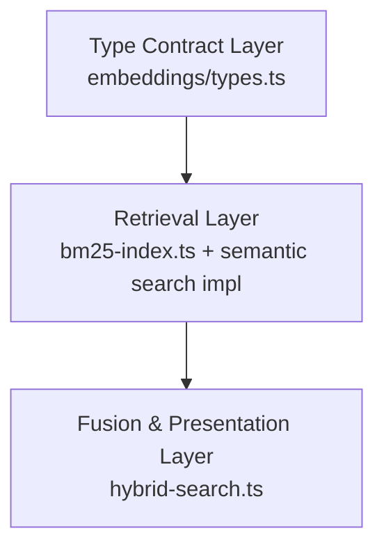
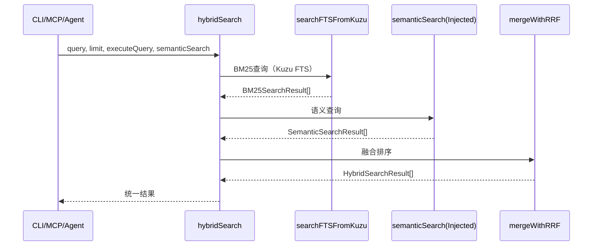
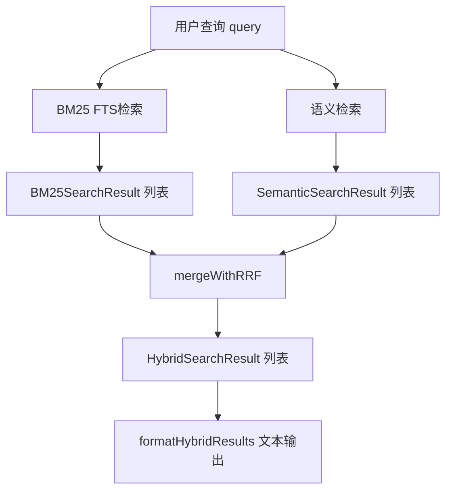
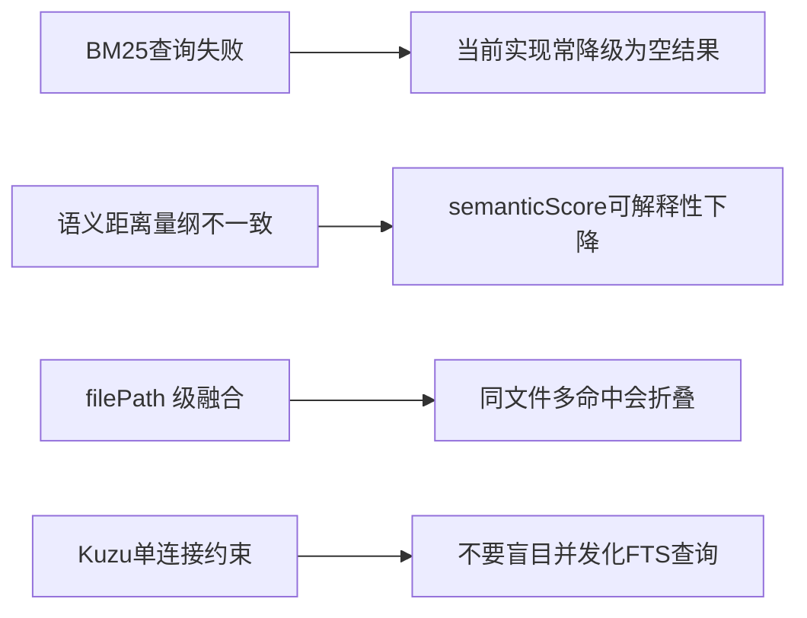

# core_embeddings_and_search 模块文档

## 1. 模块简介：它解决了什么问题、为什么存在

`core_embeddings_and_search` 是 GitNexus 中“代码检索能力”的核心层，负责把代码图谱中的结构化信息转化为两类可查询能力：一类是基于关键词/术语匹配的全文检索（BM25 via Kuzu FTS），另一类是基于向量语义相似度的语义检索（Embeddings）。模块最终通过 Hybrid Search（RRF 融合）提供统一结果，服务于 CLI、MCP 工具调用、LLM 上下文构建、Wiki 生成等上层场景。

它存在的必要性来自代码检索的双重需求：开发者有时输入精确符号（如 `AuthService`、`tsconfig paths`），有时输入意图描述（如“处理登录流程的入口”）。单一检索方式通常会在其中一端表现不佳，因此该模块采用“双轨召回 + 排名融合”的设计，兼顾可解释性、稳定性和召回覆盖。

从系统演进角度看，该模块还承担“检索契约层”的职责：通过类型定义 (`EmbeddingConfig`、`SemanticSearchResult`、`HybridSearchResult` 等) 固定输入输出边界，让 embedding 实现、数据库查询实现、上层 UI/Agent 消费者可以独立演进，减少跨模块耦合带来的回归风险。

---

## 2. 在整体系统中的位置

`core_embeddings_and_search` 依赖上游 ingestion 与存储模块提供数据基础，并把结果供给下游智能应用模块。



这个位置关系说明：本模块并不负责“生产图数据”，而是负责“消费已落库图数据并提供检索服务”。与 [core_ingestion_resolution.md](core_ingestion_resolution.md) / [core_kuzu_storage.md](core_kuzu_storage.md) 的关系是典型的“上游数据准备 -> 下游查询服务”。

---

## 3. 架构总览与设计 rationale

### 3.1 三层结构



该模块的核心设计是把“类型契约、检索执行、融合呈现”拆成三层：

- **Type Contract Layer**：定义可以被嵌入的节点类型、进度状态、配置结构、语义返回结构；
- **Retrieval Layer**：分别执行 BM25 与语义检索；
- **Fusion Layer**：通过 RRF 融合排序并输出统一结果及格式化文本。

这样拆分的好处是：底层检索引擎可替换，上层消费接口基本稳定。

### 3.2 组件交互（运行时）



注意这里 `semanticSearch` 采用注入函数而非硬依赖导入，体现环境无关（environment-agnostic）设计：同一融合层可以复用在本地、服务端、Web 或测试桩场景。

---

## 4. 子模块功能概览（高层，不重复细节）

### 4.1 embeddings

`embeddings` 提供 embedding 管线的“公共类型系统”，覆盖配置（`EmbeddingConfig`）、状态（`EmbeddingProgress` / `ModelProgress`）、输入节点（`EmbeddableNode`）、输出结果（`SemanticSearchResult`）等关键契约。它不执行模型推理，但定义了所有执行层必须遵守的数据边界，是该模块可维护性的基础。

详细说明见：[embeddings_types.md](embeddings_types.md)

### 4.2 search（BM25 + Hybrid）

`search` 子模块包含两条检索路径与融合逻辑：基于 KuzuDB FTS 的 BM25 关键词检索，以及基于 RRF 的混合融合重排。该实现支持多表 FTS 汇总、filePath 级结果聚合、语义元数据携带与面向 LLM 的结果格式化。

详细说明见：
- [bm25_fulltext_search.md](bm25_fulltext_search.md)
- [hybrid_rrf_search.md](hybrid_rrf_search.md)

---

## 5. 关键数据流



这个流程体现两个重要实践：

1. **双路独立召回**：避免某一路缺陷导致整体不可用；
2. **排名级融合**：不强依赖原始分数可比性，工程上更稳健。

---

## 6. 配置与使用指导

### 6.1 Embedding 基础配置

建议从 `DEFAULT_EMBEDDING_CONFIG` 起步，再按部署环境微调。

```ts
import { DEFAULT_EMBEDDING_CONFIG } from './core/embeddings/types.js';

const config = {
  ...DEFAULT_EMBEDDING_CONFIG,
  batchSize: 24,
  device: 'auto',
};
```

实践建议：
- 浏览器/低资源环境：减小 `batchSize`、缩短 `maxSnippetLength`；
- GPU 环境：可提高 `batchSize` 以提升吞吐；
- 模型切换时务必确认 `dimensions` 与模型输出一致。

### 6.2 一站式 Hybrid 查询

```ts
import { hybridSearch, formatHybridResults } from './core/search/hybrid-search.js';

const results = await hybridSearch(query, 10, executeQuery, semanticSearch);
console.log(formatHybridResults(results));
```

如果你已有两路结果，也可直接调用 `mergeWithRRF(...)` 做融合。

---

## 7. 扩展指南

如果你要扩展该模块，建议按以下优先顺序：

1. **扩展可嵌入标签**：先改 `EMBEDDABLE_LABELS`，再回归检查所有 label 分支；
2. **扩展 BM25 检索表**：新增 schema 时同步更新 FTS 查询表/索引映射；
3. **增强融合可观测性**：在 `HybridSearchResult` 增加调试字段（每路 rank、贡献分）；
4. **能力降级策略**：语义失败时可选降级到 BM25-only，而不是整体失败；
5. **参数化 RRF_K**：按场景调整融合衰减曲线。

扩展时请保持向后兼容，尤其是 `BM25SearchResult` 与 `HybridSearchResult` 的主字段，避免破坏上层调用。

---

## 8. 边界条件、错误与限制（维护者重点）



维护时要特别注意：

- BM25 路径里存在“吞错返回空数组”的容错策略，可用性高但可观测性弱；
- `semanticScore = 1 - distance` 是展示层近似映射，不应作为跨引擎严格比较依据；
- 融合主键是 `filePath`，节点级解释能力有限；
- Kuzu 连接模型下顺序查询是安全约束，不应随意改成并发。

---

## 9. 与其他模块文档的关联阅读

为避免重复，以下主题请直接参考对应文档：

- 图节点与关系模型： [core_graph_types.md](core_graph_types.md)
- 解析与抽取链路： [core_ingestion_parsing.md](core_ingestion_parsing.md)
- 符号/导入/调用解析： [core_ingestion_resolution.md](core_ingestion_resolution.md)
- 图存储与 CSV/Kuzu： [core_kuzu_storage.md](core_kuzu_storage.md)
- Pipeline 进度与结果结构： [core_pipeline_types.md](core_pipeline_types.md)
- 本模块子文档：
  - [embeddings_types.md](embeddings_types.md)
  - [bm25_fulltext_search.md](bm25_fulltext_search.md)
  - [hybrid_rrf_search.md](hybrid_rrf_search.md)

---

## 10. 维护者快速结论

`core_embeddings_and_search` 的价值不在于某一个复杂算法，而在于把“关键词检索、语义检索、融合排序”组织成了一个边界清晰、可替换、可扩展的检索子系统。对于新开发者，建议先理解三份子文档，再回到本文件看系统级协作关系；对于维护者，优先守住四条底线：类型契约稳定、FTS 查询安全、融合逻辑可解释、失败路径可观测。
