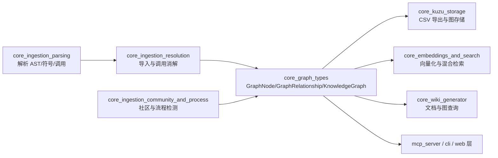
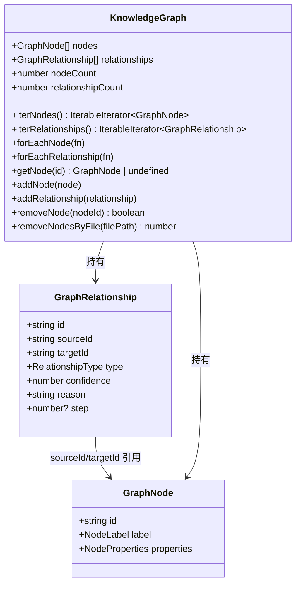
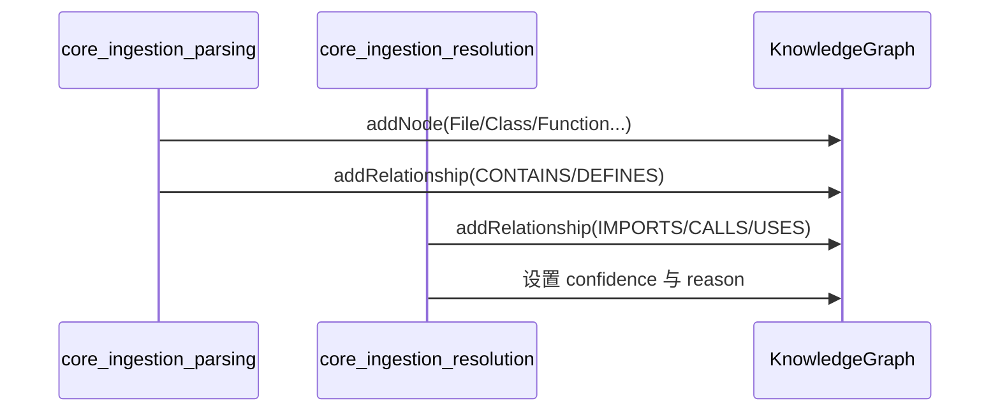
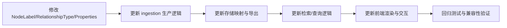

# core_graph_types 模块文档

## 概述

`core_graph_types` 是 GitNexus 图数据模型的**核心类型定义层**。这个模块本身不负责解析代码、做符号消解、运行社区检测或执行查询；它的职责更基础：定义“知识图谱里一个节点是什么、关系是什么、图对象需要提供哪些操作能力”。

从系统设计角度看，这个模块存在的意义是把“图的语义契约”从具体实现中抽离出来。上游的代码摄取/解析流程（例如 `core_ingestion_parsing`、`core_ingestion_resolution`）可以稳定地产生 `GraphNode` 与 `GraphRelationship`，下游的存储、搜索、Wiki 生成、可视化层可以稳定地消费 `KnowledgeGraph`，从而避免各模块直接耦合在某一种图实现细节上。

换句话说，`core_graph_types` 是一个“领域模型接口层（domain contract layer）”：

- 它定义了代码智能场景中常见实体（文件、类、函数、社区、流程等）的统一节点标签；
- 它定义了跨语言、跨阶段都可复用的关系类型（调用、继承、导入、流程步骤等）；
- 它定义了图容器需要暴露的访问和变更接口，以及一些性能语义（零拷贝迭代、O(1) lookup）。

---

## 模块在系统中的位置



上图体现了这个模块的“中心契约”角色：上游模块负责生产知识，`core_graph_types` 负责定义承载知识的统一结构，下游模块负责持久化、检索、展示和交互。由于这是一组类型定义，模块本身非常轻量，但它对全系统的一致性影响极大。

相关模块可进一步阅读：
- [core_ingestion_parsing.md](core_ingestion_parsing.md)
- [core_ingestion_resolution.md](core_ingestion_resolution.md)
- [core_ingestion_community_and_process.md](core_ingestion_community_and_process.md)
- [core_kuzu_storage.md](core_kuzu_storage.md)
- [core_embeddings_and_search.md](core_embeddings_and_search.md)
- [core_wiki_generator.md](core_wiki_generator.md)

---

## 核心类型总览



`GraphNode` 和 `GraphRelationship` 是原子实体，`KnowledgeGraph` 是容器接口。注意这里是 **interface/type contract**，并不是具体类实现。实现可以是内存图、增量图、索引图，甚至是数据库代理对象，只要满足接口约束即可。

---

## GraphNode

`GraphNode` 表示图中的一个实体节点，结构如下：

```ts
export interface GraphNode {
  id: string
  label: NodeLabel
  properties: NodeProperties
}
```

### 字段语义

`id` 是节点主键，必须在同一个 `KnowledgeGraph` 实例中唯一。它通常由上游解析/消解流程按命名规则生成（例如包含文件路径与符号签名）。

`label` 使用 `NodeLabel` 联合类型，覆盖了通用代码实体（`File`、`Class`、`Function`、`Method` 等）以及跨语言扩展实体（`Struct`、`Trait`、`Annotation`、`Template` 等），同时包含图分析增强实体（`Community`、`Process`）。这个设计使图谱能够同时表达“源码结构”和“分析产物”。

`properties` 承载具体属性，基础字段包括 `name` 和 `filePath`，其余字段按场景可选。社区分析、流程分析、入口点评分等增强信息也被放在同一属性对象中，以避免为每种节点再引入一套完全独立模型。

### NodeLabel 设计说明

`NodeLabel` 的联合类型显式列举可接受值，等价于强约束枚举。其优点是：

- 编译期可检查拼写和兼容性；
- 上下游模块更容易保持一致的数据词汇表；
- 扩展新语言结构时可以集中演进。

但它也带来约束：新增标签需要改类型定义并重新编译依赖模块。

### NodeProperties 关键字段

基础语义字段：
- `name`：节点显示名/逻辑名。
- `filePath`：节点来源文件路径，是删除/增量更新常用索引维度。
- `startLine`、`endLine`：源码定位信息（可缺失）。
- `language`：多语言代码库中非常关键。
- `isExported`：导出可见性信息（常用于 API surface 分析）。

社区增强字段：
- `heuristicLabel`、`cohesion`、`symbolCount`、`keywords`、`description`、`enrichedBy`。

流程增强字段：
- `processType`、`stepCount`、`communities`、`entryPointId`、`terminalId`、`entryPointScore`、`entryPointReason`。

这些字段本质上是“分阶段填充”的：解析阶段只会有基础信息，社区/流程阶段会补充高阶语义。

---

## GraphRelationship

`GraphRelationship` 表示节点间有向边：

```ts
export interface GraphRelationship {
  id: string
  sourceId: string
  targetId: string
  type: RelationshipType
  confidence: number
  reason: string
  step?: number
}
```

### 字段语义与行为约定

`sourceId` 与 `targetId` 分别指向起点和终点节点，形成有向关系。

`type` 使用 `RelationshipType` 联合类型，覆盖结构关系（`CONTAINS`、`DEFINES`、`MEMBER_OF`）、语义关系（`CALLS`、`USES`、`IMPORTS`、`INHERITS`、`IMPLEMENTS`）以及流程关系（`STEP_IN_PROCESS`）。

`confidence` 是 0~1 的置信度，注释中强调 `1.0` 代表确定，较低值代表存在不确定解析（典型是跨文件调用解析模糊匹配）。这使下游检索/可视化可以做阈值过滤或弱边降权。

`reason` 主要用于解释边来源。注释给出常见值：`import-resolved`、`same-file`、`fuzzy-global`，并说明非 `CALLS` 边可以为空。这是一个可审计字段，便于调试解析质量。

`step` 仅在 `STEP_IN_PROCESS` 关系中有意义，且 1-indexed。对流程图重建非常关键。

### RelationshipType 设计说明

`RelationshipType` 采用白名单式建模，目标是确保关系语义稳定。它与 `NodeLabel` 共同构成图谱 schema 的“词汇层”。新增关系类型时，应同步评估：

1. 上游生成器是否能稳定产出；
2. 下游存储和查询是否需要新索引或新查询模板；
3. 可视化层是否需要新增边样式映射。

---

## KnowledgeGraph

`KnowledgeGraph` 是图容器接口，定义读写、遍历、计数和删除能力。

```ts
export interface KnowledgeGraph {
  nodes: GraphNode[]
  relationships: GraphRelationship[]
  iterNodes: () => IterableIterator<GraphNode>
  iterRelationships: () => IterableIterator<GraphRelationship>
  forEachNode: (fn: (node: GraphNode) => void) => void
  forEachRelationship: (fn: (rel: GraphRelationship) => void) => void
  getNode: (id: string) => GraphNode | undefined
  nodeCount: number
  relationshipCount: number
  addNode: (node: GraphNode) => void
  addRelationship: (relationship: GraphRelationship) => void
  removeNode: (nodeId: string) => boolean
  removeNodesByFile: (filePath: string) => number
}
```

### 读取接口与性能语义

接口注释明确了三组访问方式的成本模型：

- `nodes` / `relationships`：返回完整数组副本，便于快照消费，但有内存与复制开销。
- `iterNodes` / `iterRelationships`：零拷贝迭代，适合大图流式处理。
- `forEachNode` / `forEachRelationship`：同为零拷贝，并强调避免 iterator protocol 在热点循环中的额外开销。

这说明该接口在设计时已经考虑了不同规模场景下的性能分层。

### 查询与计数

`getNode(id)` 要求 O(1) 查找语义，暗示实现层通常会维护 `Map<string, GraphNode>` 之类索引结构。

`nodeCount` 与 `relationshipCount` 提供快速统计，避免每次通过数组长度或迭代计算。

### 变更操作

`addNode` 与 `addRelationship` 承担增量构图职责。

`removeNode(nodeId)` 返回 `boolean`，说明调用者可以基于返回值判断目标是否存在。

`removeNodesByFile(filePath)` 返回删除数量，适合增量重建：当某个文件变化时，先批量删掉旧节点再补入新节点。

关于“删除节点是否级联删除相关关系”，接口未在类型层硬性规定，需要依赖具体实现文档或测试约定；调用方应避免假设行为。

---

## 典型数据流与交互过程

### 1) 从解析结果到图模型



该流程中，解析模块先建立结构骨架，消解模块再补语义边，并写入边置信度与来源理由。最终图可被存储、检索和展示层消费。

### 2) 社区与流程增强

```mermaid
flowchart TD
    A[已有代码图] --> B[community-processor]
    B --> C[写入 Community 节点]
    B --> D[写入 MEMBER_OF 关系]
    C --> E[cluster-enricher]
    E --> F[补充 description/keywords/enrichedBy]
    A --> G[process-processor]
    G --> H[写入 Process 节点]
    G --> I[写入 STEP_IN_PROCESS(step)]
```

增强阶段不会替换基础图，而是向同一 schema 增量写入高阶节点/边和属性。这种“同图分层增强”方式对查询非常友好，因为无需跨模型 join。

---

## 使用示例

### 构建节点与关系

```ts
const fileNode: GraphNode = {
  id: "file:src/core/graph/types.ts",
  label: "File",
  properties: {
    name: "types.ts",
    filePath: "src/core/graph/types.ts",
    language: "typescript",
  },
}

const funcNode: GraphNode = {
  id: "function:src/core/graph/types.ts#addRelationship",
  label: "Function",
  properties: {
    name: "addRelationship",
    filePath: "src/core/graph/types.ts",
    startLine: 80,
    endLine: 90,
    isExported: true,
  },
}

const rel: GraphRelationship = {
  id: "rel:1",
  sourceId: fileNode.id,
  targetId: funcNode.id,
  type: "CONTAINS",
  confidence: 1.0,
  reason: "",
}
```

### 使用 KnowledgeGraph 进行增量更新

```ts
function reindexFile(graph: KnowledgeGraph, filePath: string, nextNodes: GraphNode[], nextRels: GraphRelationship[]) {
  // 1) 删除旧数据
  graph.removeNodesByFile(filePath)

  // 2) 写入新节点
  for (const n of nextNodes) graph.addNode(n)

  // 3) 写入新关系
  for (const r of nextRels) graph.addRelationship(r)
}
```

### 遍历建议

```ts
// 大图场景建议零拷贝遍历
graph.forEachRelationship((rel) => {
  if (rel.type === "CALLS" && rel.confidence < 0.6) {
    // 做降权或标记
  }
})
```

---

## 扩展与演进建议

当你需要扩展 `core_graph_types`（例如新增语言节点类型、增加关系类型或属性字段）时，建议采用“schema 先行 + 全链路核对”策略：



这里的关键不是“能编译通过”，而是“语义是否在全链路一致”。尤其是 `reason`、`confidence`、`step` 这类带行为含义的字段，若只在部分模块更新，容易造成数据解释偏差。

---

## 边界条件、错误风险与已知限制

`core_graph_types` 只有类型约束，没有运行时校验，因此很多错误会在运行时或下游暴露。以下是实践中最常见的注意点：

1. **ID 唯一性不是自动保障**：接口未定义冲突策略（覆盖、拒绝、忽略）。实现层必须明确。
2. **关系悬挂风险**：`sourceId`/`targetId` 指向不存在节点时，类型系统无法阻止。
3. **置信度范围约定但不强制**：`confidence` 语义是 0~1，但类型是 `number`，需要调用方自律。
4. **`reason` 语义松散**：只有注释给出推荐值，缺乏枚举约束，容易出现拼写漂移。
5. **删除级联行为未明确定义**：`removeNode` 和 `removeNodesByFile` 是否同步删除关联边，依赖实现。
6. **属性字段是可选并混合多阶段语义**：调用方读取时必须做空值防御，不能假设字段完整。
7. **跨语言标签扩展会触发全链路变更**：新增 `NodeLabel` 不是局部修改，需要同步更新存储、查询、UI 映射。

---

## 与 Web 侧同构类型的关系

在模块树中存在 `web_graph_types_and_rendering`，其核心组件里也有 `GraphNode` / `KnowledgeGraph` / `GraphRelationship`。这通常意味着前后端使用同构或近同构 schema，以降低序列化转换成本并保证展示语义一致。若你在服务端扩展了标签或关系类型，请同步核对 Web 侧类型与渲染映射。

参考：
- [web_graph_types_and_rendering.md](web_graph_types_and_rendering.md)

---

## 维护者检查清单

每次修改本模块后，建议至少验证：

- ingestion 是否仍能产出合法节点/关系；
- 存储导出（如 CSV）是否支持新增字段；
- 搜索/检索是否理解新增语义；
- Wiki/可视化是否有未知标签或边类型；
- MCP/CLI/Web 接口返回结构是否兼容旧客户端。

这份清单能帮助你把 `core_graph_types` 当作“系统契约”来维护，而不是普通类型文件。
