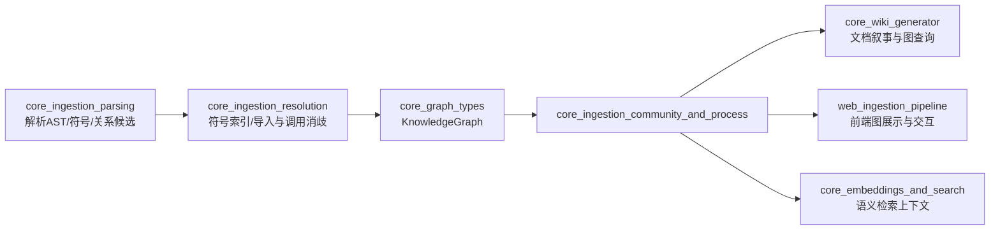
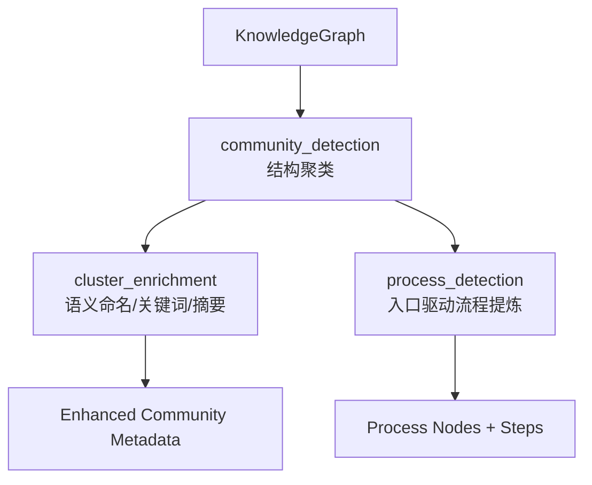
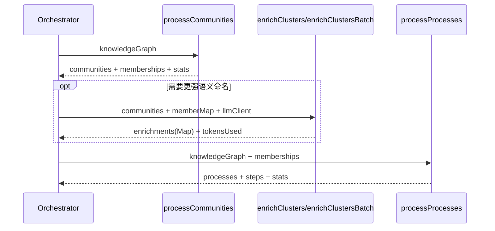
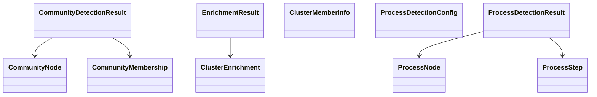
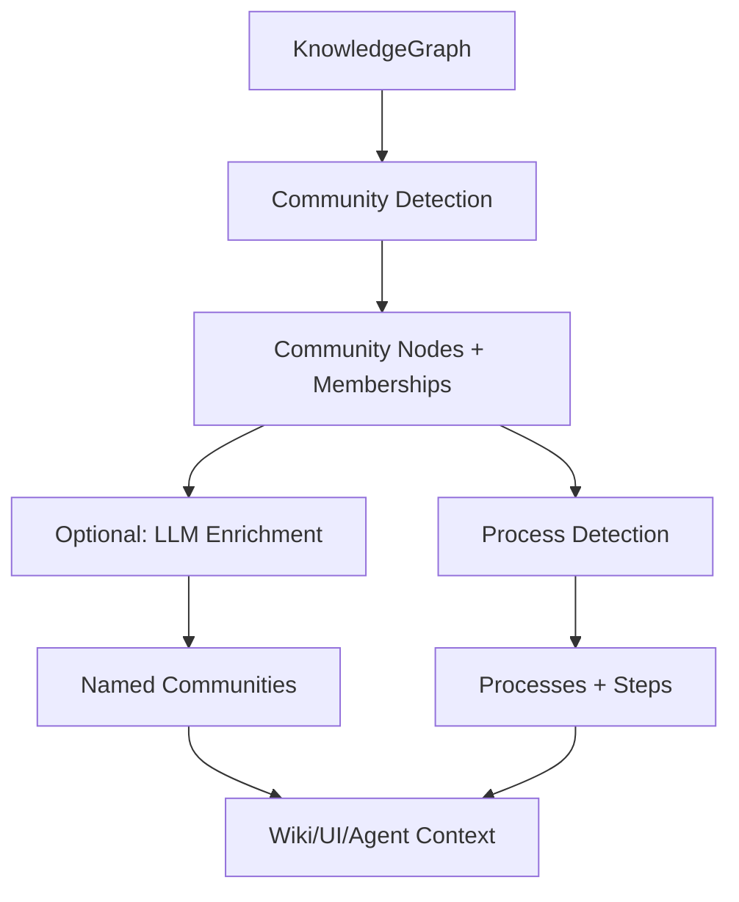

# core_ingestion_community_and_process 模块文档

## 1. 模块概览：它解决了什么问题、为什么存在

`core_ingestion_community_and_process` 是 GitNexus ingestion 管线中的“语义后处理层”。在上游模块完成源码解析、符号提取、导入/调用解析并构建 `KnowledgeGraph` 后，这个模块负责把“原子关系”提升为“人可理解的结构单元”：**社区（community）** 与 **流程（process）**，并在必要时通过 LLM 进行语义增强。

如果没有这一层，系统只能提供零散节点与边（某函数调用某函数、某类实现某接口）。这对图数据库是足够的，但对开发者、文档生成器、可视化 UI 和 AI Agent 来说仍然过细，理解成本高。该模块的存在意义在于：把结构信号压缩成“功能簇”和“执行路径”，让下游可以更快回答诸如“这部分代码属于哪个功能域”“一个功能入口会经过哪些关键步骤”“哪些流程跨越多个职责社区”等问题。

从工程取舍上看，这一层并不追求编译器级严格性，而是强调**可扩展、可解释、可降级**：大型图有性能保护、LLM 异常有回退策略、输出结构稳定可消费。这种设计非常适合真实代码库场景，因为真实仓库包含噪声、不完整关系、命名不规范与多语言混合等不确定性。

---

## 2. 在整体系统中的位置



这个模块明确依赖上游 `KnowledgeGraph` 的节点/关系质量，尤其依赖 `CALLS` 边和置信度分布；同时其产物会被多个下游复用，因此属于“高杠杆层”。上游模块细节请参考 [core_ingestion_parsing.md](core_ingestion_parsing.md) 与 [core_ingestion_resolution.md](core_ingestion_resolution.md)，图数据契约请参考 [core_graph_types.md](core_graph_types.md)。

---

## 3. 架构总览与组件关系

### 3.1 逻辑分层



在这条链路里，`community_detection` 是结构基础层，`cluster_enrichment` 是语义增强层，`process_detection` 是流程建模层。两条分支（社区与流程）共享同一张图输入，但关注问题不同：前者回答“协作团簇”，后者回答“可能执行路径”。

### 3.2 组件交互（运行时视角）



这个交互顺序意味着：流程检测可以利用社区归属判断是否跨社区；而社区增强并不影响流程计算本身，属于可选增强能力。

---

## 4. 核心子模块说明（含跳转链接）

### 4.1 community_detection

`community_detection` 使用 Leiden 算法对 `KnowledgeGraph` 中的符号节点进行社区发现，主要基于 `CALLS/EXTENDS/IMPLEMENTS` 构建无向聚类图。它对大图场景有内建降噪策略（低置信度边过滤、低度节点过滤）并提供超时回退（超时时降级为单社区分配），以保障吞吐和稳定性。输出包含 `CommunityNode`、`CommunityMembership` 与聚类统计信息，同时会跳过 singleton 社区以减少展示噪声。

该模块的详细实现、参数行为、标签生成策略与限制见：
**[community_detection.md](community_detection.md)**

### 4.2 cluster_enrichment

`cluster_enrichment` 在社区结构已确定的前提下，使用 LLM 为每个 cluster 生成更可读的语义名称、关键词与一句话描述。它的接口刻意保持极简（`LLMClient.generate(prompt)`），降低供应商耦合；并通过宽松 JSON 解析与逐社区回退机制保证“即使模型异常也能返回可用结果”。此外提供串行模式与批处理模式：前者稳健、后者高效。

该模块的 prompt 策略、解析容错细节、批处理权衡与维护建议见：
**[cluster_enrichment.md](cluster_enrichment.md)**

### 4.3 process_detection

`process_detection` 从调用图中识别高价值入口点，使用受限 BFS 前向追踪路径，并通过两轮去重（子路径去重、端点去重）压缩为可读流程集合。输出 `ProcessNode` 与 `ProcessStep`，并标注流程是否跨社区，帮助用户与 Agent 快速理解“功能如何流动”。该模块的关键价值在于：在静态分析可达范围内，提供可解释且数量可控的流程视图。

该模块的评分入口依赖、搜索边界配置、去重算法与已知限制见：
**[process_detection.md](process_detection.md)**

---

> 说明：本模块的详细子文档已生成并与主文档保持一一对应：
> - [community_detection.md](community_detection.md)
> - [cluster_enrichment.md](cluster_enrichment.md)
> - [process_detection.md](process_detection.md)


### 4.4 子模块文档同步状态（本次生成）

以下三个子模块文档已按当前源码重新生成，并与主文档中的术语保持一致：

- [community_detection.md](community_detection.md)
- [cluster_enrichment.md](cluster_enrichment.md)
- [process_detection.md](process_detection.md)

> 若后续修改了 `community-processor.ts`、`cluster-enricher.ts` 或 `process-processor.ts`，请优先同步对应子文档，再回到本主文档更新跨模块叙述。

## 5. 核心类型与职责边界（模块级）



从职责边界看：
- 社区类型负责“分组结构”；
- 增强类型负责“语义解释”；
- 流程类型负责“路径叙事”。

三类输出互补而非替代。维护时应避免把“流程逻辑”硬塞进社区结构，或把“语义命名”混入聚类算法核心路径，以防耦合升高。

---

## 6. 典型数据流（从图到可消费语义）



这一数据流强调了“可选增强”理念：即使没有 LLM，系统仍可依靠启发式标签输出社区与流程；而启用 LLM 后，则能显著提升可读性与检索体验。

---

## 7. 使用与集成建议

在编排层通常建议以下顺序：先运行社区检测，再构建成员映射并执行可选 LLM 增强，最后执行流程检测。这样可以确保流程结果具备社区上下文，且 UI 层可统一展示“结构分组 + 流程路径 + 语义命名”。

```ts
// 伪代码示意
const communityResult = await processCommunities(graph, progressCb);

const enrichmentResult = await enrichClusters(
  communityResult.communities,
  memberMap,
  llmClient
);

const processResult = await processProcesses(
  graph,
  communityResult.memberships,
  progressCb,
  { maxTraceDepth: 10, maxBranching: 4 }
);
```

如果是在线交互场景，可以先返回 `communityResult + processResult`，再异步补充 enrichment，避免用户等待 LLM。

---

## 8. 配置与运维关注点

该模块主要的调优点集中在三块：
1. **聚类性能/质量平衡**（大图阈值、关系置信度过滤、Leiden 参数）；
2. **流程搜索边界**（`maxTraceDepth/maxBranching/minSteps/maxProcesses`）；
3. **LLM 稳定性与成本**（串行 vs 批处理、成员截断、解析成功率）。

建议在生产环境至少监控以下指标：
- 社区检测：`nodesProcessed`、`modularity`、超时回退比例；
- 流程检测：`entryPointsFound`、`totalProcesses`、`avgStepCount`、跨社区流程比例；
- 社区增强：fallback 比例、解析失败率、`tokensUsed` 趋势。

---

## 9. 边界条件、错误场景与限制

本模块整体策略是“尽可能返回可用结果”，但仍有几个必须提前告知的限制：

- 社区检测在超时时会降级为单社区分配，稳定性高但语义价值低；
- singleton 社区会在展示输出中被过滤，因此统计项与展示项可能不一致；
- 流程检测是静态图上的代表性路径抽样，不等价于运行时真实控制流；
- 低置信度边过滤提升精度但可能降低召回，尤其在关系质量较弱的仓库；
- LLM 增强天然存在输出漂移，当前通过 fallback 保证可用，但不会保证语义完全准确。

这些限制并不意味着模块不可用，而是说明它是“工程实用语义层”而非“形式化验证层”。在产品中应将其定位为导航与理解加速器。

---

## 10. 如何扩展本模块

如果你要扩展 `core_ingestion_community_and_process`，推荐遵循以下原则：

第一，保持输出契约稳定。新增字段尽量可选，避免破坏现有消费者（wiki、web、agent）。第二，把策略参数化而不是硬编码，尤其是阈值和超时；这样不同规模仓库可独立调优。第三，维持“失败可降级”原则，任何外部依赖（尤其 LLM）都不应导致 ingestion 主链路整体失败。

可优先考虑的增强方向包括：
- 将社区检测与流程检测关键阈值统一收敛到可配置对象；
- 为 enrichment 增加结构化输出约束（schema-based decoding）；
- 为流程去重引入更严格的序列匹配，减少字符串 `includes` 的误判风险；
- 增加可观测性字段（例如 filtered singleton 数量、fallback 原因分类）。

---

## 11. 相关文档索引

- 图类型与图操作契约： [core_graph_types.md](core_graph_types.md)
- 解析阶段（符号/关系提取）： [core_ingestion_parsing.md](core_ingestion_parsing.md)
- 解析后解析（符号索引/导入与调用解析）： [core_ingestion_resolution.md](core_ingestion_resolution.md)
- 社区检测详解： [community_detection.md](community_detection.md)
- 社区语义增强详解： [cluster_enrichment.md](cluster_enrichment.md)
- 流程检测详解： [process_detection.md](process_detection.md)
- Web 侧同构 ingestion： [web_ingestion_pipeline.md](web_ingestion_pipeline.md)
