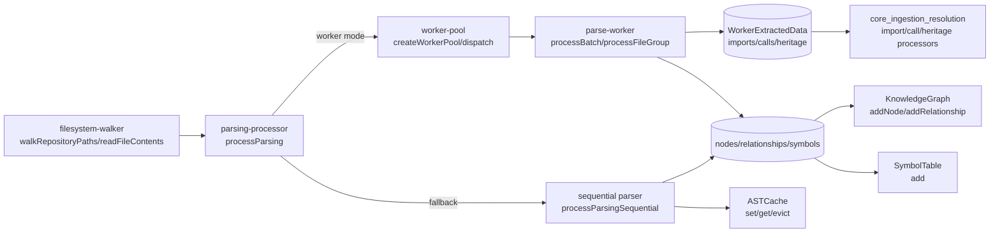
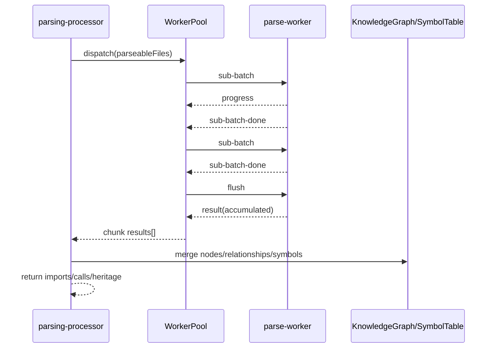
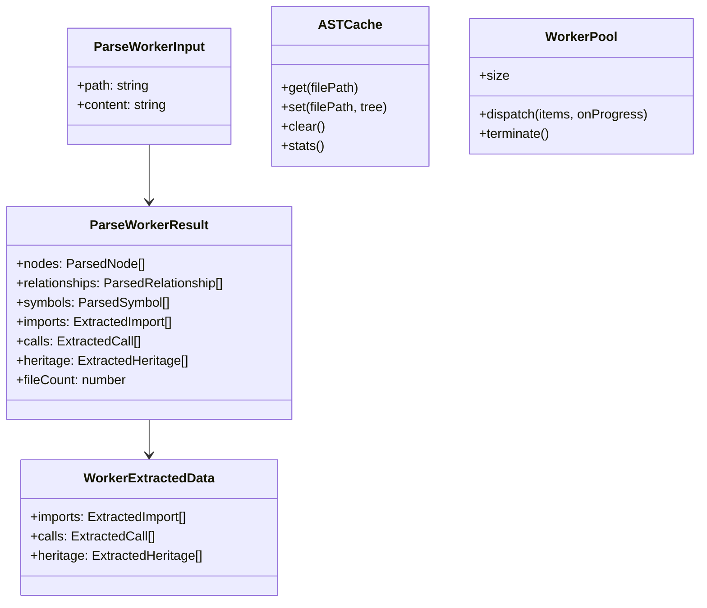
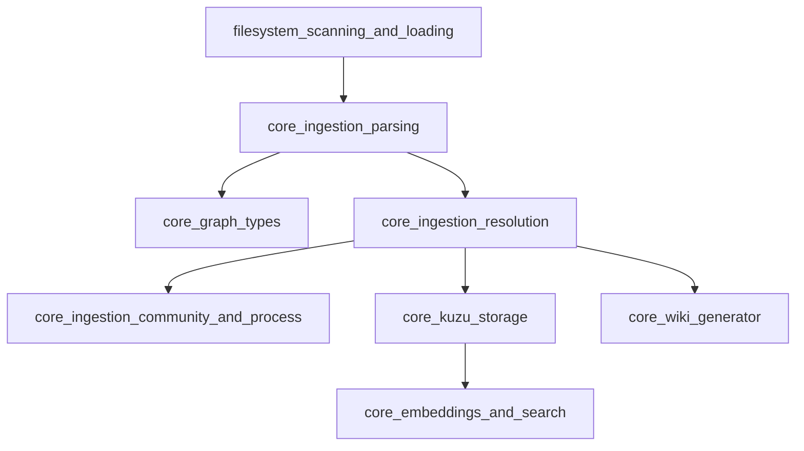

# core_ingestion_parsing 模块文档

## 1. 模块定位与设计目标

`core_ingestion_parsing` 是 GitNexus 代码摄取（ingestion）流水线中的“语法解析与结构提取层”。它负责把仓库中的源文件从“纯文本”转换为后续图构建与语义解析可用的结构化中间数据：包括符号定义节点（函数/类/接口等）、`DEFINES` 关系、原始 import 语句、调用点、继承/实现关系，以及用于后续阶段解析与归并的符号索引信息。

从系统分层上看，这个模块位于文件系统扫描之后、符号解析（resolution）之前。它解决的核心问题是：**如何在多语言代码库中，以可控内存与可接受吞吐，稳定地抽取“足够准确”的静态结构信息**。为此它采用了三类策略：

1. 通过 `tree-sitter` + 语言查询（query）统一抽取逻辑，降低语言差异带来的实现复杂度。
2. 通过 worker pool + 子批次（sub-batch）机制做并行解析，避免单线程吞吐瓶颈，同时限制峰值内存。
3. 保留串行 fallback 路径，保证在 worker 异常、解析器崩溃或环境限制下仍能完成基础解析。

该模块输出直接服务于：
- 图层类型（见 [core_graph_types.md](core_graph_types.md)）中的 `KnowledgeGraph` 节点和关系写入；
- `core_ingestion_resolution` 中 import/call/heritage 的解析归并；
- 下游社区检测、流程识别、wiki 生成、检索索引等能力。

---

## 2. 架构总览

### 2.1 组件关系图



该图体现了模块的双路径设计：优先并行 worker 路径（高性能），失败后回退串行路径（高兼容）。并行路径将 AST 提取工作下沉到 worker，主线程只负责调度与聚合；串行路径则在主线程内直接 parse + query，并且会把 AST 写入 `ASTCache`，便于潜在复用。

### 2.2 处理流程图（并行模式）



重点在于 worker 不直接写主线程图对象，而是返回可序列化结果；主线程统一落图。这降低了线程共享复杂度，也使失败恢复逻辑更清晰。

---

## 3. 子模块说明（高层）

### 3.1 workers_parsing（见 [workers_parsing.md](workers_parsing.md)）

该子模块包含 `parse-worker.ts` 与 `worker-pool.ts`，是解析吞吐与稳定性的核心。`parse-worker` 负责具体 AST 查询、节点与关系构造、import/call/heritage 抽取、语言细节处理（如 TS/TSX 语法区分、跨语言 export/public 判定、内建调用过滤、PHP Eloquent 元数据提取）。`worker-pool` 则负责 worker 生命周期、任务切分、子批次发送、进度聚合、超时与异常处理。

它们组合后形成“高并发 + 有界内存 + 可观测进度”的解析执行平面，是大仓库分析性能的决定性因素。

### 3.2 parsing_processor_orchestration（见 [parsing_processor_orchestration.md](parsing_processor_orchestration.md)）

该子模块是主入口编排层，对外暴露 `processParsing(...)`。它负责选择 worker 路径或串行路径、把 worker 返回结果写入 `KnowledgeGraph` 与 `SymbolTable`、并向后续 resolution 阶段返回 `WorkerExtractedData`（imports/calls/heritage）。

这个层的设计目标是把“执行策略”与“提取逻辑”分离，使调用方只需关心一个稳定入口，而不需要感知内部并发与降级细节。

### 3.3 ast_cache_management（见 [ast_cache_management.md](ast_cache_management.md)）

该子模块提供 LRU 风格的 AST 树缓存抽象 `ASTCache`。它通过 `lru-cache` 管理缓存容量，并在逐出时尝试调用 `tree.delete()`（兼容 WASM 场景），避免不必要的内存驻留。

需要注意：当前代码中缓存主要在串行 fallback 路径被写入；worker 路径中 AST 不会回传主线程，因此通常不会填充该缓存。

### 3.4 filesystem_scanning_and_loading（见 [filesystem_scanning_and_loading.md](filesystem_scanning_and_loading.md)）

该子模块负责“先扫描再按需读取”的文件系统策略。第一阶段仅收集路径与大小（`ScannedFile`），并过滤忽略路径与超大文件；第二阶段才读取文本内容并返回 Map。这样可避免在大仓库中一次性把内容全部驻留内存。

它是解析层输入质量与资源消耗控制的前置保障。

---

## 4. 核心数据模型与职责边界



这些类型的关键意义：
- `ParseWorkerResult` 是线程边界上的序列化契约，必须只包含可结构化克隆的数据；
- `WorkerExtractedData` 是编排层对后续 resolution 暴露的精简结果，避免向后游泄漏过多解析内部细节；
- `WorkerPool` 把并发与故障策略收口在统一接口，降低主流程复杂度。

---

## 5. 关键内部机制

### 5.1 语言路由与查询提取

解析器通过 `getLanguageFromFilename` 判断语言，再从 `LANGUAGE_QUERIES` 取对应 query。对 TypeScript 特别区分 `.ts` 与 `.tsx`（不同 grammar），避免 JSX 语法导致误解析。若语言未支持或 query 缺失，文件会被跳过而不会中断全局流程。

### 5.2 导出/可见性判定

`isNodeExported` 依据语言语义分别处理：
- JS/TS：沿父节点查 `export_*` 及文本前缀；
- Python：以下划线命名约定推断非导出；
- Java/C#/Rust：检查 `public`/`pub` 修饰；
- Go：首字母大写规则；
- C/C++：默认 `false`（无统一语言级导出概念）。

该字段对后续入口点评分、API 面识别等阶段很重要，但它是启发式推断，不等同编译器级可见性真值。

### 5.3 调用点抽取与噪声过滤

worker 在 query 捕获到 `call` 后，会提取调用名并过滤大量内建函数（`BUILT_INS`），减少图中的噪声边。调用来源 `sourceId` 通过向上寻找包裹函数节点得到；若找不到，则回退到文件级 ID（`generateId('File', filePath)`），保证每个调用点都有归属。

### 5.4 继承关系与 PHP 增强抽取

`heritage` 会记录 `extends`/`implements`/`trait-impl` 三类信息，为类型关系图构建提供原始素材。对于 PHP，模块还额外识别 Eloquent 约定：
- 属性数组（如 `fillable`, `casts`）会被提取为节点 `description`；
- 模型关系方法（如 `hasMany`）会生成关系描述字符串。

这类框架感知抽取提升了业务语义可读性，是“通用语法解析”向“框架语义理解”迈进的一步。

### 5.5 内存与故障控制

- 文件级限制：超过 `512KB` 的文件在扫描和解析阶段均会被跳过。
- 子批次限制：每次向 worker 发送最多 `1500` 文件，抑制结构化克隆峰值。
- 超时熔断：单子批次 `30s` 超时会失败并触发错误路径。
- 自动降级：`processParsing` 捕获 worker 失败并切换串行解析。

这套机制的目标不是“绝不丢文件”，而是“在异常仓库中保持整体可用与可预期资源占用”。

---

## 6. 与系统其他模块的协作

`core_ingestion_parsing` 与上下游模块协作关系如下：



简要说明：
- 图实体落地遵循 [core_graph_types.md](core_graph_types.md)；
- import/call/heritage 的真正“解析到目标符号”发生在 `core_ingestion_resolution`；
- 后续社区/流程识别、存储导出、搜索与 wiki 都依赖这一阶段的结构完整性。

---

## 7. 使用方式与配置建议

### 7.1 典型调用（推荐并行）

```ts
import { createWorkerPool } from './workers/worker-pool.js';
import { processParsing } from './parsing-processor.js';

const pool = createWorkerPool(new URL('./workers/parse-worker.js', import.meta.url));

try {
  const extracted = await processParsing(
    graph,
    files,            // [{ path, content }]
    symbolTable,
    astCache,
    (current, total, label) => {
      console.log(`[parse] ${current}/${total} ${label}`);
    },
    pool,
  );

  // extracted?.imports / calls / heritage -> 交给 resolution 阶段
} finally {
  await pool.terminate();
}
```

### 7.2 关键配置点

- `poolSize`：默认 `min(8, cpu-1)`，CPU 紧张或容器配额低时建议手工下调。
- `SUB_BATCH_SIZE=1500`：增大可减少消息往返，但会提高单次 clone 内存与超时风险。
- `SUB_BATCH_TIMEOUT_MS=30000`：仓库包含复杂生成文件时，可适当提高，但建议先优化忽略规则。
- `ASTCache maxSize`：仅在串行路径收益明显，worker 模式下收益有限。

---

## 8. 扩展指南

### 8.1 新增语言支持

通常需要同时改动：
1. `SupportedLanguages` 与 `getLanguageFromFilename` 映射；
2. `parse-worker` 的 `languageMap`（tree-sitter grammar）；
3. `LANGUAGE_QUERIES` 新语言 query；
4. （可选）`isNodeExported` 的语言级可见性逻辑。

若只加 grammar 不加 query，则不会提取任何结构节点。

### 8.2 新增提取类型（例如注解、依赖注入声明）

建议路径：
- 在 query 增加 capture；
- 在 `processFileGroup` 增加 capture 分支并写入新的结果数组；
- 在 `ParseWorkerResult` 与 `WorkerExtractedData` 补充类型；
- 在 `parsing-processor` 聚合并对接下游处理器。

保持“worker 可序列化输出 + 主线程统一落图/分发”的模式，可以避免线程模型被破坏。

---

## 9. 已知边界、错误条件与注意事项

1. **ASTCache 行为差异**：当前 worker 路径不写 ASTCache；若下游代码依赖缓存命中，需要确认是否走了串行路径。
2. **进度总数语义**：并行路径回调中的 `total` 使用的是输入 `files.length`，而处理计数基于 parseable 文件，某些仓库会出现“看似提前完成/跳变”感受。
3. **行号基准**：`tree-sitter` 行号来自 `startPosition.row`，通常是 0-based，展示层需要统一转换。
4. **超大文件跳过**：>512KB 文件直接忽略，可能漏掉真实业务代码（尤其单文件脚本仓库）。
5. **调用过滤误差**：`BUILT_INS` 是启发式黑名单，可能误杀用户自定义同名函数，或遗漏某些标准库别名。
6. **导出判定近似**：各语言 `isExported` 为静态启发式，不覆盖全部语法与构建工具行为。
7. **worker 失效场景**：native addon 崩溃、OOM、超时会触发 fallback；若串行也失败，需要从文件质量与忽略规则排查。

---

## 10. 运维与排障建议

当解析阶段慢或不稳定时，优先按以下顺序排查：

- 检查仓库中是否有大量生成文件/大文件，完善忽略规则；
- 降低 `poolSize` 观察是否缓解内存抖动；
- 观察是否频繁触发 sub-batch timeout；
- 对失败文件做单文件复现，确认 grammar/query 是否兼容；
- 必要时临时关闭 worker 仅跑串行，判断问题来自并发层还是语法层。

---

## 11. 参考文档

> 本模块拆分文档采用“主文档 + 子模块文档”方式。以下子模块页面已生成并与当前实现对齐，建议按“执行层 → 编排层 → 资源层 → 输入层”的顺序阅读：

- [workers_parsing.md](workers_parsing.md)
- [parsing_processor_orchestration.md](parsing_processor_orchestration.md)
- [ast_cache_management.md](ast_cache_management.md)
- [filesystem_scanning_and_loading.md](filesystem_scanning_and_loading.md)

上述四个子模块文档分别覆盖并行解析执行面、主流程编排层、AST 生命周期管理以及文件系统输入层；与本文件共同构成 `core_ingestion_parsing` 的完整说明。

同时建议结合上下游模块文档阅读：

- [core_graph_types.md](core_graph_types.md)
- [core_ingestion_resolution.md](core_ingestion_resolution.md)
- [core_kuzu_storage.md](core_kuzu_storage.md)
- [core_embeddings_and_search.md](core_embeddings_and_search.md)
