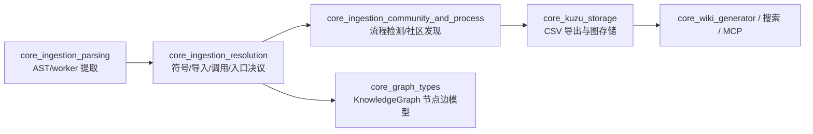
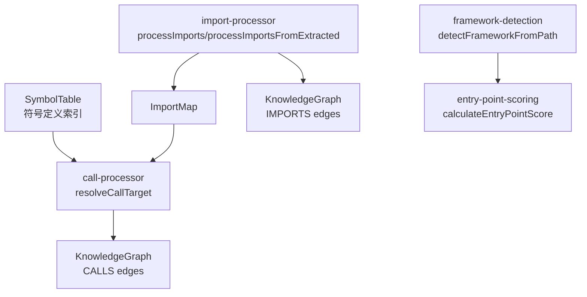
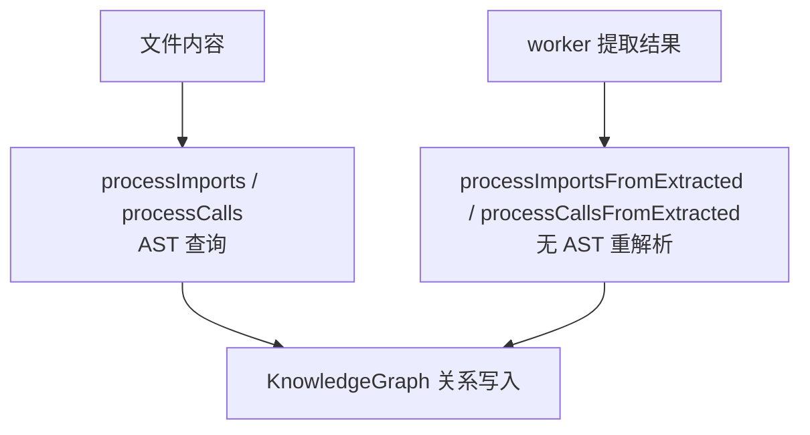
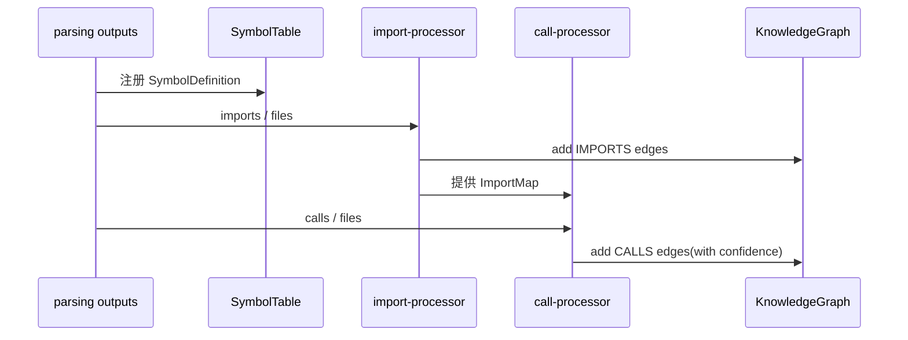

# core_ingestion_resolution 模块文档

## 1. 模块定位与设计目标

`core_ingestion_resolution` 是 GitNexus 摄取（ingestion）流水线中的“语义解析后决议层（resolution layer）”。在 `core_ingestion_parsing.md` 产出 AST 提取结果（symbol/import/call/heritage 等原始线索）之后，本模块负责把这些线索转化为**可被知识图消费的确定关系**：

- 符号索引（`SymbolTable`）
- 导入路径解析与 `IMPORTS` 边建立
- 调用目标解析与 `CALLS` 边建立（含置信度）
- 框架感知与入口点评分（供后续流程检测与社区分析使用）

它存在的核心原因是：仅靠语法提取无法保证跨文件、跨语言、跨框架的可追踪性。比如 `foo()` 这个调用，解析阶段知道“有一个调用”，但不知道它究竟对应哪个定义；`@/services/user` 这种别名导入在没有 `tsconfig` 语义下也无法落到仓库文件。本模块通过“索引 + 规则 + 缓存 + 置信度”策略，把“不确定线索”转成“可运算关系”。

---

## 2. 在整体系统中的位置

从系统分层看，该模块处于“解析结果 → 图关系”的中间层，并为后续的流程识别、社区聚类、存储与检索提供基础关系质量。

上图反映了一个关键事实：`core_ingestion_resolution` 不是“附加优化”，而是图质量的基础门槛。若该层决议不准，后续模块虽然仍可运行，但流程路径、入口点、跨文件调用链都会显著退化。

---

## 3. 架构总览

### 3.1 核心组件关系

该架构体现出“先导入、后调用”的设计倾向：`call-processor` 在高置信解析时会依赖 `ImportMap`（由 `import-processor` 生成），以提升调用目标匹配准确率。与此同时，`entry-point-scoring` 虽不直接生成边，但会使用框架线索为后续流程检测提供优先级信号。

### 3.2 双通路处理模式（标准路径 + 快速路径）

模块为导入和调用都实现了两套入口：

1. **标准路径**：适用于直接基于文件内容处理，内部可复用 `ASTCache`。
2. **快速路径**：适用于与 `workers_parsing` 管道对接，直接消费 `ExtractedImport`/`ExtractedCall`，减少重复解析与 Query 开销。

---

## 4. 子模块说明（含跳转）

### 4.1 `symbol_indexing`（见 [symbol_indexing.md](symbol_indexing.md)）

该子模块提供 `SymbolTable` 与 `SymbolDefinition` 抽象，是调用决议和局部上下文定位的基础。设计上采用“双索引”：文件内精确索引（高置信）+ 全局反向索引（低置信兜底），兼顾准确率和召回率。对大型仓库而言，这一结构可在常见场景下保持近 O(1) 查询复杂度。

### 4.2 `import_resolution`（见 [import_resolution.md](import_resolution.md)）

该子模块是本模块最复杂的部分。它不仅做普通相对路径解析，还内建 TypeScript path alias、Rust module path、Java wildcard/static import、Go module package、PHP PSR-4 等语言语义，并通过 `SuffixIndex` 与 `resolveCache` 控制性能和内存。其输出直接决定 `ImportMap` 与 `IMPORTS` 边质量。

### 4.3 `call_resolution`（见 [call_resolution.md](call_resolution.md)）

该子模块通过 `ResolveResult` 对调用目标进行分级决议：同文件、导入命中、全局模糊匹配，并携带置信度和原因字段写入图边。这使得下游模块不仅拿到“是否有边”，还能感知“这条边有多可信”。

### 4.4 `entry_point_intelligence`（见 [entry_point_intelligence.md](entry_point_intelligence.md)）

该子模块包含两部分：框架提示（`FrameworkHint`）和入口分数（`EntryPointScoreResult`）。前者根据路径约定识别 Next.js / Spring / Laravel 等生态信号，后者将调用比、导出性、命名模式和框架倍数融合成入口分值，用于流程起点排序与业务入口发现。

### 4.5 子模块文档导航总览

以下四份子文档已与本章同步生成，并按“索引 → 导入决议 → 调用决议 → 入口智能”顺序阅读可获得完整心智模型：

- [symbol_indexing.md](symbol_indexing.md)
- [import_resolution.md](import_resolution.md)
- [call_resolution.md](call_resolution.md)
- [entry_point_intelligence.md](entry_point_intelligence.md)

## 5. 关键内部机制与设计取舍

### 5.1 置信度驱动的解析策略

调用解析并非“找到一个就算完成”，而是采用层级优先级：

1. 本地文件精确命中（`same-file`）
2. 导入范围命中（`import-resolved`）
3. 全局模糊匹配（`fuzzy-global`）

这种设计在工程实践上非常重要：跨语言仓库中同名函数普遍存在，单一全局查找会导致误连边。通过置信度标注，下游可以选择阈值过滤，例如流程检测只采用 `>=0.85` 的调用边。

### 5.2 性能与内存平衡

`import-processor` 的路径决议使用两级优化：

- `SuffixIndex`：把后缀匹配从线性扫描降为索引查找
- `resolveCache`：缓存 `(currentFile, importPath)` 结果，并在达到上限后淘汰旧项

这对 monorepo 特别关键，因为重复导入模式很高频。相比每次全仓遍历，索引 + 缓存显著减少 CPU 消耗。

### 5.3 跨语言可扩展策略

当前实现采取“通用主流程 + 语言特化分支”模式。即主流程保持一致（解析 import/call → resolve → 写图），语言差异集中在 resolver 规则中。该模式让新增语言时更可控：通常只需补充特化 resolver 与查询模式，而不用重写全管线。

---

## 6. 使用与集成建议

### 6.1 推荐调用顺序

建议先完成 symbol 建表，再进行 import，再进行 call。因为调用解析需要同时利用 `SymbolTable` 与 `ImportMap` 才能达到最佳精度。

### 6.2 与相邻模块协作

- 与 [core_ingestion_parsing.md](core_ingestion_parsing.md)：优先使用 extracted fast path，避免重复 AST 查询。
- 与 [core_graph_types.md](core_graph_types.md)：所有关系最终写入 `KnowledgeGraph`，需要保证 node id 生成策略一致。
- 与 `core_ingestion_community_and_process.md`：入口分数与高置信调用边会直接影响流程检测结果。

---

## 7. 扩展指南

扩展本模块通常有三类需求：

1. **新增语言导入规则**：在 import resolver 增加分支，并确保 fallback 到通用 suffix 逻辑。
2. **提升调用判定精度**：扩展 built-in/noise 过滤集合，或增加限定上下文（如类作用域）。
3. **引入新框架入口信号**：在 `framework-detection` 增加路径模式，并在评分解释中保留 reason 便于审计。

建议每次扩展都同步补充“reason 字段语义”，便于后续调试和可解释性分析。

---

## 8. 常见边界条件与风险

- **符号重名冲突**：`lookupFuzzy` 返回多定义时会降置信并取首个候选，可能误连。
- **路径约定偏离**：框架检测主要基于路径规则；非标准目录结构会导致倍率失效（但会安全回退到 1.0）。
- **缓存命中污染风险**：若增量分析时文件集变化但沿用旧 context，可能出现旧缓存路径决议；应在仓库快照变化后重建 context。
- **测试文件干扰**：入口点评分虽提供 `isTestFile` 辅助，但调用方需主动过滤，否则测试代码可能进入候选入口。

---

## 9. 参考文档

- [symbol_indexing.md](symbol_indexing.md)
- [import_resolution.md](import_resolution.md)
- [call_resolution.md](call_resolution.md)
- [entry_point_intelligence.md](entry_point_intelligence.md)
- [core_ingestion_parsing.md](core_ingestion_parsing.md)
- [core_graph_types.md](core_graph_types.md)
