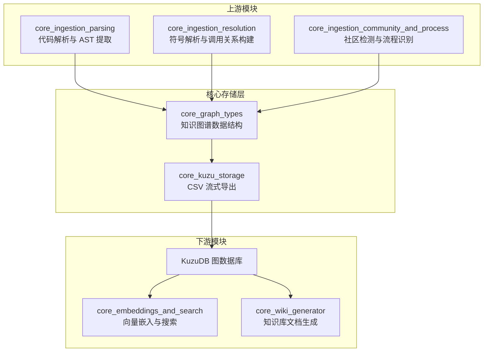
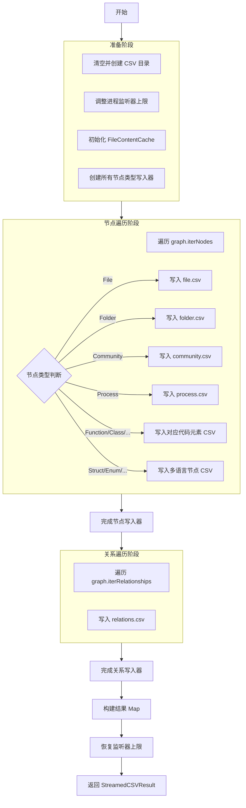

# core_kuzu_storage 模块文档

## 1. 模块概述

### 1.1 模块定位与目的

`core_kuzu_storage` 模块是 GitNexus 代码知识库系统中的核心存储层组件，负责将内存中的知识图谱数据高效地导出为 CSV 格式，以便导入到 KuzuDB 图数据库中。该模块在整个数据处理流水线中扮演着"持久化适配器"的角色，连接了前端的代码分析阶段（由 `core_ingestion_parsing` 和 `core_ingestion_resolution` 模块完成）与后端的图数据库存储阶段。

在现代代码知识库系统中，处理大型代码仓库时面临的核心挑战之一是内存效率。一个中型代码仓库可能包含数万个源代码文件、数十万个代码元素（函数、类、方法等），如果将所有数据一次性加载到内存中再进行导出，会导致极高的内存占用甚至内存溢出。`core_kuzu_storage` 模块通过流式处理架构解决了这一问题：它采用单次遍历（single-pass）策略，在遍历知识图谱节点的过程中直接将数据流式写入磁盘文件，避免了将整个仓库内容保留在 RAM 中。

### 1.2 设计哲学

该模块的设计遵循以下核心原则：

**流式优先（Streaming-First）**：所有数据处理都采用流式方式，避免批量加载。节点遍历与 CSV 写入同步进行，每处理一个节点就立即将其路由到对应的写入器。

**惰性内容加载（Lazy Content Loading）**：源代码文件内容不会预先加载到内存，而是通过 `FileContentCache` 类实现按需读取。同一个文件中的多个符号定义只会触发一次磁盘读取操作，后续访问直接从 LRU 缓存中获取。

**RFC 4180 合规性**：CSV 输出严格遵循 RFC 4180 标准，确保与各种数据库导入工具的兼容性。特别是对于包含特殊字符（逗号、引号、换行符）的代码内容，采用双引号包裹和引号转义机制。

**批量缓冲写入（Buffered Writing）**：为减少频繁的磁盘 I/O 操作带来的性能开销，模块实现了行缓冲机制，每累积 500 行数据才执行一次实际的磁盘写入操作。

### 1.3 与系统其他模块的关系

`core_kuzu_storage` 模块在 GitNexus 系统架构中处于承上启下的位置：



如上图所示，`core_kuzu_storage` 模块依赖于 `core_graph_types` 模块定义的图数据结构（`KnowledgeGraph`、`GraphNode`、`GraphRelationship`），接收经过完整分析和增强后的知识图谱。导出后的 CSV 文件被导入到 KuzuDB 图数据库中，为后续的语义搜索（`core_embeddings_and_search`）和知识库文档生成（`core_wiki_generator`）提供数据基础。

关于 `core_graph_types` 模块中知识图谱数据结构的详细定义，请参考 [core_graph_types](core_graph_types.md) 文档。

---

## 2. 核心组件详解

### 2.1 FileContentCache 类

#### 2.1.1 功能描述

`FileContentCache` 是一个专门优化的 LRU（Least Recently Used，最近最少使用）内容缓存类，用于在 CSV 导出过程中高效管理源代码文件内容的读取。在代码知识库中，一个源代码文件通常包含多个符号定义（如多个函数、类等），如果为每个符号节点都独立读取文件内容，会导致大量重复的磁盘 I/O 操作。`FileContentCache` 通过缓存机制确保每个文件在整个导出过程中最多只被读取一次。

#### 2.1.2 内部结构与工作原理

```typescript
class FileContentCache {
  private cache = new Map<string, string>();      // LRU 缓存存储
  private accessOrder: string[] = [];             // 访问顺序队列
  private maxSize: number;                        // 最大缓存条目数
  private repoPath: string;                       // 仓库根路径
}
```

该类采用双数据结构实现 LRU 策略：
- `cache` Map 存储实际的文件路径到内容的映射，提供 O(1) 的查找性能
- `accessOrder` 数组记录访问顺序，队首为最久未访问的条目，队尾为最近访问的条目

当缓存达到容量上限时，系统会自动淘汰队首（最久未使用）的条目，为新条目腾出空间。这种设计在保证缓存命中率的同时，有效控制了内存占用。

#### 2.1.3 核心方法

**`constructor(repoPath: string, maxSize: number = 3000)`**

构造函数初始化缓存实例。`repoPath` 参数指定代码仓库的根目录路径，用于后续构建文件的完整路径。`maxSize` 参数默认值为 3000，表示缓存最多可容纳 3000 个文件内容。这个容量经过精心调优，足以覆盖大多数中型仓库在单次遍历过程中的活跃文件集合。

**`async get(relativePath: string): Promise<string>`**

这是缓存类的核心访问方法，接受文件的相对路径作为参数，返回文件内容的 Promise。方法执行流程如下：

1. 首先检查缓存中是否已存在该文件内容，如果存在则直接返回（缓存命中）
2. 如果缓存未命中，则构建完整文件路径并从磁盘读取
3. 读取成功后，将内容存入缓存并更新访问顺序
4. 如果读取失败（文件不存在或权限问题），则缓存空字符串并返回

这种"失败也缓存"的策略避免了对不存在文件的重复尝试读取，提升了整体性能。

**`private set(key: string, value: string): void`**

内部方法，负责将键值对存入缓存并维护 LRU 顺序。当缓存容量达到上限时，该方法会：
1. 从 `accessOrder` 队列头部移除最旧的条目
2. 从 `cache` Map 中删除对应的缓存项
3. 将新条目添加到队列尾部

#### 2.1.4 使用示例

```typescript
// 初始化内容缓存
const contentCache = new FileContentCache('/path/to/repo', 3000);

// 获取文件内容（自动处理缓存逻辑）
const fileContent = await contentCache.get('src/utils/helper.ts');

// 同一文件再次访问时直接从缓存返回
const cachedContent = await contentCache.get('src/utils/helper.ts');
```

#### 2.1.5 性能特征与注意事项

- **时间复杂度**：缓存命中时为 O(1)，未命中时为 O(n)（n 为文件内容长度，受磁盘 I/O 影响）
- **空间复杂度**：O(m × avg_size)，其中 m 为 maxSize，avg_size 为平均文件大小
- **线程安全**：该类设计为单线程使用，在并发场景下需要外部同步
- **内存控制**：3000 条目的默认限制在大多数场景下可控制在几百 MB 以内

---

### 2.2 BufferedCSVWriter 类

#### 2.2.1 功能描述

`BufferedCSVWriter` 是一个带缓冲功能的 CSV 文件写入器，用于高效地将数据行批量写入磁盘。在 Node.js 环境中，频繁的 `fs.write` 调用会产生显著的性能开销，因为每次调用都涉及异步操作和系统调用。`BufferedCSVWriter` 通过在内存中累积多行数据后一次性写入，大幅减少了 I/O 操作次数。

#### 2.2.2 内部结构与工作原理

```typescript
class BufferedCSVWriter {
  private ws: WriteStream;        // Node.js 可写流
  private buffer: string[] = [];  // 行缓冲区
  rows = 0;                       // 已写入行数计数器
}
```

该类封装了 Node.js 的原生 `createWriteStream`，在其基础上增加了行缓冲层。缓冲区使用字符串数组实现，每行数据作为数组的一个元素。当缓冲区达到阈值（由 `FLUSH_EVERY` 常量定义，默认 500 行）时，触发批量写入操作。

#### 2.2.3 核心方法

**`constructor(filePath: string, header: string)`**

构造函数创建写入器实例并初始化缓冲区。`filePath` 指定输出 CSV 文件的完整路径，`header` 是 CSV 文件的表头行。构造时会自动将表头行添加到缓冲区，确保文件的第一行始终是列名定义。

值得注意的是，构造函数中调用了 `this.ws.setMaxListeners(50)`，这是为了解决 Node.js 的事件监听器警告问题。在大型仓库处理过程中，可能同时存在数十个并发的写入流，每个流都会注册事件监听器。如果不提高监听器上限，Node.js 会发出 `MaxListenersExceededWarning` 警告。

**`addRow(row: string): Promise<void>`**

添加一行数据到缓冲区。该方法接收已格式化的 CSV 行字符串（字段间用逗号分隔），将其追加到缓冲区。添加后检查缓冲区长度，如果达到 `FLUSH_EVERY` 阈值，则自动触发 `flush()` 方法将缓冲区内容写入磁盘。

返回值是一个 Promise：如果未触发刷新，立即返回已解决的 Promise；如果触发了刷新，则返回 `flush()` 的 Promise，调用者可以等待写入完成。

**`flush(): Promise<void>`**

强制将缓冲区内容刷新到磁盘。方法执行流程：
1. 检查缓冲区是否为空，如果为空则直接返回
2. 将缓冲区所有行用换行符连接成一个完整的文本块
3. 清空缓冲区数组
4. 通过可写流的 `write()` 方法写入数据
5. 如果写入返回 `false`（表示内部缓冲区已满），则等待 `drain` 事件后再 resolve

这种处理方式确保了背压（backpressure）的正确处理，避免内存无限增长。

**`async finish(): Promise<void>`**

完成写入并关闭文件流。该方法首先调用 `flush()` 确保所有缓冲数据都已写入，然后调用 `ws.end()` 关闭可写流。方法返回的 Promise 在流完全关闭后 resolve，如果流发生错误则 reject。

#### 2.2.4 使用示例

```typescript
// 创建写入器
const writer = new BufferedCSVWriter(
  '/output/function.csv',
  'id,name,filePath,startLine,endLine,isExported,content,description'
);

// 添加数据行
await writer.addRow('func_001,main,src/index.ts,10,50,true,"function content","Entry point"');
await writer.addRow('func_002,helper,src/utils.ts,5,20,false,"helper code","Utility function"');

// 完成写入
await writer.finish();
```

#### 2.2.5 性能优化细节

- **缓冲阈值**：`FLUSH_EVERY = 500` 是经过实验调优的值，在内存占用和 I/O 效率之间取得平衡
- **背压处理**：通过监听 `drain` 事件正确处理 Node.js 流背压，防止内存溢出
- **监听器管理**：动态调整 `setMaxListeners` 避免警告，并在完成后恢复原始值
- **批量写入**：500 行批量写入可将 I/O 操作减少两个数量级

---

### 2.3 StreamedCSVResult 接口

#### 2.3.1 功能描述

`StreamedCSVResult` 是 `streamAllCSVsToDisk` 函数的返回类型，提供了导出操作的完整结果摘要。该接口使调用者能够了解生成的 CSV 文件位置、每个表包含的行数等元信息，便于后续的数据库导入操作。

#### 2.3.2 接口定义

```typescript
export interface StreamedCSVResult {
  nodeFiles: Map<NodeTableName, { csvPath: string; rows: number }>;
  relCsvPath: string;
  relRows: number;
}
```

**字段说明**：

- **`nodeFiles`**：一个 Map，键为节点表名（`NodeTableName` 类型），值为包含 CSV 文件路径和行数的对象。该 Map 只包含实际有数据的表（行数 > 0），空表不会被包含。这使得调用者可以快速判断哪些节点类型在仓库中存在。

- **`relCsvPath`**：关系 CSV 文件的完整路径。所有图谱关系（边）都存储在单一的 `relations.csv` 文件中，采用统一的 schema。

- **`relRows`**：关系 CSV 文件中的总行数（不包括表头）。这个数字反映了图谱中边的总数，是衡量代码库复杂度的重要指标。

#### 2.3.3 使用示例

```typescript
const result = await streamAllCSVsToDisk(graph, repoPath, csvDir);

// 检查生成的文件
console.log(`生成了 ${result.nodeFiles.size} 个节点表`);
for (const [tableName, info] of result.nodeFiles) {
  console.log(`  ${tableName}: ${info.rows} 行 -> ${info.csvPath}`);
}

console.log(`关系表：${result.relRows} 行 -> ${result.relCsvPath}`);

// 后续导入到 KuzuDB
// await importToKuzu(result.nodeFiles, result.relCsvPath);
```

---

### 2.4 streamAllCSVsToDisk 函数

#### 2.4.1 功能描述

`streamAllCSVsToDisk` 是整个模块的核心导出函数，负责将完整的知识图谱流式导出为一组 CSV 文件。该函数采用单次遍历策略，在遍历图谱节点的过程中直接将每个节点路由到对应的 CSV 写入器，实现了内存效率和处理速度的最优化。

#### 2.4.2 函数签名

```typescript
export const streamAllCSVsToDisk = async (
  graph: KnowledgeGraph,
  repoPath: string,
  csvDir: string,
): Promise<StreamedCSVResult>
```

**参数说明**：

- **`graph`**：`KnowledgeGraph` 类型的知识图谱实例，包含所有已解析的节点和关系。关于 `KnowledgeGraph` 的详细结构，请参考 [core_graph_types](core_graph_types.md) 文档。

- **`repoPath`**：源代码仓库的根目录路径，用于 `FileContentCache` 构建文件的完整路径以读取源代码内容。

- **`csvDir`**：CSV 输出目录路径。函数会先清空该目录（如果存在），然后创建新的目录结构。

**返回值**：`Promise<StreamedCSVResult>`，包含导出结果的元信息。

#### 2.4.3 执行流程

函数的执行流程可以分为以下几个阶段：



**阶段一：准备阶段**

1. 清空目标 CSV 目录（处理之前崩溃运行留下的残留文件）
2. 提高进程的事件监听器上限（`process.setMaxListeners`），避免并发写入流触发警告
3. 初始化 `FileContentCache` 实例，用于后续的文件内容惰性加载
4. 为每种节点类型创建 `BufferedCSVWriter` 实例，包括：
   - 基础类型：File、Folder
   - 代码元素：Function、Class、Interface、Method、CodeElement
   - 高级分析结果：Community、Process
   - 多语言支持：Struct、Enum、Macro、Typedef、Union、Namespace、Trait、Impl 等 17 种类型

**阶段二：节点遍历阶段**

通过 `graph.iterNodes()` 迭代器遍历所有节点，根据节点标签（`node.label`）进行类型分发：

- **File 节点**：通过 `extractContent` 函数获取文件内容（使用缓存），写入 `file.csv`。使用 `seenFileIds` 集合避免重复处理同一文件。

- **Folder 节点**：直接写入 `folder.csv`，文件夹节点不包含内容字段。

- **Community 节点**：将 keywords 数组格式化为 KuzuDB 兼容的列表字符串格式，写入 `community.csv`。

- **Process 节点**：将 communities 数组格式化后写入 `process.csv`，包含流程类型、步骤数等元信息。

- **代码元素节点**：根据具体类型（Function、Class 等）路由到对应的写入器，包含导出状态、行号范围等信息。

- **多语言节点**：对于 Struct、Enum 等多语言支持的节点类型，路由到各自专用的 CSV 文件。

**阶段三：关系遍历阶段**

通过 `graph.iterRelationships()` 迭代器遍历所有关系，统一写入 `relations.csv` 文件。关系 CSV 采用统一的 schema：`from,to,type,confidence,reason,step`。

**阶段四：收尾阶段**

1. 等待所有写入器完成（`Promise.all` 并行执行）
2. 构建 `nodeFiles` Map，只包含有数据的表
3. 恢复原始的进程监听器上限
4. 返回 `StreamedCSVResult` 结果

#### 2.4.4 CSV Schema 定义

模块为每种节点类型定义了专用的 CSV schema：

**基础节点类型**：
| 表名 | 列定义 |
|------|--------|
| file.csv | id, name, filePath, content |
| folder.csv | id, name, filePath |

**代码元素类型**：
| 表名 | 列定义 |
|------|--------|
| function.csv | id, name, filePath, startLine, endLine, isExported, content, description |
| class.csv | id, name, filePath, startLine, endLine, isExported, content, description |
| interface.csv | id, name, filePath, startLine, endLine, isExported, content, description |
| method.csv | id, name, filePath, startLine, endLine, isExported, content, description |
| codeelement.csv | id, name, filePath, startLine, endLine, isExported, content, description |

**多语言节点类型**（无 isExported 列）：
| 表名 | 列定义 |
|------|--------|
| struct.csv, enum.csv, macro.csv, ... | id, name, filePath, startLine, endLine, content, description |

**高级分析结果**：
| 表名 | 列定义 |
|------|--------|
| community.csv | id, label, heuristicLabel, keywords, description, enrichedBy, cohesion, symbolCount |
| process.csv | id, label, heuristicLabel, processType, stepCount, communities, entryPointId, terminalId |

**关系表**：
| 表名 | 列定义 |
|------|--------|
| relations.csv | from, to, type, confidence, reason, step |

#### 2.4.5 内容提取逻辑

`extractContent` 函数负责从源代码文件中提取节点对应的内容片段，采用智能策略：

1. **Folder 节点**：直接返回空字符串，文件夹没有内容。

2. **File 节点**：读取完整文件内容，但如果超过 10000 字符则截断并添加标记。

3. **代码元素节点**：
   - 从 `FileContentCache` 获取完整文件内容
   - 根据节点的 `startLine` 和 `endLine` 属性提取代码片段
   - 额外包含前后各 2 行上下文（共扩展 4 行），便于理解代码环境
   - 如果片段超过 5000 字符则截断

4. **二进制文件检测**：通过 `isBinaryContent` 函数检测文件是否为二进制。该函数检查前 1000 字符中不可打印字符的比例，如果超过 10% 则判定为二进制文件，返回 `[Binary file - content not stored]` 标记。

#### 2.4.6 使用示例

```typescript
import { streamAllCSVsToDisk } from 'gitnexus/src/core/kuzu/csv-generator.js';
import { KnowledgeGraph } from 'gitnexus/src/core/graph/types.js';

async function exportGraphToCSV(graph: KnowledgeGraph, repoPath: string) {
  const csvDir = './output/csv';
  
  try {
    const result = await streamAllCSVsToDisk(graph, repoPath, csvDir);
    
    console.log('CSV 导出完成:');
    console.log(`  节点表数量：${result.nodeFiles.size}`);
    console.log(`  关系总数：${result.relRows}`);
    
    // 输出每个表的统计信息
    for (const [tableName, info] of result.nodeFiles) {
      console.log(`  ${tableName}: ${info.rows} 行`);
    }
    
    return result;
  } catch (error) {
    console.error('CSV 导出失败:', error);
    throw error;
  }
}
```

#### 2.4.7 错误处理与边界情况

**目录清理**：函数开始时会自动清空目标 CSV 目录，这可以处理之前运行崩溃后留下的残留文件。但如果目录正在被其他进程使用，可能会抛出权限错误。

**文件读取失败**：当 `FileContentCache.get()` 无法读取文件时（文件被删除、权限不足等），会缓存空字符串并继续执行，不会中断整个导出流程。这种"尽力而为"的策略确保部分文件问题不会影响整体导出。

**大文件处理**：文件内容超过阈值时会自动截断，避免单个超大文件（如生成的代码文件、bundle 文件）导致内存问题或 CSV 文件过大。

**并发流限制**：通过动态调整 `process.setMaxListeners` 避免 Node.js 的监听器警告，并在完成后恢复原始值，不影响其他模块。

---

## 3. CSV 转义与数据 sanitization

### 3.1 RFC 4180 合规性实现

模块严格遵循 RFC 4180 CSV 标准，确保生成的文件可以被各种数据库导入工具正确解析。核心转义逻辑由以下函数实现：

**`escapeCSVField(value: string | number | undefined | null): string`**

该函数处理任意类型的字段值，执行以下操作：
1. 对 `undefined` 和 `null` 返回空字符串字面量 `""`
2. 将值转换为字符串
3. 调用 `sanitizeUTF8` 清理非法字符
4. 将字段内的双引号转义为两个双引号（`"` → `""`）
5. 用双引号包裹整个字段

**`sanitizeUTF8(str: string): string`**

该函数清理字符串中的非法或问题字符：
1. 统一换行符：将 `\r\n` 和 `\r` 转换为 `\n`
2. 移除控制字符：删除 ASCII 0-8、11-12、14-31、127 等控制字符
3. 移除无效 Unicode：删除代理对字符（`\uD800-\uDFFF`）和非字符（`\uFFFE\uFFFF`）

**`escapeCSVNumber(value: number | undefined | null, defaultValue: number = -1): string`**

专门处理数值字段，对 `undefined` 和 `null` 返回默认值（默认 -1），避免数据库导入时的类型错误。

### 3.2 特殊字符处理示例

```typescript
// 包含逗号的字段
escapeCSVField('hello, world');
// 输出："hello, world"

// 包含双引号的字段
escapeCSVField('say "hello"');
// 输出："say ""hello"""

// 包含换行的字段
escapeCSVField('line1\nline2');
// 输出："line1\nline2"

// null/undefined 值
escapeCSVField(null);
// 输出：""

// 数值字段
escapeCSVNumber(undefined, -1);
// 输出："-1"
```

---

## 4. 配置与扩展

### 4.1 可调优参数

模块中定义了以下可配置参数，可根据具体场景调整：

| 参数 | 默认值 | 说明 | 调优建议 |
|------|--------|------|----------|
| `FLUSH_EVERY` | 500 | 缓冲行数阈值 | 大型仓库可提高到 1000-2000 减少 I/O，小型仓库可降低到 100-200 减少内存 |
| `FileContentCache.maxSize` | 3000 | 文件内容缓存条目数 | 内存充足的大型仓库可提高到 5000-10000 |
| `MAX_FILE_CONTENT` | 10000 | 文件内容截断阈值 | 需要完整内容时可提高，但注意内存影响 |
| `MAX_SNIPPET` | 5000 | 代码片段截断阈值 | 需要更多上下文时可提高 |
| `isBinaryContent` 阈值 | 0.1 | 二进制文件判定比例 | 对文本编码特殊的仓库可调整 |

### 4.2 扩展新节点类型

要支持新的节点类型导出，需要：

1. **定义 CSV schema**：确定新节点类型的列结构
2. **创建写入器**：在 `streamAllCSVsToDisk` 中创建对应的 `BufferedCSVWriter`
3. **添加类型分发**：在节点遍历的 `switch` 语句中添加新的 `case` 分支
4. **更新 NodeTableName**：在 `schema.js` 中注册新的表名类型

示例：添加 `Constant` 节点类型

```typescript
// 1. 创建写入器
const constantWriter = new BufferedCSVWriter(
  path.join(csvDir, 'constant.csv'),
  'id,name,filePath,startLine,endLine,content,description'
);

// 2. 添加到类型分发
case 'Constant': {
  const content = await extractContent(node, contentCache);
  await constantWriter.addRow([
    escapeCSVField(node.id),
    escapeCSVField(node.properties.name || ''),
    escapeCSVField(node.properties.filePath || ''),
    escapeCSVNumber(node.properties.startLine, -1),
    escapeCSVNumber(node.properties.endLine, -1),
    escapeCSVField(content),
    escapeCSVField((node.properties as any).description || ''),
  ].join(','));
  break;
}

// 3. 添加到完成列表
const allWriters = [..., constantWriter, ...];
```

### 4.3 自定义内容提取策略

如果需要修改内容提取逻辑（如提取完整的函数体而非片段），可以扩展 `extractContent` 函数：

```typescript
const extractContent = async (
  node: GraphNode,
  contentCache: FileContentCache,
  options?: { includeFullContent?: boolean }
): Promise<string> => {
  const filePath = node.properties.filePath;
  const content = await contentCache.get(filePath);
  
  if (options?.includeFullContent && node.label === 'Function') {
    // 返回完整函数内容而非片段
    return content;
  }
  
  // ... 原有逻辑
};
```

---

## 5. 性能特征与限制

### 5.1 时间复杂度分析

| 操作 | 时间复杂度 | 说明 |
|------|------------|------|
| 节点遍历 | O(N) | N 为节点总数，单次遍历 |
| 文件内容读取 | O(M × avg_size) | M 为唯一文件数，受缓存优化 |
| CSV 行写入 | O(N) | 每行 O(1) 缓冲 + 批量 O(1) I/O |
| 关系遍历 | O(E) | E 为关系总数 |
| **总体** | **O(N + E + M × avg_size)** | 线性复杂度 |

### 5.2 空间复杂度分析

| 组件 | 空间占用 | 说明 |
|------|----------|------|
| FileContentCache | O(maxSize × avg_size) | 默认约 3000 文件，每文件平均几 KB |
| BufferedCSVWriter 缓冲 | O(FLUSH_EVERY × avg_row_size × num_writers) | 约 30 个写入器 × 500 行 × 1KB ≈ 15MB |
| 迭代器状态 | O(1) | 流式迭代，不存储节点集合 |
| **总体** | **O(maxSize × avg_size)** | 主要由内容缓存决定 |

### 5.3 已知限制

**内存限制**：虽然采用流式处理，但 `FileContentCache` 仍会占用较多内存。对于超大型仓库（10 万 + 文件），可能需要调整 `maxSize` 或实现更激进的缓存淘汰策略。

**单线程限制**：节点遍历是单线程顺序执行的，无法利用多核 CPU。对于极端大型仓库，可考虑实现分片并行处理。

**文件路径依赖**：内容提取依赖于 `repoPath` 参数指向的源代码目录。如果仓库在导出过程中被修改或删除，会导致内容读取失败。

**CSV 大小限制**：KuzuDB 对单个 CSV 文件大小可能有上限（取决于具体版本和配置）。对于超大型表，可能需要实现分片导出。

**Unicode 边缘情况**：`sanitizeUTF8` 函数会移除某些特殊 Unicode 字符（如 emoji、特殊符号），这可能导致代码注释中的特殊字符丢失。

### 5.4 性能优化建议

1. **SSD 存储**：将 `csvDir` 指向 SSD 磁盘可显著提升 I/O 性能
2. **内存调优**：根据可用内存调整 `FileContentCache.maxSize`，命中率高可大幅减少磁盘读取
3. **批量导入**：使用 KuzuDB 的批量导入工具（而非逐行 INSERT）可加速数据库加载
4. **并行导出**：对于多仓库场景，可并行运行多个导出进程（每个进程独立内存空间）

---

## 6. 与 KuzuDB 的集成

### 6.1 导入流程

生成的 CSV 文件可通过 KuzuDB 的 `COPY FROM` 命令导入：

```cypher
-- 导入 File 节点
COPY File FROM './csv/file.csv' WITH (HEADER=true);

-- 导入 Function 节点
COPY Function FROM './csv/function.csv' WITH (HEADER=true);

-- 导入关系
COPY FROM './csv/relations.csv' WITH (HEADER=true);
```

### 6.2 Schema 匹配

CSV 列名必须与 KuzuDB 表 schema 完全匹配。模块输出的 CSV schema 与 `core_kuzu_storage/schema.js` 中定义的表结构保持一致。关于 KuzuDB schema 的详细定义，请参考相关存储层文档。

### 6.3 数据类型映射

| CSV 列类型 | KuzuDB 类型 | 说明 |
|------------|-------------|------|
| id (string) | STRING | 节点/关系唯一标识 |
| name (string) | STRING | 符号名称 |
| startLine/endLine (number) | INT64 | 行号，-1 表示未知 |
| isExported (string) | BOOL | 'true'/'false' 字符串 |
| content (string) | STRING | 代码内容，可能包含换行 |
| keywords/communities (string) | STRING[] | KuzuDB 列表格式 `[...]` |

---

## 7. 故障排查

### 7.1 常见问题

**问题 1：MaxListenersExceededWarning 警告**

*现象*：控制台出现 `MaxListenersExceededWarning` 警告

*原因*：并发写入流数量超过 Node.js 默认限制（10 个）

*解决*：模块已自动处理，动态提高监听器上限。如仍有问题，检查是否有其他模块也大量创建流。

**问题 2：CSV 文件为空或行数不符**

*现象*：生成的 CSV 文件行数为 0 或远少于预期

*原因*：
- 图谱中该类型节点确实不存在
- 节点 label 与写入器类型不匹配
- 内容提取失败导致节点被跳过

*排查*：检查 `StreamedCSVResult.nodeFiles` Map，确认哪些表有数据。查看图谱统计信息验证节点数量。

**问题 3：内存占用过高**

*现象*：导出过程中内存持续增长

*原因*：`FileContentCache` 缓存过大或存在内存泄漏

*解决*：降低 `FileContentCache.maxSize` 参数，或使用内存分析工具检查泄漏。

**问题 4：特殊字符导致导入失败**

*现象*：KuzuDB 导入时报 CSV 解析错误

*原因*：代码内容中包含未正确转义的特殊字符

*解决*：检查 `escapeCSVField` 函数的转义逻辑，确保所有特殊字符都被正确处理。

### 7.2 调试技巧

**启用详细日志**：在关键位置添加日志输出

```typescript
console.log(`处理节点：${node.label} - ${node.id}`);
console.log(`缓冲区大小：${writer.buffer.length} 行`);
```

**监控缓存命中率**：

```typescript
// 在 FileContentCache 中添加统计
let hits = 0, misses = 0;
// 在 get() 方法中更新
if (cached !== undefined) hits++; else misses++;
console.log(`缓存命中率：${hits / (hits + misses) * 100}%`);
```

**验证 CSV 格式**：使用标准 CSV 解析器验证输出

```typescript
import { parse } from 'csv-parse/sync';
const records = parse(fs.readFileSync('function.csv'), { columns: true });
console.log(`解析成功：${records.length} 条记录`);
```

---

## 8. 相关模块参考

- **[core_graph_types](core_graph_types.md)**：知识图谱数据结构定义，包括 `KnowledgeGraph`、`GraphNode`、`GraphRelationship` 等核心类型

- **[core_ingestion_parsing](core_ingestion_parsing.md)**：代码解析与 AST 提取，生成初始的图谱节点

- **[core_ingestion_resolution](core_ingestion_resolution.md)**：符号解析与调用关系构建，丰富图谱的关系边

- **[core_ingestion_community_and_process](core_ingestion_community_and_process.md)**：社区检测与流程识别，生成 Community 和 Process 高级节点

- **[core_pipeline_types](core_pipeline_types.md)**：管道执行结果类型，包含导出进度和最终结果

---

## 9. 总结

`core_kuzu_storage` 模块是 GitNexus 系统中连接内存图谱与持久化存储的关键桥梁。通过流式处理、惰性加载、批量缓冲等技术，该模块在保持低内存占用的同时实现了高效的 CSV 导出。其 RFC 4180 合规的输出格式确保了与 KuzuDB 及其他数据库工具的无缝集成。

对于系统开发者和维护者，理解该模块的工作原理有助于：
- 优化大型仓库的处理性能
- 扩展支持新的节点类型
- 排查导出过程中的问题
- 设计自定义的内容提取策略

对于系统集成者，该模块提供的清晰接口和结果摘要便于与下游的数据库导入、搜索引擎、文档生成等模块集成。
