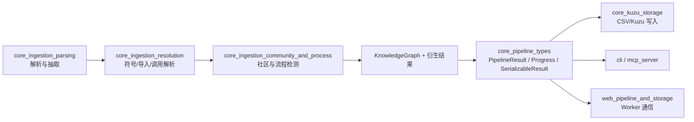
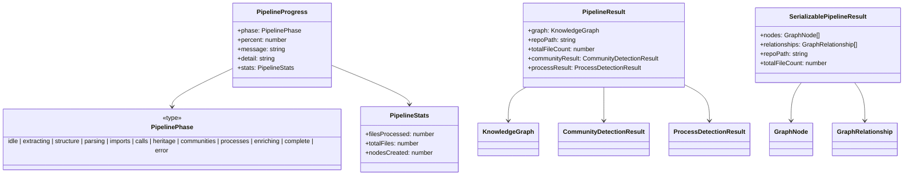
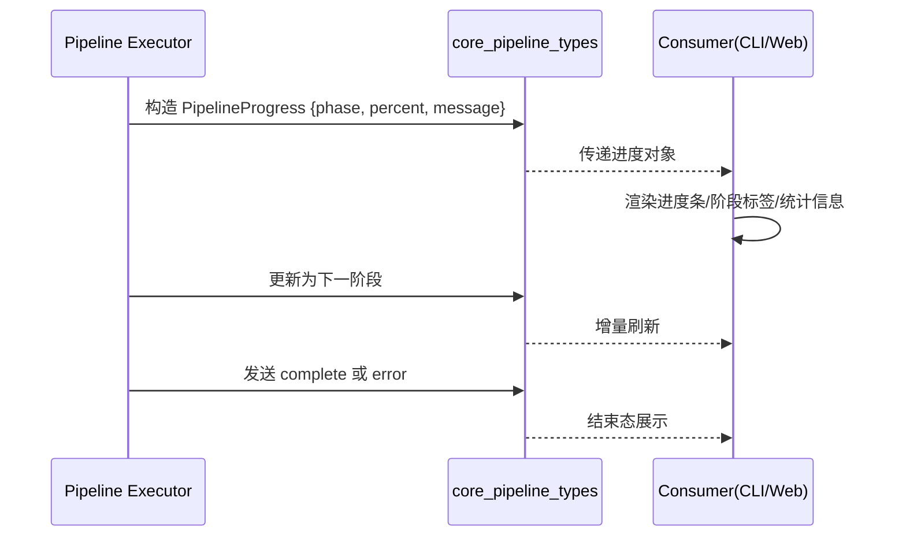
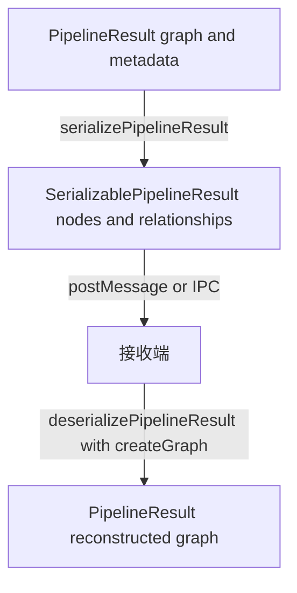

# core_pipeline_types

## 概述

`core_pipeline_types` 模块定义了分析流水线（pipeline）在**执行中**与**执行完成后**最核心的数据契约。它并不负责真正的代码扫描、解析、关系推断或图构建算法，而是把这些复杂流程产出的状态与结果，收敛成一组稳定、可传输、可恢复的 TypeScript 类型。

从系统设计角度看，这个模块存在的主要原因有两个。第一，流水线涉及多个阶段（例如 parsing、imports、calls、communities、processes 等），需要统一的进度模型用于 CLI、日志、Web UI 或 Worker 通信。第二，内部图结构 `KnowledgeGraph` 往往带有迭代器方法或实现细节，不能直接跨线程传输，因此需要一个“可序列化结果”作为边界模型，避免 Worker / 主线程之间出现结构化克隆失败。

换句话说，`core_pipeline_types` 是一个典型的“边界类型模块”：它连接了 `core_ingestion_*` 的计算结果与外部消费方（存储、展示、服务层），同时尽可能减少耦合，让上游处理逻辑和下游传输机制可以独立演进。

---

## 模块在整体架构中的位置



上图体现了该模块是“聚合输出层”而非“处理执行层”。`core_ingestion_parsing`、`core_ingestion_resolution`、`core_ingestion_community_and_process` 负责生成图与分析附加结果；`core_pipeline_types` 把这些结果包装成统一协议；再由 `core_kuzu_storage`、`cli`、`mcp_server` 或 Web 端模块消费。

如果你需要理解图对象本身的领域定义，请参考 [core_graph_types.md](core_graph_types.md)。如果你关心社区与流程检测的具体字段语义，请参考 [core_ingestion_community_and_process.md](core_ingestion_community_and_process.md)。Web 侧同构类型可参考 [pipeline_result_transport.md](pipeline_result_transport.md)。

---

## 核心类型一览与关系



这个关系图展示了三层抽象。

`PipelineProgress` 负责“过程可观测性”；`PipelineResult` 负责“内部完整结果”；`SerializablePipelineResult` 负责“跨线程传输版本”。它们共同构成“同一份流水线产物在不同生命周期阶段的视图”：运行中看进度，运行结束在内存中看完整对象，跨边界时看扁平可序列化版本。

---

## 详细组件说明

## `PipelinePhase`

`PipelinePhase` 是一个字符串字面量联合类型，用于表达流水线执行阶段：

- `idle`
- `extracting`
- `structure`
- `parsing`
- `imports`
- `calls`
- `heritage`
- `communities`
- `processes`
- `enriching`
- `complete`
- `error`

这些阶段不是任意状态，而是与摄取管线的典型顺序对应。`error` 是显式终态，表示本次流程失败；`complete` 表示成功完成。`structure`、`heritage`、`communities`、`processes` 等阶段使 UI 能展示更细粒度进展，而不是仅显示“解析中”。

在扩展时，新增 phase 需要谨慎：任何 `switch(phase)` 的消费端（CLI 进度条、前端状态机、日志聚合）都可能依赖完整枚举。

## `PipelineProgress`

`PipelineProgress` 是运行时进度快照，字段如下：

- `phase: PipelinePhase`：当前阶段。
- `percent: number`：0-100 的进度百分比（约定值，不强制线性）。
- `message: string`：面向用户的简短状态描述。
- `detail?: string`：可选细节，适合日志或调试 UI。
- `stats?: { filesProcessed, totalFiles, nodesCreated }`：可选统计信息。

设计上，`message` 与 `detail` 的分离很重要：前者给终端用户快速理解，后者给工程排障。`stats` 可选是为了兼容早期阶段（例如还没完成扫描时无法准确给出 `totalFiles`）或轻量执行模式。

### 进度事件数据流



这个流程强调：`PipelineProgress` 本身没有行为逻辑，它是“协议对象”。真正的节流、去重、重试策略应在执行器或上层消息通道中实现。

## `PipelineResult`

`PipelineResult` 是流水线内部完成态结果，字段如下：

- `graph: KnowledgeGraph`：核心知识图对象。
- `repoPath: string`：仓库根目录绝对路径；用于后续延迟读取文件内容（例如 Kuzu 导入阶段）。
- `totalFileCount: number`：扫描文件总数，通常用于统计和 UI 呈现。
- `communityResult?: CommunityDetectionResult`：可选社区检测结果。
- `processResult?: ProcessDetectionResult`：可选流程检测结果。

`PipelineResult` 的关键在于 `graph` 采用 `KnowledgeGraph` 接口，而不是简单数组。这样可以在内部利用 O(1) 查询、零拷贝迭代等能力（见 `iterNodes()/iterRelationships()` 语义），同时保持 API 面向接口，允许底层图实现替换。

`communityResult` 与 `processResult` 是可选字段，这说明社区/流程推断并不是所有运行模式的必选步骤。调用方在消费时必须做空值判断，不能假设一定存在。

## `SerializablePipelineResult`

`SerializablePipelineResult` 是专门为 `postMessage` / structured clone 设计的传输结构，字段如下：

- `nodes: GraphNode[]`
- `relationships: GraphRelationship[]`
- `repoPath: string`
- `totalFileCount: number`

它与 `PipelineResult` 的主要差异是：不携带 `KnowledgeGraph` 的行为方法，也不直接包含 `communityResult`/`processResult`。这是一个有意识的边界收缩策略，目标是保证传输稳定与兼容性。

如果后续确实需要跨线程传递社区/流程结果，建议通过版本化扩展字段（例如 `communityResult?`）而不是破坏现有消费端假设。

---

## 序列化与反序列化辅助函数

## `serializePipelineResult(result)`

该函数把 `PipelineResult` 转换为 `SerializablePipelineResult`。实现上通过：

1. 调用 `result.graph.iterNodes()` 与 `iterRelationships()`；
2. 使用展开运算符 `[...]` 物化为数组；
3. 复制 `repoPath` 与 `totalFileCount`。

这一步的副作用主要是内存开销：图越大，数组物化成本越高。因此在超大仓库场景下，序列化频率应受控，避免频繁全量复制。

## `deserializePipelineResult(serialized, createGraph)`

该函数将 `SerializablePipelineResult` 恢复为 `PipelineResult`：

1. 通过注入的 `createGraph()` 创建图实例；
2. 遍历 `serialized.nodes` 调用 `graph.addNode(node)`；
3. 遍历 `serialized.relationships` 调用 `graph.addRelationship(rel)`；
4. 返回 `{ graph, repoPath, totalFileCount }`。

这里采用“工厂函数注入（`createGraph`）”而不是硬编码构造器，是一个很好的解耦设计：类型层不依赖具体图实现类，调用方可以在 Node/Web 或测试环境注入不同实现。

需要注意：反序列化不会恢复 `communityResult` 与 `processResult`，因为传输类型里没有这两项。这是当前实现的明确行为，不是 bug。

### 结果转换流程



这个流程体现了“内部对象 → 传输对象 → 重建对象”的三段式生命周期。核心代价在于对象扁平化与重建，核心收益在于线程边界兼容性和实现解耦。

---

## 典型使用方式

```typescript
import {
  serializePipelineResult,
  deserializePipelineResult,
  PipelineProgress,
} from './types/pipeline.js';
import { createKnowledgeGraph } from './core/graph/graph.js';

function onProgress(p: PipelineProgress) {
  console.log(`[${p.phase}] ${p.percent}% - ${p.message}`);
}

// worker 内
const internalResult = await runPipeline({ onProgress });
const payload = serializePipelineResult(internalResult);
postMessage({ type: 'pipeline:done', payload });

// 主线程
onmessage = (event) => {
  if (event.data?.type === 'pipeline:done') {
    const restored = deserializePipelineResult(event.data.payload, createKnowledgeGraph);
    // restored.graph 可继续用于存储或查询
  }
};
```

这个模式把“计算侧”和“消费侧”分离得很清晰：Worker 专注处理，主线程专注展示/交互/后处理。

---

## 配置与扩展建议

`core_pipeline_types` 本身几乎没有运行时配置项，但有几个高价值扩展点。

首先是阶段扩展：如果新增分析步骤（例如 `security`、`test-coverage`），可以在 `PipelinePhase` 中追加字面量并同步更新消费者状态机。其次是可序列化结果扩展：如果你要在 Web 端直接展示社区或流程信息，可以在 `SerializablePipelineResult` 中新增可选字段，并确保旧客户端可忽略。最后是图创建策略：通过 `createGraph()` 注入可在不同环境切换图实现（内存优化版、调试版、带校验版）。

建议采用“向后兼容”策略演进类型：优先加可选字段，避免修改既有字段含义。

---

## 边界条件、错误与限制

在真实系统中，这个模块最常见的问题不在类型声明本身，而在“调用假设不一致”。

第一，`percent` 没有强制单调递增约束，若上游实现错误可能出现回退；UI 应考虑容错。第二，`deserializePipelineResult` 的 `addRelationship` 依赖节点存在性，如果输入数据顺序或完整性被破坏，底层图实现可能抛错或丢弃关系（取决于 `KnowledgeGraph` 实现）。第三，超大图序列化会带来明显内存峰值，尤其在浏览器 Worker 到主线程传输时。第四，`repoPath` 被注释说明为绝对路径语义，如果被传入相对路径，后续依赖该路径的懒加载逻辑可能失败。

此外，`PipelineResult` 中 `communityResult`、`processResult` 在反序列化后天然缺失，这意味着跨线程后若仍需要这些结果，必须设计独立通道或扩展传输结构。

---

## 与相关模块的文档关联

为了避免重复，这里只说明接口关系，不展开其内部算法：

- 图结构与节点/关系字段语义：见 [core_graph_types.md](core_graph_types.md)
- 社区检测与流程检测结果结构：见 [core_ingestion_community_and_process.md](core_ingestion_community_and_process.md)
- Web 端同构 pipeline 类型：见 [pipeline_result_transport.md](pipeline_result_transport.md)
- 图结果落盘到 Kuzu 的后续处理：见 [core_kuzu_storage.md](core_kuzu_storage.md)

通过这些文档可以形成从“数据生产（ingestion）→ 类型封装（pipeline types）→ 传输与存储（web/storage）”的完整认知链路。
