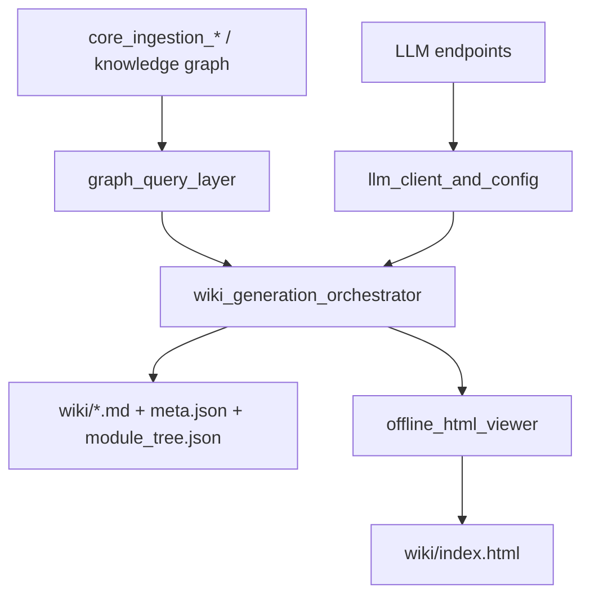
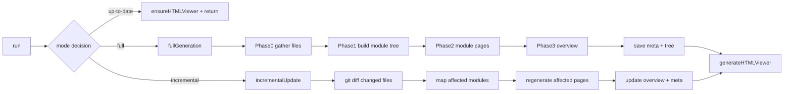
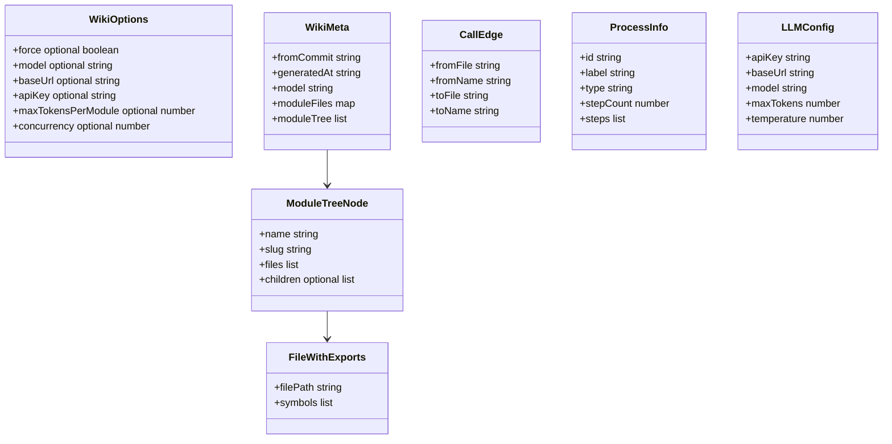
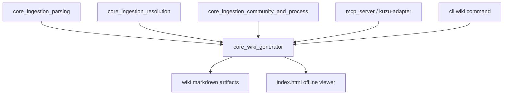

# core_wiki_generator 模块文档

## 1. 模块概述：它做什么、为什么存在

`core_wiki_generator` 是 GitNexus 后端中将“代码知识图”转换为“可阅读技术文档”的核心模块。它的职责不是做代码解析（那由 `core_ingestion_parsing` 和 `core_ingestion_resolution` 提供），也不是做图存储（那由 `core_kuzu_storage` 与 MCP Kuzu adapter 提供），而是把这些结构化资产组织成多页面 Wiki，并在最终生成可离线浏览的 HTML 视图。

从设计动机看，这个模块解决的是“文档生成工程化”问题，而不仅仅是“调用一次 LLM”。一个可用于真实仓库的 Wiki 生成器必须同时处理分组策略、上下文窗口限制、模块依赖顺序、并发速率控制、失败恢复、增量更新、产物分发等问题。`WikiGenerator` 将这些问题统一封装为单入口 `run()`，使 CLI 或服务层调用者能够以稳定 API 获得可追踪、可恢复、可增量的文档产出。

在系统中，它处于知识摄取之后的消费层：

- 从知识图读取文件、调用边、流程数据（依赖 [core_ingestion_parsing.md](core_ingestion_parsing.md)、[core_ingestion_resolution.md](core_ingestion_resolution.md)、[core_ingestion_community_and_process.md](core_ingestion_community_and_process.md) 的结果）；
- 使用 LLM 生成模块级与项目级描述（能力由 `llm-client` 子模块提供）；
- 输出 Markdown + 元数据 + HTML viewer，供 CLI、仓库维护者、审阅者直接使用。

---

## 2. 架构总览

### 2.1 分层架构图



这张图描述了 `core_wiki_generator` 的四个核心子域：编排器、图查询层、LLM 客户端和离线浏览器。它们之间是“编排器居中”的扇入扇出关系：查询层与模型层向编排器提供原料，编排器把结果写入文件系统，再交给 HTML Viewer 打包。这个结构让职责边界非常清晰：任何“内容质量问题”通常落在编排与 prompt/LLM 侧，任何“导航与渲染问题”通常落在 HTML Viewer 侧，任何“关系数据异常”则应回溯图查询与摄取链路。

### 2.2 运行时流程图（全量/增量）



这个流程体现两条关键设计原则。第一，生成模式决策基于 Git commit 与元数据快照，而不是时间戳或目录哈希，因此更符合版本控制语义。第二，无论是全量还是增量，只要内容发生变化，都会在结尾统一刷新 HTML viewer，保证 Markdown 与浏览器视图一致。

---

## 3. 核心组件详解

本模块的核心代码组件分布在四个文件中。下面先给出高层职责，再链接到各自详细文档。

### 3.1 `gitnexus/src/core/wiki/generator.ts`

核心组件：

- `ModuleTreeNode`
- `WikiGenerator`
- `WikiMeta`
- `WikiOptions`

这一子模块是整个 Wiki 生成管线的状态机与控制平面。`WikiGenerator` 负责 phase 划分、并发调度、容错与进度回调；`WikiMeta` 则把增量更新所需的版本状态持久化；`ModuleTreeNode` 描述模块树结构并决定页面生成顺序（先叶后父）；`WikiOptions` 提供运行参数入口。更深入的逐函数说明（包括 `runParallel` 的速率退让、`buildModuleTree` 的快照恢复、`incrementalUpdate` 的新文件阈值策略）请参见 [wiki_generation_orchestrator.md](wiki_generation_orchestrator.md)。

### 3.2 `gitnexus/src/core/wiki/graph-queries.ts`

核心组件：

- `ProcessInfo`
- `CallEdge`
- `FileWithExports`

这一子模块封装了 Wiki 场景需要的图查询语义：文件导出摘要、模块内外调用边、流程轨迹和总览边聚合。它对上层暴露语义化函数，而非原始 Cypher 细节，显著降低了编排层复杂度。该层内部包含若干实用折中（例如跨模块调用边 `LIMIT 30`、流程查询 N+1 模式），有助于控制 prompt 体积与运行成本。详见 [graph_query_layer.md](graph_query_layer.md)。

### 3.3 `gitnexus/src/core/wiki/llm-client.ts`

核心组件：

- `LLMResponse`
- `LLMConfig`
- `CallLLMOptions`

这一子模块提供 OpenAI-compatible 统一调用接口，兼容多种网关/供应商。它同时处理配置优先级解析（CLI 覆盖 > 环境变量 > 保存配置）、流式 SSE 读取、重试退避与基础错误分类。对于“如何切换模型与端点”“何时会自动重试”“流式为何没有 usage”等维护者常见问题，请参见 [llm_client_and_config.md](llm_client_and_config.md)。

### 3.4 `gitnexus/src/core/wiki/html-viewer.ts`

核心组件：

- `ModuleTreeNode`（viewer 侧同构结构）

这一子模块将 wiki 目录中的 Markdown、模块树、元数据打包成单文件 `index.html`，并内嵌客户端脚本实现导航、hash 路由、Markdown 渲染和 Mermaid 渲染。它是文档分发体验的关键，尤其适用于无需服务的离线场景。关于运行时渲染逻辑、CDN 依赖限制和安全注意点，见 [offline_html_viewer.md](offline_html_viewer.md)。

---

## 4. 关键数据结构与关系



在这些结构中，`ModuleTreeNode` 是连接生成阶段与展示阶段的“主轴对象”：它既决定文档生成顺序，也决定 HTML 导航结构。`WikiMeta` 则是增量能力的状态锚点，记录“模块-文件映射”与“上次 commit”；没有这个映射就无法高效定位受影响页面。

---

## 5. 端到端执行机制（内部工作原理）

### 5.1 阶段 0：结构采集与过滤

编排器先通过图查询拿到 `getAllFiles()` 与 `getFilesWithExports()`，然后应用 `shouldIgnorePath()` 过滤路径。这里的关键细节是：即便文件没有导出符号，也会被回填为 `symbols: []` 参与后续分组。这避免了“只有导出文件被文档化”的偏差，特别适用于脚本型或配置驱动项目。

### 5.2 阶段 1：模块树构建

模块树构建优先复用 `first_module_tree.json` 快照；不存在时才调用 LLM 分组。LLM 分组输出经过严格校验：

- 解析 JSON（支持 markdown fence）失败则 fallback 为按顶层目录分组；
- 非法路径或重复分配会被剔除；
- 未分配文件会自动归入 `Other`；
- 若模块 token 估算超预算且文件较多，会按子目录拆分为子模块。

这种“LLM 输出可用但不盲信”的策略是模块稳定性的核心来源之一。

### 5.3 阶段 2：模块页面生成

生成顺序采用“叶节点并发 + 父节点串行”。叶子模块使用源码 + 调用边 + 流程信息直接生成页面；父模块读取子页面摘要，再结合跨子模块调用关系生成聚合页。这样做既利用了并发提升吞吐，又保持了父页面依赖子页面语义的正确性。

并发执行由 `runParallel()` 控制，具备限流自适应：当捕捉到 `429` 错误时会临时降低并发并延时重试，从而减少整体失败率。

### 5.4 阶段 3：总览页生成

总览页会汇总各模块概要、模块间调用聚合边、全局流程 TopN 和项目基础信息（如 `package.json` 或 README 摘要）。它相当于项目级导航入口，也为离线 viewer 的默认页提供核心内容。

### 5.5 增量更新机制

增量模式以 `meta.fromCommit` 为基准执行 `git diff --name-only`。对于变更文件：

- 已存在于模块映射中 -> 标记对应模块重生成；
- 新文件且未忽略 -> 暂时并入 `Other`；
- 若新文件数量超过阈值（>5）-> 触发全量重分组，避免局部修补导致模块结构长期漂移。

这个策略在“精确增量”和“结构重整”之间做了工程折中。

---

## 6. 与其他模块的协作关系



`core_wiki_generator` 既依赖数据生产链路，也服务于使用者链路。上游方面，它要求知识图中已有 `File`、`CALLS`、`Process` 等实体关系；下游方面，它通常由 CLI（如 `wiki` 命令）触发，并产出供人类浏览的文档资产。

如果你在排查问题，可以按这一依赖顺序定位：

1. 查询结果为空/异常 -> 先看摄取与图构建模块；
2. 文本质量差/结构不稳 -> 看编排与 LLM 配置；
3. 页面渲染异常 -> 看 HTML viewer。

---

## 7. 使用与配置指南

### 7.1 基础调用示例

```ts
import { WikiGenerator } from 'gitnexus/src/core/wiki/generator';
import { resolveLLMConfig } from 'gitnexus/src/core/wiki/llm-client';

const llmConfig = await resolveLLMConfig({
  model: 'gpt-4o-mini',
  baseUrl: 'https://openrouter.ai/api/v1',
});

const generator = new WikiGenerator(
  '/path/to/repo',
  '/path/to/storage',
  '/path/to/kuzu',
  llmConfig,
  {
    force: false,
    maxTokensPerModule: 30000,
    concurrency: 3,
  },
  (phase, percent, detail) => {
    console.log(`[${phase}] ${percent}% ${detail ?? ''}`);
  }
);

const result = await generator.run();
console.log(result);
```

### 7.2 关键配置建议

- `maxTokensPerModule`：仓库代码量大时可适当下调以减少单次调用失败概率，但会增加截断概率。
- `concurrency`：受模型供应商限流策略影响较大。初始建议 2~4，若常见 429 可进一步降低。
- `force`：用于重新分组、重建页面；当仓库结构发生显著变化或 module tree 明显失真时应开启。

关于 LLM 配置优先级与环境变量细节，请参考 [llm_client_and_config.md](llm_client_and_config.md)。

---

## 8. 常见边界条件、错误与限制

### 8.1 前置数据缺失

如果知识图中没有可用源码文件，`fullGeneration()` 会直接抛错终止。这通常不是 Wiki 模块本身故障，而是摄取流程未成功或 ignore 规则过于激进。

### 8.2 LLM 输出不稳定

模块树构建依赖 LLM，但实现中已加多重防护（JSON 提取、合法性校验、fallback 分组）。即便如此，模块命名质量仍会受模型质量影响；在对模块命名一致性要求高的组织中，可考虑固定命名策略或增加后处理规范化层。

### 8.3 上下文预算与截断

源码超预算时采用字符级截断（近似 token）。这是实用但粗糙的策略：可能在语义边界中间截断，影响 LLM 理解完整性。若要进一步提高质量，可演进为“按文件/符号级摘要后再拼装”的分层上下文策略。

### 8.4 增量策略的折中

增量模式将少量新文件归入 `Other` 能快速收敛，但长期可能导致 `Other` 变大、结构可读性下降。当前通过“新文件超过阈值触发全量”缓解，但仍建议在版本里程碑时定期 `force` 全量重建。

### 8.5 HTML Viewer 的“伪离线”问题

`index.html` 虽然内嵌页面数据，但默认通过 CDN 加载 `marked` 与 `mermaid`。完全断网且无缓存时会影响渲染。若需要严格离线交付，需要扩展 viewer 为本地静态依赖。

---

## 9. 扩展与维护建议

如果你计划扩展 `core_wiki_generator`，建议优先遵循以下方向：

1. **保持契约稳定**：`WikiMeta`、`ModuleTreeNode`、`LLMConfig` 是跨子模块共享契约，变更应版本化。
2. **把复杂性留在边界层**：新增数据来源优先扩展 `graph-queries`，新增模型行为优先扩展 `llm-client`，尽量避免让 `WikiGenerator` 变成“大杂烩”。
3. **优先增强可观测性**：可增加每阶段耗时、重试次数、token 用量统计，帮助定位性能瓶颈与成本异常。
4. **逐步完善离线分发**：若要面向企业内网或审计归档，建议将 viewer 的 CDN 依赖替换为内嵌资源。

---

## 10. 子模块文档索引

以下子页面由模块拆分文档流程生成，并与本页保持一一对应，建议按“编排 → 查询 → LLM → 展示”顺序阅读：

- 编排与生成主链路： [wiki_generation_orchestrator.md](wiki_generation_orchestrator.md)（重点覆盖 `run()`、全量/增量流程、并发与失败恢复）
- 图查询与 Cypher 适配： [graph_query_layer.md](graph_query_layer.md)（重点覆盖查询语义、结果映射、边界条件与性能折中）
- LLM 调用与配置解析： [llm_client_and_config.md](llm_client_and_config.md)（重点覆盖配置优先级、SSE 流式读取、重试退避）
- 离线 HTML 浏览器生成： [offline_html_viewer.md](offline_html_viewer.md)（重点覆盖数据嵌入、前端导航渲染与 Mermaid 支持）

如需理解其上游数据来源与下游使用入口，可进一步阅读：

- [core_ingestion_parsing.md](core_ingestion_parsing.md)
- [core_ingestion_resolution.md](core_ingestion_resolution.md)
- [core_ingestion_community_and_process.md](core_ingestion_community_and_process.md)
- [cli.md](cli.md)（若存在）或项目 CLI 文档中的 wiki 子命令说明。
