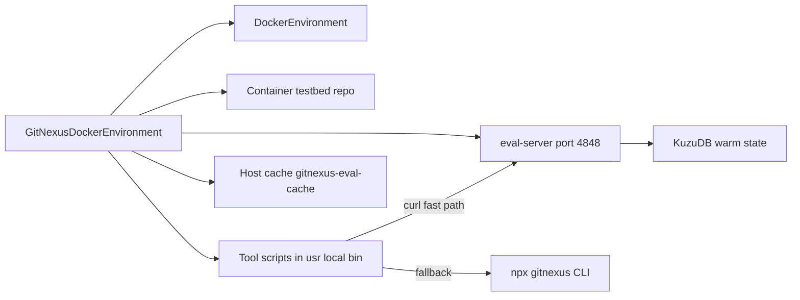
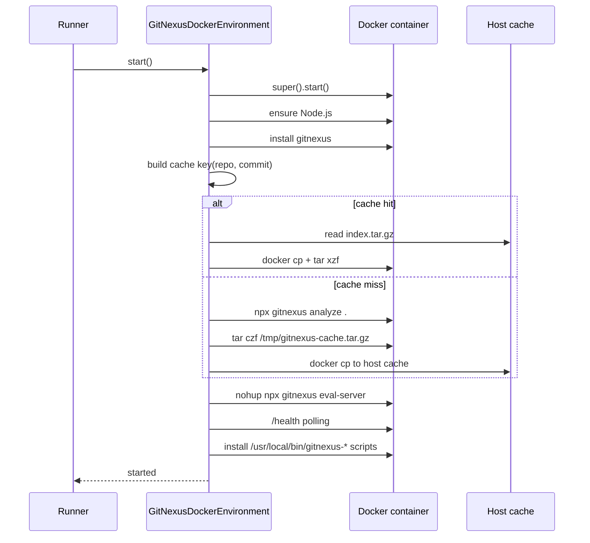
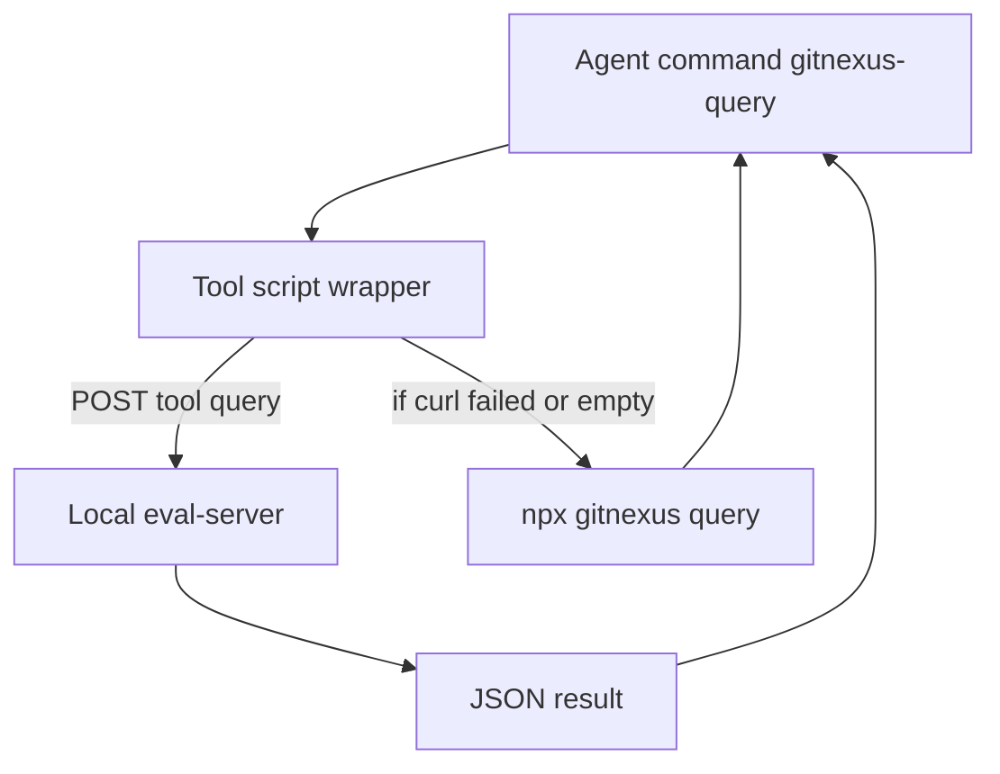
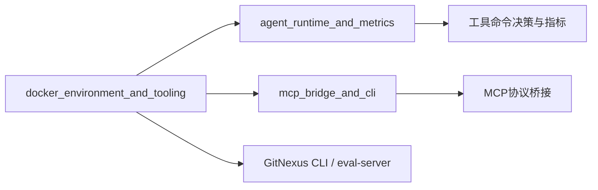

# docker_environment_and_tooling 模块文档

## 1. 模块定位与设计动机

`docker_environment_and_tooling` 对应实现文件 `eval/environments/gitnexus_docker.py`，核心组件是 `GitNexusDockerEnvironment`。这个模块的职责并不是“再实现一个 Docker 运行时”，而是在 `mini-swe-agent` 既有 `DockerEnvironment` 之上，补上一层与 GitNexus 深度集成的评测环境启动编排：在容器内安装 Node.js / `gitnexus`、预先完成 `gitnexus analyze` 索引、启动常驻 `eval-server`、并把一组可直接调用的工具脚本落到 `/usr/local/bin`。

它存在的根本原因是评测场景中的性能与可靠性矛盾。直接调用 `npx gitnexus <tool>` 的“冷启动路径”通常需要数秒，且每次命令都要经历进程初始化和数据库加载；而评测 Agent 往往会频繁查询上下文，工具调用延迟会显著放大总时长。该模块通过“启动时一次性准备 + 运行时走本地 HTTP 快路径”的方式，把查询级延迟降到百毫秒量级，并在服务不可用时自动回退 CLI，尽量保证任务不中断。

另一个关键动机来自 `mini-swe-agent` 的命令执行模型：每次 action 都通过 `subprocess.run` 在新的 subshell 中运行，不继承 `.bashrc` 与 shell 函数。也就是说，依赖环境变量注入或 shell function 的工具封装在这里并不稳定。`GitNexusDockerEnvironment` 采用“写入独立可执行脚本到 PATH”的方式，确保每次命令都可以被可靠解析和执行。

从 `eval_framework` 角度看，这个模块属于基础设施层，与 Agent 行为层（见 [agent_runtime_and_metrics.md](agent_runtime_and_metrics.md)）和 MCP 桥接层（见 [mcp_bridge_and_cli.md](mcp_bridge_and_cli.md)）互补：它不决定“何时调用工具”，而是保证“调用时工具可用且尽可能快”。

---

## 2. 架构总览

### 2.1 组件关系图



图中可以看到该模块同时维护三条能力链路：第一条是生命周期链路（继承 `DockerEnvironment`），第二条是工具调用链路（脚本 → eval-server → KuzuDB），第三条是索引缓存链路（容器内数据与宿主机 cache 同步）。这三条链路共同保障评测吞吐：启动成本尽量前置、调用路径尽量短、重复任务尽量复用。

### 2.2 启动流程时序



这个流程强调了“缓存优先”的设计。只要 `(repo, commit)` 命中缓存，就可以跳过昂贵的 analyze 阶段；未命中时才执行全量索引，并在完成后回写缓存，供后续评测复用。

### 2.3 工具请求数据流（快路径与回退）



这是一种“先服务、后 CLI”的双路径策略。它的好处不是绝对成功，而是在服务临时不可用时仍有结果可返回，避免 Agent 完全失去工具能力。

---

## 3. 核心组件：`GitNexusDockerEnvironment`

`GitNexusDockerEnvironment` 继承 `minisweagent.environments.docker.DockerEnvironment`，通过覆写 `start/stop/get_template_vars/serialize` 并新增一系列私有方法来实现 GitNexus 的安装、索引、服务化和缓存。其状态字段主要包括：

- `enable_gitnexus`：是否启用 GitNexus 集成。
- `cache_dir`：宿主机缓存目录，默认 `~/.gitnexus-eval-cache`。
- `skip_embeddings`：analyze 是否跳过 embedding 阶段。
- `gitnexus_timeout`：analyze 超时秒数。
- `eval_server_port`：eval-server 端口，默认 `4848`。
- `index_time`：本次 setup 总耗时。
- `_gitnexus_ready`：是否完成可用状态准备。

### 3.1 `__init__(...)`

构造函数在父类初始化后保存 GitNexus 相关配置，并将运行时指标初始化为安全默认值（`index_time=0.0`, `_gitnexus_ready=False`）。

参数语义如下：

- `enable_gitnexus: bool = True`：若为 `False`，容器仍可启动，但不会执行任何 GitNexus 准备步骤。
- `cache_dir: str | Path | None`：可覆盖缓存目录，便于 CI 多工作目录或隔离不同实验批次。
- `skip_embeddings: bool = True`：默认跳过 embedding，换取更快索引；适合多数 SWE-bench 修复任务。
- `gitnexus_timeout: int = 120`：`gitnexus analyze` 最长等待时间。
- `eval_server_port: int = 4848`：工具脚本和 server 的统一通信端口。

### 3.2 `start() -> dict`

`start` 先调用 `super().start()` 获取容器环境，再按开关执行 `_setup_gitnexus()`。如果 GitNexus 初始化任一步骤抛错，方法只记录 warning，不中断整体容器启动，并保持 `_gitnexus_ready=False`。

这个“失败降级而非失败中断”的策略对评测非常实用：它允许你拿到 baseline 结果，而不是因为工具链问题导致整条任务失败。

### 3.3 `_setup_gitnexus()`

这是串行编排入口，按固定顺序执行：

1. `_ensure_nodejs()`
2. `_install_gitnexus()`
3. `_index_repository()`
4. `_start_eval_server()`
5. `_install_tools()`

完成后记录 `index_time` 并把 `_gitnexus_ready` 置为 `True`。这里的顺序不能随意打乱，尤其是工具脚本安装放在 server 启动之后，确保端口值和服务可达策略一致。

### 3.4 `_ensure_nodejs()`

先执行 `node --version`。若缺失则在容器内运行 apt + NodeSource 安装链路（20.x），每步失败都会抛 `RuntimeError`。若已存在，仅记录版本日志。

该方法把 Node.js 作为硬依赖处理，因为后续 `npx gitnexus` 全部建立在 Node 可执行基础上。

### 3.5 `_install_gitnexus()`

通过 `npx gitnexus --version` 判断可用性，不可用时执行 `npm install -g gitnexus`。安装失败抛 `RuntimeError`。

这里采用 `npx` 作为探测入口而非直接 `gitnexus --version`，在某些环境下更兼容本地 npm 解析行为。

### 3.6 `_index_repository()`

该方法实现缓存优先的 analyze 流程。

首先调用 `_get_repo_info()` 获取 `repo` 和 `commit`，再用 `_make_cache_key()` 计算固定长度哈希键。如果 `cache_path` 已存在，则直接 `_restore_cache(cache_path)` 并返回。否则执行：

```bash
cd /testbed && npx gitnexus analyze . --skip-embeddings
```

是否带 `--skip-embeddings` 取决于 `skip_embeddings`。执行失败时，代码并非简单依赖 return code，而是结合输出文本做一次宽松判断：若输出包含 `error` 且不包含 `indexed` 才视为真正失败。这样做是为了兼容某些“部分警告但索引已生成”的场景。

成功后会调用 `_save_cache(cache_path, repo_info)` 将索引归档到宿主机。

### 3.7 `_start_eval_server()`

通过 `nohup npx gitnexus eval-server --port ... --idle-timeout 600` 后台启动服务，并将日志重定向到 `/tmp/gitnexus-eval-server.log`。随后最多轮询 15 秒（30 次，每次 0.5s）访问 `/health`。

如果健康检查成功，记录 ready 时间并返回；如果超时未就绪，不抛异常，只记录 warning 并输出最近日志。此时工具脚本仍会安装，只是运行时更可能走 CLI 回退路径。

### 3.8 `_install_tools()`

该方法把六个脚本写入 `/usr/local/bin` 并 `chmod +x`：

- `gitnexus-query`
- `gitnexus-context`
- `gitnexus-impact`
- `gitnexus-cypher`
- `gitnexus-augment`
- `gitnexus-overview`

脚本模板中的 `__PORT__` 会替换为当前 `eval_server_port`。写入时使用带引号 heredoc，避免变量展开和转义问题。每个脚本都遵循同一原则：先 `curl` 调 eval-server（快路径），失败后回退 `npx gitnexus ...`（慢路径）；`augment` 作为特例直接走 CLI 并 `|| true`。

### 3.9 `_get_repo_info() -> dict`

通过容器内 Git 信息提取仓库身份：

- `repo`：优先 `git remote get-url origin` 的 basename，失败回退当前目录名。
- `commit`：`git rev-parse HEAD`，失败回退 `unknown`。

返回格式为 `{"repo": str, "commit": str}`，用于缓存键计算与元数据写入。

### 3.10 `_make_cache_key(repo_info) -> str`

静态方法，拼接 `repo:commit` 后取 `sha256` 前 16 位，得到稳定短键。它的设计目标是可重复且冲突概率低，便于目录命名。

### 3.11 `_save_cache(cache_path, repo_info)`

该方法在宿主机创建缓存目录后，尝试在容器内定位 `/root/.gitnexus/**/kuzu` 目录，打包其父目录到 `/tmp/gitnexus-cache.tar.gz`，再用 `docker cp` 拷出到 `cache_path/index.tar.gz`，并写 `metadata.json`。

任何异常都会被捕获并记录 warning；若目录已创建但缓存失败，会清理残留目录，避免出现“看起来命中但内容损坏”的假缓存。

### 3.12 `_restore_cache(cache_path)`

恢复流程与保存互逆：先检查 `index.tar.gz`，不存在则 warning 并重新 `_index_repository()`。若存在则：

1. 确保容器内 `/root/.gitnexus` 存在。
2. 通过 `npx gitnexus list` 推断存储路径（失败回退 `/root/.gitnexus/repos/default`）。
3. `docker cp` 把 tarball 放入容器 `/tmp`。
4. 在推断路径中 `tar xzf` 解压。

恢复异常会触发 warning 并回退全量 analyze。

### 3.13 `stop() -> dict`

如果 `_gitnexus_ready=True`，先向 `eval-server /shutdown` 发送 POST（best-effort），再调用 `super().stop()` 停容器。即使 shutdown 请求失败也不会阻塞清理。

### 3.14 `get_template_vars() -> dict`

在父类模板变量基础上追加：

- `gitnexus_ready`
- `gitnexus_index_time`

这使 prompt 模板或上层运行器可感知工具环境是否就绪。

### 3.15 `serialize() -> dict`

在父类序列化结果 `info` 节点下挂载 `gitnexus_env`：

```json
{
  "enabled": true,
  "ready": true,
  "index_time_seconds": 12.34,
  "skip_embeddings": true,
  "eval_server_port": 4848
}
```

这部分数据常用于离线评测结果解释，例如区分“模型没用好工具”和“工具本身未就绪”。

---

## 4. 与其他模块的协作关系



在 `eval_framework` 中，本模块提供的是“运行基础设施能力”，并不直接管理 Agent 的思考与工具选择策略。Agent 层如果执行 `gitnexus-query` 一类命令，会直接受益于这里预装的脚本和常驻服务；如果走 MCP 调用链，则可与 [mcp_bridge_and_cli.md](mcp_bridge_and_cli.md) 形成并行方案。两者并不冲突，通常可以按实验需求选择其中一条或同时保留。

---

## 5. 典型使用方式

下面示例展示如何在评测脚本中启用该环境：

```python
from eval.environments.gitnexus_docker import GitNexusDockerEnvironment

env = GitNexusDockerEnvironment(
    image_name="swebench/base:latest",
    enable_gitnexus=True,
    cache_dir="/tmp/gitnexus-cache",
    skip_embeddings=True,
    gitnexus_timeout=180,
    eval_server_port=4848,
)

start_info = env.start()
print("started:", start_info)
print(env.get_template_vars())

# 运行期命令（由 agent 或手工）
# gitnexus-query "Where is auth middleware defined?"

result_meta = env.serialize()
print(result_meta.get("info", {}).get("gitnexus_env"))

env.stop()
```

如果你需要纯 baseline 容器而不希望 GitNexus 失败污染日志，可把 `enable_gitnexus=False`。这时该类行为基本退化为父类 `DockerEnvironment`。

---

## 6. 配置建议与调优策略

在大规模评测中，`cache_dir` 建议放到持久卷或 CI workspace 缓存目录，这样同一仓库重复运行能显著减少启动时间。`skip_embeddings=True` 通常是合理默认值，因为多数补丁任务更依赖结构化调用图与符号关系，而不是语义检索。

`gitnexus_timeout` 需要结合仓库规模设置。对于中大型 monorepo，120 秒可能偏紧；超时时间过短会导致频繁 analyze 失败并回退，反而拖慢总时长。`eval_server_port` 应避免与评测容器内其他服务冲突；如果你并行跑多个服务，建议显式分配端口。

---

## 7. 边界条件、错误处理与已知限制

该模块最重要的工程特征是“尽量不抛出致命错误”。`start()` 对 GitNexus 初始化异常采取 warning + 降级，`_start_eval_server()` 对未就绪采取 warning + CLI 回退，`stop()` 对 shutdown 失败采取忽略。优点是鲁棒，缺点是如果你只看进程退出码，可能忽略工具处于降级状态这一事实，因此应结合 `serialize().info.gitnexus_env.ready` 和日志一起判断实验有效性。

缓存机制基于 `(repo, commit)`，因此只要 commit 不变，缓存会被复用。若你的分析结果还受 `gitnexus` 版本、配置或环境差异影响，现有键设计可能过于粗粒度，存在“命中旧缓存但语义已变”的风险。严格可复现的场景建议把版本信息纳入 cache key（可通过扩展 `_make_cache_key` 实现）。

`_save_cache/_restore_cache` 依赖宿主机可执行 `docker cp` 且类实例能拿到 `container_id`。在某些受限执行器（例如 rootless 或远程 Docker API 封装环境）中，这条路径可能失败并自动回退 analyze。模块已做异常兜底，但性能收益会消失。

工具脚本中的 JSON 参数拼接采用简单字符串拼接，对包含双引号、换行或复杂 shell 字符的输入并不完全安全，极端情况下会导致请求体格式问题。评测常规查询通常不触发，但如果你计划把这些脚本暴露给不受控输入，建议升级为 `jq -n` 或更严格的 JSON escaping 方案。

---

## 8. 扩展与二次开发建议

如果你要新增工具脚本（例如 `gitnexus-trace`），推荐沿用现有模板：在 Python 中定义 `TOOL_SCRIPT_*` 常量，加入 `_install_tools()` 映射表，并保持“HTTP 快路径 + CLI 回退”一致。这样不会破坏 agent 端已有命令习惯。

如果你希望提升缓存可靠性，可以在 `_save_cache` 增加完整性校验（如 tarball hash）并在 `_restore_cache` 验证后再解压，同时把 `metadata.json` 扩展为包含 `gitnexus --version`、`skip_embeddings` 等字段，降低脏缓存概率。

如果你的评测更依赖在线语义检索，可把 `skip_embeddings=False`，但应同步提高 `gitnexus_timeout` 并评估镜像体积和启动时间成本。

---

## 9. 参考阅读

- Agent 运行模式、增强策略与指标字段： [agent_runtime_and_metrics.md](agent_runtime_and_metrics.md)
- MCP 工具桥接与 JSON-RPC 交互： [mcp_bridge_and_cli.md](mcp_bridge_and_cli.md)
- （若需理解 GitNexus 主系统）可进一步查阅 `core_ingestion_*`、`mcp_server`、`core_kuzu_storage` 等模块文档。
