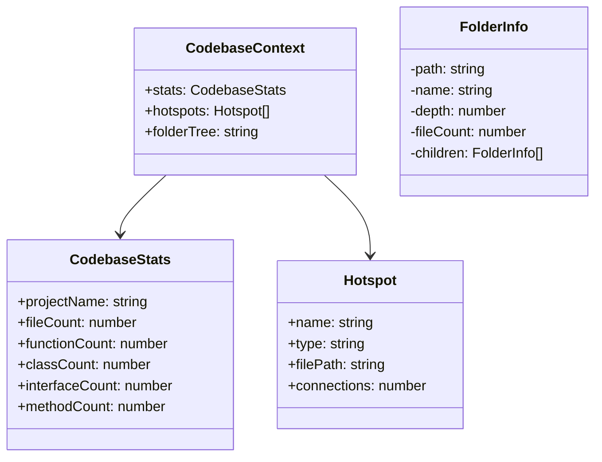
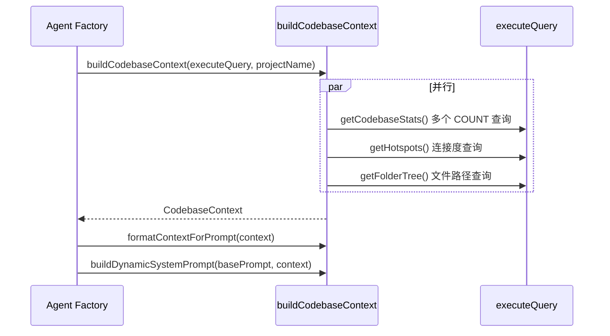
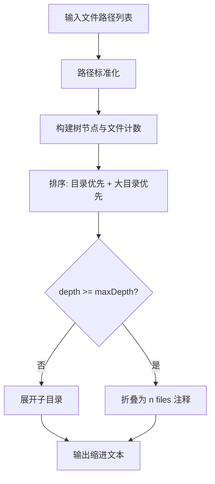

# dynamic_context_builder

## 模块简介

`dynamic_context_builder` 模块位于 `gitnexus-web/src/core/llm/context-builder.ts`，它的核心目标是为 Graph RAG Agent 在运行前构建一段“动态、当前仓库感知”的上下文文本，并将其注入系统提示词。这个模块解决的问题很实际：如果模型每次对话都从零理解代码库，前几轮会浪费大量 token 在“摸清项目结构”上；而如果提前提供项目规模、关键热点和目录结构，模型在第一轮就能更快进入有效分析。

从设计上看，这个模块刻意保持“轻量统计 + 可读结构化摘要”的策略，而不是做完整语义建模。它只依赖一个通用查询回调 `executeQuery(cypher)`，不绑定具体数据库实现，因此可以在不同执行环境中复用。它的输出 `CodebaseContext` 被 `agent_factory_and_streaming` 组合进系统提示词（见 [agent_factory_and_streaming.md](agent_factory_and_streaming.md)），并与 LLM provider 类型体系（见 [llm_provider_and_message_types.md](llm_provider_and_message_types.md)）共同完成“可配置模型 + 可感知代码库”的会话初始化。

---

## 在系统中的定位与依赖关系


这个关系说明了该模块是一个“上下文预处理层”：它不直接调用 LLM，也不负责工具执行，而是在 Agent 创建时提供高价值环境信息。模块本身和图数据结构定义（如 `graph_domain_types` / `core_graph_types`）是解耦的，仅通过 Cypher 查询结果进行交互。

---

## 核心数据模型



`CodebaseContext` 是最终对外契约，由三部分组成：`stats`（规模统计）、`hotspots`（高连接节点）、`folderTree`（目录结构字符串）。其中 `FolderInfo` 在当前版本是内部接口且未实际参与最终算法，反映出模块经历过实现演进：从“显式树结构对象”转向“直接生成 token 更友好的文本树”。

---

## 查询与构建流程



`buildCodebaseContext` 使用 `Promise.all` 并发执行三个子任务，这是一个重要设计点：这些查询互不依赖，并行可显著降低启动时延。与此同时，每个子函数都做了局部容错，保证某个查询失败不会阻断整个上下文生成。

---

## 核心组件详解

## `CodebaseStats`

`CodebaseStats` 描述代码库规模信息，字段包含项目名和五类节点计数。它的价值在于给模型一个“工作量刻度”，例如当 `fileCount` 与 `functionCount` 很大时，模型更倾向先缩小范围再深挖。

当前统计项固定为 `File/Function/Class/Interface/Method`。这意味着如果图中还有其他节点类型（例如 Process、API、Test），不会在这一摘要中出现；这是刻意简化而非遗漏。

## `Hotspot`

`Hotspot` 表示“连接关系最密集”的节点，字段包括名称、类型、文件路径和边数。它用于让模型快速定位高影响区域，适合回答“核心模块在哪”“改动风险点有哪些”这类问题。

需要注意：热点基于 `CodeRelation` 边数量，属于图结构启发式，不是运行时真实热度，也不是 git 历史热度。

## `FolderInfo`（内部接口）

`FolderInfo` 定义了标准树节点结构，但在当前代码中未被导出或使用。它更像是“可读性占位 + 潜在后续扩展”。如果未来要提供 JSON 目录树给 UI 而非纯字符串，可复用该结构。

## `CodebaseContext`

`CodebaseContext` 是模块对外最关键的聚合类型：

- `stats` 提供规模轮廓
- `hotspots` 提供关注优先级
- `folderTree` 提供路径空间感

这个组合兼顾“信息密度”和“token 成本”，比直接塞入大量文件内容更经济。

---

## 接口签名速览

为便于维护者在阅读细节前快速建立心智模型，这里先给出公开接口与职责映射。该模块公开的核心能力可以分为三层：数据提取层（`getCodebaseStats` / `getHotspots` / `getFolderTree`）、聚合层（`buildCodebaseContext`）和提示词组装层（`formatContextForPrompt` / `buildDynamicSystemPrompt`）。这种分层使调用方可以按需复用：既可以一步到位，也可以在中间层插入自定义过滤或裁剪逻辑。

| API | 输入 | 输出 | 主要用途 |
|---|---|---|---|
| `getCodebaseStats` | `executeQuery`, `projectName` | `CodebaseStats` | 获取代码规模摘要 |
| `getHotspots` | `executeQuery`, `limit?` | `Hotspot[]` | 获取图连接热点 |
| `getFolderTree` | `executeQuery`, `maxDepth?` | `string` | 生成目录结构文本 |
| `buildCodebaseContext` | `executeQuery`, `projectName` | `CodebaseContext` | 并发聚合完整上下文 |
| `formatContextForPrompt` | `CodebaseContext` | `string` | 转换为 Markdown 片段 |
| `buildDynamicSystemPrompt` | `basePrompt`, `CodebaseContext` | `string` | 产出最终系统提示词 |

---

## 函数级行为说明

## `getCodebaseStats(executeQuery, projectName): Promise<CodebaseStats>`

该函数按节点标签逐一执行 COUNT 查询，最终返回统计对象。实现中有两层容错：

1. 单个统计查询失败时，将该项置 0，不影响其他项。
2. 整体流程异常时，返回全 0 的兜底对象。

它还兼容两种结果形态：

- 行对象：`{ count: number }`
- 行数组：`[count]`

这种兼容性说明 `executeQuery` 可能来自不同数据库适配器或序列化层。

**副作用**：失败时会 `console.error` 打印错误。

## `getHotspots(executeQuery, limit = 8): Promise<Hotspot[]>`

该函数执行一条聚合查询：匹配 `CodeRelation` 双向边、按节点统计连接数、降序取前 `limit`，返回热点列表。输出阶段同样兼容“数组行/对象行”两种格式，并过滤掉缺失 `name/type` 的脏数据。

实现细节上，查询直接插入 `LIMIT ${limit}`，因此调用方应保证 `limit` 来自受控值（当前默认值安全）。

**副作用**：异常时打印日志并返回空数组。

## `getFolderTree(executeQuery, maxDepth = 10): Promise<string>`

该函数先读取所有 `File.filePath`，然后调用 `formatAsHybridAscii` 生成缩进树文本。若无路径则返回空字符串。

和传统 ASCII box 绘制相比，这里使用“纯缩进 + 目录注释”的混合风格，更节省 token，且在 LLM 输出窗口中可读性更稳定。

## `formatAsHybridAscii(paths, maxDepth): string`（内部）

这是目录树生成的主算法：

1. 标准化路径分隔符（`\\` -> `/`）
2. 构建 `TreeNode` 树（目录与文件）
3. 统计目录累计文件数
4. 按规则排序并渲染文本

排序规则不是简单字母序，而是“目录优先，目录按 `fileCount` 降序，文件按名称升序”。这让大目录更靠前，有助于模型优先看到信息量更高的区域。

`maxDepth` 触发后目录会折叠成 `name/ (N files)`，避免深层结构造成上下文膨胀。

## `buildTreeFromPaths(...)` / `formatTreeAsAscii(...)` / `countItems(...)`（内部未使用）

这三者提供了另一套“带框线字符的 ASCII 树”方案，目前未被调用，属于遗留/备用实现。它们的存在提示维护者：模块过去尝试过不同树展示策略，当前版本选择了更 token-efficient 的混合缩进法。

如果计划清理技术债，可考虑：

- 删除未使用函数以减少维护噪音；或
- 在配置中引入 `treeFormat`，正式支持两种渲染模式。

## `buildCodebaseContext(executeQuery, projectName): Promise<CodebaseContext>`

这是对外主入口，负责并发调度 `stats/hotspots/folderTree` 并组合结果。函数本身不做额外异常捕获，依赖子函数各自兜底，因此通常能稳定返回结构完整的对象。

## `formatContextForPrompt(context): string`

该函数将 `CodebaseContext` 格式化为 Markdown 文本，结构为：

1. 代码库标题与统计行
2. Hotspots 列表（最多展示 5 个）
3. `STRUCTURE` 代码块（项目名 + 树文本）

它会跳过值为空的部分（例如没有热点、没有目录树），以降低无效 token 占用。

## `buildDynamicSystemPrompt(basePrompt, context): string`

该函数将格式化后的上下文追加到 `basePrompt` 末尾，并加分隔线与标题。设计意图很明确：保持核心行为指令在提示词顶部，避免被动态上下文“挤下去”影响遵循度。

---

## 目录树渲染策略说明



这种策略本质上是在“完整性”和“上下文预算”之间做折中。它并不追求逐文件展示所有细节，而是优先暴露层级骨架与高密度区域，符合 RAG 场景“先定位、后深读”的交互逻辑。

---

## 使用方式与示例

### 1）构建并注入动态上下文

```ts
import {
  buildCodebaseContext,
  buildDynamicSystemPrompt,
} from "gitnexus-web/src/core/llm/context-builder";

const context = await buildCodebaseContext(executeQuery, "my-repo");
const systemPrompt = buildDynamicSystemPrompt(BASE_SYSTEM_PROMPT, context);
```

### 2）仅调试上下文文本

```ts
import {
  buildCodebaseContext,
  formatContextForPrompt,
} from "gitnexus-web/src/core/llm/context-builder";

const ctx = await buildCodebaseContext(executeQuery, "demo-project");
console.log(formatContextForPrompt(ctx));
```

### 3）自定义热点数量与目录深度（按子函数组合）

```ts
const [stats, hotspots, folderTree] = await Promise.all([
  getCodebaseStats(executeQuery, "repo"),
  getHotspots(executeQuery, 12),
  getFolderTree(executeQuery, 6),
]);
```

---

## 可配置项与行为影响

虽然模块没有统一 `options` 对象，但实际有几个关键“隐式配置位”：

- `projectName`：直接影响提示词标题显示。
- `getHotspots(limit)`：决定热点覆盖面，值越大 token 消耗越高。
- `getFolderTree(maxDepth)`：决定目录展开程度，过大会导致提示词冗长。
- `formatContextForPrompt` 中热点展示上限固定为 5（即使查询了更多）。

在大仓库场景中，建议优先调小 `maxDepth`，其次再控制热点数。

---

## 边界条件、错误处理与已知限制

### 查询返回格式差异

模块大量处理 `any[]`，并兼容“数组行/对象行”。这提高了适配性，但也意味着编译期类型保护较弱；若后端返回字段名变化（如 `count` 改为 `cnt`），会静默变成 0。

### Cypher 方言差异

`getHotspots` 中使用了 `LABEL(n)`。不同图数据库/适配层可能使用 `labels(n)` 或其他写法。如果底层方言不兼容，该函数会走异常兜底并返回空列表。

### 性能与上下文长度

- `getFolderTree` 会拉取全部文件路径，超大仓库可能有内存与序列化开销。
- 树文本再加热点与统计后，会直接进入 system prompt，可能挤占上下文窗口。

### 安全与输入约束

`getHotspots` 通过模板字符串插入 `limit`，虽当前默认与常规调用安全，但若未来来自用户输入，需做整数化和上限约束。

### 未使用代码

`FolderInfo`、`buildTreeFromPaths`、`formatTreeAsAscii`、`countItems` 当前未参与主流程。它们不会影响功能，但会增加阅读负担。

---

## 扩展建议

如果要增强该模块，建议沿以下方向演进：

1. 增加统一 `ContextBuilderOptions`，集中管理 `hotspotLimit/maxDepth` 与渲染风格。
2. 为 `executeQuery` 结果定义类型适配层，减少 `any` 与隐式字段依赖。
3. 在 `CodebaseContext` 中加入可选 `entryPoints`（可参考 `process_detection_and_entry_scoring` 或后端同类模块），但需控制 token 成本。
4. 提供“摘要级别”策略（brief/standard/detailed），让不同模型上下文窗口按需选择。

---

## 与其他文档的关系

- Provider 配置、消息流类型：见 [llm_provider_and_message_types.md](llm_provider_and_message_types.md)
- Agent 构建与流式编排：见 [agent_factory_and_streaming.md](agent_factory_and_streaming.md)
- 图模型基础类型：见 [graph_domain_types.md](graph_domain_types.md)

本文件聚焦“动态上下文构造与提示词注入”，不重复上述模块的通用内容。
