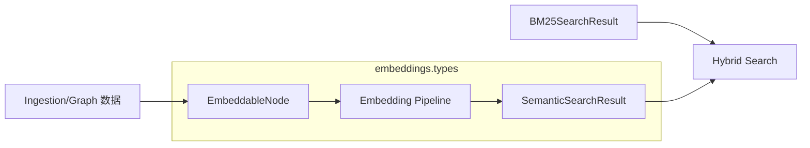
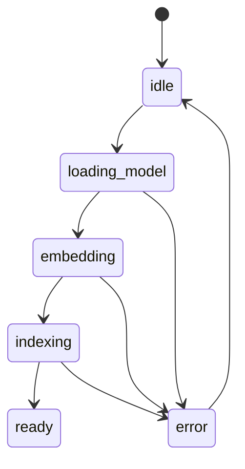
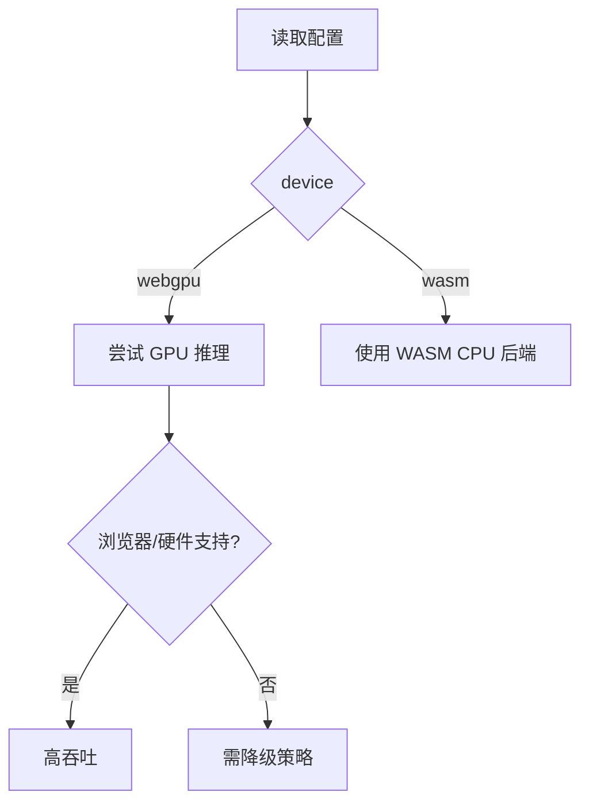
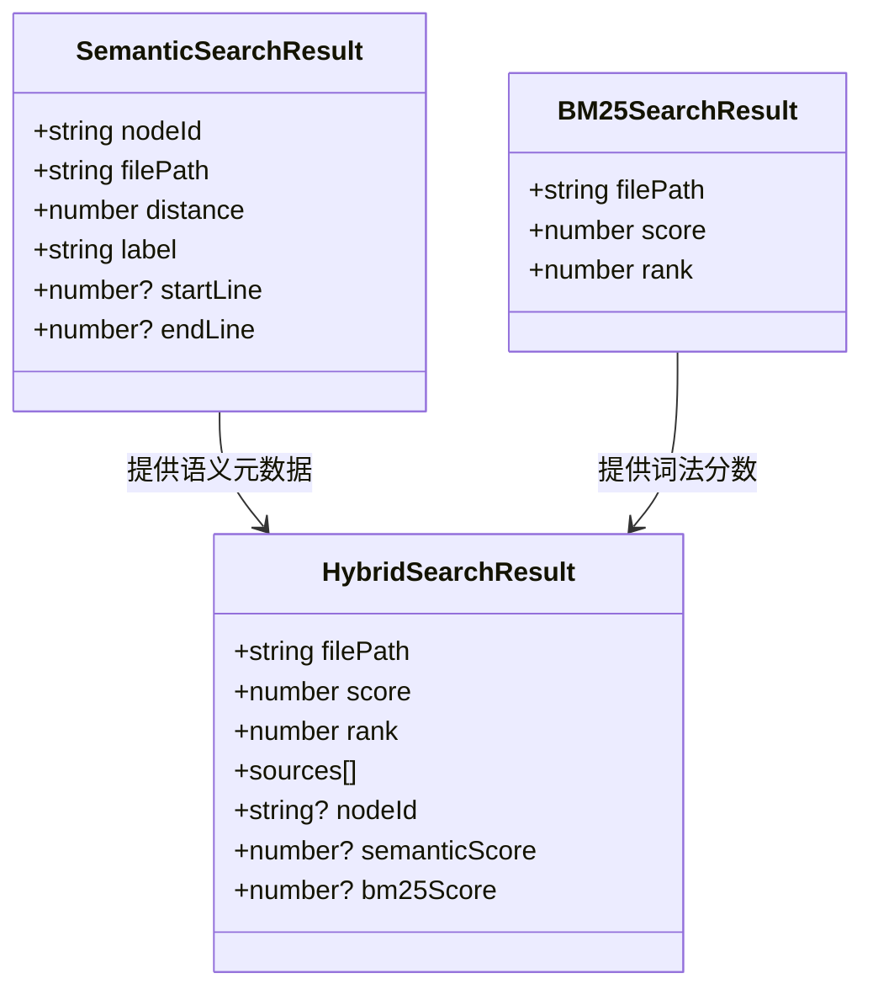
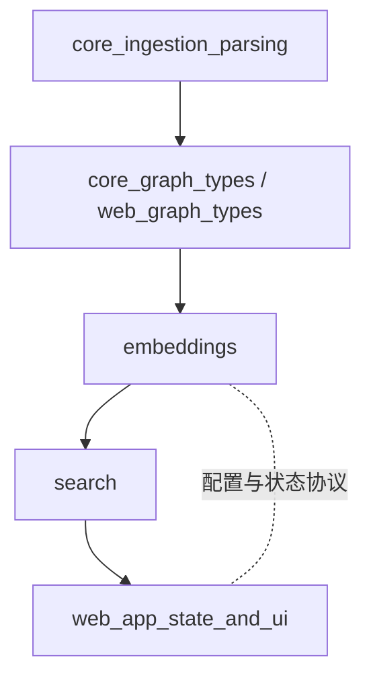

# embeddings 模块文档

## 模块简介与设计动机

`embeddings` 模块负责定义 GitNexus 在前端（`gitnexus-web`）进行语义检索时所依赖的核心类型协议。它本身不直接实现模型推理、向量索引或检索算法，而是提供一组稳定的数据契约（type contract），把“代码图节点”“嵌入生成过程”“查询结果”“进度反馈”统一起来，让上层流程（例如 `web_embeddings_and_search`）和 UI 层能够可靠协作。

这个模块存在的根本原因是：代码检索不能只靠关键词。开发者输入“解析配置文件并校验字段”时，目标函数可能叫 `loadConfig`、`validateSchema` 或 `bootstrapOptions`，在字面上和查询词并不完全重合。语义嵌入通过将代码片段映射到向量空间，允许系统根据语义邻近性而非纯文本匹配来找结果，从而补足 BM25 等词法检索能力。

在系统分层上，它位于“搜索能力”的协议层：向下承接代码图抽取出来的节点信息，向上服务语义搜索与混合搜索结果组装。你可以把它理解为“语义检索的公共数据语言”。



上图体现了模块定位：`embeddings.types` 不负责“怎么算”，而负责“算什么、以什么结构传递、阶段怎么表达”。这种解耦使你可以替换具体模型或向量库，而不破坏调用方的类型依赖。

---

## 核心导出与职责总览

`gitnexus-web/src/core/embeddings/types.ts` 主要导出以下内容：

- 常量与类型守卫：`EMBEDDABLE_LABELS`、`EmbeddableLabel`、`isEmbeddableLabel`
- 生命周期状态：`EmbeddingPhase`、`EmbeddingProgress`、`ModelProgress`
- 配置契约：`EmbeddingConfig`、`DEFAULT_EMBEDDING_CONFIG`
- 输入/输出数据模型：`EmbeddableNode`、`SemanticSearchResult`

这些定义共同覆盖了语义检索流程中的三个问题：

1. **什么节点值得嵌入**（可嵌入范围控制）
2. **嵌入任务进行到哪一步**（状态与进度可观测性）
3. **如何配置与消费结果**（配置稳定性与结果可解释性）

---

## 组件详解

### 1) `EMBEDDABLE_LABELS`、`EmbeddableLabel`、`isEmbeddableLabel`

`EMBEDDABLE_LABELS` 定义可参与语义嵌入的节点标签集合：

- `Function`
- `Class`
- `Method`
- `Interface`
- `File`

`EmbeddableLabel` 是由该常量数组推导出的联合类型，保证类型系统层面的收敛；`isEmbeddableLabel` 是运行时类型守卫，用于在处理原始图数据时做过滤和窄化。

```typescript
export const isEmbeddableLabel = (label: string): label is EmbeddableLabel =>
  EMBEDDABLE_LABELS.includes(label as EmbeddableLabel);
```

设计 rationale 很直接：这些节点类型通常语义密度较高、可读上下文充足，对自然语言查询最友好。比如变量、字面量、局部表达式即使可索引，往往会制造高噪声低价值结果。

**副作用与约束**：

- 新增标签（例如 `Enum`）时，需要同步评估召回质量和噪声比。
- 如果上游图标签命名不一致（如 `function` 小写），`isEmbeddableLabel` 会返回 `false`，导致节点被排除。

---

### 2) `EmbeddingPhase` 与 `EmbeddingProgress`

`EmbeddingPhase` 是嵌入流水线的离散阶段：

- `idle`
- `loading-model`
- `embedding`
- `indexing`
- `ready`
- `error`

`EmbeddingProgress` 则是阶段化状态的结构化载体：

- `phase`: 当前阶段
- `percent`: 总进度（0~100 语义）
- `modelDownloadPercent?`: 模型下载子进度
- `nodesProcessed?` / `totalNodes?`: 节点处理数量
- `currentBatch?` / `totalBatches?`: 批次级进度
- `error?`: 错误描述

这个类型的价值在于它把“长耗时、可中断、可失败”的过程变成可观测事件流，使 UI 能做细粒度反馈，而不是只有“开始/完成”二元状态。



需要注意：`percent` 是统一进度，不保证与各子阶段线性对应。调用方应把它视作“用户体验进度”，而非严格计算进度。

---

### 3) `EmbeddingConfig` 与 `DEFAULT_EMBEDDING_CONFIG`

`EmbeddingConfig` 定义嵌入任务配置：

- `modelId`: transformers.js 模型 ID
- `batchSize`: 每批节点数
- `dimensions`: 向量维度
- `device`: `'webgpu' | 'wasm'`
- `maxSnippetLength`: 代码片段最大字符数

默认配置：

```typescript
export const DEFAULT_EMBEDDING_CONFIG: EmbeddingConfig = {
  modelId: 'Snowflake/snowflake-arctic-embed-xs',
  batchSize: 16,
  dimensions: 384,
  device: 'webgpu',
  maxSnippetLength: 500,
};
```

该默认值体现了浏览器场景的平衡策略：轻量模型 + 中等 batch + 受控 snippet 长度 + 首选 WebGPU。



**关键约束**：

1. `dimensions` 必须与模型真实输出维度一致，否则后续索引或相似度计算会失败。
2. `batchSize` 过大可能在浏览器触发内存压力，尤其在大仓库和弱设备上。
3. `maxSnippetLength` 太小会丢失语义，太大会稀释重点并拖慢处理。

---

### 4) `EmbeddableNode`

`EmbeddableNode` 是嵌入输入的最小结构：

- `id`: 节点唯一标识
- `name`: 节点名称
- `label`: 节点类型
- `filePath`: 文件路径
- `content`: 待向量化文本
- `startLine?` / `endLine?`: 可选行号

它通常来源于图数据库查询结果或图内存结构映射。`content` 是质量关键字段：如果只是截断后的噪声文本，语义检索质量会显著下降。

建议的构造策略是“结构化拼接 + 长度裁剪”，例如把签名、注释、主体片段合成单段文本，再统一截断。

---

### 5) `ModelProgress`

`ModelProgress` 描述 transformers.js 模型文件加载过程：

- `status`: `initiate | download | progress | done | ready`
- `file?`: 当前文件名
- `progress?`: 文件级进度（通常百分比）
- `loaded?` / `total?`: 字节维度进度

它与 `EmbeddingProgress` 的关系是“底层加载事件 -> 上层任务状态聚合”。前者偏模型下载细节，后者偏业务流程阶段。

---

### 6) `SemanticSearchResult`

`SemanticSearchResult` 是语义搜索返回项：

- `nodeId`
- `name`
- `label`
- `filePath`
- `distance`
- `startLine?` / `endLine?`

`distance` 通常表示向量距离（数值越小越相近，取决于实现）。调用方不应跨模型版本直接复用旧阈值，因为分布可能变化。

---

## 与 search 子模块的协作关系

在 `core_embeddings_and_search` / `web_embeddings_and_search` 下，语义搜索通常与 BM25 一起做混合召回。对接类型关系大致如下：



在混合检索场景中，`SemanticSearchResult` 通常贡献“语义匹配能力与代码定位信息”，`BM25SearchResult` 贡献“关键词可解释性与精确术语匹配”，最终由 `HybridSearchResult` 融合排序。详细融合策略见 [search.md](search.md) 与 [web_embeddings_and_search.md](web_embeddings_and_search.md)。

---

## 典型使用模式

### 1. 节点过滤与映射

```typescript
import {
  isEmbeddableLabel,
  type EmbeddableNode,
  DEFAULT_EMBEDDING_CONFIG,
} from '@/core/embeddings/types';

function toEmbeddableNode(raw: any): EmbeddableNode | null {
  if (!isEmbeddableLabel(raw.label)) return null;

  return {
    id: raw.id,
    name: raw.name,
    label: raw.label,
    filePath: raw.filePath,
    content: String(raw.content ?? '').slice(0, DEFAULT_EMBEDDING_CONFIG.maxSnippetLength),
    startLine: raw.startLine,
    endLine: raw.endLine,
  };
}
```

这个阶段的关键是统一输入质量：标签规范化、内容非空、长度受控。

### 2. 进度驱动 UI

```typescript
import type { EmbeddingProgress } from '@/core/embeddings/types';

function renderProgress(p: EmbeddingProgress) {
  if (p.phase === 'error') {
    return `Embedding failed: ${p.error ?? 'unknown error'}`;
  }
  if (p.phase === 'loading-model') {
    return `Downloading model... ${p.modelDownloadPercent ?? 0}%`;
  }
  return `${p.phase}: ${p.percent.toFixed(1)}%`;
}
```

通过 `phase + percent + 可选细节字段`，前端可以避免“黑盒等待”。

### 3. 配置覆盖

```typescript
import {
  DEFAULT_EMBEDDING_CONFIG,
  type EmbeddingConfig,
} from '@/core/embeddings/types';

const config: EmbeddingConfig = {
  ...DEFAULT_EMBEDDING_CONFIG,
  batchSize: 8,          // 低内存设备降批次
  device: 'wasm',        // 明确禁用 WebGPU
  maxSnippetLength: 700, // 提升长函数语义保留
};
```

---

## 扩展与二次开发建议

如果你要扩展此模块，最常见的方向有三类。第一类是扩展可嵌入标签，这要求你同时改动图节点生成、过滤逻辑和评测基线，确保新增类型确实提升而非污染召回。第二类是替换模型，这会牵涉 `modelId`、`dimensions`、索引重建和阈值重标定，不能只改一个字段。第三类是增强进度语义，例如加入“缓存命中”“索引持久化”等状态，这可以沿着 `EmbeddingPhase` 和 `EmbeddingProgress` 演进，但要保证向后兼容。

建议把“类型扩展”与“执行引擎实现”分离提交：先稳定协议，再迭代算子，避免一处改动引起 UI、存储、检索多处连锁故障。

---

## 边界情况、错误条件与已知限制

本模块是类型层，不包含执行逻辑，因此很多限制来自“实现方必须遵守但类型无法强制”的隐式规则。

首先，`EmbeddingConfig.dimensions` 与模型输出维度不匹配时，TypeScript 不会报错，但运行时会在索引写入或相似度计算处失败。其次，`EmbeddableNode.content` 可为空字符串，类型允许但语义上通常无价值，实际应在上层过滤。再者，`SemanticSearchResult.distance` 的量纲并未在类型中固定（余弦距离、L2、负相似度都可能），不能在不同后端实现之间直接比较绝对阈值。

还有一个常见“跨端混淆”问题：服务端 `core` 与前端 `web` 版本的 `EmbeddingConfig.device` 枚举不同。当前文档对应的是 `gitnexus-web` 版本（`webgpu | wasm`）。如果你直接复用服务端配置（如 `auto/cuda/cpu`），会发生类型或运行时不兼容。

---

## 模块在整体系统中的位置



`embeddings` 处于“图理解结果”到“检索体验”的中间层。它不做解析，也不做最终 UI 渲染，但它定义了两端对接时最关键的数据契约，因此对系统稳定性影响很大。

---

## 参考文档

- 检索融合与 BM25 相关：[`search.md`](search.md)
- 前端整体模块关系：[`web_embeddings_and_search.md`](web_embeddings_and_search.md)
- 图节点来源：[`web_graph_types_and_rendering.md`](web_graph_types_and_rendering.md)、[`web_ingestion_pipeline.md`](web_ingestion_pipeline.md)
- 管线结果与进度通用定义：[`web_pipeline_and_storage.md`](web_pipeline_and_storage.md)
