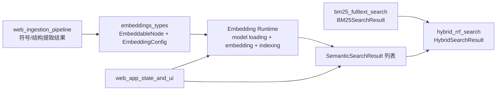
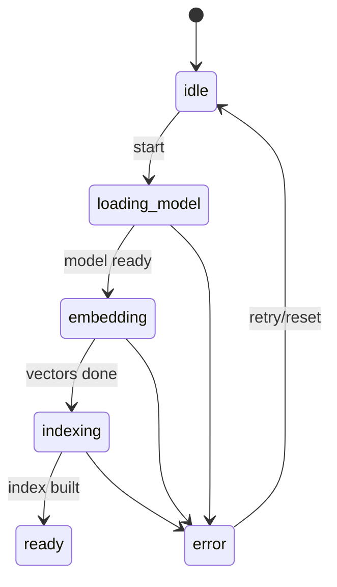
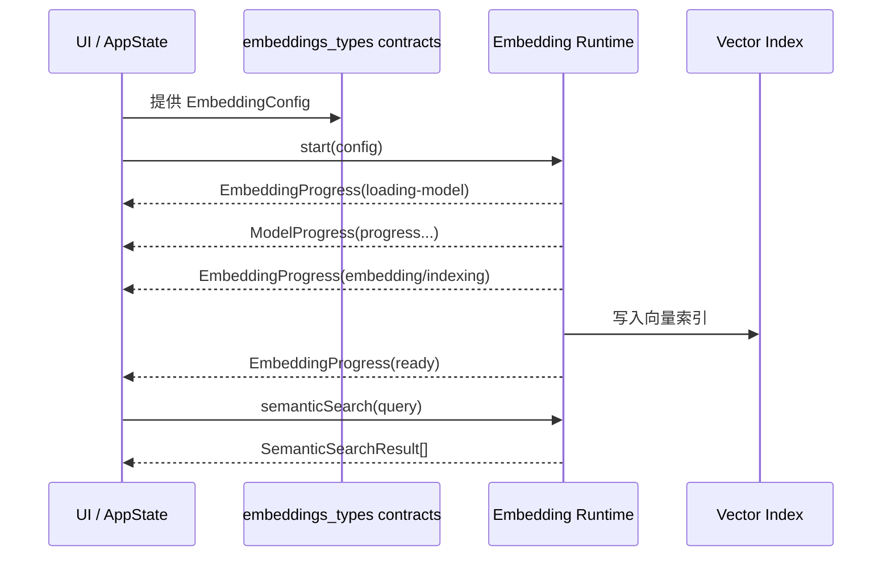

# embeddings_types 模块文档

## 模块简介

`embeddings_types` 是 GitNexus Web 端语义检索链路的“类型契约层”。它位于 `web_embeddings_and_search` 子树中，不负责真正的模型推理、向量索引构建或检索排序，而是为这些能力定义统一的数据结构与状态模型。换句话说，这个模块回答的是“系统应该交换什么数据、如何表达生命周期”，而不是“系统如何计算向量”。

这个模块存在的意义主要有两点。第一，它把 embedding 管线与 UI、搜索模块之间的接口稳定下来，避免实现细节泄漏到调用侧。第二，它通过 TypeScript 的字面量联合类型与类型守卫，把一部分运行时错误前移到编译阶段，减少“字段名对不上”“阶段状态不一致”“节点类型过滤失效”这类问题。

在 Web 端架构中，`embeddings_types` 通常处于 ingestion 结果与搜索体验之间：上游提供可嵌入节点，下游消费语义命中结果，并在 hybrid 检索阶段与 BM25 结果融合。

---

## 模块定位与依赖关系



上图中，`embeddings_types` 是语义检索路径上的接口“中轴”。它与 [bm25_fulltext_search.md](bm25_fulltext_search.md)、[hybrid_rrf_search.md](hybrid_rrf_search.md) 直接互补：前者定义关键词检索结果，后者定义融合结果，而本模块定义语义侧输入输出与执行进度。若你要理解整个检索链路，建议按“本模块 → BM25 → Hybrid”的顺序阅读。

---

## 设计原则

`types.ts` 的设计非常克制：只暴露最小必要类型，不引入实现依赖。它围绕四个问题建模：

1. 哪些节点值得做 embedding（`EMBEDDABLE_LABELS`、`EmbeddableLabel`、`isEmbeddableLabel`）。
2. embedding 管线有哪些阶段（`EmbeddingPhase`）。
3. 如何配置模型与推理行为（`EmbeddingConfig`、`DEFAULT_EMBEDDING_CONFIG`）。
4. 如何表达执行进度与检索输出（`EmbeddingProgress`、`ModelProgress`、`SemanticSearchResult`、`EmbeddableNode`）。

这种模式让实现层可以迭代（比如替换模型、调整批处理策略、切换索引库），而调用方只要遵守契约就不必频繁改动。

---

## 核心组件详解

## 1) `EMBEDDABLE_LABELS`、`EmbeddableLabel`、`isEmbeddableLabel`

### 作用

`EMBEDDABLE_LABELS` 定义了允许参与语义嵌入的节点标签白名单：

- `Function`
- `Class`
- `Method`
- `Interface`
- `File`

`EmbeddableLabel` 由该常量数组推导而来，是严格联合类型。`isEmbeddableLabel` 则是运行时类型守卫，用于把普通 `string` 收窄为 `EmbeddableLabel`。

### 内部工作方式

`EMBEDDABLE_LABELS` 使用 `as const`，因此数组元素会被推导成字面量而不是宽泛 `string`。随后通过 `typeof EMBEDDABLE_LABELS[number]` 形成联合类型。`isEmbeddableLabel` 通过 `includes` 做实际判断，并把返回值声明为 `label is EmbeddableLabel`，帮助调用方获得类型收窄。

### 典型用法

```ts
import { isEmbeddableLabel } from './types';

function filterNodes(nodes: Array<{ label: string }>) {
  return nodes.filter((n) => isEmbeddableLabel(n.label));
}
```

### 注意点

`isEmbeddableLabel` 只判断标签，不验证节点是否有可用 `content`。实际生产中通常需要与内容清洗逻辑配套使用。

---

## 2) `EmbeddingPhase` 与 `EmbeddingProgress`

### `EmbeddingPhase` 作用

`EmbeddingPhase` 是 embedding 生命周期的离散状态集合：

- `idle`
- `loading-model`
- `embedding`
- `indexing`
- `ready`
- `error`

它的主要价值是让状态机“可枚举”，便于 UI 或 orchestration 代码进行分支处理。

### `EmbeddingProgress` 结构

`EmbeddingProgress` 用于汇报整条 embedding 管线的进度：

- `phase: EmbeddingPhase`：当前阶段
- `percent: number`：总进度（通常 0~100）
- `modelDownloadPercent?: number`：模型下载进度
- `nodesProcessed?: number`、`totalNodes?: number`：节点处理计数
- `currentBatch?: number`、`totalBatches?: number`：批次计数
- `error?: string`：错误信息

### 生命周期流程图



### 实践建议

`EmbeddingProgress` 不是判别联合（discriminated union），所以可选字段在任意阶段都可能是 `undefined`。消费时应优先看 `phase`，再读取对应字段，不要默认所有数字字段都存在。

---

## 3) `EmbeddingConfig` 与 `DEFAULT_EMBEDDING_CONFIG`

### `EmbeddingConfig` 字段说明

- `modelId: string`：transformers.js 模型标识。
- `batchSize: number`：每批处理的节点数。
- `dimensions: number`：向量维度，应与模型真实输出一致。
- `device: 'webgpu' | 'wasm'`：推理设备选择。`webgpu` 优先性能，`wasm` 优先兼容性。
- `maxSnippetLength: number`：参与嵌入的代码片段最大字符数。

### 默认配置

```ts
export const DEFAULT_EMBEDDING_CONFIG: EmbeddingConfig = {
  modelId: 'Snowflake/snowflake-arctic-embed-xs',
  batchSize: 16,
  dimensions: 384,
  device: 'webgpu',
  maxSnippetLength: 500,
};
```

默认值体现了“浏览器可运行 + 速度可接受”的平衡：轻量模型、适中 batch、优先 WebGPU。

### 配置协同关系（关键）

`dimensions` 与 `modelId` 是强耦合参数。如果维度填错，后续向量索引或距离计算可能失败。`batchSize` 与 `maxSnippetLength` 会共同影响内存与延迟；在低端设备或 wasm 模式下，建议降低 batch 并缩短 snippet。

### 配置示例

```ts
import { DEFAULT_EMBEDDING_CONFIG, type EmbeddingConfig } from './types';

// 兼容优先（老设备/浏览器）
const safeConfig: EmbeddingConfig = {
  ...DEFAULT_EMBEDDING_CONFIG,
  device: 'wasm',
  batchSize: 8,
  maxSnippetLength: 300,
};

// 性能优先（WebGPU 可用）
const fastConfig: EmbeddingConfig = {
  ...DEFAULT_EMBEDDING_CONFIG,
  device: 'webgpu',
  batchSize: 24,
};
```

---

## 4) `EmbeddableNode`

`EmbeddableNode` 定义进入 embedding 流程的最小节点模型：

- `id`
- `name`
- `label`
- `filePath`
- `content`
- `startLine?`
- `endLine?`

它不是完整图节点（`GraphNode`）的镜像，而是针对语义模型输入优化后的瘦身投影。这样做可以降低数据搬运成本，也避免把图数据库中无关属性带入推理流程。完整图类型可参考 [graph_domain_types.md](graph_domain_types.md) 或 [core_graph_types.md](core_graph_types.md)。

---

## 5) `ModelProgress`

`ModelProgress` 是 transformers.js 下载/初始化事件的原子表示：

- `status: 'initiate' | 'download' | 'progress' | 'done' | 'ready'`
- `file?: string`
- `progress?: number`
- `loaded?: number`
- `total?: number`

它通常由模型加载器回调产生，再被上层聚合到 `EmbeddingProgress.modelDownloadPercent`。这是一种“底层事件 → 上层业务进度”的分层设计，可以让 UI 不依赖具体模型库的事件细节。

---

## 6) `SemanticSearchResult`

`SemanticSearchResult` 表示语义检索命中项：

- `nodeId`
- `name`
- `label`
- `filePath`
- `distance`
- `startLine?`
- `endLine?`

这里使用 `distance` 而不是统一 `score`，意味着调用方应明确该数值的度量语义（例如 cosine distance 越小越相似）。如果要与 BM25 或 Hybrid 分数统一展示，建议在融合层做映射，而不是直接混用原始值。

---

## 组件交互与数据流



这条时序强调了一个边界：`embeddings_types` 不执行逻辑，但它决定了运行时和 UI 如何“说同一种语言”。只要类型契约稳定，运行时实现可以更换。

---

## 实际使用范式

```ts
import {
  DEFAULT_EMBEDDING_CONFIG,
  isEmbeddableLabel,
  type EmbeddableNode,
  type EmbeddingProgress,
  type SemanticSearchResult,
} from './types';

const config = { ...DEFAULT_EMBEDDING_CONFIG, device: 'wasm' as const };

function prepareEmbeddableNodes(raw: any[]): EmbeddableNode[] {
  return raw
    .filter((n) => isEmbeddableLabel(n.label))
    .map((n) => ({
      id: n.id,
      name: n.name,
      label: n.label,
      filePath: n.filePath,
      content: String(n.content ?? ''),
      startLine: n.startLine,
      endLine: n.endLine,
    }));
}

function onEmbeddingProgress(p: EmbeddingProgress) {
  if (p.phase === 'error') {
    console.error('Embedding failed:', p.error);
    return;
  }
  console.log(`[${p.phase}] ${p.percent}%`);
}

function rankSemanticResults(results: SemanticSearchResult[]) {
  return [...results].sort((a, b) => a.distance - b.distance);
}
```

---

## 扩展与演进建议

当你扩展该模块时，建议优先保持“契约稳定 + 语义清晰”。例如新增可嵌入标签时，应同步评估下游过滤器、索引容量与检索质量。新增阶段状态时，应检查所有基于 `EmbeddingPhase` 的 `switch` 分支是否覆盖。若要支持更多设备类型，不要直接修改现有字段语义，而是通过可演进的联合类型扩展并在实现层做 capability 检测。

如果需要把 `EmbeddingProgress` 做得更强类型（按阶段绑定字段），可以引入 discriminated union。这个改造会提升安全性，但会增加调用侧分支复杂度，属于“可维护性 vs 简洁性”的取舍。

---

## 边界条件、错误条件与限制

这个模块本身几乎没有副作用，但其契约有一些天然约束需要调用方注意。

- `percent`、`modelDownloadPercent` 没有被类型限制在 0~100，运行时应自行钳制。
- `EmbeddableNode.label` 是 `string` 而非 `EmbeddableLabel`，意味着外部可能传入未过滤标签；推荐入口统一调用 `isEmbeddableLabel`。
- `distance` 的“越小越好”并非类型层强制，展示层和融合层必须遵守一致排序规则。
- `maxSnippetLength` 是字符上限而非 token 上限，实际模型输入长度仍可能受 tokenizer 规则影响。
- `device: 'webgpu'` 不保证一定可用；实现层必须具备 fallback（通常到 `wasm`）与错误处理。

---

## 与其他文档的关系

为了避免重复，本模块只关注类型契约。以下文档提供上下游细节：

- 语义 + 关键词 + 融合的总体视角：[`core_embeddings_and_search.md`](core_embeddings_and_search.md)
- 关键词检索结果结构：[`bm25_fulltext_search.md`](bm25_fulltext_search.md)
- 混合 RRF 结果与来源字段：[`hybrid_rrf_search.md`](hybrid_rrf_search.md)
- 图节点基础数据模型：[`graph_domain_types.md`](graph_domain_types.md)
- Web 端 Pipeline 结果与进度传输：[`pipeline_result_transport.md`](pipeline_result_transport.md)
