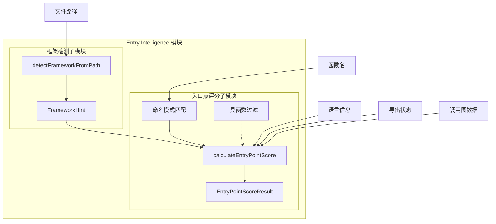
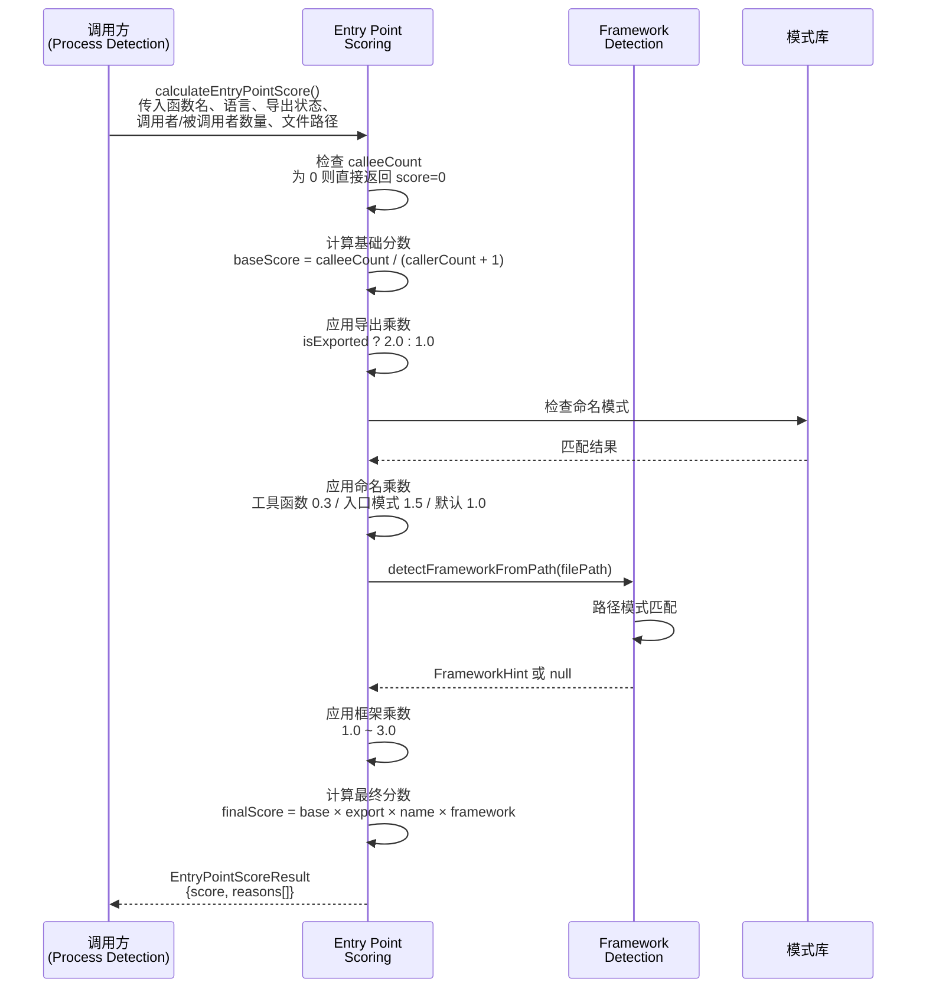
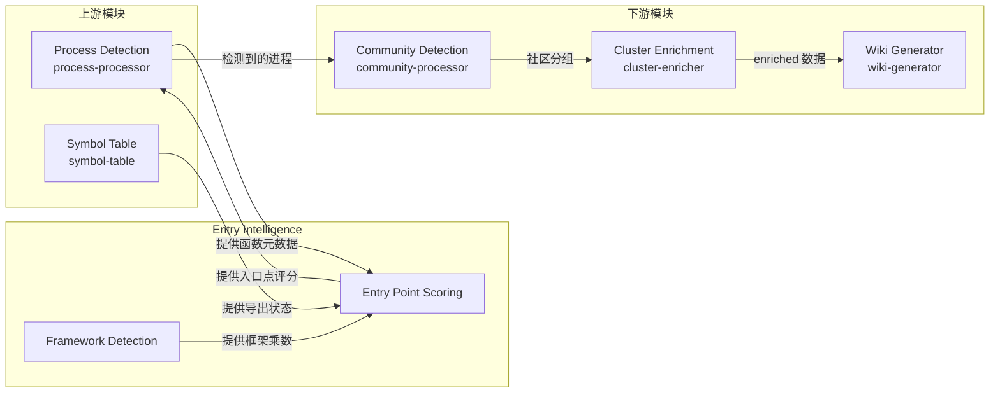

# Entry Intelligence 模块

## 概述

Entry Intelligence 模块是 GitNexus 代码库分析管道中的核心智能组件，负责识别和评分代码库中的潜在入口点（entry points）。该模块通过多维度分析策略，帮助开发者和分析工具快速定位代码库中最重要、最可能作为功能起点的函数和方法。

在现代软件工程中，理解一个陌生代码库的结构往往从识别其入口点开始。无论是进行代码审查、安全审计、性能分析还是功能理解，入口点都是理解代码执行流程的关键起点。Entry Intelligence 模块正是为了解决这一核心需求而设计的。

### 设计目标

本模块的设计基于以下核心目标：

1. **语言无关性**：支持多种编程语言（JavaScript/TypeScript、Python、Java、C#、Go、Rust、C/C++、PHP 等），通过可配置的模式匹配策略适应不同语言的命名约定和框架结构。

2. **框架感知**：能够识别主流 Web 框架（如 Next.js、Express、Django、FastAPI、Spring Boot、ASP.NET、Laravel 等）的约定俗成的入口点模式，给予适当的评分加权。

3. **多维度评分**：综合考虑调用关系（caller/callee 比例）、导出状态、命名模式、框架特征等多个因素，生成可信的入口点评分。

4. **渐进式增强**：基础评分算法提供合理的默认行为，框架检测和命名模式识别作为增强因子逐步提升评分准确性。

### 解决的问题

Entry Intelligence 模块主要解决以下问题：

- **代码库导航困难**：在大型代码库中，开发者往往难以快速找到功能的起始位置。本模块通过智能评分标识出最可能的入口点，加速代码理解过程。

- **框架约定识别**：不同框架有不同的入口点约定（如 Next.js 的 `pages/` 目录、Django 的 `views.py`、Spring 的 `@Controller` 注解等）。本模块自动识别这些约定，无需手动配置。

- **入口点优先级排序**：当代码库中存在大量候选入口点时，本模块提供量化的评分机制，帮助工具和分析者优先处理最重要的入口点。

- **误报过滤**：通过识别工具函数、辅助函数等非入口点模式，降低误报率，提高评分的可信度。

## 架构概览

Entry Intelligence 模块由两个核心子模块组成，它们协同工作以完成入口点的识别和评分：



### 组件说明

| 组件 | 职责 | 所属子模块 |
|------|------|-----------|
| `FrameworkHint` | 存储框架检测结果的接口，包含框架名称、入口点乘数和检测原因 | 框架检测 |
| `detectFrameworkFromPath()` | 根据文件路径模式检测框架类型并返回相应的入口点乘数 | 框架检测 |
| `EntryPointScoreResult` | 存储入口点评分结果的接口，包含最终评分和评分原因数组 | 入口点评分 |
| `calculateEntryPointScore()` | 核心评分函数，综合多个因素计算入口点得分 | 入口点评分 |
| `ENTRY_POINT_PATTERNS` | 按语言分类的入口点命名模式字典 | 入口点评分 |
| `UTILITY_PATTERNS` | 工具函数识别模式，用于降低非入口点函数的评分 | 入口点评分 |
| `isTestFile()` | 判断文件是否为测试文件，测试文件应排除在入口点分析之外 | 入口点评分 |
| `isUtilityFile()` | 判断文件是否为工具/辅助文件，这类文件中的函数优先级较低 | 入口点评分 |

### 数据流



## 子模块功能概述

### 框架检测子模块（Framework Detection）

框架检测子模块负责根据文件路径模式识别代码所属的框架类型，并为入口点评分提供相应的乘数因子。该子模块采用基于路径约定的检测策略，无需解析代码内容即可快速判断框架类型。

**核心功能**：
- 支持 20+ 种主流框架和语言的路径模式识别
- 为不同框架的入口点文件提供差异化的乘数（1.5 ~ 3.0）
- 未知框架时返回 null，实现优雅降级（乘数 1.0）

详细文档请参阅 [framework_detection.md](framework_detection.md)。

### 入口点评分子模块（Entry Point Scoring）

入口点评分子模块是 Entry Intelligence 的核心，负责综合多个因素计算函数的入口点得分。评分算法采用乘法模型，将基础调用比率与多个增强因子相结合。

**核心功能**：
- 基于调用图的基础评分（calleeCount / (callerCount + 1)）
- 导出状态加权（导出函数获得 2.0 倍乘数）
- 命名模式识别（支持 9 种语言的入口点和工具函数模式）
- 框架检测集成（调用框架检测子模块获取额外乘数）
- 测试文件和工具文件的识别与过滤

详细文档请参阅 [entry_point_scoring.md](entry_point_scoring.md)。

## 与其他模块的集成

Entry Intelligence 模块是 GitNexus 代码分析管道的重要组成部分，与多个模块存在集成关系：



### 上游依赖

- **Process Detection（进程检测）**：提供函数的调用图数据（callerCount、calleeCount），这是入口点评分的基础输入。
- **Symbol Table（符号表）**：提供函数的导出状态（isExported），用于判断函数是否为公共 API。

### 下游消费者

- **Process Detection**：使用入口点评分结果来识别和排序代码库中的业务流程入口点。
- **Community Detection**：基于入口点识别结果进行代码社区划分，将相关功能分组。
- **Cluster Enrichment**：对识别出的入口点集群进行 LLM 增强，生成更丰富的语义描述。
- **Wiki Generator**：利用入口点信息生成代码库文档，突出显示关键功能入口。

## 配置与扩展

### 配置选项

Entry Intelligence 模块设计为无配置运行，所有模式都内置在代码中。但可以通过以下方式扩展：

1. **添加新的框架模式**：在 `framework-detection.ts` 中添加新的路径匹配规则。
2. **添加新的命名模式**：在 `ENTRY_POINT_PATTERNS` 字典中为现有或新语言添加模式。
3. **调整乘数值**：修改各因子的乘数值以调整评分权重。

### 扩展指南

#### 添加新框架支持

```typescript
// 在 framework-detection.ts 中添加
if (p.includes('/your-framework/') && p.endsWith('.ext')) {
  return { 
    framework: 'your-framework', 
    entryPointMultiplier: 2.5, 
    reason: 'your-framework-pattern' 
  };
}
```

#### 添加新语言命名模式

```typescript
// 在 entry-point-scoring.ts 的 ENTRY_POINT_PATTERNS 中添加
'your-language': [
  /^entryPoint/,      // 自定义模式
  /^bootstrap/,       // 引导函数
  /EntryPoint$/,      // 入口点类
],
```

## 使用示例

### 基本评分调用

```typescript
import { calculateEntryPointScore } from './entry-point-scoring.js';

// 评分一个 Next.js 页面组件
const result = calculateEntryPointScore(
  'HomePage',           // 函数名
  'typescript',         // 语言
  true,                 // 已导出
  2,                    // 被 2 个函数调用
  15,                   // 调用了 15 个函数
  '/src/app/page.tsx'   // 文件路径
);

console.log(result);
// 输出:
// {
//   score: 45.0,  // 7.5(base) × 2.0(export) × 1.5(name) × 3.0(framework)
//   reasons: [
//     'base:7.50',
//     'exported',
//     'entry-pattern',
//     'framework:nextjs-app-page'
//   ]
// }
```

### 框架检测调用

```typescript
import { detectFrameworkFromPath } from './framework-detection.js';

// 检测 Django 视图文件
const hint = detectFrameworkFromPath('/myproject/app/views.py');

console.log(hint);
// 输出:
// {
//   framework: 'django',
//   entryPointMultiplier: 3.0,
//   reason: 'django-views'
// }
```

### 测试文件过滤

```typescript
import { isTestFile, isUtilityFile } from './entry-point-scoring.js';

// 排除测试文件
if (isTestFile('/src/utils/auth.test.ts')) {
  // 跳过评分
  return;
}

// 降低工具文件优先级
if (isUtilityFile('/src/helpers/string-utils.ts')) {
  // 应用额外惩罚或降低阈值
}
```

## 注意事项与限制

### 已知限制

1. **路径模式依赖**：框架检测完全基于文件路径模式，如果项目不遵循框架的标准目录结构，可能无法正确识别。

2. **命名模式误判**：命名模式匹配可能导致误判，例如名为 `handleData` 的函数可能被识别为入口点，但实际上只是数据处理工具函数。

3. **无 AST 分析**：当前版本仅基于路径和命名模式，不分析代码内容（如装饰器、注解）。未来版本计划添加 AST 模式检测（见 `FRAMEWORK_AST_PATTERNS`）。

4. **语言覆盖**：虽然支持 9 种语言，但某些语言的特定框架可能未被完全覆盖。

### 边缘情况处理

1. **零被调用函数**：如果 `calleeCount === 0`，函数直接返回 score=0，因为无法追踪执行流。

2. **未知框架**：框架检测返回 null 时，乘数为 1.0，不影响基础评分。

3. **多模式匹配**：框架检测按顺序匹配，第一个匹配的模式生效。路径顺序很重要。

4. **测试文件排除**：测试文件应调用 `isTestFile()` 进行预过滤，避免被误判为入口点。

### 性能考虑

- 框架检测使用简单的字符串匹配，时间复杂度为 O(n)，n 为规则数量（约 50 条）。
- 命名模式匹配使用正则表达式，对于大量函数评分时应考虑缓存结果。
- 建议在 Process Detection 阶段批量调用评分函数，而非逐个调用。

## 总结

Entry Intelligence 模块通过智能的框架检测和多维度评分机制，为代码库分析提供了可靠的入口点识别能力。其设计遵循语言无关、框架感知、渐进增强的原则，能够适应多样化的代码库结构。通过与 Process Detection、Community Detection 等模块的紧密集成，Entry Intelligence 成为 GitNexus 代码理解管道的关键组件。
