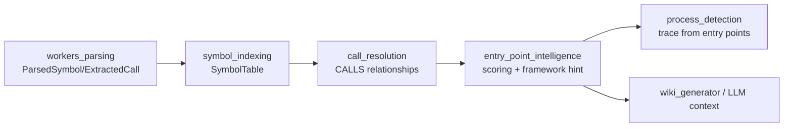
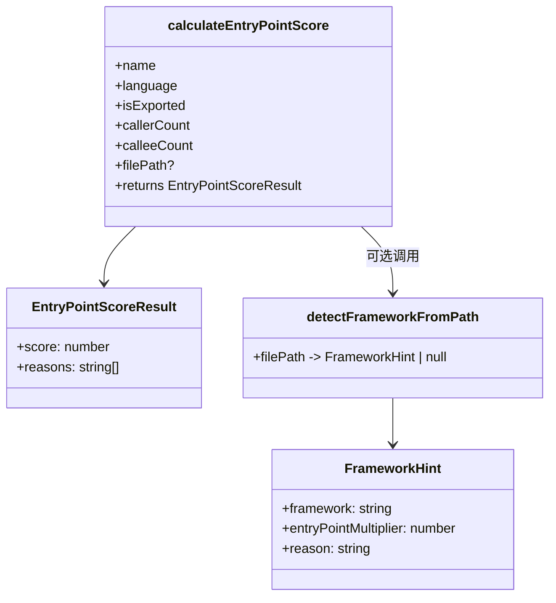
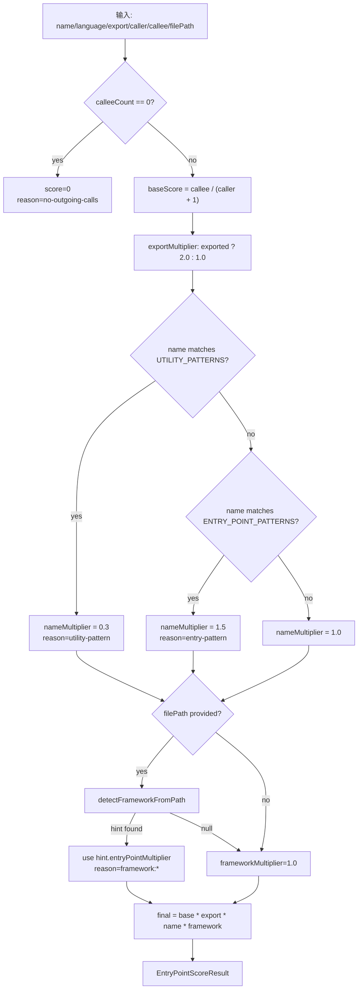
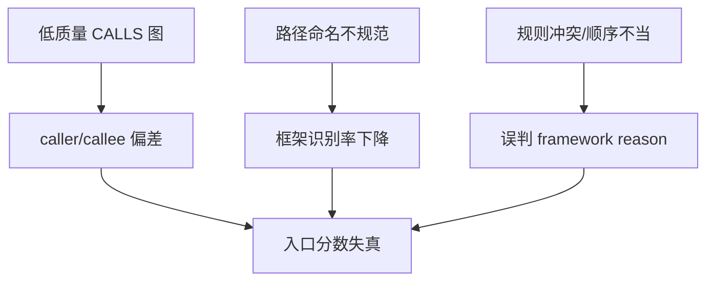

# entry_point_intelligence 模块文档

## 模块定位与设计目标

`entry_point_intelligence` 位于 `core_ingestion_resolution` 子域中，核心职责是回答一个在静态代码分析里非常关键的问题：**“哪些函数更可能是业务流程入口（entry point）？”**。这个问题本质上并不是语法解析问题，而是“结构信号 + 命名语义 + 框架约定”的综合判断问题。

在 GitNexus 的 ingestion 流水线中，上游模块（如 `workers_parsing`、`symbol_indexing`、`call_resolution`）会先把代码转成可遍历的关系图（尤其是 `CALLS` 边）；而本模块进一步将“谁调用谁”的原始关系，提升为“谁更值得作为流程起点”的可解释评分结果。这个能力直接影响下游的 `process_detection`、wiki 生成、以及 LLM 上下文抽取质量。

从设计哲学上看，这个模块有三个非常明显的取舍：第一，它是**语言无关的主框架 + 语言特定规则补充**，避免为每种语言维护完全独立的评分器。第二，它坚持**可解释性优先**，通过 `reasons` 返回评分依据，避免黑盒排序。第三，它采用**渐进增强策略**，框架检测失败时返回 `null` 并回落到 `1.0` 倍率，不破坏旧行为。

---

## 核心组件清单

本模块包含两个核心导出类型（来自两份文件）：

- `FrameworkHint`（`framework-detection.ts`）
- `EntryPointScoreResult`（`entry-point-scoring.ts`）

同时包含以下关键函数与规则集：

- `detectFrameworkFromPath(filePath): FrameworkHint | null`
- `calculateEntryPointScore(name, language, isExported, callerCount, calleeCount, filePath?)`
- `isTestFile(filePath): boolean`
- `isUtilityFile(filePath): boolean`
- `ENTRY_POINT_PATTERNS`（多语言正向命名模式）
- `UTILITY_PATTERNS`（负向工具函数模式）
- `FRAMEWORK_AST_PATTERNS`（未来 AST 检测的预留规则）

---

## 在整体系统中的位置



`entry_point_intelligence` 不直接解析 AST，也不直接改写图结构；它主要是提供“入口倾向分数”。因此它对上游 `CALLS` 质量敏感：如果 `call_resolution` 解析精度下降，`callerCount/calleeCount` 会偏差，进而导致入口排序失真。建议联动阅读：[`call_resolution.md`](call_resolution.md)、[`symbol_indexing.md`](symbol_indexing.md)、[`core_graph_types.md`](core_graph_types.md)。

---

## 架构分层与组件关系



模块内部关系非常直接：`calculateEntryPointScore` 是主函数，`detectFrameworkFromPath` 为其提供路径上下文倍率；两组 pattern 常量分别负责“正向信号（entry-like）”和“负向信号（utility-like）”打分。

---

## 数据流与打分流程



这个流程最大的优点是可解释且组合简单。调用方可以通过 `reasons` 解释“为什么这个函数分数高/低”，并可在上层策略中做阈值筛选、排序、或规则修正。

---

## 组件详解

## `FrameworkHint`

```ts
export interface FrameworkHint {
  framework: string;
  entryPointMultiplier: number;
  reason: string;
}
```

`FrameworkHint` 是路径推断的最小语义单元。`framework` 用于标注识别出的框架类别；`entryPointMultiplier` 用于影响最终分数；`reason` 是更细粒度的规则命中标识（例如 `nextjs-page`、`spring-controller`），可用于诊断与分析。

该类型本身无副作用，但它是跨函数的关键契约：一旦下游依赖 `reason` 做统计，修改命名将构成行为兼容性变化。

## `detectFrameworkFromPath(filePath)`

```ts
export function detectFrameworkFromPath(filePath: string): FrameworkHint | null
```

该函数通过路径启发式识别框架约定，并返回不同倍率。它首先统一路径格式（转小写、Windows 分隔符改 `/`、补前导 `/`），然后按“语言/框架分组”顺序进行短路匹配，命中即返回。

函数覆盖范围较广，包括：

- JavaScript/TypeScript：Next.js pages/app/api、Express routes、MVC controllers、React components
- Python：Django views/urls、FastAPI/Flask routers、`/api/` 目录
- Java：Spring Controller、Service 层
- C#/.NET：ASP.NET Controller、Blazor Pages
- Go：handlers/routes/controllers/main
- Rust：handlers/routes/main/bin
- C/C++：`main.c|cpp|cc` 与 `src/app.*`
- PHP/Laravel：routes/controllers/commands/jobs/listeners/middleware/providers/policies/models/services/repositories
- 通用模式：`/api/index.ts|js|__init__.py`

### 设计亮点

1. **向后兼容**：未知框架返回 `null`，上游按 `1.0` 处理，不引入负面回归。
2. **路径先行**：无需 AST，低成本覆盖多语言。
3. **规则可解释**：`reason` 可追踪具体命中分支。

### 重要边界与已知限制

- 路径被 `toLowerCase()` 后，React PascalCase 检测 `^[A-Z]` 实际上几乎不会命中，这是一个逻辑缺陷，会导致 `react-component` 奖励基本失效。
- `if (p.endsWith('/main.go') || p.endsWith('/cmd/') && p.endsWith('.go'))` 的后半条件不可同时成立，`/cmd/` 分支实际上无效。
- 匹配顺序会影响结果。例如同一路径可能同时满足 `/routes/` 和某框架条件，先命中的规则获胜。
- 纯路径判断无法识别“约定外组织结构”，对于自定义目录仓库召回有限。

## `FRAMEWORK_AST_PATTERNS`

这是为“未来 Phase 3”预留的规则字典，定义了诸如 `@Controller`、`Route::get`、`#[get]` 等代码级标记。当前文件中它还未参与执行逻辑，但它非常重要，因为它显示了模块演进路线：从路径启发式升级到 AST 语义检测。

建议在引入 AST 检测时保持“路径规则 + AST 规则”双轨，并把 `reason` 扩展为可区分来源（如 `framework:path:*` / `framework:ast:*`）。

## `EntryPointScoreResult`

```ts
export interface EntryPointScoreResult {
  score: number;
  reasons: string[];
}
```

`score` 是最终数值，`reasons` 是可解释证据链。例如：

- `base:2.50`
- `exported`
- `entry-pattern`
- `framework:nextjs-page`

这类理由可直接用于调试 UI、质量报告或评估框架（例如观察某次规则变更后 `framework:*` 触发率）。

## `calculateEntryPointScore(...)`

```ts
export function calculateEntryPointScore(
  name: string,
  language: string,
  isExported: boolean,
  callerCount: number,
  calleeCount: number,
  filePath: string = ''
): EntryPointScoreResult
```

这是模块最核心的评分函数。它遵循以下公式：

`finalScore = baseScore × exportMultiplier × nameMultiplier × frameworkMultiplier`

其中 `baseScore = calleeCount / (callerCount + 1)`。这个指标表达的是“向外编排能力（调用很多）与被依赖程度（被调用很多）”之间的平衡：通常入口函数更像 orchestration 节点，往往调用多个下游但被较少上游调用。

### 参数说明

- `name`：函数或方法名，用于命名模式匹配。
- `language`：语言标识（如 `typescript`、`python`、`php`），决定附加语言规则。
- `isExported`：公开可见性信号，导出函数可获 `2.0` 倍奖励。
- `callerCount`：入边调用数。
- `calleeCount`：出边调用数。
- `filePath`：可选路径；提供时启用框架倍率。

### 返回值与副作用

函数返回 `EntryPointScoreResult`，无外部副作用。其行为纯函数化，便于测试和离线评估。

### 内部规则优先级

1. 若 `calleeCount === 0`，立即返回 `score=0`。
2. 先判定 `UTILITY_PATTERNS`，命中则直接 `nameMultiplier=0.3`，不会再吃 `entry-pattern` 奖励。
3. 未命中 utility 才检查正向 `ENTRY_POINT_PATTERNS`，命中为 `1.5`。
4. `filePath` 存在时才进行框架识别。

这种优先级体现了“宁可少报入口，也不把工具函数误报为入口”的保守策略。

## `ENTRY_POINT_PATTERNS`

`ENTRY_POINT_PATTERNS` 由 `'*'` 通用规则与语言特定规则构成。通用规则覆盖 `main/init/bootstrap/start`、`handleX`、`onX`、`*Controller` 等高频入口命名；语言规则覆盖如 Python 的 `view_`、Java 的 `doGet`、C# 的 `Get/Post/Put/Delete`、PHP 的 RESTful action 名等。

注意这是启发式匹配，不代表语义必然成立。例如 `run` 在某些项目中可能只是内部任务函数，不一定是业务入口。

## `UTILITY_PATTERNS`

该集合用于显著降低“工具函数误报”。命中时倍率固定为 `0.3`，覆盖 getter/setter、`format/parse/validate`、`Helper/Util/Utils` 等典型模式。由于该惩罚较强，它会压制很多具有调用关系但职责偏工具的函数。

## `isTestFile(filePath)` 与 `isUtilityFile(filePath)`

这两个函数是上层入口筛选的辅助工具：

- `isTestFile`：跨语言识别测试文件（`.test.`、`/tests/`、`_test.go`、`test.php` 等），建议在候选入口阶段直接排除。
- `isUtilityFile`：识别 `/utils/`、`/helpers/`、`/lib/` 等工具目录，用于降权或二次过滤。

两者都仅做路径判断，速度快但可能误判（例如业务目录名包含 `lib`）。

---

## 典型使用方式

## 基础评分调用

```ts
import { calculateEntryPointScore } from './entry-point-scoring.js';

const result = calculateEntryPointScore(
  'handleCheckout',
  'typescript',
  true,
  1,    // callerCount
  8,    // calleeCount
  'src/app/checkout/page.tsx'
);

console.log(result.score, result.reasons);
```

## 在入口候选筛选中使用

```ts
import { calculateEntryPointScore, isTestFile } from './entry-point-scoring.js';

function rankCandidates(nodes) {
  return nodes
    .filter(n => !isTestFile(n.filePath))
    .map(n => ({
      id: n.id,
      ...calculateEntryPointScore(
        n.name,
        n.language,
        !!n.isExported,
        n.callerCount,
        n.calleeCount,
        n.filePath
      )
    }))
    .filter(x => x.score > 0)
    .sort((a, b) => b.score - a.score);
}
```

## 仅做框架路径判定

```ts
import { detectFrameworkFromPath } from './framework-detection.js';

const hint = detectFrameworkFromPath('app/Http/Controllers/UserController.php');
// { framework: 'laravel', entryPointMultiplier: 3.0, reason: 'laravel-controller' }
```

---

## 配置与扩展建议

该模块当前主要通过“修改常量规则”扩展，而非外置配置文件。实践中建议采用以下策略：

1. 先扩展 `ENTRY_POINT_PATTERNS` 与 `UTILITY_PATTERNS`，并对新增规则补回归样例。
2. 再扩展 `detectFrameworkFromPath` 的路径规则，确保新分支顺序合理，避免覆盖已有高置信规则。
3. 若引入 AST 规则，优先在 `FRAMEWORK_AST_PATTERNS` 基础上增加独立函数，不直接耦合现有路径函数，保持可回退。

对于企业私有框架，推荐维护一层项目级 wrapper：先跑官方规则，再附加私有规则，以减少上游升级冲突。

---

## 错误条件、边界情况与运维注意事项



需要重点关注以下风险：

- 如果 `calleeCount` 大量为 0（例如调用解析缺失），评分会系统性偏低。
- 评分没有上限裁剪，极端图结构可能产生异常高分，调用方应自行做分位截断或阈值归一化。
- `language` 字符串必须与规则键一致；未知语言只会使用 `'*'` 通用模式。
- `isUtilityFile` 当前未在 `calculateEntryPointScore` 内使用，若你期待“工具目录自动降分”，需要在调用侧显式接入。

---

## 测试与验证建议

建议至少覆盖三类测试：

- 单元测试：验证每个倍率分支和 `reasons` 输出稳定。
- 规则回归测试：维护“路径 -> FrameworkHint”样例集，防止新增规则破坏旧命中。
- 端到端测试：在真实仓库上比较入口 Top-N 的人工可接受度，并与 `process_detection` 结果联动评估。

特别建议把本文提到的两个已知逻辑缺陷（React PascalCase、Go `/cmd/` 条件）加入回归测试，修复后可显著提升规则可信度。

---

## 与其他文档的关系

- 图模型与关系结构：[`core_graph_types.md`](core_graph_types.md)
- 符号与调用解析来源：[`symbol_indexing.md`](symbol_indexing.md)、[`call_resolution.md`](call_resolution.md)
- 下游流程识别消费方：[`process_detection_and_entry_scoring.md`](process_detection_and_entry_scoring.md)

本文聚焦 `core_ingestion_resolution` 下的 `entry_point_intelligence`（服务端核心实现）。若你在 Web 端查看同名/同职能类型，请参考 `web_ingestion_pipeline` 相关文档，理解其运行时环境差异。
