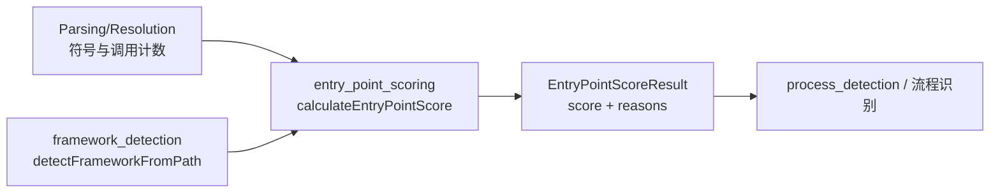
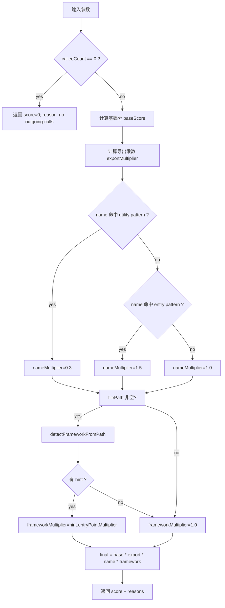
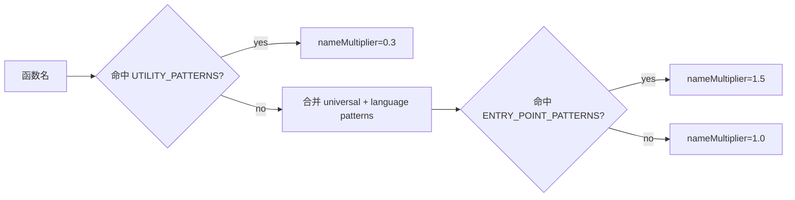

# entry_point_scoring 模块

## 模块简介

`entry_point_scoring` 模块位于 `gitnexus/src/core/ingestion/entry-point-scoring.ts`，是 Ingestion 阶段中“入口点智能（Entry Intelligence）”的核心打分器。它的目标不是“证明某个函数一定是入口”，而是用一组可解释、跨语言的启发式信号，把“更像入口点”的函数排在前面，供后续流程（例如 `process-processor` 的流程检测）优先展开。

这个模块存在的根本原因是：仅依赖调用图拓扑通常不够。真实项目里入口函数既可能是导出 API handler，也可能是框架约定目录中的页面函数、控制器动作或命令处理方法。`entry_point_scoring` 将四类信号组合为统一分值：调用比率（`callee / (caller + 1)`）、导出状态、函数命名模式、框架路径提示。相比单一统计指标，这种组合在多语言仓库中更稳定，也更容易通过 `reasons` 字段做审计和调优。

从设计上看，它是一个**无状态纯计算模块**：输入是函数元数据和可选文件路径，输出是 `EntryPointScoreResult`。模块不访问磁盘、不修改全局状态、不依赖数据库，因此在 pipeline 中可被安全并行调用，并且便于单元测试和回归比较。

---

## 在系统中的位置与上下游关系

在模块树中，本模块位于 `core_ingestion_resolution -> entry_intelligence -> entry_point_scoring`，并与 `framework_detection` 模块协同工作。它通常消费上游解析/解析后处理得到的符号与调用关系，再把分值供 `process_detection` 或其他候选排序逻辑使用。



上图中的 `A` 常来自解析与解析后模块（可参考 [core_ingestion_parsing.md](core_ingestion_parsing.md)、[call_resolution_engine.md](call_resolution_engine.md)、[symbol_table_management.md](symbol_table_management.md)），`C` 来自框架路径识别（见 [framework_detection.md](framework_detection.md)）。本模块并不重复这些模块的职责，而是做“统一打分融合”。

---

## 模块核心数据结构

## `EntryPointScoreResult`

```typescript
export interface EntryPointScoreResult {
  score: number;
  reasons: string[];
}
```

`score` 是最终浮点分值，数值越高表示越可能是入口候选。`reasons` 是可解释性轨迹，用于记录每一步加权依据，例如 `base:2.50`、`exported`、`entry-pattern`、`framework:nextjs-app-page`。该结构的一个重要设计价值是“可观测性”：当排序不符合预期时，开发者可以直接从原因链路定位是哪条规则触发或缺失。

---

## 评分算法详解：`calculateEntryPointScore`

### 函数签名

```typescript
export function calculateEntryPointScore(
  name: string,
  language: string,
  isExported: boolean,
  callerCount: number,
  calleeCount: number,
  filePath: string = ''
): EntryPointScoreResult
```

### 参数语义

`name` 是函数/方法名；`language` 是语言标识（如 `typescript`、`python`、`go`）；`isExported` 表示该符号是否可对外可见；`callerCount` 与 `calleeCount` 分别表示被调用次数和向外调用次数；`filePath` 是可选路径，主要用于框架加权，默认空字符串是为了向后兼容旧调用点。

### 返回值语义

返回 `EntryPointScoreResult`。其中 `score` 是综合乘积，`reasons` 记录构成路径。函数不会抛出业务异常，也没有副作用。

### 内部执行流程



该流程的关键点是“早退机制”：如果 `calleeCount === 0`，直接返回 0。设计动机是流程追踪需要“向前扩展”的调用边，零外呼函数在当前模型下无法形成有效流程骨架，因此被硬性排除。

### 公式与解释

最终公式：

```text
finalScore = (calleeCount / (callerCount + 1))
             * exportMultiplier
             * nameMultiplier
             * frameworkMultiplier
```

调用比率体现结构直觉：一个函数如果“调用别人很多，但很少被别人调用”，它更像流程入口或编排点。导出因子体现可见性假设；命名因子把工程命名约定显式纳入；框架因子吸收目录规范知识。

---

## 命名规则体系

模块内置两组正则规则：`ENTRY_POINT_PATTERNS` 与 `UTILITY_PATTERNS`。前者给加分候选，后者给惩罚候选。两者冲突时先判定 `UTILITY_PATTERNS`，即“负向模式优先”。



### `ENTRY_POINT_PATTERNS`

这是按语言分组的“入口倾向”模式表，含一组通用规则（键 `*`）和各语言专属规则。例如：

- 通用：`main/init/start/run`、`handleXxx`、`onXxx`、`*Controller`、`dispatchXxx`。
- TypeScript/JavaScript：`useXxx`（React hooks 生态常见入口/连接点）。
- Python：`get_*/post_*`、`api_*`、`view_*`。
- Java/C#：`doGet`、`Action`、`Async`、`*Service` 等约定。
- Go/Rust/C/C++/PHP：分别覆盖其社区中常见 handler/main/controller/service/repository 命名。

注意这不是语义正确性的证明，只是排序启发。

### `UTILITY_PATTERNS`

这组规则用于识别可能是工具函数、转换函数、谓词/访问器、集合操作辅助函数等。例如 `getXxx/setXxx`、`format*`、`parse*`、`*Util`、`helpers`。命中后 `nameMultiplier` 直接降为 `0.3`，是显著惩罚，目的是压低“常用工具但非业务入口”的噪声。

---

## 框架感知：与 `framework_detection` 的协同

`calculateEntryPointScore` 会在 `filePath` 非空时调用 `detectFrameworkFromPath(filePath)`。若命中框架路径规则，则读取 `FrameworkHint.entryPointMultiplier` 参与最终乘积，并把原因写入 `reasons`（格式形如 `framework:<reason>`）。

这意味着本模块把“名字像入口”和“位置像入口”融合在一起。比如 `index` 这类普通函数名，如果位于 Next.js `app/page.tsx`，仍可能得到较高分值；反之，名字很像入口但在工具目录，分值可能被其他因子中和。

相关规则细节与维护建议建议直接参考 [framework_detection.md](framework_detection.md)。

---

## 辅助函数

## `isTestFile(filePath: string): boolean`

该函数用于识别测试文件路径，覆盖 JS/TS、Python、Go、Java、Rust、C#、PHP 等常见约定。内部会先做路径标准化（小写化 + `\\` 转 `/`），再匹配 `*.test.*`、`/tests/`、`_test.py`、`_test.go`、`spec.php` 等模式。

虽然这个函数不直接参与 `calculateEntryPointScore`，但在上游候选收集阶段很有价值：通常应先过滤测试文件，再进行入口评分，避免测试驱动调用图污染入口候选。

## `isUtilityFile(filePath: string): boolean`

该函数判断文件是否位于 `utils/helper/common/shared/lib` 等工具目录，或命中诸如 `utils.ts`、`_helpers.py` 的文件名约定。它同样不直接改写 `calculateEntryPointScore`，而是给上游流程提供额外筛选/降权信号。

建议将其与函数级 `UTILITY_PATTERNS` 结合使用：前者在文件级做粗筛，后者在符号级做细化。

---

## 典型使用方式

### 基础调用

```typescript
import { calculateEntryPointScore } from './entry-point-scoring.js';

const result = calculateEntryPointScore(
  'handleLogin',
  'typescript',
  true,
  1,
  6,
  'src/app/api/auth/route.ts'
);

console.log(result.score);   // 例如: 27（取决于 framework multiplier）
console.log(result.reasons); // ['base:3.00','exported','entry-pattern','framework:...']
```

### 在候选筛选中的推荐组合

```typescript
import {
  calculateEntryPointScore,
  isTestFile,
  isUtilityFile,
} from './entry-point-scoring.js';

function scoreCandidate(fn: {
  name: string;
  language: string;
  isExported: boolean;
  callerCount: number;
  calleeCount: number;
  filePath: string;
}) {
  if (isTestFile(fn.filePath)) return null; // 强过滤

  const r = calculateEntryPointScore(
    fn.name,
    fn.language,
    fn.isExported,
    fn.callerCount,
    fn.calleeCount,
    fn.filePath,
  );

  // 文件级软降权示例（调用方自定义策略）
  if (isUtilityFile(fn.filePath)) {
    r.score *= 0.7;
    r.reasons.push('utility-file');
  }

  return r;
}
```

---

## 行为约束、边界情况与常见坑

`entry_point_scoring` 虽然实现简单，但有几个非常关键的行为约束。

首先，`calleeCount === 0` 会被直接判 0 分，这是硬规则，不会被导出、命名或框架加权“救回来”。如果你的业务希望把某些“终端入口”（例如仅注册路由但不显式调用其他函数）也纳入候选，需要在上游调整调用图统计或修改该早退逻辑。

其次，`language` 匹配是字面键查找。当前模式表键是小写字符串（`typescript`、`python` 等），若上传 `TypeScript` 或 `TS` 不会命中语言专属规则，只会使用通用 `*` 规则。实践里建议在调用前统一语言枚举。

再次，公式没有对输入计数做有效性校验。`callerCount` 或 `calleeCount` 若出现负数，会导致异常语义分值。正常 pipeline 不应产生这种数据，但在自定义接入时应防御性清洗。

此外，分值理论上无上限：当 `calleeCount` 很大且叠加多个乘数时，`score` 可显著放大。这在“排序”任务通常没问题，但若你用固定阈值（例如 `score > 10`）跨仓库比较，建议做归一化或分位数截断。

最后，`UTILITY_PATTERNS` 采取强惩罚（0.3），并且优先于正向规则。这会压制一些“名字看似工具但实际为入口”的函数（例如框架内部约定名）。如遇误伤，优先通过 `framework_detection` 或上游白名单修正，而不是盲目放宽所有 utility 规则。

---

## 扩展与演进建议

扩展这个模块时，建议遵循“可解释 + 可回归”的原则。新增语言模式前先确认命名风格是否稳定、是否会引入大面积误命中，并确保 `reasons` 能反映新规则触发点。每次调整后都应在固定样本仓库上比较 Top-N 入口候选变化，避免排名抖动。

对于团队化维护，推荐把语言键收敛到统一枚举，并在入口评分前做标准化；同时将 `ENTRY_POINT_PATTERNS`、`UTILITY_PATTERNS`、`framework` 乘数拆成可配置项（例如 JSON 或策略对象），降低硬编码成本。

如果你正在做更高精度方案，可以把本模块视为“第一阶段粗排”，再叠加 AST 语义证据、注解/装饰器证据、运行时入口注册证据形成二阶段重排。

---

## 与其他文档的关系

- 入口智能总览与定位： [entry_intelligence.md](entry_intelligence.md)
- 框架路径识别细节： [framework_detection.md](framework_detection.md)
- 流程检测如何消费入口候选： [process_detection.md](process_detection.md) 与 [process_detection_and_entry_scoring.md](process_detection_and_entry_scoring.md)
- 调用关系来源： [call_resolution_engine.md](call_resolution_engine.md)
- 符号可见性来源： [symbol_table_management.md](symbol_table_management.md)

这些文档与本文构成“入口候选评分链路”的完整阅读路径。