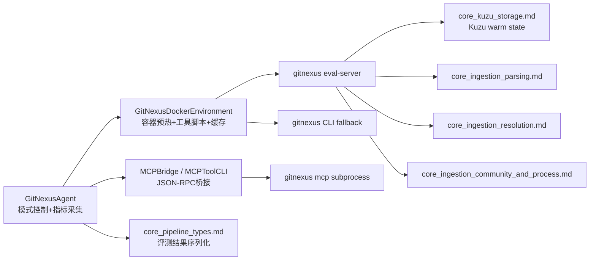
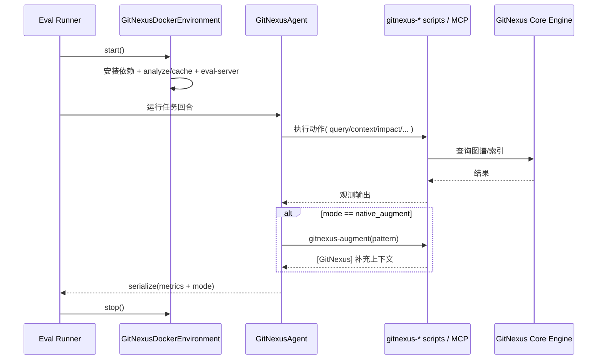

# eval_framework 模块文档

## 1. 模块简介：它做什么、为什么存在

`eval_framework` 是 GitNexus 在评测场景中的“实验执行层”，核心目标是把通用的 `mini-swe-agent` 运行时、GitNexus 的代码智能工具能力、以及可复现实验环境组织成一套可对比、可追踪、可批量运行的评测框架。它并不直接实现代码图构建、符号解析或搜索算法（这些由 `core_ingestion_*`、`core_embeddings_and_search` 等模块承担），而是解决评测工程里的三个现实问题：**如何稳定地接入工具、如何公平地做模式对照、如何输出可分析的行为指标**。

从设计动机看，这个模块是为“对照实验”而生。很多时候我们关心的不只是模型能否修复 bug，还关心“引入 GitNexus 能力后到底提升了什么”。因此该模块把运行模式显式分成 `baseline`、`native`、`native_augment`：同一任务在不同模式下运行时，唯一变化尽量收敛到工具可用性与观测增强策略，方便做纵向归因。与此同时，框架通过环境预热（索引缓存 + eval-server）减少工具调用冷启动噪音，避免性能抖动掩盖策略差异。

在系统整体中，`eval_framework` 位于 GitNexus 核心能力之上、具体评测任务之下，扮演“编排与适配层”。它上游依赖 `minisweagent` 的 Agent/Environment 协议，下游依赖 GitNexus CLI/MCP 能力；旁路会引用主系统模块产出的图谱、索引和搜索能力。你可以把它理解为一层“评测专用操作系统”：不发明基础算法，但决定这些能力怎样被组合并可靠执行。

---

## 2. 架构总览

### 2.1 高层组件图



这张图展示了 `eval_framework` 的最小闭环：Agent 决策与观测处理在左侧，环境与工具执行在中间，GitNexus 主能力在右侧。框架对右侧能力采取“黑盒调用”策略，不关心底层算法细节，只关心接口可用性、时延和可观测性。

### 2.2 评测请求数据流



这个流程的关键点是：`eval_framework` 将“重型准备工作”前置到 `Env.start()`，让 Agent 回合里的工具调用尽量变成轻量请求；并把模式与指标在 `serialize` 阶段统一沉淀，便于后处理分析。

### 2.4 模块内真实调用关系（基于依赖图）

根据当前提供的依赖图，模块内明确可确认的调用关系非常克制：

- `GitNexusAgent` → `GitNexusMetrics`、`GitNexusMode`
- `MCPToolCLI` → `MCPBridge`

这意味着 `eval_framework` 的核心设计是“薄编排层”，而不是内部复杂算法网络。很多复杂度被有意下沉到外部运行时（`DefaultAgent` / `DockerEnvironment`）和外部系统（GitNexus CLI/MCP server）。

这种设计的好处是：评测逻辑易替换、易做对照实验；代价是：对外部契约稳定性高度敏感（比如 CLI 参数、MCP 协议、容器内命令可用性）。


## 3. 子模块功能导航（高层）

### 3.1 `agent_runtime_and_metrics`（详见 [agent_runtime_and_metrics.md](agent_runtime_and_metrics.md)）

该子模块定义 `GitNexusAgent` 及相关配置/指标类型，是评测行为层的核心。它通过三种模式控制 GitNexus 能力暴露范围，并在动作执行后可选注入 `augment` 上下文，实现“尽量不改主循环、只改观测质量”的增强策略。其内部还维护工具调用分布、增强命中率、耗时等指标，保证实验结果不仅有最终成败，还有过程证据。

如果你在做 A/B 实验，这个模块是首要关注点：模式语义、模板加载策略、增强触发条件（如 pattern 长度阈值）都会直接影响模型行为。对行为分析而言，`serialize` 输出里的 GitNexus 指标是最直接的数据来源。

### 3.2 `mcp_bridge_and_cli`（详见 [mcp_bridge_and_cli.md](mcp_bridge_and_cli.md)）

该子模块负责把 `gitnexus mcp` 子进程封装成 Python 可调用接口，并提供 CLI 包装器用于脚本化调用。它处理 JSON-RPC 报文构造、`Content-Length` framing、请求 ID 匹配、初始化握手与生命周期管理，屏蔽了协议层细节。

当你不想直接依赖 HTTP eval-server，或者需要复用 MCP 工具生态时，这个模块是主要接入点。需要注意它偏向串行调用模型，适合评测任务中“稳定优先”的调用模式。

### 3.3 `docker_environment_and_tooling`（详见 [docker_environment_and_tooling.md](docker_environment_and_tooling.md)）

该子模块扩展了 `mini-swe-agent` 的 Docker 环境，在容器启动阶段完成 GitNexus 安装、代码库索引、eval-server 启动和工具脚本落盘。通过缓存 `(repo, commit)` 索引、提供服务快路径与 CLI 回退路径，它显著降低了评测轮次里的工具调用时延和失败概率。

这部分是评测可靠性的基础设施保障。尤其在批量任务中，缓存命中率和 server 就绪状态会直接决定吞吐与稳定性，因此建议把 `serialize().info.gitnexus_env` 作为 run 质量门禁之一。

---

## 4. 与其他模块的关系（避免重复说明）

`eval_framework` 不重复实现主系统的数据生产能力，而是通过工具接口消费它们。若你需要深入理解“工具结果从何而来”，建议按以下路径继续阅读：

- 图谱实体结构：[`core_graph_types.md`](core_graph_types.md)
- 代码摄取与解析：[`core_ingestion_parsing.md`](core_ingestion_parsing.md)
- 符号/导入/调用解析：`core_ingestion_resolution`（若已生成文档）
- 社区与流程识别：[`core_ingestion_community_and_process.md`](core_ingestion_community_and_process.md)（若已生成）
- 索引存储与 CSV/Kuzu：[`core_kuzu_storage.md`](core_kuzu_storage.md)
- 搜索与向量能力：[`core_embeddings_and_search.md`](core_embeddings_and_search.md)
- 结果类型约定：[`core_pipeline_types.md`](core_pipeline_types.md)

简言之：`eval_framework` 是“消费并评测这些能力”的层，而非“产出这些能力”的层。

---

## 5. 典型使用方式

### 5.1 最小评测集成示意

```python
from eval.agents.gitnexus_agent import GitNexusAgent, GitNexusMode
from eval.environments.gitnexus_docker import GitNexusDockerEnvironment

env = GitNexusDockerEnvironment(
    enable_gitnexus=True,
    skip_embeddings=True,
    gitnexus_timeout=180,
)
env.start()

agent = GitNexusAgent(
    model=model,
    env=env,
    gitnexus_mode=GitNexusMode.NATIVE_AUGMENT,
    augment_timeout=5.0,
    track_gitnexus_usage=True,
)

# ...运行任务循环...
result = agent.serialize()
print(result.get("info", {}).get("gitnexus", {}))
print(env.serialize().get("info", {}).get("gitnexus_env", {}))

env.stop()
```

### 5.2 模式选择建议

如果你的目标是建立对照组，优先使用 `baseline`；如果目标是评估纯工具可用性的收益，使用 `native`；如果目标是验证“自动补充上下文”能否改善定位效率，使用 `native_augment`。建议固定同一任务集在三种模式下重复运行，再比较修复率、步骤数、工具调用分布与平均时延。

---

## 6. 配置、扩展与运维建议

扩展新工具时，建议同时修改 Agent 的工具统计映射、环境脚本安装列表、以及提示词模板说明，保证“模型知道工具 + 环境提供工具 + 指标记录工具”三者一致。只改其中一处会导致实验数据失真（例如工具可调用但未统计）。

在 CI/批处理中，优先保障 `cache_dir` 持久化和 Docker `cp` 权限，否则每次都全量索引，评测成本会明显升高。若仓库规模较大，可以提高 `gitnexus_timeout` 并监控 `index_time` 分布，避免因超时造成隐性降级到无工具或慢路径。

如果要做高并发评测，建议谨慎使用单桥接实例复用（特别是 MCP 串行读写模型），可以采用“每任务独立进程/容器”的隔离策略，换取更稳定的可重复性。

---

## 7. 风险点与常见陷阱

最常见陷阱不是代码报错，而是“静默降级”。例如环境启动成功但 `gitnexus_ready=False`，或 eval-server 未就绪导致工具回退 CLI，这会让实验看似正常、实际延迟和行为发生明显变化。务必在结果后处理时读取 Agent/Env 的序列化字段并纳入过滤条件。

另外，增强逻辑是启发式的（基于搜索命令 pattern 提取与输出标记识别），因此其命中率与稳定性受命令格式影响较大。不要把 `augmentation_hits` 简单等同于“增强有价值次数”，应结合任务结果和观测内容做联合分析。

## 8. 文档索引与交叉引用

为避免信息重复，`eval_framework` 采用“主文档 + 子模块文档”结构。建议按以下顺序阅读：

1. 主文档：[`eval_framework.md`](eval_framework.md)
2. Agent 行为与指标：[`agent_runtime_and_metrics.md`](agent_runtime_and_metrics.md)
3. MCP 协议桥接：[`mcp_bridge_and_cli.md`](mcp_bridge_and_cli.md)
4. Docker 环境与工具链：[`docker_environment_and_tooling.md`](docker_environment_and_tooling.md)

当你需要追溯 GitNexus 底层能力时，再继续参考：[`core_graph_types.md`](core_graph_types.md)、[`core_ingestion_parsing.md`](core_ingestion_parsing.md)、[`core_kuzu_storage.md`](core_kuzu_storage.md)、[`core_embeddings_and_search.md`](core_embeddings_and_search.md)、[`core_pipeline_types.md`](core_pipeline_types.md)。
