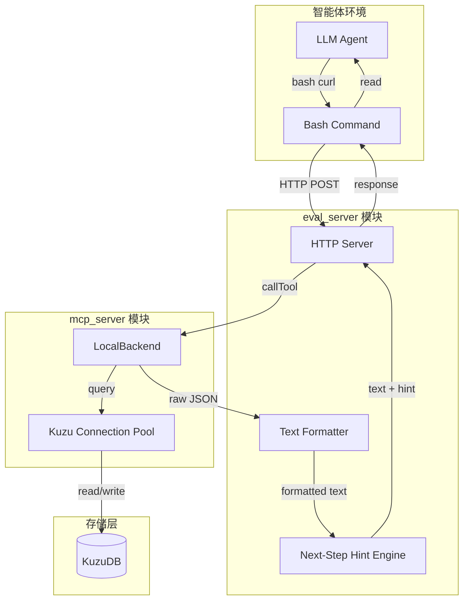
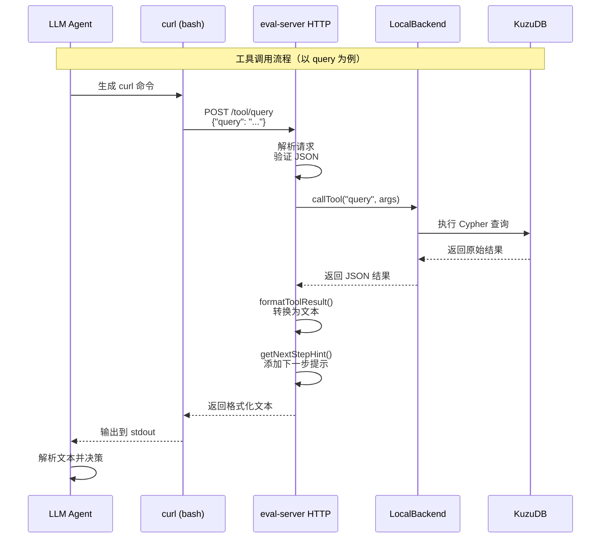
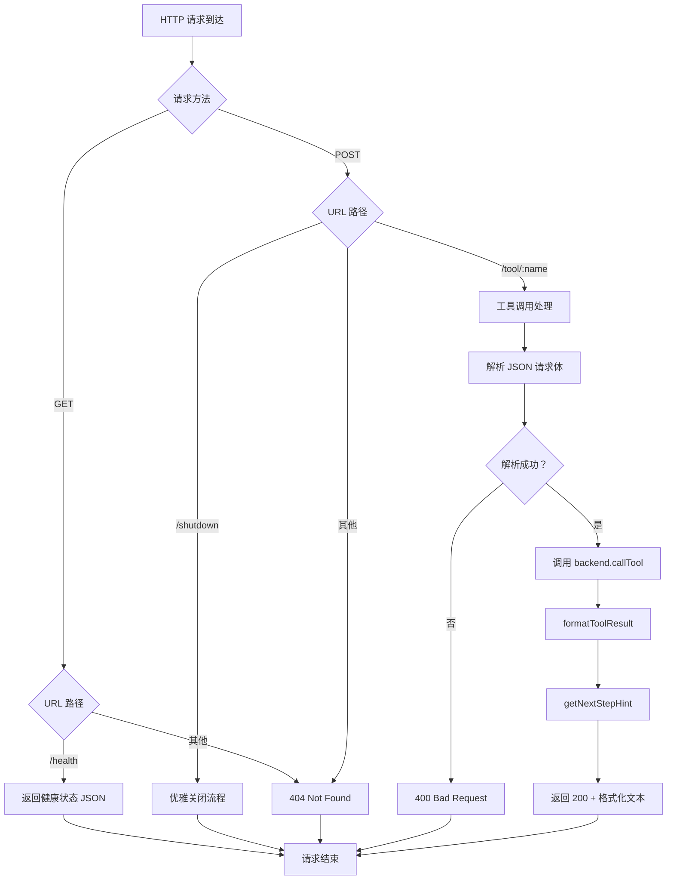
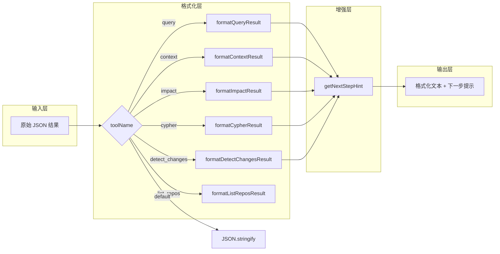

# eval_server 模块文档

## 1. 模块概述

### 1.1 模块定位与设计目标

`eval_server` 模块是 GitNexus 系统中专为 SWE-bench 评估场景设计的轻量级 HTTP 服务器。它的核心使命是在自动化评估环境中保持 KuzuDB 图数据库常驻内存，使智能体（Agent）的工具调用能够实现近即时响应。

在传统的代码分析工具链中，每次工具调用都需要重新加载索引、重建连接，这会引入显著的延迟。对于需要频繁调用工具的 LLM 智能体而言，这种延迟会累积成可观的时间开销，并可能影响智能体的决策质量。`eval_server` 通过以下设计解决这一问题：

**核心设计原则**：

1. **内存常驻**：服务器启动时初始化 `LocalBackend`，将整个代码库的索引保持在内存中，避免重复加载开销
2. **LLM 友好输出**：返回经过格式化的紧凑文本而非原始 JSON，减少 token 消耗并提高模型可读性
3. **工具链引导**：通过"下一步提示"（Next-Step Hints）机制引导智能体遵循高效的工具调用工作流
4. **容器化友好**：专为 Docker 容器环境设计，支持优雅关闭和空闲超时自动退出

### 1.2 典型使用场景

```bash
# 默认端口启动（4848）
gitnexus eval-server

# 指定端口
gitnexus eval-server --port 4848

# 设置空闲超时（300 秒后自动关闭）
gitnexus eval-server --idle-timeout 300
```

在 SWE-bench 评估流程中，该服务器通常运行在 Docker 容器内，智能体通过 `curl` 命令调用其 API：

```bash
# 智能体调用示例
curl -X POST http://localhost:4848/tool/query \
  -H "Content-Type: application/json" \
  -d '{"query": "user authentication"}'
```

### 1.3 与系统其他模块的关系



**依赖关系说明**：

- **mcp_server 模块**：`eval_server` 完全依赖 `LocalBackend` 类（来自 [mcp_server](mcp_server.md) 模块）执行实际的工具调用和数据库操作
- **core_ingestion_resolution 模块**：通过 `LocalBackend` 间接使用符号表、导入解析等功能
- **core_kuzu_storage 模块**：通过连接池访问 KuzuDB 图数据库
- **cli 模块**：作为 CLI 命令 `gitnexus eval-server` 的实现入口

## 2. 架构设计

### 2.1 整体架构



### 2.2 请求处理流程



### 2.3 文本格式化架构

`eval_server` 的核心创新在于将结构化 JSON 结果转换为 LLM 友好的文本格式。每个工具类型都有专用的格式化函数：



## 3. 核心组件详解

### 3.1 EvalServerOptions 配置接口

```typescript
export interface EvalServerOptions {
  port?: string;      // HTTP 服务器监听端口，默认 "4848"
  idleTimeout?: string; // 空闲超时（秒），"0" 表示禁用
}
```

**参数说明**：

| 参数 | 类型 | 默认值 | 说明 |
|------|------|--------|------|
| `port` | `string` | `"4848"` | HTTP 服务器监听的端口号。在 Docker 容器中通常映射到主机端口 |
| `idleTimeout` | `string` | `"0"` | 空闲超时时间（秒）。设为 "0" 禁用自动关闭。在评估环境中建议设置合理超时以节省资源 |

**使用示例**：

```typescript
// 在 CLI 命令中解析参数
const options: EvalServerOptions = {
  port: args.port || '4848',
  idleTimeout: args['idle-timeout'] || '0'
};

await evalServerCommand(options);
```

### 3.2 文本格式化函数

#### 3.2.1 formatQueryResult - 执行流查询结果格式化

**功能**：将执行流搜索结果转换为紧凑的文本列表格式。

**输入结构**：
```typescript
{
  error?: string,
  processes: Array<{
    id: string,
    summary: string,
    step_count: number,
    symbol_count: number
  }>,
  process_symbols: Array<{
    process_id: string,
    type: string,
    name: string,
    filePath: string,
    startLine?: number
  }>,
  definitions: Array<{
    type?: string,
    name: string,
    filePath?: string
  }>
}
```

**输出示例**：
```
Found 2 execution flow(s):

1. User login authentication (5 steps, 12 symbols)
   function authenticateUser → src/auth/login.ts:15
   function validatePassword → src/auth/validator.ts:42
   function generateToken → src/auth/token.ts:8
   ... and 9 more

2. Password reset flow (3 steps, 7 symbols)
   function requestReset → src/auth/reset.ts:20
   ... and 6 more

Standalone definitions:
  function hashPassword → src/auth/utils.ts
  ... and 2 more
```

**设计要点**：
- 无结果时返回明确的引导信息，建议尝试其他搜索词或使用 grep
- 每个流程显示前 6 个符号，超出部分用省略号表示
- 独立定义显示前 8 个，避免输出过长

#### 3.2.2 formatContextResult - 符号上下文结果格式化

**功能**：提供符号的 360 度视图，包括定义位置、调用关系、被调用关系和参与的执行流。

**输入结构**：
```typescript
{
  error?: string,
  status?: 'ambiguous',
  candidates?: Array<{
    kind: string,
    name: string,
    filePath: string,
    line?: number,
    uid: string
  }>,
  symbol?: {
    kind: string,
    name: string,
    filePath: string,
    startLine?: number,
    endLine?: number,
    content?: string
  },
  incoming?: {
    [relType: string]: Array<{
      kind: string,
      name: string,
      filePath: string
    }>
  },
  outgoing?: {
    [relType: string]: Array<{
      kind: string,
      name: string,
      filePath: string
    }>
  },
  processes?: Array<{
    name: string,
    step_index: number,
    step_count: number
  }>
}
```

**输出示例（正常情况）**：
```
function processOrder → src/orders/processor.ts:45-120

Called/imported by (15):
  ← [CALLS] function checkout → src/checkout/handler.ts
  ← [IMPORTS] class OrderController → src/controllers/order.ts
  ... and 13 more

Calls/imports (8):
  → [CALLS] function validateInventory → src/inventory/check.ts
  → [CALLS] function calculateTotal → src/orders/calc.ts
  ... and 6 more

Participates in 2 execution flow(s):
  • Order fulfillment (step 3/7)
  • Refund processing (step 1/4)

Source:
async function processOrder(orderId: string) {
  // ... 代码内容
}
```

**输出示例（歧义情况）**：
```
Multiple symbols named 'process'. Disambiguate with file path:

  function process → src/orders/processor.ts:45  (uid: sym_123)
  function process → src/images/handler.ts:120  (uid: sym_456)
  class ProcessQueue → src/queue/manager.ts:30  (uid: sym_789)

Re-run: gitnexus-context "process" "<file_path>"
```

**设计要点**：
- 歧义时明确列出所有候选项并提供消歧命令
- 调用关系限制显示前 10 个，避免信息过载
- 包含源代码内容便于快速理解

#### 3.2.3 formatImpactResult - 影响范围分析结果格式化

**功能**：展示符号变更的影响范围（爆炸半径），按依赖深度分层显示。

**输入结构**：
```typescript
{
  error?: string,
  target?: {
    kind: string,
    name: string
  },
  direction: 'upstream' | 'downstream',
  byDepth: {
    [depth: number]: Array<{
      type: string,
      name: string,
      filePath: string,
      relationType: string,
      confidence: number
    }>
  },
  impactedCount: number
}
```

**输出示例**：
```
Blast radius for function processOrder (upstream): 45 symbol(s) depends on this (will break if changed)

d=1: WILL BREAK (direct) (12)
  function checkout → src/checkout/handler.ts [CALLS]
  class OrderController → src/controllers/order.ts [IMPORTS]
  ... and 10 more

d=2: LIKELY AFFECTED (indirect) (18)
  function submitOrder → src/api/orders.ts [CALLS] (conf: 0.85)
  ... and 17 more

d=3: MAY NEED TESTING (transitive) (15)
  ... and 15 more
```

**深度标签说明**：

| 深度 | 标签 | 含义 |
|------|------|------|
| d=1 | WILL BREAK (direct) | 直接依赖，变更必然影响 |
| d=2 | LIKELY AFFECTED (indirect) | 间接依赖，很可能受影响 |
| d=3 | MAY NEED TESTING (transitive) | 传递依赖，可能需要测试 |

**设计要点**：
- 无依赖时明确告知符号处于孤立状态
- 低置信度结果标注置信度值
- 每层限制显示 12 个，保持输出紧凑

#### 3.2.4 formatCypherResult - Cypher 查询结果格式化

**功能**：将原始 Cypher 查询结果转换为表格形式的文本。

**输入处理**：
- 空数组：返回 "Query returned 0 rows."
- 对象数组：格式化为键值对表格
- 字符串：直接返回
- 其他：JSON.stringify 格式化

**输出示例**：
```
5 row(s):

  symbol_name: authenticateUser | file_path: src/auth/login.ts | type: function
  symbol_name: validatePassword | file_path: src/auth/validator.ts | type: function
  symbol_name: generateToken | file_path: src/auth/token.ts | type: function
  ... 2 more rows
```

**设计要点**：
- 限制显示前 30 行，避免输出过长
- 使用 ` | ` 分隔键值对，提高可读性

#### 3.2.5 formatDetectChangesResult - 变更检测结果格式化

**功能**：总结代码变更的影响，包括变更文件数、符号数和受影响的执行流。

**输入结构**：
```typescript
{
  error?: string,
  summary?: {
    changed_files: number,
    changed_count: number,
    affected_count: number,
    risk_level: string
  },
  changed_symbols: Array<{
    type: string,
    name: string,
    filePath: string
  }>,
  affected_processes: Array<{
    name: string,
    step_count: number,
    changed_steps: Array<{
      symbol: string
    }>
  }>
}
```

**输出示例**：
```
Changes: 3 files, 7 symbols
Affected processes: 2
Risk level: high

Changed symbols:
  function validateUser → src/auth/validator.ts
  function hashPassword → src/auth/utils.ts
  ... and 5 more

Affected execution flows:
  • User login authentication (5 steps) — changed: validateUser, hashPassword
  • Password reset flow (3 steps) — changed: validateUser
```

**设计要点**：
- 无变更时简洁返回 "No changes detected."
- 高风险变更需要智能体重点关注

#### 3.2.6 formatListReposResult - 仓库列表结果格式化

**功能**：列出所有已索引的仓库及其统计信息。

**输出示例**：
```
Indexed repositories:

  my-project — 1250 symbols, 3400 relationships, 45 flows
    Path: /workspace/my-project
    Indexed: 2024-01-15T10:30:00.000Z
```

### 3.3 下一步提示引擎（Next-Step Hint Engine）

**功能**：根据当前工具调用结果，为智能体提供逻辑上的下一步操作建议，引导其遵循高效的工具链工作流。

**工具链工作流**：
```
query → context → impact → fix
```

**提示规则**：

| 工具 | 下一步提示 |
|------|-----------|
| `query` | 选择符号并运行 `gitnexus-context "<name>"` 查看调用关系和执行流 |
| `context` | 运行 `gitnexus-impact "<name>" upstream` 检查变更影响范围 |
| `impact` | 优先审查 d=1 项（WILL BREAK），用 `cat` 阅读源码后进行修复 |
| `cypher` | 运行 `gitnexus-context "<name>"` 深入探索结果符号 |
| `detect_changes` | 对高风险变更符号运行 `gitnexus-context "<symbol>"` 检查调用者 |

**输出格式**：
```
[格式化结果]

---
Next: [下一步建议]
```

**设计原理**：
- 减少智能体的决策负担，提供明确的行动指引
- 确保智能体遵循最佳实践工作流
- 避免智能体在工具调用中迷失方向

### 3.4 HTTP 服务器实现

#### 3.4.1 端点定义

| 端点 | 方法 | 功能 | 响应格式 |
|------|------|------|----------|
| `/tool/:name` | POST | 调用指定工具 | `text/plain` 格式化文本 + 提示 |
| `/health` | GET | 健康检查 | `application/json` 状态 + 仓库列表 |
| `/shutdown` | POST | 优雅关闭 | `application/json` 关闭状态 |

#### 3.4.2 空闲超时机制

```typescript
let idleTimer: ReturnType<typeof setTimeout> | null = null;

function resetIdleTimer() {
  if (idleTimeoutSec <= 0) return;
  if (idleTimer) clearTimeout(idleTimer);
  idleTimer = setTimeout(async () => {
    console.error('GitNexus eval-server: Idle timeout reached, shutting down');
    await backend.disconnect();
    process.exit(0);
  }, idleTimeoutSec * 1000);
}
```

**工作机制**：
1. 每次请求到达时调用 `resetIdleTimer()`
2. 清除现有定时器并重新设置
3. 超时后断开数据库连接并退出进程

**使用建议**：
- 评估环境中建议设置 300-600 秒超时
- 长时间运行的评估任务应禁用超时（设为 0）

#### 3.4.3 优雅关闭处理

```typescript
const shutdown = async () => {
  console.error('GitNexus eval-server: shutting down...');
  await backend.disconnect();
  server.close();
  process.exit(0);
};

process.on('SIGINT', shutdown);
process.on('SIGTERM', shutdown);
```

**关闭流程**：
1. 记录关闭日志
2. 断开 KuzuDB 连接（释放资源）
3. 关闭 HTTP 服务器（停止接收新请求）
4. 退出进程

## 4. 使用指南

### 4.1 启动服务器

```bash
# 基础启动（默认配置）
gitnexus eval-server

# 指定端口
gitnexus eval-server --port 8080

# 设置空闲超时（5 分钟）
gitnexus eval-server --idle-timeout 300

# 组合使用
gitnexus eval-server --port 8080 --idle-timeout 600
```

**启动输出**：
```
GitNexus eval-server: 1 repo(s) loaded: my-project
GitNexus eval-server: listening on http://127.0.0.1:4848
  POST /tool/query    — search execution flows
  POST /tool/context  — 360-degree symbol view
  POST /tool/impact   — blast radius analysis
  POST /tool/cypher   — raw Cypher query
  GET  /health        — health check
  POST /shutdown      — graceful shutdown
  Auto-shutdown after 300s idle
GITNEXUS_EVAL_SERVER_READY:4848
```

**启动就绪信号**：
服务器启动成功后会向 stdout 写入 `GITNEXUS_EVAL_SERVER_READY:<port>`，便于自动化脚本检测服务器就绪状态。

### 4.2 API 调用示例

#### 4.2.1 健康检查

```bash
curl http://localhost:4848/health
```

**响应**：
```json
{
  "status": "ok",
  "repos": ["my-project", "another-repo"]
}
```

#### 4.2.2 执行流查询

```bash
curl -X POST http://localhost:4848/tool/query \
  -H "Content-Type: application/json" \
  -d '{"query": "user authentication"}'
```

**响应**：
```
Found 2 execution flow(s):

1. User login authentication (5 steps, 12 symbols)
   function authenticateUser → src/auth/login.ts:15
   function validatePassword → src/auth/validator.ts:42
   ... and 10 more

---
Next: Pick a symbol above and run gitnexus-context "<name>" to see all its callers, callees, and execution flows.
```

#### 4.2.3 符号上下文查询

```bash
curl -X POST http://localhost:4848/tool/context \
  -H "Content-Type: application/json" \
  -d '{"name": "authenticateUser", "filePath": "src/auth/login.ts"}'
```

**响应**：
```
function authenticateUser → src/auth/login.ts:15-80

Called/imported by (15):
  ← [CALLS] function handleLogin → src/routes/auth.ts
  ... and 14 more

Calls/imports (8):
  → [CALLS] function validatePassword → src/auth/validator.ts
  ... and 7 more

Participates in 1 execution flow(s):
  • User login authentication (step 1/5)

Source:
async function authenticateUser(credentials: Credentials) {
  // ...
}

---
Next: To check what breaks if you change this, run gitnexus-impact "<name>" upstream
```

#### 4.2.4 影响范围分析

```bash
curl -X POST http://localhost:4848/tool/impact \
  -H "Content-Type: application/json" \
  -d '{"name": "authenticateUser", "direction": "upstream"}'
```

**响应**：
```
Blast radius for function authenticateUser (upstream): 23 symbol(s) depends on this (will break if changed)

d=1: WILL BREAK (direct) (8)
  function handleLogin → src/routes/auth.ts [CALLS]
  ... and 7 more

d=2: LIKELY AFFECTED (indirect) (10)
  ... and 10 more

d=3: MAY NEED TESTING (transitive) (5)
  ... and 5 more

---
Next: Review d=1 items first (WILL BREAK). Read the source with cat to understand the code, then make your fix.
```

#### 4.2.5 原始 Cypher 查询

```bash
curl -X POST http://localhost:4848/tool/cypher \
  -H "Content-Type: application/json" \
  -d '{"query": "MATCH (n:Symbol) WHERE n.name CONTAINS \"auth\" RETURN n.name, n.filePath LIMIT 10"}'
```

**响应**：
```
10 row(s):

  n.name: authenticateUser | n.filePath: src/auth/login.ts
  n.name: handleAuth → src/middleware/auth.ts
  ... 8 more rows

---
Next: To explore a result symbol in depth, run gitnexus-context "<name>"
```

#### 4.2.6 变更检测

```bash
curl -X POST http://localhost:4848/tool/detect_changes \
  -H "Content-Type: application/json" \
  -d '{"baseCommit": "abc123", "targetCommit": "def456"}'
```

**响应**：
```
Changes: 3 files, 7 symbols
Affected processes: 2
Risk level: high

Changed symbols:
  function validateUser → src/auth/validator.ts
  ... and 6 more

Affected execution flows:
  • User login authentication (5 steps) — changed: validateUser

---
Next: Run gitnexus-context "<symbol>" on high-risk changed symbols to check their callers.
```

#### 4.2.7 列出仓库

```bash
curl -X POST http://localhost:4848/tool/list_repos
```

**响应**：
```
Indexed repositories:

  my-project — 1250 symbols, 3400 relationships, 45 flows
    Path: /workspace/my-project
    Indexed: 2024-01-15T10:30:00.000Z
```

#### 4.2.8 优雅关闭

```bash
curl -X POST http://localhost:4848/shutdown
```

**响应**：
```json
{
  "status": "shutting_down"
}
```

### 4.3 Docker 容器中使用

**Dockerfile 示例**：
```dockerfile
FROM node:20-alpine

WORKDIR /app
COPY . .

RUN npm install && npm run build

# 启动 eval-server
CMD ["node", "dist/cli.js", "eval-server", "--port", "4848", "--idle-timeout", "600"]
```

**docker-compose.yml 示例**：
```yaml
version: '3.8'
services:
  eval-server:
    build: .
    ports:
      - "4848:4848"
    volumes:
      - ./workspace:/workspace
    environment:
      - GITNEXUS_WORKSPACE=/workspace
```

**智能体调用示例**（在容器内）：
```bash
# 在智能体的 bash 命令中
curl -s -X POST http://localhost:4848/tool/query \
  -H "Content-Type: application/json" \
  -d "{\"query\": \"$SEARCH_TERM\"}"
```

## 5. 错误处理与边界情况

### 5.1 常见错误场景

#### 5.1.1 未索引仓库

**错误信息**：
```
GitNexus eval-server: No indexed repositories found. Run: gitnexus analyze
```

**原因**：服务器启动时 `LocalBackend.init()` 返回 false，表示没有可用的索引数据。

**解决方案**：
```bash
# 先运行分析命令创建索引
gitnexus analyze /path/to/repo

# 再启动服务器
gitnexus eval-server
```

#### 5.1.2 无效 JSON 请求体

**错误响应**：
```
Error: Invalid JSON body
```

**HTTP 状态码**：400 Bad Request

**原因**：POST 请求体不是有效的 JSON 格式。

**解决方案**：确保请求体是有效的 JSON，使用 `-H "Content-Type: application/json"` 头。

#### 5.1.3 工具执行错误

**错误响应格式**：
```
Error: [具体错误信息]
```

**示例**：
```
Error: Symbol 'nonExistent' not found in index
```

**原因**：工具执行过程中发生错误（如符号不存在、查询语法错误等）。

**解决方案**：检查工具参数是否正确，参考各工具的参数规范。

#### 5.1.4 404 未找到端点

**错误响应**：
```
Not found. Use POST /tool/:name or GET /health
```

**HTTP 状态码**：404 Not Found

**原因**：请求的 URL 路径不匹配任何已知端点。

### 5.2 边界情况处理

#### 5.2.1 空结果集

各格式化处理函数对空结果有专门处理：

| 工具 | 空结果响应 |
|------|-----------|
| `query` | "No matching execution flows found. Try a different search term or use grep." |
| `context` | "Symbol not found." |
| `impact` | "No upstream/downstream dependencies found. This symbol appears isolated." |
| `cypher` | "Query returned 0 rows." |
| `detect_changes` | "No changes detected." |
| `list_repos` | "No indexed repositories." |

#### 5.2.2 结果截断

为避免输出过长，各格式化函数对结果数量进行限制：

| 工具 | 限制项 | 限制数量 |
|------|--------|----------|
| `query` | 每个流程的符号 | 6 |
| `query` | 独立定义 | 8 |
| `context` | 调用/被调用关系 | 10 |
| `impact` | 每层深度的符号 | 12 |
| `cypher` | 查询结果行数 | 30 |
| `detect_changes` | 变更符号 | 15 |
| `detect_changes` | 受影响流程 | 10 |

超出限制的部分用 `... and N more` 表示。

#### 5.2.3 歧义符号处理

当查询的符号名称对应多个定义时：

```
Multiple symbols named 'process'. Disambiguate with file path:

  function process → src/orders/processor.ts:45  (uid: sym_123)
  function process → src/images/handler.ts:120  (uid: sym_456)

Re-run: gitnexus-context "process" "<file_path>"
```

**解决方案**：在 `context` 工具调用中提供 `filePath` 参数进行消歧。

### 5.3 资源管理注意事项

#### 5.3.1 内存占用

`eval_server` 将整个代码库索引保持在内存中，内存占用取决于：

- 代码库规模（文件数、符号数）
- 关系复杂度（调用关系、导入关系数量）
- 执行流数量

**建议**：
- 大型代码库（>100k 符号）建议分配至少 4GB 内存
- 使用 `--idle-timeout` 避免长时间空闲占用资源

#### 5.3.2 连接池管理

`LocalBackend` 内部维护 KuzuDB 连接池，服务器关闭时会正确释放：

```typescript
await backend.disconnect(); // 释放所有连接
```

**注意**：确保通过 `/shutdown` 端点或信号处理进行优雅关闭，避免连接泄漏。

#### 5.3.3 并发请求处理

当前实现为单线程处理请求，不支持并发：

```typescript
const server = http.createServer(async (req, res) => {
  // 请求按顺序处理
});
```

**限制**：
- 同一时间只能处理一个请求
- 长查询会阻塞后续请求

**解决方案**：
- 对于高并发场景，考虑部署多个服务器实例
- 使用负载均衡器分发请求

## 6. 扩展与定制

### 6.1 添加新工具格式化器

如需支持新工具的文本格式化，需修改两个函数：

#### 6.1.1 添加格式化函数

```typescript
function formatNewToolResult(result: any): string {
  if (result.error) return `Error: ${result.error}`;
  
  const lines: string[] = [];
  // ... 自定义格式化逻辑
  return lines.join('\n').trim();
}
```

#### 6.1.2 注册到路由

```typescript
function formatToolResult(toolName: string, result: any): string {
  switch (toolName) {
    case 'query': return formatQueryResult(result);
    case 'context': return formatContextResult(result);
    // ... 现有工具
    case 'new_tool': return formatNewToolResult(result); // 新增
    default: return typeof result === 'string' ? result : JSON.stringify(result, null, 2);
  }
}
```

#### 6.1.3 添加下一步提示

```typescript
function getNextStepHint(toolName: string): string {
  switch (toolName) {
    case 'query': return '\n---\nNext: ...';
    // ... 现有提示
    case 'new_tool': return '\n---\nNext: [新工具的下一步建议]'; // 新增
    default: return '';
  }
}
```

### 6.2 自定义输出格式

如需调整输出格式（如改为 JSON 输出），可修改 `formatToolResult` 函数：

```typescript
function formatToolResult(toolName: string, result: any): string {
  // 选项 1：始终返回 JSON
  return JSON.stringify(result, null, 2);
  
  // 选项 2：根据 Accept 头决定格式
  // 需要在 HTTP 处理器中传递请求头信息
}
```

### 6.3 添加新端点

在 HTTP 服务器创建逻辑中添加新端点处理：

```typescript
const server = http.createServer(async (req, res) => {
  // ... 现有端点处理
  
  // 新增端点
  if (req.method === 'GET' && req.url === '/stats') {
    const stats = await backend.getStats();
    res.setHeader('Content-Type', 'application/json');
    res.writeHead(200);
    res.end(JSON.stringify(stats));
    return;
  }
  
  // ... 404 处理
});
```

## 7. 性能优化建议

### 7.1 查询优化

- **使用具体符号名**：相比模糊搜索，精确符号名查询更快
- **提供文件路径**：在 `context` 查询中提供 `filePath` 可避免歧义处理开销
- **限制查询范围**：使用 Cypher 查询时添加适当的 LIMIT 子句

### 7.2 服务器配置

| 场景 | 推荐配置 |
|------|----------|
| 小型代码库（<10k 符号） | 默认配置即可 |
| 中型代码库（10k-50k 符号） | 增加 Node.js 内存限制 `--max-old-space-size=2048` |
| 大型代码库（>50k 符号） | `--max-old-space-size=4096` + 设置 `--idle-timeout` |
| 长时间评估任务 | `--idle-timeout 0`（禁用超时） |

### 7.3 监控与调试

**启用详细日志**：
```bash
DEBUG=gitnexus:* gitnexus eval-server
```

**监控端点响应时间**：
在服务器外部使用工具监控：
```bash
# 使用 curl 的 timing 功能
curl -w "@curl-format.txt" -o /dev/null -s -X POST \
  http://localhost:4848/tool/query \
  -H "Content-Type: application/json" \
  -d '{"query": "test"}'
```

## 8. 相关模块参考

- **[mcp_server](mcp_server.md)**：`LocalBackend` 实现，提供实际的工具调用和数据库操作
- **[core_ingestion_resolution](core_ingestion_resolution.md)**：符号索引和导入解析机制
- **[core_kuzu_storage](core_kuzu_storage.md)**：KuzuDB 存储和 CSV 生成
- **[cli](cli.md)**：CLI 命令框架和参数解析
- **[eval_framework](eval_framework.md)**：SWE-bench 评估框架，使用 `eval_server` 作为工具后端

## 9. 常见问题（FAQ）

### Q1: 为什么返回文本而不是 JSON？

**A**: 设计决策基于以下考虑：
1. **Token 效率**：JSON 的括号、引号等结构字符消耗大量 token
2. **可读性**：LLM 更容易理解结构化的自然语言
3. **行动导向**：文本格式可直接包含下一步建议，引导智能体工作流

### Q2: 服务器启动失败怎么办？

**A**: 检查以下几点：
1. 确认已运行 `gitnexus analyze` 创建索引
2. 检查端口是否被占用：`lsof -i :4848`
3. 查看错误日志（输出到 stderr）

### Q3: 如何在评估框架中集成？

**A**: 参考 [eval_framework](eval_framework.md) 中的 `MCPBridge` 实现，它封装了与 `eval_server` 的通信逻辑。

### Q4: 空闲超时如何计算？

**A**: 从最后一次请求完成开始计时。超时后服务器会：
1. 记录关闭日志
2. 断开数据库连接
3. 退出进程（exit code 0）

### Q5: 支持 HTTPS 吗？

**A**: 当前版本仅支持 HTTP。如需 HTTPS，可在外部使用反向代理（如 nginx）进行 SSL 终止。
