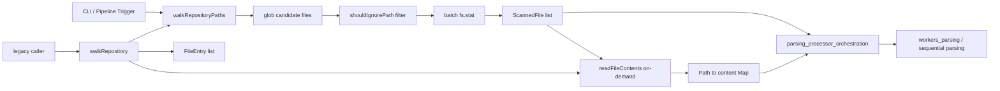
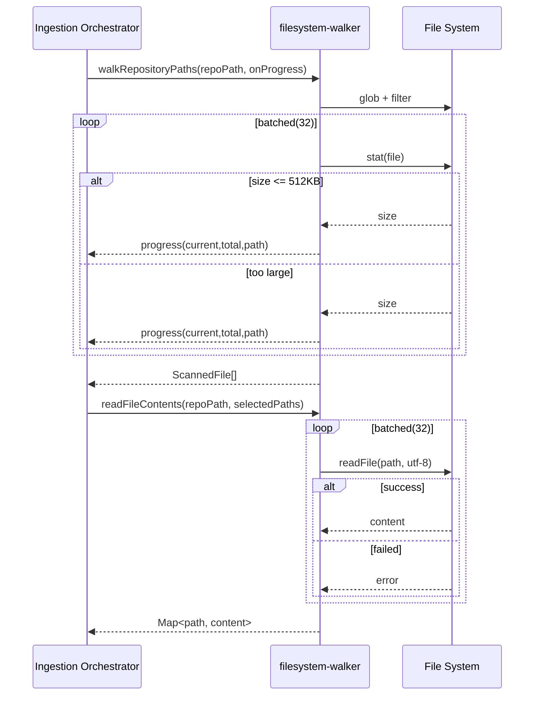

# filesystem_scanning_and_loading 模块文档

## 模块简介

`filesystem_scanning_and_loading` 模块是 GitNexus 摄取（ingestion）链路的文件系统入口层，负责把“仓库路径”转换为后续解析流程可消费的文件集合。它提供了一个明确的两阶段模型：第一阶段只扫描路径并获取文件大小，第二阶段按需读取文件内容。这种设计的核心价值不是功能丰富，而是**在大仓库场景下控制内存占用、隔离 I/O 风险、为并行解析提供可裁剪输入**。

在没有这个模块时，系统很容易退化为“递归遍历 + 全量读入内存”的朴素实现。对于十万级文件仓库，这会迅速放大内存峰值和 I/O 抖动，甚至导致后续 Tree-sitter 解析阶段崩溃。该模块通过忽略规则过滤、文件大小上限、分批并发读取等机制，把最容易失控的入口问题在最早阶段处理掉。

从系统位置看，它属于 `core_ingestion_parsing` 的前置输入组件，上游通常由 CLI 或 pipeline 触发，下游被解析编排层和 worker 解析层消费。建议结合阅读：

- 解析编排：[`parsing_processor_orchestration.md`](parsing_processor_orchestration.md)
- 并行 worker 解析：[`workers_parsing.md`](workers_parsing.md)
- AST 缓存策略：[`ast_cache_management.md`](ast_cache_management.md)

---

## 设计目标与设计取舍

该模块围绕三个现实问题做了非常务实的设计取舍。第一，它优先保证“可处理超大仓库”，因此不默认加载文件内容，而是先做轻量扫描。第二，它优先保证“解析稳定性”，因此直接在入口层跳过超过 `512KB` 的大文件，避免把典型的 generated/vendored 文件送入解析器。第三，它优先保证“吞吐而非单文件极致性能”，因此采用固定并发窗口（`READ_CONCURRENCY = 32`）批量执行 `stat` 与 `readFile`。

这也意味着它并不是一个通用文件系统 SDK，而是一个服务于代码摄取流程的、有明确偏向的模块：对失败容忍、对内存保守、对输入质量有硬约束。

---

## 核心类型与函数

### `FileEntry`

```ts
export interface FileEntry {
  path: string;
  content: string;
}
```

`FileEntry` 是“完整文件载荷”结构，包含相对路径和文件内容文本。它主要用于 legacy 全量读取路径（`walkRepository` 返回值），以及某些顺序回退流程。由于包含 `content`，在大仓库里内存成本较高，不适合作为默认批处理形态。

### `ScannedFile`

```ts
export interface ScannedFile {
  path: string;
  size: number;
}
```

`ScannedFile` 是本模块推荐的轻量中间结果，只保留路径与 `stat.size`。它允许上层先进行筛选、切片、调度，再决定是否读取内容，从而显著降低常驻内存。

### `FilePath`

```ts
export interface FilePath {
  path: string;
}
```

`FilePath` 是纯路径引用类型，主要用于类型签名统一与语义表达。它本身没有行为逻辑，但在跨模块参数定义中能提高可读性。

### `walkRepositoryPaths(repoPath, onProgress?)`

```ts
export const walkRepositoryPaths = async (
  repoPath: string,
  onProgress?: (current: number, total: number, filePath: string) => void
): Promise<ScannedFile[]>
```

这是模块最核心的入口函数。它执行流程如下：

1. 通过 `glob('**/*', { cwd: repoPath, nodir: true, dot: false })` 收集候选文件。
2. 使用 `shouldIgnorePath` 进行路径过滤。
3. 以 `READ_CONCURRENCY`（32）为窗口分批执行 `fs.stat`。
4. 跳过超过 `MAX_FILE_SIZE`（`512 * 1024`）的文件。
5. 对保留文件输出 `{ path, size }`，并统一将路径分隔符标准化为 `/`。
6. 通过 `onProgress` 回调报告进度。

返回值是 `ScannedFile[]`，只包含可继续进入解析流水线的轻量文件元数据。

### `readFileContents(repoPath, relativePaths)`

```ts
export const readFileContents = async (
  repoPath: string,
  relativePaths: string[],
): Promise<Map<string, string>>
```

该函数负责第二阶段“按需读取内容”。它按同样的并发窗口分批调用 `fs.readFile(fullPath, 'utf-8')`，并将成功结果写入 `Map<string, string>`，键为相对路径。读取失败会被静默跳过，不抛出中断异常。

使用 `Map` 的设计意图是让上层在合并 `ScannedFile` 与内容时获得 O(1) 查询性能。

### `walkRepository(repoPath, onProgress?)`

```ts
export const walkRepository = async (
  repoPath: string,
  onProgress?: (current: number, total: number, filePath: string) => void
): Promise<FileEntry[]>
```

这是兼容旧流程的 API，会先调用 `walkRepositoryPaths`，再对全部扫描结果调用 `readFileContents`，最后拼成 `FileEntry[]`。由于它把“扫描+读取”合并成全量行为，内存压力更大，注释也明确说明它主要服务于 sequential fallback 场景。

---

## 架构关系



这个架构体现了该模块的真正价值：它不是“简单遍历目录”，而是把输入准备拆成轻量元数据和重载荷内容两个层次，使编排层可以基于资源预算和执行策略动态决定读取范围。

---

## 处理时序与数据流



时序上可以看到，进度回调发生在 `stat` 结果处理阶段，而非内容读取阶段。因此如果上层 UI 需要“读取进度”，需要在调用 `readFileContents` 时额外封装自己的进度机制。

---

## 关键内部机制解读

### 1. 双阶段扫描/读取模型

`walkRepositoryPaths` 与 `readFileContents` 的拆分是模块最关键的设计。前者产物体积小、可快速遍历、适合大规模调度；后者只在确有必要时加载文本，避免“先读再筛”的浪费。这一模式与后续 worker 分发天然兼容，因为 worker 输入可以按需切片，而不是一次搬运整个仓库源码。

### 2. 固定并发窗口

模块使用常量 `READ_CONCURRENCY = 32` 控制 `stat/readFile` 批次大小。固定窗口实现简单且稳定，能在多数机器上获得可接受吞吐，同时避免无限并发导致 fd 压力与 I/O 抢占。它不是自适应调度，因此不同硬件下可能并非最优，但工程复杂度低。

### 3. 大文件硬过滤

`MAX_FILE_SIZE = 512KB` 是入口层“保护阈值”。代码注释已说明动机：超大文件通常是 generated/vendored，且容易触发 Tree-sitter 崩溃或严重退化。该策略提前淘汰风险输入，代价是可能漏掉某些真实但较大的源码文件。

### 4. 路径规范化

在扫描成功分支中，路径会执行 `relativePath.replace(/\\/g, '/')`，把 Windows 风格分隔符统一成 `/`。这对后续跨平台 ID 生成、Map 键一致性和图谱关系归并非常重要。

### 5. 失败容忍策略

两阶段函数都采用 `Promise.allSettled`。这意味着单个文件 `stat`/`readFile` 失败不会中断整个批次，模块以“尽量产出可用结果”为原则运行。这与代码摄取任务的实务需求一致：面对脏仓库、权限差异、瞬时 I/O 异常时，优先完成大部分可解析文件。

---

## 配置与可调参数

当前模块没有对外暴露运行时配置对象，关键参数以内置常量形式存在：

- `READ_CONCURRENCY = 32`
- `MAX_FILE_SIZE = 512 * 1024`
- `glob(..., dot: false, nodir: true)`
- `shouldIgnorePath(file)`（来自 `ignore-service`）

如果要扩展模块可配置性，通常会优先把并发度和大小阈值外置；其次让 `dot` 和 ignore 策略可注入，以适配更复杂仓库规范。

---

## 使用示例

### 示例 1：推荐的两阶段使用方式

```ts
import { walkRepositoryPaths, readFileContents } from './filesystem-walker';

const scanned = await walkRepositoryPaths('/path/to/repo', (cur, total, file) => {
  if (cur % 1000 === 0) {
    console.log(`[scan] ${cur}/${total} ${file}`);
  }
});

// 例如：只读取前 5000 个候选文件，或按语言/目录再筛一轮
const selectedPaths = scanned.slice(0, 5000).map(f => f.path);
const contentMap = await readFileContents('/path/to/repo', selectedPaths);

for (const file of scanned) {
  const content = contentMap.get(file.path);
  if (!content) continue; // 读取失败或未选中
  // 交给 parse worker / sequential parser
}
```

### 示例 2：兼容旧流程（不建议默认用于大仓库）

```ts
import { walkRepository } from './filesystem-walker';

const entries = await walkRepository('/path/to/repo', (cur, total, file) => {
  console.log(`[legacy] ${cur}/${total} ${file}`);
});

// entries: FileEntry[]，每项都带 content
```

---

## 边界行为、错误条件与限制

### 1) `readFileContents` 静默跳过读取失败

函数只收集 fulfilled 结果，不会抛出聚合错误。优点是任务鲁棒；缺点是调用方如果不做比对，可能误以为文件都已读取。建议上层按 `requestedPaths.length` 与 `contents.size` 做差异统计。

### 2) 进度总数基于过滤后候选集，而非最终可读集

`walkRepositoryPaths` 的 `total` 使用 `filtered.length`，其中包含后续可能被“大文件规则”或 `stat` 失败淘汰的文件。因此 UI 看到“100% 完成”仅表示扫描过程走完，不代表所有文件都进入可解析集合。

### 3) 隐藏文件默认不扫描

`glob` 参数 `dot: false` 会忽略以 `.` 开头的文件/目录。这通常是预期（如 `.git`），但也会跳过某些项目把源码放在隐藏目录下的情况。

### 4) 编码假设固定为 UTF-8

`readFileContents` 使用 `'utf-8'` 读取文本。对非 UTF-8 文件可能出现解码异常并被静默忽略。若目标仓库包含混合编码，需要在上层加编码探测或容错读取策略。

### 5) 大文件阈值是硬编码策略

超过 512KB 的文件会被直接跳过，且只通过 `console.warn` 汇总提示。若你的仓库确实有大量“大但关键”的源码文件，需要修改常量或做模块扩展。

### 6) 失败路径中的回调文件名可能不是标准化路径

扫描成功时返回的是 `/` 规范化路径；失败分支进度回调使用原始批次路径字符串。跨平台日志分析时要注意格式可能不完全一致。

### 7) 并发常量在极端环境可能不合适

固定 `32` 在低资源容器或网络文件系统场景可能偏高，在高性能 NVMe 机器上又可能偏低。当前实现没有自适应机制。

---

## 扩展建议

如果你计划扩展本模块，建议优先沿着以下方向演进：

1. 将并发度、大小阈值、`glob` 选项外置成配置对象，并允许从 pipeline 配置注入。
2. 为 `readFileContents` 增加可选错误回调或统计对象，保留鲁棒性的同时提升可观测性。
3. 增加“按扩展名/目录白名单”预筛选钩子，减少无意义 I/O。
4. 让进度事件区分 `scan` 与 `read` 阶段，便于前端展示真实阶段性进度。

这些扩展都可以在不破坏现有 API 语义的前提下逐步引入。

---

## 与其他模块的协作边界

`filesystem_scanning_and_loading` 只负责文件发现与内容加载，不负责 AST 构建、符号抽取、导入解析或图谱入库。具体来说：

- AST 缓存与生命周期管理不在此模块，见 [`ast_cache_management.md`](ast_cache_management.md)。
- worker 内语法查询、调用/继承抽取不在此模块，见 [`workers_parsing.md`](workers_parsing.md)。
- 解析结果编排与后续处理对接不在此模块，见 [`parsing_processor_orchestration.md`](parsing_processor_orchestration.md)。

保持这条边界有助于后续维护：入口层稳定、解析层可独立演进、解析后推理可持续增强。
