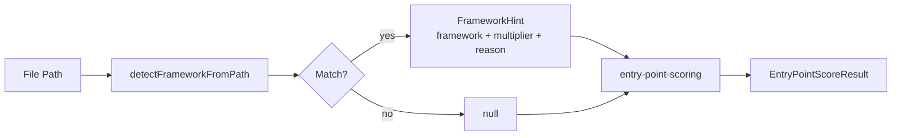
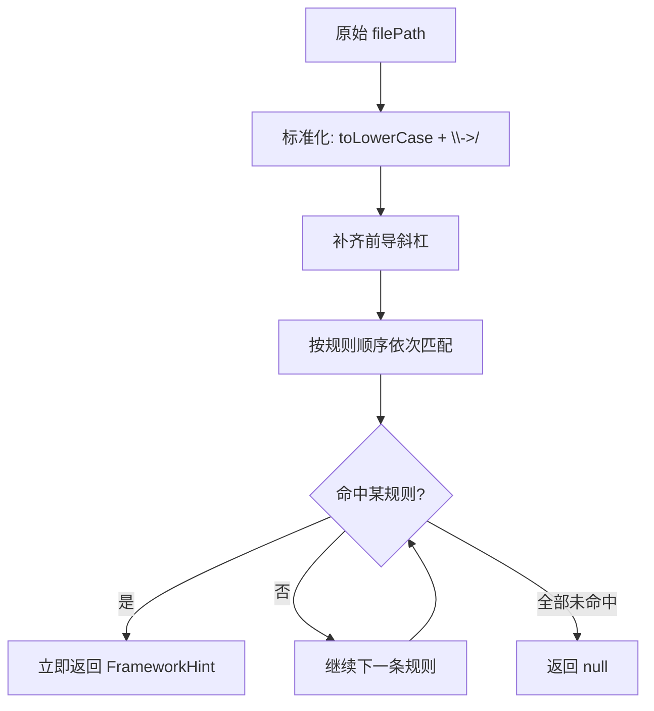
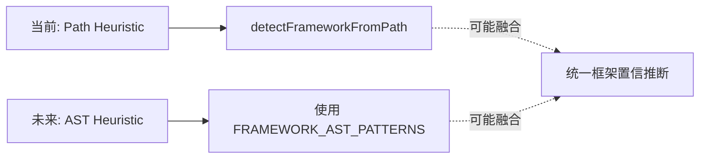

# framework_detection 模块

## 模块简介

`framework_detection` 模块位于 `gitnexus/src/core/ingestion/framework-detection.ts`，是 Entry Intelligence 子系统中的一个轻量但高价值的“启发式识别器”。它的职责很聚焦：**仅通过文件路径（file path）判断代码很可能属于哪个框架约定，并返回一个用于入口点评分的乘数（entryPointMultiplier）**。

这个模块存在的核心原因是：在跨语言、跨框架的代码库中，单靠调用图统计（例如 caller/callee 比值）往往不够。很多真实入口点并不一定拥有最“显眼”的图结构特征，但它们会稳定地出现在框架约定位置，比如 `app/page.tsx`、`views.py`、`Controller.java`、`routes/web.php`。`framework_detection` 通过把这些“约定知识”编码成路径规则，在不增加 AST 解析成本的前提下，显著提升入口点排序质量。

从设计哲学看，该模块遵循“增强而不破坏”原则：检测不到框架时返回 `null`，上游评分逻辑自然退化为 `1.0` 乘数，即不加分也不扣分，行为与引入该模块之前一致。这使得它可以安全接入已有流程，不会因规则不全而引发大面积误伤。

---

## 在系统中的位置与关系

`framework_detection` 不是独立 pipeline，而是被 `entry-point-scoring` 调用的一个辅助能力。它从文件路径接收输入，返回 `FrameworkHint`，再由入口点评分模块合并进最终得分。



上图体现了该模块的边界：它不解析代码、不访问图数据库、不依赖符号表，仅做字符串模式匹配。若你希望先了解它在更大范围中的编排角色，建议配合阅读 [entry_intelligence.md](entry_intelligence.md) 与 [process_detection_and_entry_scoring.md](process_detection_and_entry_scoring.md)。

---

## 核心数据结构：`FrameworkHint`

`FrameworkHint` 是本模块唯一导出的核心接口，用于表达“识别结果 + 评分提示”。

```typescript
export interface FrameworkHint {
  framework: string;
  entryPointMultiplier: number;
  reason: string;
}
```

其中，`framework` 是框架或约定类别标识（如 `nextjs-app`、`django`、`spring`、`laravel`）；`entryPointMultiplier` 是建议乘数，通常在 `1.5 ~ 3.0`；`reason` 是规则命中原因（如 `nextjs-app-page`、`django-views`），用于可解释性与调试追踪。

这个结构本身不携带置信度分值，也不保留候选列表。也就是说，当前实现是“首个命中即返回”的单结果模型，而不是多候选排序模型。

---

## 核心函数：`detectFrameworkFromPath(filePath)`

### 函数签名

```typescript
export function detectFrameworkFromPath(filePath: string): FrameworkHint | null
```

### 输入与输出语义

该函数接收任意文件路径字符串，输出要么是 `FrameworkHint`，要么是 `null`。`null` 代表“无法确定框架特征”，并非错误状态。函数是纯函数：无 I/O、副作用、全局状态修改，给定同样输入必定输出同样结果。

### 内部执行流程



函数先做路径标准化，再进入分组规则匹配。标准化步骤包含三点：

1. 全路径转小写，避免大小写差异导致漏检。
2. 将 Windows 分隔符 `\\` 替换为 `/`，统一为 POSIX 风格。
3. 若没有前导 `/`，自动补齐，保证像 `/app/` 这样的规则可稳定命中。

随后模块按固定顺序检查规则，命中后立即返回。这意味着**规则顺序本身就是优先级策略**。

---

## 规则体系与乘数策略

当前规则覆盖 JavaScript/TypeScript、Python、Java、C#/.NET、Go、Rust、C/C++、PHP/Laravel，以及少量通用模式。整体策略是“越接近真实入口约定，乘数越高”。

### 高权重（约 3.0）

高权重通常给“框架明确入口”或“典型请求接入层”文件，例如 Next.js `page.*`、Django `views.py`、Spring/ASP.NET `Controller`、Go/Rust/C 的 `main`、Laravel routes/controllers。

### 中权重（约 2.0~2.5）

中权重用于“强相关入口层但不一定是唯一主入口”的场景，例如 layout、router、handler、middleware、jobs、listeners。

### 低权重增强（约 1.5~1.8）

低权重用于“业务关键但通常非直接入口”的分层，如 models/services/repositories/providers，或通用 API 索引文件。

下面给出一个摘要视图（非完整清单）：

| 语言/生态 | 典型路径模式 | `framework` | multiplier |
|---|---|---|---|
| Next.js | `/app/**/page.tsx` 等 | `nextjs-app` | 3.0 |
| Next.js | `/pages/**`（排除 `_` 与 `/api/`） | `nextjs-pages` | 3.0 |
| Django | `views.py` | `django` | 3.0 |
| Spring | `/controller/` 或 `*Controller.java` | `spring` | 3.0 |
| ASP.NET | `/controllers/*.cs` 或 `*Controller.cs` | `aspnet` | 3.0 |
| Go | `/main.go` | `go` | 3.0 |
| Rust | `/main.rs` | `rust` | 3.0 |
| Laravel | `/routes/*.php`、`*Controller.php` | `laravel` | 3.0 |
| React 组件 | `/components/*.tsx` + PascalCase（设计意图） | `react` | 1.5 |
| 通用 API 索引 | `/api/index.ts` 等 | `api` | 1.8 |

如需精确规则细节，请直接以源码为准；文档中的表格用于帮助理解乘数分层思想。

---

## 未来能力：`FRAMEWORK_AST_PATTERNS`

模块还导出了 `FRAMEWORK_AST_PATTERNS` 常量，里面列出了各框架在代码层的典型 decorator/annotation/macro 线索，例如 `@Controller`、`@app.get`、`[ApiController]`、`Route::get` 等。

需要强调的是：**这部分在当前模块中仅是“模式词典”，并未被 `detectFrameworkFromPath` 调用**。它更像 Phase 3 的预留资产，供未来 AST 级别检测器接入。换言之，当前线上行为完全由路径规则决定。



---

## 使用方式

在上游入口点评分逻辑中，典型调用如下：

```typescript
import { detectFrameworkFromPath } from './framework-detection.js';

const hint = detectFrameworkFromPath('/src/app/page.tsx');

const frameworkMultiplier = hint?.entryPointMultiplier ?? 1.0;
const reason = hint?.reason; // 可写入 reasons[] 用于解释
```

如果你只是单独验证规则，也可以直接调用：

```typescript
console.log(detectFrameworkFromPath('backend/routes/web.php'));
// => { framework: 'laravel', entryPointMultiplier: 3.0, reason: 'laravel-routes' }

console.log(detectFrameworkFromPath('src/lib/math.ts'));
// => null
```

---

## 扩展与维护建议

这个模块的扩展成本很低，但也容易因为“规则顺序”引入回归。实践中建议遵循以下策略：

- 新增规则时，先明确它属于高优先级还是兜底规则，再决定插入位置。
- 尽量让 `reason` 命名稳定、语义清晰，便于上游做统计与调试。
- 同类规则保持一致的文件后缀约束，避免跨语言误命中。
- 对高风险规则（如通用目录名 `controllers`、`services`）增加更具体条件，降低误报。

一个最小扩展示例如下：

```typescript
// 示例：新增 Ruby on Rails controller 检测
if (p.includes('/app/controllers/') && p.endsWith('_controller.rb')) {
  return {
    framework: 'rails',
    entryPointMultiplier: 3.0,
    reason: 'rails-controller',
  };
}
```

---

## 边界条件、错误风险与已知限制

### 1) “首个命中即返回”导致的遮蔽效应

因为函数在第一条命中规则处直接返回，后续更具体规则可能永远执行不到。维护时如果把“泛化规则”放在“精确规则”之前，会导致结果偏差。

### 2) React PascalCase 规则在当前实现下几乎不会命中

函数一开始把路径整体 `toLowerCase()`，随后又用 `/^[A-Z]/` 检查文件名首字母是否大写。由于文件名已被转小写，该检查实际上失效。这意味着设计意图中的 “PascalCase React 组件加权” 在现实现版本中会被抑制。

### 3) Go `/cmd/` 条件存在逻辑问题

规则中包含 `p.endsWith('/cmd/') && p.endsWith('.go')` 的并列判断，这在同一字符串上通常不可能同时为真（除非路径既以 `/cmd/` 结尾又以 `.go` 结尾）。因此该分支基本不可达，实际有效的是 `p.endsWith('/main.go')` 部分。

### 4) 部分框架后缀覆盖不完整

例如 Next.js App Router API 只检查 `route.ts`，未覆盖 `route.js` 等变体；layout 规则只覆盖 `.ts/.tsx`。如果项目使用不同扩展名，可能漏检。

### 5) 纯路径启发式的天然上限

如果项目目录结构不遵循社区约定，或者采用高度自定义命名，路径规则无法准确判断。此时它会回退为 `null`，不会造成错误惩罚，但也无法提供增强收益。

---

## 性能与可观测性

该模块执行本质是若干 `includes/endsWith` 字符串判断，复杂度与规则数量线性相关，近似 `O(R)`。在 ingestion 中可视为极低开销步骤，适合高频调用。

可观测性主要依赖 `reason` 字段。建议在上游统计“各 reason 命中分布”，这可以帮助你判断规则是否偏科、是否需要新增生态支持、是否出现异常激增的误报模式。

---

## 与其他文档的关系

为了避免重复，以下主题建议阅读对应文档：

- 入口点评分总流程与乘法模型：见 [entry_intelligence.md](entry_intelligence.md)
- 进程检测如何消费入口评分结果：见 [process_detection_and_entry_scoring.md](process_detection_and_entry_scoring.md)
- 图模型与调用边基础结构：见 [graph_domain_types.md](graph_domain_types.md)

本篇文档只聚焦 `framework_detection` 本身的规则逻辑与工程边界。
