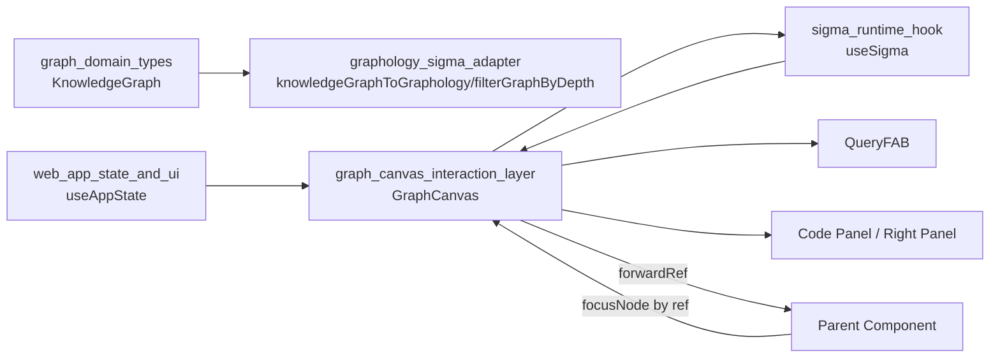
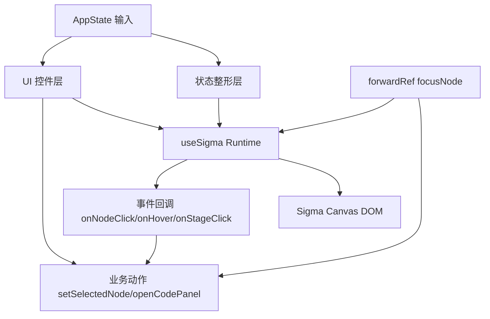
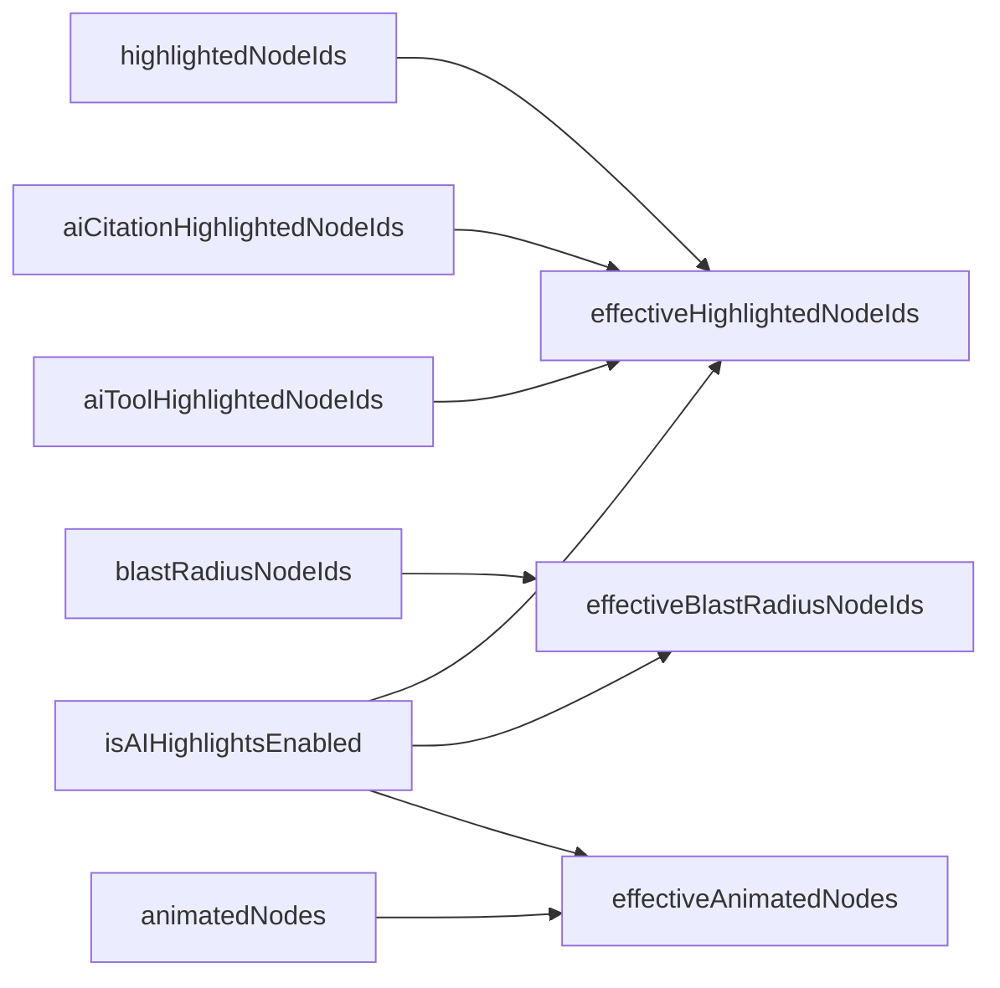
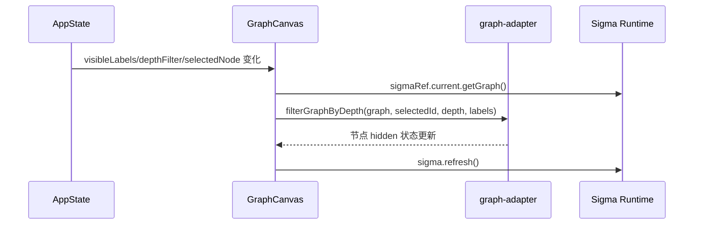
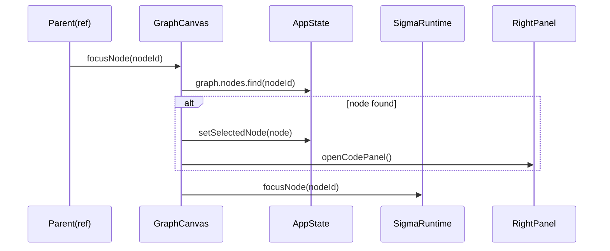
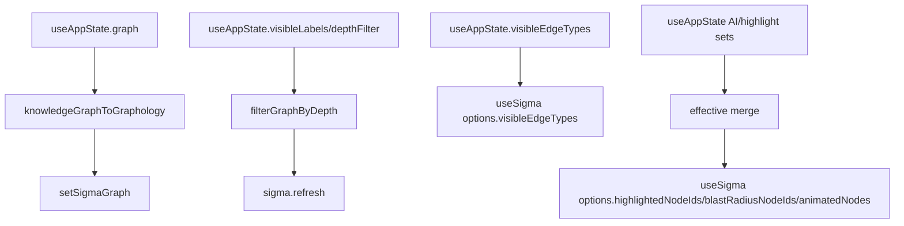
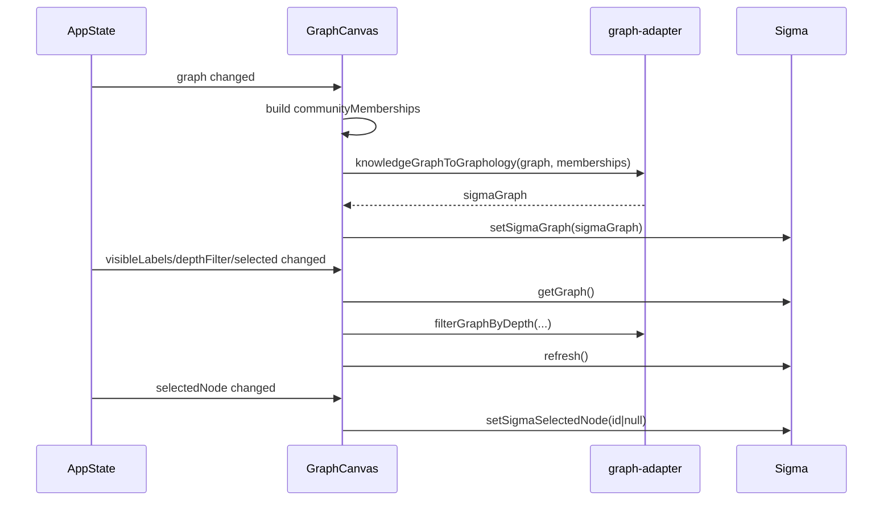

# graph_canvas_interaction_layer 模块文档

## 模块简介

`graph_canvas_interaction_layer` 对应 `gitnexus-web/src/components/GraphCanvas.tsx`，是 `gitnexus-web` 图可视化前端中的“交互编排层（interaction orchestration layer）”。如果说 `graphology_sigma_adapter` 负责把领域图数据转成可渲染图结构，`sigma_runtime_hook` 负责驱动渲染运行时，那么本模块的职责就是把“业务状态（AppState）”和“渲染能力（useSigma）”整合成最终用户可操作的图交互体验，包括节点选中、悬停提示、缩放/聚焦、布局控制、过滤生效、AI 高亮开关，以及对外暴露命令式接口。

这个模块存在的核心原因是：图渲染引擎本身只理解图和事件，不理解应用语义。比如“点击节点后要打开代码面板”“AI 高亮关闭时要清空某些高亮状态”“深度过滤变化后要刷新隐藏节点”，这些都属于产品行为逻辑，需要一个单点组件统一编排，否则状态会分散在多个 hook 与子组件中，导致交互不一致与维护成本急剧上升。

从架构定位看，`GraphCanvas` 不是纯展示组件，而是一个**状态桥接器 + 控制面板容器 + 外部命令入口**。它通过 `forwardRef` 暴露 `GraphCanvasHandle`，允许父组件在不触发复杂 UI 事件模拟的前提下直接执行聚焦行为，这在“从搜索结果跳转到图节点”“从聊天引用定位到代码实体”等跨模块场景中非常关键。

---

## 核心组件与导出

本模块当前核心导出类型为：

```ts
export interface GraphCanvasHandle {
  focusNode: (nodeId: string) => void;
}
```

虽然导出面很小，但实现体 `GraphCanvas` 承担了完整的交互编排工作。`focusNode` 的语义并不只是相机移动：它还会尝试同步应用层选中状态并打开代码面板，确保“视觉焦点”和“业务焦点”一致。

---

## 在系统中的位置



这张图的重点是 `GraphCanvas` 在上下游之间形成“状态-渲染双向桥接”：

`useAppState` 提供业务状态（选中节点、过滤条件、AI 高亮、动画节点等），`useSigma` 提供渲染命令和底层事件，`GraphCanvas` 负责把两者绑定成最终行为闭环。父组件若要进行外部导航，只需调用 `GraphCanvasHandle.focusNode` 即可，不需要了解 Sigma 或 Graphology 的细节。

建议联读以避免重复信息：
- [graph_domain_types.md](graph_domain_types.md)
- [graphology_sigma_adapter.md](graphology_sigma_adapter.md)
- [sigma_runtime_hook.md](sigma_runtime_hook.md)

---

## 模块树依赖映射（基于当前 module tree）

在 `web_graph_types_and_rendering` 这条子树中，`graph_canvas_interaction_layer` 处于“领域类型 + 渲染运行时”之间的交互中枢位置。它直接消费 `graph_domain_types` 提供的 `KnowledgeGraph/GraphNode/GraphRelationship` 语义对象，通过 `graphology_sigma_adapter` 把领域图转换为 Sigma 可消费的 Graphology 图结构，再把用户交互和视觉控制委托给 `sigma_runtime_hook`。换句话说，这个模块并不创造新的图语义，也不实现底层渲染算法，而是负责把“语义状态”与“渲染能力”拼接为稳定的产品交互。

如果把整套前端图系统拆成三层，最底层是数据和类型（`graph_domain_types`），中间层是适配与运行时（`graphology_sigma_adapter` + `sigma_runtime_hook`），最上层是用户交互编排（本模块）。这种分层使得未来替换渲染引擎或扩展交互功能时，不需要同时改动图语义定义，从而降低演进风险。

---

## 内部架构与交互分层



可以把 `GraphCanvas` 理解为四层：

第一层是**状态输入层**，读取 `useAppState` 的图数据与 UI 状态。第二层是**状态整形层**，把高亮/爆炸半径/动画这些业务集合转成 `useSigma` 所需的“有效态”（effective state）。第三层是**渲染控制层**，调用 `useSigma` 提供的缩放、布局、选中等命令。第四层是**UI 与命令暴露层**，呈现按钮与提示条，并通过 ref 对外开放聚焦能力。

这使得模块具备较好的可维护性：业务语义变化通常只需调整状态整形和事件逻辑，而不必修改底层渲染 hook。

---

## 关键状态与计算逻辑

## 1) AI 高亮有效集计算

组件通过 `useMemo` 维护三个“有效态”：

- `effectiveHighlightedNodeIds`
- `effectiveBlastRadiusNodeIds`
- `effectiveAnimatedNodes`

其中 `effectiveHighlightedNodeIds` 在 AI 高亮开启时会合并：手动高亮 + AI citation 高亮 + AI tool 高亮；关闭时仅保留手动高亮。`blastRadius` 与动画也在 AI 开关关闭时整体失效。

这种设计的价值是把“是否启用 AI 视觉信号”作为一个全局阀门，而不是让每个渲染分支自行判断，能显著减少状态冲突。



当 `isAIHighlightsEnabled=false` 时，`blastRadius` 和 `animatedNodes` 会被短路成空集合，视觉上立刻归一。

## 2) 节点交互回调

`handleNodeClick(nodeId)` 会在 `graph.nodes` 中定位节点对象，若存在则调用 `setSelectedNode(node)` 并 `openCodePanel()`。这意味着点击行为不仅改变图状态，也触发右侧信息面板联动。

`handleNodeHover(nodeId | null)` 用于维护顶部悬停 tooltip 文本；当节点不存在或离开节点时重置为 `null`。这里采用“按 id 查业务节点”的方式，而不是使用 Sigma 属性中的 label，保证展示名来自统一领域对象（`node.properties.name`）。

`handleStageClick()` 用于清空选中，保持“点击空白处取消选择”的常见交互约定。

## 3) AppState 与 Sigma 选中同步

组件维护了双向同步机制：

- AppState → Sigma：监听 `appSelectedNode`，调用 `setSigmaSelectedNode`
- Sigma/事件 → AppState：节点点击时调用 `setSelectedNode`

这保证了无论选中来自图点击、外部 ref 调用、还是其他 UI 行为，最终展示都一致。

---

## 图数据装载与过滤机制

## 1) KnowledgeGraph 到 Graphology 的转换触发

当 `graph` 变化时，组件会先扫描 `MEMBER_OF` 关系构建 `communityMemberships`，再调用 `knowledgeGraphToGraphology(graph, communityMemberships)` 并传入 `setSigmaGraph`。

关键细节是社区 id 的提取逻辑：假设社区节点 id 形如 `comm_5`，通过 `parseInt(rel.targetId.replace('comm_', ''), 10)` 提取索引。若解析失败回落到 `0`。这是一种约定驱动的实现，要求上游社区节点命名尽量遵循该格式。

## 2) 深度过滤与标签过滤

另一个 `useEffect` 在过滤条件变化时执行：

- 获取当前 Sigma 图
- 若图为空（`order === 0`）直接返回
- 调用 `filterGraphByDepth(sigmaGraph, appSelectedNode?.id || null, depthFilter, visibleLabels)`
- 调用 `sigma.refresh()`

这条路径体现了“软过滤”策略：不重建图结构，仅更新隐藏状态并刷新渲染。



---

## 关键函数与副作用明细（实现级）

虽然 `GraphCanvas.tsx` 只导出 `GraphCanvasHandle`，但组件内部有一组关键函数共同决定了交互语义。为了便于维护，这里按“输入参数 → 主要逻辑 → 可见副作用”的方式说明。

### `handleNodeClick(nodeId: string): void`

该函数接收 Sigma 事件中的 `nodeId`，在 `appState.graph.nodes` 中做一次查找；若命中，会执行 `setSelectedNode(node)` 与 `openCodePanel()`。它不返回值，核心副作用是同时改变“全局选中状态”和“右侧面板显示状态”。这意味着它是一个跨子系统动作：既影响图层，也影响 UI 布局。

### `handleNodeHover(nodeId: string | null): void`

当 `nodeId` 为空或 `graph` 不可用时，将 `hoveredNodeName` 清空；否则查找节点并读取 `node.properties.name` 赋值给本地状态。该函数的副作用仅作用于组件内部 tooltip 文本，不会写入 AppState，因此属于“轻量 UI 状态”。

### `handleStageClick(): void`

点击空白画布时调用，固定执行 `setSelectedNode(null)`。该函数的设计目的很明确：提供“退出上下文”的统一手势，避免用户被持久选中状态困住。

### `handleFocusSelected(): void`

当存在 `appSelectedNode` 时调用 `focusNode(appSelectedNode.id)`。它的返回值为 `void`，副作用在相机层（视角平移/缩放），不会主动改变选中状态；选中状态依然由 AppState 主导。

### `handleClearSelection(): void`

顺序执行 `setSelectedNode(null)`、`setSigmaSelectedNode(null)`、`resetZoom()`。这是一个“强清理”动作，不仅清空业务与渲染层选中，还会重置视角。维护时请特别注意其语义强度，因为它会改变用户当前观察位置。

### `GraphCanvasHandle.focusNode(nodeId: string): void`

这是对外暴露的命令式 API。内部先尝试从 `appState.graph` 查找节点并同步选中+打开代码面板，再调用 `useSigma.focusNode(nodeId)`。返回值为 `void`，副作用同时跨越业务层和渲染层。若节点在 AppState 中不存在但在 Sigma 图中存在，仍可能发生相机聚焦，这是一种“尽力而为”的容错策略。



上图反映了一个重要实现原则：`GraphCanvasHandle` 的行为不是纯渲染命令，而是“带业务同步的导航命令”。

---


## GraphCanvasHandle：命令式 API 语义

`GraphCanvas` 使用 `useImperativeHandle` 暴露：

```ts
focusNode(nodeId: string): void
```

其内部流程是两段式：

1. 先尝试在业务图中找到对应节点，找到则同步 `setSelectedNode(node)` 并 `openCodePanel()`；
2. 无论是否找到业务节点，都调用 `useSigma.focusNode(nodeId)` 尝试执行相机聚焦。

这种设计兼容“数据同步存在短时延迟”的场景：即使 AppState 图中尚未找到节点，底层渲染层仍可能已具备该节点并可聚焦。

---

## UI 控件与行为映射

右下角控件区、顶部提示条与右上角 AI 开关构成了主要交互面：

- Zoom In / Zoom Out / Fit to Screen 分别绑定 `zoomIn`、`zoomOut`、`resetZoom`
- Focus（仅选中时显示）绑定 `handleFocusSelected`
- Clear（选中时显示）绑定 `handleClearSelection`
- Layout 按钮根据 `isLayoutRunning` 在 `startLayout` 与 `stopLayout` 间切换
- AI highlights toggle 关闭时会先 `setHighlightedNodeIds(new Set())` 再 `toggleAIHighlights()`

注意 `handleClearSelection` 不仅清空 app/sigma 选中，还会执行 `resetZoom`，其语义是“回到全局视角并退出上下文聚焦”。

---

## 使用方式示例

### 1) 父组件通过 ref 聚焦节点

```tsx
import { useRef } from 'react';
import { GraphCanvas, GraphCanvasHandle } from '@/components/GraphCanvas';

export function GraphPage() {
  const canvasRef = useRef<GraphCanvasHandle>(null);

  const jumpToNode = (nodeId: string) => {
    canvasRef.current?.focusNode(nodeId);
  };

  return (
    <>
      <button onClick={() => jumpToNode('function:src/app.ts#main')}>Jump</button>
      <GraphCanvas ref={canvasRef} />
    </>
  );
}
```

这个模式适合与搜索结果面板、AI 引用列表、代码引用面板做联动。

### 2) 与 AppState 的典型联动场景

当外部模块（例如查询面板）调用 `setHighlightedNodeIds(...)` 或更新 `depthFilter` 时，`GraphCanvas` 无需额外配置即可自动触发刷新与过滤；当用户点击节点时，`GraphCanvas` 反向更新 `selectedNode` 并打开代码面板，形成闭环。

---
## 配置入口与行为开关（通过状态而非 props）

`GraphCanvas` 本身没有对外 props（当前实现 `forwardRef<GraphCanvasHandle>((_, ref) => ...)`），因此它的“配置面”几乎完全来自 `useAppState`。这是一种有意设计：把交互行为集中到全局状态层，避免组件树层层透传。

从实现看，最关键的可配置输入有四类。第一类是图基础数据，即 `graph: KnowledgeGraph | null`，它决定是否能够构建 Sigma 图、是否能进行 id 到业务节点的映射。第二类是过滤配置，即 `visibleLabels`、`visibleEdgeTypes`、`depthFilter`，它们分别参与节点可见性和边类型显示控制。第三类是查询与 AI 视觉信号，即 `highlightedNodeIds`、`aiCitationHighlightedNodeIds`、`aiToolHighlightedNodeIds`、`blastRadiusNodeIds`、`animatedNodes` 与总开关 `isAIHighlightsEnabled`。第四类是面板联动配置，即 `selectedNode` 与 `openCodePanel()`，它们决定点击后的信息呈现路径。

这些状态并不会直接传给 Sigma，而是先经过本模块的“effective 状态规整”。例如 `visibleEdgeTypes` 会直接透传到 `useSigma`，而多个高亮集合会被 merge 成单一 `effectiveHighlightedNodeIds`，再下发给渲染层。这个分层让你可以在 AppState 中自由扩展状态来源，而不破坏渲染 API 稳定性。



这张图说明了一个维护要点：配置入口在 `useAppState`，但生效点分布在“图构建、图过滤、渲染选项”三条路径上，排查问题时要按路径定位。

---

## 生命周期与响应式更新顺序

该模块内部有三个关键 `useEffect`，它们构成了图交互更新链路。第一条链路在 `graph` 变化时触发，负责重建 Graphology 图并注入 Sigma；第二条链路在过滤条件变化时触发，负责更新 hidden 状态并刷新；第三条链路在 `appSelectedNode` 变化时触发，负责把业务选中同步给 Sigma。



这个顺序解释了为什么某些场景下你会看到“先有图再有过滤效果”：过滤 effect 需要 Sigma 图已存在，空图场景会被 guard clause 直接跳过。

---


## 扩展与定制建议

如果你需要扩展 `graph_canvas_interaction_layer`，优先从以下方向入手：

- 新增命令式能力时，可在 `GraphCanvasHandle` 增加方法（例如 `resetView`、`runLayout`），并通过 `useImperativeHandle` 显式桥接到 `useSigma` 或 AppState 行为。
- 需要新增视觉状态（例如“告警节点”）时，建议在 AppState 先形成独立集合，再在 `GraphCanvas` 内部做 effective merge，保持状态来源清晰。
- 若需要新的过滤维度（例如按文件路径/语言过滤），建议沿用当前“更新 Graphology hidden + refresh”的模式，避免频繁重建图。
- 若社区 id 格式将来变化，建议把 `comm_` 解析规则提取为工具函数，避免命名约定散落在组件中。

---

## 边界条件、错误处理与限制

本模块没有显式抛错逻辑，主要通过 guard clause 做静默降级。维护时尤其要关注以下行为约束：

第一，多个逻辑分支都依赖 `graph` 非空。如果图尚未加载，节点点击、ref 聚焦、悬停名称解析都不会生效，这是预期行为但可能被误判为“点击失效”。

第二，`focusNode` 的业务同步依赖 `graph.nodes.find(...)`。如果外部传入 `nodeId` 不存在，代码面板不会打开，但底层 `useSigma.focusNode` 仍会被调用；具体效果取决于渲染图中是否存在该节点。

第三，社区索引解析强依赖 `comm_<number>` 约定。异常 id 会落到 `0`，导致多个社区共用颜色/簇中心，影响可读性但不会中断流程。

第四，过滤逻辑仅在 Sigma 图非空时执行。若过滤条件先于图加载更新，直到图设置完成后才会体现。

第五，AI 高亮关闭时会清空 `highlightedNodeIds`（通过按钮行为），这会影响用户手动高亮保留策略。当前实现偏向“一键清屏语义”，如果产品希望区分“手动高亮”和“AI 高亮”，需要进一步拆分状态。

第六，`handleClearSelection` 包含 `resetZoom`，因此“清空选择”会改变视角。若未来产品希望保留当前相机位置，应将二者拆分。

---

## 与其他模块的职责边界

`graph_canvas_interaction_layer` 不负责图数据建模，不负责布局算法细节，也不负责全局状态存储实现。它的职责边界可以概括为：

- 接收 `KnowledgeGraph` 与 AppState 状态；
- 调用 adapter 和 runtime hook；
- 编排 UI 行为与跨面板联动；
- 提供最小命令式外部接口。

因此，当你遇到问题时，定位建议是：

- 数据字段缺失或语义不对：优先看 [graph_domain_types.md](graph_domain_types.md) 与 ingestion/pipeline 模块；
- 节点/边初始样式、位置异常：优先看 [graphology_sigma_adapter.md](graphology_sigma_adapter.md)；
- 布局、动画、高亮渲染异常：优先看 [sigma_runtime_hook.md](sigma_runtime_hook.md)；
- 交互流程和面板联动异常：回到本模块排查。

---

## 总结

`graph_canvas_interaction_layer` 的价值在于把复杂图渲染系统变成可被产品语义驱动的交互界面。它通过 `GraphCanvas` 统一连接 AppState、Sigma runtime、Graphology 适配结果和 UI 控件，并以 `GraphCanvasHandle.focusNode` 为外部模块提供稳定的导航入口。对维护者来说，最重要的理解是：该模块是“行为编排层”而非“算法层”，修改时应优先保证状态同步一致性与交互可预测性，再考虑视觉细节优化。
