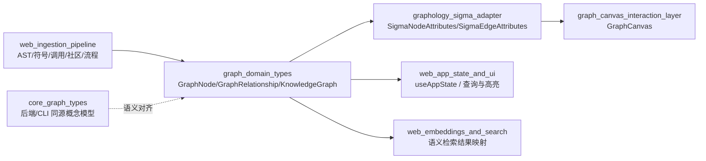
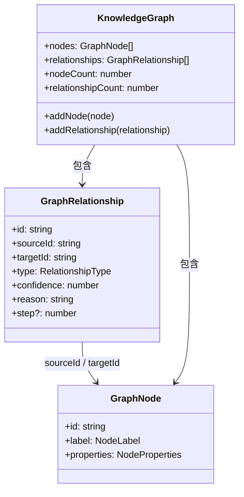
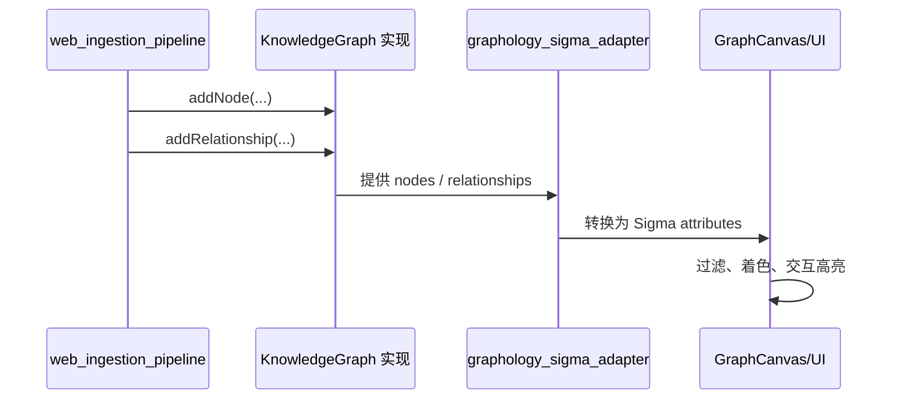

# graph_domain_types 模块文档

## 模块概述

`graph_domain_types` 是 `gitnexus-web` 前端图谱系统中的**领域类型契约层**，文件位于 `gitnexus-web/src/core/graph/types.ts`。这个模块只定义类型，不实现算法，也不直接操作渲染引擎；它的职责是把“前端知识图谱数据长什么样”这个问题固定下来，让数据生产侧（例如 Web 端 ingestion/pipeline）和消费侧（例如 graph adapter、Sigma 渲染、UI 状态层）能够在同一套语义上协作。

从设计动机来看，这个模块存在的核心原因是：前端需要同时承载“代码结构图”（文件、类、函数、调用）和“分析增强图”（社区、流程、入口点评分等）。如果没有统一的类型边界，每个功能模块都会自行发明字段，最终导致查询、渲染和交互层出现大量隐式耦合。`graph_domain_types` 通过 `NodeLabel`、`NodeProperties`、`RelationshipType`、`GraphNode`、`GraphRelationship`、`KnowledgeGraph` 六组核心定义，建立了这一边界。

---

## 在系统中的位置与协作关系



这张图表达了 `graph_domain_types` 的真实角色：它是前端图数据在进入渲染与交互之前的“统一落点”。上游 pipeline 可以持续写入节点和边，下游 adapter 与 UI 不关心数据来自哪个处理器，只关心是否满足该类型契约。

可结合以下文档阅读（避免在此重复展开）：

- [web_ingestion_pipeline.md](web_ingestion_pipeline.md)
- [graphology_sigma_adapter.md](graphology_sigma_adapter.md)
- [sigma_runtime_hook.md](sigma_runtime_hook.md)
- [graph_canvas_interaction_layer.md](graph_canvas_interaction_layer.md)
- [core_graph_types.md](core_graph_types.md)

---

## 核心类型结构总览



这个模块采用非常“薄”的建模方式：`GraphNode` 与 `GraphRelationship` 是原子实体，`KnowledgeGraph` 是承载集合及写入能力的容器接口。它不对索引结构、去重策略、并发安全、删除行为做强制规定，这些由具体实现决定。

---

## 组件详解

## NodeLabel

`NodeLabel` 是节点语义标签的联合类型：

```ts
export type NodeLabel =
  | 'Project'
  | 'Package'
  | 'Module'
  | 'Folder'
  | 'File'
  | 'Class'
  | 'Function'
  | 'Method'
  | 'Variable'
  | 'Interface'
  | 'Enum'
  | 'Decorator'
  | 'Import'
  | 'Type'
  | 'CodeElement'
  | 'Community'
  | 'Process';
```

它把图节点分为三大类：第一类是代码结构实体（`File`、`Class`、`Function` 等），第二类是语言补充实体（`Decorator`、`Type`、`Import`），第三类是分析增强实体（`Community`、`Process`）。这种白名单式定义能在编译期防止拼写错误或“临时标签”污染。

如果你计划扩展新的标签（例如 `TestCase`），不能只改渲染层映射，必须先更新这里的联合类型，否则上游生成器或下游消费器会出现类型不一致。

---

## NodeProperties

`NodeProperties` 是节点附加属性对象，包含基础字段与场景扩展字段：

```ts
export type NodeProperties = {
  name: string,
  filePath: string,
  startLine?: number,
  endLine?: number,
  language?: string,
  isExported?: boolean,
  // Community-specific properties
  heuristicLabel?: string,
  cohesion?: number,
  symbolCount?: number,
  keywords?: string[],
  description?: string,
  enrichedBy?: 'heuristic' | 'llm',
  // Process-specific properties
  processType?: 'intra_community' | 'cross_community',
  stepCount?: number,
  communities?: string[],
  entryPointId?: string,
  terminalId?: string,
  // Entry point scoring (computed by process detection)
  entryPointScore?: number,
  entryPointReason?: string,
}
```

在行为上，这个对象是“分阶段填充”的。解析阶段通常只会写 `name`、`filePath`、`startLine/endLine`；社区检测后可能补齐 `cohesion`、`keywords`、`description`；流程检测后再补 `processType`、`stepCount`、`entryPointScore`。这意味着消费方必须接受**同一标签节点属性稀疏、渐进完善**的现实，而不是假设字段始终完整。

另外，`name` 与 `filePath` 是必填字段，这是一条很重要的约束：即使节点是 `Community` 或 `Process`，也必须提供路径字段（通常可用虚拟路径或逻辑路径约定），否则一些依赖文件维度聚合的前端逻辑会失效。

---

## RelationshipType

`RelationshipType` 定义图边的语义集合：

```ts
export type RelationshipType = 
  | 'CONTAINS' 
  | 'CALLS' 
  | 'INHERITS' 
  | 'OVERRIDES' 
  | 'IMPORTS'
  | 'USES'
  | 'DEFINES'
  | 'DECORATES'
  | 'IMPLEMENTS'
  | 'EXTENDS'
  | 'MEMBER_OF'
  | 'STEP_IN_PROCESS'
```

这些关系同时覆盖结构关系（`CONTAINS`、`DEFINES`）、静态语义关系（`CALLS`、`IMPORTS`、`IMPLEMENTS`）和分析关系（`MEMBER_OF`、`STEP_IN_PROCESS`）。

扩展关系类型时，建议同步检查三层影响：第一，数据生产器是否能稳定产出该关系；第二，adapter 是否有对应边样式；第三，UI 查询或过滤器是否需要新增规则。

---

## GraphNode

定义如下：

```ts
export interface GraphNode {
  id:  string,
  label: NodeLabel,
  properties: NodeProperties,  
}
```

`GraphNode` 的内部逻辑非常直接，但有两个实践约束通常需要在实现层保证。第一，`id` 在同一个图中必须唯一；第二，`label` 与 `properties` 的组合要语义一致，例如 `Process` 节点应尽量提供 `processType/stepCount`，否则流程可视化能力会显著下降。

它的副作用不在类型本身，而在消费链路：一个字段命名或取值约定变化，会直接影响筛选、着色、tooltip、搜索召回与引用跳转。

---

## GraphRelationship

定义如下：

```ts
export interface GraphRelationship {
  id: string,
  sourceId: string,
  targetId: string,
  type: RelationshipType,
  /** Confidence score 0-1 (1.0 = certain, lower = uncertain resolution) */
  confidence: number,
  /** Resolution reason: 'import-resolved', 'same-file', 'fuzzy-global', or empty for non-CALLS */
  reason: string,
  /** Step number for STEP_IN_PROCESS relationships (1-indexed) */
  step?: number,
}
```

`confidence` 和 `reason` 是这个模块里非常关键的“可解释性设计”。特别在 `CALLS` 关系中，静态分析经常存在多候选匹配，前端可以利用 `confidence` 做阈值过滤，用 `reason` 展示为什么这条边被建立。这能显著提升调试体验。

`step` 只对 `STEP_IN_PROCESS` 有意义，且注释明确是 **1-indexed**。如果消费端按 0-index 处理，会导致流程排序和路径动画出现偏移。

---

## KnowledgeGraph

定义如下：

```ts
export interface KnowledgeGraph {
  nodes: GraphNode[],
  relationships: GraphRelationship[],
  nodeCount: number,
  relationshipCount: number,
  addNode: (node: GraphNode) => void,
  addRelationship: (relationship: GraphRelationship) => void,
}
```

这是一个最小可用图容器接口。它只约束两件事：一是你能读到节点/边集合和计数，二是你能增量写入节点与关系。它没有定义删除、更新、去重、索引查找能力，因此你在实现中可以按场景选择“简单数组实现”或“带 Map 索引实现”。

`addNode` 与 `addRelationship` 的参数分别是 `GraphNode` 与 `GraphRelationship`，返回值为 `void`，意味着失败处理通常要么通过抛错，要么通过内部容错策略（例如忽略重复）。这一点需要在具体实现文档里写清楚。

---

## 典型数据流



在这个流程里，`graph_domain_types` 决定了中间交换层的数据形状。只要上下游都遵守契约，渲染层就不需要知道数据来自 AST 解析还是流程检测。

---

## 使用与实现示例

下面是一个最小 `KnowledgeGraph` 实现示例（演示用）：

```ts
import type {
  GraphNode,
  GraphRelationship,
  KnowledgeGraph,
} from '@/core/graph/types'

class InMemoryGraph implements KnowledgeGraph {
  nodes: GraphNode[] = []
  relationships: GraphRelationship[] = []
  nodeCount = 0
  relationshipCount = 0

  addNode(node: GraphNode): void {
    this.nodes.push(node)
    this.nodeCount = this.nodes.length
  }

  addRelationship(rel: GraphRelationship): void {
    this.relationships.push(rel)
    this.relationshipCount = this.relationships.length
  }
}
```

如果要提高健壮性，建议增加 ID 去重和端点校验：

```ts
addRelationship(rel: GraphRelationship): void {
  const sourceExists = this.nodes.some(n => n.id === rel.sourceId)
  const targetExists = this.nodes.some(n => n.id === rel.targetId)
  if (!sourceExists || !targetExists) {
    throw new Error(`Invalid relationship ${rel.id}: dangling endpoint`)
  }
  this.relationships.push(rel)
  this.relationshipCount = this.relationships.length
}
```

---

## 扩展与演进建议

当你要扩展该模块时，最重要的是把它当作“跨模块 schema”而非本地类型。一次看似简单的新增字段，可能影响 ingestion、搜索、渲染、导出、缓存与测试数据。

推荐遵循以下演进步骤：

1. 在 `NodeLabel` 或 `RelationshipType` 增加新值，并更新所有 switch/case 映射。
2. 在 `NodeProperties` 增加新字段时，保持可选并提供默认消费逻辑。
3. 为 `reason` 增加新枚举语义时，在 UI 中同步维护文案解释。
4. 更新跨模块文档，尤其是 [core_graph_types.md](core_graph_types.md) 与 Web 侧 adapter 文档。

---

## 边界条件、错误条件与已知限制

`graph_domain_types` 是类型定义模块，本身不会抛运行时错误，但它暴露了若干必须在实现层处理的风险点。

- 重复 ID：接口未禁止，若不做校验会导致节点覆盖歧义或渲染冲突。
- 悬挂关系：`sourceId/targetId` 指向不存在节点时，边会失效或导致 adapter 报错。
- 置信度越界：`confidence` 语义是 0~1，但类型是 `number`，需要调用方自行约束。
- `reason` 非标准值：会削弱可解释性与调试能力。
- `step` 与关系类型不一致：非 `STEP_IN_PROCESS` 填写 `step` 或流程边缺 `step` 都会造成流程排序异常。
- 稀疏属性：大量字段可选，UI 必须容忍 `undefined`，不能直接强取值。

该模块的一个明确限制是：它没有表达“时间版本”“多图分区”“事务一致性”等高级能力。如果需要这些能力，应在实现层或上层 pipeline 类型中扩展，而不是直接污染当前基础契约。

---

## 测试与维护建议

建议围绕该模块建立契约测试（contract tests），而不是只做组件快照测试。重点验证：节点 ID 唯一性策略、关系端点有效性、`confidence/reason/step` 的约束、以及扩展标签在渲染层是否有降级策略。

在维护上，最好把 `graph_domain_types` 与 `core_graph_types` 的差异保持可追踪。两端语义越一致，跨端调试成本越低；若确实需要分叉，应在文档中明确列出差异点与兼容策略。


---

## 附：与同名后端模块的语义对齐说明

`gitnexus-web/src/core/graph/types.ts` 与后端 `core_graph_types` 在节点/关系语义上应保持一致，但前端版本额外强调了渲染与交互可解释性（例如 `confidence`、`reason`、`step` 在 UI 中的直接消费）。维护时建议以“后端语义为源、前端展示为适配”作为原则，避免双端字段含义漂移。
