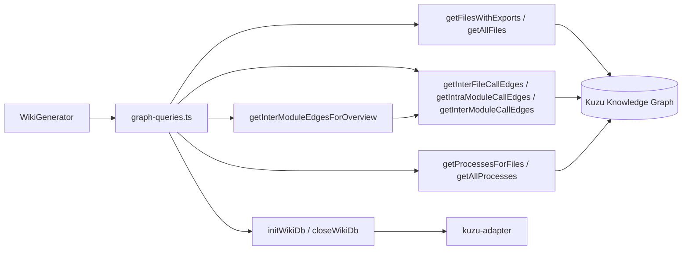
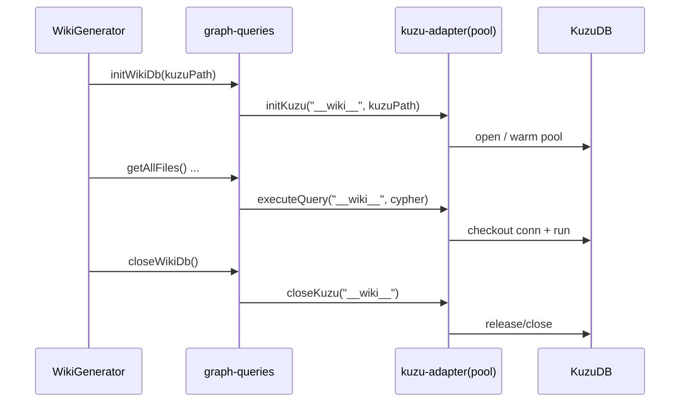
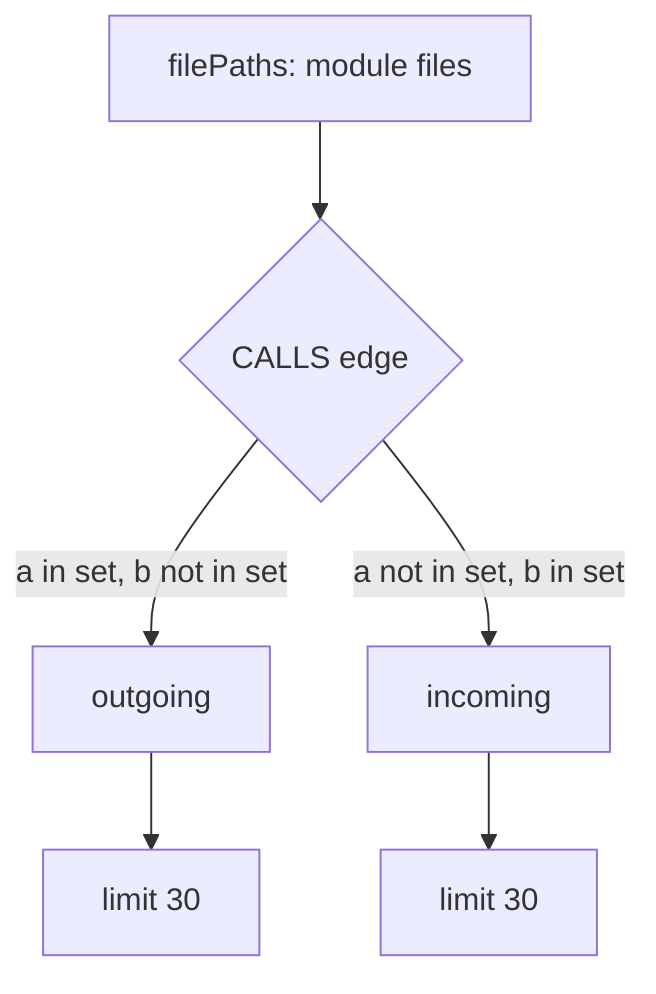
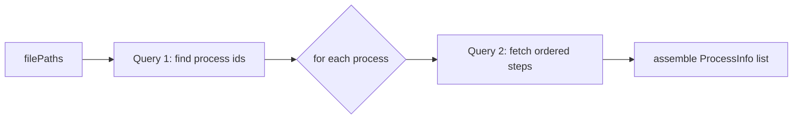
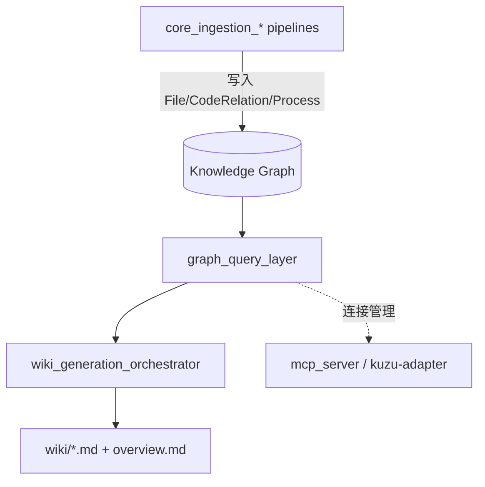

# graph_query_layer 模块文档

## 1. 模块定位与设计目标

`graph_query_layer`（实现文件：`gitnexus/src/core/wiki/graph-queries.ts`）是 Wiki 生成链路中的“图查询适配层”。它的职责非常聚焦：把 `WikiGenerator` 需要的知识图读取需求，封装为一组稳定、可复用、语义明确的查询函数，并屏蔽底层 Kuzu 连接管理与 Cypher 细节。

这个模块存在的核心原因是解耦。`wiki_generation_orchestrator` 需要的是“按模块拿调用边”“按文件拿流程信息”“拿所有导出符号”，而不是散落在业务代码中的拼接查询字符串。通过独立的查询层，Wiki 编排逻辑可以保持面向文档业务语义；查询语义变化（比如边类型命名、返回字段结构）也能集中在一处维护。关于编排器如何消费这些查询，请参考 [wiki_generation_orchestrator.md](wiki_generation_orchestrator.md)。

从系统全景看，该模块位于“已完成代码摄取后”的只读阶段：依赖 `core_ingestion_parsing`、`core_ingestion_resolution`、`core_ingestion_community_and_process` 产出的图结构，读取 `File`、`Process` 节点与 `CodeRelation` 边，再把结果输送给 Wiki 生成流程。关于图数据来源与类型语义，可分别参考 [core_ingestion_parsing.md](core_ingestion_parsing.md)、[core_ingestion_resolution.md](core_ingestion_resolution.md)、[core_ingestion_community_and_process.md](core_ingestion_community_and_process.md)、[core_graph_types.md](core_graph_types.md)。

---

## 2. 代码结构总览



这张图强调了两点：第一，`graph-queries.ts` 本身不做写入，仅做查询与结果整形。第二，连接生命周期虽然通过 `initWikiDb/closeWikiDb` 暴露，但真正的连接池管理在 `mcp/core/kuzu-adapter` 内完成，查询层只是按固定 `REPO_ID` 访问。也就是说，调用方不需要接触底层连接对象，但必须遵循“先 init、后 query、最后 close”的顺序。

---

## 3. 核心数据模型（接口）

### 3.1 `FileWithExports`

```ts
export interface FileWithExports {
  filePath: string;
  symbols: Array<{ name: string; type: string }>;
}
```

`FileWithExports` 表示“某个文件导出了哪些符号”。它不是摄取阶段的完整 AST 信息，而是 Wiki 分组阶段足够用的轻量摘要。`symbols` 中的 `type` 来自 `labels(n)[0]`，因此它反映的是图节点标签（如 `Function`、`Class` 等），而不是语言层完整类型系统。

### 3.2 `CallEdge`

```ts
export interface CallEdge {
  fromFile: string;
  fromName: string;
  toFile: string;
  toName: string;
}
```

`CallEdge` 表示跨符号调用关系的投影视图。它只保留“调用方/被调用方的文件与名称”，不携带边权重、行号或调用上下文。这个设计是为了兼顾通用性和 prompt 长度：Wiki 页面只需要架构级依赖关系，而不是精确代码导航元数据。

### 3.3 `ProcessInfo`

```ts
export interface ProcessInfo {
  id: string;
  label: string;
  type: string;
  stepCount: number;
  steps: Array<{
    step: number;
    name: string;
    filePath: string;
    type: string;
  }>;
}
```

`ProcessInfo` 代表流程检测阶段抽象出的执行流。顶层字段描述流程元信息，`steps` 给出按 `r.step` 排序的完整步骤轨迹。该结构被 Wiki 用于生成功能路径说明（例如“请求从入口到处理器再到存储层”）。

---

## 4. 查询生命周期与连接管理

### 4.1 连接函数

```ts
export async function initWikiDb(kuzuPath: string): Promise<void>
export async function closeWikiDb(): Promise<void>
```

这两个函数只是对 `kuzu-adapter` 的薄封装，内部使用固定 `REPO_ID = '__wiki__'`。这意味着 Wiki 场景中的所有查询共享同一个逻辑仓库标识，避免与其他运行场景的连接池键冲突。



实践上，调用方应在 `try/finally` 中关闭连接；`wiki_generation_orchestrator` 已按此模式实现。

---

## 5. 查询函数详解

## 5.1 文件与导出符号查询

### `getFilesWithExports(): Promise<FileWithExports[]>`

该函数执行：

```cypher
MATCH (f:File)-[:CodeRelation {type: 'DEFINES'}]->(n)
WHERE n.isExported = true
RETURN f.filePath AS filePath, n.name AS name, labels(n)[0] AS type
ORDER BY f.filePath
```

查询后会在 TypeScript 侧按 `filePath` 分组，得到每个文件的导出符号列表。实现上使用 `Map<string, FileWithExports>` 聚合，属于典型“行式结果 -> 结构化对象”转换。

行为要点：

- 只返回存在导出符号的文件；无导出文件不会出现在结果中。
- 行读取采用 `row.alias || row[index]` 双路径，兼容不同驱动返回格式。
- 不做去重去噪，同一符号如果在结果中重复出现，会原样保留。

### `getAllFiles(): Promise<string[]>`

该函数仅返回图中全部 `File` 节点路径：

```cypher
MATCH (f:File)
RETURN f.filePath AS filePath
ORDER BY f.filePath
```

它通常与 `getFilesWithExports()` 联合使用：前者给全集，后者给“可解释特征”。编排器会将两者合并，确保无导出文件也能被纳入模块划分。

---

## 5.2 调用关系查询

### `getInterFileCallEdges(): Promise<CallEdge[]>`

语义是“跨文件调用边”，过滤条件为 `a.filePath <> b.filePath`。函数返回去重后的 `CallEdge[]`（Cypher `DISTINCT`）。

适用场景是全局依赖理解，例如统计模块间耦合、绘制总览架构图。

### `getIntraModuleCallEdges(filePaths: string[]): Promise<CallEdge[]>`

该函数用于查询给定文件集合内部的调用关系，即“模块内调用边”。当 `filePaths` 为空时立即返回空数组，避免生成无意义查询。

实现细节：函数会把 `filePaths` 内的单引号替换为 `''`，再拼成 `IN [...]` 字面量，属于手工转义策略。对常规路径足够，但如果未来要支持更复杂输入，建议改为参数化查询。

### `getInterModuleCallEdges(filePaths: string[]): Promise<{ outgoing; incoming }>`

该函数同时返回两个方向：

- `outgoing`: 集合内文件调用集合外文件
- `incoming`: 集合外文件调用集合内文件

两组查询都设置了 `LIMIT 30`。这不是精确全量结果，而是面向文档展示的上限控制，目的是避免 prompt 爆炸。调用方应把它视为“代表性样本”，而不是严格统计。



---

## 5.3 流程（Process）查询

### `getProcessesForFiles(filePaths: string[], limit = 5): Promise<ProcessInfo[]>`

这是“先选流程，再取流程步骤”的两段式查询：先找经过给定文件集的 `Process`（按 `stepCount DESC`、`LIMIT limit`），再逐个流程查询完整步骤轨迹。



这个实现语义清晰，但存在典型 N+1 查询特征：流程数量越多，数据库 round-trip 越多。当前默认 `limit=5`，因此成本可控；若未来提升上限，建议考虑批量拉取步骤再分组。

### `getAllProcesses(limit = 20): Promise<ProcessInfo[]>`

逻辑与上一个函数类似，但不按文件过滤，面向项目总览页使用。默认上限更高（20），依然是 N+1 结构。对于超大图，建议结合缓存或一次性步骤预取优化。

---

## 5.4 模块总览边聚合

### `getInterModuleEdgesForOverview(moduleFiles: Record<string, string[]>): Promise<Array<{ from; to; count }>>`

该函数是纯内存聚合逻辑：

1. 先把 `moduleFiles` 反向构造成 `file -> module` 映射；
2. 调用 `getInterFileCallEdges()` 获取跨文件调用；
3. 只统计“源模块与目标模块均可识别且不同”的边；
4. 以 `from|||to` 为 key 计数，最后按 `count DESC` 排序。

它的好处是避免在 Cypher 里做复杂动态分组，降低查询复杂度，并让模块归属策略完全由上层控制。代价是对边数量特别大的仓库会有一次内存扫描成本，但在 Wiki 场景通常可接受。

---

## 6. 与上游/下游模块的协作关系



`graph_query_layer` 不负责数据正确性修复，它假设图中已经存在规范的节点和边。如果上游摄取缺失（例如未生成 `CALLS` 或 `STEP_IN_PROCESS` 边），查询层会返回空结果，最终表现为文档内容稀疏而不是报错。这是一种“尽可能继续生成”的韧性策略。

---

## 7. 使用方式与代码示例

最常见的使用模式如下：

```ts
import {
  initWikiDb,
  closeWikiDb,
  getAllFiles,
  getFilesWithExports,
  getInterModuleCallEdges,
  getProcessesForFiles,
} from './graph-queries.js';

async function collectModuleContext(kuzuPath: string, files: string[]) {
  await initWikiDb(kuzuPath);
  try {
    const [allFiles, exported, interCalls, processes] = await Promise.all([
      getAllFiles(),
      getFilesWithExports(),
      getInterModuleCallEdges(files),
      getProcessesForFiles(files, 5),
    ]);

    return { allFiles, exported, interCalls, processes };
  } finally {
    await closeWikiDb();
  }
}
```

如果你只需要模块总览关系：

```ts
const moduleFiles = {
  "core_wiki_generator": ["src/core/wiki/generator.ts"],
  "graph_query_layer": ["src/core/wiki/graph-queries.ts"],
};

const edges = await getInterModuleEdgesForOverview(moduleFiles);
// [{ from: 'graph_query_layer', to: 'core_wiki_generator', count: 3 }, ...]
```

---

## 8. 配置、约束与隐式假设

本模块显式配置很少，但有若干隐式行为会影响结果：

- 固定 `REPO_ID='__wiki__'`：同进程 Wiki 任务默认共享该逻辑仓库键。
- 多处 `LIMIT`：`inter-module` 边默认各方向最多 30 条，流程查询默认 5 或 20 条。
- 字符串拼接查询：`filePath` 和 `procId` 通过简单单引号转义写入 Cypher。
- 结果字段容错：每行读取优先用别名字段，回退索引字段（`row[0]` 等）。

这些约束是工程上的折中，优先保证跨驱动兼容与 prompt 尺度稳定。

---

## 9. 边界情况、错误条件与已知限制

### 9.1 空输入保护

`getIntraModuleCallEdges`、`getInterModuleCallEdges`、`getProcessesForFiles` 在 `filePaths` 为空时直接返回空结构，避免不必要 DB 访问。这是“调用方可无条件透传数组”的友好设计。

### 9.2 图数据不完整

若图中缺少某类边（例如没有 `CALLS`），函数不会抛错，只返回空集合。Wiki 最终可能缺少架构关系段落，需要从上游摄取排查，而不是在查询层修复。

### 9.3 性能风险

`getProcessesForFiles` 和 `getAllProcesses` 都有 N+1 查询模式。在大仓库、高 `limit`、高并发条件下，可能出现明显延迟。当前通过较小默认 `limit` 控制风险。

### 9.4 统计非全量

`getInterModuleCallEdges` 的 `LIMIT 30` 使结果更像“样本”。若你要做精确分析，不应直接复用这个函数，而应新增无上限或分页版本。

### 9.5 模块归属冲突

`getInterModuleEdgesForOverview` 假设每个文件只归属一个模块。若 `moduleFiles` 中同一文件出现在多个模块，后写入映射会覆盖先写入，导致计数偏差。

---

## 10. 扩展建议

当你要新增查询函数时，建议沿用当前模块的三条约定：第一，返回值优先使用语义化接口而不是裸行数组；第二，所有“可空输入”场景先做短路返回；第三，查询层只暴露“文档需要的数据形状”，不要把图模型细节泄漏给编排器。

一个可行的扩展示例是新增 `getTopEntryPointsForModule(filePaths, limit)`，把入口点评分结果（来自 `entry_point_intelligence`）映射成 Wiki 可消费结构。这样可以复用现有流程：查询层聚合 -> 编排器拼 prompt -> 页面增强，而无需在 `WikiGenerator` 中直接编写新 Cypher。

---

## 11. 参考文档

- Wiki 编排主流程与调用方： [wiki_generation_orchestrator.md](wiki_generation_orchestrator.md)
- 图模型基础类型： [core_graph_types.md](core_graph_types.md)
- 解析与符号/调用关系来源： [core_ingestion_parsing.md](core_ingestion_parsing.md)、[core_ingestion_resolution.md](core_ingestion_resolution.md)
- 流程与社区信息来源： [core_ingestion_community_and_process.md](core_ingestion_community_and_process.md)
- 图存储与导出链路背景： [core_kuzu_storage.md](core_kuzu_storage.md)
