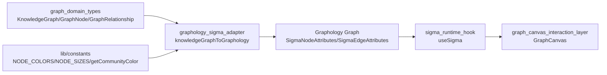
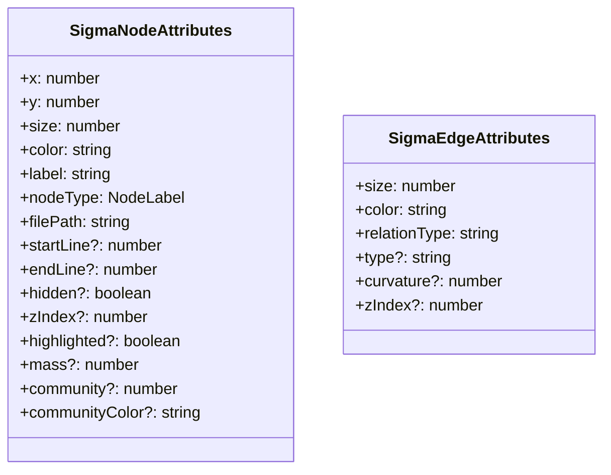
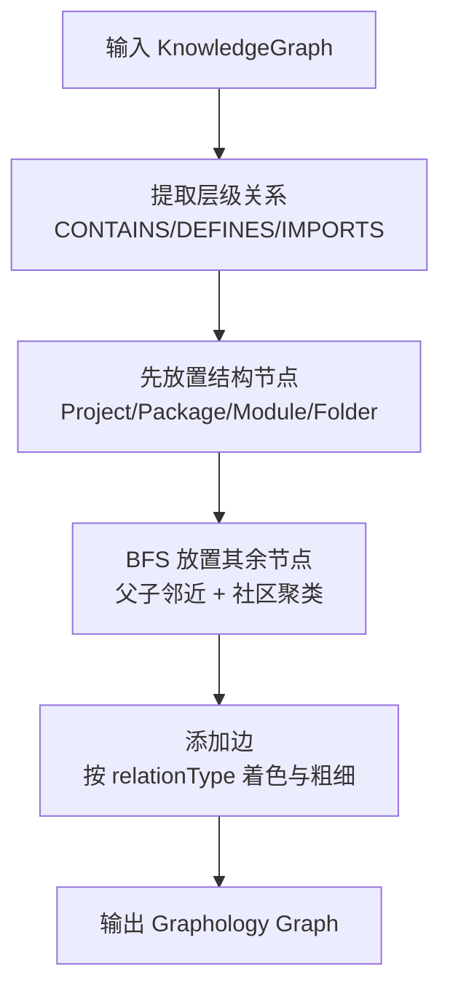
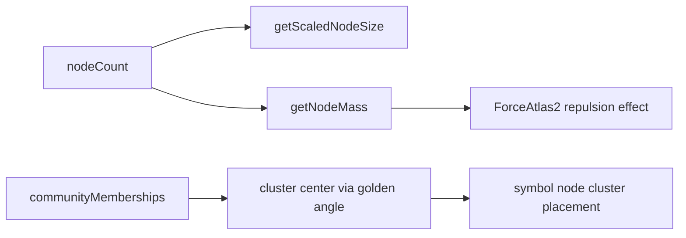

# graphology_sigma_adapter 模块文档

## 模块概述

`graphology_sigma_adapter`（代码文件：`gitnexus-web/src/lib/graph-adapter.ts`）是 `gitnexus-web` 图可视化链路中的“数据适配层”。它的核心职责不是生成知识图谱，也不是直接负责渲染，而是把领域层的 `KnowledgeGraph`（`GraphNode` / `GraphRelationship`）转换成 Sigma.js 可直接消费的 Graphology 图结构，并在转换过程中注入前端渲染所需的坐标、大小、颜色、层级、可见性等属性。

这个模块存在的根本原因是“领域语义”和“渲染语义”天然不同。领域图关注的是代码实体与关系语义，渲染引擎关注的是屏幕坐标、视觉权重、交互状态、性能约束。`graphology_sigma_adapter` 正是这两者之间的桥梁：既保留原始语义（例如 `nodeType`、`relationType`），又补齐布局和视觉参数（例如 `x/y`、`mass`、`curvature`、`hidden`），从而让上游分析结果能够稳定落到图形界面。

---

## 在系统中的位置



这条链路说明该模块是“渲染前最后一跳”的静态转换器。`GraphCanvas` 中的逻辑会先从业务图中提取 `communityMemberships`，然后调用 `knowledgeGraphToGraphology` 生成 Graphology 图，后续 `useSigma` 再根据节点/边属性完成布局迭代、高亮、动画与交互。

可配合阅读：
- [graph_domain_types.md](graph_domain_types.md)
- [sigma_runtime_hook.md](sigma_runtime_hook.md)
- [graph_canvas_interaction_layer.md](graph_canvas_interaction_layer.md)

---

## 核心数据契约



`SigmaNodeAttributes` 是节点渲染态的完整承载体。除了基础的几何属性（`x`、`y`、`size`）和视觉属性（`color`），它保留了业务可追溯字段（`nodeType`、`filePath`、`startLine/endLine`），并预留了交互/布局相关字段（`hidden`、`zIndex`、`highlighted`、`mass`、`community`、`communityColor`）。这使得同一张图既可用于显示，也可用于过滤、定位与二次动画。

`SigmaEdgeAttributes` 采用轻量设计：`relationType` 保留语义、`color/size/type/curvature` 决定视觉。特别是 `relationType` 会被 `useSigma` 中的边过滤逻辑直接使用，因此它不是可选装饰，而是下游行为开关之一。

---

## 关键函数与内部机制

## `knowledgeGraphToGraphology`

签名：

```ts
knowledgeGraphToGraphology(
  knowledgeGraph: KnowledgeGraph,
  communityMemberships?: Map<string, number>
): Graph<SigmaNodeAttributes, SigmaEdgeAttributes>
```

这是模块的核心入口，负责完整的图构建。其执行过程可以分为五个阶段。



第一阶段会扫描关系，建立 `parentToChildren` 与 `childToParent` 映射。这里将 `CONTAINS`、`DEFINES`、`IMPORTS` 都视作“定位意义上的层级关系”，目的是让子节点尽量围绕父节点分布，而不是语义上严格认定它们都属于树结构。

第二阶段先摆放结构节点（`Project/Package/Module/Folder`），使用 golden angle 径向分布，并加入轻微随机抖动。这样可以在大型图中避免中心塌缩与完美同心圆的机械感。

第三阶段处理非结构节点，优先使用 BFS（从结构节点出发）保证“父先于子”被定位。对于带社区信息的符号节点（`Function/Class/Method/Interface`），会优先使用社区中心定位（cluster-based positioning）；否则回落到父节点邻域抖动定位（hierarchy-based positioning）。

第四阶段添加边。边样式由内置 `EDGE_STYLES` 决定，不同关系类型使用显著区分的颜色族（结构绿、定义青、依赖蓝、调用紫、类型关系暖色）。边使用 `curved` 并加入随机弧度，减少重叠线条导致的可读性下降。

第五阶段返回 Graphology 实例供 Sigma 使用。

### 参数与返回值

- `knowledgeGraph`：领域图输入，必须包含节点与关系数组。
- `communityMemberships`：可选，`nodeId -> communityIndex`。传入后会影响“符号节点颜色”和“聚类中心定位”。
- 返回值：`Graph<SigmaNodeAttributes, SigmaEdgeAttributes>`，已包含初始坐标、视觉样式和可见性属性。

### 复杂度与副作用

整体复杂度近似 `O(N + E)`（不含常数级样式与随机计算），适合前端实时构图。函数本身不会修改输入 `knowledgeGraph`，副作用仅体现在内部使用 `Math.random`，因此同一输入的布局结果不是严格可复现的。

---

## `filterGraphByLabels`

签名：

```ts
filterGraphByLabels(
  graph: Graph<SigmaNodeAttributes, SigmaEdgeAttributes>,
  visibleLabels: NodeLabel[]
): void
```

该函数按节点类型做可见性过滤。它不会删除节点，而是设置节点属性 `hidden`。这种“软隐藏”策略可以避免频繁增删图结构导致 Sigma 重建成本，提高交互流畅度。

行为上非常直接：若节点 `nodeType` 不在 `visibleLabels` 中，则 `hidden = true`。

---

## `getNodesWithinHops`

签名：

```ts
getNodesWithinHops(
  graph: Graph<SigmaNodeAttributes, SigmaEdgeAttributes>,
  startNodeId: string,
  maxHops: number
): Set<string>
```

这是一个 BFS 邻域查询函数，用于“以某个节点为中心，取 N 跳范围”。它使用队列按深度层推进，返回访问到的节点集合。

注意它基于 `forEachNeighbor`，即把邻接视为无向可达性（对显示上下文通常是合理的），因此结果是“图上的近邻上下文”，而非严格有向可达分析。

---

## `filterGraphByDepth`

签名：

```ts
filterGraphByDepth(
  graph: Graph<SigmaNodeAttributes, SigmaEdgeAttributes>,
  selectedNodeId: string | null,
  maxHops: number | null,
  visibleLabels: NodeLabel[]
): void
```

该函数把“标签过滤”和“深度过滤”组合起来。其降级策略明确：

1. 当 `maxHops === null` 时，仅按标签过滤。
2. 当未选中节点或选中节点不存在时，也仅按标签过滤。
3. 只有在 `selectedNodeId` 有效且 `maxHops` 有值时，才执行 N-hop 过滤。

最终节点可见性的判定是：`标签可见 AND 在 hop 范围内`。

---

## 布局与视觉策略细节



`getScaledNodeSize` 会根据节点总量压缩尺寸下限，防止超大图中节点互相吞没，但仍尽量保留类型层级差异。`getNodeMass` 则按节点类型赋予不同质量，结构节点（尤其 `Project/Package/Module/Folder`）质量显著更高，目的是在 ForceAtlas2 迭代中形成“结构骨架先展开、内容节点跟随”的视觉效果。

这套策略与 `useSigma` 的布局参数相互配合：adapter 提供好的初始分布和 mass，runtime 再用 FA2 进行二次收敛，最终得到更稳定的阅读布局。

---

## 与上游/下游协作方式

在 `GraphCanvas.tsx` 中，调用顺序是：先从 `MEMBER_OF` 关系推导 `communityMemberships`，再调用 `knowledgeGraphToGraphology`，之后将结果交给 `useSigma`。筛选（`visibleLabels`、`depthFilter`）变化时，不重建图，而是调用 `filterGraphByDepth` 调整 `hidden` 并刷新。

这种协作模式的好处是职责清晰：
- adapter 负责一次性构图与初始样式；
- runtime hook 负责交互态（选中、高亮、边类型显示）；
- Canvas 负责状态编排与 UI 控件。

---

## 使用示例

```ts
import { knowledgeGraphToGraphology, filterGraphByDepth } from '@/lib/graph-adapter'

const communityMemberships = new Map<string, number>()
communityMemberships.set('function:src/a.ts#foo', 2)

const sigmaGraph = knowledgeGraphToGraphology(knowledgeGraph, communityMemberships)

// 仅显示 Class/Function，并限制在选中节点 2 跳内
filterGraphByDepth(
  sigmaGraph,
  'function:src/a.ts#foo',
  2,
  ['Class', 'Function']
)
```

如果你不做深度过滤，可以传 `maxHops = null`，函数会自动退化为标签过滤。

---

## 扩展与定制建议

如果要扩展该模块，优先从“映射表与策略常量”入手，而不是直接改渲染层。

- 想新增节点视觉风格：先更新 `NODE_COLORS` / `NODE_SIZES`（`lib/constants.ts`），再确认 `NodeLabel` 已在领域层定义。
- 想支持新关系类型：在 `EDGE_STYLES` 增加样式，并同步 `constants.ts` 的 `EdgeType` 与 UI 边过滤选项。
- 想改变层级定位逻辑：调整 `hierarchyRelations`（目前为 `CONTAINS/DEFINES/IMPORTS`）。
- 想控制布局可复现性：可将 `Math.random` 替换为可注入种子的 PRNG。

---

## 边界条件、错误风险与已知限制

该模块整体健壮，但有几个容易忽视的行为约束。

第一，边去重使用 `graph.hasEdge(sourceId, targetId)`，这会阻止同向重复边写入。如果上游在同一对节点间有多条同向不同语义边，当前实现会丢失后写入者。若业务需要并行多重边，应改为支持 multi graph 或自定义 edge key。

第二，社区索引依赖外部 `communityMemberships`，且颜色由 `communityIndex % paletteLength` 取模。因此社区数量远超调色板时会发生颜色复用，视觉区分度下降。

第三，布局包含随机抖动与随机曲率，导致每次构图略有差异。这有助于减少重叠，但对“截图比对”或“回归像素测试”不友好。

第四，`filterGraphByDepth` 仅设置节点 `hidden`，不直接隐藏边。边的最终可见性依赖 Sigma 侧 reducer（通常会因端点隐藏而间接不可见）。如果你实现了自定义 edge reducer，需要明确处理这种状态联动。

第五，`getNodesWithinHops` 不区分边类型和方向，适合交互上下文探索，不适合做严格程序分析结论。

---

## 总结

`graphology_sigma_adapter` 的价值在于把“知识图谱语义”转成“可交互图渲染语义”，并且内置了面向大图可读性的布局与样式策略。对于维护者来说，最关键的理解是：它不是简单字段拷贝器，而是一个包含层级建模、社区聚类、视觉编码与过滤机制的适配中枢。对它的任何改动，都会连锁影响 `useSigma` 的交互表现和 `GraphCanvas` 的用户体验，因此建议与 [graph_domain_types.md](graph_domain_types.md) 和 [sigma_runtime_hook.md](sigma_runtime_hook.md) 联动评估。