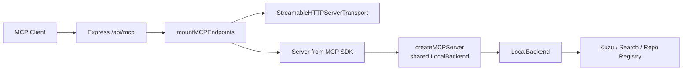
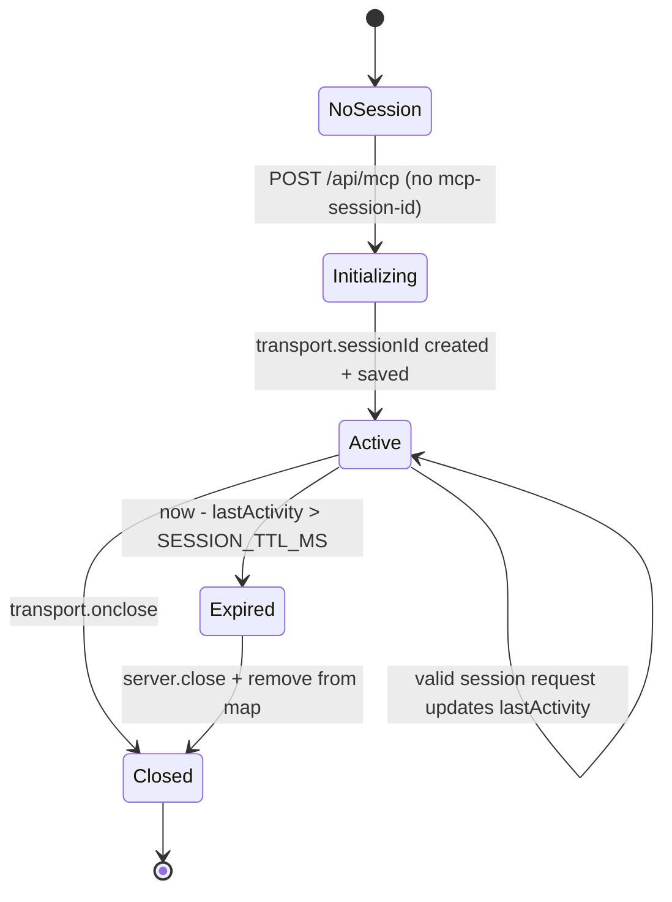
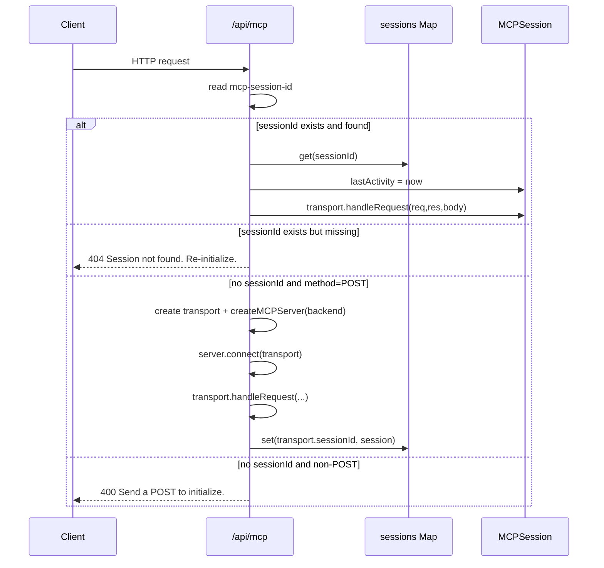
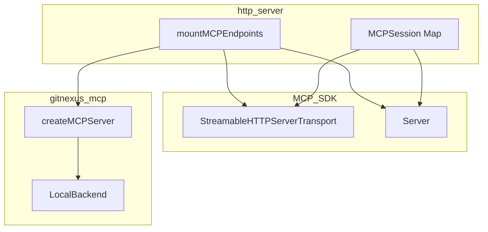

# http_server 模块文档

## 模块简介与设计动机

`http_server` 模块（源码文件：`gitnexus/src/server/mcp-http.ts`）是 GitNexus 在服务端暴露 MCP（Model Context Protocol）能力的 HTTP 接入层。它的职责不是实现具体的代码查询算法，也不是维护图数据库逻辑，而是把已经在 `mcp_server` 体系中定义好的 MCP Server 能力，安全地、可并发地、可恢复地挂载到 Express 路由（`/api/mcp`）上，并管理客户端会话生命周期。

这个模块存在的核心原因是 MCP over HTTP 的通信语义与传统无状态 REST 不同：MCP 客户端与服务端之间通常需要一个“有状态会话（stateful session）”来承载持续交互。网络抖动、客户端异常退出、代理层连接中断等情况都可能导致“会话残留”或“服务端状态孤儿”。因此该模块在设计上强调三件事：其一，每个客户端独立会话，避免互相污染；其二，后端能力共享复用（`LocalBackend` 单实例）以降低资源开销；其三，提供双重清理机制（`onclose` + TTL 定时清扫）防止会话泄漏。

如果把 GitNexus 看成分层系统，那么 `http_server` 是 MCP 的传输边界层（transport boundary）：向上对接 MCP Client（如桌面 Agent、IDE 插件、自动化评测桥接器），向下把请求路由到 `createMCPServer(backend)` 生成的 MCP 逻辑服务器。关于工具定义、资源系统和仓库查询执行细节，请分别参考 [`tool_definitions.md`](tool_definitions.md)、[`resource_system.md`](resource_system.md)、[`local_backend.md`](local_backend.md) 与 [`mcp_server.md`](mcp_server.md)。

---

## 在整体系统中的位置



上图说明该模块只处理“如何接入”和“如何维持会话”，不处理具体业务查询。真正的业务逻辑在 `LocalBackend`，而 `http_server` 负责把 HTTP 请求交给对应会话的 `transport.handleRequest(...)`。

---

## 核心组件

## `MCPSession` 接口

`MCPSession` 是模块内部会话结构，用于把同一客户端会话所需的运行时对象聚合在一起：

```typescript
interface MCPSession {
  server: Server;
  transport: StreamableHTTPServerTransport;
  lastActivity: number;
}
```

`server` 是 MCP SDK 的 `Server` 实例，承载工具、资源、协议处理能力。`transport` 是与该会话绑定的 HTTP 传输层，负责解析和回复当前会话下的 MCP 请求。`lastActivity` 记录最近一次请求时间，用于空闲会话回收。这个结构本质上是“会话状态快照”，被放入 `Map<string, MCPSession>`，key 为 `sessionId`。

## 常量：`SESSION_TTL_MS` 与 `CLEANUP_INTERVAL_MS`

- `SESSION_TTL_MS = 30 * 60 * 1000`：会话空闲 30 分钟后判定可回收。
- `CLEANUP_INTERVAL_MS = 5 * 60 * 1000`：每 5 分钟执行一次扫描清理。

这组参数体现了“容错优先”与“资源控制”的平衡：TTL 不宜过短（避免长思考任务中断），也不宜过长（避免大量僵尸会话占用内存）。

## 核心函数：`mountMCPEndpoints(app, backend)`

这是模块唯一导出函数，也是 HTTP 模块的入口。签名如下：

```typescript
export function mountMCPEndpoints(app: Express, backend: LocalBackend): () => Promise<void>
```

### 参数说明

- `app: Express`：外部传入的 Express 应用实例，函数会在其上注册 `app.all('/api/mcp', ...)` 路由。
- `backend: LocalBackend`：共享后端实例。所有新建会话在创建 MCP Server 时都会复用这个 backend，而不是每会话新建一个 backend。

### 返回值说明

返回一个异步 `cleanup` 函数：`(): Promise<void>`。调用该函数会停止定时清理器、关闭所有会话关联的 `server`、清空会话表，适合进程优雅退出（如 `SIGINT`/`SIGTERM`）时调用。

### 主要副作用

函数执行后立即产生以下副作用：

1. 创建并维护内存会话表 `Map<string, MCPSession>`。
2. 启动 `setInterval` 定时清理任务。
3. 注册全局路由 `/api/mcp`。
4. 输出启动日志 `MCP HTTP endpoints mounted at /api/mcp`。

---

## 会话生命周期与请求处理机制

### 生命周期图



该状态机体现了模块最关键的行为：会话既可被显式关闭（`onclose`）也可被被动回收（TTL 扫描），两条路径共同防止状态泄漏。

### 请求分发流程



需要注意的是，初始化新会话时必须是无 `mcp-session-id` 的 `POST` 请求。其他方法（如 GET）即使路径正确，也会收到 `400`。

---

## 内部实现细节（按代码路径拆解）

## 1) 定时清理器与 `unref()`

模块启动后会创建 `cleanupTimer`，按固定周期遍历 `sessions`。如果发现某会话空闲超时，则调用 `session.server.close()` 并删除该会话。`close()` 调用被 `try/catch` 包裹，确保单个会话关闭失败不会阻塞后续清理。

同时代码对 `cleanupTimer` 做了 `unref()` 处理（如果运行时支持），这意味着“仅剩这个定时器活动”时，Node.js 进程不会被强行保持存活。这是一个容易被忽略但非常实用的运维细节，避免测试或短生命周期进程因后台定时器无法退出。

## 2) `handleMcpRequest` 分支语义

`handleMcpRequest` 是核心请求处理器，分为四个互斥分支：

1. **已有有效会话**：刷新 `lastActivity` 并把请求交给该会话 transport。
2. **带了会话 ID 但不存在**：返回 JSON-RPC 风格 `404`，错误码 `-32001`，提示客户端重新初始化。
3. **无会话 ID 且 `POST`**：创建新 transport 和 server，连接后处理当前请求，并在成功拿到 `transport.sessionId` 后登记进 map。
4. **无会话 ID 且非 `POST`**：返回 `400`，要求先 POST 初始化。

这种分支设计严格贴合 MCP 会话协商模型，减少了“半初始化态”的不确定行为。

## 3) 异常兜底

路由层使用 `void handleMcpRequest(...).catch(...)` 捕获异步异常。一旦出现未处理错误，会：

- 打印日志 `MCP HTTP request failed:`；
- 若响应尚未发送，则返回 `500` JSON-RPC 错误 `Internal MCP server error`；
- 若 `res.headersSent` 为真，则直接放弃写回，避免二次写响应导致 Express 报错。

这保证了协议层在异常场景下仍维持可预测行为。

## 4) 返回的 `cleanup` 关闭流程

`cleanup` 做了三件事：

1. `clearInterval(cleanupTimer)` 停止后台扫描。
2. 并行关闭全部活动会话的 `server`（`Promise.allSettled`，防止单点失败）。
3. `sessions.clear()` 立刻释放会话引用。

该顺序有现实意义：先停止新增清理动作，再并发收尾，最后等待全部关闭任务 settled，避免退出阶段留下悬挂 Promise。

---

## 依赖关系与协作边界



`http_server` 依赖最关键的外部点有两个：MCP SDK（传输与协议 server）和 `createMCPServer(backend)`（业务能力装配）。它并不关心 `LocalBackend` 的具体工具实现细节，只要求 backend 已按预期初始化并可被复用。

---

## 使用方式与集成示例

## 最小集成示例

```typescript
import express from 'express';
import { mountMCPEndpoints } from './server/mcp-http.js';
import { LocalBackend } from './mcp/local/local-backend.js';

const app = express();
app.use(express.json({ limit: '2mb' }));

const backend = new LocalBackend();
await backend.init();

const cleanupHttp = mountMCPEndpoints(app, backend);

const server = app.listen(3000, () => {
  console.log('MCP HTTP server listening on :3000');
});

process.on('SIGTERM', async () => {
  await cleanupHttp();
  await backend.disconnect();
  server.close();
});
```

## 客户端初始化与后续请求模式

```http
POST /api/mcp
Content-Type: application/json

{ "jsonrpc": "2.0", "id": 1, "method": "initialize", "params": {...} }
```

服务端在 MCP StreamableHTTP 协议下返回会话信息后，客户端后续请求需携带：

```http
mcp-session-id: <session-id>
```

如果客户端重用一个已过期 ID，会得到 `404 Session not found. Re-initialize.`，此时应重新执行初始化 POST。

---

## 可配置点与扩展建议

虽然当前代码将 TTL 与清理周期写死为常量，但在生产环境通常建议改造为可配置项（环境变量或启动参数），例如：

```typescript
const SESSION_TTL_MS = Number(process.env.MCP_SESSION_TTL_MS ?? 30 * 60 * 1000);
const CLEANUP_INTERVAL_MS = Number(process.env.MCP_CLEANUP_INTERVAL_MS ?? 5 * 60 * 1000);
```

如果你计划扩展该模块，优先考虑以下方向：

1. 在创建/清理会话时增加可观测性指标（active sessions、evicted sessions、error count）。
2. 在请求入口增加 request-id 与结构化日志，便于链路追踪。
3. 在反向代理场景下，显式校验或透传 `mcp-session-id` 头，避免代理层丢头。
4. 如需多实例横向扩展，考虑将会话外置（当前实现为进程内内存，不跨实例共享）。

---

## 边界条件、错误场景与限制

## 1) 进程内会话，不支持跨实例共享

`sessions` 是内存 `Map`，因此天然是单进程局部状态。若服务部署为多实例且没有会话亲和（sticky session），同一客户端请求可能打到不同实例并触发“session not found”。

## 2) 清理窗口并非实时

会话超时采用“定时扫描”而非精确到点触发。实际回收时间介于 `TTL` 到 `TTL + CLEANUP_INTERVAL` 之间，这是预期行为，不应误判为泄漏。

## 3) 仅 POST 可初始化

无 sessionId 时非 POST 一律返回 `400`。如果客户端或调试工具习惯先 GET 探活，需要单独实现健康检查路由，不应复用 `/api/mcp`。

## 4) `server.close()` 异常被吞掉

清理逻辑中关闭异常被抑制（空 `catch`），优点是稳健不中断；代价是问题可见性下降。生产环境建议在 catch 内记录 debug 级日志。

## 5) 对 body 解析有前置依赖

`transport.handleRequest(req, res, req.body)` 假设 `req.body` 已由 Express 中间件处理。若未挂载 `express.json()`，可能出现协议处理异常或空 body 问题。

---

## 与其他文档的关系（避免重复）

本文档聚焦 HTTP 接入与会话管理，不重复以下内容：

- MCP 全局架构与子模块全景：[`mcp_server.md`](mcp_server.md)
- 工具契约定义与 schema：[`tool_definitions.md`](tool_definitions.md)
- 资源 URI 体系与读取流程：[`resource_system.md`](resource_system.md)
- 仓库解析、图查询、检索与重命名执行：[`local_backend.md`](local_backend.md)
- Kuzu 连接池行为与并发策略：[`kuzu_connection_pool.md`](kuzu_connection_pool.md)

通过这些文档配合阅读，你可以把 `http_server` 理解为“协议入口 + 会话总线”，而把 `LocalBackend` 理解为“能力执行引擎”。