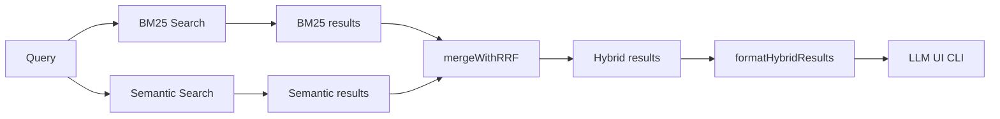
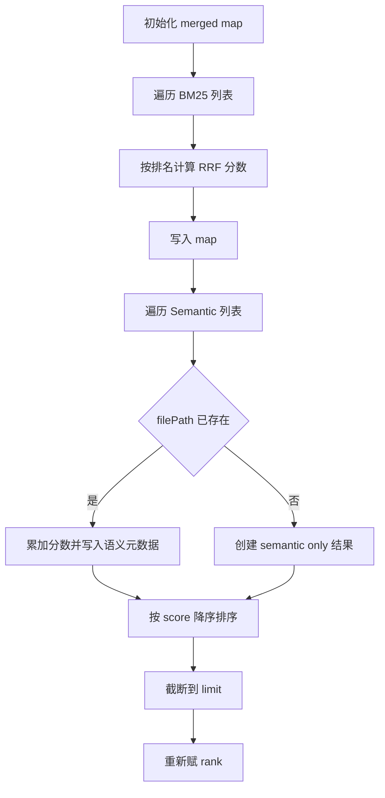
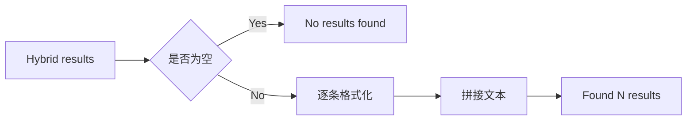

# hybrid_rrf_search 模块文档

## 模块简介

`hybrid_rrf_search` 模块负责把两种检索策略的结果融合为一个统一排序列表：关键词检索（BM25）与语义检索（Embedding/Semantic）。它的核心价值不在“再做一次检索”，而在于解决一个常见的工程问题：不同检索器的原始分数不可直接比较。BM25 的 `score` 与向量距离 `distance` 量纲不同，简单线性加权会导致排序不稳定，也难以跨模型复用。

该模块采用 Reciprocal Rank Fusion（RRF）按“名次”而非“原始分值”融合，避免分数归一化依赖。这个策略在工业搜索系统中非常常见，优点是鲁棒、可解释、实现简单且效果稳定。对于 GitNexus 这类代码理解场景，RRF 能同时保留“精确术语命中能力”和“语义近似召回能力”，使最终返回结果更适合作为 LLM 上下文和代码导航输入。

从职责边界看，这个模块不负责构建 BM25 索引、不负责生成向量、不负责执行语义模型推理；它只做三件事：融合排序、能力就绪判断、文本格式化输出。

---

## 系统定位与依赖关系

`hybrid_rrf_search` 位于 `web_embeddings_and_search` 子域（同构于后端 `core_embeddings_and_search` 的搜索分层设计）。它直接依赖：

- `bm25-index`：提供 `BM25SearchResult` 类型，以及 `isBM25Ready` 可用性判断。
- `embeddings/types`：提供 `SemanticSearchResult` 类型。

建议配合阅读：
- [bm25_fulltext_search.md](bm25_fulltext_search.md)
- [embeddings_types.md](embeddings_types.md)
- [core_embeddings_and_search.md](core_embeddings_and_search.md)



上图体现了模块的中间层角色：它接收“两路已排序结果”，输出“单一路径可消费结果”。因此它是检索层和应用层之间的桥接器，而不是检索执行器本身。

---

## 核心数据结构：`HybridSearchResult`

```ts
export interface HybridSearchResult {
  filePath: string;
  score: number;           // RRF score
  rank: number;            // Final rank
  sources: ('bm25' | 'semantic')[];

  nodeId?: string;
  name?: string;
  label?: string;
  startLine?: number;
  endLine?: number;

  bm25Score?: number;
  semanticScore?: number;
}
```

该结构由三层信息组成。第一层是排序主干字段：`filePath`、`score`、`rank`。第二层是来源解释字段：`sources` 表示该结果来自 BM25、语义检索，或两者共同命中。第三层是诊断和展示增强字段：`bm25Score`、`semanticScore` 便于调试；`name/label/startLine/endLine` 提升 UI/LLM 输出可读性。

一个关键设计点是：融合键为 `filePath`。这意味着同一文件内的多个语义命中点会折叠成单条结果，更适合“文件级召回”场景；但如果你的需求是“符号级多命中展示”，需要在上层或未来扩展中引入更细粒度键（如 `filePath + nodeId`）。

---

## 核心算法与函数说明

## `mergeWithRRF(bm25Results, semanticResults, limit = 10)`

这是本模块的核心函数。它将两路输入列表基于 RRF 规则融合后返回 `HybridSearchResult[]`。

### 参数与返回值

- `bm25Results: BM25SearchResult[]`：BM25 结果，预期已按相关性降序。
- `semanticResults: SemanticSearchResult[]`：语义结果，预期已按距离升序（或等价相关性顺序）。
- `limit: number = 10`：最终返回条数上限。
- 返回值：按融合分数降序排列并重新赋 `rank` 的 `HybridSearchResult[]`。

### 内部执行流程



### RRF 公式与实现细节

模块定义常量：

```ts
const RRF_K = 60;
```

每个结果对总分的贡献为：

```text
1 / (RRF_K + rank)
```

其中 `rank` 从 1 开始（代码里通过 `i + 1` 实现）。如果同一 `filePath` 同时被两路检索命中，则贡献分相加。这会自然提升“跨策略一致命中”项的最终排序。

### 重要副作用与行为约束

函数会在 `Map` 中持有可变对象并原地更新。语义阶段若命中已有 BM25 项，会覆盖该条的 `nodeId/name/label/startLine/endLine`。因此：

- 同文件出现多条语义结果时，最终保留的是“最后一次遍历命中”的元数据。
- `semanticScore` 采用 `1 - distance` 映射，仅作调试展示，不参与最终排序。
- 排序完全依赖输入顺序（排名），不看原始 `bm25Score`/`distance` 绝对值。

---

## `isHybridSearchReady()`

```ts
export const isHybridSearchReady = (): boolean => {
  return isBM25Ready();
};
```

该函数当前语义非常直接：只要 BM25 已就绪，就认为 Hybrid Search 可用。注释也明确了设计意图：语义检索是可选增强，不是硬依赖。这意味着系统可在“无 embedding”场景下退化为 BM25-only 融合路径（`semanticResults` 为空数组即可）。

对维护者来说，这个接口是未来扩展点。如果后续要引入“必须双引擎 ready 才算可用”的强约束，应同步更新调用方逻辑与文档，避免前端显示可用但执行失败的体验断层。

---

## `formatHybridResults(results)`

该函数把结构化结果转换为 LLM/终端可直接消费的文本块。空结果返回固定字符串 `No results found.`。非空时按序号输出标签、名称、文件路径、来源和融合得分。



该函数虽然简单，但在 Agent/LLM 集成里价值很高：它统一了检索上下文格式，降低上层重复模板拼接和字段遗漏概率。

---

## 典型使用方式

### 1) 标准融合调用

```ts
import { mergeWithRRF, formatHybridResults } from './core/search/hybrid-search';

const hybrid = mergeWithRRF(bm25Results, semanticResults, 10);
console.log(formatHybridResults(hybrid));
```

### 2) 仅 BM25 退化模式

```ts
const hybrid = mergeWithRRF(bm25Results, [], 10);
```

这是合法且常见的降级路径。`sources` 将只包含 `bm25`。

### 3) 可用性判断

```ts
import { isHybridSearchReady } from './core/search/hybrid-search';

if (!isHybridSearchReady()) {
  // 提示先构建 BM25 索引
}
```

---

## 边界条件、错误场景与限制

本模块实现很轻量，但生产接入时需要关注以下行为边界。

第一，输入排序前提非常关键。RRF 基于数组位置计算名次贡献，如果输入列表未按各自相关性排序，融合结果会直接失真。模块不会再次校验或重排输入质量。

第二，`filePath` 去重策略会牺牲节点粒度。对于一个文件内多个高相关函数，最终只会保留一条结果，且语义元数据可能被后写入命中覆盖。这对“文件级导航”是可接受的，但对“精准定位多个符号”不足。

第三，`semanticScore = 1 - distance` 仅用于调试展示。若上游向量库返回的距离不在 `[0,1]` 区间，`semanticScore` 可能出现负值或大于 1，不应被当作标准化相关性分值。

第四，`formatHybridResults` 中位置显示依赖 `startLine` 的 truthy 判断，`startLine = 0`（极少见）会被当作无位置信息处理。若你所在系统采用 0-based 行号，需要特别注意展示逻辑。

第五，模块未内建异常处理，因为它不执行 I/O。但调用链中的 BM25/语义检索若失败，错误需要在上层捕获并决定是否降级。

---

## 扩展与定制建议

如果你计划扩展该模块，优先考虑以下方向：

- 将 `RRF_K` 暴露为可配置参数，支持场景化调优（问答 vs 精确定位）。
- 增加节点级融合模式（例如 `filePath + nodeId`）以保留多命中细节。
- 在结果中补充 `contributions` 调试字段（记录每路 rank 与单路 RRF 分量），提升可观测性。
- 允许来源去重写入（防御未来输入出现重复 source push 的可能）。
- 提供结构化格式化器（JSON-friendly formatter）供 API 场景使用，而不仅是文本输出。

---

## 小结

`hybrid_rrf_search` 是 GitNexus 检索层中“低复杂度、高收益”的核心拼接模块。它通过 RRF 在不做分数归一化的前提下，稳定融合关键词检索和语义检索，把多路召回结果转化为上层可直接消费的统一列表。理解这个模块后，你基本就掌握了 GitNexus 在搜索结果重排阶段的关键设计哲学：优先稳定性、可解释性与工程可维护性。
