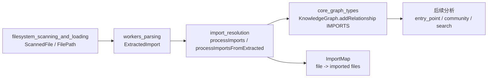
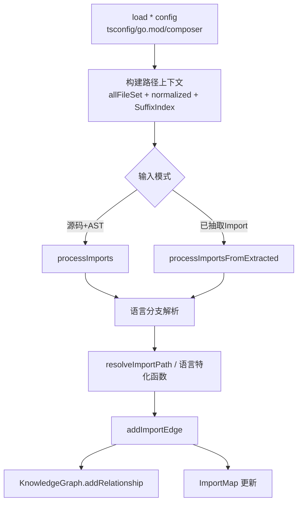
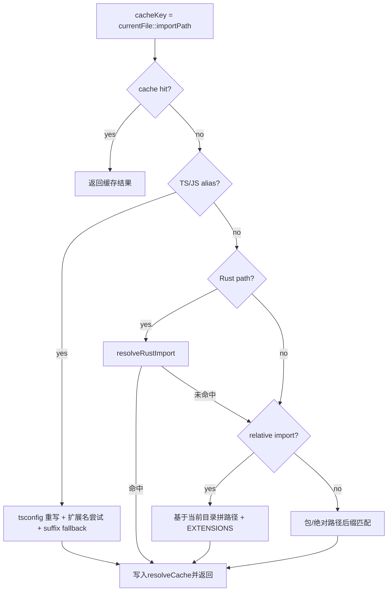
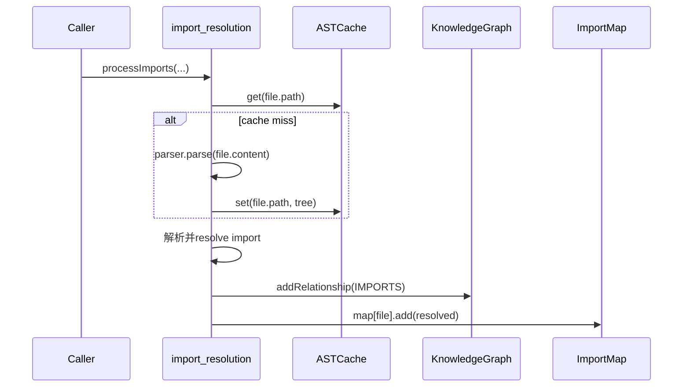

# import_resolution 模块文档

## 模块简介与设计动机

`import_resolution` 模块位于 `core_ingestion_resolution` 子域，负责把“源码里声明的 import / use / include 路径”解析为“仓库内真实文件路径”，并将结果写入知识图谱中的 `IMPORTS` 关系。它的存在原因很直接：解析器（见 [`workers_parsing.md`](workers_parsing.md)）只能提取出语法层面的原始导入字符串，例如 `@/utils/foo`、`com.example.*`、`crate::net::client`，但这些字符串并不能直接用于图分析。只有当它们被解析到具体文件后，依赖关系、模块边界、入口推断和调用归因等后续能力才有稳定基础。

从设计上看，这个模块不是“单语言规则引擎”，而是“通用路径解析框架 + 语言特化补丁”。框架层提供统一的缓存、后缀索引和扩展名探测；语言层在 TypeScript、Go、Java、Rust、PHP 场景下注入各自的路径重写规则。这样可以让系统在多语言仓库中保持一致行为，同时避免把每种语言完全拆成独立 pipeline，降低维护复杂度。

另一个关键设计目标是吞吐与内存平衡。模块通过 `SuffixIndex`、`resolveCache` 和“预构建上下文”来降低跨文件/跨分块处理时的重复计算，并通过缓存上限与分段淘汰策略限制内存膨胀。这种策略非常契合大仓库增量处理与 worker 分块执行场景。

---

## 在整体系统中的位置



`import_resolution` 的输入既可以是“原始文件内容 + AST 查询”模式，也可以是“上游已经抽取好的 `ExtractedImport`”模式。输出则有两条：一条是写入 `KnowledgeGraph` 的结构化关系边（`type: 'IMPORTS'`），一条是内存态的 `ImportMap`（`Map<filePath, Set<resolvedPath>>`），供后续阶段快速访问。图结构细节可参考 [`core_graph_types.md`](core_graph_types.md)。

如果你希望理解这个模块的上下游职责边界，建议串联阅读：[`core_ingestion_parsing.md`](core_ingestion_parsing.md)、[`symbol_indexing.md`](symbol_indexing.md)、[`process_detection_and_entry_scoring.md`](process_detection_and_entry_scoring.md)。

---

## 核心数据结构与组件

## `ImportMap` 与 `createImportMap`

`ImportMap` 是 `Map<string, Set<string>>`，语义是“某个文件导入了哪些已解析文件”。`createImportMap()` 仅返回新的空 `Map`，不做任何封装逻辑。

这个结构与图谱边是并行维护的：每解析到一个 import，会同时调用 `graph.addRelationship(...)` 与 `importMap.get(file).add(target)`。这意味着调用方如果只关心快速内存查询，可直接使用 `ImportMap`；如果关心全局图查询与持久化，则依赖 `KnowledgeGraph`。

## `ImportResolutionContext`

`ImportResolutionContext` 是为“跨 chunk 复用解析上下文”设计的预计算容器，包含：

- `allFilePaths: Set<string>`：全量文件路径集合，用于 O(1) existence 检查。
- `allFileList: string[]`：原始路径数组，保留顺序。
- `normalizedFileList: string[]`：路径归一化（`\\` -> `/`）后的数组。
- `suffixIndex: SuffixIndex`：后缀查找索引。
- `resolveCache: Map<string, string | null>`：按 `(currentFile, importPath)` 缓存解析结果。

`buildImportResolutionContext(allPaths)` 会一次性构建这些对象，适合在分批处理中复用，避免每批都重建索引和缓存。

## `SuffixIndex`

`SuffixIndex` 是本模块性能优化的核心接口，提供三种能力：

- `get(suffix)`：大小写敏感后缀查找。
- `getInsensitive(suffix)`：大小写不敏感后缀查找。
- `getFilesInDir(dirSuffix, extension)`：按目录后缀 + 扩展名获取文件列表（用于 Java/包级解析）。

`buildSuffixIndex(...)` 会为每个文件构建“所有可能路径后缀”。例如 `src/com/example/Foo.java` 会被索引为 `Foo.java`、`example/Foo.java`、`com/example/Foo.java`、`src/com/example/Foo.java`。这使得绝大多数“包名/命名空间映射到路径后缀”的场景无需全量线性扫描。

## `TsconfigPaths` / `GoModuleConfig` / `ComposerConfig`

这三个是语言配置抽象，分别由 `loadTsconfigPaths`、`loadGoModulePath`、`loadComposerConfig` 从仓库根目录加载：

- `TsconfigPaths`：解析 `tsconfig*.json` 的 `compilerOptions.paths` 与 `baseUrl`。
- `GoModuleConfig`：解析 `go.mod` 中的 `module xxx`。
- `ComposerConfig`：解析 `composer.json`（含 `autoload` 与 `autoload-dev` 的 `psr-4`）。

它们只在 import 解析阶段使用，不参与图存储。

---

## 架构与关键流程

## 总体执行架构



两条入口函数在“语言特化解析 + 写边”逻辑上保持一致，主要差异在于：`processImports` 需要解析 AST 并执行 Tree-sitter 查询，而 `processImportsFromExtracted` 直接消费上游提取结果，跳过解析环节，适合高吞吐或已缓存抽取结果的 pipeline。

## 入口函数一：`processImports`

`processImports(graph, files, astCache, importMap, onProgress?, repoRoot?, allPaths?)` 是标准路径，参数语义如下：

- `graph: KnowledgeGraph`：关系边写入目标。
- `files: { path, content }[]`：当前批次文件及内容。
- `astCache: ASTCache`：AST 缓存，命中可避免重解析。
- `importMap: ImportMap`：调用方提供并由函数原地更新。
- `onProgress`：进度回调，按文件粒度上报。
- `repoRoot`：用于加载 tsconfig/go.mod/composer。
- `allPaths`：可传仓库全量路径，实现跨 chunk 解析。

内部流程是：逐文件判断语言支持 -> 加载对应 Tree-sitter 语言 -> 从缓存取 AST 或重新 parse -> 执行 `LANGUAGE_QUERIES` 捕获 import 节点 -> 走语言分支解析 -> 成功后写入 `IMPORTS` 边。

这里有一个重要副作用：如果 AST 缓存未命中，会把新解析的 tree 写回 `astCache`，让 call/heritage 等后续处理阶段复用。

## 入口函数二：`processImportsFromExtracted`

`processImportsFromExtracted(graph, files, extractedImports, importMap, onProgress?, repoRoot?, prebuiltCtx?)` 是快速路径。它假定 `ExtractedImport[]` 已由解析阶段产出，函数仅负责“路径解析 + 写边”。

该函数支持通过 `prebuiltCtx` 注入 `ImportResolutionContext`，从而在多批次调用间复用 `suffixIndex` 和 `resolveCache`。如果未传，会基于 `files.map(f => f.path)` 临时构建。对于大仓库，这个参数显著影响性能和结果一致性（特别是跨 chunk 引用解析）。

---

## 路径解析策略详解

## 统一入口：`resolveImportPath`

`resolveImportPath(...)` 是单文件 import 的统一解析函数。它先查缓存，再按语言规则预处理，最后执行通用相对/后缀解析。



缓存策略采用上限 `100_000` 条，触顶时淘汰最旧约 20% 条目，而不是整表清空。这样可以在高重复导入模式下保持较高命中率，同时限制内存占用。

## 通用扩展名探测：`EXTENSIONS` + `tryResolveWithExtensions`

模块定义了多语言扩展名列表（TS/JS、Python、Java、C/C++、C#、Go、Rust、PHP）。对于相对路径或别名重写后的路径，会依次尝试这些后缀，如 `foo` -> `foo.ts` / `foo/index.ts` / `foo.py` 等。

这是一种启发式策略，优点是兼容多语言混仓；代价是当文件命名存在高歧义时，结果依赖扩展名顺序。

## 后缀索引解析：`suffixResolve`

`suffixResolve` 优先使用 `SuffixIndex`，在索引存在时可近似 O(1) 查询；无索引时会退回线性 `endsWith` 扫描以保持兼容。该函数同时尝试大小写敏感与不敏感匹配，改善跨平台文件系统差异（如 Linux 与 Windows）。

## Rust 解析：`resolveRustImport` + `tryRustModulePath`

Rust 支持 `crate::`、`super::`、`self::` 与裸 `::` 路径。实现会先把 `::` 转 `/`，再尝试：

1. `path.rs`
2. `path/mod.rs`
3. `path/lib.rs`
4. 去掉最后一段（可能是符号而非模块）后重试

其中 `crate::` 默认优先从 `src/` 开始（符合标准布局），再回退仓库根目录，兼容非标准结构。

## Java 解析：`resolveJavaWildcard` + `resolveJavaStaticImport`

Java 有两个特化点：

- `com.example.*`：解析为包目录下所有直接子级 `.java` 文件（不递归子目录）。
- `com.example.Constants.VALUE`：尝试去掉最后成员段，定位 `Constants.java`。

`resolveJavaWildcard` 在有 `SuffixIndex` 时可直接用目录索引加速；无索引时才线性扫描。

## Go 解析：`resolveGoPackage`

当 import 以 `go.mod` 的 `modulePath` 开头时，会被视为仓库内部包，解析为对应目录下所有非 `_test.go` 的直接子文件。这符合 Go “按包目录组织”的模型，并支持一次导入生成多条 `IMPORTS` 边。

## PHP 解析：`resolvePhpImport`

优先使用 Composer PSR-4 映射：命名空间前缀最长匹配优先，路径拼接后追加 `.php`。若 Composer 配置缺失或未命中，会降级到后缀匹配。此设计确保框架化项目（Laravel/Symfony）和非标准项目都可获得可接受结果。

---

## 与图谱和缓存系统的交互



这个交互说明了两个关键事实。第一，`import_resolution` 并不拥有 AST 生命周期控制权，它只消费并补充 `ASTCache`。第二，关系写入是“即刻提交”风格，不做批量事务；因此调用方若希望回滚/幂等，需要在更高层做控制。

---

## 使用方式与示例

## 示例 1：标准 AST 模式

```ts
import { processImports, createImportMap } from './import-processor';

const importMap = createImportMap();

await processImports(
  graph,
  filesWithContent,        // [{ path, content }]
  astCache,
  importMap,
  (cur, total) => console.log(`imports: ${cur}/${total}`),
  repoRoot,
  allRepoPaths,            // 建议传全量路径，提升跨chunk解析准确率
);
```

这种模式适合没有预提取缓存、或者需要在本阶段直接跑 Tree-sitter 查询的流程。

## 示例 2：快速路径（推荐大规模批处理）

```ts
import {
  processImportsFromExtracted,
  buildImportResolutionContext,
  createImportMap,
} from './import-processor';

const ctx = buildImportResolutionContext(allRepoPaths);
const importMap = createImportMap();

for (const chunk of chunks) {
  await processImportsFromExtracted(
    graph,
    chunk.files.map(f => ({ path: f.path })),
    chunk.extractedImports,
    importMap,
    undefined,
    repoRoot,
    ctx, // 复用上下文，减少重复建索引
  );
}
```

这种方式避免重复解析 AST，且在多批次间共享缓存，通常吞吐更高。

---

## 行为约束、边界条件与已知限制

该模块在工程上非常实用，但并不追求编译器级精度。你在集成时需要注意以下事实。

首先，后缀匹配存在天然歧义。若仓库里多个文件共享同一后缀（例如不同包下都叫 `util/index.ts`），命中结果与 `allFileList` 顺序有关。`buildSuffixIndex` 对同后缀只保留首个匹配，这提高了性能，但牺牲了“返回全部候选”的能力。

其次，`EXTENSIONS` 是固定列表，不会读取语言工具链配置。比如自定义扩展名、平台特有构建后缀、或者 TS 的 `moduleSuffixes` 不会被直接识别。

第三，TypeScript alias 只处理 `paths` 的第一目标路径（`targets[0]`），并且对复杂通配模式仅做前缀替换，不做完整 TypeScript 编译器解析语义。这在多 target fallback 项目中可能漏解析。

第四，Go 包解析仅针对内部模块路径（`startsWith(modulePath)`），外部依赖不会解析为仓库内边；并且它按目录导入全包文件，粒度比真实符号依赖更粗。

第五，Java wildcard 与 Go package 都可能一次导入多文件，从图角度会产生“稠密 IMPORTS 边”。这有利于覆盖率，但在某些分析任务中会放大噪声。

第六，`processImports` 在 AST 查询失败时会跳过该文件（开发环境会打印 debug），不会抛出致命错误；因此它是“尽量处理”语义。若你需要严格失败策略，应在外层统计并断言解析覆盖率。

第七，`processImportsFromExtracted` 中构建了一个局部 `suffixIndex: Map<string, string[]>`（按文件名索引），当前实现并未在后续逻辑中使用，属于可优化但暂未生效的代码路径。

---

## 扩展与二次开发建议

如果你要扩展新语言或新导入规则，建议沿现有模式：先在统一入口中做“语言特化预处理”，失败后回落到通用解析，而不是复制一套完整流程。这样可以复用缓存、索引、写边逻辑，并保持行为一致。

一个可维护的扩展步骤通常是：

1. 在 `SupportedLanguages` 与 `LANGUAGE_QUERIES` 增加语法捕获支持（参见 [`workers_parsing.md`](workers_parsing.md)）。
2. 在 `processImports*` 增加该语言分支（是否多文件解析、是否需要外部配置文件）。
3. 复用 `resolveImportPath` 或新增特化函数。
4. 增加冲突与回退策略，保证未命中特化时仍可走后缀解析。

如果你追求更高精度，可考虑让解析函数返回“候选集 + 置信度”，再由上层策略选择，而不是当前单值首命中模型。

---

## 关键函数速查

- `createImportMap()`：创建空导入映射。
- `buildImportResolutionContext(allPaths)`：预构建全量解析上下文。
- `processImports(...)`：AST 驱动的完整导入解析。
- `processImportsFromExtracted(...)`：基于 `ExtractedImport` 的快速导入解析。
- `resolveImportPath(...)`：单 import 的通用解析入口（内部函数）。
- `resolveRustImport / resolveJavaWildcard / resolveJavaStaticImport / resolveGoPackage / resolvePhpImport`：语言特化解析器（内部函数）。

以上即该模块的核心运行模型。若你把它放进 ingestion pipeline，最重要的工程实践是：尽量提供全量 `allPaths`、跨批次复用 `ImportResolutionContext`、并对未解析比例做监控告警。
