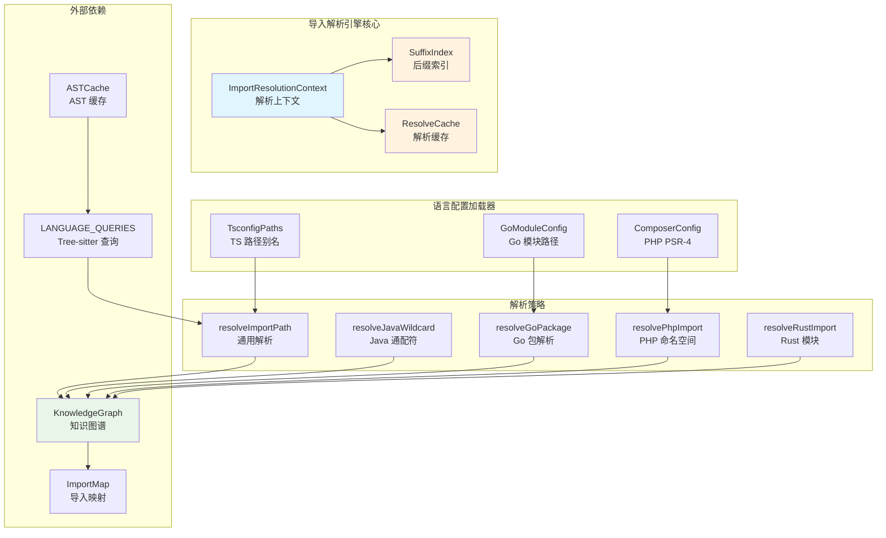
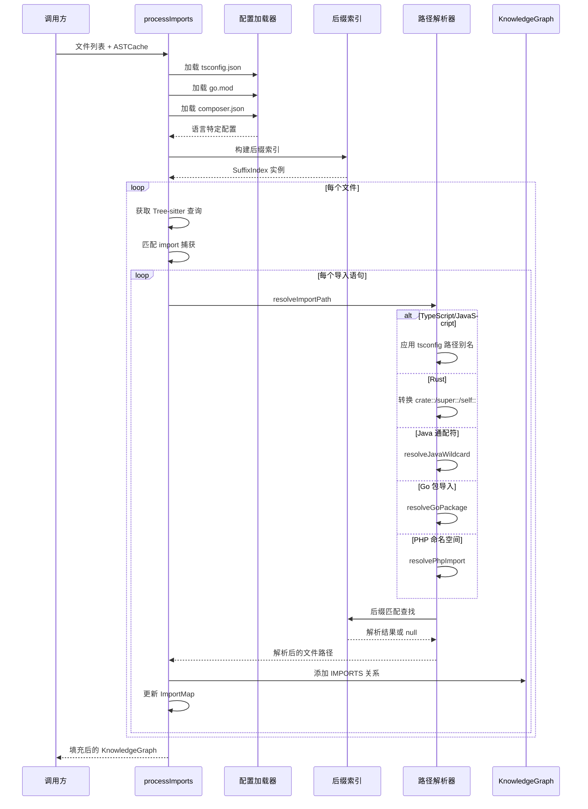
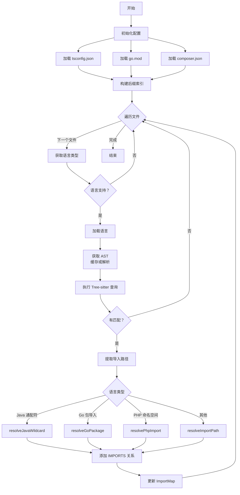

# 导入解析引擎 (Import Resolution Engine)

## 概述

导入解析引擎是 GitNexus 代码知识图谱构建流程中的核心组件，负责将源代码中的导入语句（import statements）解析并转换为图谱中的文件依赖关系。该模块位于 `core_ingestion_resolution` 子系统中，与 [符号表管理](symbol_table_management.md) 和 [调用解析引擎](call_resolution_engine.md) 共同构成了代码静态分析的三大支柱。

在现代软件项目中，文件之间的导入关系构成了代码库的骨架结构。准确解析这些关系对于理解代码架构、识别模块边界、追踪依赖传播以及进行影响分析至关重要。然而，不同编程语言有着截然不同的导入语法和解析规则——TypeScript 使用路径别名、Go 使用模块路径、PHP 使用 PSR-4 命名空间、Rust 使用模块路径语法、Java 支持通配符导入等。导入解析引擎的设计目标就是统一处理这些语言差异，提供高效、准确的跨语言导入解析能力。

该模块的核心设计理念是**预构建查找结构、语言特定预处理、通用解析回退**。通过在所有文件解析前构建后缀索引（Suffix Index）和解析缓存（Resolve Cache），将每次导入查找的时间复杂度从 O(n) 降低到 O(1)，使得在大型代码库（数十万文件）中的导入解析依然保持高效。同时，模块针对每种支持的语言实现了特定的解析逻辑，确保能够正确处理语言特有的导入模式。

## 架构设计

### 组件关系图



### 数据流图



### 核心接口定义

```typescript
// 导入解析上下文 - 预构建的查找结构
export interface ImportResolutionContext {
  allFilePaths: Set<string>;        // 所有文件路径集合
  allFileList: string[];            // 所有文件路径列表
  normalizedFileList: string[];     // 标准化路径列表（正斜杠）
  suffixIndex: SuffixIndex;         // 后缀索引用于 O(1) 查找
  resolveCache: Map<string, string | null>;  // 解析结果缓存
}

// 后缀索引接口
export interface SuffixIndex {
  get(suffix: string): string | undefined;           // 精确后缀查找
  getInsensitive(suffix: string): string | undefined; // 不区分大小写查找
  getFilesInDir(dirSuffix: string, extension: string): string[]; // 获取目录下文件
}

// TypeScript 路径别名配置
interface TsconfigPaths {
  aliases: Map<string, string>;  // 别名前缀 -> 目标前缀
  baseUrl: string;               // 路径解析基准目录
}

// Go 模块配置
interface GoModuleConfig {
  modulePath: string;  // 模块路径如 "github.com/user/repo"
}

// PHP Composer PSR-4 配置
interface ComposerConfig {
  psr4: Map<string, string>;  // 命名空间前缀 -> 目录
}
```

## 核心组件详解

### ImportResolutionContext（导入解析上下文）

`ImportResolutionContext` 是导入解析引擎的核心数据结构，它在解析开始前一次性构建所有必要的查找结构，供后续所有导入解析操作复用。这种设计避免了在每个文件解析时重复构建相同的数据结构，显著提升了大规模代码库的处理效率。

**构建过程**通过 `buildImportResolutionContext` 函数完成，该函数接收仓库中所有文件的路径列表，执行以下操作：

1. **路径标准化**：将所有文件路径中的反斜杠（Windows 风格）转换为正斜杠，确保后续比较的一致性
2. **集合构建**：创建 `Set` 用于 O(1) 的成员检查
3. **后缀索引构建**：调用 `buildSuffixIndex` 创建高效的_suffix 查找结构_
4. **缓存初始化**：创建空的解析缓存 `Map`

**内存管理策略**：解析缓存设置了 100,000 条目的上限（约 15MB 内存）。当达到上限时，系统会驱逐最旧的 20% 条目而非清空整个缓存，这种渐进式驱逐策略保持了热点数据的缓存命中率，同时防止内存无限增长。

```typescript
const RESOLVE_CACHE_CAP = 100_000;

export function buildImportResolutionContext(allPaths: string[]): ImportResolutionContext {
  const allFileList = allPaths;
  const normalizedFileList = allFileList.map(p => p.replace(/\\/g, '/'));
  const allFilePaths = new Set(allFileList);
  const suffixIndex = buildSuffixIndex(normalizedFileList, allFileList);
  return { allFilePaths, allFileList, normalizedFileList, suffixIndex, resolveCache: new Map() };
}
```

### SuffixIndex（后缀索引）

`SuffixIndex` 是导入解析引擎的性能关键组件，它通过预计算所有可能的路径后缀来实现 O(1) 时间复杂度的导入路径查找。

**索引构建原理**：对于每个文件路径，索引会生成所有可能的后缀变体。例如，对于文件 `src/com/example/Foo.java`，会创建以下索引条目：

| 后缀键 | 映射到 |
|--------|--------|
| `Foo.java` | `src/com/example/Foo.java` |
| `example/Foo.java` | `src/com/example/Foo.java` |
| `com/example/Foo.java` | `src/com/example/Foo.java` |
| `src/com/example/Foo.java` | `src/com/example/Foo.java` |

这种设计使得无论导入语句使用何种路径深度（`import Foo`、`import example.Foo` 或 `import com.example.Foo`），都能快速定位到目标文件。

**目录成员索引**：除了单文件后缀索引，`SuffixIndex` 还维护了目录到文件的映射，键格式为 `目录后缀：扩展名`。这对于 Java 通配符导入（`import com.example.*`）和 Go 包导入特别有用，可以快速获取某个包目录下的所有源文件。

```typescript
function buildSuffixIndex(normalizedFileList: string[], allFileList: string[]): SuffixIndex {
  const exactMap = new Map<string, string>();
  const lowerMap = new Map<string, string>();
  const dirMap = new Map<string, string[]>();

  for (let i = 0; i < normalizedFileList.length; i++) {
    const normalized = normalizedFileList[i];
    const original = allFileList[i];
    const parts = normalized.split('/');

    // 索引所有后缀
    for (let j = parts.length - 1; j >= 0; j--) {
      const suffix = parts.slice(j).join('/');
      if (!exactMap.has(suffix)) {
        exactMap.set(suffix, original);
      }
      const lower = suffix.toLowerCase();
      if (!lowerMap.has(lower)) {
        lowerMap.set(lower, original);
      }
    }

    // 索引目录成员
    const lastSlash = normalized.lastIndexOf('/');
    if (lastSlash >= 0) {
      const dirParts = parts.slice(0, -1);
      const fileName = parts[parts.length - 1];
      const ext = fileName.substring(fileName.lastIndexOf('.'));

      for (let j = dirParts.length - 1; j >= 0; j--) {
        const dirSuffix = dirParts.slice(j).join('/');
        const key = `${dirSuffix}:${ext}`;
        let list = dirMap.get(key);
        if (!list) {
          list = [];
          dirMap.set(key, list);
        }
        list.push(original);
      }
    }
  }

  return {
    get: (suffix: string) => exactMap.get(suffix),
    getInsensitive: (suffix: string) => lowerMap.get(suffix.toLowerCase()),
    getFilesInDir: (dirSuffix: string, extension: string) => {
      return dirMap.get(`${dirSuffix}:${extension}`) || [];
    },
  };
}
```

**性能对比**：在没有后缀索引的情况下，解析一个导入需要遍历所有文件进行后缀匹配，时间复杂度为 O(n)。使用后缀索引后，查找时间降为 O(1)。对于包含 100,000 个文件的代码库，假设每个文件平均有 20 个导入，总导入数为 2,000,000，使用索引可将查找操作从 2000 亿次比较减少到 200 万次，性能提升约 100,000 倍。

### resolveImportPath（通用路径解析）

`resolveImportPath` 函数是导入解析的核心逻辑，它处理大多数语言的通用导入解析流程。该函数采用多层解析策略，按优先级依次尝试：

**第一层：语言特定预处理**

- **TypeScript/JavaScript**：检查 `tsconfig.json` 中的路径别名配置，将 `@/utils/helper` 重写为 `src/utils/helper`
- **Rust**：将 `crate::`、`super::`、`self::` 模块路径转换为文件系统路径

**第二层：相对路径解析**

对于以 `.` 或 `..` 开头的导入，函数基于当前文件目录解析相对路径，然后尝试添加各种文件扩展名进行匹配。

**第三层：包/绝对路径解析**

对于不带相对前缀的导入（如 `lodash`、`com.example.Service`），函数将点号转换为斜杠，然后使用后缀索引进行查找。

**扩展名尝试列表**：

```typescript
const EXTENSIONS = [
  '',
  // TypeScript/JavaScript
  '.tsx', '.ts', '.jsx', '.js', '/index.tsx', '/index.ts', '/index.jsx', '/index.js',
  // Python
  '.py', '/__init__.py',
  // Java
  '.java',
  // C/C++
  '.c', '.h', '.cpp', '.hpp', '.cc', '.cxx', '.hxx', '.hh',
  // C#
  '.cs',
  // Go
  '.go',
  // Rust
  '.rs', '/mod.rs',
  // PHP
  '.php', '.phtml',
];
```

**缓存机制**：每个解析请求都使用 `currentFile::importPath` 作为缓存键。缓存命中时直接返回结果，避免重复解析。缓存驱逐采用 LRU 策略的简化版本——当达到容量上限时，移除最旧的 20% 条目。

### 语言特定解析器

#### TsconfigPaths（TypeScript 路径别名）

TypeScript 项目通常在 `tsconfig.json` 中配置路径别名，如：

```json
{
  "compilerOptions": {
    "baseUrl": ".",
    "paths": {
      "@/*": ["src/*"],
      "@utils/*": ["src/utils/*"],
      "@components/*": ["src/components/*"]
    }
  }
}
```

`loadTsconfigPaths` 函数按顺序尝试加载 `tsconfig.json`、`tsconfig.app.json`、`tsconfig.base.json`，解析其中的 `paths` 配置并转换为 `Map<string, string>` 格式。解析时会处理通配符模式，将 `@/*` 转换为 `@/` 前缀映射到 `src/` 前缀。

**解析示例**：

```typescript
// 导入语句
import { helper } from '@/utils/helper';

// tsconfig 配置
aliases: { '@/' -> 'src/' }

// 解析过程
1. 检测到 '@' 前缀匹配
2. 提取剩余部分：'/utils/helper'
3. 重写路径：'src/' + '/utils/helper' = 'src/utils/helper'
4. 尝试扩展名：src/utils/helper.ts ✓
```

#### GoModuleConfig（Go 模块路径）

Go 使用模块路径来标识内部包，如 `github.com/user/repo/internal/auth`。`loadGoModulePath` 函数解析 `go.mod` 文件提取模块路径：

```go
// go.mod
module github.com/user/repo

go 1.21
```

`resolveGoPackage` 函数处理 Go 包导入时，会：

1. 验证导入路径是否以模块路径开头
2. 提取相对包路径（如 `internal/auth`）
3. 使用目录索引获取该包目录下所有 `.go` 文件（排除 `_test.go` 测试文件）
4. 为每个文件创建 `IMPORTS` 关系

**重要特性**：Go 包导入解析返回**多个文件**而非单个文件，因为一个包由多个源文件组成。

#### ComposerConfig（PHP PSR-4）

PHP 的 PSR-4 自动加载规范将命名空间映射到目录结构。`loadComposerConfig` 函数解析 `composer.json` 中的 `autoload.psr-4` 和 `autoload-dev.psr-4` 配置：

```json
{
  "autoload": {
    "psr-4": {
      "App\\": "app/",
      "Database\\": "database/"
    }
  },
  "autoload-dev": {
    "psr-4": {
      "Tests\\": "tests/"
    }
  }
}
```

`resolvePhpImport` 函数按命名空间长度降序排序（最长匹配优先），将 `App\Http\Controllers\UserController` 转换为 `app/Http/Controllers/UserController.php`。

#### resolveRustImport（Rust 模块路径）

Rust 使用独特的模块路径语法：

| 前缀 | 含义 | 解析策略 |
|------|------|----------|
| `crate::` | 从 crate 根目录 | 从 `src/` 开始解析 |
| `super::` | 父模块 | 当前文件目录的父目录 |
| `self::` | 当前模块 | 当前文件所在目录 |
| 无前缀 | 相对路径 | 直接转换 `::` 为 `/` |

`tryRustModulePath` 函数尝试多种 Rust 模块文件命名约定：

1. `path.rs` - 单文件模块
2. `path/mod.rs` - 目录模块
3. `path/lib.rs` - crate 根模块
4. 移除最后一段后重试（最后一段可能是符号名而非模块名）

#### resolveJavaWildcard（Java 通配符导入）

Java 支持通配符导入（`import com.example.*`）和静态导入（`import static com.example.Constants.VALUE`）。这些导入需要特殊处理：

**通配符导入**：`resolveJavaWildcard` 函数将 `com.example.*` 转换为目录路径 `com/example/`，然后使用 `SuffixIndex.getFilesInDir` 获取该目录下所有 `.java` 文件。函数会过滤掉子目录中的文件，只保留直接子文件。

**静态导入**：`resolveJavaStaticImport` 函数识别静态导入模式（最后一段为小写或全大写常量名），移除成员名后解析类文件。例如 `com.example.Constants.VALUE` 被解析为 `com/example/Constants.java`。

## 主处理流程

### processImports 函数

`processImports` 是导入解析引擎的主要入口函数，它处理文件内容并提取导入关系。

**函数签名**：

```typescript
export const processImports = async (
  graph: KnowledgeGraph,
  files: { path: string; content: string }[],
  astCache: ASTCache,
  importMap: ImportMap,
  onProgress?: (current: number, total: number) => void,
  repoRoot?: string,
  allPaths?: string[],
) => Promise<void>
```

**参数说明**：

| 参数 | 类型 | 说明 |
|------|------|------|
| `graph` | `KnowledgeGraph` | 目标知识图谱，导入关系将添加到此图谱 |
| `files` | `Array<{path, content}>` | 待处理的文件列表（当前批次） |
| `astCache` | `ASTCache` | AST 缓存，避免重复解析同一文件 |
| `importMap` | `ImportMap` | 导入映射表，记录每个文件的导入目标 |
| `onProgress` | `Function` | 进度回调函数 |
| `repoRoot` | `string` | 仓库根目录，用于加载语言配置文件 |
| `allPaths` | `string[]` | 完整仓库文件列表，用于跨批次解析 |

**处理流程**：



**关键实现细节**：

1. **AST 缓存复用**：函数首先检查 `astCache` 中是否已有该文件的 AST。如果有则直接使用，否则解析并缓存。这确保了后续的调用解析和继承关系解析阶段可以复用已解析的 AST。

2. **Tree-sitter 查询**：使用 `LANGUAGE_QUERIES` 中预定义的查询字符串匹配导入语句。查询会捕获 `import` 节点和 `import.source` 节点。

3. **错误处理**：解析和查询错误会被捕获并记录（开发模式下），但不会中断整体处理流程。

4. **事件循环让出**：每处理 20 个文件调用一次 `yieldToEventLoop()`，防止阻塞主线程。

### processImportsFromExtracted 函数

`processImportsFromExtracted` 是快速路径处理函数，它直接处理预提取的导入信息，无需重新解析文件内容。这在分布式处理或增量更新场景中非常有用。

**函数签名**：

```typescript
export const processImportsFromExtracted = async (
  graph: KnowledgeGraph,
  files: { path: string }[],
  extractedImports: ExtractedImport[],
  importMap: ImportMap,
  onProgress?: (current: number, total: number) => void,
  repoRoot?: string,
  prebuiltCtx?: ImportResolutionContext,
) => Promise<void>
```

**与 processImports 的区别**：

| 特性 | processImports | processImportsFromExtracted |
|------|----------------|----------------------------|
| 输入 | 文件内容 | 预提取的导入列表 |
| AST 解析 | 需要 | 不需要 |
| Tree-sitter 查询 | 需要 | 不需要 |
| 性能 | 较慢（需解析） | 较快（直接使用） |
| 使用场景 | 首次完整处理 | 增量更新/分布式处理 |

**预构建上下文**：该函数支持传入预构建的 `ImportResolutionContext`，允许在多个处理批次间复用查找结构，进一步提升效率。

## 使用示例

### 基本使用

```typescript
import { KnowledgeGraph } from '../graph/types.js';
import { ASTCache } from './ast-cache.js';
import { processImports, createImportMap, buildImportResolutionContext } from './import-processor.js';

// 创建图谱和缓存
const graph = new KnowledgeGraph();
const astCache = new ASTCache();
const importMap = createImportMap();

// 准备文件列表
const files = [
  { path: 'src/main.ts', content: 'import { helper } from "@/utils"; ...' },
  { path: 'src/utils/index.ts', content: 'export * from "./helper"; ...' },
  { path: 'src/utils/helper.ts', content: 'export function helper() {}' },
];

// 构建解析上下文（可选，用于跨批次复用）
const allPaths = files.map(f => f.path);
const ctx = buildImportResolutionContext(allPaths);

// 执行导入解析
await processImports(
  graph,
  files,
  astCache,
  importMap,
  (current, total) => console.log(`进度：${current}/${total}`),
  '/path/to/repo',  // 仓库根目录
  allPaths          // 完整文件列表
);

// 查看结果
console.log('导入关系数量:', graph.relationships.length);
console.log('导入映射:', importMap);
```

### 使用预提取导入

```typescript
import { processImportsFromExtracted } from './import-processor.js';
import type { ExtractedImport } from './workers/parse-worker.js';

// 预提取的导入（来自之前的解析或远程处理）
const extractedImports: ExtractedImport[] = [
  { filePath: 'src/main.ts', rawImportPath: '@/utils', language: 'typescript' },
  { filePath: 'src/main.ts', rawImportPath: 'lodash', language: 'typescript' },
];

// 预构建解析上下文
const ctx = buildImportResolutionContext(allPaths);

// 快速处理
await processImportsFromExtracted(
  graph,
  files,
  extractedImports,
  importMap,
  undefined,
  '/path/to/repo',
  ctx  // 复用预构建的上下文
);
```

### 自定义语言配置

```typescript
// 加载自定义 tsconfig 路径
const tsconfigPaths = await loadTsconfigPaths('/custom/path');

// 手动构建解析上下文
const ctx: ImportResolutionContext = {
  allFilePaths: new Set(allPaths),
  allFileList: allPaths,
  normalizedFileList: allPaths.map(p => p.replace(/\\/g, '/')),
  suffixIndex: buildSuffixIndex(normalizedFileList, allPaths),
  resolveCache: new Map(),
};

// 使用自定义配置进行解析
// ... 调用 processImports 或 processImportsFromExtracted
```

## 配置选项

### 仓库根目录 (repoRoot)

`repoRoot` 参数指定仓库的根目录路径，用于加载语言特定的配置文件：

| 语言 | 配置文件 | 用途 |
|------|----------|------|
| TypeScript/JavaScript | `tsconfig.json` | 路径别名解析 |
| Go | `go.mod` | 模块路径解析 |
| PHP | `composer.json` | PSR-4 命名空间映射 |

如果未提供 `repoRoot`，函数将使用空字符串，导致无法加载这些配置文件，但基本的路径解析仍然可用。

### 完整文件列表 (allPaths)

`allPaths` 参数提供仓库中所有文件的路径列表。当处理分批次文件时，此参数确保导入解析可以跨批次进行——即当前批次的文件可以解析到之前或之后批次中的文件。

**推荐用法**：始终传入完整的仓库文件列表，即使当前只处理部分文件。

### 进度回调 (onProgress)

`onProgress` 回调函数用于报告处理进度，签名如下：

```typescript
type ProgressCallback = (current: number, total: number) => void;
```

**注意**：在 `processImports` 中，进度基于文件数量；在 `processImportsFromExtracted` 中，进度也基于文件数量（而非导入数量），这样用户看到的是更直观的文件处理进度。

## 与其他模块的集成

### 与知识图谱的集成

导入解析引擎通过 `KnowledgeGraph.addRelationship` 方法将解析结果添加到图谱中。每个导入关系包含：

```typescript
{
  id: 'IMPORTS:src/main.ts->src/utils/helper.ts',
  sourceId: 'File:src/main.ts',
  targetId: 'File:src/utils/helper.ts',
  type: 'IMPORTS',
  confidence: 1.0,
  reason: ''
}
```

这些关系可以被后续的图谱查询、可视化和分析功能使用。参考 [core_graph_types](core_graph_types.md) 了解图谱数据结构的详细信息。

### 与 AST 缓存的集成

导入解析引擎与 [core_ingestion_parsing](core_ingestion_parsing.md) 中的 `ASTCache` 紧密集成：

1. **缓存检查**：首先检查 AST 缓存中是否已有该文件的 AST
2. **按需解析**：如果缓存未命中，使用 Tree-sitter 解析并缓存
3. **缓存复用**：解析后的 AST 保留在缓存中，供调用解析和继承关系解析使用

这种设计避免了同一文件的重复解析，显著提升了整体处理效率。

### 与符号表的集成

导入解析完成后，[符号表管理](symbol_table_management.md) 模块使用导入映射来解析跨文件的符号引用。当文件 A 导入文件 B 时，文件 A 中的符号可以引用文件 B 中导出的符号。

### 与调用解析的集成

[调用解析引擎](call_resolution_engine.md) 使用导入映射来确定跨文件调用的目标。当文件 A 中的函数调用文件 B 中的函数时，导入关系提供了必要的上下文来解析调用目标。

## 边缘情况与限制

### 外部依赖处理

导入解析引擎**仅解析仓库内部的文件导入**。外部依赖（如 npm 包、Go 模块、Maven 依赖）不会被解析为图谱关系。这些导入的解析结果为 `null`，不会添加到图谱中。

**影响**：图谱中的导入关系仅反映内部代码结构，不包含第三方依赖。如需分析外部依赖，需要集成包管理器元数据。

### 循环导入

循环导入（A 导入 B，B 导入 A）在技术上是允许的，不会导致解析错误。图谱中会创建双向的 `IMPORTS` 关系。

**注意**：循环导入可能表示代码设计问题，但解析引擎不会检测或报告此类问题。

### 模糊路径匹配

当多个文件具有相同的后缀时，后缀索引只保留第一个匹配（最长路径优先）。例如：

```
src/utils/helper.ts
src/components/utils/helper.ts
```

导入 `utils/helper` 会匹配到 `src/utils/helper.ts`，因为它的后缀先被索引。

**缓解策略**：使用更具体的导入路径（包含更多目录层级）可以减少歧义。

### 大小写敏感性

后缀索引同时维护精确匹配和不区分大小写匹配。解析时优先尝试精确匹配，失败后尝试不区分大小写匹配。

**平台差异**：在大小写不敏感的文件系统（如 Windows、macOS 默认）上，这种行为是合理的。在大小写敏感的文件系统（如 Linux）上，不区分大小写的匹配可能导致意外结果。

### 动态导入

动态导入（如 `import()` 函数调用、`require()` 调用）不会被 Tree-sitter 查询捕获，因为查询只匹配静态导入语句。

**影响**：使用动态导入的代码可能缺少部分导入关系。

### 条件导入

基于运行时条件的导入（如 `if (process.env.X) import ...`）不会被特殊处理，只要导入语句在语法上存在就会被解析。

### 解析缓存限制

解析缓存的 100,000 条目上限对于大多数项目足够，但对于超大型代码库（如 monorepo 包含数十万文件），可能导致频繁的缓存驱逐。

**监控建议**：在开发模式下，观察日志中的导入解析统计信息，如果解析命中率过低，可能需要调整缓存策略。

### 语言支持范围

当前支持的语言包括：TypeScript、JavaScript、Python、Java、Go、Rust、PHP、C、C++、C#。其他语言的导入语句不会被解析。

**扩展方法**：在 `LANGUAGE_QUERIES` 中添加新语言的 Tree-sitter 查询，并在 `resolveImportPath` 中添加语言特定逻辑。

## 性能优化建议

### 预构建解析上下文

在分批次处理文件时，预构建 `ImportResolutionContext` 并在所有批次间复用：

```typescript
// 一次性构建
const ctx = buildImportResolutionContext(allRepoPaths);

// 每个批次复用
for (const batch of fileBatches) {
  await processImportsFromExtracted(
    graph, batch, extractedImports, importMap,
    undefined, repoRoot, ctx  // 传入预构建的上下文
  );
}
```

### 使用快速路径

如果导入信息已经通过其他方式提取（如之前的解析运行、远程处理），使用 `processImportsFromExtracted` 而非 `processImports`，避免重复的 AST 解析。

### 批量加载配置文件

语言配置文件（tsconfig.json、go.mod、composer.json）在处理开始时一次性加载，避免在每个文件处理时重复读取文件系统。

### 事件循环让出

处理大量文件时，定期调用 `yieldToEventLoop()` 防止阻塞主线程。当前实现每 20 个文件让出一次，可根据实际需求调整。

## 调试与监控

### 开发模式日志

在 `NODE_ENV=development` 环境下，模块会输出详细的日志信息：

```
📦 Loaded 5 path aliases from tsconfig.json
📦 Loaded Go module path: github.com/user/repo
📦 Loaded 12 PSR-4 mappings from composer.json
📊 Import processing complete: 1523/1680 imports resolved to graph edges
```

### 错误诊断

当 Tree-sitter 查询失败时，开发模式下会输出详细的诊断信息：

```
🔴 Query Error: src/problematic.ts
Language: typescript
Query (first 200 chars): (import_statement ...)
Error: Query error at row 5, column 3
File content (first 300 chars): import { x } from ...
AST root type: program
AST has errors: true
```

### 统计信息

处理完成后，日志显示导入解析的统计信息：

- **totalImportsFound**：检测到的导入语句总数
- **totalImportsResolved**：成功解析到内部文件的导入数量

解析率（resolved/found）可以帮助识别配置问题或外部依赖比例。

## 相关模块

- [符号表管理](symbol_table_management.md) - 使用导入映射解析跨文件符号引用
- [调用解析引擎](call_resolution_engine.md) - 使用导入关系解析跨文件调用
- [core_ingestion_parsing](core_ingestion_parsing.md) - 提供 AST 缓存和解析工作器
- [core_graph_types](core_graph_types.md) - 定义知识图谱数据结构
- [entry_intelligence](entry_intelligence.md) - 使用导入关系进行入口点评分

## 总结

导入解析引擎是 GitNexus 代码分析流水线的关键组件，它负责将源代码中的导入语句转换为知识图谱中的文件依赖关系。通过预构建的后缀索引和解析缓存，该模块实现了高效的跨语言导入解析，支持 TypeScript、JavaScript、Python、Java、Go、Rust、PHP 等多种编程语言。

核心设计原则包括：

1. **预构建查找结构**：一次性构建后缀索引，实现 O(1) 查找
2. **语言特定预处理**：针对每种语言的导入语法进行专门处理
3. **通用解析回退**：当语言特定解析失败时，使用通用的后缀匹配
4. **缓存优化**：使用 LRU 风格的解析缓存减少重复计算
5. **渐进式处理**：支持分批次处理和预提取导入的快速路径

理解导入解析引擎的工作原理对于扩展语言支持、优化处理性能以及诊断解析问题至关重要。
