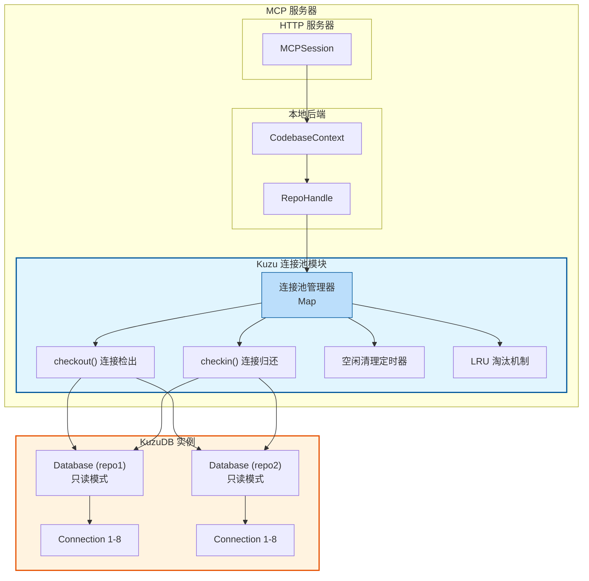
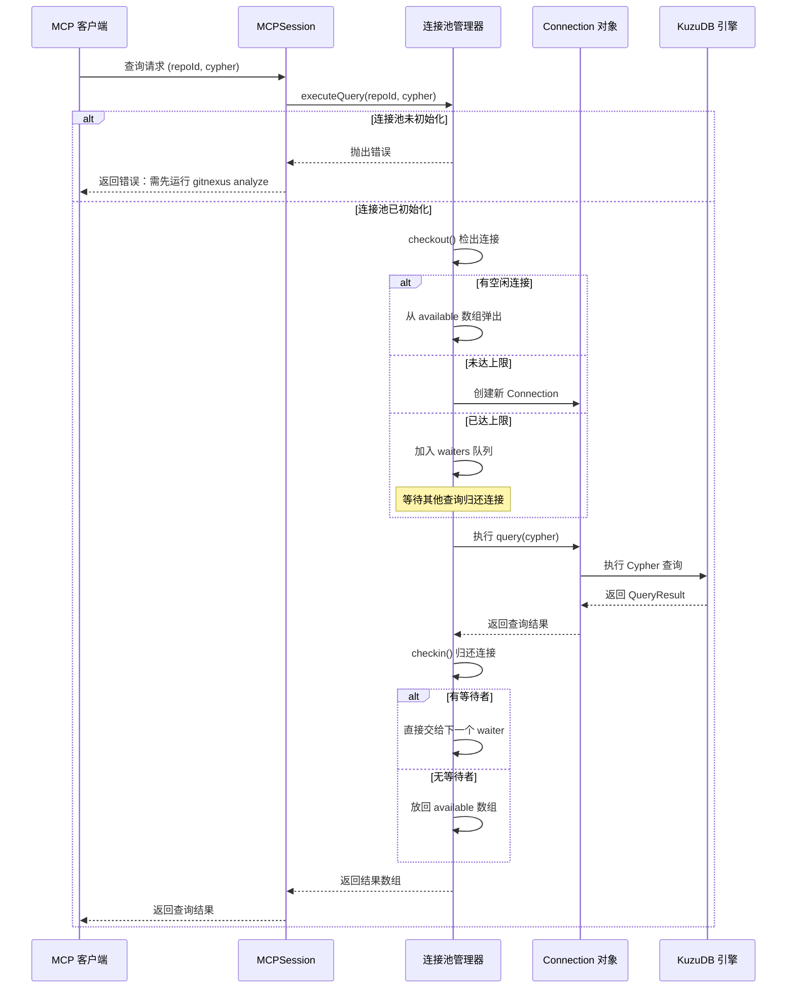
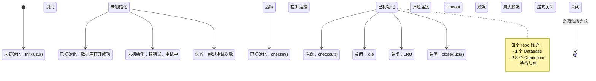
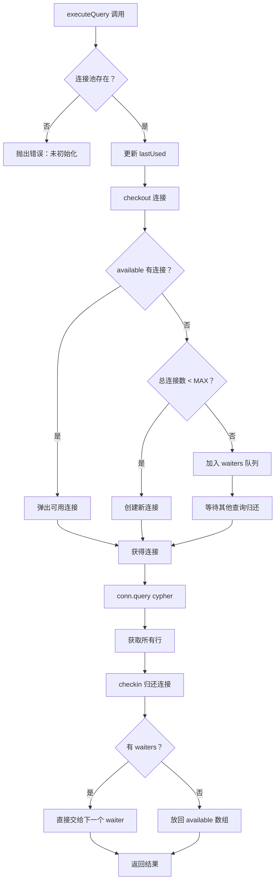
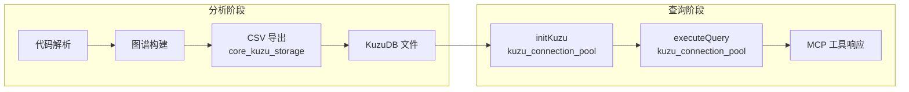

# Kuzu 连接池模块 (kuzu_connection_pool)

## 概述

`kuzu_connection_pool` 模块是 GitNexus MCP 服务器的核心基础设施组件，负责管理 KuzuDB 图数据库的连接池。该模块解决了 KuzuDB 连接对象**非线程安全**的关键约束，通过实现连接池模式，确保多个并发查询能够安全地共享同一个数据库实例。

在 GitNexus 系统中，MCP 服务器需要同时处理来自多个客户端的并发查询请求，每个请求都可能需要访问代码库的知识图谱数据。KuzuDB 的官方并发模式允许从同一个 `Database` 对象创建多个 `Connection` 对象，但每个 `Connection` 本身不能同时处理多个查询。本模块通过维护一个可复用的连接池，自动管理连接的分配、回收和生命周期，为上层提供透明的高并发查询能力。

该模块位于 `mcp_server` 模块体系下，与 `local_backend`、`resource_system` 和 `http_server` 等组件紧密协作，是 MCP 服务器读取代码库图谱数据的核心通道。

---

## 架构设计

### 核心设计原则

1. **连接隔离**：每个并发查询获得独立的 `Connection` 对象，避免 KuzuDB 的段错误（segfault）风险
2. **资源复用**：连接对象在查询完成后回收到池中，避免频繁创建/销毁的开销
3. **容量控制**：通过 LRU 淘汰和空闲超时机制，防止内存泄漏和资源耗尽
4. **只读安全**：以只读模式打开数据库，允许多个 MCP 服务器实例并发读取，同时避免与 `gitnexus analyze` 命令的写操作冲突

### 系统架构图



### 数据流图



### 连接池状态机



---

## 核心组件详解

### PoolEntry 接口

`PoolEntry` 是连接池的核心数据结构，表示单个代码库的数据库连接池状态。

```typescript
interface PoolEntry {
  db: kuzu.Database;           // KuzuDB 数据库实例
  available: kuzu.Connection[]; // 可用连接池
  checkedOut: number;           // 已检出连接数
  waiters: Array<(conn: kuzu.Connection) => void>; // 等待队列
  lastUsed: number;             // 最后使用时间戳
  dbPath: string;               // 数据库文件路径
}
```

#### 字段说明

| 字段 | 类型 | 说明 |
|------|------|------|
| `db` | `kuzu.Database` | KuzuDB 数据库实例，每个 repo 唯一。以只读模式打开，支持并发读取。 |
| `available` | `kuzu.Connection[]` | 当前可用的连接数组。查询完成后归还的连接会放入此数组供后续复用。 |
| `checkedOut` | `number` | 当前已被检出的连接数量。用于追踪活跃查询数，配合 `available.length` 计算总连接数。 |
| `waiters` | `Array<(conn) => void>` | 当连接池达到上限时，新查询的回调函数会进入此队列。连接归还时直接交给队列头部的等待者。 |
| `lastUsed` | `number` | 最后使用时间的 Unix 时间戳（毫秒）。用于 LRU 淘汰和空闲超时判断。 |
| `dbPath` | `string` | 数据库文件在磁盘上的路径。用于错误提示和调试。 |

#### 设计要点

1. **单 Database 多 Connection**：每个 `PoolEntry` 只维护一个 `Database` 实例，但可以有多个 `Connection`。这是 KuzuDB 官方推荐的并发模式。

2. **等待队列优化**：当连接池满时，新查询不会轮询检查，而是通过 Promise 挂起。连接归还时，如果有等待者，直接通过回调传递连接，避免"归还→放入数组→检出"的中间状态竞争。

3. **时间戳追踪**：`lastUsed` 在每次 `executeQuery` 调用时更新，确保活跃的连接池不会被空闲清理器误删。

---

### 连接池全局配置

模块定义了四个关键配置常量，控制连接池的行为：

```typescript
const MAX_POOL_SIZE = 5;           // 最大 repo 数量（LRU 淘汰）
const IDLE_TIMEOUT_MS = 5 * 60 * 1000; // 空闲超时（5 分钟）
const MAX_CONNS_PER_REPO = 8;      // 每个 repo 最大连接数
const INITIAL_CONNS_PER_REPO = 2;  // 初始预创建连接数
```

#### 配置参数详解

**MAX_POOL_SIZE = 5**

限制内存中同时存在的代码库数量。当第 6 个代码库被访问时，LRU（最近最少使用）淘汰机制会关闭最久未使用的代码库的连接池。这个限制防止 MCP 服务器在访问大量代码库时内存无限增长。

**IDLE_TIMEOUT_MS = 5 分钟**

连接池的空闲超时时间。如果某个代码库在 5 分钟内没有任何查询，其连接池会被自动关闭以释放资源。清理定时器每 60 秒运行一次检查。

**MAX_CONNS_PER_REPO = 8**

单个代码库的最大并发连接数。这限制了同一时间能有多少个查询同时执行。8 是一个经验值，平衡了并发能力和资源消耗。对于大多数 MCP 使用场景，同时 8 个查询已经足够。

**INITIAL_CONNS_PER_REPO = 2**

初始化时预创建的连接数。避免第一个查询需要等待连接创建。2 个初始连接可以处理少量并发，后续连接按需创建直到达到上限。

---

### 核心函数

#### initKuzu(repoId, dbPath)

初始化指定代码库的数据库连接池。

```typescript
export const initKuzu = async (repoId: string, dbPath: string): Promise<void>
```

**参数**

| 参数 | 类型 | 说明 |
|------|------|------|
| `repoId` | `string` | 代码库的唯一标识符，用作连接池的键 |
| `dbPath` | `string` | KuzuDB 数据库文件在磁盘上的路径 |

**返回值**

`Promise<void>` - 初始化成功时 resolve，失败时 reject

**执行流程**

1. **检查现有池**：如果该 `repoId` 已有连接池，仅更新 `lastUsed` 时间戳并返回
2. **验证数据库存在**：检查 `dbPath` 是否存在，不存在则抛出错误提示用户运行 `gitnexus analyze`
3. **LRU 淘汰**：如果池已满，淘汰最久未使用的代码库
4. **打开数据库**：以只读模式打开 KuzuDB，带重试逻辑处理锁冲突
5. **预创建连接**：创建 `INITIAL_CONNS_PER_REPO` 个连接放入 `available` 数组
6. **启动定时器**：确保空闲清理定时器运行

**锁重试机制**

当 `gitnexus analyze` 命令正在写入数据库时，MCP 服务器以只读模式打开可能会遇到锁冲突。`initKuzu` 实现了指数退避重试：

```typescript
const LOCK_RETRY_ATTEMPTS = 3;
const LOCK_RETRY_DELAY_MS = 2000;

for (let attempt = 1; attempt <= LOCK_RETRY_ATTEMPTS; attempt++) {
  try {
    // 尝试打开数据库
  } catch (err) {
    if (锁错误 && attempt < LOCK_RETRY_ATTEMPTS) {
      await sleep(LOCK_RETRY_DELAY_MS * attempt); // 2s, 4s, 6s
      continue;
    }
    throw;
  }
}
```

**stdout 静默处理**

KuzuDB 的 native 模块可能会向 stdout 输出调试信息，这会干扰 MCP 协议的 stdio 通信。`initKuzu` 在创建数据库和连接时临时替换 `process.stdout.write` 为无操作函数。

**错误处理**

| 错误场景 | 错误消息 | 建议操作 |
|----------|----------|----------|
| 数据库不存在 | `KuzuDB not found at ${dbPath}. Run: gitnexus analyze` | 运行分析命令生成数据库 |
| 锁冲突（重试耗尽） | `KuzuDB unavailable for ${repoId}. Another process may be rebuilding the index.` | 等待 `gitnexus analyze` 完成后重试 |
| 其他错误 | 包含原始错误消息 | 检查数据库文件权限和完整性 |

---

#### executeQuery(repoId, cypher)

执行 Cypher 查询的核心入口函数，自动管理连接的检出和归还。

```typescript
export const executeQuery = async (repoId: string, cypher: string): Promise<any[]>
```

**参数**

| 参数 | 类型 | 说明 |
|------|------|------|
| `repoId` | `string` | 目标代码库的标识符 |
| `cypher` | `string` | Cypher 查询语句 |

**返回值**

`Promise<any[]>` - 查询结果数组，每个元素对应一行记录

**执行流程**



**连接检出策略**

1. **快速路径**：如果 `available` 数组非空，直接弹出一个连接，`checkedOut++`
2. **扩容路径**：如果总连接数（`available.length + checkedOut`）小于 `MAX_CONNS_PER_REPO`，创建新连接
3. **等待路径**：如果已达上限，创建 Promise 并将 resolve 回调加入 `waiters` 队列

**连接归还策略**

1. **有等待者**：直接从 `waiters` 队列取出头部回调，传入连接并执行。连接不经过 `available` 数组，避免竞争条件。
2. **无等待者**：`checkedOut--`，连接推入 `available` 数组供后续使用。

**结果处理**

KuzuDB 的 `query()` 返回 `QueryResult` 对象，需要调用 `getAll()` 获取所有行。函数处理了返回值的两种可能格式（数组或对象），统一返回行数组。

**示例**

```typescript
// 查询所有类节点
const classes = await executeQuery(
  'my-repo',
  'MATCH (c:Class) RETURN c.name, c.filePath LIMIT 10'
);

// classes 格式：
// [
//   { c: { name: 'UserService', filePath: '/src/services/user.ts' } },
//   { c: { name: 'AuthController', filePath: '/src/controllers/auth.ts' } },
//   ...
// ]
```

---

#### checkout(entry) / checkin(entry, conn)

内部函数，管理单个连接的检出和归还逻辑。

**checkout(entry)**

```typescript
function checkout(entry: PoolEntry): Promise<kuzu.Connection>
```

从连接池中获取一个可用连接。返回 Promise 是因为可能需要等待其他查询归还连接。

**checkin(entry, conn)**

```typescript
function checkin(entry: PoolEntry, conn: kuzu.Connection): void
```

将连接归还到池中。如果有等待者，直接传递；否则放回可用数组。

**设计要点**

- **直接传递优化**：当有等待者时，连接不经过 `available` 数组，直接从归还者传递给等待者。这减少了中间状态的竞争窗口。
- **计数同步**：`checkedOut` 计数在检出时增加，在无等待者归还时减少。有等待者时计数保持不变（因为连接立即被下一个查询使用）。

---

#### closeKuzu(repoId?)

关闭连接池，释放资源。

```typescript
export const closeKuzu = async (repoId?: string): Promise<void>
```

**参数**

| 参数 | 类型 | 说明 |
|------|------|------|
| `repoId` | `string` (可选) | 指定要关闭的代码库。如果省略，关闭所有连接池。 |

**行为**

1. **单 repo 关闭**：如果提供 `repoId`，仅关闭该 repo 的所有连接和数据库
2. **全部关闭**：如果省略 `repoId`，遍历并关闭所有 repo 的连接池，并清除空闲定时器

**使用场景**

- MCP 服务器关闭时清理所有资源
- 测试完成后重置连接池状态
- 显式释放不再需要的代码库资源

---

#### isKuzuReady(repoId)

检查指定代码库的连接池是否已初始化。

```typescript
export const isKuzuReady = (repoId: string): boolean
```

**返回值**

`boolean` - `true` 表示连接池已初始化并可接受查询

**使用场景**

```typescript
if (!isKuzuReady(repoId)) {
  await initKuzu(repoId, dbPath);
}
const results = await executeQuery(repoId, cypher);
```

---

#### 内部辅助函数

**createConnection(db)**

创建新的 KuzuDB 连接，同时静默 stdout 防止 native 模块输出干扰 MCP 协议。

```typescript
function createConnection(db: kuzu.Database): kuzu.Connection {
  const origWrite = process.stdout.write;
  process.stdout.write = (() => true) as any;
  try {
    return new kuzu.Connection(db);
  } finally {
    process.stdout.write = origWrite;
  }
}
```

**closeOne(repoId)**

关闭单个 repo 的所有连接和数据库，并从全局 `pool` Map 中删除。

**evictLRU()**

如果连接池数量达到 `MAX_POOL_SIZE`，淘汰 `lastUsed` 最老的 repo。

**ensureIdleTimer()**

确保空闲清理定时器运行。定时器每 60 秒检查一次所有 repo，关闭超过 `IDLE_TIMEOUT_MS` 未使用的连接池。

---

## 与其他模块的集成

### 与 local_backend 的协作

`local_backend` 模块的 `LocalBackend` 和 `RepoHandle` 类使用本模块访问代码库的图谱数据。典型调用流程：

```typescript
// local_backend.ts 简化示例
class RepoHandle {
  async queryGraph(cypher: string): Promise<any[]> {
    // 确保连接池初始化
    if (!isKuzuReady(this.repoId)) {
      await initKuzu(this.repoId, this.dbPath);
    }
    // 执行查询
    return executeQuery(this.repoId, cypher);
  }
}
```

参考 [local_backend](mcp_server.md#local_backend) 模块文档了解完整的后端实现。

### 与 core_kuzu_storage 的关系

`core_kuzu_storage` 模块定义了 KuzuDB 相关的类型，如 `StreamedCSVResult`、`FileContentCache` 和 `BufferedCSVWriter`。这些类型用于分析阶段将图谱数据导出为 CSV 格式，然后由本模块在查询阶段读取。



参考 [core_kuzu_storage](core_kuzu_storage.md) 模块文档了解 CSV 导出机制。

### 与 http_server 的集成

`MCPSession` 类（来自 `http_server` 子模块）通过 `local_backend` 间接使用本模块处理 HTTP 请求。SSE 或 stdio 传输的查询请求最终都会调用 `executeQuery`。

参考 [http_server](mcp_server.md#http_server) 模块文档了解 MCP 会话管理。

---

## 使用指南

### 基本使用模式

```typescript
import { initKuzu, executeQuery, closeKuzu, isKuzuReady } from './kuzu-adapter';

async function main() {
  const repoId = 'my-project';
  const dbPath = '/path/to/repo/.gitnexus/kuzu.db';
  
  try {
    // 1. 初始化连接池
    await initKuzu(repoId, dbPath);
    
    // 2. 执行查询
    const classes = await executeQuery(
      repoId,
      'MATCH (c:Class) RETURN c.name, c.loc LIMIT 10'
    );
    
    console.log('Found classes:', classes);
    
    // 3. 检查状态
    console.log('Pool ready:', isKuzuReady(repoId));
    
  } catch (error) {
    console.error('Query failed:', error);
  } finally {
    // 4. 清理资源
    await closeKuzu(repoId);
  }
}
```

### MCP 服务器中的使用

在 MCP 服务器中，连接池的初始化通常发生在 `LocalBackend` 启动时：

```typescript
// mcp/local/local-backend.ts 简化示例
export class LocalBackend {
  async initializeRepo(repoPath: string): Promise<RepoHandle> {
    const repoId = await this.getRepoId(repoPath);
    const dbPath = path.join(repoPath, '.gitnexus', 'kuzu.db');
    
    // 初始化连接池
    await initKuzu(repoId, dbPath);
    
    return new RepoHandle(repoId, dbPath);
  }
}
```

### 并发查询示例

```typescript
// 多个查询并发执行，连接池自动分配连接
const [classes, functions, imports] = await Promise.all([
  executeQuery(repoId, 'MATCH (c:Class) RETURN count(c) as count'),
  executeQuery(repoId, 'MATCH (f:Function) RETURN count(f) as count'),
  executeQuery(repoId, 'MATCH ()-[i:IMPORTS]->() RETURN count(i) as count'),
]);

// 如果并发数超过 MAX_CONNS_PER_REPO (8)，超出的查询会自动排队等待
```

---

## 配置与调优

### 调整连接池参数

修改模块顶部的常量可以调整连接池行为：

```typescript
// 增加最大 repo 数量（适合需要同时访问多个代码库的场景）
const MAX_POOL_SIZE = 10; // 默认 5

// 缩短空闲超时（适合资源受限环境）
const IDLE_TIMEOUT_MS = 2 * 60 * 1000; // 默认 5 分钟

// 增加并发连接数（适合高并发查询场景）
const MAX_CONNS_PER_REPO = 16; // 默认 8

// 增加初始连接数（减少冷启动延迟）
const INITIAL_CONNS_PER_REPO = 4; // 默认 2
```

**调优建议**

| 场景 | 推荐配置 | 理由 |
|------|----------|------|
| 开发环境，单 repo | `MAX_CONNS_PER_REPO = 4` | 减少内存占用，4 个并发足够 |
| 生产环境，多 repo | `MAX_POOL_SIZE = 10`, `MAX_CONNS_PER_REPO = 16` | 支持更多并发和代码库 |
| 资源受限（如容器） | `IDLE_TIMEOUT_MS = 60000` | 快速释放空闲资源 |
| 高并发查询 | `INITIAL_CONNS_PER_REPO = 4` | 减少连接创建延迟 |

### 监控连接池状态

虽然模块未提供显式的监控 API，但可以通过以下方式观察连接池行为：

```typescript
// 调试：查看当前池状态（需要临时导出 pool 变量）
console.log('Active repos:', pool.size);
for (const [repoId, entry] of pool) {
  console.log(`${repoId}: available=${entry.available.length}, checkedOut=${entry.checkedOut}, waiters=${entry.waiters.length}`);
}
```

---

## 边缘情况与注意事项

### 1. 数据库锁冲突

**问题**：当 `gitnexus analyze` 命令正在写入数据库时，MCP 服务器以只读模式打开可能会遇到锁冲突。

**表现**：`initKuzu` 抛出 `Could not set lock` 或包含 `lock` 的错误消息。

**解决**：
- 模块已内置重试机制（最多 3 次，指数退避）
- 如果重试失败，等待 `gitnexus analyze` 完成后重试
- 避免在分析过程中查询同一代码库

### 2. 连接泄漏

**问题**：如果 `executeQuery` 抛出异常，连接可能未正确归还。

**防护**：模块使用 `try/finally` 确保 `checkin` 总是执行：

```typescript
const conn = await checkout(entry);
try {
  const result = await conn.query(cypher);
  return await result.getAll();
} finally {
  checkin(entry, conn); // 总是执行
}
```

**注意**：如果在 `checkout` 后、`try` 前抛出异常（如 `conn.query` 参数错误），连接仍会归还。但如果在 `checkout` 前抛出异常（如 `repoId` 不存在），不会发生泄漏。

### 3. 等待队列饥饿

**问题**：如果某个查询长时间持有连接（如复杂查询或网络延迟），后续查询会一直等待。

**表现**：`waiters` 队列增长，新查询响应变慢。

**缓解**：
- `MAX_CONNS_PER_REPO` 限制单个 repo 的并发，防止单个 repo 耗尽所有资源
- `IDLE_TIMEOUT_MS` 定期清理空闲连接池，但不会中断活跃查询
- **建议**：优化 Cypher 查询，避免长时间运行的查询

### 4. 内存泄漏

**问题**：如果 `idleTimer` 未正确清理，可能导致进程无法退出。

**防护**：
- `closeKuzu()` 无参数调用时会清除定时器
- 定时器使用 `unref()` 允许进程在无其他任务时退出
- MCP 服务器关闭时应调用 `closeKuzu()`

### 5. stdout 静默的副作用

**问题**：模块临时替换 `process.stdout.write` 以静默 KuzuDB 的 native 输出。

**风险**：如果在静默期间有其他代码向 stdout 写入，输出会丢失。

**防护**：使用 `try/finally` 确保总是恢复原始 `stdout.write`：

```typescript
const origWrite = process.stdout.write;
process.stdout.write = (() => true) as any;
try {
  return new kuzu.Connection(db);
} finally {
  process.stdout.write = origWrite; // 总是恢复
}
```

### 6. 数据库文件不存在

**问题**：调用 `initKuzu` 时数据库文件尚未生成。

**表现**：抛出 `KuzuDB not found at ${dbPath}. Run: gitnexus analyze`

**解决**：确保先运行 `gitnexus analyze` 命令生成数据库。

### 7. 并发初始化竞争

**问题**：多个请求同时调用 `initKuzu` 同一个 `repoId`。

**防护**：`initKuzu` 开头检查现有池：

```typescript
const existing = pool.get(repoId);
if (existing) {
  existing.lastUsed = Date.now();
  return; // 直接返回，不重复初始化
}
```

---

## 已知限制

1. **不支持写操作**：连接池以只读模式打开数据库，无法执行 `CREATE`、`MERGE`、`DELETE` 等写操作。这是设计决策，确保 MCP 服务器不会意外修改图谱数据。

2. **固定配置常量**：连接池参数（`MAX_POOL_SIZE`、`MAX_CONNS_PER_REPO` 等）是硬编码常量，无法在运行时配置。如需调整，需修改源代码并重新构建。

3. **无连接健康检查**：模块假设 KuzuDB 连接始终有效。如果连接因某种原因失效（如数据库文件损坏），查询会抛出异常，但连接不会被自动替换。

4. **单进程限制**：连接池是进程内单例，无法在多个进程间共享。每个 MCP 服务器进程维护自己的连接池。

5. **无查询超时**：`executeQuery` 没有内置超时机制。长时间运行的查询会一直占用连接，可能导致等待队列饥饿。

---

## 故障排查

### 常见错误及解决方案

| 错误消息 | 可能原因 | 解决方案 |
|----------|----------|----------|
| `KuzuDB not found at ${dbPath}` | 数据库未生成 | 运行 `gitnexus analyze` |
| `KuzuDB unavailable for ${repoId}` | 锁冲突，分析正在进行 | 等待分析完成，或检查是否有多个分析进程 |
| `KuzuDB not initialized for repo` | 未调用 `initKuzu` | 确保查询前初始化连接池 |
| `Segmentation fault` | 连接并发使用（应被池防止） | 检查是否绕过连接池直接使用 `kuzu.Connection` |

### 调试技巧

1. **启用连接池日志**（需临时修改代码）：
```typescript
// 在 checkout 和 checkin 中添加日志
console.log(`checkout: repo=${repoId}, available=${entry.available.length}, checkedOut=${entry.checkedOut}`);
console.log(`checkin: repo=${repoId}, available=${entry.available.length}, checkedOut=${entry.checkedOut}`);
```

2. **监控等待队列**：
```typescript
// 定期检查 waiters 长度
setInterval(() => {
  for (const [repoId, entry] of pool) {
    if (entry.waiters.length > 0) {
      console.warn(`High contention on ${repoId}: ${entry.waiters.length} waiters`);
    }
  }
}, 5000);
```

3. **检查数据库文件**：
```bash
# 确认数据库文件存在
ls -la /path/to/repo/.gitnexus/

# 检查文件权限
stat /path/to/repo/.gitnexus/kuzu.db
```

---

## 扩展与定制

### 添加连接健康检查

可以通过扩展 `checkout` 函数添加连接健康检查：

```typescript
async function checkout(entry: PoolEntry): Promise<kuzu.Connection> {
  if (entry.available.length > 0) {
    const conn = entry.available.pop()!;
    // 健康检查
    try {
      await conn.query('RETURN 1');
    } catch {
      // 连接失效，创建新连接
      return createConnection(entry.db);
    }
    entry.checkedOut++;
    return conn;
  }
  // ... 其余逻辑
}
```

### 添加查询超时

可以通过 `Promise.race` 添加查询超时：

```typescript
export const executeQuery = async (
  repoId: string,
  cypher: string,
  timeoutMs: number = 30000
): Promise<any[]> => {
  const entry = pool.get(repoId);
  if (!entry) throw new Error('Not initialized');
  
  const conn = await checkout(entry);
  try {
    const queryPromise = conn.query(cypher);
    const timeoutPromise = new Promise((_, reject) =>
      setTimeout(() => reject(new Error('Query timeout')), timeoutMs)
    );
    const result = await Promise.race([queryPromise, timeoutPromise]);
    return await result.getAll();
  } finally {
    checkin(entry, conn);
  }
};
```

### 添加连接池指标

可以导出连接池统计信息用于监控：

```typescript
export function getPoolStats(): Record<string, any> {
  const stats: Record<string, any> = {};
  for (const [repoId, entry] of pool) {
    stats[repoId] = {
      available: entry.available.length,
      checkedOut: entry.checkedOut,
      waiters: entry.waiters.length,
      total: entry.available.length + entry.checkedOut,
      lastUsed: entry.lastUsed,
    };
  }
  return {
    totalRepos: pool.size,
    repos: stats,
  };
}
```

---

## 参考文档

- [KuzuDB 并发文档](https://docs.kuzudb.com/concurrency) — 官方并发模式说明
- [mcp_server](mcp_server.md) — MCP 服务器模块总览
- [local_backend](mcp_server.md#local_backend) — 本地后端实现
- [core_kuzu_storage](core_kuzu_storage.md) — KuzuDB 存储和 CSV 导出
- [http_server](mcp_server.md#http_server) — MCP HTTP 服务器

---

## 文档边界说明

本文档仅依据 `gitnexus/src/mcp/core/kuzu-adapter.ts` 当前实现与模块树信息编写。对于跨模块调用链（例如 `local_backend`、`http_server` 的具体方法签名），请以对应模块文档和源码为准。

---

## 总结

`kuzu_connection_pool` 模块是 GitNexus MCP 服务器的关键基础设施，通过连接池模式解决了 KuzuDB 连接非线程安全的约束。其核心设计原则是：

1. **安全并发**：每个查询获得独立连接，避免段错误
2. **资源高效**：连接复用、LRU 淘汰、空闲清理
3. **只读隔离**：与 `gitnexus analyze` 写操作无冲突
4. **透明使用**：上层无需关心连接管理细节

理解本模块的工作原理对于开发和维护 GitNexus MCP 服务器至关重要，特别是在处理高并发查询、调试锁冲突或优化查询性能时。
