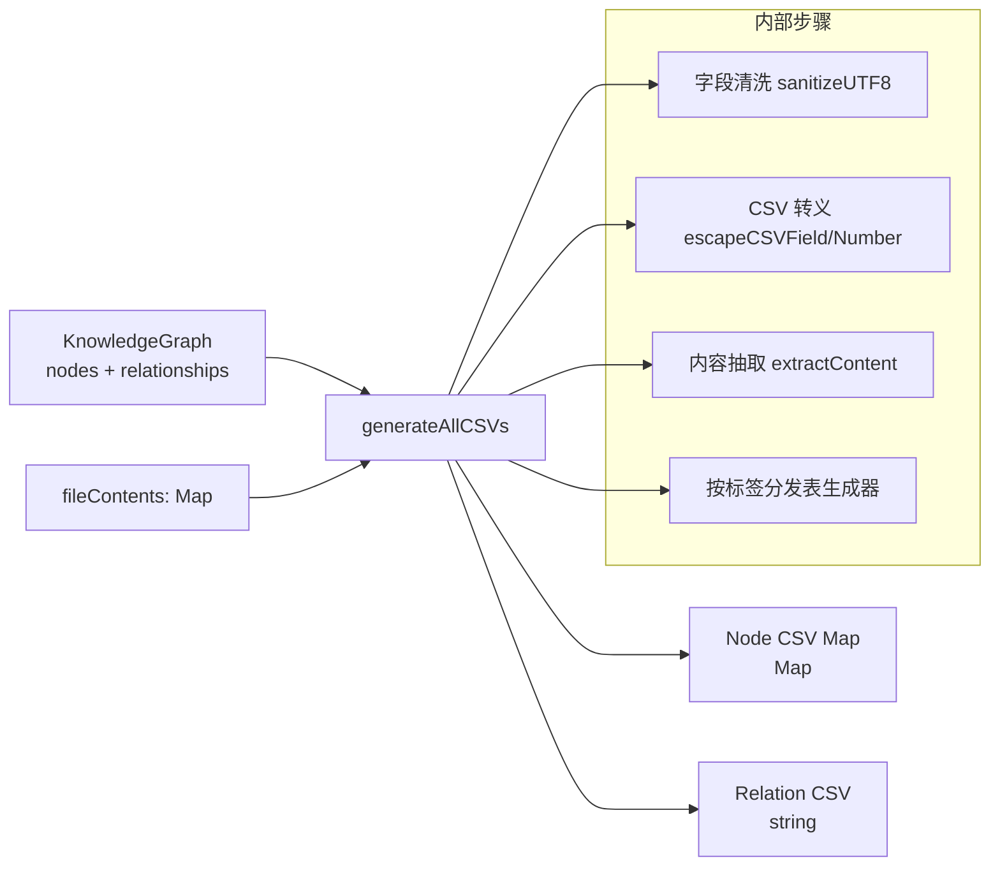
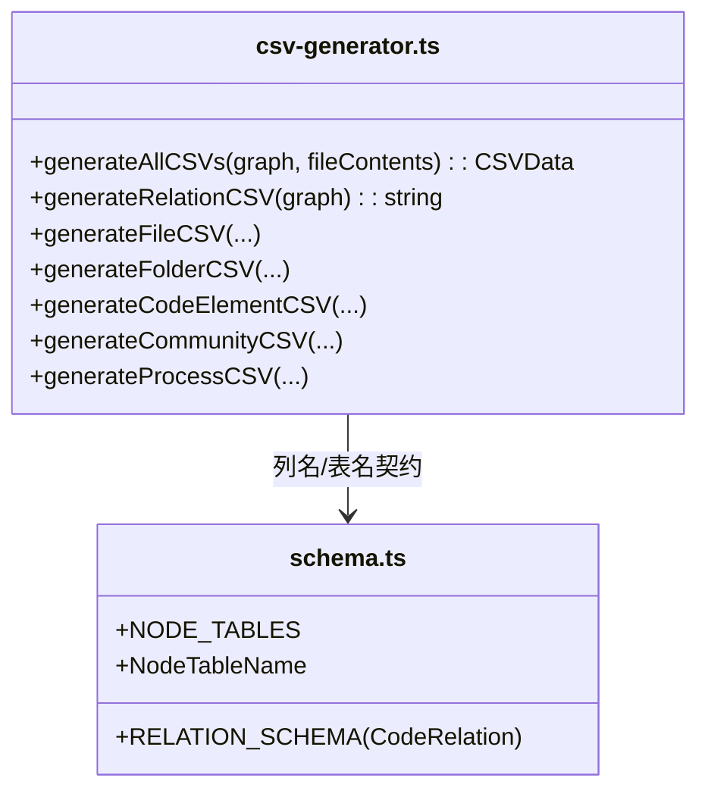
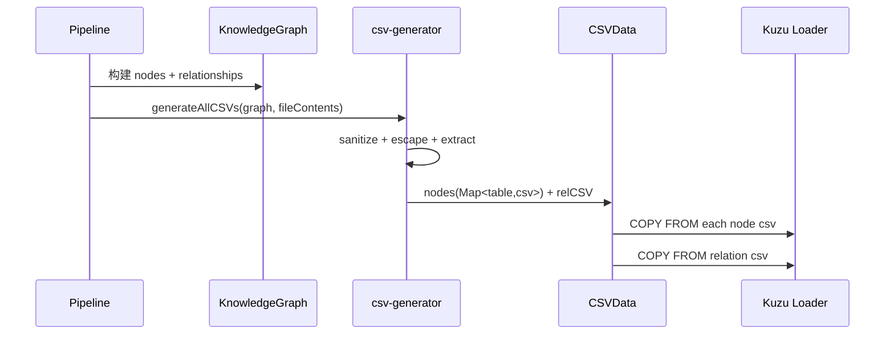

# kuzu_csv_generation 模块文档

## 1. 模块简介

`kuzu_csv_generation` 模块（文件：`gitnexus-web/src/core/kuzu/csv-generator.ts`）负责把内存中的 `KnowledgeGraph` 转换成可直接用于 KuzuDB 批量导入的 CSV 数据。它的目标不是“通用 CSV 序列化”，而是面向 GitNexus 图模型与 Kuzu 混合 Schema 的专用导出器：为每类节点生成独立 CSV，并生成一个统一关系表 CSV，从而匹配 `schema.ts` 中定义的节点表和 `CodeRelation` 关系表。

该模块存在的核心原因是：图分析与关系解析（例如调用解析、社区检测、流程检测）产出的数据结构在内存中是对象图，而 Kuzu 的高效装载路径是 `COPY FROM` 这类面向文本文件的批量导入。`csv-generator.ts` 处在这个“对象图 → 持久化交换格式”的关键边界层，承担了数据清洗、编码安全、字段对齐、截断控制和兼容性约束等职责。

从系统位置看，这个模块属于 `web_pipeline_and_storage` 子域，直接依赖图领域类型（`GraphNode`、`KnowledgeGraph`）和存储 schema 常量（`NodeTableName`），并为后续 WASM Kuzu 连接层提供输入。图类型细节可参考 [graph_domain_types](graph_domain_types.md)，流水线结果传输类型可参考 [pipeline_result_transport](pipeline_result_transport.md)。

---

## 2. 架构与职责分解



该流程的关键点是“先安全化、再结构化”。模块先确保文本在编码与控制字符层面不会破坏 CSV 解析，再根据节点标签路由到对应列结构，最后产出严格与 Kuzu schema 对齐的 CSV 文本。这样做可以减少导入阶段错误，并把错误定位前移到生成阶段。

### 2.1 与 Schema 的耦合关系



`generateAllCSVs` 返回 `Map<NodeTableName, string>`，意味着调用侧可以按表名定位 CSV 内容。这一设计与 `schema.ts` 强耦合：列顺序、列名、值类型必须一致，否则 `COPY FROM` 会在运行时失败。当前实现覆盖了 `File/Folder/Function/Class/Interface/Method/CodeElement/Community/Process`，而 `schema.ts` 中还定义了更多多语言节点表（如 `Struct`、`Trait`），这是一条需要维护者关注的演进边界（见“限制与扩展”章节）。

---

## 3. 核心数据结构

## 3.1 `CSVData`

```typescript
export interface CSVData {
  nodes: Map<NodeTableName, string>;
  relCSV: string;
}
```

`CSVData` 是模块对外的聚合返回类型。`nodes` 保存“节点表名 → CSV 文本”，`relCSV` 保存统一关系 CSV。它本质上是一个内存态交换格式，适合 Web 端把字符串进一步写入文件系统、传给 WASM 虚拟文件、或直接喂给导入适配器。

需要注意的是，它不是流式结构；如果图非常大，所有 CSV 文本会同时驻留内存。Node 侧若追求低峰值内存可优先参考服务端流式实现（见 [core_kuzu_storage](core_kuzu_storage.md)）。

---

## 4. 核心函数与内部机制

## 4.1 `generateAllCSVs(graph, fileContents): CSVData`

这是模块入口函数。它做三件事：

1. 把 `graph.nodes` 转为数组并按标签分发表生成节点 CSV。
2. 调用 `generateRelationCSV` 生成单一关系 CSV。
3. 返回 `CSVData`。

参数说明：
- `graph: KnowledgeGraph`：包含 `nodes` 与 `relationships` 的完整图。
- `fileContents: Map<string, string>`：`filePath -> 原始文件内容`，用于填充 `content` 字段或抽取代码片段。

返回值：
- `nodes`：包含 9 个已实现表（即便没有对应节点，也会返回只有表头的 CSV）。
- `relCSV`：`from,to,type,confidence,reason,step` 六列关系表。

副作用：
- 无 I/O，无全局状态修改；纯内存计算。

## 4.2 CSV 安全层

### 4.2.1 `sanitizeUTF8(str)`

此函数对输入字符串执行“CSV 解析安全 + Kuzu 兼容性”清洗：
- 统一行尾：`\r\n` 和 `\r` 都规整为 `\n`。
- 删除大部分控制字符（保留 `\t`、`\n`）。
- 删除孤立 surrogate 区字符与 `\uFFFE/\uFFFF`。

设计动机在于：Kuzu CSV 解析对某些换行与不可打印字符敏感，尤其混合平台换行（Windows/Unix）容易引发边界歧义。

### 4.2.2 `escapeCSVField(value)`

- `null/undefined` 被输出为 `""`（空字符串字段）。
- 其余值先 `sanitizeUTF8`，再把 `"` 变成 `""`，最终始终包裹双引号。

“始终加引号”不是 RFC 必需条件，但能显著降低代码文本（含逗号、括号、换行、注释）导致的导入不确定性。

### 4.2.3 `escapeCSVNumber(value, defaultValue = -1)`

数字字段不加引号；缺失值回退为默认值。该策略让 Kuzu 目标列（INT/DOUBLE）有可解析输入，避免空串触发类型转换失败。

## 4.3 内容抽取层

### 4.3.1 `isBinaryContent(content)`

函数采样前 1000 字符，统计不可打印字符比例，阈值 `> 10%` 即判为“疑似二进制”。这是一种启发式检测，不保证 100% 准确，但可有效避免把乱码/字节流写入 `content` 字段。

### 4.3.2 `extractContent(node, fileContents)`

它根据节点类型决定内容策略：

- `Folder`：永远空字符串。
- 疑似二进制：`[Binary file - content not stored]`。
- `File`：返回文件全文，超 10000 字符则截断并追加 `... [truncated]`。
- 代码元素（Function/Class/...）：按 `startLine/endLine` 抽取并附带前后各 2 行上下文；片段上限 5000 字符。

注意一个实现细节：`startLine` 直接作为 `Array.slice` 起点计算基准，若上游使用 1-based 行号，实际会有轻微偏移风险。维护者在调整解析器行号约定时应联动检查这里。

## 4.4 各表生成器

### 4.4.1 `generateFileCSV`

输出表头：`id,name,filePath,content`。仅处理 `label === 'File'`。`content` 来自 `extractContent`。

### 4.4.2 `generateFolderCSV`

输出表头：`id,name,filePath`。仅处理 `Folder`。

### 4.4.3 `generateCodeElementCSV`

统一用于 `Function/Class/Interface/Method/CodeElement`：
`id,name,filePath,startLine,endLine,isExported,content`。

`isExported` 序列化为字符串 `true/false`，数值行号缺失时回退 `-1`。

### 4.4.4 `generateCommunityCSV`

输出：`id,label,heuristicLabel,keywords,description,enrichedBy,cohesion,symbolCount`。

关键点是 `keywords`：被转成 Kuzu 数组字面量格式（如 `['auth','jwt']`），并处理单引号转义。这里没有再调用 `escapeCSVField`，因为目标是写入 Kuzu 的数组类型列而不是纯文本列。

### 4.4.5 `generateProcessCSV`

输出：`id,label,heuristicLabel,processType,stepCount,communities,entryPointId,terminalId`。

`communities` 同样先构造成数组字面量，再额外执行 `escapeCSVField`，因为该字符串内部含逗号，若不做 CSV 层转义会破坏列分隔。

### 4.4.6 `generateRelationCSV`

输出统一关系表：`from,to,type,confidence,reason,step`。

- `confidence` 默认 `1.0`。
- `step` 默认 `0`（主要用于 `STEP_IN_PROCESS`）。
- `reason` 常见值来自调用解析链路，如 `import-resolved/same-file/fuzzy-global`。

---

## 5. 端到端数据流



这个过程把图处理流水线和图数据库装载分离开：上游只关心语义正确性，下游只关心导入一致性。`csv-generator` 正是二者之间的“契约翻译层”。

---

## 6. 使用方式与示例

```typescript
import { generateAllCSVs } from './core/kuzu/csv-generator';

const csvData = generateAllCSVs(graph, fileContents);

// 节点表
for (const [table, csv] of csvData.nodes) {
  console.log(table, csv.split('\n').length - 1, 'rows');
}

// 关系表
console.log('relation rows:', csvData.relCSV.split('\n').length - 1);
```

一个典型调用前置条件是：
- `graph.nodes[].properties.filePath` 能在 `fileContents` 中找到对应内容；
- `startLine/endLine` 与上游解析器采用一致行号标准；
- 节点标签与 schema 表名兼容。

---

## 7. 边界条件、错误与限制

本模块本身几乎不抛显式异常，但以下情况会导致“静默降级”或数据质量变化：

- 文件内容缺失：`extractContent` 返回空字符串。
- 二进制误判：文本可能被标记为 binary placeholder（或反之）。
- 行号缺失：代码节点 `startLine/endLine` 写入 `-1` 且内容可能为空。
- 超长内容：文件和片段会被截断（10000 / 5000 字符）。
- 数组字段格式：`Community.keywords` 与 `Process.communities` 依赖 Kuzu 数组字面量语法，若上游注入异常字符，可能导入失败。
- 多语言表覆盖不完整：`schema.ts` 定义了更多节点表，但当前生成器只写入其中部分表，若图中出现如 `Struct` 节点，当前实现不会输出对应 CSV，需扩展生成器。

---

## 8. 扩展指南

当你要支持新的节点标签（例如 `Struct`）时，建议按以下路径演进：

1. 在 `generateAllCSVs` 中新增 `nodeCSVs.set('Struct', ...)`。
2. 复用或新增表生成器，并确保列顺序与 `schema.ts` 的目标表一致。
3. 补充内容抽取策略（是否需要 `isExported`、是否截断）。
4. 增加端到端导入测试，验证 `COPY FROM` 无类型错误。

如果你要改动 CSV 转义规则，必须把 Kuzu 导入兼容性测试一起更新，尤其是带换行、引号、逗号和 Unicode 边界字符的样本。

---

## 9. 维护建议

建议维护者重点关注三类契约漂移：

- **Schema 漂移**：`schema.ts` 列定义变化后，CSV 头和字段顺序必须同步。
- **图类型漂移**：`GraphNode.properties` 增减字段后，导出器需决定是否入库。
- **解析器漂移**：行号基准、文件路径规范变化会直接影响 `extractContent` 命中率与片段准确性。

从长期演进看，Web 端版本适合中小规模图数据和快速迭代；若目标是超大仓库，建议复用服务端流式导出能力（参考 [core_kuzu_storage](core_kuzu_storage.md)）以降低内存峰值。
