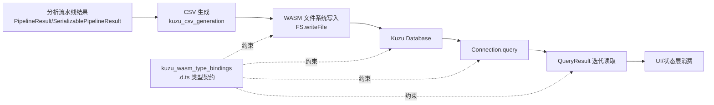
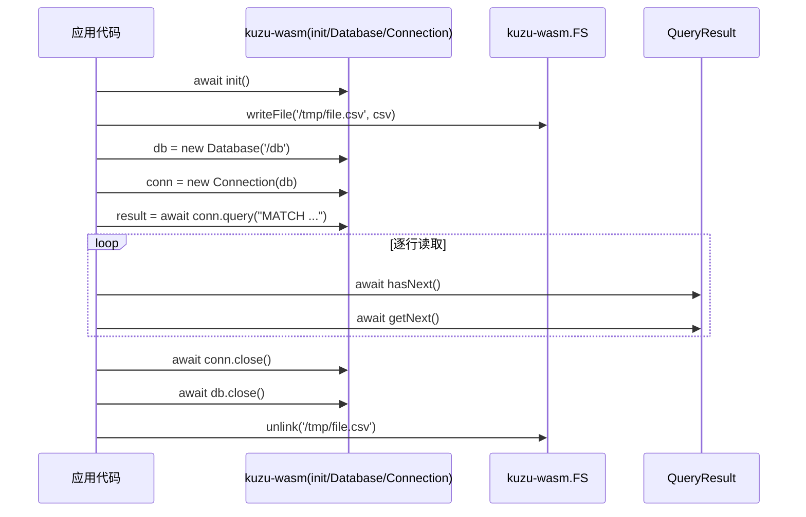

# kuzu_wasm_type_bindings 模块文档

## 1. 模块简介

`kuzu_wasm_type_bindings` 模块对应文件 `gitnexus-web/src/types/kuzu-wasm.d.ts`，它不是业务逻辑实现，而是一份 **TypeScript 声明文件（ambient module declaration）**。这份声明为外部依赖 `kuzu-wasm` 提供静态类型契约，让 Web 端代码在调用 Kuzu WASM 数据库能力时获得编译期提示、IDE 自动补全和基本类型约束。

从系统职责看，这个模块位于 `web_pipeline_and_storage` 子域，处在“图数据已经生成 CSV，准备导入 Kuzu WASM 并执行查询”的边界层。上游通常由 [kuzu_csv_generation.md](kuzu_csv_generation.md) 生成节点/关系 CSV，下游由实际的导入与查询代码使用 `Database` / `Connection` / `QueryResult` 执行存取。

之所以需要这个模块，是因为 `kuzu-wasm` 作为外部包，其 TypeScript 类型信息可能不完整或在当前项目中不可直接消费。通过项目内声明文件，工程可以在不修改第三方库源码的前提下，建立稳定、可控的调用接口。

---

## 2. 在整体架构中的位置



这张图强调一个关键事实：`kuzu_wasm_type_bindings` 不参与运行时计算，它通过“类型契约”约束调用路径，确保调用方以统一方式初始化引擎、管理连接生命周期、执行查询并逐行读取结果。

---

## 3. 模块导出与设计意图

声明文件内容（简化）如下：

```ts
declare module 'kuzu-wasm' {
  export function init(): Promise<void>;
  export class Database {
    constructor(path: string);
    close(): Promise<void>;
  }
  export class Connection {
    constructor(db: Database);
    query(cypher: string): Promise<QueryResult>;
    close(): Promise<void>;
  }
  export interface QueryResult {
    hasNext(): Promise<boolean>;
    getNext(): Promise<any>;
  }
  export const FS: {
    writeFile(path: string, data: string): Promise<void>;
    unlink(path: string): Promise<void>;
  };
  const kuzu: { init, Database, Connection, FS };
  export default kuzu;
}
```

可以看出它定义了三层能力：

1. **引擎生命周期**：`init()`。
2. **数据库与连接生命周期**：`Database`、`Connection`。
3. **查询结果读取与虚拟文件系统交互**：`QueryResult`、`FS`。

这种分层和 Kuzu WASM 的实际工作模式一致：先初始化运行时，再打开数据库与连接，然后通过查询与结果迭代执行数据访问；需要导入 CSV 时，则先将文本写入 WASM 虚拟文件系统。

---

## 4. 核心组件详解

## 4.1 `Database`

`Database` 表示一个 Kuzu 数据库实例句柄，构造函数签名是 `new Database(path: string)`。这里的 `path` 不是宿主机真实文件路径，而是 WASM 运行环境可见的数据库路径（通常是虚拟 FS 或其映射路径）。

### 方法

```ts
close(): Promise<void>
```

`close` 用于异步释放数据库资源。由于 WASM 引擎和底层内存管理涉及异步清理，设计为 `Promise<void>` 是合理的。调用方应显式 `await`，避免资源清理与后续流程竞争。

### 行为与约束

- 一个 `Database` 可被多个 `Connection` 复用（具体并发能力以运行时实现为准）。
- 在连接尚未关闭时直接关闭数据库，可能导致后续查询失败或抛错。
- 类型层没有表达“已关闭状态”，因此重复关闭、关闭后继续用都属于运行时错误范畴。

## 4.2 `Connection`

`Connection` 代表面向某个 `Database` 的查询会话，构造签名为 `new Connection(db: Database)`。

### 方法

```ts
query(cypher: string): Promise<QueryResult>
close(): Promise<void>
```

`query` 接收 Cypher 字符串并返回 `QueryResult`。`close` 负责释放连接资源。

### 行为与约束

- `query` 为异步调用，查询执行可能包括编译、计划、扫描等过程。
- 声明文件没有把错误类型结构化（例如语法错误、表不存在、事务错误），调用方需要用 `try/catch` 处理。
- 与 `Database` 类似，类型层不追踪连接状态；“关闭后查询”只能在运行时报错。

## 4.3 `QueryResult`

`QueryResult` 是查询结果游标接口，提供迭代式访问：

```ts
hasNext(): Promise<boolean>
getNext(): Promise<any>
```

典型模式是先 `hasNext()` 再 `getNext()` 循环读取每一行。该设计避免一次性拉取全部结果，适合大结果集逐步消费。

### 关键注意点

- `getNext()` 返回 `any`，意味着该模块不保证行结构类型安全。
- 如果调用方在 `hasNext() === false` 后仍执行 `getNext()`，行为取决于运行时实现（可能抛错或返回空值）。
- 结果对象中字段命名、数值类型（如 Int64 映射）应由上层做规范化转换。

---

## 5. 其他导出（非核心但关键）

## 5.1 `init()`

`init(): Promise<void>` 用于初始化 `kuzu-wasm` 运行时。通常应在首次构建 `Database` 之前完成。重复调用是否幂等由底层实现决定，类型层不表达该语义。

## 5.2 `FS`

`FS` 暴露最小文件能力：

```ts
writeFile(path: string, data: string): Promise<void>
unlink(path: string): Promise<void>
```

它常用于把 [kuzu_csv_generation.md](kuzu_csv_generation.md) 生成的 CSV 字符串写入 WASM 文件系统，再由数据库执行导入语句读取这些路径。`unlink` 用于导入后删除临时文件，降低内存/存储占用。

---

## 6. 组件关系与交互过程



这个时序对应最常见的“初始化 → 写入 CSV → 查询/导入 → 迭代读取 → 资源回收”流程。核心原则是：**所有生命周期方法都应被 `await` 并按顺序清理**。

---

## 7. 实际使用示例

```ts
import kuzu, { Database, Connection, FS } from 'kuzu-wasm';

export async function runSimpleQuery(cypher: string) {
  await kuzu.init();

  const db = new Database('/workspace/demo.kuzu');
  const conn = new Connection(db);

  try {
    const result = await conn.query(cypher);
    const rows: any[] = [];

    while (await result.hasNext()) {
      rows.push(await result.getNext());
    }

    return rows;
  } finally {
    await conn.close();
    await db.close();
  }
}

export async function writeCsvTemp(path: string, csv: string) {
  await FS.writeFile(path, csv);
}
```

如果要和流水线结果联动，典型链路是先从 [pipeline_result_transport.md](pipeline_result_transport.md) 恢复 `PipelineResult`，再由 [kuzu_csv_generation.md](kuzu_csv_generation.md) 生成 CSV，并通过 `FS.writeFile` 喂给 Kuzu。

---

## 8. 错误处理、边界条件与已知限制

本模块是类型声明，因此很多行为只能由调用方在运行时防御。最常见风险有以下几类：

- **初始化顺序错误**：未 `init` 就创建数据库或连接。
- **生命周期泄漏**：遗漏 `close`，导致 WASM 内存或句柄未回收。
- **结果类型不透明**：`getNext(): any` 使下游转换极易出现字段名拼写错误或类型断言错误。
- **路径语义混淆**：`FS` 路径是 WASM 虚拟路径，不等同浏览器真实文件系统。
- **重复/并发调用语义不明确**：声明未说明 `init` 幂等性、连接并发读写限制、线程隔离策略。

从类型系统角度看，当前声明较“薄”，属于可用但保守的绑定。它优先保证最小可编译接口，而非强约束业务正确性。

---

## 9. 扩展与维护建议

如果你要增强该模块，优先方向通常是“补强类型信息”而不是“添加业务逻辑”。可考虑：

1. 为 `QueryResult.getNext()` 定义泛型行类型，如 `getNext<T = Record<string, unknown>>(): Promise<T>`。
2. 为常见查询结果封装领域类型（例如节点行、关系行 DTO）。
3. 补充更完整的 `FS` API（若运行时支持），如读取、目录操作。
4. 在项目侧提供一个薄适配层，统一封装 `init` 幂等、资源回收和错误归类，再由业务调用该适配层。

这样可以把“第三方运行时不透明”带来的不确定性收敛到单点，减少全项目散落的重复防御代码。

---

## 10. 与其他文档的关系

- 图与流水线结果结构：见 [pipeline_result_transport.md](pipeline_result_transport.md)
- CSV 生成细节与 Kuzu 导入前数据准备：见 [kuzu_csv_generation.md](kuzu_csv_generation.md)
- 更广义的 Web 端管线/存储模块上下文：见 `web_pipeline_and_storage` 对应总览文档（若已生成）

本文聚焦 `kuzu-wasm` 类型绑定契约，不重复图解析、CSV 编码策略或 UI 状态管理细节。
