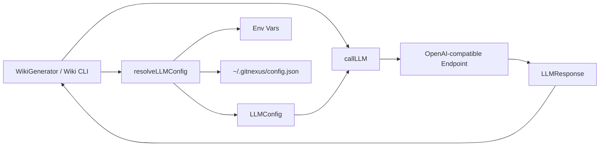
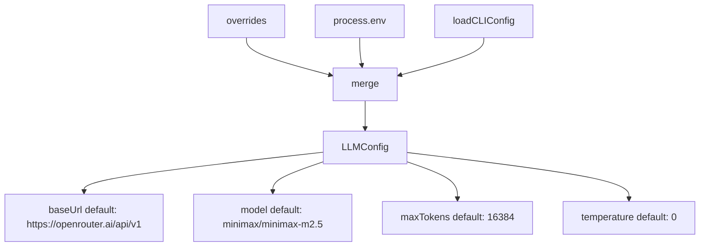
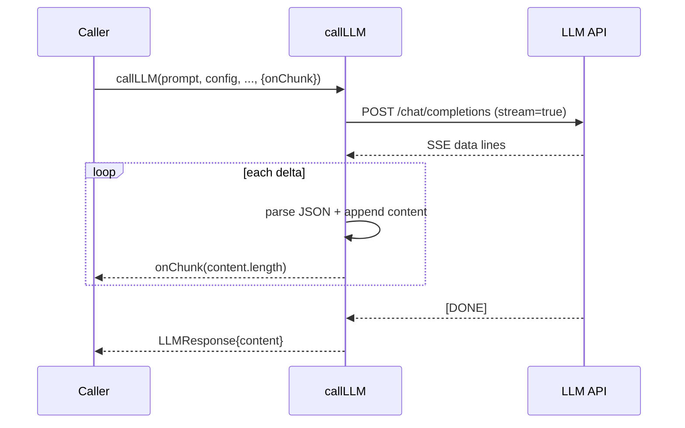

# llm_client_and_config 模块文档

## 1. 模块定位与设计动机

`llm_client_and_config`（源码文件：`gitnexus/src/core/wiki/llm-client.ts`）是 Wiki 生成功能里最基础、最关键的一层“模型调用适配器”。它的职责不是写 Prompt，也不是决定生成流程，而是把上层编排器（例如 `WikiGenerator`）需要的能力标准化为三件事：**配置解析**、**请求发送**、**响应读取（含流式）**。

这个模块存在的核心原因，是 GitNexus 需要在不同部署环境下稳定调用“OpenAI-compatible”接口。实际使用中，调用目标可能是 OpenAI、OpenRouter、Azure OpenAI 网关、LiteLLM、Ollama，甚至企业内网代理。若把这些差异散落在各业务模块，维护成本会迅速上升。`llm-client.ts` 用一个统一配置结构 `LLMConfig` 和统一调用函数 `callLLM()` 吸收这些差异，让上层专注于“生成什么”，而不是“怎么连模型”。

从系统分层看，这个模块位于 `core_wiki_generator` 子域内，主要被 [wiki_generation_orchestrator.md](wiki_generation_orchestrator.md) 消费；同时它会读取全局 CLI 配置（`~/.gitnexus/config.json`），因此与 [storage_repo_manager.md](storage_repo_manager.md) 存在直接依赖关系。

---

## 2. 在整体系统中的位置



上图体现了一个重要设计：配置解析与调用过程是解耦的。`resolveLLMConfig()` 先把多来源配置折叠成单一 `LLMConfig`，随后 `callLLM()` 只关注网络请求和结果解析，不再关心“配置来自哪里”。这种分层能让调用逻辑更可测，也便于未来把配置来源扩展到远程密钥管理系统。

---

## 3. 核心数据结构

## 3.1 `LLMConfig`

`LLMConfig` 描述一次 LLM 调用所需的最小且完整的连接参数：

```ts
export interface LLMConfig {
  apiKey: string;
  baseUrl: string;
  model: string;
  maxTokens: number;
  temperature: number;
}
```

`apiKey` 用于 `Authorization: Bearer ...` 鉴权；`baseUrl` 会在调用时自动拼接 `/chat/completions`；`model` 直接透传到 OpenAI-compatible body；`maxTokens` 与 `temperature` 影响输出长度和采样行为。需要注意，本模块没有 provider-specific 字段（例如 Azure deployment name），这意味着它依赖“兼容层”已经把这些差异映射到统一接口。

## 3.2 `LLMResponse`

`LLMResponse` 是上层可消费的标准响应：

```ts
export interface LLMResponse {
  content: string;
  promptTokens?: number;
  completionTokens?: number;
}
```

`content` 是必填文本，`promptTokens` 与 `completionTokens` 仅在非流式路径且服务端返回 `usage` 时可用。流式路径当前只返回 `content`，不会在本地补算 token 用量。

## 3.3 `CallLLMOptions`

`CallLLMOptions` 用于开启流式回调：

```ts
export interface CallLLMOptions {
  onChunk?: (charsReceived: number) => void;
}
```

只要传入 `onChunk`，`callLLM()` 就会把请求切换为 `stream=true`，并在每次增量文本到达时回调当前累计字符数。这个设计非常适合 CLI 进度条或 UI 实时状态更新。

---

## 4. 配置解析机制：`resolveLLMConfig()`

`resolveLLMConfig(overrides?: Partial<LLMConfig>)` 负责把三层输入源按优先级合并为最终配置。优先级规则是：**CLI 覆盖（overrides） > 环境变量 > `~/.gitnexus/config.json` > 内置默认值/空值**。



实现细节上，`apiKey` 的查找顺序是：`overrides.apiKey` → `GITNEXUS_API_KEY` → `OPENAI_API_KEY` → `savedConfig.apiKey` → `''`。这里有一个刻意设计：若没有任何 key，不抛异常，而是返回 `apiKey: ''`。这样做把“是否允许无 key 继续运行”的决策交给上层；例如本地 Ollama 某些网关可能不强制鉴权，而云 API 则会在真正调用时返回 401。

同时，`resolveLLMConfig()` 通过动态导入 `loadCLIConfig`（`../../storage/repo-manager.js`）读取全局配置，避免模块加载阶段就产生 I/O 副作用。关于全局配置的持久化细节，请参考 [storage_repo_manager.md](storage_repo_manager.md)。

---

## 5. 调用主链路：`callLLM()`

`callLLM(prompt, config, systemPrompt?, options?)` 是模块的核心执行函数。它负责消息拼装、HTTP 调用、重试控制、流式解析与错误传播。

## 5.1 请求构建

函数会先构造 OpenAI Chat 风格 `messages`。当 `systemPrompt` 存在时先写入 `system` 消息，再附加 `user` prompt。请求 URL 的处理方式是先去除 `baseUrl` 尾部多余 `/`，再拼接固定路径 `/chat/completions`，避免出现 `//chat/completions` 的兼容性问题。

请求体默认包含：

- `model`
- `messages`
- `max_tokens`
- `temperature`

如果传入 `onChunk`，会额外设置 `stream: true`，并进入流式读取分支。

## 5.2 重试策略

该函数内置 `MAX_RETRIES = 3`，重试针对“短暂性失败”而设计，不对所有错误盲目重放。策略如下：

1. `429`（限流）：优先读取 `retry-after` 头；若无则按指数退避 `(2 ** attempt) * 3000ms`。
2. `5xx`（服务端错误）：线性退避 `(attempt + 1) * 2000ms`。
3. 网络错误（`ECONNREFUSED` / `ETIMEDOUT` / 报错信息含 `fetch`）：退避 `(attempt + 1) * 3000ms`。

其他错误（例如 400 参数错误、401 鉴权失败、403 权限失败）不会重试，会直接抛出异常，让上层尽早感知不可恢复问题。

## 5.3 非流式响应处理

当未启用流式时，函数读取 `response.json()`，期望结构为 `choices[0].message.content`。若内容为空会抛出 `LLM returned empty response`。如果服务端返回 `usage.prompt_tokens` 与 `usage.completion_tokens`，会一并写入 `LLMResponse`。

## 5.4 流式响应处理

当启用流式且 `response.body` 可读时，函数委托 `readSSEStream()` 解析 SSE 增量消息。解析成功后返回 `{ content }`。当前实现不会从流中提取 usage，因此 token 字段留空。



---

## 6. SSE 解析细节：`readSSEStream()`

`readSSEStream(body, onChunk)` 使用 `ReadableStreamDefaultReader` + `TextDecoder` 逐块读取字节流，并维护一个字符串 `buffer` 来处理“跨 chunk 的半行数据”。它按换行分割后，仅处理前缀为 `data: ` 的行；遇到 `[DONE]` 会跳过，不会计入正文。

每个 `data:` payload 会尝试 `JSON.parse`，从 `choices[0].delta.content` 提取增量文本。若某块 JSON 非法，函数会静默跳过该 chunk，而不是中断整个流。这是典型的容错策略，避免单次脏片段导致整次生成失败。

流结束后若 `content` 仍为空，会抛出 `LLM returned empty streaming response`。这对上层是一个明确信号：请求虽然成功建立，但没有任何可用文本产出。

---

## 7. 辅助函数：`estimateTokens()` 与 `sleep()`

`estimateTokens(text)` 使用 `Math.ceil(text.length / 4)` 做粗略 token 估算。这个近似值适合进度估计、日志观察和“预警级”配额控制，不适合作为精确计费依据。不同模型、不同语言（尤其中文/代码混合）会显著偏离该比例。

`sleep(ms)` 是 Promise 化延时工具，只用于退避重试，不暴露给外部 API。

---

## 8. 关键行为、边界条件与已知限制

本模块实现较小，但运行中最常见的问题集中在以下边界。

第一，`resolveLLMConfig()` 不保证 `apiKey` 非空。这让模块更通用，但也意味着调用前若业务必须鉴权，需要上层主动校验并给出友好报错。

第二，流式与非流式返回结构不完全对称。非流式可能包含 token usage，而流式默认没有，这会影响统一成本统计。若你要做精确计费，建议在网关层记录 usage，或扩展解析逻辑读取 provider 的流式 usage 事件。

第三，错误识别依赖 `err.code` 与 `err.message.includes('fetch')`，这在不同运行时（Node 版本、polyfill、边缘环境）可能不一致。某些网络异常可能无法被归类为可重试，从而提前失败。

第四，SSE 解析假设每条事件是单行 `data: ...` JSON。若供应商输出多行 `data:` 拼接 JSON 或额外事件类型字段，当前实现可能丢失部分信息，需要按供应商协议扩展解析器。

第五，请求体字段使用 `max_tokens`。多数 OpenAI-compatible 服务支持，但个别供应商使用 `max_completion_tokens` 或其他字段名；这类兼容性应在网关层或本模块增加 provider adapter 解决。

---

## 9. 使用方式与实践示例

## 9.1 基础调用（非流式）

```ts
import { resolveLLMConfig, callLLM } from '@/core/wiki/llm-client';

const config = await resolveLLMConfig({
  model: 'gpt-4o-mini',
  maxTokens: 4096,
  temperature: 0.2,
});

const res = await callLLM(
  'Summarize this module in 5 lines',
  config,
  'You are a concise technical writer.'
);

console.log(res.content);
console.log(res.promptTokens, res.completionTokens);
```

## 9.2 流式调用（实时进度）

```ts
import { callLLM } from '@/core/wiki/llm-client';

const res = await callLLM(prompt, config, systemPrompt, {
  onChunk(chars) {
    process.stdout.write(`\rreceived: ${chars} chars`);
  },
});

console.log('\n---\n', res.content);
```

## 9.3 与 Wiki 编排器协作

在 Wiki 生成场景中，通常由编排器提前解析配置，再在各阶段复用同一个 `LLMConfig`，避免重复读取配置与环境变量。具体流程可参考 [wiki_generation_orchestrator.md](wiki_generation_orchestrator.md)。

---

## 10. 可扩展点与演进建议

如果你准备扩展该模块，建议优先保持“接口稳定、内部可替换”的原则。`LLMConfig` 与 `LLMResponse` 已经是上层依赖的契约，新增能力尽量通过可选字段或 `CallLLMOptions` 扩展，而非破坏原有调用签名。

工程上最常见的增强方向有三个：其一，引入 provider-aware 适配层，处理 Azure/OpenAI/Ollama 在字段与鉴权上的细小差异；其二，增强 observability，例如返回重试次数、首包延迟、总耗时；其三，补齐流式 usage 统计，让成本监控在流式与非流式路径保持一致。

如果你在系统中已经有更通用的 LLM 抽象（例如前端侧的 [llm_provider_and_message_types.md](llm_provider_and_message_types.md)），可以把本模块视为“Wiki 子系统里的轻量后端实现”，并通过统一 provider schema 逐步收敛。
