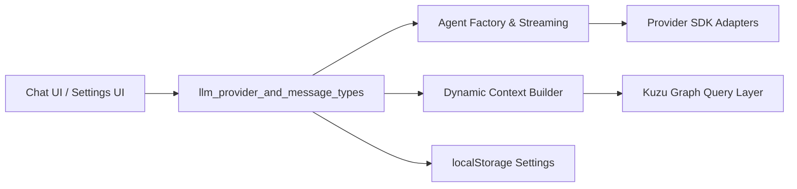
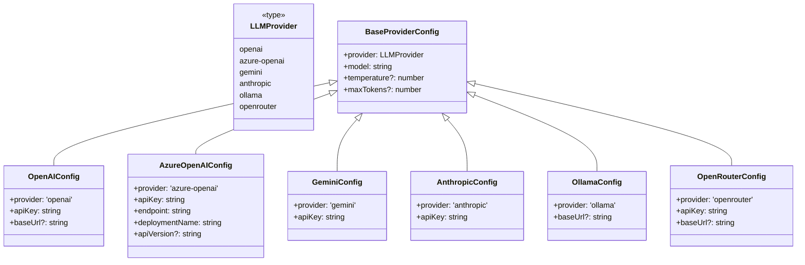
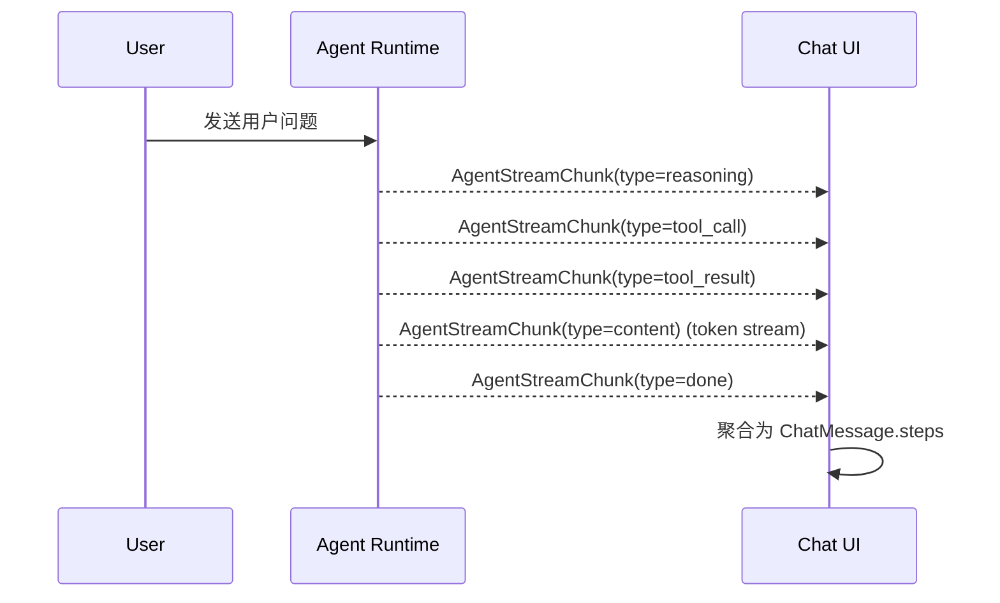
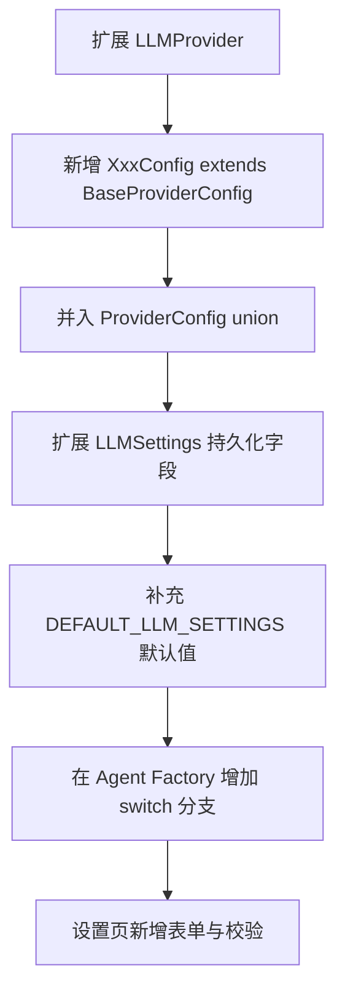
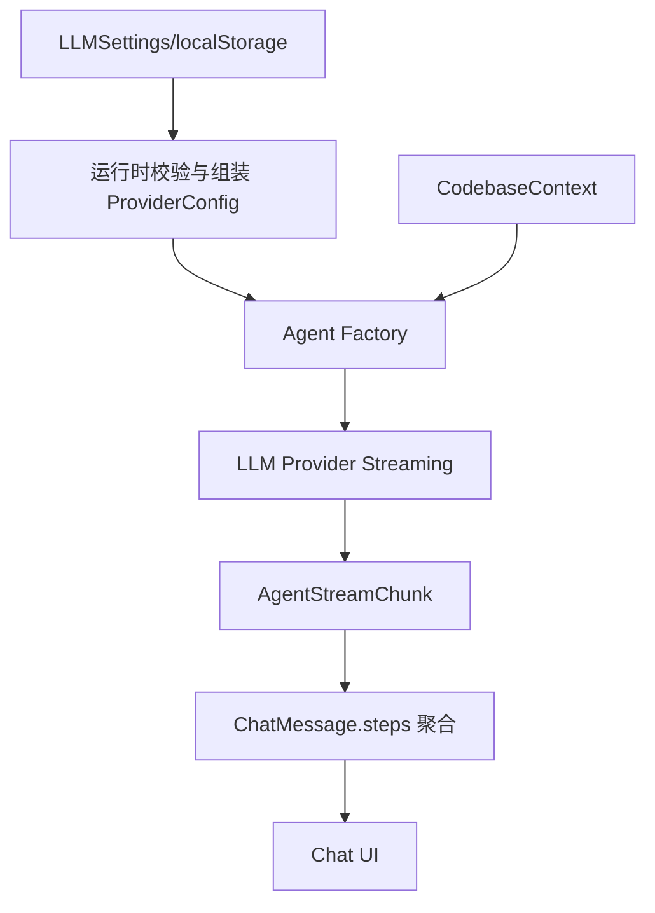

# llm_provider_and_message_types

## 模块简介

`llm_provider_and_message_types` 模块定义了 Web 端 LLM Agent 的**核心类型系统**，位于 `gitnexus-web/src/core/llm/types.ts`。它的职责不是执行推理或发起网络请求，而是提供一层统一、可扩展、强约束的数据契约，用来连接以下几类能力：多供应商模型配置、会话消息结构、工具调用状态、流式输出分片，以及与图数据库查询相关的上下文描述。

从设计上看，这个模块解决了两个长期会在 AI 应用中反复出现的问题。第一，模型供应商异构：OpenAI、Azure OpenAI、Gemini、Anthropic、Ollama、OpenRouter 在配置字段、鉴权参数、端点语义上并不一致。第二，Agent 交互过程异构：用户想看到的不仅是“最终回答”，还包括 reasoning、tool call、tool result 等中间步骤。该模块通过 discriminated union（以 `provider` 或 `type` 作为判别字段）将这些差异收敛为可被 UI、状态管理、流处理统一消费的类型。

在 `web_llm_agent` 子系统中，它是最底层的“语言层协议”：上层 agent 工厂与流式执行逻辑（见 [agent_factory_and_streaming.md](agent_factory_and_streaming.md)）会读取这里定义的 `ProviderConfig` / `AgentStreamChunk`；上下文构造器（见 [dynamic_context_builder.md](dynamic_context_builder.md)）最终产出的信息也会被封装进 `ChatMessage` 交互序列。换句话说，本模块不负责“做事”，但负责“约定所有人如何说话”。

---

## 在系统中的定位



该图反映了模块的边界：它同时服务“配置输入侧”（设置页、localStorage）和“执行输出侧”（agent streaming 到 UI）。`types.ts` 并不持有 provider client，也不做消息持久化；它仅定义结构，使得各层可以在编译期共享同一语义模型。

---

## 核心架构：类型族与职责分层



上图展示了 provider 配置体系：`BaseProviderConfig` 统一了通用推理参数，而各供应商配置扩展自己的必需字段。`ProviderConfig`（联合类型）将这些配置收束为单一入口，使运行时工厂可根据 `provider` 进行分派。

另一个并行类型族是消息与流式事件：`ChatMessage`、`MessageStep`、`ToolCallInfo`、`AgentStreamChunk`、`AgentStep`。这组类型共同定义了“前端如何理解一个 agent 会话”的最小语义单位。

---

## 组件详解

## `LLMProvider`

`LLMProvider` 是 provider 维度的字符串字面量联合：
`'openai' | 'azure-openai' | 'gemini' | 'anthropic' | 'ollama' | 'openrouter'`。

它看似简单，但实际上是整个模块的判别核心：

- 在配置层，它驱动 `ProviderConfig` 的 narrowing。
- 在设置层，它用于 `LLMSettings.activeProvider` 标记当前激活供应商。
- 在扩展层，新增 provider 时必须先扩展该联合，否则上游分支逻辑无法建立完整覆盖。

---

## `BaseProviderConfig`

`BaseProviderConfig` 定义跨供应商共享字段：

- `provider: LLMProvider`
- `model: string`
- `temperature?: number`
- `maxTokens?: number`

它的意义在于把“最常见调参接口”固定下来，让 UI 配置面板可以构建一套可复用控件（模型名、温度、最大 token）并按需叠加供应商特有字段。

需要注意：这些字段是“类型级可选/必需”，不等价于“运行时已校验”。特别是 `temperature` 与 `maxTokens` 没有内建范围约束，使用方应在提交请求前做 provider-specific 校验。

---

## Provider 特化配置

### `OpenAIConfig`

在通用字段基础上要求：

- `provider: 'openai'`
- `apiKey: string`
- `baseUrl?: string`

`baseUrl` 允许接入代理或兼容端点；这对于企业内网网关、OpenAI-compatible API 非常常见。若未设置，由上层 client 决定默认地址。

### `AzureOpenAIConfig`

额外字段包含：

- `endpoint: string`
- `deploymentName: string`
- `apiVersion?: string`（注释写明默认 `'2024-08-01-preview'`）

Azure 配置体现了“模型名与 deployment 分离”的平台特性。代码中仍保留 `model` 字段，通常用于 UI 展示或统一配置接口，但真正请求常依赖 deployment。实现层应避免错误地只用 `model` 直连 Azure。

### `GeminiConfig`

要求 `apiKey`，`model` 示例包含 `gemini-2.0-flash`、`gemini-1.5-pro`。结构简单，适合作为默认 provider（`DEFAULT_LLM_SETTINGS` 也是这样设置）。

### `AnthropicConfig`

要求 `apiKey` 与 `model`，注释中示例为 `claude-sonnet-*` / `claude-3-5-sonnet-*`。同样继承通用推理参数。

### `OllamaConfig`

本地模型场景配置，重点是 `baseUrl?: string`，注释默认 `http://localhost:11434`。这使系统可在离线或内网场景运行。

### `OpenRouterConfig`

聚合路由平台配置，要求 `apiKey`，可选 `baseUrl`（默认 `https://openrouter.ai/api/v1`），`model` 支持跨厂商路由命名如 `anthropic/claude-3.5-sonnet`。

---

## `ProviderConfig`（联合配置入口）

`ProviderConfig = OpenAIConfig | AzureOpenAIConfig | GeminiConfig | AnthropicConfig | OllamaConfig | OpenRouterConfig`

这是上层创建 provider client 的理想输入类型。典型模式是 switch 分发：

```ts
function createClient(config: ProviderConfig) {
  switch (config.provider) {
    case 'openai':
      return createOpenAIClient(config);
    case 'azure-openai':
      return createAzureClient(config);
    case 'gemini':
      return createGeminiClient(config);
    case 'anthropic':
      return createAnthropicClient(config);
    case 'ollama':
      return createOllamaClient(config);
    case 'openrouter':
      return createOpenRouterClient(config);
    default:
      // 利用 TypeScript never 检查覆盖完整性
      const _exhaustive: never = config;
      return _exhaustive;
  }
}
```

该模式可以在新增 provider 时第一时间触发编译错误，避免运行时遗漏分支。

---

## `LLMSettings`：持久化设置模型

`LLMSettings` 是“localStorage 持久化层”专用结构，和 `ProviderConfig` 的区别非常关键：

- `ProviderConfig` 假定字段已齐备，可直接用于请求。
- `LLMSettings` 允许“部分填写”（`Partial<Omit<...>>`），适合用户逐步输入配置。

核心字段：

- `activeProvider: LLMProvider`
- `openai? / azureOpenAI? / gemini? / anthropic? / ollama? / openrouter?`：每个 provider 对应部分配置
- 智能聚类开关：
  - `intelligentClustering: boolean`
  - `hasSeenClusteringPrompt: boolean`
  - `useSameModelForClustering: boolean`
  - `clusteringProvider?: Partial<ProviderConfig>`

此设计将“主对话模型”与“聚类增强模型”解耦，允许在成本与效果之间做细粒度平衡。

### `DEFAULT_LLM_SETTINGS`

默认值体现了产品策略：

- 激活模型为 `gemini`
- 聚类能力默认关闭
- 各 provider 提供一组可用初始模板（通常空 key + 推荐模型 + `temperature: 0.1`）
- Azure 默认 `apiVersion: '2024-08-01-preview'`
- Ollama 默认 `baseUrl: 'http://localhost:11434'`
- OpenRouter 默认 `baseUrl: 'https://openrouter.ai/api/v1'`

这使设置页首次加载时即可渲染完整表单，而不需要判空创建对象。

---

## 消息与步骤模型



该流程说明：UI 不再只接收“完整答案字符串”，而是接收分步流事件并构建可审计的步骤序列。

### `MessageStep`

`MessageStep` 用于 `ChatMessage.steps` 中的有序子项，类型为：

- `reasoning`
- `tool_call`
- `content`

字段包含 `id`、`content?`、`toolCall?`。通过这一层可实现 reasoning 与 tool call 在时间线中“交错显示”，解决旧 `toolCalls[]` 模型难以表达顺序的问题。

### `ChatMessage`

`ChatMessage` 是会话主记录，字段：

- `id`
- `role: 'user' | 'assistant' | 'tool'`
- `content`
- `toolCalls?`（已标记 deprecated）
- `steps?`（推荐）
- `toolCallId?`
- `timestamp`

这里保留 `toolCalls?` 是一种向后兼容策略，允许旧渲染逻辑继续工作；新逻辑应优先读取 `steps`。

### `ToolCallInfo`

定义工具调用可视化信息：

- `id`
- `name`
- `args: Record<string, unknown>`
- `result?: string`
- `status: 'pending' | 'running' | 'completed' | 'error'`

`status` 对 UI 进度反馈尤其关键，可映射为 loading、success、error 样式。

### `AgentStreamChunk`

流式事件类型：

- `type: 'reasoning' | 'tool_call' | 'tool_result' | 'content' | 'error' | 'done'`
- `reasoning?`
- `content?`
- `toolCall?`
- `error?`

该结构支持 token 级增量输出与工具事件同通道传输。实现时应遵循“以 `type` 判别字段为主”的解析方式，避免误用可选字段。

### `AgentStep`

`AgentStep` 与 `MessageStep` 语义相近，但类型值为 `'reasoning' | 'tool_call' | 'answer'` 且带 `timestamp`。通常用于运行时步骤追踪或调试时间线，和 `ChatMessage.steps` 并存时需做好映射规则。

---

## `GRAPH_SCHEMA_DESCRIPTION`：面向 LLM 的图谱查询提示

`GRAPH_SCHEMA_DESCRIPTION` 是一个长字符串常量，描述 Kuzu 图数据库的节点表、关系表与查询模式。其用途是给 LLM/Agent 提供明确 schema 先验，降低生成错误 Cypher 的概率。

该文本包含：

1. 节点表：`File`、`Folder`、`Function`、`Class`、`Interface`、`Method`、`CodeElement`、`CodeEmbedding`
2. 关系表：`CodeRelation` + `type`（`CONTAINS` / `DEFINES` / `IMPORTS` / `CALLS`）
3. 典型查询模板（函数查找、调用者查找、导入关系、向量检索 join 等）
4. 工具占位约定：`{{QUERY_VECTOR}}` 由工具替换为 `CAST([..] AS FLOAT[384])`

这类 schema prompt 是 agent 正确使用检索工具的关键基础设施，建议与后端真实 schema 严格同步，否则会产生“提示正确但执行失败”的隐性错误。

---

## 典型使用模式

## 1) 从 `LLMSettings` 构造可执行 `ProviderConfig`

```ts
import {
  LLMSettings,
  ProviderConfig,
} from './types';

function resolveProviderConfig(settings: LLMSettings): ProviderConfig {
  switch (settings.activeProvider) {
    case 'gemini': {
      const cfg = settings.gemini;
      if (!cfg?.apiKey || !cfg?.model) throw new Error('Gemini 配置不完整');
      return { provider: 'gemini', apiKey: cfg.apiKey, model: cfg.model, temperature: cfg.temperature, maxTokens: cfg.maxTokens };
    }
    // 其他 provider 同理...
    default:
      throw new Error('Unsupported provider');
  }
}
```

关键点在于：`LLMSettings` 是 Partial，必须运行时补全与校验后再喂给 agent。

## 2) 流式分片聚合到 `ChatMessage.steps`

```ts
function onChunk(msg: ChatMessage, chunk: AgentStreamChunk): ChatMessage {
  const steps = msg.steps ?? [];

  if (chunk.type === 'reasoning' && chunk.reasoning) {
    steps.push({ id: crypto.randomUUID(), type: 'reasoning', content: chunk.reasoning });
  }

  if (chunk.type === 'tool_call' && chunk.toolCall) {
    steps.push({ id: crypto.randomUUID(), type: 'tool_call', toolCall: chunk.toolCall });
  }

  if (chunk.type === 'content' && chunk.content) {
    steps.push({ id: crypto.randomUUID(), type: 'content', content: chunk.content });
  }

  return { ...msg, steps };
}
```

实际工程中通常会对 `content` 做同 step 合并，以减少步骤碎片。

---

## 配置与扩展指南

## 新增一个 provider 的最小改动路径



这一流程强调“类型与运行时双闭环”：只改类型不改工厂会导致运行期不可用；只改工厂不改设置模型会导致 UI/持久化断层。

## 与其他模块的协作建议

- 与 provider client 创建、重试、流读取实现相关内容，应放在 [agent_factory_and_streaming.md](agent_factory_and_streaming.md) 对应模块，不应回流到 `types.ts`。
- 与上下文裁剪、热点文件选择、仓库统计相关逻辑，应查看 [dynamic_context_builder.md](dynamic_context_builder.md)。
- 与图查询实体结构、关系定义的更广泛背景，可参考 [graph_domain_types.md](graph_domain_types.md) 与 [core_graph_types.md](core_graph_types.md)。

---

## 与相邻模块的接口契约（重点）

虽然本模块本身只定义类型，但在实际运行时，它与 `agent_factory_and_streaming`、`dynamic_context_builder` 形成强契约关系。`agent_factory_and_streaming` 中的 `AgentMessage` 只保留最简 `role + content` 结构，而本模块的 `ChatMessage` 增加了 `id`、`timestamp`、`steps`、`toolCallId` 等前端交互字段。这意味着运行时通常会经过“传输消息 → UI 消息”的结构提升过程：先用 `AgentMessage` 驱动模型调用，再映射为 `ChatMessage` 用于可视化与会话持久化。

`dynamic_context_builder` 产出的 `CodebaseContext`（`stats`、`hotspots`、`folderTree`）并不直接写在 `types.ts` 中，但会作为系统提示或工具参数进入同一轮 LLM 请求。因此，从系统设计角度看，`ProviderConfig` 决定“用谁来推理”，`CodebaseContext` 决定“拿什么上下文推理”，`ChatMessage/AgentStreamChunk` 决定“怎样把推理过程传回 UI”。三者组合后才构成完整的 agent 回路。



这个交互关系的关键点是：本模块只定义协议，不承担“组装”“调用”“重试”“上下文裁剪”等行为逻辑。维护时应避免把业务逻辑塞进 `types.ts`，否则会破坏其作为跨层共享契约的稳定性。

---


## 边界条件、错误场景与已知限制

该模块虽然是类型层，但仍存在若干容易踩坑的行为约束。

第一，`LLMSettings` 的 provider 配置是 `Partial`，这意味着任意字段都可能缺失。任何直接将其断言为 `ProviderConfig` 的代码都可能在运行时失败，例如缺少 `apiKey`、Azure 缺少 `deploymentName`。

第二，`ChatMessage` 同时存在 `toolCalls`（deprecated）和 `steps`。如果 UI 同时渲染两者，可能导致重复显示工具调用。迁移策略应明确“单一真相来源”。

第三，`AgentStreamChunk` 的字段是宽松可选的。理论上可能出现 `type='tool_call'` 但 `toolCall` 为空。消费方应将其视为协议错误并记录日志，而不是静默忽略。

第四，`AgentStep` 与 `MessageStep` 的 type 枚举不完全一致（`answer` vs `content`），在互转时需要显式映射，否则会出现样式或统计错误。

第五，`GRAPH_SCHEMA_DESCRIPTION` 是手写静态文本，与真实数据库 schema 可能漂移。建议在 schema 版本升级时联动更新，并在集成测试中加入“LLM 生成查询可执行性”检查。

第六，默认 `temperature: 0.1` 是产品策略而非通用最佳实践。对需要高创造性输出的场景应允许覆盖。

---

## 维护建议

建议把 `types.ts` 视为公共协议文件，变更时遵守以下原则：保持判别字段稳定、优先增量兼容、为 deprecated 字段提供迁移窗口、在 PR 中同步更新依赖模块文档与示例。对于 `LLMSettings` 的演进，优先保证旧 localStorage 数据可被安全读取，并在运行时做结构修复（例如缺省字段回填 `DEFAULT_LLM_SETTINGS`）。

如果你正在修改该模块，最应优先验证的不是“能否编译”，而是“老会话能否继续展示、流式步骤是否有序、provider 切换后配置是否完整”。这三个方面决定了最终用户感知的稳定性。
