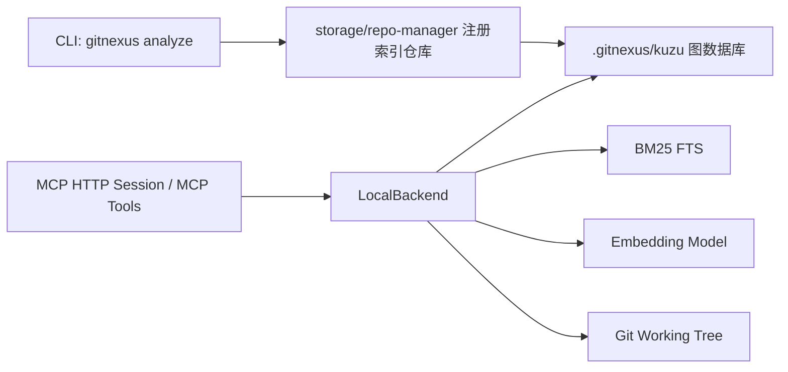
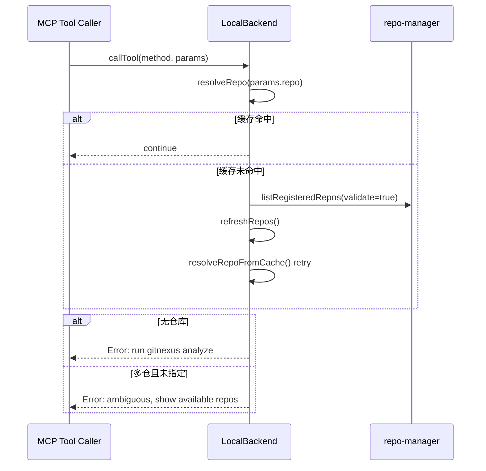
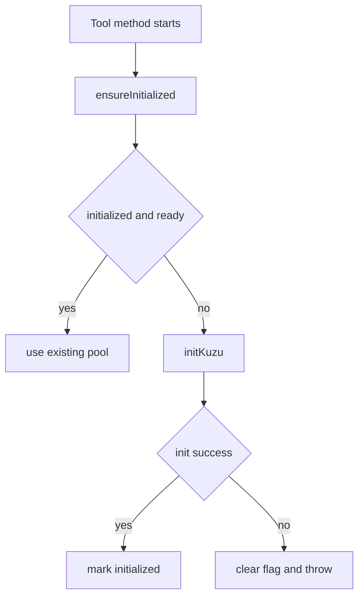
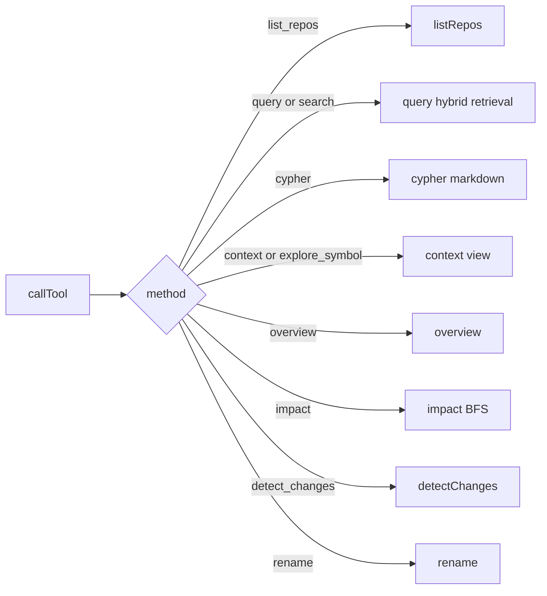
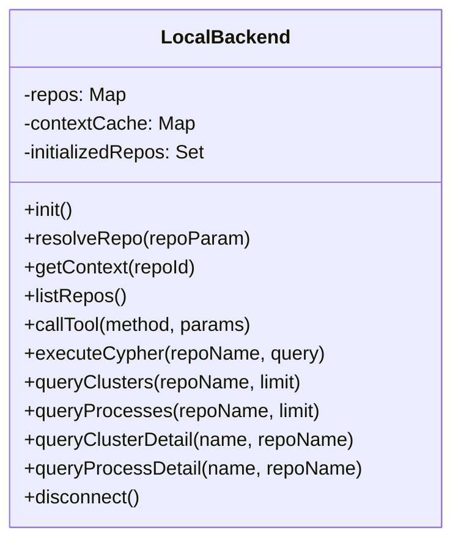
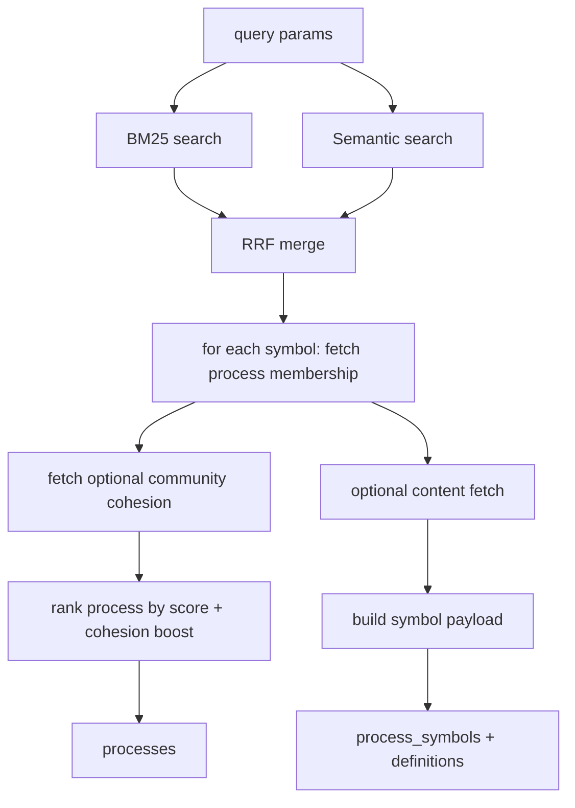
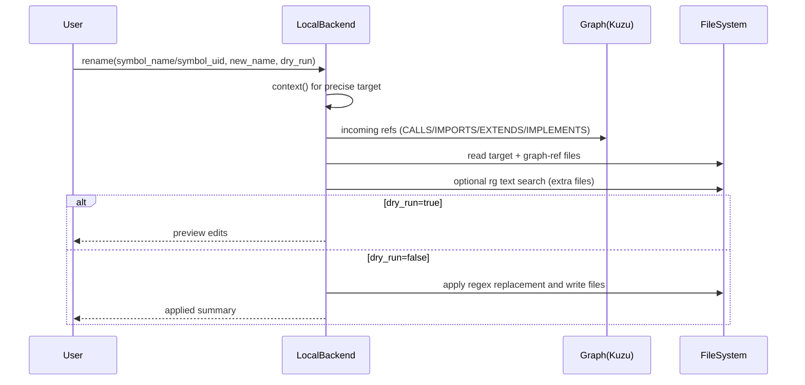

# local_backend 模块文档

## 概述与设计动机

`local_backend`（源码：`gitnexus/src/mcp/local/local-backend.ts`）是 MCP 本地服务层的核心执行后端。它的目标是把“已经完成索引的本地代码仓库”统一暴露为一组可调用工具（tool），供 MCP server、LLM Agent 或 CLI 桥接层按需查询。该模块存在的根本原因是：GitNexus 的分析结果并不是临时内存结构，而是落在每个仓库对应的 `.gitnexus` 存储目录（尤其是 Kuzu 图数据库）；因此运行期需要一个稳定的、多仓库、惰性初始化的访问中间层，来屏蔽仓库发现、连接生命周期、查询编排和兼容性处理等复杂性。

从设计上看，这个模块并不重新“分析代码”，而是消费索引产物。换句话说，`local_backend` 位于“索引完成之后”的查询平面（query plane），重点是把图谱查询、混合检索、影响面评估、重命名建议等能力整合成 MCP 工具接口。它与 ingestion/pipeline 体系是前后游关系：ingestion 负责写图，`local_backend` 负责读图和操作编排。

## 模块在系统中的位置



上图展示了运行路径：`gitnexus analyze` 先把仓库索引并登记到全局 registry；MCP 工具调用进入 `LocalBackend` 后，按仓库解析并惰性连接 Kuzu，再按工具类型调用图查询、全文检索、向量检索或 Git diff。对于 `rename` 工具，还会直接改写工作区文件（取决于 `dry_run`）。

可参考的上游/旁路文档（避免重复）：
- 仓库登记与索引元数据：[`storage_repo_manager.md`](storage_repo_manager.md)
- Kuzu 连接池和执行适配：[`mcp_server.md`](mcp_server.md)（`kuzu_connection_pool` 子模块）
- BM25/Hybrid 检索类型定义：[`core_embeddings_and_search.md`](core_embeddings_and_search.md)
- 社区/流程节点语义：[`core_ingestion_community_and_process.md`](core_ingestion_community_and_process.md)

---

## 核心数据结构

### `CodebaseContext`

`CodebaseContext` 是面向“快速上下文预览”的轻量结构，不依赖 Kuzu 实时查询，直接从 registry 缓存生成。其字段：

- `projectName`: 项目名
- `stats.fileCount`: 文件数量
- `stats.functionCount`: 函数/节点数量（当前映射为 `stats.nodes`）
- `stats.communityCount`: 社区数量
- `stats.processCount`: 流程数量

它用于在多仓场景下快速展示仓库体量，不承担精确图查询语义。

### `RepoHandle`

`RepoHandle` 是模块内部使用的仓库运行句柄，包含：

- 仓库唯一标识 `id`（基于 name + path 冲突处理）
- 展示名 `name`
- 源仓路径 `repoPath`
- 存储目录 `storagePath`
- Kuzu 数据路径 `kuzuPath`
- 索引时间与 commit 信息
- 可选统计 `stats`

这个结构是工具执行时的主上下文对象，几乎所有方法都以 `RepoHandle` 作为目标仓库输入。

### `LocalBackend`

`LocalBackend` 是模块唯一公开的主类。内部三类状态缓存：

- `repos: Map<string, RepoHandle>`：仓库目录缓存
- `contextCache: Map<string, CodebaseContext>`：轻量上下文缓存
- `initializedRepos: Set<string>`：本进程中“曾初始化过”的 repo id 集合

注意 `initializedRepos` 不是绝对真值源，代码会与 `isKuzuReady(repoId)` 联合判断，防止连接池空闲回收后状态失真。

---

## 架构与关键流程

### 1) 多仓库发现与解析流程



`resolveRepo` 的策略是“缓存优先 + 一次刷新重试 + 明确错误提示”。匹配顺序覆盖 id、大小写无关 name、绝对路径、部分名称，增强了交互友好性，但也意味着“partial name”可能在命名接近时产生非预期命中，调用方在生产场景应尽量传 `repo` 全名或 id。

### 2) Kuzu 惰性初始化与连接健壮性



这里的关键点是：即使 `initializedRepos` 记录了 repo，也必须二次检查 `isKuzuReady`，因为连接池可能已 idle-timeout 回收。该设计降低了“假阳性已初始化”导致查询失败的概率。

### 3) 工具分发总览



`search`、`explore`、`overview` 等属于兼容旧接口的别名/遗留入口，当前推荐使用新工具名。

---

## 关键方法详解

## 初始化与仓库管理

### `init(): Promise<boolean>`

触发一次 `refreshRepos`，若至少有一个可用仓库则返回 `true`。副作用是刷新内部缓存。

### `refreshRepos(): Promise<void>`（私有）

从 `listRegisteredRepos({ validate: true })` 读取 registry，更新 `repos/contextCache`，并清理已删除仓库的缓存状态。值得注意的是，注释明确指出：被移除仓库对应的 Kuzu 连接不会立即主动关闭，而依赖连接池空闲超时机制自然回收。

### `repoId(name, repoPath): string`（私有）

默认使用 `name.toLowerCase()`；若检测到同名不同路径冲突，拼接 `repoPath` 的短 base64url hash。这样可以在多仓同名场景下维持稳定区分。

### `resolveRepo(repoParam?): Promise<RepoHandle>`

仓库路由核心。失败路径会给出可操作错误：
- 无仓库：提示先运行 `gitnexus analyze`
- 指定仓不存在：列出可选仓库
- 多仓未指定：提示传 `repo` 参数

---

## 查询类工具

### `query(repo, params)`

这是“流程感知”的主检索入口，处理链路是：
1. `bm25Search` 与 `semanticSearch` 并行执行；
2. 用 Reciprocal Rank Fusion（RRF）融合排序；
3. 将命中 symbol 追溯到 `Process`（`STEP_IN_PROCESS`）；
4. 叠加 `Community.cohesion` 作为微弱加权（`+ cohesion * 0.1`）；
5. 输出 `processes`、`process_symbols`、`definitions`。

参数要点：
- `query` 必填且非空
- `limit` 控制流程返回数（默认 5）
- `max_symbols` 控制每流程最多回传 symbol（默认 10）
- `include_content` 可选回传节点内容（额外查询开销）

行为细节：没有 `nodeId` 的文件级命中会进入 `definitions`；`process_symbols` 会按 `id` 去重。

### `bm25Search(repo, query, limit)`（私有）

调用 `searchFTSFromKuzu`，若 FTS 索引缺失会降级为空结果并打印错误日志。随后按命中文件反查最多 3 个节点，形成 symbol 结果；若反查失败则保留文件级结果。

### `semanticSearch(repo, query, limit)`（私有）

先检查 `CodeEmbedding` 是否存在数据，避免无 embedding 时初始化模型。然后：
- `embedQuery(query)` 生成向量；
- 使用 `QUERY_VECTOR_INDEX` 检索；
- `distance < 0.6` 过滤；
- 根据 `nodeId` 前缀解析 label 并校验 `VALID_NODE_LABELS`，防止 Cypher label 注入；
- 回查节点元数据。

异常默认静默降级为空数组，因此总链路可退化为 BM25-only。

### `cypher(repo, {query})` 与 `formatCypherAsMarkdown`

`cypher` 执行原生查询，错误转换为 `{ error }`。`callTool('cypher')` 会额外把表格型结果格式化为 markdown，提升 LLM 可读性。若结果并非对象数组则保持原样。

---

## 上下文、总览与探索

### `context(repo, params)`

提供单符号 360° 视图：
- 支持 `uid` 直查与 `name` 查找；
- 同名多结果返回 `status: ambiguous` 候选列表；
- 返回 `incoming/outgoing`（按 `calls/imports/extends/implements` 分类）；
- 返回流程参与信息（流程名、step index、总步数）；
- 可选附带 `content`。

这是 `rename` 等功能的基础入口，因此其 disambiguation 结果会被下游复用。

### `overview(repo, params)`

返回仓库元信息 + 可选 `clusters/processes` 摘要。社区先拉取大样本后做 `aggregateClusters`：按 `heuristicLabel` 合并、符号数加总、按符号量加权平均 cohesion，并过滤 `<5` 小簇。

### `explore(repo, params)`（遗留）

兼容老资源层：
- `symbol` 转发到 `context`
- `cluster` 和 `process` 走直接查询

新增实现应优先使用显式方法或 `queryCluster* / queryProcess*` API。

---

## 变更分析与改名工具

### `detectChanges(repo, params)`

通过 Git diff (`unstaged/staged/all/compare`) 找改动文件，再映射到图节点并追踪受影响流程，输出风险等级。风险由受影响流程数分段得出（`low/medium/high/critical`）。

约束与注意：
- `compare` 必须提供 `base_ref`
- 仓库必须是有效 git 工作区
- 当前按 `filePath CONTAINS` 做文件映射，精度受路径唯一性影响
- 返回的 `changed_count` 是命中的 symbol 数，不等于文件变更行数

### `rename(repo, params)`

多文件协同改名流程：
1. 通过 `context` 找目标符号；
2. 从定义点 + incoming 图引用生成高置信编辑（`confidence: graph`）；
3. 用 `rg` 全库补充文本匹配编辑（`confidence: text_search`）；
4. `dry_run=true` 仅预览，`false` 实际改写文件。

关键行为：应用阶段按“全文件 regex 替换 oldName”写回，这比预览粒度更粗，调用方应始终先 dry-run 审核。若系统未安装 `rg`，会自动跳过文本补充步骤。

---

## 影响面分析 `impact(repo, params)`

`impact` 使用分层 BFS（按深度批量查询）沿指定关系向上游或下游扩散，支持：
- `direction`: `upstream`/`downstream`
- `maxDepth`: 最大深度（默认 3）
- `relationTypes`: 默认 `CALLS/IMPORTS/EXTENDS/IMPLEMENTS`
- `includeTests`: 默认过滤测试文件
- `minConfidence`: 关系置信度阈值

同时做增强分析：
- `affected_processes`: 命中流程、最早断点 step
- `affected_modules`: 命中社区，区分 direct/indirect
- 风险分级：`LOW/MEDIUM/HIGH/CRITICAL`

测试文件过滤使用 `isTestFilePath`（多语言模式匹配），在大仓库中可显著降低噪声。

---

## 资源层直连查询 API

`queryClusters`、`queryProcesses`、`queryClusterDetail`、`queryProcessDetail` 是为 `resources.ts` 提供的直接图查询接口，避免依赖 legacy `overview/explore` 分发路径。语义上分别对应列表与详情读取。

---

## 典型使用示例

```typescript
const backend = new LocalBackend();
await backend.init();

// 1) 列仓库
const repos = await backend.callTool('list_repos', {});

// 2) 流程感知检索
const q = await backend.callTool('query', {
  repo: 'my-repo',
  query: 'user authentication flow',
  limit: 5,
  include_content: false,
});

// 3) 符号上下文
const ctx = await backend.callTool('context', {
  repo: 'my-repo',
  name: 'AuthService',
});

// 4) Dry-run 改名
const preview = await backend.callTool('rename', {
  repo: 'my-repo',
  symbol_name: 'AuthService',
  new_name: 'AuthenticationService',
  dry_run: true,
});

await backend.disconnect();
```

### Cypher 工具返回格式示例

```json
{
  "markdown": "| id | name |\n| --- | --- |\n| Function:abc | login |",
  "row_count": 1
}
```

---

## 错误处理、边界条件与限制

该模块大量采用“局部失败、整体降级继续”的策略。比如语义检索异常会回退到 BM25，cluster/process 查询异常返回空数组而非抛错。这样提升了服务可用性，但也会隐藏部分数据质量问题；线上可结合日志与监控定位。

主要注意事项如下：

- 多仓库环境必须显式传 `repo`，否则可能触发歧义报错。
- 语义检索依赖 embedding 表和向量索引，不可用时不会显式失败。
- `context` 名称查询可能歧义，调用方应处理 `status: ambiguous`。
- `rename` 的实际应用是基于全文件 regex 替换，可能误伤同名非目标语义标识符。
- `detectChanges` 与 `rename` 依赖本地 Git/rg 命令与文件系统权限。
- 对用户输入做了基础转义和 label 白名单，但 `cypher` 工具本身允许执行任意查询，调用面应受信任或做上层权限约束。

---

## 扩展建议

如果你计划扩展 `LocalBackend`，建议遵循当前模式：先在 `callTool` 增加路由，再实现独立私有方法，内部统一走 `resolveRepo + ensureInitialized`。同时优先采用“可降级”的错误策略，让新能力在依赖缺失时不拖垮整个服务。

对于复杂新能力（例如跨仓查询、事务式批量改写），建议先在独立模块实现，再由 `LocalBackend` 作为编排层接入，保持该类职责集中在“仓库解析 + 工具分发 + 查询编排”。


## API 参考（按核心组件）

### `CodebaseContext`（接口）

`CodebaseContext` 是一个明确偏“展示层”的结构。它不追求图数据库实时一致性，而追求低开销、随取随用的仓库概览，因此其内容由 registry 统计直接映射而来。对于调用方而言，这意味着它非常适合作为会话初始化时的“仓库提示卡片”，但不应被当作执行级事实来源（例如不要用 `functionCount` 直接推导某个查询是否应该命中）。

```ts
export interface CodebaseContext {
  projectName: string;
  stats: {
    fileCount: number;
    functionCount: number;
    communityCount: number;
    processCount: number;
  };
}
```

### `RepoHandle`（内部接口）

`RepoHandle` 把“仓库逻辑标识”和“索引落盘位置”绑定在一起，是所有私有工具实现的标准输入。`id` 是 MCP 运行时真正使用的连接池 key；`repoPath` 用于 Git 与文件读写；`kuzuPath` 用于图查询。该设计把“检索/分析”与“文件系统操作”统一收敛到同一个句柄，避免工具内部到处重复做路径拼装。

```ts
interface RepoHandle {
  id: string;
  name: string;
  repoPath: string;
  storagePath: string;
  kuzuPath: string;
  indexedAt: string;
  lastCommit: string;
  stats?: RegistryEntry['stats'];
}
```

### `LocalBackend`（主类）

`LocalBackend` 的公开 API 很少，但每个 API 都对应一条稳定的操作语义。其核心思想是“把复杂性关在类内部”：上层只需要 method + params，类内部负责仓库解析、连接可用性、降级与格式化。



上图反映一个关键事实：对外公开的是少量入口，对内分解为多组私有编排方法（`query/context/impact/detectChanges/rename/...`）。这让 MCP 资源层可以直接调用专门 API，也让工具层通过 `callTool` 走统一分发。

---

## `callTool` 方法契约与返回语义

`callTool(method, params)` 是 MCP 工具调用入口。除 `list_repos` 外，其余方法都先做仓库解析。该入口并不强约束返回结构统一（有的返回 `{error}`，有的返回业务对象，有的返回 `{status: ambiguous}`），因此调用方应按“方法级协议”解析返回值。

常见方法映射如下：

- `list_repos` → `listRepos()`
- `query` / `search`（别名）→ 混合检索 + 流程聚合
- `cypher` → 原始图查询（再包装 markdown）
- `context` / `explore`（别名）→ 符号上下文
- `overview` → 仓库摘要
- `impact` → 影响面 BFS
- `detect_changes` → Git 改动影响
- `rename` → 协同改名（默认 dry-run）

如果 method 不在白名单中，会抛出 `Unknown tool` 异常，而不是返回 `{error}`。这点在服务端包装时需要区分“业务失败”和“接口失败”。

---

## 数据流详解：`query`（混合检索）



该流程最值得关注的实现点是 RRF 融合与“流程优先输出”。它并不是简单返回 Top-K 符号，而是把符号映射到 `Process` 后按流程排序，以支持“任务理解”而非“孤立匹配”。这与单纯搜索引擎的结果组织方式明显不同，也解释了为什么返回结构含 `processes` 和 `process_symbols` 两层。

另外，语义检索会在 embeddings 不可用时静默降级。这是为了保证在资源受限环境中依然可工作，但也意味着你可能在不知情的情况下仅使用 BM25；若需要可观测性，应在上层记录“semanticResults 是否为空且 embeddings 表存在”的指标。

---

## 数据流详解：`context`（符号 360° 视图）

`context` 的主要价值在于“消歧 + 关系分类”。当名称冲突时，它不会猜测最佳结果，而是返回候选，要求调用方明确 `uid` 或 `file_path`。这种设计牺牲了便捷性，换来引用分析与改名操作的准确性。

关系输出按 `r.type` 归档为 `incoming/outgoing` 多个类别，这比单一列表更容易在 UI 或 Agent 提示词中解释“谁调用了我”“我依赖了谁”“继承关系在哪里”。在进行自动修复、API 变更评估等任务时，该分类结构通常比原始边列表更实用。

---

## 数据流详解：`impact`（多跳影响扩散）

`impact` 采用按深度批处理 frontier 的 BFS 策略，每一层只发一条批量 Cypher，避免逐节点查询造成 N+1 问题。随后它基于命中节点再做流程/模块富化，并给出风险等级。这使它同时具备“图算法结果”和“管理视角摘要”两种输出。

风险评分是启发式规则而非统计模型：它对直接影响节点数、流程数、模块数和总影响数做阈值分段。优点是可解释、易调参；缺点是无法自适应不同仓库规模。超大仓库中你可能需要在上层二次归一化。

---

## 数据流详解：`rename`（图引导 + 文本补充）



该方法是“工程实用型”而非“AST 重写型”。它用图关系给高置信候选，再用 ripgrep 做召回补全，最终仍采用文本替换落盘。因此它非常适合“先预览再人工审阅”的半自动流程，不适合直接作为零审查批量重构器。

---

## 配置与运行前置条件

从代码可见，`local_backend` 并没有集中式 config 对象，实际配置来自运行环境与索引状态。要稳定使用，需要满足以下前置条件：

1. 目标仓库已经被 `gitnexus analyze` 索引并注册到全局 registry。
2. 对应仓库的 `.gitnexus/kuzu` 数据可读，且 Kuzu 版本兼容。
3. 若希望启用语义检索，必须已有 `CodeEmbedding` 数据和向量索引。
4. 若使用 `detect_changes` 或 `rename` 增强搜索，系统需可执行 `git`，可选安装 `rg`。
5. 若执行 `rename(dry_run=false)`，进程对工作区文件必须有写权限。

---

## 与其他模块的边界

`local_backend` 只消费索引，不负责构建索引；只负责编排，不负责 HTTP 会话管理。为避免职责混淆，建议按以下边界理解：

- 索引生产、符号解析、关系抽取：参考 [`core_ingestion_parsing.md`](core_ingestion_parsing.md)、[`core_ingestion_resolution.md`](core_ingestion_resolution.md)、[`core_ingestion_community_and_process.md`](core_ingestion_community_and_process.md)。
- Kuzu CSV 生成与落库：参考 [`core_kuzu_storage.md`](core_kuzu_storage.md)。
- MCP 资源、工具定义与会话：参考 [`mcp_server.md`](mcp_server.md)、[`resource_system.md`](resource_system.md)、[`tool_definitions.md`](tool_definitions.md)。

这种分层让 `LocalBackend` 可以保持“查询与操作编排器”角色，而不侵入 ingestion 与 transport 层。

---

## 可扩展性建议（面向维护者）

扩展新工具时，建议采用与现有实现一致的骨架：先在 `callTool` 增加 method 分支，再在私有方法中实现业务逻辑，并在方法开头统一执行 `ensureInitialized`。如果新能力可能依赖可选组件（例如外部模型、系统命令），优先设计“可降级返回”，避免单点失败导致整个 MCP 会话不可用。

若要引入高风险操作（批量写文件、跨仓事务），建议把“计划生成”和“实际执行”拆成两个 method，并默认仅预览。当前 `rename` 已经体现这一原则（`dry_run` 默认 true），这是一个值得复用的安全模式。
