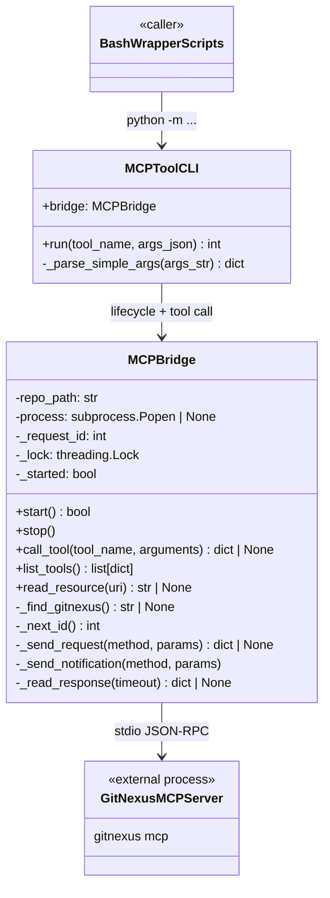
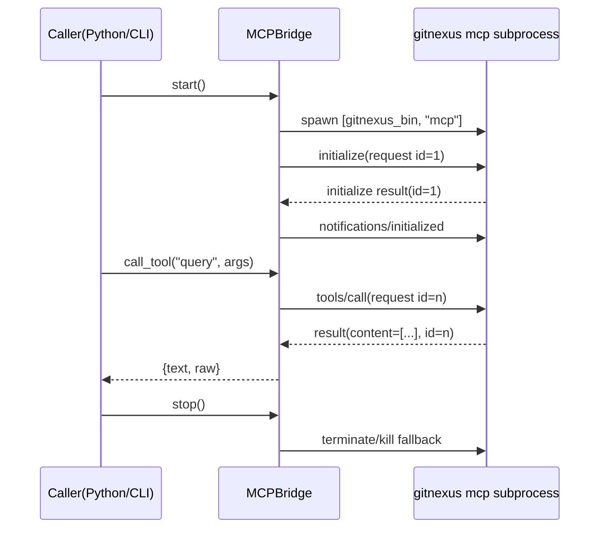
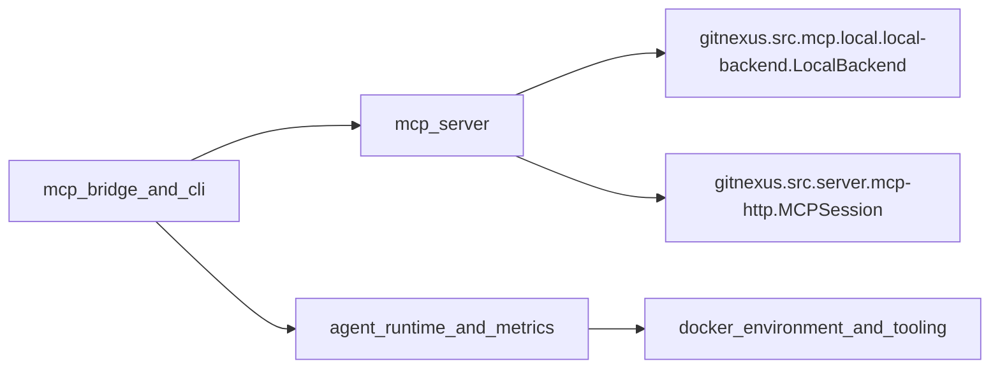
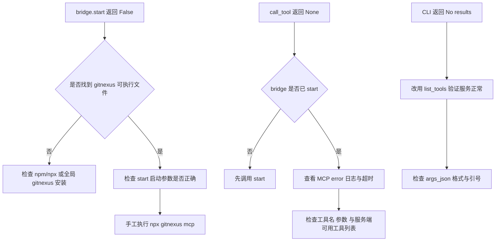

# mcp_bridge_and_cli 模块文档

## 1. 模块定位与设计动机

`mcp_bridge_and_cli` 对应实现文件 `eval/bridge/mcp_bridge.py`，核心目标是把 GitNexus 的 MCP 能力（Model Context Protocol）封装成评测框架可以稳定调用的 Python 接口与命令行接口。它位于 `eval_framework` 的桥接层，解决的是“Python 评测运行时如何与 Node.js 侧的 `gitnexus mcp` 进程通信”这一工程问题。

从架构职责看，这个模块并不负责代码分析、索引构建或工具语义本身；这些能力来自 GitNexus 主程序与 MCP server。该模块的价值在于提供一层轻量、可复用、可脚本化的传输代理：它启动 MCP 子进程、按 JSON-RPC + `Content-Length` 帧格式发送请求、读取响应并做最小结果抽取。换句话说，它把“跨进程协议细节”下沉到桥接层，让上层评测逻辑只需要关心 `call_tool("query", {...})` 这类业务调用。

在 `eval_framework` 里，这个模块通常与 Agent 运行时和 Docker 环境模块配合使用。若你先阅读了 [agent_runtime_and_metrics.md](agent_runtime_and_metrics.md)，可以把本模块理解成其潜在工具通道之一：Agent 侧决定“何时调用什么工具”，而桥接层决定“如何把调用准确送达 MCP server 并拿回结果”。

---

## 2. 总体架构

### 2.1 组件关系图



这张图体现了模块的双接口设计：`MCPBridge` 负责协议与进程管理，`MCPToolCLI` 负责把桥接能力暴露成“一次性命令执行”风格的 CLI。前者适合 Python 内部复用，后者适合 Shell 脚本、容器启动脚本或临时调试。

### 2.2 请求-响应时序图



值得注意的是，本模块显式执行 MCP 初始化握手（`initialize` + `notifications/initialized`），并且只在握手成功后才设置 `_started=True`。这使得上层不会在 server 未准备好时误发业务请求。

---

## 3. 核心类型与方法详解

## 3.1 `MCPBridge`

`MCPBridge` 是整个模块的核心状态机，内部维护子进程句柄、请求 ID 自增器和线程锁。其设计哲学是“最小可靠代理”：实现必要的 MCP JSON-RPC framing 与调用封装，但避免把上层语义耦合进来。

### 3.1.1 `__init__(repo_path: str | None = None)`

构造时会设置：

- `repo_path`：默认当前工作目录 `os.getcwd()`，用于子进程工作目录与 `npx` 探测上下文。
- `process`：初始为 `None`。
- `_request_id`：从 0 开始。
- `_lock`：保护请求 ID 生成。
- `_started`：桥接状态标记。

其中 `repo_path` 的选择非常关键：当 `_find_gitnexus()` 优先尝试 `npx gitnexus --version` 时，`cwd=self.repo_path` 会影响它是否能解析到本地 `node_modules` 安装。

### 3.1.2 `start() -> bool`

`start` 负责启动并初始化 MCP 子进程，流程如下：

1. 若 `_started` 已为真，直接返回 `True`（幂等启动）。
2. 调用 `_find_gitnexus()` 寻找可执行入口。
3. 使用 `subprocess.Popen` 启动 `[gitnexus_bin, "mcp"]`，并将 `stdin/stdout/stderr` 全部设为 PIPE，`text=False`（二进制模式）。
4. 发送 `initialize` 请求，参数包含协议版本 `2024-11-05`、空能力集与客户端信息。
5. 如果初始化失败，记录错误并 `stop()` 清理后返回 `False`。
6. 发送 `notifications/initialized` 通知。
7. 设置 `_started=True`，返回 `True`。

副作用主要是创建外部进程与占用 pipe 资源；失败路径会尽量回收。调用者应把 `False` 当作“当前运行环境无法使用 MCP”，并做降级或失败处理。

### 3.1.3 `stop()`

`stop` 尝试优雅关闭子进程：先关闭 stdin，再 `terminate()`，等待最多 5 秒；异常时退化到 `kill()`。无论成功与否，最终都会清空 `self.process` 并将 `_started=False`。

这个方法不会抛异常，属于“best-effort cleanup”。对评测任务而言，这种策略可以避免 teardown 阶段的清理问题掩盖主任务结果。

### 3.1.4 `call_tool(tool_name, arguments=None) -> dict | None`

这是业务侧最常用接口。行为分三层：

- 入口校验：未启动直接报错并返回 `None`。
- 协议调用：通过 `_send_request("tools/call", {"name": ..., "arguments": ...})` 执行。
- 结果归一化：从 MCP `result.content` 中抽取 `type == "text"` 的片段，拼成 `text`，同时保留原始 `raw`。

返回结构示例：

```python
{
  "text": "...合并后的纯文本...",
  "raw": [...原始 content 数组...]
}
```

如果协议层报错或无响应，返回 `None`。这意味着调用方必须把返回值当作可空对象处理，不能假设总有文本。

### 3.1.5 `list_tools() -> list[dict]`

封装 `tools/list` 请求，成功时返回 `result.tools`，失败或空响应时返回空列表。该方法适合做健康检查或动态能力发现。

### 3.1.6 `read_resource(uri: str) -> str | None`

封装 `resources/read`，并只提取第一项 `contents[0].text`。这是一种简化假设：若资源返回多段内容，当前实现不会拼接全部内容。调用者若需多段信息，应改造该方法或直接使用 `_send_request` 原始结果。

### 3.1.7 `_find_gitnexus() -> str | None`

该方法实现“本地优先、全局兜底”的可执行发现逻辑：

1. 先尝试 `npx gitnexus --version`（`cwd=repo_path`，超时 15s）。成功则返回 `"npx"`。
2. 再尝试 `gitnexus --version`（全局 PATH，超时 10s）。成功则返回 `"gitnexus"`。
3. 都失败则返回 `None`。

一个需要关注的实现细节是：`start()` 始终使用 `[gitnexus_bin, "mcp"]` 启动。若 `_find_gitnexus` 返回 `"npx"`，实际执行命令会是 `npx mcp`，而不是注释中期望的 `npx gitnexus mcp`。这会导致在某些环境下启动失败，是当前代码的高风险行为差异（见后文“限制与坑点”）。

### 3.1.8 `_next_id() -> int`

在锁内执行 `self._request_id += 1` 并返回。它只保证 ID 生成的线程安全，不保证“完整请求-响应循环”的并发安全（见第 6 节）。

### 3.1.9 `_send_request(method, params) -> dict | None`

这是 JSON-RPC 请求发送的核心：

1. 组装请求对象 `{"jsonrpc":"2.0","id":...,"method":...,"params":...}`。
2. `json.dumps` 后计算 UTF-8 字节长度，写入 `Content-Length: <len>\r\n\r\n` 头。
3. 发送消息体并 flush。
4. 调用 `_read_response(timeout=30)` 获取响应。
5. 校验响应 `id` 与请求 `id` 一致。
6. 若响应含 `error` 字段，记录错误并返回 `None`；否则返回 `result`。

副作用包括同步阻塞等待，默认超时 30 秒。它是串行、单 outstanding request 模型，适合简单工具调用，但不支持高并发管线式 RPC。

### 3.1.10 `_send_notification(method, params)`

与 `_send_request` 类似，但不带 `id` 且不等待响应。主要用于初始化后发送 `notifications/initialized`。

### 3.1.11 `_read_response(timeout=30) -> dict | None`

该方法按 MCP framing 逐字节读取响应：

- 循环读取 header，直到 `\r\n\r\n`（兼容 `\n\n`）。
- 解析 `Content-Length`。
- 按长度读取 body，并 `json.loads`。
- 忽略 notification（无 `id`），只返回带 `id` 的消息。

这是一个“过滤式接收器”：如果 server 在请求期间穿插发送通知，方法会跳过通知继续等响应。该行为对于 MCP 实战很重要，因为许多服务端会主动发日志事件或状态事件。

---

## 3.2 `MCPToolCLI`

`MCPToolCLI` 是一次性命令执行包装器，主要服务于 Bash 脚本和容器中的工具链调用。它把“启动 bridge -> 调工具 -> 打印结果 -> 停止 bridge”固定成标准流程，避免脚本重复实现生命周期控制。

### 3.2.1 `__init__()`

创建 `self.bridge = MCPBridge()`，默认 repo 路径为当前目录。若脚本运行目录不是目标仓库，可能影响 `npx` 本地解析行为。

### 3.2.2 `run(tool_name: str, args_json: str = "{}") -> int`

流程如下：

1. 尝试 `json.loads(args_json)`。
2. JSON 解析失败时退化到 `_parse_simple_args`（`key=value` 风格）。
3. 启动 bridge，失败则向 `stderr` 输出错误并返回退出码 `1`。
4. 调用 `bridge.call_tool`。
5. 若有结果，向 `stdout` 打印 `result["text"]` 并返回 `0`；否则向 `stderr` 打印 `No results` 并返回 `1`。
6. `finally` 中始终 `bridge.stop()`。

这使其具备明确的 Unix 风格约定：标准输出承载正常结果，非零退出码表达失败。

### 3.2.3 `_parse_simple_args(args_str: str) -> dict`

把 `"a=1 b=2"` 解析为 `{"a":"1","b":"2"}`。它非常轻量，不支持引号、空格值、转义或类型推断；适合简单 key-value 场景，不适合复杂参数。

---

## 4. 与系统其他模块的协作关系



`mcp_bridge_and_cli` 是评测域里的客户端桥。其服务端对应 GitNexus 主项目中的 MCP server（可参考 `mcp_server` 模块文档，若已生成）。Agent 运行时模块决定“调用策略”，而 Docker 环境模块决定“命令与服务可用性”。因此定位上，它是典型的“协议适配层”，不拥有业务状态，也不持久化数据。

如果你希望理解工具脚本如何在容器中被安装与调用，建议配合阅读 `docker_environment_and_tooling` 模块文档；如果要理解 Agent 在何时发起工具调用与统计指标，建议配合阅读 [agent_runtime_and_metrics.md](agent_runtime_and_metrics.md)。

---

## 5. 使用与扩展

### 5.1 作为 Python SDK 使用

```python
from eval.bridge.mcp_bridge import MCPBridge

bridge = MCPBridge(repo_path="/path/to/repo")
if not bridge.start():
    raise RuntimeError("MCP bridge failed to start")

try:
    tools = bridge.list_tools()
    print("available tools:", [t.get("name") for t in tools])

    result = bridge.call_tool("query", {"query": "authentication"})
    if result:
        print(result["text"])
finally:
    bridge.stop()
```

建议模式是“显式生命周期管理 + finally 清理”。不要在每次微小调用都重复 start/stop，除非你刻意追求隔离；长生命周期可减少握手和进程启动开销。

### 5.2 作为 CLI 使用

```bash
python -m bridge.mcp_bridge query '{"query": "authentication"}'
python -m bridge.mcp_bridge context 'name=validateUser'
```

第一种是标准 JSON 参数，第二种是简化键值参数。对于包含空格或嵌套结构的参数，请始终使用 JSON 方式。

### 5.3 扩展建议：新增便捷方法

若你希望为某些高频工具增加一层语义化包装（例如 `query_code(pattern)`），推荐在 `MCPBridge` 外围创建 facade，而不是改 `_send_request` 通用层。这样可以保持协议层稳定，便于后续替换传输方式（例如从 stdio 改为 HTTP MCP）。

示例：

```python
class GitNexusClient:
    def __init__(self, bridge: MCPBridge):
        self.bridge = bridge

    def query_code(self, query: str) -> str:
        result = self.bridge.call_tool("query", {"query": query})
        return result["text"] if result else ""
```

---

## 6. 边界条件、错误处理与已知限制

### 6.1 启动路径与可执行发现问题

当前 `_find_gitnexus()` 返回 `"npx"` 时，`start()` 实际执行 `["npx", "mcp"]`，与注释“Will use `npx gitnexus mcp`”不一致。若 `npx` 无法直接解析 `mcp` 命令，bridge 会启动失败。修复方式通常是把启动参数改为：

```python
["npx", "gitnexus", "mcp"]
```

或让 `_find_gitnexus` 返回完整命令数组而不是单一字符串。

### 6.2 并发与消息匹配

虽然 `_next_id()` 是线程安全的，但 `_send_request()` + `_read_response()` 没有“每次请求独占读循环”的更高层锁。如果多个线程同时调用 `call_tool`，可能出现响应被其他线程先读走的竞态。当前实现更适合作为单线程或串行调用桥。

### 6.3 阻塞与超时

`_read_response(timeout=30)` 是阻塞读取，且逐字节读 header。在服务端卡住或 IO 异常场景下，调用方会等待到超时后拿到 `None`。若评测任务对延迟敏感，可考虑：

- 将超时做成可配置参数；
- 在上层增加重试与熔断策略；
- 在日志中记录 request method/params 摘要以便诊断。

### 6.4 响应内容抽取策略较保守

`call_tool` 仅拼接 `content` 中 `type == "text"` 的片段。若 MCP server 返回图像、结构化 JSON 片段或多模态内容，当前实现会忽略语义信息，仅保留 `raw`。对于需要结构化消费的场景，建议直接处理 `raw` 或扩展返回协议。

### 6.5 资源读取仅取首项

`read_resource` 只返回 `contents[0].text`。多段资源会被截断，这在大型文档或分块资源返回时尤其需要注意。

### 6.6 子进程 stderr 未消费

子进程 `stderr` 被 PIPE 捕获但没有专门读取线程。若服务端持续写大量 stderr，有理论上的缓冲区阻塞风险。实践中如果日志量较大，建议增加后台 drain 线程或把 stderr 重定向到文件。

---

## 7. 典型故障排查路径



这条路径的核心思想是先分层定位：先确认可执行与进程，再确认协议，再确认业务参数。

---

## 8. 行为约定与维护建议

本模块遵循“失败返回 `None` / 非零退出码，不抛致命异常”的容错哲学，适合评测批处理环境。维护时建议保持这一约定一致，避免把瞬时工具故障升级为整个评测 run 崩溃。

若后续需要增强可靠性，优先改进点通常是：启动命令修正、并发互斥、stderr drain、可配置超时与重试策略。这些改进都可在不破坏对外接口的前提下渐进实施。
