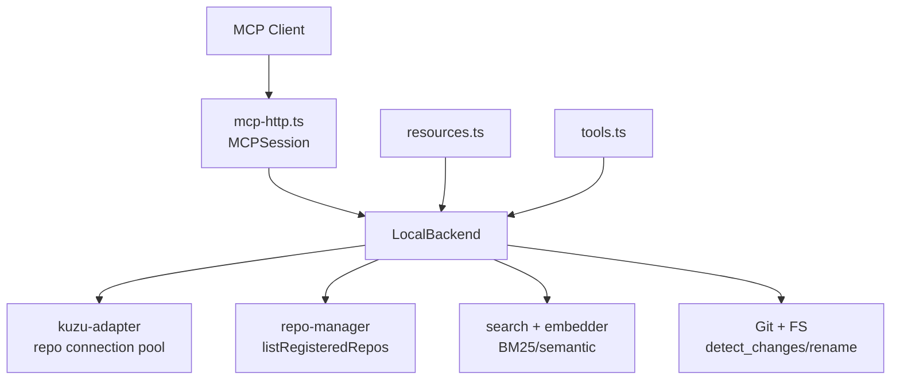
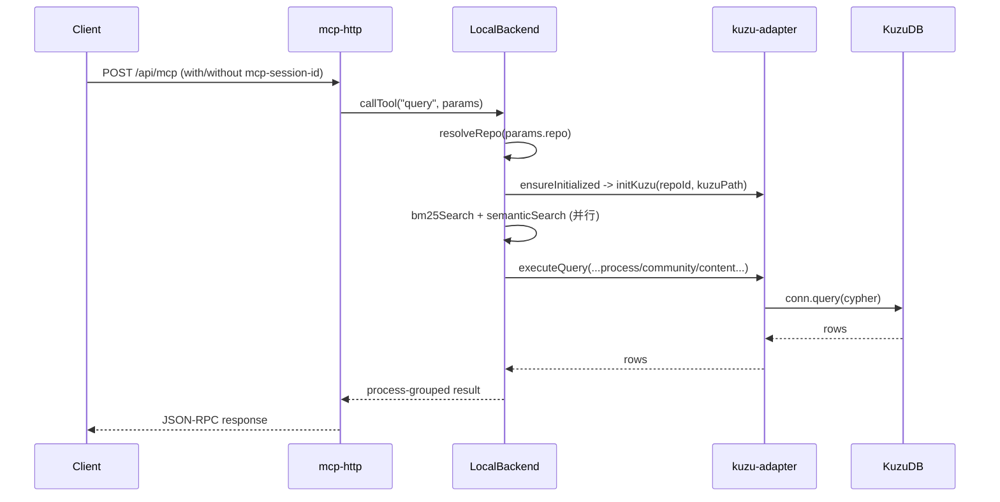

# mcp_server 模块深度解析

`mcp_server` 可以把它想象成 GitNexus 的“空中交通管制塔台”：外部 AI Agent（Claude、IDE 插件、评测框架）发来各种请求，它负责把这些请求安全地引导到正确仓库、正确查询工具、正确图数据库连接上，并把结果整理成 AI 更容易消费的形态。没有它，Agent 只能直接碰底层 Kuzu 图数据库、索引目录、Git 状态，既脆弱又难扩展。

---

## 1) 这个模块到底解决了什么问题？（先讲问题空间）

在 GitNexus 的世界里，“代码智能”不是在线实时解析，而是先由 `gitnexus analyze` 构建索引（`.gitnexus/kuzu`），然后由运行时模块读取这个索引提供能力。这里天然出现 4 个难题：

1. **协议鸿沟**：LLM/Agent 说的是 MCP 工具与资源，不是 Kuzu Cypher。
2. **并发安全鸿沟**：Kuzu `Connection` 不能并发复用；错误使用会触发崩溃风险。
3. **多仓库鸿沟**：一个 MCP server 进程可能服务多个已索引仓库，且仓库集合会动态变化。
4. **结果可用性鸿沟**：原始图查询结果对人类/LLM 都不够“任务导向”，需要转译成“流程、影响、改名建议”等语义。

`mcp_server` 的角色就是把这四条鸿沟桥接起来：
- 用 `tools.ts` 和 `resources.ts` 给出稳定的 MCP 交互面；
- 用 `local-backend.ts` 把任务意图编排成图查询/检索/文件操作；
- 用 `kuzu-adapter.ts` 把危险的 DB 并发细节收敛到连接池；
- 用 `staleness.ts` 告诉上层“你的索引可能过期了”。

**为什么不是“每个工具直接 new Connection 查询”？**
因为那会把并发安全、资源回收、仓库切换、锁冲突重试散落在每个工具里，最终导致重复逻辑和不可控故障面。当前设计把这些复杂性集中到少数组件中，牺牲了一点模块边界纯度，换来可运维性。

---

## 2) 心智模型：把它当成“三层翻译器 + 两个缓存”

### 核心抽象

- **协议层翻译器**：`MCPSession`（`mcp-http.ts`）管理 MCP HTTP 会话生命周期。
- **任务层翻译器**：`LocalBackend`（`local-backend.ts`）把工具意图翻译为具体执行流程。
- **存储层翻译器**：Kuzu 连接池（`PoolEntry` + `initKuzu/executeQuery/closeKuzu`）处理并发与生命周期。
- **元数据缓存**：`repos/contextCache/initializedRepos` 让多仓解析与轻量上下文快速返回。
- **会话缓存**：HTTP 层 `sessions` map，保证 stateful MCP transport。

可以把它想象成机场系统：
- `mcp-http` 是航站楼与登机口（接待连接、分配 session）；
- `LocalBackend` 是塔台调度（决定这架“请求”去哪个跑道/仓库、执行哪套流程）；
- `kuzu-adapter` 是跑道控制（保证同一跑道不会两架飞机同时占用）。

### 架构图（精简）



叙述上，`tools.ts`/`resources.ts` 是“菜单”，`LocalBackend` 是“后厨总调度”，`kuzu-adapter` 是“燃气与水电系统”。

---

## 3) 关键数据流（端到端）

> 说明：给定依赖图中，模块内显式调用关系主要围绕 `LocalBackend`；大量真实交互是它对外部模块（Kuzu/search/repo-manager/git）的调用。

### Flow A：一次标准 tool 调用（例如 `query`）



`query` 不是简单搜索，而是四段流水线：
1. BM25 与语义检索并行召回；
2. 用 RRF 合并排序；
3. 把命中符号映射到 `Process` 与 `Community`；
4. 输出 `processes + process_symbols + definitions`。

这体现出模块定位：它是**语义编排器**，不是纯数据库网关。

### Flow B：资源读取（例如 `gitnexus://repo/{name}/context`）

`readResource` 先 `parseUri`，再路由到 `getContextResource`。其中 `getContextResource` 会：
- 通过 `backend.resolveRepo()` 精确定位仓库；
- 通过 `backend.getContext()` 取轻量缓存；
- 调用 `checkStaleness(repoPath, lastCommit)` 注入索引新鲜度提示；
- 返回 YAML 字符串，强调“先读再调工具”的工作流。

### Flow C：并发查询与连接复用

`executeQuery` 内部 `checkout -> conn.query -> checkin`：
- 有空闲连接就直接复用；
- 没有且未达上限（`MAX_CONNS_PER_REPO=8`）则新建；
- 达上限后排队到 `waiters`。

此外还有两层回收：
- **repo 级 LRU 淘汰**（`MAX_POOL_SIZE=5`）；
- **空闲超时回收**（`IDLE_TIMEOUT_MS=5分钟`）。

这是一种偏工程实用的“受控资源池”策略：宁愿排队，也不冒连接并发踩踏的风险。

---

## 4) 关键设计决策与取舍

### 决策 A：Kuzu 以只读模式打开

在 `initKuzu` 中 `new kuzu.Database(..., readOnly=true)`。

- **收益**：
  - 多个 MCP 进程可并发读取；
  - 降低与 `gitnexus analyze` 写入时的锁冲突概率；
  - 明确职责边界：MCP 只服务查询与工作区操作，不修改图索引。
- **代价**：
  - 不能在线更新图；必须重新 analyze。

这是典型的**正确性/隔离优先于灵活写入**。

### 决策 B：`LocalBackend` 集中编排（胖后端）

`LocalBackend` 同时做 repo 解析、工具分发、Cypher 组织、Git diff、rename 落盘。

- **收益**：
  - 上层 MCP server 保持轻；
  - 工具语义集中，便于统一错误风格和兼容别名（`search/explore`）。
- **代价**：
  - 类体量大、职责边界宽，测试粒度与演进成本上升。

这是典型的**交付速度和一致性优先于纯粹分层**。

### 决策 C：`query` 采用 Hybrid（BM25 + semantic）并用 RRF 融合

- **收益**：关键词匹配与语义匹配互补，降低单一检索失真。
- **代价**：语义检索依赖 embedding 表和模型；模块用“失败静默回退 BM25”处理（`semanticSearch` catch 返回空）。

这是**可用性优先**：宁可降级，也不让工具失败。

### 决策 D：`rename` 默认 `dry_run=true`

- **收益**：避免 AI 误调用造成大面积误改。
- **代价**：多一步确认流程。

这是**安全优先**，尤其适合 Agent 场景。

### 决策 E：staleness fail-open

`checkStaleness` Git 命令失败时返回“非 stale”。
- **收益**：环境异常不阻断主流程。
- **风险**：可能隐藏“其实已过期”的状态。

这是**可用性优先**的保守选择。

---

## 5) 新贡献者最该注意的隐式契约与坑

1. **任何图查询前先 `ensureInitialized(repo.id)`**  
   否则会触发 `KuzuDB not initialized`。

2. **不要假设 `initializedRepos` 等于可用连接**  
   连接池有 idle eviction，必须结合 `isKuzuReady(repoId)`。

3. **Cypher 字符串拼接必须做转义/白名单**  
   现有代码用 `replace(/'/g, "''")`，并在语义检索里对白名单 `VALID_NODE_LABELS` 校验 label。

4. **`context` 存在歧义分支**  
   名称匹配可能返回 `status: 'ambiguous'`，调用链（例如 `rename`）必须处理这个分支。

5. **`impact` 的 `minConfidence` 默认值不一致**  
   `tools.ts` 描述写“default: 0.7”，实现里 `LocalBackend.impact()` 默认是 `0`。这是一个真实契约漂移点。

6. **`rename` 的文本搜索依赖 `rg`**  
   环境无 ripgrep 时会静默跳过增量命中，结果偏保守。

7. **`detect_changes` 是文件级映射，不是精确行级 AST diff**  
   当前实现按 changed file 去匹配 `filePath CONTAINS`，适合快速风险评估，不等价于精确语义变更分析。

8. **Kuzu native 噪音抑制是有意行为**  
   连接创建时临时覆盖 `process.stdout.write`，防止 native 输出污染 MCP stdio/stream。

---

## 子模块导航（已生成文档）

- 连接池机制与并发安全：[`kuzu_connection_pool.md`](kuzu_connection_pool.md)
- 工具编排与多仓逻辑：[`local_backend.md`](local_backend.md)
- URI 资源模型与读取路径：[`resource_system.md`](resource_system.md)
- 索引陈旧性检测：[`staleness_detection.md`](staleness_detection.md)
- MCP 工具契约定义：[`tool_definitions.md`](tool_definitions.md)
- HTTP 会话与传输：[`http_server.md`](http_server.md)

---

## 跨模块依赖关系（协作面）

- [`storage_repo_manager.md`](storage_repo_manager.md)：`LocalBackend.refreshRepos()` 通过 `listRegisteredRepos` 获取仓库注册表。
- [`core_kuzu_storage.md`](core_kuzu_storage.md)：底层图数据来源（本模块通过 Kuzu adapter 查询）。
- [`core_embeddings_and_search.md`](core_embeddings_and_search.md)：`bm25Search`、`semanticSearch` 的召回能力来源。
- [`core_ingestion_community_and_process.md`](core_ingestion_community_and_process.md)：`Community` / `Process` 节点语义由该链路产生，`query/impact/overview` 强依赖其质量。
- [`cli.md`](cli.md)：`gitnexus analyze` 是数据前置条件；没有索引就没有 MCP 可查询内容。

> 如果上游 ingestion 改了图 schema（尤其 `CodeRelation.type` 枚举、`Process/Community` 字段名），`LocalBackend` 的大量 Cypher 都会受影响。这是当前架构里最强耦合点之一。

## 实操：如何与它协作

### 启动与挂载（最小路径）

```typescript
import { LocalBackend } from './mcp/local/local-backend.js';
import { mountMCPEndpoints } from './server/mcp-http.js';
import express from 'express';

const app = express();
const backend = new LocalBackend();

await backend.init();
const cleanupMcp = mountMCPEndpoints(app, backend);

// ... app.listen(...)
// 退出时：await cleanupMcp(); await backend.disconnect();
```

### 新增工具时的建议切入点

1. 在 `tools.ts` 增加 `GITNEXUS_TOOLS` 定义（名称、描述、schema）。  
2. 在 `LocalBackend.callTool()` 的 `switch` 注册分发。  
3. 在 `LocalBackend` 内实现方法，复用 `resolveRepo + ensureInitialized + executeQuery`。  
4. 如需“只读导航型内容”，优先考虑加资源（`resources.ts`）而非工具。  
5. 若工具语义可被 LLM 误用，默认做保守策略（类似 `rename` 的 `dry_run=true`）。

### 运行时配置与容量参数（来自源码常量）

- Kuzu 连接池：
  - `MAX_POOL_SIZE = 5`
  - `IDLE_TIMEOUT_MS = 5 * 60 * 1000`
  - `MAX_CONNS_PER_REPO = 8`
  - `INITIAL_CONNS_PER_REPO = 2`
  - `LOCK_RETRY_ATTEMPTS = 3`
  - `LOCK_RETRY_DELAY_MS = 2000`
- HTTP 会话：
  - `SESSION_TTL_MS = 30 * 60 * 1000`
  - `CLEANUP_INTERVAL_MS = 5 * 60 * 1000`

---

## 子模块摘要（带链接）

### 1. Kuzu 连接池子模块
`kuzu-adapter.ts` 的核心是 `PoolEntry` 与 `initKuzu/executeQuery/closeKuzu/isKuzuReady`。它把“连接不可并发复用”的底层限制转换为可预测的 checkout/checkin 行为，并通过 LRU + idle timeout 控制进程资源。详见 [kuzu_connection_pool.md](kuzu_connection_pool.md)。

### 2. 本地后端子模块
`LocalBackend` 是工具语义的中心实现，负责多仓解析、懒初始化、检索融合、影响分析、重命名编排与资源直查接口。它是模块中最强的业务中枢。详见 [local_backend.md](local_backend.md)。

### 3. 资源子模块
`ResourceDefinition` / `ResourceTemplate` + `readResource()` 形成 URI 读取模型，强调“可发现、可寻址、可直接给 LLM 阅读”的结构化内容。详见 [resource_system.md](resource_system.md)。

### 4. 陈旧性检测子模块
`checkStaleness()` 给资源层注入“索引落后 HEAD 的提示”，避免 Agent 在旧图谱上过度自信推断。详见 [staleness_detection.md](staleness_detection.md)。

### 5. 工具契约子模块
`ToolDefinition` 与 `GITNEXUS_TOOLS` 是对外契约面，描述中包含显式使用指导（WHEN TO USE / AFTER THIS），本质上是给 LLM 的行为约束提示。详见 [tool_definitions.md](tool_definitions.md)。

### 6. HTTP 会话子模块
`mountMCPEndpoints()` + `MCPSession` 管理 StreamableHTTP 的有状态会话，含 TTL 清理与失效会话错误返回。详见 [http_server.md](http_server.md)。

---

## 相关模块文档

- [storage_repo_manager.md](storage_repo_manager.md)
- [core_kuzu_storage.md](core_kuzu_storage.md)
- [core_embeddings_and_search.md](core_embeddings_and_search.md)
- [core_ingestion_community_and_process.md](core_ingestion_community_and_process.md)
- [cli.md](cli.md)
